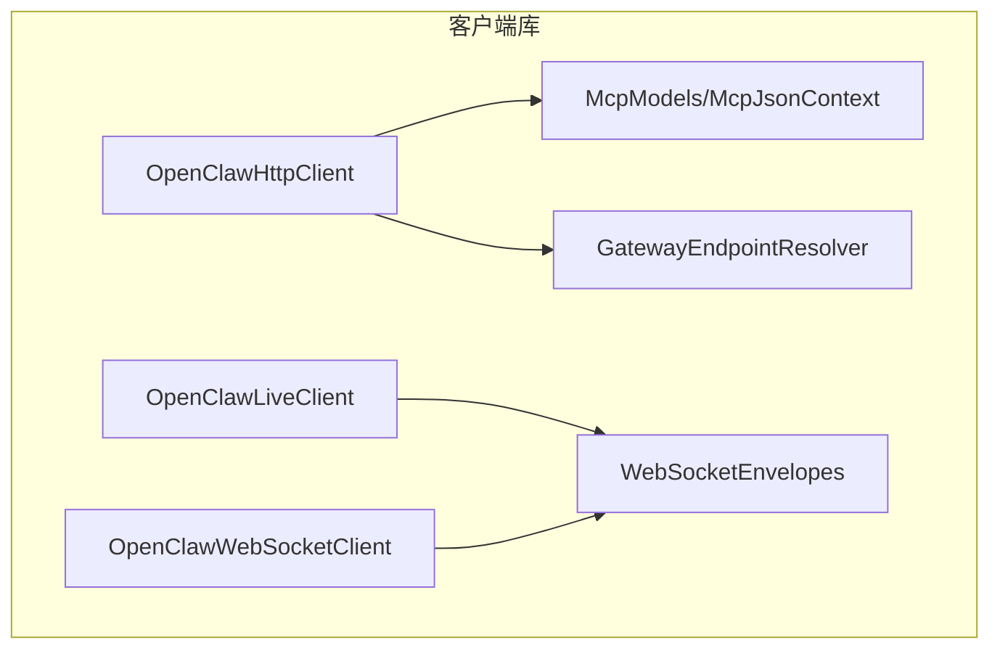
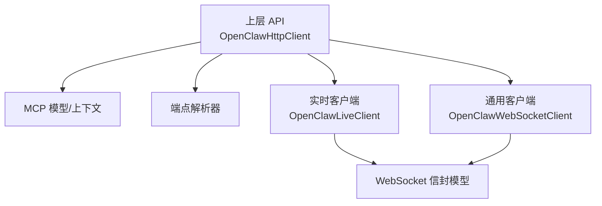
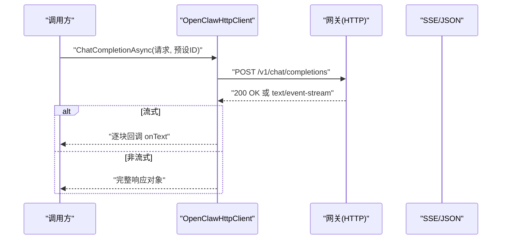
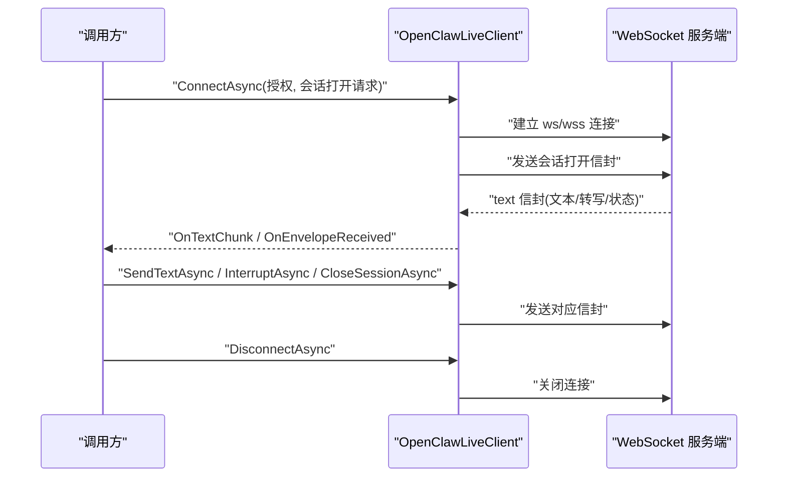
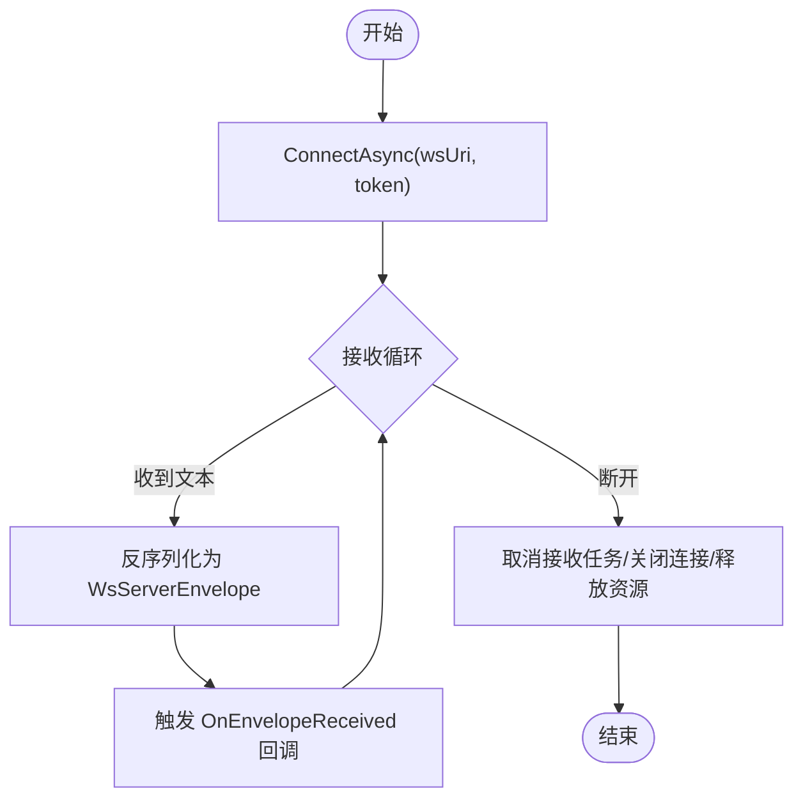
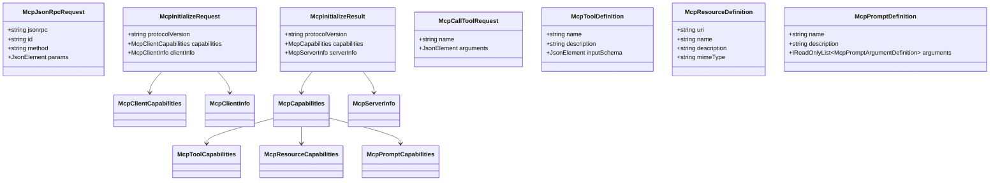
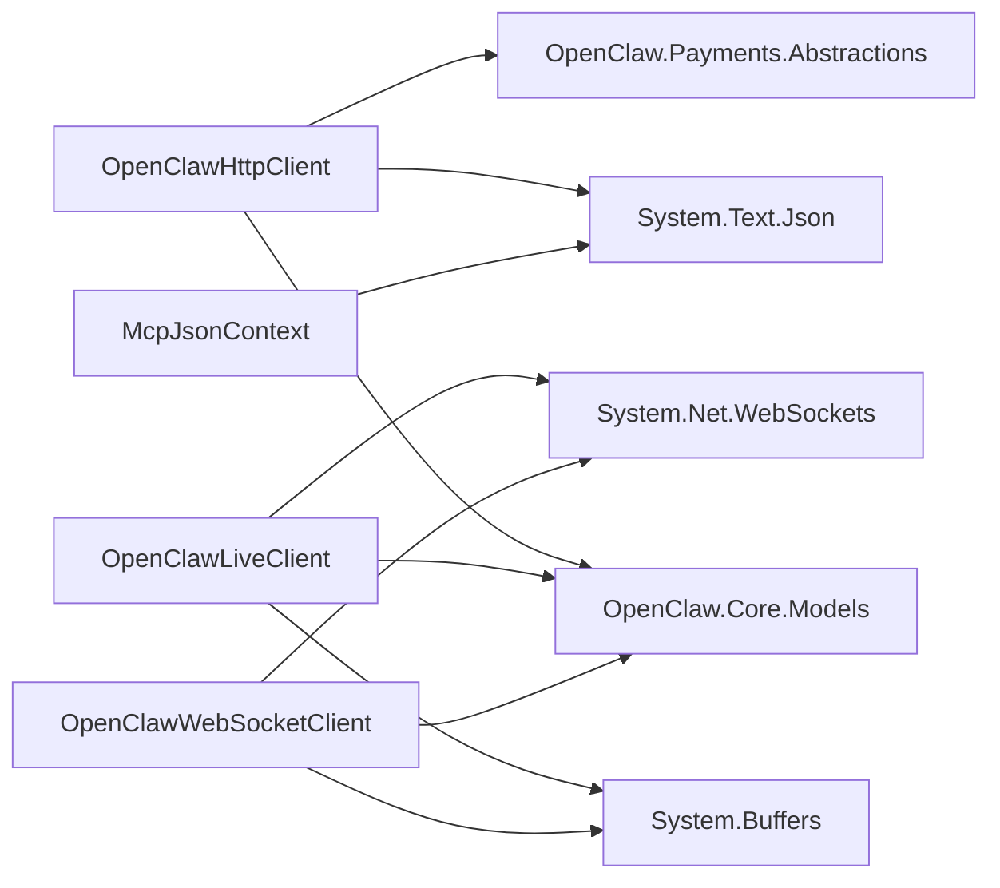

# 客户端库

<cite>
**本文引用的文件**
- [OpenClaw.Client.csproj](file://src/OpenClaw.Client/OpenClaw.Client.csproj)
- [McpModels.cs](file://src/OpenClaw.Client/McpModels.cs)
- [McpJsonContext.cs](file://src/OpenClaw.Client/McpJsonContext.cs)
- [GatewayEndpointResolver.cs](file://src/OpenClaw.Client/GatewayEndpointResolver.cs)
- [OpenClawHttpClient.cs](file://src/OpenClaw.Client/OpenClawHttpClient.cs)
- [OpenClawLiveClient.cs](file://src/OpenClaw.Client/OpenClawLiveClient.cs)
- [OpenClawWebSocketClient.cs](file://src/OpenClaw.Client/OpenClawWebSocketClient.cs)
- [WebSocketEnvelopes.cs](file://src/OpenClaw.Core/Models/WebSocketEnvelopes.cs)
- [OpenClawLiveClientTests.cs](file://src/OpenClaw.Tests/OpenClawLiveClientTests.cs)
- [OpenClawWebSocketClientTests.cs](file://src/OpenClaw.Tests/OpenClawWebSocketClientTests.cs)
</cite>

## 目录
1. [简介](#简介)
2. [项目结构](#项目结构)
3. [核心组件](#核心组件)
4. [架构总览](#架构总览)
5. [详细组件分析](#详细组件分析)
6. [依赖关系分析](#依赖关系分析)
7. [性能考量](#性能考量)
8. [故障排查指南](#故障排查指南)
9. [结论](#结论)
10. [附录](#附录)

## 简介
本文件为 OpenClaw.NET 客户端库的技术文档，面向希望在应用中集成 OpenClaw 能力的开发者。文档覆盖以下主题：
- 客户端库架构与职责边界
- 连接管理与通信协议（HTTP、SSE、WebSocket）
- 实时客户端、WebSocket 客户端与 HTTP 客户端的用途与实现差异
- MCP 模型定义、端点解析机制与请求封装
- 客户端集成指南、错误处理与重试策略、性能优化建议
- 常见使用场景与示例路径

## 项目结构
客户端库位于 src/OpenClaw.Client，核心文件包括：
- OpenClawHttpClient：基于 HttpClient 的 HTTP/SSE 客户端，提供对网关 REST API 与 MCP 的统一访问
- OpenClawLiveClient：面向实时语音/文本交互的 WebSocket 客户端
- OpenClawWebSocketClient：通用 WebSocket 客户端，支持消息编解码与事件回调
- McpModels.cs/McpJsonContext.cs：MCP 协议的数据模型与源生成上下文
- GatewayEndpointResolver.cs：将任意服务地址解析为 HTTP 基础 URL 的工具
- WebSocketEnvelopes.cs：WebSocket 信封模型（WsClientEnvelope/WsServerEnvelope）

图表来源
- [OpenClawHttpClient.cs:10-182](file://src/OpenClaw.Client/OpenClawHttpClient.cs#L10-L182)
- [OpenClawLiveClient.cs:9-58](file://src/OpenClaw.Client/OpenClawLiveClient.cs#L9-L58)
- [OpenClawWebSocketClient.cs:9-57](file://src/OpenClaw.Client/OpenClawWebSocketClient.cs#L9-L57)
- [McpModels.cs:1-187](file://src/OpenClaw.Client/McpModels.cs#L1-L187)
- [McpJsonContext.cs:1-39](file://src/OpenClaw.Client/McpJsonContext.cs#L1-L39)
- [GatewayEndpointResolver.cs:1-39](file://src/OpenClaw.Client/GatewayEndpointResolver.cs#L1-L39)
- [WebSocketEnvelopes.cs:1-109](file://src/OpenClaw.Core/Models/WebSocketEnvelopes.cs#L1-L109)

章节来源
- [OpenClaw.Client.csproj:1-16](file://src/OpenClaw.Client/OpenClaw.Client.csproj#L1-L16)

## 核心组件
- OpenClawHttpClient
  - 职责：封装 HTTP/SSE 请求，统一处理认证头、预设参数头、SSE 流式响应、MCP over HTTP、分页查询与 URI 构造
  - 关键能力：聊天补全、流式聊天补全、MCP initialize/tools/resources/prompts 调用、会话与记忆管理、自动化/工作流/支付等 API 访问
- OpenClawLiveClient
  - 职责：实时语音/文本交互的 WebSocket 客户端，负责连接、发送文本/音频、中断、关闭会话与接收服务端信封
  - 关键能力：线程安全发送锁、最大消息大小限制、接收循环与异常隔离
- OpenClawWebSocketClient
  - 职责：通用 WebSocket 客户端，支持用户消息发送、事件回调与错误处理
  - 关键能力：发送锁、最大消息大小限制、接收循环与异常隔离
- MCP 模型与上下文
  - 职责：定义 MCP JSON-RPC 请求/响应、初始化结果、工具/资源/提示列表、调用结果等
  - 关键能力：通过源生成上下文提升序列化性能
- 端点解析器
  - 职责：从任意服务器地址推导出对应的 HTTP 基础 URL，兼容 ws/wss/http/https 及 /ws 路径
- WebSocket 信封模型
  - 职责：定义客户端与服务端之间的消息结构，支持类型化字段与可选扩展

章节来源
- [OpenClawHttpClient.cs:10-182](file://src/OpenClaw.Client/OpenClawHttpClient.cs#L10-L182)
- [OpenClawLiveClient.cs:9-58](file://src/OpenClaw.Client/OpenClawLiveClient.cs#L9-L58)
- [OpenClawWebSocketClient.cs:9-57](file://src/OpenClaw.Client/OpenClawWebSocketClient.cs#L9-L57)
- [McpModels.cs:1-187](file://src/OpenClaw.Client/McpModels.cs#L1-L187)
- [McpJsonContext.cs:1-39](file://src/OpenClaw.Client/McpJsonContext.cs#L1-L39)
- [GatewayEndpointResolver.cs:1-39](file://src/OpenClaw.Client/GatewayEndpointResolver.cs#L1-L39)
- [WebSocketEnvelopes.cs:1-109](file://src/OpenClaw.Core/Models/WebSocketEnvelopes.cs#L1-L109)

## 架构总览
客户端库采用“分层职责 + 统一上下文”的设计：
- 上层：OpenClawHttpClient 提供高层 API（聊天、MCP、会话、记忆、自动化等）
- 中层：MCP 模型与上下文、端点解析器
- 下层：OpenClawLiveClient/OpenClawWebSocketClient 提供底层连接与传输
- 共享：WebSocket 信封模型用于 WebSocket 通信

图表来源
- [OpenClawHttpClient.cs:10-182](file://src/OpenClaw.Client/OpenClawHttpClient.cs#L10-L182)
- [OpenClawLiveClient.cs:9-58](file://src/OpenClaw.Client/OpenClawLiveClient.cs#L9-L58)
- [OpenClawWebSocketClient.cs:9-57](file://src/OpenClaw.Client/OpenClawWebSocketClient.cs#L9-L57)
- [McpModels.cs:1-187](file://src/OpenClaw.Client/McpModels.cs#L1-L187)
- [McpJsonContext.cs:1-39](file://src/OpenClaw.Client/McpJsonContext.cs#L1-L39)
- [GatewayEndpointResolver.cs:1-39](file://src/OpenClaw.Client/GatewayEndpointResolver.cs#L1-L39)
- [WebSocketEnvelopes.cs:1-109](file://src/OpenClaw.Core/Models/WebSocketEnvelopes.cs#L1-L109)

## 详细组件分析

### OpenClawHttpClient：HTTP/SSE 客户端
- 初始化与认证
  - 接收基础 URL 与可选 Bearer Token，默认设置 User-Agent
  - 预构建大量 API URI（聊天补全、MCP、会话、记忆、自动化、工作流、支付等）
- 聊天补全
  - 支持普通 POST 与 text/event-stream 流式返回
  - 支持预设参数头 X-OpenClaw-Preset
- MCP over HTTP
  - 封装 JSON-RPC 请求，自动分配 id，解析响应或 SSE 数据行
  - 对错误进行标准化抛出
- 会话与记忆
  - 列表、搜索、详情、时间线、导入/导出、手把手交接等
- 自动化与工作流
  - 模板、运行、回放、 Quarantine 清理、状态查询
- 支付与运营
  - 虚拟卡签发、机器支付执行、状态查询、审计导出、轨迹导出等

图表来源
- [OpenClawHttpClient.cs:190-260](file://src/OpenClaw.Client/OpenClawHttpClient.cs#L190-L260)

章节来源
- [OpenClawHttpClient.cs:10-182](file://src/OpenClaw.Client/OpenClawHttpClient.cs#L10-L182)
- [OpenClawHttpClient.cs:1244-1340](file://src/OpenClaw.Client/OpenClawHttpClient.cs#L1244-L1340)
- [OpenClawHttpClient.cs:1253-1306](file://src/OpenClaw.Client/OpenClawHttpClient.cs#L1253-L1306)
- [OpenClawHttpClient.cs:1308-1325](file://src/OpenClaw.Client/OpenClawHttpClient.cs#L1308-L1325)

### OpenClawLiveClient：实时 WebSocket 客户端
- 连接与握手
  - 根据基础 URL 推导 wss/ws 地址，建立连接后发送会话打开信封
- 发送
  - 文本/音频/中断/关闭会话，内部带发送锁与大小校验
- 接收
  - 接收循环，按结束标记聚合消息，反序列化为 LiveServerEnvelope，分发文本块与完整信封
- 断开
  - 取消接收任务、等待在途发送完成、正常关闭并释放资源

图表来源
- [OpenClawLiveClient.cs:60-123](file://src/OpenClaw.Client/OpenClawLiveClient.cs#L60-L123)
- [OpenClawLiveClient.cs:185-210](file://src/OpenClaw.Client/OpenClawLiveClient.cs#L185-L210)
- [OpenClawLiveClient.cs:212-282](file://src/OpenClaw.Client/OpenClawLiveClient.cs#L212-L282)

章节来源
- [OpenClawLiveClient.cs:9-58](file://src/OpenClaw.Client/OpenClawLiveClient.cs#L9-L58)
- [OpenClawLiveClient.cs:185-282](file://src/OpenClaw.Client/OpenClawLiveClient.cs#L185-L282)

### OpenClawWebSocketClient：通用 WebSocket 客户端
- 与实时客户端类似，但面向更通用的消息场景
- 支持用户消息发送、事件回调与错误处理
- 内部同样具备发送锁、最大消息大小限制与健壮的接收循环

图表来源
- [OpenClawWebSocketClient.cs:38-117](file://src/OpenClaw.Client/OpenClawWebSocketClient.cs#L38-L117)
- [OpenClawWebSocketClient.cs:158-227](file://src/OpenClaw.Client/OpenClawWebSocketClient.cs#L158-L227)

章节来源
- [OpenClawWebSocketClient.cs:9-57](file://src/OpenClaw.Client/OpenClawWebSocketClient.cs#L9-L57)
- [OpenClawWebSocketClient.cs:158-227](file://src/OpenClaw.Client/OpenClawWebSocketClient.cs#L158-L227)

### MCP 模型与端点解析
- MCP 模型
  - JSON-RPC 请求/响应、初始化请求/结果、能力声明、工具/资源/提示定义与调用结果
  - 通过 McpJsonContext 源生成提升序列化性能
- 端点解析
  - 将 ws/wss/http/https 与 /ws 路径转换为正确的 HTTP 基础 URL，便于 HTTP/SSE/MCP 使用

图表来源
- [McpModels.cs:5-187](file://src/OpenClaw.Client/McpModels.cs#L5-L187)
- [McpJsonContext.cs:5-38](file://src/OpenClaw.Client/McpJsonContext.cs#L5-L38)

章节来源
- [McpModels.cs:1-187](file://src/OpenClaw.Client/McpModels.cs#L1-L187)
- [McpJsonContext.cs:1-39](file://src/OpenClaw.Client/McpJsonContext.cs#L1-L39)
- [GatewayEndpointResolver.cs:1-39](file://src/OpenClaw.Client/GatewayEndpointResolver.cs#L1-L39)

### WebSocket 信封模型
- WsClientEnvelope：客户端发送的结构化消息，支持多种类型（如 user_message、tool_approval 等）
- WsServerEnvelope：服务端返回的结构化消息，包含文本、会话信息、审批状态、工件与阶段门事件等

章节来源
- [WebSocketEnvelopes.cs:7-48](file://src/OpenClaw.Core/Models/WebSocketEnvelopes.cs#L7-L48)
- [WebSocketEnvelopes.cs:53-108](file://src/OpenClaw.Core/Models/WebSocketEnvelopes.cs#L53-L108)

## 依赖关系分析
- OpenClawHttpClient 依赖
  - OpenClaw.Core.Models：用于 JSON 序列化上下文与核心数据模型
  - OpenClaw.Payments.Abstractions：支付相关接口与模型
  - System.Text.Json：高性能序列化
- OpenClawLiveClient/OpenClawWebSocketClient 依赖
  - System.Net.WebSockets：WebSocket 连接与收发
  - System.Buffers：缓冲区复用与内存池
  - OpenClaw.Core.Models：WebSocket 信封模型
- McpJsonContext 依赖
  - System.Text.Json.Serialization：源生成特性

图表来源
- [OpenClaw.Client.csproj:11-14](file://src/OpenClaw.Client/OpenClaw.Client.csproj#L11-L14)
- [OpenClawHttpClient.cs:1-8](file://src/OpenClaw.Client/OpenClawHttpClient.cs#L1-L8)
- [OpenClawLiveClient.cs:1-6](file://src/OpenClaw.Client/OpenClawLiveClient.cs#L1-L6)
- [OpenClawWebSocketClient.cs:1-6](file://src/OpenClaw.Client/OpenClawWebSocketClient.cs#L1-L6)
- [McpJsonContext.cs:1-39](file://src/OpenClaw.Client/McpJsonContext.cs#L1-L39)

章节来源
- [OpenClaw.Client.csproj:1-16](file://src/OpenClaw.Client/OpenClaw.Client.csproj#L1-L16)

## 性能考量
- 源生成序列化
  - 使用 McpJsonContext 与 CoreJsonContext 的源生成上下文，减少反射开销，提升 JSON 往返性能
- 流式处理
  - SSE 流式聊天补全与事件流采用流式读取，避免一次性加载大块内容
- 缓冲与内存池
  - WebSocket 接收循环使用 ArrayPool<byte> 与 ArrayBufferWriter<byte>，降低 GC 压力
- 最大消息大小限制
  - Live 与通用 WebSocket 客户端均内置最大消息字节限制，防止内存溢出
- 连接复用
  - OpenClawHttpClient 复用单个 HttpClient 实例（可由外部传入），减少连接建立成本

章节来源
- [McpJsonContext.cs:34-38](file://src/OpenClaw.Client/McpJsonContext.cs#L34-L38)
- [OpenClawHttpClient.cs:1244-1340](file://src/OpenClaw.Client/OpenClawHttpClient.cs#L1244-L1340)
- [OpenClawLiveClient.cs:212-282](file://src/OpenClaw.Client/OpenClawLiveClient.cs#L212-L282)
- [OpenClawWebSocketClient.cs:158-227](file://src/OpenClaw.Client/OpenClawWebSocketClient.cs#L158-L227)

## 故障排查指南
- HTTP 错误
  - 当响应非成功状态码时，CreateHttpErrorAsync 会构造包含状态码与响应体的异常；若响应体过大，仅截取前 8000 字符
- SSE 解析错误
  - 若 SSE 数据行无法解析，抛出包含原始数据片段的异常
- WebSocket 异常
  - 接收循环捕获异常并通过 OnError 回调通知，同时继续运行以保证健壮性
- 连接断开与发送竞态
  - DisconnectAsync 会等待在途发送完成后再关闭连接，避免半包或丢失
- 端点解析失败
  - GatewayEndpointResolver 会对非法 URL 返回 false；请确保传入绝对 URL 并符合预期 scheme

章节来源
- [OpenClawHttpClient.cs:1930-1950](file://src/OpenClaw.Client/OpenClawHttpClient.cs#L1930-L1950)
- [OpenClawLiveClient.cs:274-282](file://src/OpenClaw.Client/OpenClawLiveClient.cs#L274-L282)
- [OpenClawWebSocketClient.cs:219-227](file://src/OpenClaw.Client/OpenClawWebSocketClient.cs#L219-L227)
- [OpenClawLiveClientTests.cs:8-58](file://src/OpenClaw.Tests/OpenClawLiveClientTests.cs#L8-L58)
- [OpenClawWebSocketClientTests.cs:6-58](file://src/OpenClaw.Tests/OpenClawWebSocketClientTests.cs#L6-L58)
- [GatewayEndpointResolver.cs:5-37](file://src/OpenClaw.Client/GatewayEndpointResolver.cs#L5-L37)

## 结论
客户端库通过清晰的职责划分与统一的上下文，为上层提供了简洁一致的 API。HTTP/SSE 适合大多数 REST 与流式场景，WebSocket 客户端则满足实时交互需求。MCP 模型与端点解析器进一步提升了跨协议的一致性与可维护性。结合源生成与流式处理，整体具备良好的性能与可靠性。

## 附录

### 客户端集成指南
- 基础配置
  - 创建 OpenClawHttpClient，传入网关基础 URL 与可选 Bearer Token
  - 如需自定义 HttpClient（例如超时、代理、证书策略），可传入外部实例
- 聊天补全
  - 使用 ChatCompletionAsync 获取一次性响应
  - 使用 StreamChatCompletionAsync 获取流式增量文本
- MCP 调用
  - InitializeMcpAsync 初始化会话能力
  - ListMcpTools/ListMcpResources/ListMcpPrompts 获取清单
  - CallMcpToolAsync 调用工具，参数为 JsonElement
- 实时交互
  - 使用 OpenClawLiveClient.ConnectAsync 建立连接
  - 通过 SendTextAsync/SendAudioAsync 发送输入，监听 OnTextChunk 与 OnEnvelopeReceived
  - 使用 InterruptAsync/CloseSessionAsync 控制对话流程
- 通用 WebSocket
  - 使用 OpenClawWebSocketClient.ConnectAsync 建立连接
  - 通过 SendUserMessageAsync 发送消息，监听 OnEnvelopeReceived 与 OnTextMessage

章节来源
- [OpenClawHttpClient.cs:91-182](file://src/OpenClaw.Client/OpenClawHttpClient.cs#L91-L182)
- [OpenClawHttpClient.cs:190-320](file://src/OpenClaw.Client/OpenClawHttpClient.cs#L190-L320)
- [OpenClawLiveClient.cs:60-123](file://src/OpenClaw.Client/OpenClawLiveClient.cs#L60-L123)
- [OpenClawWebSocketClient.cs:38-129](file://src/OpenClaw.Client/OpenClawWebSocketClient.cs#L38-L129)

### 错误重试策略
- 建议
  - 对幂等的 HTTP 请求（如 GET）在业务层进行有限次数重试（指数退避）
  - 对非幂等请求（如 POST）谨慎重试，必要时引入去重与幂等键
  - WebSocket 层面，断线后由上层决定是否重建连接；Live/通用客户端已内置断开等待在途发送完成的逻辑
- 参考
  - HTTP 错误统一通过异常抛出，便于上层捕获与决策

章节来源
- [OpenClawHttpClient.cs:1930-1950](file://src/OpenClaw.Client/OpenClawHttpClient.cs#L1930-L1950)
- [OpenClawLiveClient.cs:125-183](file://src/OpenClaw.Client/OpenClawLiveClient.cs#L125-L183)
- [OpenClawWebSocketClient.cs:59-117](file://src/OpenClaw.Client/OpenClawWebSocketClient.cs#L59-L117)

### 常见使用场景
- 实时语音/文本对话
  - 使用 OpenClawLiveClient，发送文本/音频，监听增量文本与服务端信封
- 流式聊天补全
  - 使用 OpenClawHttpClient.StreamChatCompletionAsync，逐块消费增量输出
- MCP 工具链集成
  - 使用 OpenClawHttpClient.InitializeMcpAsync 与 CallMcpToolAsync，结合 List* APIs 管理工具/资源/提示
- 会话与记忆管理
  - 使用 OpenClawHttpClient 的会话与记忆 API，实现检索、导入/导出与手把手交接

章节来源
- [OpenClawLiveClient.cs:89-123](file://src/OpenClaw.Client/OpenClawLiveClient.cs#L89-L123)
- [OpenClawHttpClient.cs:204-260](file://src/OpenClaw.Client/OpenClawHttpClient.cs#L204-L260)
- [OpenClawHttpClient.cs:262-320](file://src/OpenClaw.Client/OpenClawHttpClient.cs#L262-L320)
- [OpenClawHttpClient.cs:517-662](file://src/OpenClaw.Client/OpenClawHttpClient.cs#L517-L662)