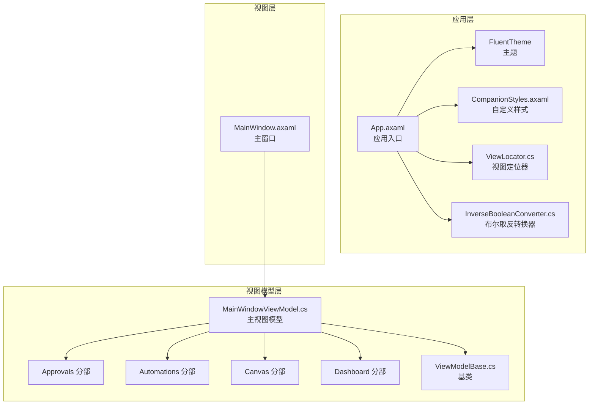
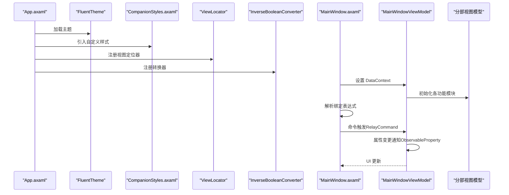
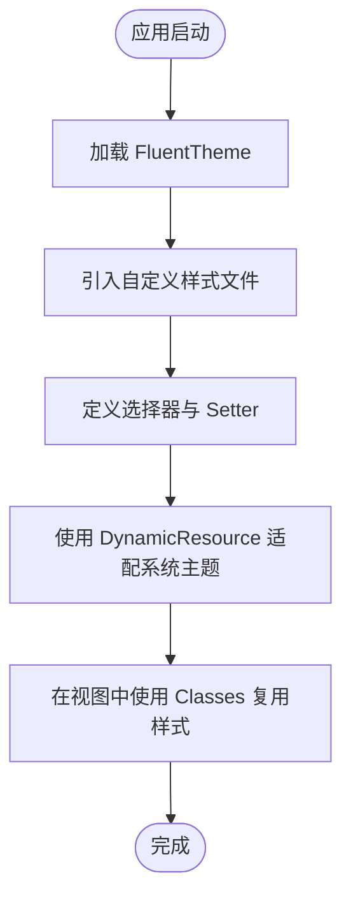
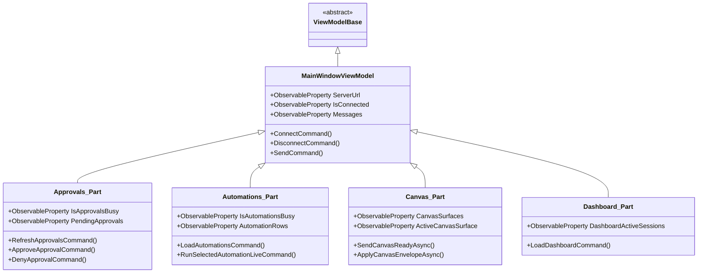
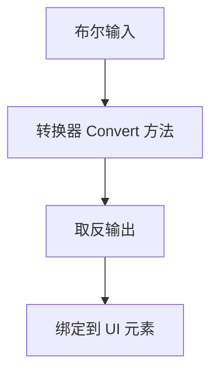
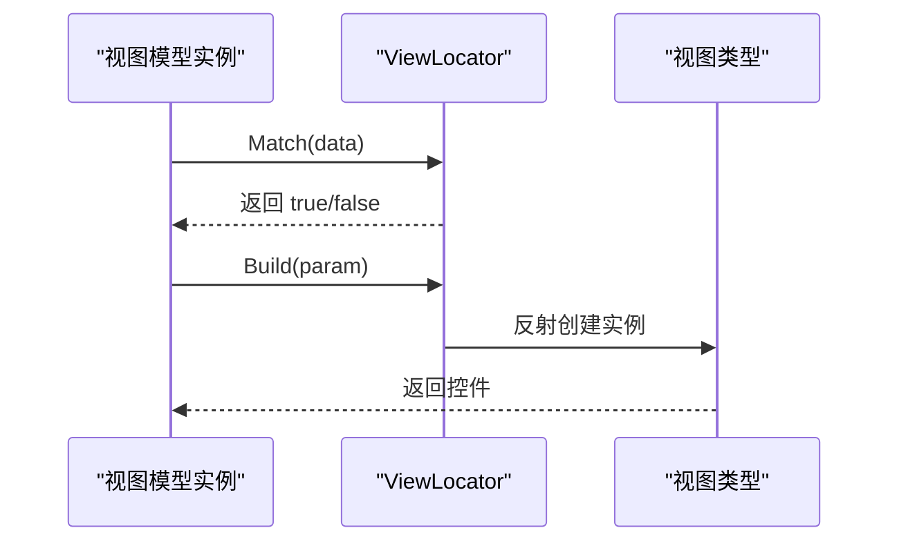
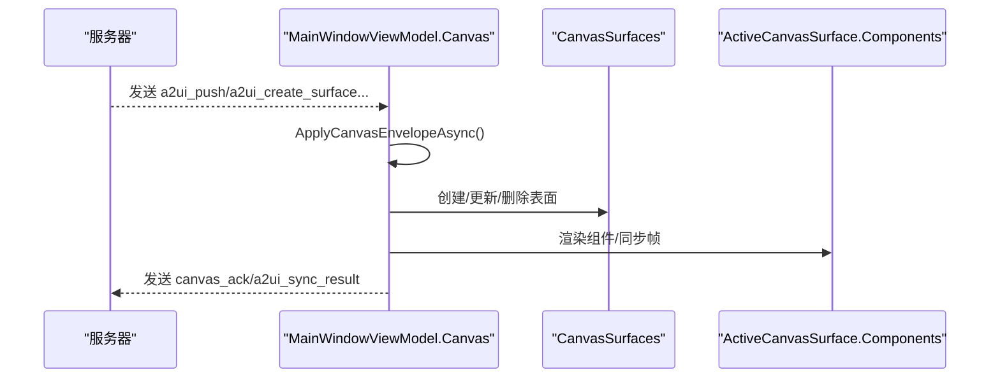
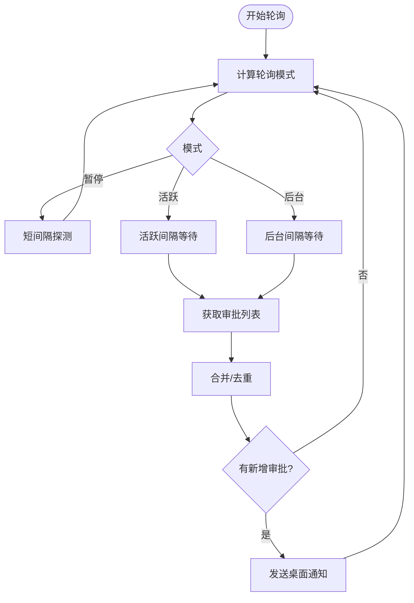
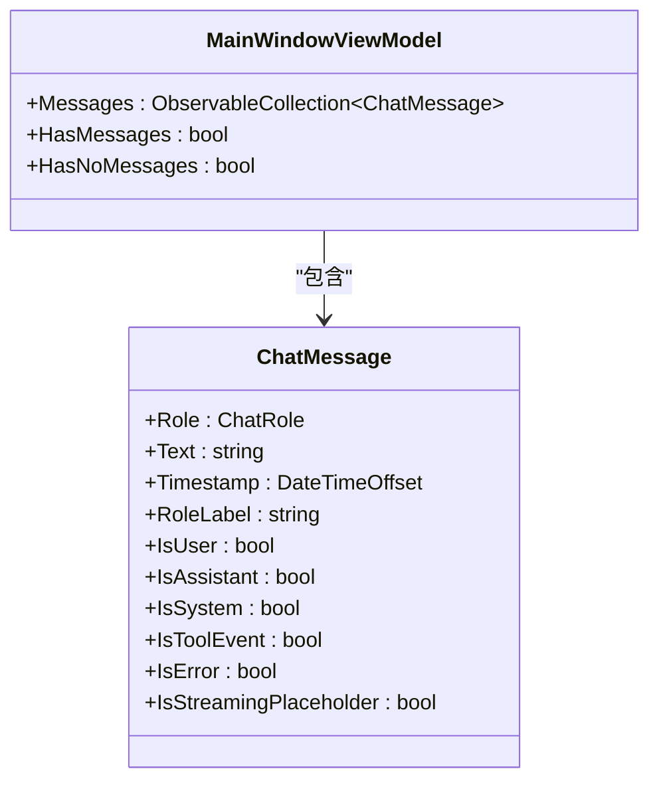
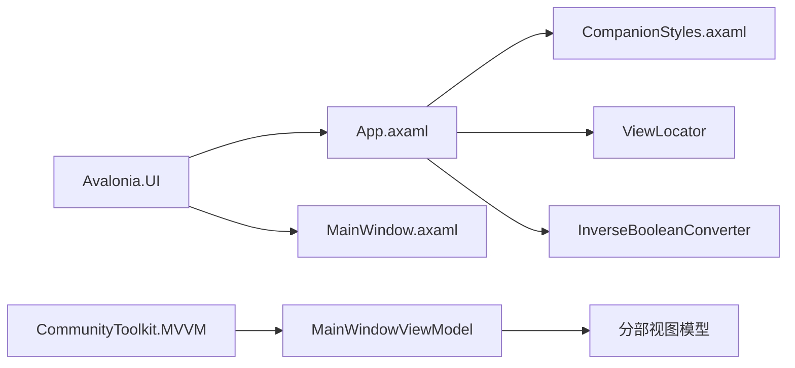

# UI组件

<cite>
**本文引用的文件**
- [App.axaml](file://src/OpenClaw.Companion/App.axaml)
- [CompanionStyles.axaml](file://src/OpenClaw.Companion/Styles/CompanionStyles.axaml)
- [InverseBooleanConverter.cs](file://src/OpenClaw.Companion/Converters/InverseBooleanConverter.cs)
- [ViewLocator.cs](file://src/OpenClaw.Companion/ViewLocator.cs)
- [MainWindowViewModel.cs](file://src/OpenClaw.Companion/ViewModels/MainWindowViewModel.cs)
- [MainWindowViewModel.Approvals.cs](file://src/OpenClaw.Companion/ViewModels/MainWindowViewModel.Approvals.cs)
- [MainWindowViewModel.Automations.cs](file://src/OpenClaw.Companion/ViewModels/MainWindowViewModel.Automations.cs)
- [MainWindowViewModel.Canvas.cs](file://src/OpenClaw.Companion/ViewModels/MainWindowViewModel.Canvas.cs)
- [MainWindowViewModel.Dashboard.cs](file://src/OpenClaw.Companion/ViewModels/MainWindowViewModel.Dashboard.cs)
- [MainWindow.axaml](file://src/OpenClaw.Companion/Views/MainWindow.axaml)
- [ChatMessage.cs](file://src/OpenClaw.Companion/Models/ChatMessage.cs)
- [CompanionSettings.cs](file://src/OpenClaw.Companion/Models/CompanionSettings.cs)
</cite>

## 目录
1. [简介](#简介)
2. [项目结构](#项目结构)
3. [核心组件](#核心组件)
4. [架构总览](#架构总览)
5. [详细组件分析](#详细组件分析)
6. [依赖关系分析](#依赖关系分析)
7. [性能考虑](#性能考虑)
8. [故障排查指南](#故障排查指南)
9. [结论](#结论)
10. [附录](#附录)

## 简介
本文件面向桌面客户端UI组件，聚焦于样式系统与主题定制、MVVM模式与命令实现、数据转换器与绑定表达式、以及组件复用与响应式设计。通过Avalonia UI与CommunityToolkit.MVVM的组合，项目实现了从应用启动、资源与样式加载、到视图与视图模型的数据绑定、再到命令驱动的交互流程。本文将对样式系统（含Fluent主题与自定义样式）、主题变体（深浅色）与动态资源、MVVM继承体系（ObservableObject/ViewModelBase）、命令（RelayCommand）与属性变更通知、数据转换器（IValueConverter）与视图定位器（IDataTemplate）进行深入解析，并给出组件复用策略与响应式设计建议。

## 项目结构
- 应用入口与资源
  - 应用级资源在 Application 节点下集中声明，包括数据模板（ViewLocator）与样式（FluentTheme + 自定义样式文件）。
  - 主题变体通过 RequestedThemeVariant 控制，支持跟随系统、浅色或深色。
- 视图层
  - MainWindow.axaml 定义了主窗口布局与控件集合，大量使用样式类（如 page-title、section-card、badge 等）与绑定表达式。
- 视图模型层
  - MainWindowViewModel 及其分部文件（Approvals、Automations、Canvas、Dashboard 等）实现业务逻辑、命令与状态管理。
  - ViewModelBase 继承 ObservableObject，提供属性变更通知能力。
- 样式与转换器
  - 自定义样式文件定义通用样式类；转换器用于布尔值取反；视图定位器根据命名约定自动匹配视图与视图模型。

**图表来源**
- [App.axaml:1-22](file://src/OpenClaw.Companion/App.axaml#L1-L22)
- [CompanionStyles.axaml:1-73](file://src/OpenClaw.Companion/Styles/CompanionStyles.axaml#L1-L73)
- [ViewLocator.cs:1-38](file://src/OpenClaw.Companion/ViewLocator.cs#L1-L38)
- [InverseBooleanConverter.cs:1-15](file://src/OpenClaw.Companion/Converters/InverseBooleanConverter.cs#L1-L15)
- [MainWindow.axaml:1-501](file://src/OpenClaw.Companion/Views/MainWindow.axaml#L1-L501)
- [MainWindowViewModel.cs:1-701](file://src/OpenClaw.Companion/ViewModels/MainWindowViewModel.cs#L1-L701)
- [MainWindowViewModel.Approvals.cs:1-594](file://src/OpenClaw.Companion/ViewModels/MainWindowViewModel.Approvals.cs#L1-L594)
- [MainWindowViewModel.Automations.cs:1-354](file://src/OpenClaw.Companion/ViewModels/MainWindowViewModel.Automations.cs#L1-L354)
- [MainWindowViewModel.Canvas.cs:1-596](file://src/OpenClaw.Companion/ViewModels/MainWindowViewModel.Canvas.cs#L1-L596)
- [MainWindowViewModel.Dashboard.cs:1-125](file://src/OpenClaw.Companion/ViewModels/MainWindowViewModel.Dashboard.cs#L1-L125)
- [ViewModelBase.cs:1-8](file://src/OpenClaw.Companion/ViewModels/ViewModelBase.cs#L1-L8)

**章节来源**
- [App.axaml:1-22](file://src/OpenClaw.Companion/App.axaml#L1-L22)
- [MainWindow.axaml:1-501](file://src/OpenClaw.Companion/Views/MainWindow.axaml#L1-L501)

## 核心组件
- 样式系统与主题定制
  - 使用 FluentTheme 作为默认主题，结合自定义样式文件定义页面标题、卡片、徽章、按钮等通用样式类。
  - 动态资源（DynamicResource）用于与系统主题联动，例如背景色、前景色等。
  - 主题变体通过 Application.RequestedThemeVariant 设置，可选择跟随系统、浅色或深色。
- MVVM 模式与命令
  - ViewModelBase 继承 ObservableObject，提供属性变更通知。
  - MainWindowViewModel 使用 [ObservableProperty] 声明可观察属性，使用 [RelayCommand] 实现命令，配合 CanExecute 控制启用状态。
  - 分部类将 Approvals、Automations、Canvas、Dashboard 等功能拆分，提升可维护性。
- 数据转换器与绑定表达式
  - InverseBooleanConverter 提供布尔取反转换，常用于可见性与启用状态的反转。
  - MainWindow.axaml 中广泛使用 Binding、StringFormat、Converter、ConverterParameter 等绑定表达式。
- 视图定位器与组件复用
  - ViewLocator 根据视图模型类型名替换后缀自动查找对应视图，减少手工映射成本。
  - 通过样式类与数据模板实现控件复用与一致的外观。

**章节来源**
- [CompanionStyles.axaml:1-73](file://src/OpenClaw.Companion/Styles/CompanionStyles.axaml#L1-L73)
- [App.axaml:6-20](file://src/OpenClaw.Companion/App.axaml#L6-L20)
- [ViewModelBase.cs:1-8](file://src/OpenClaw.Companion/ViewModels/ViewModelBase.cs#L1-L8)
- [MainWindowViewModel.cs:23-115](file://src/OpenClaw.Companion/ViewModels/MainWindowViewModel.cs#L23-L115)
- [InverseBooleanConverter.cs:1-15](file://src/OpenClaw.Companion/Converters/InverseBooleanConverter.cs#L1-L15)
- [MainWindow.axaml:36-46](file://src/OpenClaw.Companion/Views/MainWindow.axaml#L36-L46)
- [ViewLocator.cs:17-36](file://src/OpenClaw.Companion/ViewLocator.cs#L17-L36)

## 架构总览
下图展示了应用启动、资源加载、视图与视图模型绑定、命令执行与事件处理的整体流程。

**图表来源**
- [App.axaml:9-20](file://src/OpenClaw.Companion/App.axaml#L9-L20)
- [MainWindow.axaml:9-15](file://src/OpenClaw.Companion/Views/MainWindow.axaml#L9-L15)
- [MainWindowViewModel.cs:88-115](file://src/OpenClaw.Companion/ViewModels/MainWindowViewModel.cs#L88-L115)
- [MainWindowViewModel.Approvals.cs:120-130](file://src/OpenClaw.Companion/ViewModels/MainWindowViewModel.Approvals.cs#L120-L130)
- [InverseBooleanConverter.cs:8-12](file://src/OpenClaw.Companion/Converters/InverseBooleanConverter.cs#L8-L12)
- [ViewLocator.cs:17-36](file://src/OpenClaw.Companion/ViewLocator.cs#L17-L36)

## 详细组件分析

### 样式系统与主题定制
- Fluent 主题与自定义样式
  - FluentTheme 作为默认主题，确保控件在不同平台具有一致的外观。
  - 自定义样式文件通过选择器（如 TextBlock.page-title、Border.section-card）统一字体、圆角、边框、背景等视觉属性。
  - 动态资源（DynamicResource）用于适配系统主题，例如背景色与前景色。
- 主题变体
  - Application.RequestedThemeVariant 支持 "Default"（跟随系统）、"Dark"、"Light"，可在运行时切换。
- 样式类与复用
  - 通过 Classes 属性（如 Classes="section-card"）在视图中复用样式，降低重复定义。
  - 文本块、按钮、徽章等常见元素采用语义化样式类，便于维护与扩展。

**图表来源**
- [App.axaml:17-20](file://src/OpenClaw.Companion/App.axaml#L17-L20)
- [CompanionStyles.axaml:2-72](file://src/OpenClaw.Companion/Styles/CompanionStyles.axaml#L2-L72)

**章节来源**
- [App.axaml:6-20](file://src/OpenClaw.Companion/App.axaml#L6-L20)
- [CompanionStyles.axaml:1-73](file://src/OpenClaw.Companion/Styles/CompanionStyles.axaml#L1-L73)

### MVVM 模式与命令实现
- 基类与属性变更通知
  - ViewModelBase 继承 ObservableObject，提供 INotifyPropertyChanged 的实现。
  - MainWindowViewModel 使用 [ObservableProperty] 声明属性，自动实现属性变更通知与字段缓存。
- 命令与可执行性
  - [RelayCommand] 将方法包装为 ICommand，支持 CanExecute 参数控制按钮启用状态。
  - 部分命令通过 NotifyCanExecuteChanged 在状态变化时刷新启用状态。
- 分部视图模型
  - Approvals、Automations、Canvas、Dashboard 等功能拆分为独立分部文件，职责清晰、易于扩展。

**图表来源**
- [ViewModelBase.cs:5-7](file://src/OpenClaw.Companion/ViewModels/ViewModelBase.cs#L5-L7)
- [MainWindowViewModel.cs:23-115](file://src/OpenClaw.Companion/ViewModels/MainWindowViewModel.cs#L23-L115)
- [MainWindowViewModel.Approvals.cs:43-120](file://src/OpenClaw.Companion/ViewModels/MainWindowViewModel.Approvals.cs#L43-L120)
- [MainWindowViewModel.Automations.cs:11-83](file://src/OpenClaw.Companion/ViewModels/MainWindowViewModel.Automations.cs#L11-L83)
- [MainWindowViewModel.Canvas.cs:20-54](file://src/OpenClaw.Companion/ViewModels/MainWindowViewModel.Canvas.cs#L20-L54)
- [MainWindowViewModel.Dashboard.cs:11-46](file://src/OpenClaw.Companion/ViewModels/MainWindowViewModel.Dashboard.cs#L11-L46)

**章节来源**
- [ViewModelBase.cs:1-8](file://src/OpenClaw.Companion/ViewModels/ViewModelBase.cs#L1-L8)
- [MainWindowViewModel.cs:23-115](file://src/OpenClaw.Companion/ViewModels/MainWindowViewModel.cs#L23-L115)
- [MainWindowViewModel.Approvals.cs:120-130](file://src/OpenClaw.Companion/ViewModels/MainWindowViewModel.Approvals.cs#L120-L130)
- [MainWindowViewModel.Automations.cs:46-83](file://src/OpenClaw.Companion/ViewModels/MainWindowViewModel.Automations.cs#L46-L83)
- [MainWindowViewModel.Canvas.cs:54-84](file://src/OpenClaw.Companion/ViewModels/MainWindowViewModel.Canvas.cs#L54-L84)
- [MainWindowViewModel.Dashboard.cs:47-93](file://src/OpenClaw.Companion/ViewModels/MainWindowViewModel.Dashboard.cs#L47-L93)

### 数据转换器与绑定表达式
- 布尔取反转换器
  - InverseBooleanConverter 实现 IValueConverter，将布尔值取反，常用于可见性与启用状态的反转。
- 绑定表达式示例
  - MainWindow.axaml 中使用 {Binding ...}、{Binding ... Converter={StaticResource ...}}、{Binding ... ConverterParameter=...}、{Binding ... StringFormat=...} 等。
  - 通过 ConverterParameter 传递参数，实现更灵活的绑定行为。

**图表来源**
- [InverseBooleanConverter.cs:8-12](file://src/OpenClaw.Companion/Converters/InverseBooleanConverter.cs#L8-L12)
- [MainWindow.axaml:36-41](file://src/OpenClaw.Companion/Views/MainWindow.axaml#L36-L41)

**章节来源**
- [InverseBooleanConverter.cs:1-15](file://src/OpenClaw.Companion/Converters/InverseBooleanConverter.cs#L1-L15)
- [MainWindow.axaml:36-41](file://src/OpenClaw.Companion/Views/MainWindow.axaml#L36-L41)

### 视图定位器与组件复用
- 视图定位器
  - ViewLocator 根据视图模型类型名替换后缀为 View，反射创建对应视图实例；若找不到则返回提示文本块。
  - 通过 Match(data) 判断是否为 ViewModelBase 实例，决定是否使用该定位器。
- 组件复用策略
  - 使用样式类（Classes）统一控件外观。
  - 使用 DataTemplate 与 ItemsControl/ListBox/TabControl 等容器实现列表与选项卡内容的复用。
  - 通过动态资源与系统主题联动，保证跨平台一致性。

**图表来源**
- [ViewLocator.cs:17-36](file://src/OpenClaw.Companion/ViewLocator.cs#L17-L36)

**章节来源**
- [ViewLocator.cs:1-38](file://src/OpenClaw.Companion/ViewLocator.cs#L1-L38)
- [MainWindow.axaml:13-15](file://src/OpenClaw.Companion/Views/MainWindow.axaml#L13-L15)

### Canvas 与 A2UI 帧处理
- 服务器信封处理
  - MainWindowViewModel.Canvas 负责接收并解析 canvas/a2ui 类型的服务器信封，更新表面（Surface）与帧（Frame）集合。
- 表面与帧同步
  - 通过 GetOrCreateSurface、BuildV09Components、SyncCompatibilityCanvasFrames 等方法维护表面与帧的生命周期与状态。
- 事件与动作
  - SendA2UiEventAsync/SendA2UiActionAsync 将用户交互事件回传至网关，保持 UI 与数据模型同步。

**图表来源**
- [MainWindowViewModel.Canvas.cs:78-158](file://src/OpenClaw.Companion/ViewModels/MainWindowViewModel.Canvas.cs#L78-L158)
- [MainWindowViewModel.Canvas.cs:183-284](file://src/OpenClaw.Companion/ViewModels/MainWindowViewModel.Canvas.cs#L183-L284)
- [MainWindowViewModel.Canvas.cs:410-443](file://src/OpenClaw.Companion/ViewModels/MainWindowViewModel.Canvas.cs#L410-L443)

**章节来源**
- [MainWindowViewModel.Canvas.cs:1-596](file://src/OpenClaw.Companion/ViewModels/MainWindowViewModel.Canvas.cs#L1-L596)

### 审批队列与轮询策略
- 轮询模式
  - 根据窗口激活状态与标签页活跃度，动态调整轮询间隔（活跃/后台/暂停），降低资源消耗。
- 新增审批检测
  - 使用线程安全的已知审批集合，避免启动时产生大量通知。
- 桌面通知
  - 当启用且窗口非聚焦时，对新增审批发送系统通知，支持合并多条通知。

**图表来源**
- [MainWindowViewModel.Approvals.cs:199-215](file://src/OpenClaw.Companion/ViewModels/MainWindowViewModel.Approvals.cs#L199-L215)
- [MainWindowViewModel.Approvals.cs:293-320](file://src/OpenClaw.Companion/ViewModels/MainWindowViewModel.Approvals.cs#L293-L320)
- [MainWindowViewModel.Approvals.cs:322-346](file://src/OpenClaw.Companion/ViewModels/MainWindowViewModel.Approvals.cs#L322-L346)

**章节来源**
- [MainWindowViewModel.Approvals.cs:1-594](file://src/OpenClaw.Companion/ViewModels/MainWindowViewModel.Approvals.cs#L1-L594)

### 会话与聊天消息模型
- ChatMessage 模型
  - 定义角色枚举与消息记录，提供 IsUser、IsAssistant、IsSystem、IsToolEvent、IsError、IsStreamingPlaceholder 等派生属性，简化视图判断。
- 会话消息集合
  - MainWindowViewModel.Messages 为 ObservableCollection，支持 UI 自动刷新；集合变更时同步更新 HasMessages/HasNoMessages 等派生属性。

**图表来源**
- [ChatMessage.cs:3-40](file://src/OpenClaw.Companion/Models/ChatMessage.cs#L3-L40)
- [MainWindowViewModel.cs:86-111](file://src/OpenClaw.Companion/ViewModels/MainWindowViewModel.cs#L86-L111)

**章节来源**
- [ChatMessage.cs:1-41](file://src/OpenClaw.Companion/Models/ChatMessage.cs#L1-L41)
- [MainWindowViewModel.cs:86-111](file://src/OpenClaw.Companion/ViewModels/MainWindowViewModel.cs#L86-L111)

## 依赖关系分析
- 组件耦合
  - 视图与视图模型通过 DataContext 绑定，低耦合；命令通过 RelayCommand 解耦交互逻辑。
  - 视图定位器通过命名约定解耦视图与视图模型的显式映射。
- 外部依赖
  - Avalonia UI：提供跨平台 UI 框架与数据绑定、样式系统。
  - CommunityToolkit.MVVM：提供 ObservableObject、[ObservableProperty]、[RelayCommand] 等特性。
- 潜在循环依赖
  - 通过分部类拆分功能模块，避免单个文件过大导致的循环依赖风险。

**图表来源**
- [MainWindowViewModel.cs:1-10](file://src/OpenClaw.Companion/ViewModels/MainWindowViewModel.cs#L1-L10)
- [App.axaml:1-22](file://src/OpenClaw.Companion/App.axaml#L1-L22)
- [MainWindow.axaml:1-15](file://src/OpenClaw.Companion/Views/MainWindow.axaml#L1-L15)

**章节来源**
- [MainWindowViewModel.cs:1-10](file://src/OpenClaw.Companion/ViewModels/MainWindowViewModel.cs#L1-L10)
- [App.axaml:1-22](file://src/OpenClaw.Companion/App.axaml#L1-L22)

## 性能考虑
- 轮询优化
  - 审批队列根据窗口状态与标签页活跃度动态调整轮询间隔，减少不必要的网络请求与 UI 刷新。
- UI 线程与异步
  - 使用 Dispatcher.UIThread.Post 将 UI 更新调度到 UI 线程，避免跨线程访问异常。
- 数据快照与截断
  - Canvas 快照对帧数量与 JSON 长度进行限制，防止超大负载影响性能与稳定性。
- 命令可执行性
  - 通过 CanExecute 与 NotifyCanExecuteChanged 控制按钮启用状态，避免无效操作引发的开销。

[本节为通用指导，无需特定文件来源]

## 故障排查指南
- 连接失败
  - 检查 ServerUrl 是否为有效 URI；确认认证令牌与调试模式设置；查看系统消息区域的错误提示。
- 审批队列无数据
  - 确认已加载有效的操作员令牌；检查轮询模式与窗口状态；查看审批状态文本与通知可用性。
- Canvas 无内容
  - 确认已连接并发送 canvas_ready；检查服务器是否推送 a2ui_push/a2ui_create_surface；查看 Canvas 状态与诊断信息。
- 样式不生效
  - 确认 FluentTheme 已加载；检查自定义样式文件路径；验证 Classes 属性与选择器匹配。

**章节来源**
- [MainWindowViewModel.cs:485-520](file://src/OpenClaw.Companion/ViewModels/MainWindowViewModel.cs#L485-L520)
- [MainWindowViewModel.Approvals.cs:221-291](file://src/OpenClaw.Companion/ViewModels/MainWindowViewModel.Approvals.cs#L221-L291)
- [MainWindowViewModel.Canvas.cs:54-84](file://src/OpenClaw.Companion/ViewModels/MainWindowViewModel.Canvas.cs#L54-L84)
- [CompanionStyles.axaml:1-73](file://src/OpenClaw.Companion/Styles/CompanionStyles.axaml#L1-L73)

## 结论
本项目通过 Avalonia UI 与 CommunityToolkit.MVVM 的结合，构建了结构清晰、可扩展的桌面客户端 UI。样式系统采用 Fluent 主题与自定义样式文件，辅以动态资源与主题变体，实现一致且可定制的视觉体验。MVVM 模式下，视图与视图模型通过绑定与命令解耦，分部视图模型进一步提升了模块化程度。数据转换器与视图定位器增强了绑定灵活性与组件复用效率。整体架构具备良好的可维护性与扩展性，适合在复杂业务场景中持续演进。

[本节为总结，无需特定文件来源]

## 附录
- 常用样式类
  - page-title、section-title、muted：标题与辅助文本
  - section-card、metric-card、badge：卡片与徽章
  - monospace：等宽字体文本框
  - primary、danger：主要与危险按钮
- 常用绑定表达式
  - {Binding Property}、{Binding Property Converter={StaticResource Name}}、{Binding Property ConverterParameter=...}、{Binding Property StringFormat=...}
- 常用命令
  - ConnectCommand、DisconnectCommand、SendCommand、RefreshApprovalsCommand、RunSelectedAutomationLiveCommand 等

[本节为概览，无需特定文件来源]