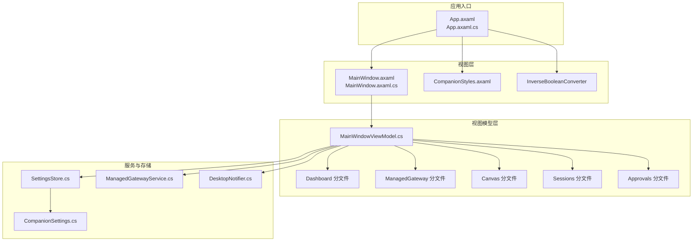
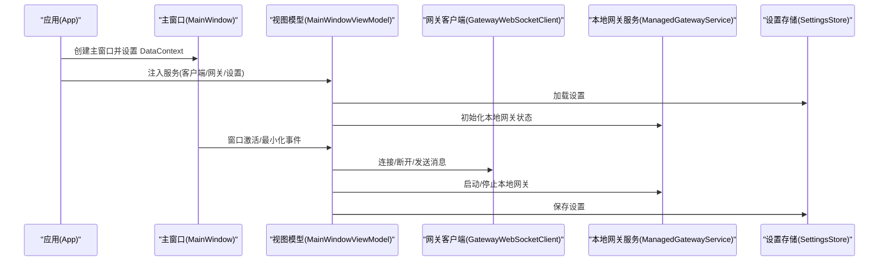
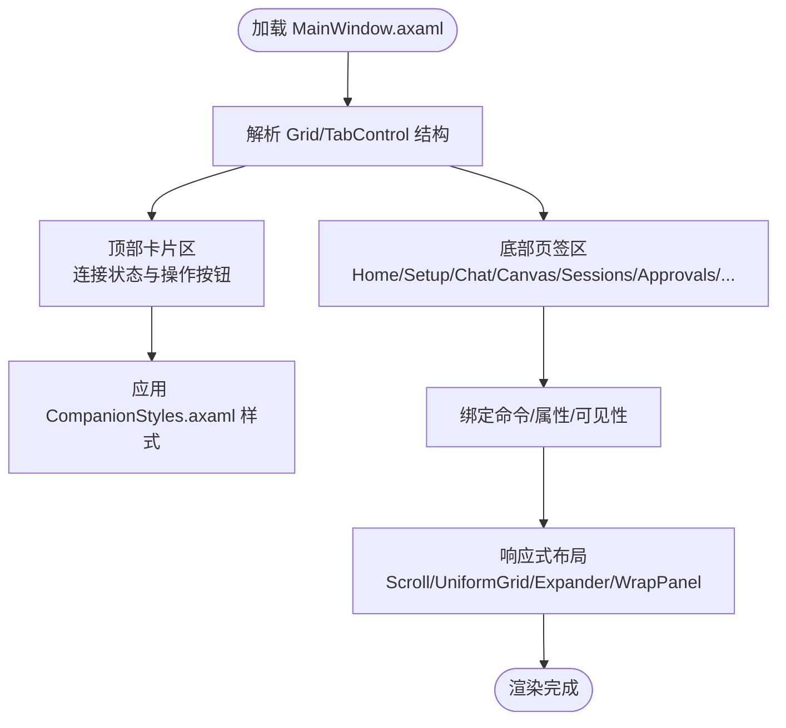
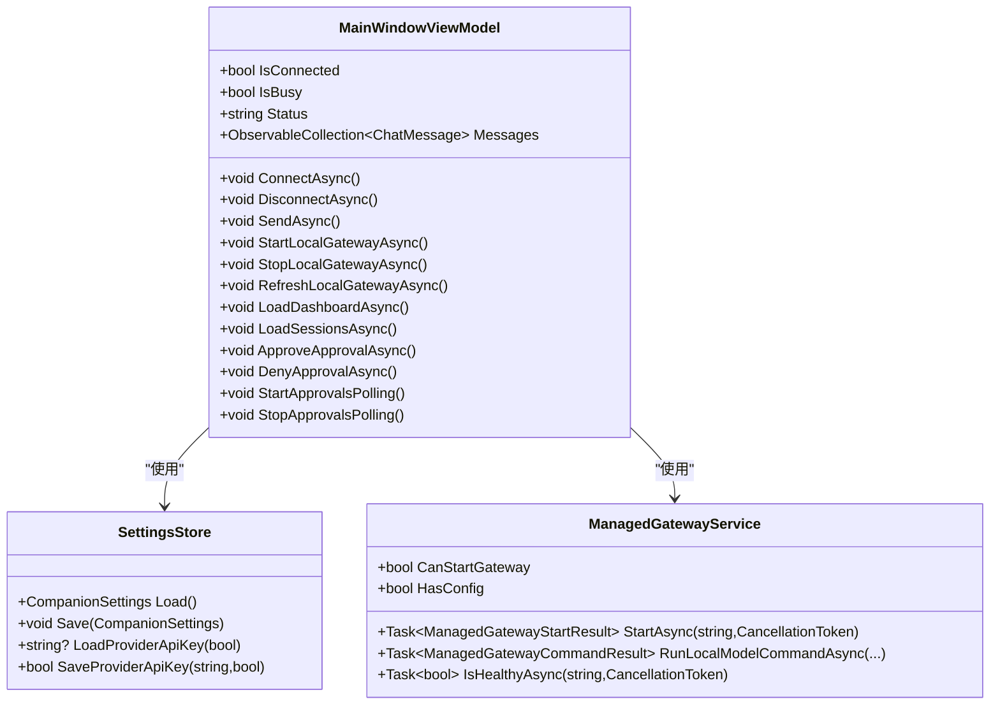
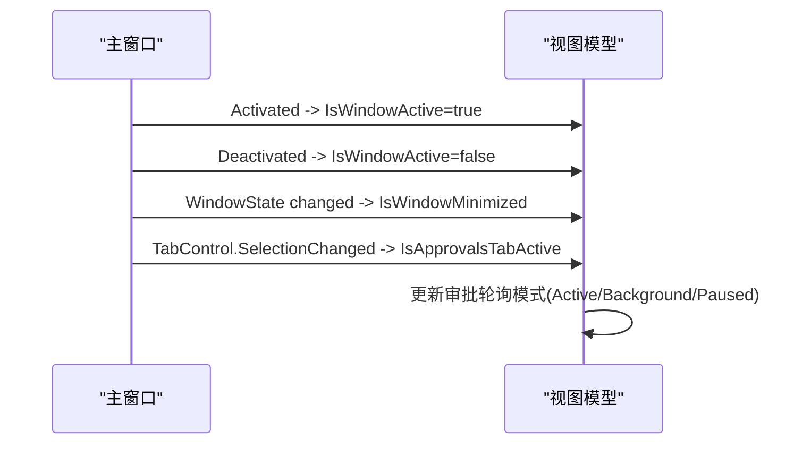
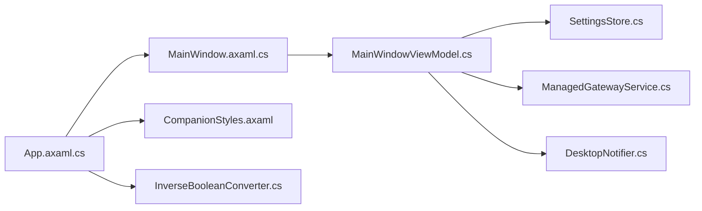

# 主窗口管理

<cite>
**本文档引用的文件**
- [MainWindow.axaml](file://src/OpenClaw.Companion/Views/MainWindow.axaml)
- [MainWindow.axaml.cs](file://src/OpenClaw.Companion/Views/MainWindow.axaml.cs)
- [MainWindowViewModel.cs](file://src/OpenClaw.Companion/ViewModels/MainWindowViewModel.cs)
- [MainWindowViewModel.Dashboard.cs](file://src/OpenClaw.Companion/ViewModels/MainWindowViewModel.Dashboard.cs)
- [MainWindowViewModel.ManagedGateway.cs](file://src/OpenClaw.Companion/ViewModels/MainWindowViewModel.ManagedGateway.cs)
- [MainWindowViewModel.Canvas.cs](file://src/OpenClaw.Companion/ViewModels/MainWindowViewModel.Canvas.cs)
- [MainWindowViewModel.Sessions.cs](file://src/OpenClaw.Companion/ViewModels/MainWindowViewModel.Sessions.cs)
- [MainWindowViewModel.Approvals.cs](file://src/OpenClaw.Companion/ViewModels/MainWindowViewModel.Approvals.cs)
- [App.axaml](file://src/OpenClaw.Companion/App.axaml)
- [App.axaml.cs](file://src/OpenClaw.Companion/App.axaml.cs)
- [CompanionStyles.axaml](file://src/OpenClaw.Companion/Styles/CompanionStyles.axaml)
- [SettingsStore.cs](file://src/OpenClaw.Companion/Services/SettingsStore.cs)
- [CompanionSettings.cs](file://src/OpenClaw.Companion/Models/CompanionSettings.cs)
- [DesktopNotifier.cs](file://src/OpenClaw.Companion/Services/DesktopNotifier.cs)
- [ManagedGatewayService.cs](file://src/OpenClaw.Companion/Services/ManagedGatewayService.cs)
- [InverseBooleanConverter.cs](file://src/OpenClaw.Companion/Converters/InverseBooleanConverter.cs)
</cite>

## 目录
1. [简介](#简介)
2. [项目结构](#项目结构)
3. [核心组件](#核心组件)
4. [架构总览](#架构总览)
5. [详细组件分析](#详细组件分析)
6. [依赖关系分析](#依赖关系分析)
7. [性能考虑](#性能考虑)
8. [故障排除指南](#故障排除指南)
9. [结论](#结论)
10. [附录](#附录)

## 简介
本文件为 Kingcrab 项目中“主窗口管理”系统的全面技术文档，围绕桌面端 Companion 应用的主窗口（MainWindow）展开，涵盖 XAML 布局与样式、响应式布局实现、视图模型状态管理、命令绑定与数据绑定机制、窗口生命周期事件处理、用户交互响应与界面更新策略，并提供窗口大小调整、主题切换与多语言支持的实现细节说明。

## 项目结构
主窗口系统位于 OpenClaw.Companion 子项目中，采用 Avalonia UI 框架构建，遵循 MVVM 架构模式。核心文件组织如下：
- 视图层：MainWindow.axaml（XAML 布局）、MainWindow.axaml.cs（窗口生命周期与交互）
- 视图模型层：MainWindowViewModel 及其分文件（Dashboard、ManagedGateway、Canvas、Sessions、Approvals 等）
- 应用入口：App.axaml（应用资源与样式）、App.axaml.cs（应用初始化与生命周期）
- 样式与转换器：CompanionStyles.axaml（样式定义）、InverseBooleanConverter（布尔取反转换器）
- 服务与存储：SettingsStore（设置持久化）、ManagedGatewayService（本地网关管理）、DesktopNotifier（桌面通知）

**图表来源**
- [App.axaml.cs:23-62](file://src/OpenClaw.Companion/App.axaml.cs#L23-L62)
- [MainWindow.axaml:1-501](file://src/OpenClaw.Companion/Views/MainWindow.axaml#L1-L501)
- [MainWindow.axaml.cs:1-66](file://src/OpenClaw.Companion/Views/MainWindow.axaml.cs#L1-L66)
- [MainWindowViewModel.cs:1-701](file://src/OpenClaw.Companion/ViewModels/MainWindowViewModel.cs#L1-L701)
- [CompanionStyles.axaml:1-73](file://src/OpenClaw.Companion/Styles/CompanionStyles.axaml#L1-L73)
- [InverseBooleanConverter.cs:1-15](file://src/OpenClaw.Companion/Converters/InverseBooleanConverter.cs#L1-L15)
- [SettingsStore.cs:1-204](file://src/OpenClaw.Companion/Services/SettingsStore.cs#L1-L204)
- [ManagedGatewayService.cs:1-674](file://src/OpenClaw.Companion/Services/ManagedGatewayService.cs#L1-L674)
- [DesktopNotifier.cs:1-176](file://src/OpenClaw.Companion/Services/DesktopNotifier.cs#L1-L176)
- [CompanionSettings.cs:1-25](file://src/OpenClaw.Companion/Models/CompanionSettings.cs#L1-L25)

**章节来源**
- [App.axaml.cs:18-62](file://src/OpenClaw.Companion/App.axaml.cs#L18-L62)
- [MainWindow.axaml:1-501](file://src/OpenClaw.Companion/Views/MainWindow.axaml#L1-L501)
- [MainWindow.axaml.cs:1-66](file://src/OpenClaw.Companion/Views/MainWindow.axaml.cs#L1-L66)

## 核心组件
- 主窗口视图（MainWindow）：承载所有业务页面（仪表盘、设置、聊天、画布、会话、审批、工作流、自动化、运行时事件、插件与通道、内存与配置文件、模型与提供商、管理员、WhatsApp、支付实验室等），通过 TabControl 实现多页签导航。
- 主窗口视图模型（MainWindowViewModel）：负责连接状态、消息流、Canvas 渲染、会话查询、审批轮询、本地网关管理、设置加载与保存等核心状态与命令。
- 应用入口（App）：初始化 Avalonia、注入依赖、创建主窗口、启动审批轮询与本地网关初始化任务。
- 样式与主题：通过 FluentTheme 与自定义样式（CompanionStyles.axaml）实现统一视觉风格；支持系统主题变体。
- 设置存储（SettingsStore）：负责设置文件的读写、令牌安全存储、提供者密钥存储与回退逻辑。
- 本地网关服务（ManagedGatewayService）：封装本地网关的启动、停止、健康检查、配置解析与 CLI 调用。
- 桌面通知（DesktopNotifier）：跨平台桌面通知能力（macOS/Linux），用于审批提醒。

**章节来源**
- [MainWindowViewModel.cs:88-115](file://src/OpenClaw.Companion/ViewModels/MainWindowViewModel.cs#L88-L115)
- [App.axaml.cs:23-62](file://src/OpenClaw.Companion/App.axaml.cs#L23-L62)
- [CompanionStyles.axaml:1-73](file://src/OpenClaw.Companion/Styles/CompanionStyles.axaml#L1-L73)
- [SettingsStore.cs:37-118](file://src/OpenClaw.Companion/Services/SettingsStore.cs#L37-L118)
- [ManagedGatewayService.cs:16-674](file://src/OpenClaw.Companion/Services/ManagedGatewayService.cs#L16-L674)
- [DesktopNotifier.cs:15-52](file://src/OpenClaw.Companion/Services/DesktopNotifier.cs#L15-L52)

## 架构总览
主窗口管理采用 MVVM 架构，视图与视图模型解耦，通过社区工具库 CommunityToolkit 的 ObservableObject 与 RelayCommand 实现属性变更通知与命令绑定。应用入口负责依赖注入与生命周期管理，视图模型通过服务层访问底层功能（如网关、设置、通知）。

**图表来源**
- [App.axaml.cs:31-42](file://src/OpenClaw.Companion/App.axaml.cs#L31-L42)
- [MainWindow.axaml.cs:13-27](file://src/OpenClaw.Companion/Views/MainWindow.axaml.cs#L13-L27)
- [MainWindowViewModel.cs:93-115](file://src/OpenClaw.Companion/ViewModels/MainWindowViewModel.cs#L93-L115)
- [SettingsStore.cs:37-77](file://src/OpenClaw.Companion/Services/SettingsStore.cs#L37-L77)
- [ManagedGatewayService.cs:161-202](file://src/OpenClaw.Companion/Services/ManagedGatewayService.cs#L161-L202)

## 详细组件分析

### 主窗口视图（XAML 布局与样式）
- 布局结构：使用 Grid 定义两行区域，顶部卡片展示连接状态与操作按钮，底部 TabControl 展示各功能页签。
- 响应式特性：通过 UniformGrid、ScrollViewer、Expander、WrapPanel 等控件实现内容在不同窗口尺寸下的自适应显示。
- 样式系统：通过 CompanionStyles.axaml 定义标题、段落、卡片、徽章、错误横幅等通用样式，配合 FluentTheme 实现主题一致性。
- 数据绑定：大量使用双向绑定（TextBox.Text）、命令绑定（Button.Command）、可见性绑定（IsVisible）与值转换器（InverseBool）。

**图表来源**
- [MainWindow.axaml:17-499](file://src/OpenClaw.Companion/Views/MainWindow.axaml#L17-L499)
- [CompanionStyles.axaml:1-73](file://src/OpenClaw.Companion/Styles/CompanionStyles.axaml#L1-L73)

**章节来源**
- [MainWindow.axaml:1-501](file://src/OpenClaw.Companion/Views/MainWindow.axaml#L1-L501)
- [CompanionStyles.axaml:1-73](file://src/OpenClaw.Companion/Styles/CompanionStyles.axaml#L1-L73)

### 主窗口视图模型（状态管理与命令）
- 状态属性：服务器地址、用户名、认证令牌、调试模式、连接状态、忙碌标志、消息集合、Canvas 表面与帧、会话列表与时间线、审批队列与历史等。
- 命令绑定：ConnectAsync、DisconnectAsync、SendAsync、StartLocalGatewayAsync、StopLocalGatewayAsync、RefreshLocalGatewayAsync、LoadDashboardAsync、LoadSessionsAsync、Approve/Deny 等。
- 事件处理：消息到达时解析运行时信封，按类型更新 UI；Canvas 事件驱动 A2UI 组件渲染；审批轮询根据窗口焦点与页签活跃度动态调整刷新频率。
- 设置持久化：通过 SettingsStore 读写设置文件，支持令牌与提供者密钥的安全存储与回退。

**图表来源**
- [MainWindowViewModel.cs:13-115](file://src/OpenClaw.Companion/ViewModels/MainWindowViewModel.cs#L13-L115)
- [SettingsStore.cs:7-118](file://src/OpenClaw.Companion/Services/SettingsStore.cs#L7-L118)
- [ManagedGatewayService.cs:44-674](file://src/OpenClaw.Companion/Services/ManagedGatewayService.cs#L44-L674)

**章节来源**
- [MainWindowViewModel.cs:13-701](file://src/OpenClaw.Companion/ViewModels/MainWindowViewModel.cs#L13-L701)
- [MainWindowViewModel.Dashboard.cs:9-94](file://src/OpenClaw.Companion/ViewModels/MainWindowViewModel.Dashboard.cs#L9-L94)
- [MainWindowViewModel.ManagedGateway.cs:8-440](file://src/OpenClaw.Companion/ViewModels/MainWindowViewModel.ManagedGateway.cs#L8-L440)
- [MainWindowViewModel.Canvas.cs:11-596](file://src/OpenClaw.Companion/ViewModels/MainWindowViewModel.Canvas.cs#L11-L596)
- [MainWindowViewModel.Sessions.cs:9-252](file://src/OpenClaw.Companion/ViewModels/MainWindowViewModel.Sessions.cs#L9-L252)
- [MainWindowViewModel.Approvals.cs:26-594](file://src/OpenClaw.Companion/ViewModels/MainWindowViewModel.Approvals.cs#L26-L594)

### 窗口生命周期事件处理
- 激活/失活：当窗口获得或失去焦点时，向视图模型推送 IsWindowActive 状态，影响审批轮询策略。
- 最小化检测：监听 WindowState 变化，推送 IsWindowMinimized 状态，暂停审批轮询。
- 页签选择：通过查找 TabControl 并监听 SelectionChanged，更新 IsApprovalsTabActive，优化审批刷新频率。

**图表来源**
- [MainWindow.axaml.cs:13-64](file://src/OpenClaw.Companion/Views/MainWindow.axaml.cs#L13-L64)

**章节来源**
- [MainWindow.axaml.cs:1-66](file://src/OpenClaw.Companion/Views/MainWindow.axaml.cs#L1-L66)

### 用户交互响应与界面更新策略
- 命令执行：所有用户操作通过 RelayCommand 执行，避免直接在视图中编写逻辑，保持 UI 与业务分离。
- 异步更新：网络请求与进程调用均异步执行，使用 IsBusy 标志防止并发操作；UI 线程通过 Dispatcher.UIThread.Post 切换到主线程更新集合与属性。
- 集合变更通知：消息集合与各列表集合在变更时触发属性变更通知，确保绑定控件即时刷新。
- Canvas 渲染：A2UI 信封解析后生成组件项，自动同步到兼容帧列表，触发 UI 更新。

**章节来源**
- [MainWindowViewModel.cs:107-111](file://src/OpenClaw.Companion/ViewModels/MainWindowViewModel.cs#L107-L111)
- [MainWindowViewModel.Canvas.cs:86-207](file://src/OpenClaw.Companion/ViewModels/MainWindowViewModel.Canvas.cs#L86-L207)

### 窗口大小调整与响应式布局
- 使用 ScrollViewer 控制垂直滚动，禁用水平滚动以保证内容宽度适配。
- Expander 折叠面板用于展开/收起连接设置，减少空间占用。
- UniformGrid 在首页签中实现指标卡片的等宽自适应排列。
- WrapPanel 与列定义组合实现标签与按钮的弹性布局。

**章节来源**
- [MainWindow.axaml:49-64](file://src/OpenClaw.Companion/Views/MainWindow.axaml#L49-L64)
- [MainWindow.axaml:81-86](file://src/OpenClaw.Companion/Views/MainWindow.axaml#L81-L86)
- [MainWindow.axaml:161-193](file://src/OpenClaw.Companion/Views/MainWindow.axaml#L161-L193)

### 主题切换与样式系统
- 主题变体：应用资源中设置 RequestedThemeVariant="Default"，跟随系统主题；也可手动设置为 Dark/Light。
- 自定义样式：通过 CompanionStyles.axaml 定义标题、段落、卡片、徽章、错误横幅等通用样式，统一视觉风格。
- 值转换器：InverseBooleanConverter 用于将布尔值取反，常用于控制按钮可见性与启用状态。

**章节来源**
- [App.axaml:6-21](file://src/OpenClaw.Companion/App.axaml#L6-L21)
- [CompanionStyles.axaml:1-73](file://src/OpenClaw.Companion/Styles/CompanionStyles.axaml#L1-L73)
- [InverseBooleanConverter.cs:1-15](file://src/OpenClaw.Companion/Converters/InverseBooleanConverter.cs#L1-L15)

### 多语言支持
- 当前代码未发现专门的多语言资源文件或区域性切换逻辑。若需国际化，建议引入 Avalonia 的资源字典与区域性切换机制，并为关键文本提供本地化键值映射。

[本节为概念性说明，不直接分析具体文件]

## 依赖关系分析
- 视图模型依赖 SettingsStore、ManagedGatewayService、GatewayWebSocketClient、DesktopNotifier 等服务。
- 应用入口负责创建并注入这些服务实例，确保视图模型在运行时可访问。
- 视图与视图模型通过绑定建立松耦合关系，值转换器与样式进一步解耦 UI 表达与业务逻辑。

**图表来源**
- [App.axaml.cs:31-42](file://src/OpenClaw.Companion/App.axaml.cs#L31-L42)
- [MainWindow.axaml.cs:1-66](file://src/OpenClaw.Companion/Views/MainWindow.axaml.cs#L1-L66)
- [MainWindowViewModel.cs:15-102](file://src/OpenClaw.Companion/ViewModels/MainWindowViewModel.cs#L15-L102)
- [SettingsStore.cs:7-35](file://src/OpenClaw.Companion/Services/SettingsStore.cs#L7-L35)
- [ManagedGatewayService.cs:8-42](file://src/OpenClaw.Companion/Services/ManagedGatewayService.cs#L8-L42)
- [DesktopNotifier.cs:6-13](file://src/OpenClaw.Companion/Services/DesktopNotifier.cs#L6-L13)
- [CompanionStyles.axaml:1-73](file://src/OpenClaw.Companion/Styles/CompanionStyles.axaml#L1-L73)
- [InverseBooleanConverter.cs:1-15](file://src/OpenClaw.Companion/Converters/InverseBooleanConverter.cs#L1-L15)

**章节来源**
- [App.axaml.cs:23-62](file://src/OpenClaw.Companion/App.axaml.cs#L23-L62)
- [MainWindowViewModel.cs:93-115](file://src/OpenClaw.Companion/ViewModels/MainWindowViewModel.cs#L93-L115)

## 性能考虑
- 审批轮询策略：根据窗口是否最小化、是否聚焦以及是否处于审批页签，动态调整轮询间隔（活动页签+窗口聚焦时更频繁，后台与最小化时降低频率），减少不必要的网络请求。
- UI 更新优化：使用 Dispatcher.UIThread.Post 将集合变更与属性更新切回 UI 线程，避免跨线程访问导致的异常；Canvas 快照限制帧数与 JSON 长度，防止超大负载。
- 本地网关健康检查：短超时 HTTP 请求判断网关可用性，避免长时间阻塞 UI。
- 设置持久化：临时文件写入与原子替换，减少文件损坏风险。

[本节为通用性能指导，不直接分析具体文件]

## 故障排除指南
- 连接失败：检查服务器 URL 是否有效，确认认证令牌是否正确；查看状态文本与系统消息提示。
- 本地网关无法启动：确认已执行本地设置流程，检查配置文件是否存在；查看健康检查结果与启动日志。
- 审批通知未弹出：检查桌面通知工具是否安装（macOS 的 osascript、Linux 的 notify-send），确认设置中的通知开关与仅非聚焦时启用选项。
- Canvas 渲染异常：检查 Canvas 信封类型与数据模型 JSON 合法性；关注快照截断与诊断信息。

**章节来源**
- [MainWindowViewModel.cs:510-520](file://src/OpenClaw.Companion/ViewModels/MainWindowViewModel.cs#L510-L520)
- [ManagedGatewayService.cs:238-264](file://src/OpenClaw.Companion/Services/ManagedGatewayService.cs#L238-L264)
- [DesktopNotifier.cs:41-52](file://src/OpenClaw.Companion/Services/DesktopNotifier.cs#L41-L52)
- [MainWindowViewModel.Canvas.cs:476-530](file://src/OpenClaw.Companion/ViewModels/MainWindowViewModel.Canvas.cs#L476-L530)

## 结论
主窗口管理系统通过清晰的 MVVM 分层、完善的命令与数据绑定机制、灵活的响应式布局与样式体系，实现了从连接管理、消息渲染、Canvas 渲染到审批轮询、本地网关管理等核心功能。窗口生命周期事件与 UI 更新策略确保了良好的用户体验与性能表现。未来可在多语言支持、主题深度定制与错误恢复方面进一步增强。

## 附录
- 关键命令与状态字段路径参考：
  - 连接命令：[ConnectAsync:486-520](file://src/OpenClaw.Companion/ViewModels/MainWindowViewModel.cs#L486-L520)
  - 断开命令：[DisconnectAsync:523-544](file://src/OpenClaw.Companion/ViewModels/MainWindowViewModel.cs#L523-L544)
  - 发送消息命令：[SendAsync:662-689](file://src/OpenClaw.Companion/ViewModels/MainWindowViewModel.cs#L662-L689)
  - 启动本地网关命令：[StartLocalGatewayAsync:261-275](file://src/OpenClaw.Companion/ViewModels/MainWindowViewModel.ManagedGateway.cs#L261-L275)
  - 停止本地网关命令：[StopLocalGatewayAsync:278-296](file://src/OpenClaw.Companion/ViewModels/MainWindowViewModel.ManagedGateway.cs#L278-L296)
  - 刷新本地网关命令：[RefreshLocalGatewayAsync:76-85](file://src/OpenClaw.Companion/ViewModels/MainWindowViewModel.ManagedGateway.cs#L76-L85)
  - 加载仪表盘命令：[LoadDashboardAsync:48-93](file://src/OpenClaw.Companion/ViewModels/MainWindowViewModel.Dashboard.cs#L48-L93)
  - 加载会话命令：[LoadSessionsAsync:73-125](file://src/OpenClaw.Companion/ViewModels/MainWindowViewModel.Sessions.cs#L73-L125)
  - 审批轮询启动：[StartApprovalsPolling:148-190](file://src/OpenClaw.Companion/ViewModels/MainWindowViewModel.Approvals.cs#L148-L190)
  - 审批轮询停止：[StopApprovalsPolling:192-197](file://src/OpenClaw.Companion/ViewModels/MainWindowViewModel.Approvals.cs#L192-L197)
  - Canvas 清空命令：[ClearCanvas:582-591](file://src/OpenClaw.Companion/ViewModels/MainWindowViewModel.Canvas.cs#L582-L591)