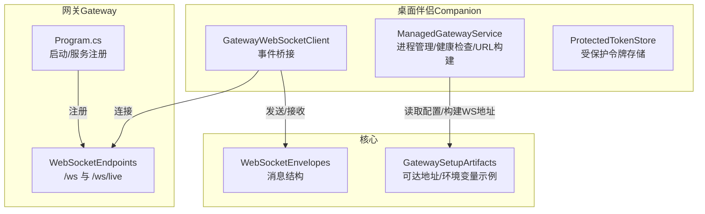
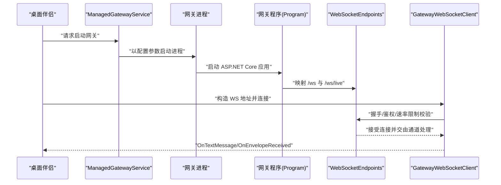
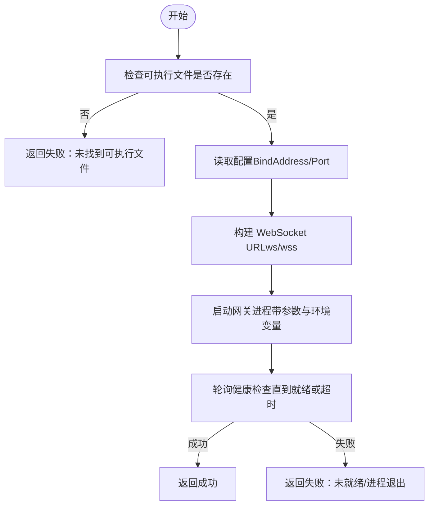
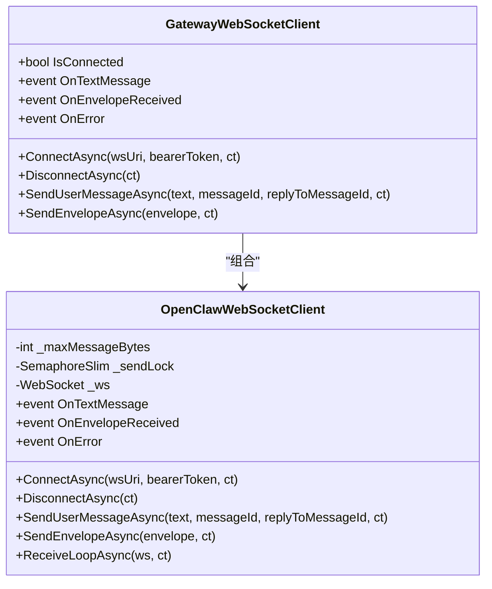
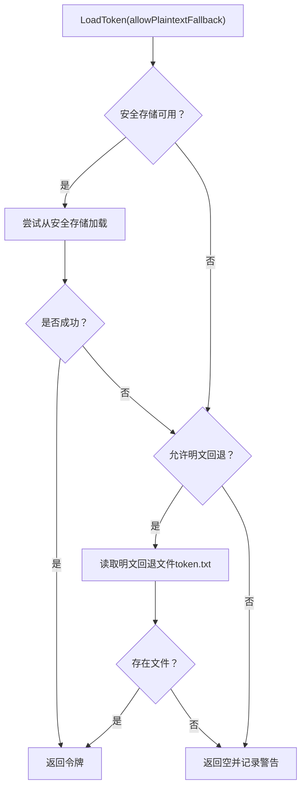
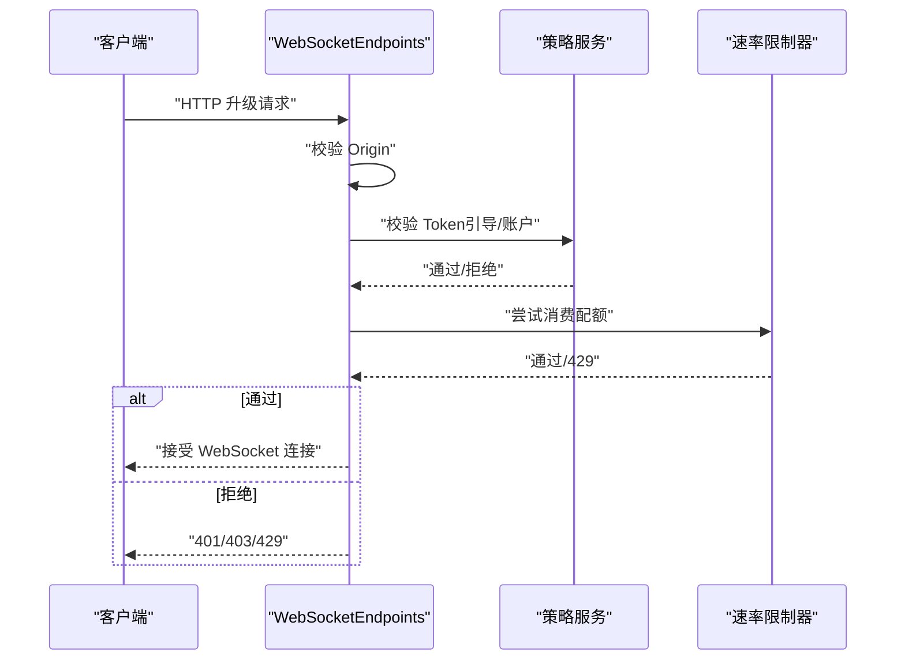
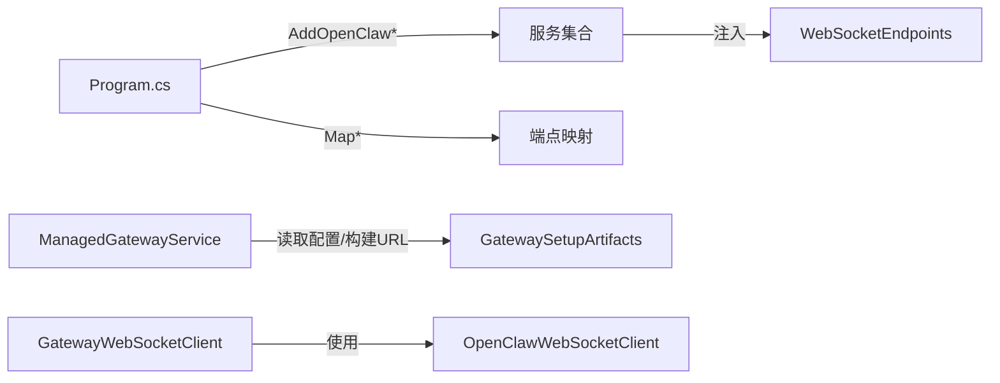

# 服务集成

<cite>
**本文引用的文件**
- [ManagedGatewayService.cs](file://src/OpenClaw.Companion/Services/ManagedGatewayService.cs)
- [GatewayWebSocketClient.cs](file://src/OpenClaw.Companion/Services/GatewayWebSocketClient.cs)
- [ProtectedTokenStore.cs](file://src/OpenClaw.Companion/Services/ProtectedTokenStore.cs)
- [OpenClawWebSocketClient.cs](file://src/OpenClaw.Client/OpenClawWebSocketClient.cs)
- [WebSocketEnvelopes.cs](file://src/OpenClaw.Core/Models/WebSocketEnvelopes.cs)
- [WebSocketEndpoints.cs](file://src/OpenClaw.Gateway/Endpoints/WebSocketEndpoints.cs)
- [Program.cs（网关）](file://src/OpenClaw.Gateway/Program.cs)
- [GatewaySetupArtifacts.cs](file://src/OpenClaw.Core/Setup/GatewaySetupArtifacts.cs)
</cite>

## 目录
1. [引言](#引言)
2. [项目结构](#项目结构)
3. [核心组件](#核心组件)
4. [架构总览](#架构总览)
5. [组件详解](#组件详解)
6. [依赖关系分析](#依赖关系分析)
7. [性能考量](#性能考量)
8. [故障排查指南](#故障排查指南)
9. [结论](#结论)
10. [附录](#附录)

## 引言
本文件面向桌面客户端“伴侣”应用与“托管网关”的服务集成场景，系统性阐述以下主题：
- 托管网关服务的启动、健康检查与生命周期管理
- WebSocket 连接管理与实时通信机制
- 设置存储系统的配置管理、数据持久化与安全保护
- 受保护令牌存储的安全策略、加密算法与访问控制
- 服务注册、依赖注入与错误处理的最佳实践

目标是帮助开发者在不深入源码的前提下，快速理解端到端流程，并在生产环境中安全、稳定地部署与运维。

## 项目结构
围绕“桌面伴侣”与“网关”的协作，代码主要分布在如下模块：
- 桌面伴侣（Companion）
  - ManagedGatewayService：负责本地网关进程的发现、启动、停止与健康检查
  - GatewayWebSocketClient：封装与网关的 WebSocket 客户端交互
  - ProtectedTokenStore：跨平台受保护令牌存储与降级回退
- 网关（Gateway）
  - Program：ASP.NET Core 启动入口，装配服务、中间件与端点
  - WebSocketEndpoints：/ws 与 /ws/live 的授权、速率限制与桥接逻辑
- 核心模型与工具
  - WebSocketEnvelopes：WebSocket 信封消息结构
  - GatewaySetupArtifacts：配置生成与可达地址构建

**图表来源**
- [ManagedGatewayService.cs:1-674](file://src/OpenClaw.Companion/Services/ManagedGatewayService.cs#L1-L674)
- [GatewayWebSocketClient.cs:1-49](file://src/OpenClaw.Companion/Services/GatewayWebSocketClient.cs#L1-L49)
- [ProtectedTokenStore.cs:1-587](file://src/OpenClaw.Companion/Services/ProtectedTokenStore.cs#L1-L587)
- [OpenClawWebSocketClient.cs:1-248](file://src/OpenClaw.Client/OpenClawWebSocketClient.cs#L1-L248)
- [WebSocketEnvelopes.cs:1-109](file://src/OpenClaw.Core/Models/WebSocketEnvelopes.cs#L1-L109)
- [WebSocketEndpoints.cs:1-191](file://src/OpenClaw.Gateway/Endpoints/WebSocketEndpoints.cs#L1-L191)
- [Program.cs（网关）:1-124](file://src/OpenClaw.Gateway/Program.cs#L1-L124)
- [GatewaySetupArtifacts.cs:1-51](file://src/OpenClaw.Core/Setup/GatewaySetupArtifacts.cs#L1-L51)

**章节来源**
- [Program.cs（网关）:1-124](file://src/OpenClaw.Gateway/Program.cs#L1-L124)
- [GatewaySetupArtifacts.cs:1-51](file://src/OpenClaw.Core/Setup/GatewaySetupArtifacts.cs#L1-L51)

## 核心组件
- 托管网关服务（ManagedGatewayService）
  - 负责解析可执行文件、运行 CLI 完成本地初始化、启动/停止网关进程、健康检查与超时等待、构建 WebSocket 地址
- 网关 WebSocket 客户端（GatewayWebSocketClient）
  - 封装底层 OpenClawWebSocketClient，暴露文本消息与信封事件，支持连接/断开与消息发送
- 受保护令牌存储（ProtectedTokenStore）
  - 统一跨平台密钥链/DPAPI/Secret Service 存储，提供可用性检测、警告聚合与明文回退策略
- 网关 WebSocket 端点（WebSocketEndpoints）
  - /ws 与 /ws/live 的握手校验、来源校验、令牌认证、速率限制与异常兜底

**章节来源**
- [ManagedGatewayService.cs:1-674](file://src/OpenClaw.Companion/Services/ManagedGatewayService.cs#L1-L674)
- [GatewayWebSocketClient.cs:1-49](file://src/OpenClaw.Companion/Services/GatewayWebSocketClient.cs#L1-L49)
- [ProtectedTokenStore.cs:1-587](file://src/OpenClaw.Companion/Services/ProtectedTokenStore.cs#L1-L587)
- [WebSocketEndpoints.cs:1-191](file://src/OpenClaw.Gateway/Endpoints/WebSocketEndpoints.cs#L1-L191)

## 架构总览
下图展示从桌面伴侣到网关的完整调用链路与职责边界：

**图表来源**
- [ManagedGatewayService.cs:161-202](file://src/OpenClaw.Companion/Services/ManagedGatewayService.cs#L161-L202)
- [Program.cs（网关）:89-96](file://src/OpenClaw.Gateway/Program.cs#L89-L96)
- [WebSocketEndpoints.cs:18-61](file://src/OpenClaw.Gateway/Endpoints/WebSocketEndpoints.cs#L18-L61)
- [GatewayWebSocketClient.cs:24-28](file://src/OpenClaw.Companion/Services/GatewayWebSocketClient.cs#L24-L28)

## 组件详解

### 托管网关服务（ManagedGatewayService）
- 关键职责
  - 解析网关与 CLI 可执行文件路径，支持直接二进制与 dotnet run 回退
  - 通过 CLI 完成本地初始化（工作区、配置、模型预设等），必要时注入环境变量中的 API Key
  - 启动/停止网关进程，健康检查与超时等待，失败清理与异常捕获
  - 从配置文件读取绑定地址与端口，构建 WebSocket URL（自动切换 ws/wss）
- 设计要点
  - 使用超时 CTS 控制 CLI 命令执行时间，避免阻塞
  - 对已退出进程进行清理，防止句柄泄漏
  - 健康检查通过 /health 接口，支持携带 Bearer Token
- 配置与可达地址
  - 从配置中读取 BindAddress 与 Port，若监听 0.0.0.0/:: 则返回 127.0.0.1 的本地可达地址

**图表来源**
- [ManagedGatewayService.cs:161-202](file://src/OpenClaw.Companion/Services/ManagedGatewayService.cs#L161-L202)
- [ManagedGatewayService.cs:412-453](file://src/OpenClaw.Companion/Services/ManagedGatewayService.cs#L412-L453)
- [ManagedGatewayService.cs:455-492](file://src/OpenClaw.Companion/Services/ManagedGatewayService.cs#L455-L492)

**章节来源**
- [ManagedGatewayService.cs:1-674](file://src/OpenClaw.Companion/Services/ManagedGatewayService.cs#L1-L674)
- [GatewaySetupArtifacts.cs:36-49](file://src/OpenClaw.Core/Setup/GatewaySetupArtifacts.cs#L36-L49)

### 网关 WebSocket 客户端（GatewayWebSocketClient 与 OpenClawWebSocketClient）
- GatewayWebSocketClient
  - 包装底层客户端，转发文本消息与信封事件，暴露连接状态与发送接口
- OpenClawWebSocketClient
  - 内部使用 ClientWebSocket，支持 Authorization 头传递 Bearer Token
  - 发送侧使用信号量串行化，接收侧循环读取并反序列化为信封对象
  - 提供最大消息大小限制，防止内存膨胀；异常通过 OnError 事件上报
- 实时通信
  - 支持用户消息与通用信封两类发送；接收端按类型分发事件

**图表来源**
- [GatewayWebSocketClient.cs:1-49](file://src/OpenClaw.Companion/Services/GatewayWebSocketClient.cs#L1-L49)
- [OpenClawWebSocketClient.cs:1-248](file://src/OpenClaw.Client/OpenClawWebSocketClient.cs#L1-L248)

**章节来源**
- [GatewayWebSocketClient.cs:1-49](file://src/OpenClaw.Companion/Services/GatewayWebSocketClient.cs#L1-L49)
- [OpenClawWebSocketClient.cs:1-248](file://src/OpenClaw.Client/OpenClawWebSocketClient.cs#L1-L248)
- [WebSocketEnvelopes.cs:1-109](file://src/OpenClaw.Core/Models/WebSocketEnvelopes.cs#L1-L109)

### 受保护令牌存储（ProtectedTokenStore）
- 目标
  - 在不同操作系统上选择最优安全存储（macOS Keychain、Windows DPAPI、Linux Secret Service），并在不可用时提供明文回退
- 机制
  - 工厂根据平台选择具体实现；统一接口 LoadSecret/SaveSecret/ClearSecret
  - 明文回退路径位于用户目录下的 token.txt；可通过开关禁用
  - 警告信息聚合，便于 UI 层提示
- 加密与算法
  - macOS：Keychain API
  - Windows：DPAPI（CurrentUser 作用域）
  - Linux：secret-tool 命令（需安装 GNOME Keyring 或兼容实现）

**图表来源**
- [ProtectedTokenStore.cs:45-76](file://src/OpenClaw.Companion/Services/ProtectedTokenStore.cs#L45-L76)
- [ProtectedTokenStore.cs:78-106](file://src/OpenClaw.Companion/Services/ProtectedTokenStore.cs#L78-L106)

**章节来源**
- [ProtectedTokenStore.cs:1-587](file://src/OpenClaw.Companion/Services/ProtectedTokenStore.cs#L1-L587)

### 网关 WebSocket 端点与安全策略
- /ws 与 /ws/live
  - 握手前进行来源校验、令牌认证与速率限制
  - 非 127.0.0.1 监听时要求携带有效 Token（支持引导令牌与账户令牌）
- 错误处理
  - 捕获异常并发送错误信封，确保连接可恢复
- 速率限制
  - 基于 IP 与桶名进行限流，避免滥用

**图表来源**
- [WebSocketEndpoints.cs:18-61](file://src/OpenClaw.Gateway/Endpoints/WebSocketEndpoints.cs#L18-L61)
- [WebSocketEndpoints.cs:63-94](file://src/OpenClaw.Gateway/Endpoints/WebSocketEndpoints.cs#L63-L94)
- [WebSocketEndpoints.cs:96-118](file://src/OpenClaw.Gateway/Endpoints/WebSocketEndpoints.cs#L96-L118)

**章节来源**
- [WebSocketEndpoints.cs:1-191](file://src/OpenClaw.Gateway/Endpoints/WebSocketEndpoints.cs#L1-L191)

## 依赖关系分析
- 服务注册与启动
  - Program 中通过 AddOpenClaw* 系列扩展注册核心、通道、工具、后端、安全、MCP 等服务，并应用运行时配置文件
  - 映射 /openapi、/mcp、A2A 端点与管道，最后在指定地址与端口启动监听
- 组件耦合
  - 桌面伴侣与网关通过 HTTP/WS 与配置文件解耦
  - 令牌存储与平台能力解耦，通过工厂与接口抽象实现跨平台

**图表来源**
- [Program.cs（网关）:67-96](file://src/OpenClaw.Gateway/Program.cs#L67-L96)
- [ManagedGatewayService.cs:412-453](file://src/OpenClaw.Companion/Services/ManagedGatewayService.cs#L412-L453)
- [GatewayWebSocketClient.cs:1-49](file://src/OpenClaw.Companion/Services/GatewayWebSocketClient.cs#L1-L49)
- [OpenClawWebSocketClient.cs:1-248](file://src/OpenClaw.Client/OpenClawWebSocketClient.cs#L1-L248)

**章节来源**
- [Program.cs（网关）:1-124](file://src/OpenClaw.Gateway/Program.cs#L1-L124)

## 性能考量
- 连接与消息
  - 发送侧使用信号量串行化，避免并发写导致的缓冲区竞争
  - 接收侧采用共享缓冲池与增量写入，降低 GC 压力
  - 最大消息大小限制，防止内存暴涨
- 进程与健康检查
  - 启动阶段轮询健康检查，超时控制在合理范围，避免长时间阻塞
  - CLI 命令执行使用独立 CTS，超时后主动终止子进程
- 速率限制
  - 基于 IP 的轻量级配额控制，减少恶意连接对资源的消耗

[本节为通用建议，无需特定文件来源]

## 故障排查指南
- 网关无法启动
  - 检查可执行文件解析结果与工作目录
  - 查看 CLI 初始化输出与错误码
  - 确认配置文件中的 BindAddress/Port 是否可达
- WebSocket 无法连接
  - 校验来源（Origin）与 Token 是否满足要求
  - 观察 401/403/429 状态码对应的策略与限流
- 令牌加载失败
  - 检查平台安全存储可用性与命令行工具
  - 若禁用明文回退，确认安全存储是否保存成功
- 连接断开或异常
  - 查看 OnError 事件与日志，定位序列化/反序列化问题
  - 确认消息大小未超过限制

**章节来源**
- [ManagedGatewayService.cs:330-387](file://src/OpenClaw.Companion/Services/ManagedGatewayService.cs#L330-L387)
- [WebSocketEndpoints.cs:63-94](file://src/OpenClaw.Gateway/Endpoints/WebSocketEndpoints.cs#L63-L94)
- [ProtectedTokenStore.cs:121-136](file://src/OpenClaw.Companion/Services/ProtectedTokenStore.cs#L121-L136)
- [OpenClawWebSocketClient.cs:158-227](file://src/OpenClaw.Client/OpenClawWebSocketClient.cs#L158-L227)

## 结论
该方案通过“桌面伴侣 + 托管网关”的组合，实现了本地化的服务集成与实时通信。借助清晰的进程管理、稳健的 WebSocket 通道与跨平台受保护令牌存储，系统在易用性、安全性与可维护性之间取得平衡。建议在生产部署中：
- 严格遵循令牌与来源校验策略
- 合理配置速率限制与健康检查超时
- 在非本地监听时务必启用 Token 认证
- 使用受保护令牌存储，谨慎开启明文回退

[本节为总结，无需特定文件来源]

## 附录
- 关键模型
  - WebSocketEnvelopes：定义客户端与服务端消息信封字段
- 配置辅助
  - GatewaySetupArtifacts：生成环境变量示例与可达地址

**章节来源**
- [WebSocketEnvelopes.cs:1-109](file://src/OpenClaw.Core/Models/WebSocketEnvelopes.cs#L1-L109)
- [GatewaySetupArtifacts.cs:1-51](file://src/OpenClaw.Core/Setup/GatewaySetupArtifacts.cs#L1-L51)