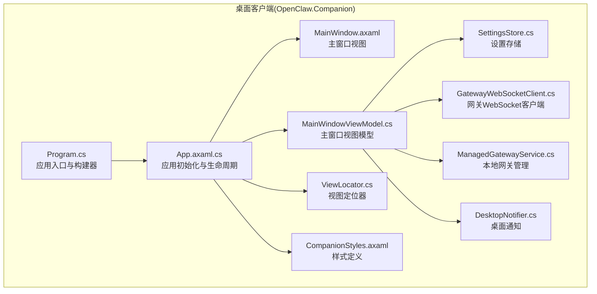
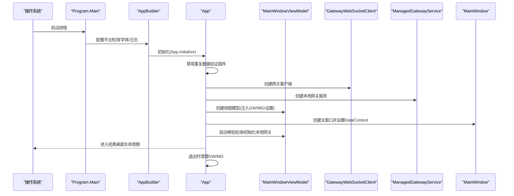
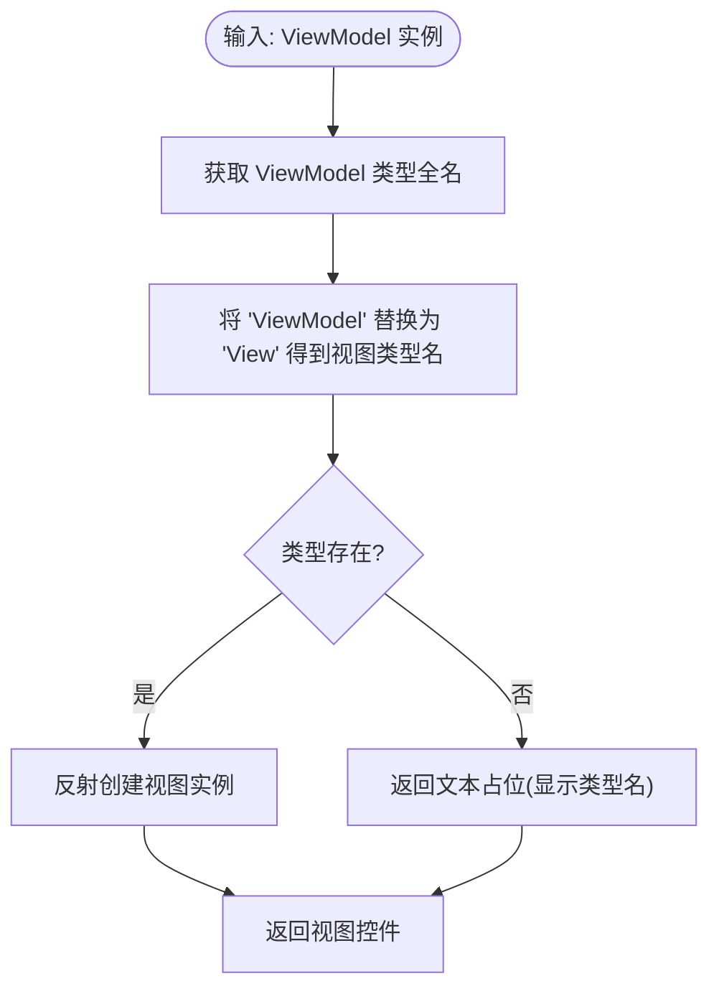
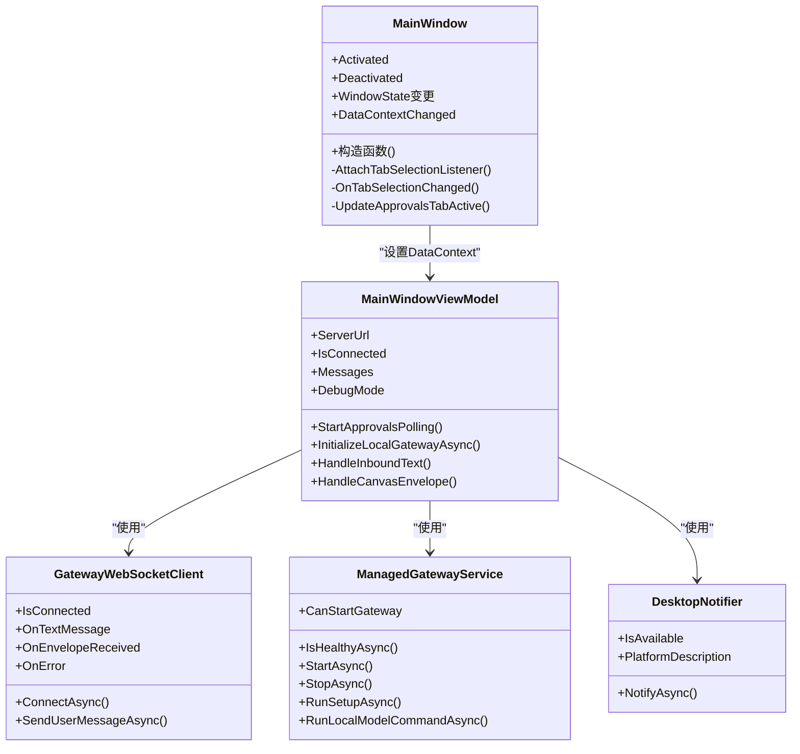
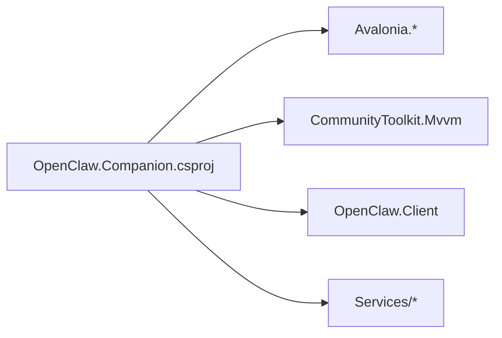

# 架构设计

<cite>
**本文引用的文件**
- [Program.cs](file://src/OpenClaw.Companion/Program.cs)
- [App.axaml.cs](file://src/OpenClaw.Companion/App.axaml.cs)
- [App.axaml](file://src/OpenClaw.Companion/App.axaml)
- [ViewLocator.cs](file://src/OpenClaw.Companion/ViewLocator.cs)
- [MainWindow.axaml](file://src/OpenClaw.Companion/Views/MainWindow.axaml)
- [MainWindow.axaml.cs](file://src/OpenClaw.Companion/Views/MainWindow.axaml.cs)
- [MainWindowViewModel.cs](file://src/OpenClaw.Companion/ViewModels/MainWindowViewModel.cs)
- [SettingsStore.cs](file://src/OpenClaw.Companion/Services/SettingsStore.cs)
- [GatewayWebSocketClient.cs](file://src/OpenClaw.Companion/Services/GatewayWebSocketClient.cs)
- [ManagedGatewayService.cs](file://src/OpenClaw.Companion/Services/ManagedGatewayService.cs)
- [DesktopNotifier.cs](file://src/OpenClaw.Companion/Services/DesktopNotifier.cs)
- [OpenClaw.Companion.csproj](file://src/OpenClaw.Companion/OpenClaw.Companion.csproj)
- [CompanionStyles.axaml](file://src/OpenClaw.Companion/Styles/CompanionStyles.axaml)
</cite>

## 目录
1. [引言](#引言)
2. [项目结构](#项目结构)
3. [核心组件](#核心组件)
4. [架构总览](#架构总览)
5. [详细组件分析](#详细组件分析)
6. [依赖关系分析](#依赖关系分析)
7. [性能考虑](#性能考虑)
8. [故障排查指南](#故障排查指南)
9. [结论](#结论)
10. [附录](#附录)

## 引言
本文件面向桌面客户端架构设计，聚焦于基于 Avalonia 的桌面应用在本仓库中的集成与实现。内容涵盖应用启动流程与初始化、应用程序构建器配置、平台检测与字体资源管理、视图定位器工作机制、依赖注入容器现状与替代方案、应用程序生命周期管理、跨平台兼容性实现细节、性能优化策略以及调试配置方法。目标是帮助开发者快速理解并扩展该桌面客户端。

## 项目结构
OpenClaw 桌面客户端位于 src/OpenClaw.Companion，采用典型的 MVVM 分层组织：入口程序(Program.cs)负责应用构建与启动；App 类负责应用级初始化与生命周期；视图(Views)与视图模型(ViewModels)通过数据绑定交互；服务(Services)封装网络、本地网关管理与系统通知等横切关注点；样式(Styles)统一界面风格；资源管理与打包由项目文件与 Avalonia 资源机制共同完成。

图表来源
- [Program.cs:1-22](file://src/OpenClaw.Companion/Program.cs#L1-L22)
- [App.axaml.cs:1-78](file://src/OpenClaw.Companion/App.axaml.cs#L1-L78)
- [ViewLocator.cs:1-38](file://src/OpenClaw.Companion/ViewLocator.cs#L1-L38)
- [MainWindow.axaml:1-501](file://src/OpenClaw.Companion/Views/MainWindow.axaml#L1-L501)
- [MainWindowViewModel.cs:1-200](file://src/OpenClaw.Companion/ViewModels/MainWindowViewModel.cs#L1-L200)
- [SettingsStore.cs:1-204](file://src/OpenClaw.Companion/Services/SettingsStore.cs#L1-L204)
- [GatewayWebSocketClient.cs:1-49](file://src/OpenClaw.Companion/Services/GatewayWebSocketClient.cs#L1-L49)
- [ManagedGatewayService.cs:1-674](file://src/OpenClaw.Companion/Services/ManagedGatewayService.cs#L1-L674)
- [DesktopNotifier.cs:1-176](file://src/OpenClaw.Companion/Services/DesktopNotifier.cs#L1-L176)
- [CompanionStyles.axaml:1-73](file://src/OpenClaw.Companion/Styles/CompanionStyles.axaml#L1-L73)

章节来源
- [Program.cs:1-22](file://src/OpenClaw.Companion/Program.cs#L1-L22)
- [App.axaml.cs:1-78](file://src/OpenClaw.Companion/App.axaml.cs#L1-L78)
- [OpenClaw.Companion.csproj:1-41](file://src/OpenClaw.Companion/OpenClaw.Companion.csproj#L1-L41)

## 核心组件
- 应用入口与构建器：Program 中使用 AppBuilder 配置平台检测、字体与日志，并以经典桌面生命周期启动。
- 应用初始化与生命周期：App 在 Initialize 中加载 XAML，在 OnFrameworkInitializationCompleted 中创建主窗体、视图模型与服务实例，处理退出清理。
- 视图定位器：ViewLocator 基于命名约定自动解析 ViewModel 对应的 View。
- 主窗口与视图模型：MainWindow 提供窗口状态与标签页选择监听；MainWindowViewModel 负责连接、消息、Canvas、会话、审批、工作流等业务逻辑。
- 服务层：SettingsStore 管理设置与令牌存储；GatewayWebSocketClient 封装 WebSocket 通信；ManagedGatewayService 管理本地网关进程与配置；DesktopNotifier 提供跨平台桌面通知。
- 样式与资源：CompanionStyles.axaml 定义通用样式；App.axaml 注册样式与资源字典。

章节来源
- [Program.cs:16-21](file://src/OpenClaw.Companion/Program.cs#L16-L21)
- [App.axaml.cs:18-63](file://src/OpenClaw.Companion/App.axaml.cs#L18-L63)
- [ViewLocator.cs:15-37](file://src/OpenClaw.Companion/ViewLocator.cs#L15-L37)
- [MainWindowViewModel.cs:13-115](file://src/OpenClaw.Companion/ViewModels/MainWindowViewModel.cs#L13-L115)
- [SettingsStore.cs:7-35](file://src/OpenClaw.Companion/Services/SettingsStore.cs#L7-L35)
- [GatewayWebSocketClient.cs:5-39](file://src/OpenClaw.Companion/Services/GatewayWebSocketClient.cs#L5-L39)
- [ManagedGatewayService.cs:8-674](file://src/OpenClaw.Companion/Services/ManagedGatewayService.cs#L8-L674)
- [DesktopNotifier.cs:6-52](file://src/OpenClaw.Companion/Services/DesktopNotifier.cs#L6-L52)
- [CompanionStyles.axaml:1-73](file://src/OpenClaw.Companion/Styles/CompanionStyles.axaml#L1-L73)

## 架构总览
下图展示从应用启动到主窗口呈现的关键路径，以及与服务层的交互。

图表来源
- [Program.cs:12-21](file://src/OpenClaw.Companion/Program.cs#L12-L21)
- [App.axaml.cs:18-63](file://src/OpenClaw.Companion/App.axaml.cs#L18-L63)
- [MainWindowViewModel.cs:93-115](file://src/OpenClaw.Companion/ViewModels/MainWindowViewModel.cs#L93-L115)
- [GatewayWebSocketClient.cs:5-15](file://src/OpenClaw.Companion/Services/GatewayWebSocketClient.cs#L5-L15)
- [ManagedGatewayService.cs:8-36](file://src/OpenClaw.Companion/Services/ManagedGatewayService.cs#L8-L36)

## 详细组件分析

### 应用入口与应用程序构建器
- 入口函数使用 STAThread 并调用 AppBuilder.Configure<App>().UsePlatformDetect().WithInterFont().LogToTrace()，随后以 StartWithClassicDesktopLifetime(args) 启动。
- UsePlatformDetect 自动探测运行平台；WithInterFont 引入 Inter 字体；LogToTrace 输出调试日志。
- 项目文件中启用 Avalonia 编译绑定默认值，关闭裁剪，保留序列化反射以兼容运行时需求。

章节来源
- [Program.cs:12-21](file://src/OpenClaw.Companion/Program.cs#L12-L21)
- [OpenClaw.Companion.csproj:1-41](file://src/OpenClaw.Companion/OpenClaw.Companion.csproj#L1-L41)

### 应用初始化与生命周期
- Initialize 加载 AvaloniaXamlLoader，使 XAML 资源生效。
- OnFrameworkInitializationCompleted 中：
  - 禁用 Avalonia 数据注解验证插件，避免与 CommunityToolkit 重复校验。
  - 创建 GatewayWebSocketClient 与 ManagedGatewayService。
  - 使用 SettingsStore 初始化 MainWindowViewModel，并注入桌面通知与确认对话框服务。
  - 设置 MainWindow 的 DataContext 并赋给 ApplicationLifetime.MainWindow。
  - 启动审批轮询与本地网关初始化任务，并注册退出事件进行资源释放。

章节来源
- [App.axaml.cs:18-63](file://src/OpenClaw.Companion/App.axaml.cs#L18-L63)

### 视图定位器工作机制
- ViewLocator 实现 IDataTemplate，根据 ViewModel 类型全名替换“ViewModel”为“View”，尝试反射创建对应控件。
- 若未找到类型，返回文本提示；Match 判断数据上下文是否为 ViewModelBase 子类。
- 该机制简化了视图与视图模型的绑定，减少手工映射代码。

图表来源
- [ViewLocator.cs:17-36](file://src/OpenClaw.Companion/ViewLocator.cs#L17-L36)

章节来源
- [ViewLocator.cs:15-37](file://src/OpenClaw.Companion/ViewLocator.cs#L15-L37)

### 主窗口与视图模型
- MainWindow 在构造时订阅窗口激活/最小化状态变化，并在 DataContext 变更后附加标签页选择监听，用于更新审批标签活跃状态。
- MainWindowViewModel：
  - 维护连接状态、消息集合、操作员身份信息、调试模式、通知偏好等。
  - 订阅 GatewayWebSocketClient 的文本消息与画布信封事件，处理运行时消息与 Canvas 渲染。
  - 通过 SettingsStore 加载/保存用户设置，支持环境变量覆盖。
  - 通过 ManagedGatewayService 管理本地网关的健康检查、启动、停止与命令执行。
  - 通过 DesktopNotifier 发送桌面通知（按平台可用性）。

图表来源
- [MainWindow.axaml.cs:7-65](file://src/OpenClaw.Companion/Views/MainWindow.axaml.cs#L7-L65)
- [MainWindowViewModel.cs:13-115](file://src/OpenClaw.Companion/ViewModels/MainWindowViewModel.cs#L13-L115)
- [GatewayWebSocketClient.cs:5-39](file://src/OpenClaw.Companion/Services/GatewayWebSocketClient.cs#L5-L39)
- [ManagedGatewayService.cs:8-674](file://src/OpenClaw.Companion/Services/ManagedGatewayService.cs#L8-L674)
- [DesktopNotifier.cs:6-52](file://src/OpenClaw.Companion/Services/DesktopNotifier.cs#L6-L52)

章节来源
- [MainWindow.axaml.cs:9-65](file://src/OpenClaw.Companion/Views/MainWindow.axaml.cs#L9-L65)
- [MainWindowViewModel.cs:88-186](file://src/OpenClaw.Companion/ViewModels/MainWindowViewModel.cs#L88-L186)

### 依赖注入容器配置
- 当前项目未引入 Microsoft.Extensions.DependencyInjection 或其他 DI 容器包；服务实例在 App 中直接构造并通过构造函数注入到 MainWindowViewModel。
- 若需引入 DI 容器，可在 AppBuilder 链中添加容器扩展（如 UseDiContainer），并在 App 初始化阶段注册服务，再由容器解析 MainWindowViewModel。

章节来源
- [OpenClaw.Companion.csproj:31-31](file://src/OpenClaw.Companion/OpenClaw.Companion.csproj#L31-L31)
- [App.axaml.cs:31-35](file://src/OpenClaw.Companion/App.axaml.cs#L31-L35)

### 应用程序生命周期管理
- 生命周期由 IClassicDesktopStyleApplicationLifetime 控制，入口使用 StartWithClassicDesktopLifetime。
- 退出事件中显式停止审批轮询并异步释放 GatewayWebSocketClient 与 ManagedGatewayService，确保资源回收。

章节来源
- [Program.cs:12-13](file://src/OpenClaw.Companion/Program.cs#L12-L13)
- [App.axaml.cs:52-59](file://src/OpenClaw.Companion/App.axaml.cs#L52-L59)

### 跨平台兼容性实现细节
- 平台检测：UsePlatformDetect 自动适配不同平台 UI 行为。
- 字体资源：WithInterFont 引入 Inter 字体，提升可读性与一致性。
- 桌面通知：DesktopNotifier 根据平台检测(osascript/notify-send)决定可用性，Windows 当前不支持。
- 网络与进程：ManagedGatewayService 通过 Process 启动本地网关，支持跨平台二进制查找与 dotnet run 回退。

章节来源
- [Program.cs:18-19](file://src/OpenClaw.Companion/Program.cs#L18-L19)
- [DesktopNotifier.cs:54-71](file://src/OpenClaw.Companion/Services/DesktopNotifier.cs#L54-L71)
- [ManagedGatewayService.cs:288-312](file://src/OpenClaw.Companion/Services/ManagedGatewayService.cs#L288-L312)

### 性能优化策略
- 绑定与验证：禁用 Avalonia 数据注解验证插件，避免与 CommunityToolkit 重复校验带来的开销。
- UI 更新：MainWindowViewModel 使用 ObservableCollection 管理消息列表，并在集合变更时触发属性变更通知，降低不必要的重绘。
- 资源释放：在应用退出时释放网络与进程资源，防止句柄泄漏。
- 日志与诊断：LogToTrace 输出调试信息，便于定位性能瓶颈。

章节来源
- [App.axaml.cs:65-76](file://src/OpenClaw.Companion/App.axaml.cs#L65-L76)
- [MainWindowViewModel.cs:107-111](file://src/OpenClaw.Companion/ViewModels/MainWindowViewModel.cs#L107-L111)
- [Program.cs:20-20](file://src/OpenClaw.Companion/Program.cs#L20-L20)

### 调试配置方法
- 启用 Avalonia 调试：项目中已排除 Release 下 Avalonia.Diagnostics 包，Debug 下可通过 Avalonia 调试工具观察可视化树与绑定。
- 日志输出：LogToTrace 将日志输出到跟踪监听器，便于在 IDE 或外部工具中查看。
- 环境变量：支持 OPENCLAW_BASE_URL 与 OPENCLAW_AUTH_TOKEN，便于快速切换网关地址与令牌。
- 设置存储：SettingsStore 支持临时文件写入与标记文件，便于测试与迁移。

章节来源
- [OpenClaw.Companion.csproj:24-28](file://src/OpenClaw.Companion/OpenClaw.Companion.csproj#L24-L28)
- [Program.cs:20-20](file://src/OpenClaw.Companion/Program.cs#L20-L20)
- [MainWindowViewModel.cs:174-186](file://src/OpenClaw.Companion/ViewModels/MainWindowViewModel.cs#L174-L186)
- [SettingsStore.cs:37-77](file://src/OpenClaw.Companion/Services/SettingsStore.cs#L37-L77)

## 依赖关系分析
- 项目依赖 Avalonia、Avalonia.Themes.Fluent、Avalonia.Fonts.Inter 与 CommunityToolkit.Mvvm。
- 通过 OpenClaw.Client 封装 WebSocket 通信，避免直接耦合底层协议细节。
- 服务层通过接口抽象对外部能力（如通知）进行解耦。

图表来源
- [OpenClaw.Companion.csproj:19-35](file://src/OpenClaw.Companion/OpenClaw.Companion.csproj#L19-L35)

章节来源
- [OpenClaw.Companion.csproj:1-41](file://src/OpenClaw.Companion/OpenClaw.Companion.csproj#L1-L41)

## 性能考虑
- 减少重复验证：禁用 Avalonia 数据注解验证插件，避免与 MVVM Toolkit 重复校验。
- UI 绑定优化：启用编译绑定默认值，提升绑定性能与类型安全。
- 资源管理：在退出时释放网络与进程资源，避免内存与句柄泄漏。
- 日志级别：仅在调试构建中包含诊断包，避免发布版本体积与性能开销。

章节来源
- [App.axaml.cs:65-76](file://src/OpenClaw.Companion/App.axaml.cs#L65-L76)
- [OpenClaw.Companion.csproj:7-7](file://src/OpenClaw.Companion/OpenClaw.Companion.csproj#L7-L7)
- [OpenClaw.Companion.csproj:24-28](file://src/OpenClaw.Companion/OpenClaw.Companion.csproj#L24-L28)

## 故障排查指南
- 连接问题：检查 GatewayWebSocketClient 是否成功连接，关注 OnError 事件与 MainWindowViewModel 的错误消息聚合。
- 本地网关：确认 ManagedGatewayService 的可执行文件解析与配置路径，查看健康检查结果与启动超时。
- 设置加载：SettingsStore 在异常情况下会回退空设置并记录警告，检查设置文件权限与 JSON 格式。
- 桌面通知：DesktopNotifier 在非 macOS/Linux 平台不可用或工具不在 PATH 时会降级为空操作，检查平台检测与工具可用性。

章节来源
- [GatewayWebSocketClient.cs:20-22](file://src/OpenClaw.Companion/Services/GatewayWebSocketClient.cs#L20-L22)
- [ManagedGatewayService.cs:238-264](file://src/OpenClaw.Companion/Services/ManagedGatewayService.cs#L238-L264)
- [SettingsStore.cs:37-77](file://src/OpenClaw.Companion/Services/SettingsStore.cs#L37-L77)
- [DesktopNotifier.cs:29-52](file://src/OpenClaw.Companion/Services/DesktopNotifier.cs#L29-L52)

## 结论
本桌面客户端以 Avalonia 为核心，采用 MVVM 架构与轻量服务层，结合平台检测与字体资源管理，实现了跨平台桌面体验。通过视图定位器简化绑定、在应用生命周期中进行资源管理、以及禁用重复验证与启用编译绑定等策略，兼顾了开发效率与运行性能。未来如需引入依赖注入容器，可在现有基础上平滑演进。

## 附录
- 样式与主题：CompanionStyles.axaml 定义页面标题、卡片、徽章、按钮与错误横幅等通用样式，配合 FluentTheme 与资源字典统一视觉风格。
- 资源管理：项目文件中包含 AvaloniaResource 与 Assets 目录，确保图标与样式资源随应用打包。

章节来源
- [CompanionStyles.axaml:1-73](file://src/OpenClaw.Companion/Styles/CompanionStyles.axaml#L1-L73)
- [OpenClaw.Companion.csproj:16-16](file://src/OpenClaw.Companion/OpenClaw.Companion.csproj#L16-L16)