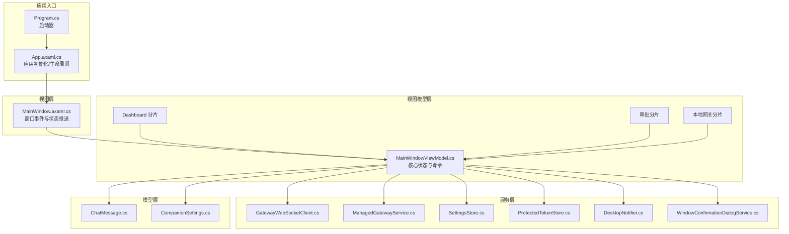
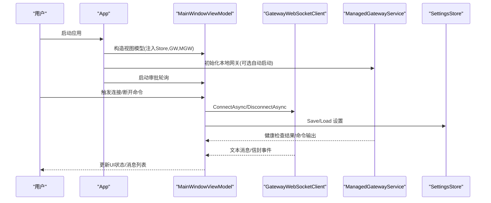
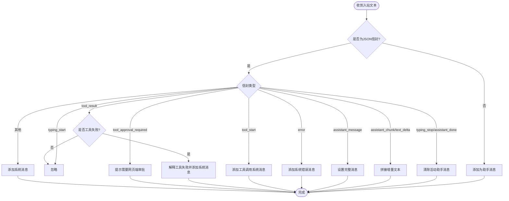
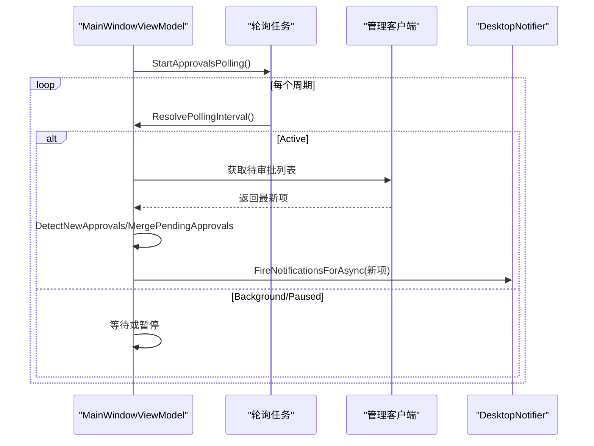
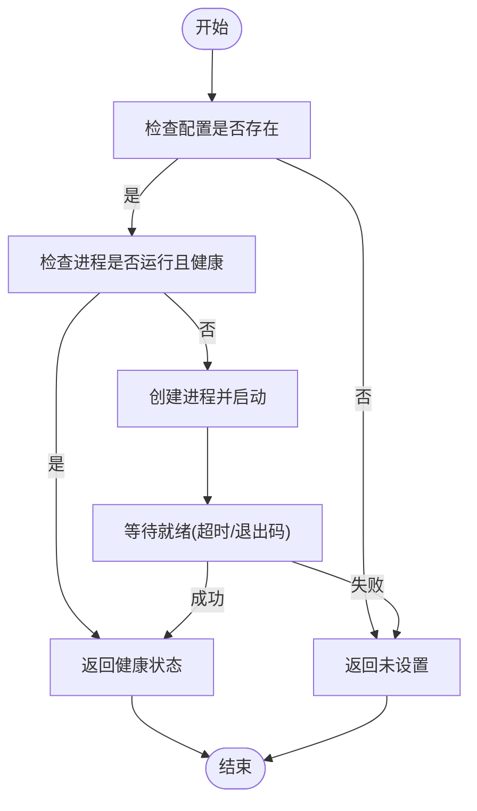
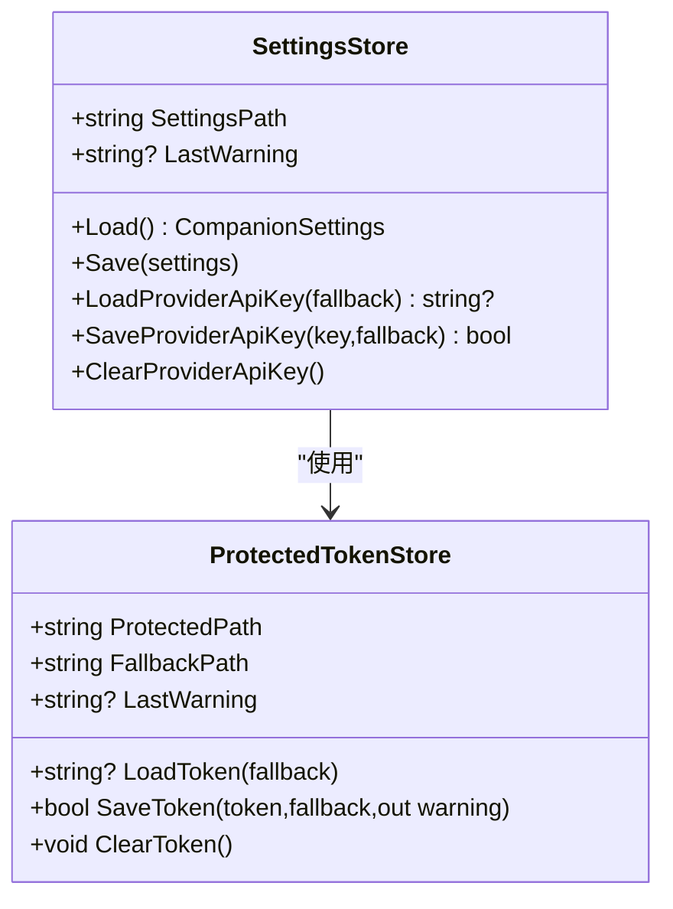
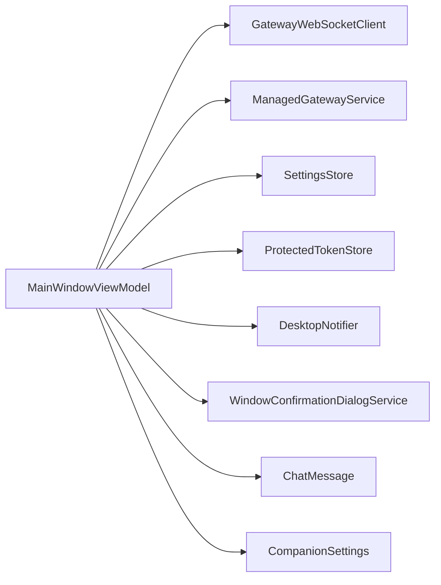

# 桌面客户端

<cite>
**本文引用的文件**
- [App.axaml.cs](file://src/OpenClaw.Companion/App.axaml.cs)
- [Program.cs](file://src/OpenClaw.Companion/Program.cs)
- [MainWindow.axaml.cs](file://src/OpenClaw.Companion/Views/MainWindow.axaml.cs)
- [MainWindowViewModel.cs](file://src/OpenClaw.Companion/ViewModels/MainWindowViewModel.cs)
- [ViewModelBase.cs](file://src/OpenClaw.Companion/ViewModels/ViewModelBase.cs)
- [MainWindowViewModel.Approvals.cs](file://src/OpenClaw.Companion/ViewModels/MainWindowViewModel.Approvals.cs)
- [MainWindowViewModel.Dashboard.cs](file://src/OpenClaw.Companion/ViewModels/MainWindowViewModel.Dashboard.cs)
- [MainWindowViewModel.ManagedGateway.cs](file://src/OpenClaw.Companion/ViewModels/MainWindowViewModel.ManagedGateway.cs)
- [DesktopNotifier.cs](file://src/OpenClaw.Companion/Services/DesktopNotifier.cs)
- [SettingsStore.cs](file://src/OpenClaw.Companion/Services/SettingsStore.cs)
- [ManagedGatewayService.cs](file://src/OpenClaw.Companion/Services/ManagedGatewayService.cs)
- [GatewayWebSocketClient.cs](file://src/OpenClaw.Companion/Services/GatewayWebSocketClient.cs)
- [ProtectedTokenStore.cs](file://src/OpenClaw.Companion/Services/ProtectedTokenStore.cs)
- [WindowConfirmationDialogService.cs](file://src/OpenClaw.Companion/Services/WindowConfirmationDialogService.cs)
- [ChatMessage.cs](file://src/OpenClaw.Companion/Models/ChatMessage.cs)
- [CompanionSettings.cs](file://src/OpenClaw.Companion/Models/CompanionSettings.cs)
</cite>

## 目录
1. [简介](#简介)
2. [项目结构](#项目结构)
3. [核心组件](#核心组件)
4. [架构总览](#架构总览)
5. [详细组件分析](#详细组件分析)
6. [依赖关系分析](#依赖关系分析)
7. [性能考量](#性能考量)
8. [故障排查指南](#故障排查指南)
9. [结论](#结论)
10. [附录](#附录)

## 简介
本文件面向桌面客户端（基于 Avalonia）的开发者与维护者，系统化阐述应用的架构设计、窗口与视图模型管理、命令绑定与状态管理、网关服务集成、通知系统、设置存储与安全令牌管理，并提供跨平台兼容性与用户体验优化建议。文档以代码级分析为基础，辅以多种可视化图表，帮助读者快速理解并高效扩展功能。

## 项目结构
桌面客户端位于 OpenClaw.Companion 工程中，采用 MVVM 架构与 Avalonia UI 框架，核心模块包括：
- 应用入口与生命周期：Program、App
- 视图层：MainWindow 及其代码隐藏文件
- 视图模型层：MainWindowViewModel 及其分片文件（审批、仪表盘、本地网关）
- 服务层：桌面通知、设置存储、受保护令牌存储、网关 WebSocket 客户端、本地网关管理
- 模型层：聊天消息、配套设置

**图表来源**
- [Program.cs:1-22](file://src/OpenClaw.Companion/Program.cs#L1-L22)
- [App.axaml.cs:1-78](file://src/OpenClaw.Companion/App.axaml.cs#L1-L78)
- [MainWindow.axaml.cs:1-66](file://src/OpenClaw.Companion/Views/MainWindow.axaml.cs#L1-L66)
- [MainWindowViewModel.cs:1-701](file://src/OpenClaw.Companion/ViewModels/MainWindowViewModel.cs#L1-L701)
- [MainWindowViewModel.Dashboard.cs:1-125](file://src/OpenClaw.Companion/ViewModels/MainWindowViewModel.Dashboard.cs#L1-L125)
- [MainWindowViewModel.Approvals.cs:1-594](file://src/OpenClaw.Companion/ViewModels/MainWindowViewModel.Approvals.cs#L1-L594)
- [MainWindowViewModel.ManagedGateway.cs:1-440](file://src/OpenClaw.Companion/ViewModels/MainWindowViewModel.ManagedGateway.cs#L1-L440)
- [GatewayWebSocketClient.cs:1-49](file://src/OpenClaw.Companion/Services/GatewayWebSocketClient.cs#L1-L49)
- [ManagedGatewayService.cs:1-674](file://src/OpenClaw.Companion/Services/ManagedGatewayService.cs#L1-L674)
- [SettingsStore.cs:1-204](file://src/OpenClaw.Companion/Services/SettingsStore.cs#L1-L204)
- [ProtectedTokenStore.cs:1-587](file://src/OpenClaw.Companion/Services/ProtectedTokenStore.cs#L1-L587)
- [DesktopNotifier.cs:1-176](file://src/OpenClaw.Companion/Services/DesktopNotifier.cs#L1-L176)
- [WindowConfirmationDialogService.cs:1-108](file://src/OpenClaw.Companion/Services/WindowConfirmationDialogService.cs#L1-L108)
- [ChatMessage.cs:1-41](file://src/OpenClaw.Companion/Models/ChatMessage.cs#L1-L41)
- [CompanionSettings.cs:1-25](file://src/OpenClaw.Companion/Models/CompanionSettings.cs#L1-L25)

**章节来源**
- [Program.cs:1-22](file://src/OpenClaw.Companion/Program.cs#L1-L22)
- [App.axaml.cs:1-78](file://src/OpenClaw.Companion/App.axaml.cs#L1-L78)
- [MainWindow.axaml.cs:1-66](file://src/OpenClaw.Companion/Views/MainWindow.axaml.cs#L1-L66)

## 核心组件
- 应用入口与生命周期
  - Program 负责构建 Avalonia 应用并启动经典桌面生命周期。
  - App 在框架初始化完成后创建视图模型、网关客户端、本地网关服务与设置存储，装配主窗口并启动审批轮询与本地网关初始化任务。
- 主窗口视图模型
  - MainWindowViewModel 聚合连接状态、认证令牌、调试模式、消息列表、网关配置等核心状态；通过 CommunityToolkit 的 RelayCommand 提供命令绑定；使用 Dispatcher.UIThread.Post 将异步回调切换到 UI 线程。
- 服务与模型
  - GatewayWebSocketClient 包装底层 WebSocket 客户端，暴露文本消息与信封事件。
  - ManagedGatewayService 管理本地网关进程、健康检查、配置读取与命令执行。
  - SettingsStore 负责 settings.json 的读写与警告信息聚合。
  - ProtectedTokenStore 抽象跨平台密钥存储（macOS Keychain、Windows DPAPI、Linux Secret-tool 或明文回退）。
  - DesktopNotifier 提供跨平台桌面通知（当前支持 macOS 与 Linux）。
  - WindowConfirmationDialogService 提供基于 Avalonia 的确认对话框。
  - ChatMessage/CompanionSettings 作为数据模型支撑 UI 绑定与设置持久化。

**章节来源**
- [Program.cs:1-22](file://src/OpenClaw.Companion/Program.cs#L1-L22)
- [App.axaml.cs:1-78](file://src/OpenClaw.Companion/App.axaml.cs#L1-L78)
- [MainWindowViewModel.cs:1-701](file://src/OpenClaw.Companion/ViewModels/MainWindowViewModel.cs#L1-L701)
- [GatewayWebSocketClient.cs:1-49](file://src/OpenClaw.Companion/Services/GatewayWebSocketClient.cs#L1-L49)
- [ManagedGatewayService.cs:1-674](file://src/OpenClaw.Companion/Services/ManagedGatewayService.cs#L1-L674)
- [SettingsStore.cs:1-204](file://src/OpenClaw.Companion/Services/SettingsStore.cs#L1-L204)
- [ProtectedTokenStore.cs:1-587](file://src/OpenClaw.Companion/Services/ProtectedTokenStore.cs#L1-L587)
- [DesktopNotifier.cs:1-176](file://src/OpenClaw.Companion/Services/DesktopNotifier.cs#L1-L176)
- [WindowConfirmationDialogService.cs:1-108](file://src/OpenClaw.Companion/Services/WindowConfirmationDialogService.cs#L1-L108)
- [ChatMessage.cs:1-41](file://src/OpenClaw.Companion/Models/ChatMessage.cs#L1-L41)
- [CompanionSettings.cs:1-25](file://src/OpenClaw.Companion/Models/CompanionSettings.cs#L1-L25)

## 架构总览
桌面客户端采用“视图模型驱动”的 MVVM 架构，视图模型负责状态与命令，服务层封装网络、进程与存储，模型层承载数据契约。审批轮询与本地网关生命周期在后台线程运行，UI 通过 Dispatcher 切换至主线程更新。

**图表来源**
- [App.axaml.cs:23-62](file://src/OpenClaw.Companion/App.axaml.cs#L23-L62)
- [MainWindowViewModel.cs:486-544](file://src/OpenClaw.Companion/ViewModels/MainWindowViewModel.cs#L486-L544)
- [GatewayWebSocketClient.cs:24-28](file://src/OpenClaw.Companion/Services/GatewayWebSocketClient.cs#L24-L28)
- [ManagedGatewayService.cs:161-202](file://src/OpenClaw.Companion/Services/ManagedGatewayService.cs#L161-L202)
- [SettingsStore.cs:37-118](file://src/OpenClaw.Companion/Services/SettingsStore.cs#L37-L118)

## 详细组件分析

### 主窗口视图模型（MainWindowViewModel）
- 状态属性
  - 连接相关：ServerUrl、IsConnected、Status、AuthToken、DebugMode
  - 认证与角色：Username、OperatorTokenLabel、OperatorIdentity、OperatorRole、OperatorAuthMode、IsBootstrapAdmin、CanManageAdmin
  - 管理员状态与部署：AdminStatus、DeploymentStatus
  - 消息与输入：Messages、InputText
  - 本地网关：LocalGatewayStatus、LocalGatewayIsHealthy、AutoStartLocalGateway、SetupProvider/Model/ModelPreset/WorkspacePath/LocalModelPath
  - 审批轮询：IsApprovalsBusy、ApprovalsStatus、ApprovalsLastPolled、IsApprovalsTabActive、IsWindowActive/Minimized、PollingMode
  - 仪表盘：Dashboard* 系列属性
- 命令
  - ConnectAsync/DisconnectAsync：建立或断开 WebSocket 连接
  - IssueOperatorTokenAsync：凭用户名/密码交换操作员令牌
  - SendAsync：发送用户消息
  - 刷新/加载：LoadAdminStatusAsync、LoadApprovalHistoryAsync、LoadDashboardAsync
  - 本地网关：SetupAndStartLocalGatewayAsync、StartLocalGatewayAsync、StopLocalGatewayAsync、安装/验证/移除嵌入式本地模型
- 数据处理
  - HandleInboundText：解析入站负载，区分普通文本与信封类型，按需追加/替换助手消息
  - ApplyEnvelope：根据信封类型更新 UI 或系统消息
  - 解析失败与工具失败解释：统一格式化错误提示
- 设置与环境变量
  - LoadSettings/SaveSettings：从 settings.json 加载/保存，同时同步受保护令牌与提供方密钥
  - ApplyEnvironmentSettings：从 OPENCLAW_BASE_URL 与 OPENCLAW_AUTH_TOKEN 注入默认值

**图表来源**
- [MainWindowViewModel.cs:198-265](file://src/OpenClaw.Companion/ViewModels/MainWindowViewModel.cs#L198-L265)

**章节来源**
- [MainWindowViewModel.cs:1-701](file://src/OpenClaw.Companion/ViewModels/MainWindowViewModel.cs#L1-L701)
- [MainWindowViewModel.Dashboard.cs:1-125](file://src/OpenClaw.Companion/ViewModels/MainWindowViewModel.Dashboard.cs#L1-L125)
- [MainWindowViewModel.Approvals.cs:1-594](file://src/OpenClaw.Companion/ViewModels/MainWindowViewModel.Approvals.cs#L1-L594)
- [MainWindowViewModel.ManagedGateway.cs:1-440](file://src/OpenClaw.Companion/ViewModels/MainWindowViewModel.ManagedGateway.cs#L1-L440)

### 审批轮询与通知（Approvals）
- 轮询策略
  - 根据窗口激活状态与审批标签页可见性动态调整轮询间隔（活跃/后台/暂停）
  - 使用 SemaphoreSlim 防止并发刷新；DetectNewApprovals 通过已知集合去重并合并最新项
- 通知
  - 支持桌面通知（macOS/Linux），可按焦点状态与开关控制
  - 多条待审批时合并为一条通知，单条时显示具体工具名与来源
- 决策流程
  - 通过确认对话框对变更类工具进行二次确认
  - 乐观地从列表移除，失败时回滚并恢复已知集合

**图表来源**
- [MainWindowViewModel.Approvals.cs:148-197](file://src/OpenClaw.Companion/ViewModels/MainWindowViewModel.Approvals.cs#L148-L197)
- [MainWindowViewModel.Approvals.cs:221-291](file://src/OpenClaw.Companion/ViewModels/MainWindowViewModel.Approvals.cs#L221-L291)
- [DesktopNotifier.cs:41-52](file://src/OpenClaw.Companion/Services/DesktopNotifier.cs#L41-L52)

**章节来源**
- [MainWindowViewModel.Approvals.cs:1-594](file://src/OpenClaw.Companion/ViewModels/MainWindowViewModel.Approvals.cs#L1-L594)
- [DesktopNotifier.cs:1-176](file://src/OpenClaw.Companion/Services/DesktopNotifier.cs#L1-L176)
- [WindowConfirmationDialogService.cs:1-108](file://src/OpenClaw.Companion/Services/WindowConfirmationDialogService.cs#L1-L108)

### 本地网关管理（ManagedGatewayService）
- 功能
  - 解析配置文件获取 BaseUrl/WS 地址
  - 健康检查（/health）
  - 启动/停止本地网关进程，等待就绪
  - 执行 CLI 命令（setup/models status/install/verify/remove）
  - 提供 API Key 环境变量注入
- 资源定位
  - 优先查找打包的 gateway/cli 可执行文件，否则回退到 dotnet run 仓库工程
- 错误处理
  - 对进程异常、超时、取消进行分类处理与清理

**图表来源**
- [ManagedGatewayService.cs:161-202](file://src/OpenClaw.Companion/Services/ManagedGatewayService.cs#L161-L202)
- [ManagedGatewayService.cs:314-328](file://src/OpenClaw.Companion/Services/ManagedGatewayService.cs#L314-L328)

**章节来源**
- [ManagedGatewayService.cs:1-674](file://src/OpenClaw.Companion/Services/ManagedGatewayService.cs#L1-L674)
- [MainWindowViewModel.ManagedGateway.cs:1-440](file://src/OpenClaw.Companion/ViewModels/MainWindowViewModel.ManagedGateway.cs#L1-L440)

### 设置存储与安全令牌（SettingsStore/ProtectedTokenStore）
- SettingsStore
  - settings.json 的读写，支持临时文件写入与原子替换
  - 从受保护令牌存储加载/保存 AuthToken，聚合 LastWarning
  - 提供 Provider API Key 的独立存储与标记文件
- ProtectedTokenStore
  - 跨平台抽象：macOS Keychain、Windows DPAPI、Linux Secret-tool、不可用时明文回退
  - 兼容旧版 JSON 字段读取
  - 明确的警告信息用于 UI 提示

**图表来源**
- [SettingsStore.cs:7-204](file://src/OpenClaw.Companion/Services/SettingsStore.cs#L7-L204)
- [ProtectedTokenStore.cs:22-119](file://src/OpenClaw.Companion/Services/ProtectedTokenStore.cs#L22-L119)

**章节来源**
- [SettingsStore.cs:1-204](file://src/OpenClaw.Companion/Services/SettingsStore.cs#L1-L204)
- [ProtectedTokenStore.cs:1-587](file://src/OpenClaw.Companion/Services/ProtectedTokenStore.cs#L1-L587)

### 网关 WebSocket 客户端（GatewayWebSocketClient）
- 包装 OpenClaw.Client.OpenClawWebSocketClient
- 暴露 OnTextMessage、OnEnvelopeReceived、OnError 事件
- 提供 ConnectAsync/DisconnectAsync/SendUserMessageAsync/SendEnvelopeAsync

**章节来源**
- [GatewayWebSocketClient.cs:1-49](file://src/OpenClaw.Companion/Services/GatewayWebSocketClient.cs#L1-L49)

### 窗口与命令绑定
- MainWindow
  - 监听激活/失活、最小化状态变化，向 VM 推送窗口状态
  - 监听选项卡选择，标记审批标签页是否激活
- 命令绑定
  - 使用 CommunityToolkit.Mvvm.Input 的 RelayCommand
  - 通过 CanExecute 控制按钮可用性（如审批刷新、历史加载）

**章节来源**
- [MainWindow.axaml.cs:1-66](file://src/OpenClaw.Companion/Views/MainWindow.axaml.cs#L1-L66)
- [MainWindowViewModel.Approvals.cs:120-130](file://src/OpenClaw.Companion/ViewModels/MainWindowViewModel.Approvals.cs#L120-L130)

## 依赖关系分析
- 组件耦合
  - MainWindowViewModel 依赖 SettingsStore、GatewayWebSocketClient、ManagedGatewayService、IDesktopNotifier、IConfirmationDialogService
  - 服务之间低耦合：GatewayWebSocketClient 仅封装底层客户端；ManagedGatewayService 专注进程与配置；SettingsStore/ProtectedTokenStore 专注持久化
- 外部依赖
  - Avalonia UI、CommunityToolkit.Mvvm、.NET 运行时
  - 平台特定：macOS Keychain、Windows DPAPI、Linux Secret-tool
- 循环依赖
  - 未发现直接循环；视图模型通过接口注入服务，避免循环引用

**图表来源**
- [MainWindowViewModel.cs:93-115](file://src/OpenClaw.Companion/ViewModels/MainWindowViewModel.cs#L93-L115)
- [GatewayWebSocketClient.cs:5-15](file://src/OpenClaw.Companion/Services/GatewayWebSocketClient.cs#L5-L15)
- [ManagedGatewayService.cs:8-42](file://src/OpenClaw.Companion/Services/ManagedGatewayService.cs#L8-L42)
- [SettingsStore.cs:7-35](file://src/OpenClaw.Companion/Services/SettingsStore.cs#L7-L35)
- [ProtectedTokenStore.cs:22-43](file://src/OpenClaw.Companion/Services/ProtectedTokenStore.cs#L22-L43)
- [DesktopNotifier.cs:6-13](file://src/OpenClaw.Companion/Services/DesktopNotifier.cs#L6-L13)
- [WindowConfirmationDialogService.cs:7-14](file://src/OpenClaw.Companion/Services/WindowConfirmationDialogService.cs#L7-L14)
- [ChatMessage.cs:10-14](file://src/OpenClaw.Companion/Models/ChatMessage.cs#L10-L14)
- [CompanionSettings.cs:5-24](file://src/OpenClaw.Companion/Models/CompanionSettings.cs#L5-L24)

**章节来源**
- [MainWindowViewModel.cs:1-701](file://src/OpenClaw.Companion/ViewModels/MainWindowViewModel.cs#L1-L701)
- [MainWindowViewModel.Approvals.cs:1-594](file://src/OpenClaw.Companion/ViewModels/MainWindowViewModel.Approvals.cs#L1-L594)
- [MainWindowViewModel.Dashboard.cs:1-125](file://src/OpenClaw.Companion/ViewModels/MainWindowViewModel.Dashboard.cs#L1-L125)
- [MainWindowViewModel.ManagedGateway.cs:1-440](file://src/OpenClaw.Companion/ViewModels/MainWindowViewModel.ManagedGateway.cs#L1-L440)

## 性能考量
- UI 线程隔离
  - 所有 UI 更新通过 Dispatcher.UIThread.Post 执行，避免跨线程访问 UI 导致异常与死锁
- 异步轮询
  - 审批轮询使用 CancellationTokenSource 控制生命周期，避免重复任务叠加
- 轻量解析
  - 信封解析采用流式 JSON 解析，减少内存峰值
- 进程管理
  - 本地网关启动/停止使用超时与异常捕获，防止僵尸进程与资源泄漏
- 存储写入
  - settings.json 使用临时文件写入后原子移动，降低损坏风险

[本节为通用指导，无需特定文件分析]

## 故障排查指南
- 连接问题
  - 检查 ServerUrl 是否为有效 WS 地址；查看 Status 与系统消息；确认本地网关健康状态
- 认证问题
  - 确认 AuthToken 是否存在；若启用明文回退，注意 LastWarning；尝试重新交换操作员令牌
- 本地网关问题
  - 查看 LocalGatewayStatus/Availability 描述；确认配置文件存在；尝试手动启动/停止；检查 CLI 权限
- 审批通知
  - 检查 DesktopNotifier 可用性与平台支持；确认通知开关与焦点条件；核对新审批检测逻辑
- 设置读取失败
  - 关注 SettingsStore.LastWarning；检查权限与磁盘空间；必要时删除损坏的 settings.json

**章节来源**
- [MainWindowViewModel.cs:486-544](file://src/OpenClaw.Companion/ViewModels/MainWindowViewModel.cs#L486-L544)
- [MainWindowViewModel.ManagedGateway.cs:75-85](file://src/OpenClaw.Companion/ViewModels/MainWindowViewModel.ManagedGateway.cs#L75-L85)
- [MainWindowViewModel.Approvals.cs:322-346](file://src/OpenClaw.Companion/ViewModels/MainWindowViewModel.Approvals.cs#L322-L346)
- [SettingsStore.cs:180-186](file://src/OpenClaw.Companion/Services/SettingsStore.cs#L180-L186)

## 结论
该桌面客户端以清晰的 MVVM 分层与服务化设计实现了与网关的稳定交互，具备完善的设置与令牌管理、跨平台通知与对话框体验，以及可扩展的审批轮询与本地网关管理能力。建议在后续迭代中进一步完善 Windows 平台通知支持、增强错误诊断与日志记录，并持续优化轮询策略与 UI 响应性。

[本节为总结性内容，无需特定文件分析]

## 附录
- 开发指南
  - 新增命令：在 MainWindowViewModel 中定义 RelayCommand，必要时在 Approvals/Dashboard/ManagedGateway 分片中拆分职责
  - 新增设置：在 CompanionSettings 中新增字段，在 SettingsStore 中同步 Load/Save
  - 新增服务：实现接口并通过构造函数注入到 ViewModel
- 跨平台兼容性
  - macOS：Keychain；Windows：DPAPI；Linux：Secret-tool；不满足条件时使用明文回退
- 用户体验优化
  - 合理使用 CanExecute 控制按钮状态
  - 在长耗时操作中显示 Busy 状态与进度提示
  - 对关键错误提供明确的 LastWarning 与系统消息

[本节为通用指导，无需特定文件分析]