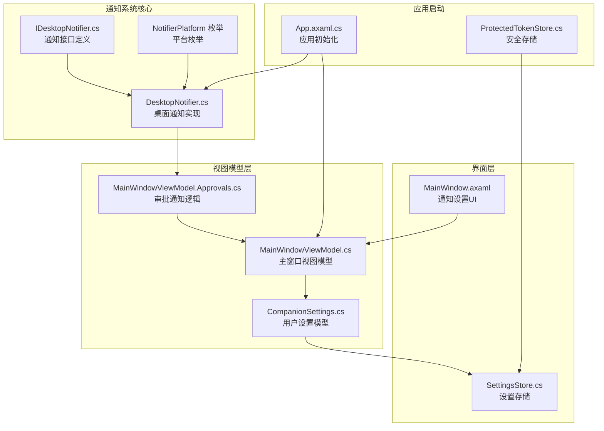
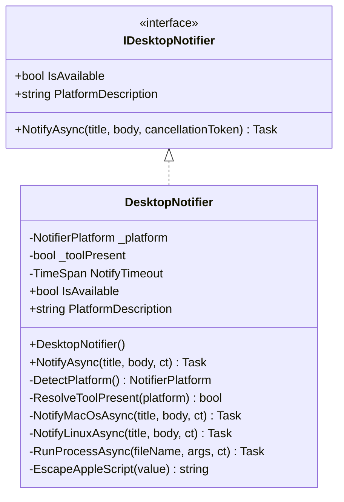
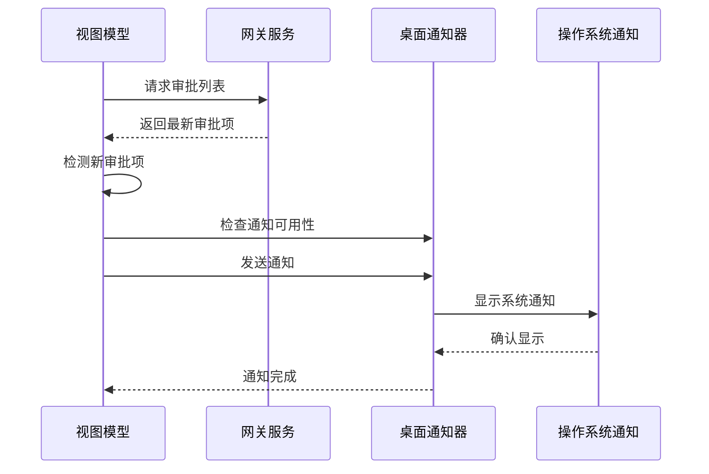
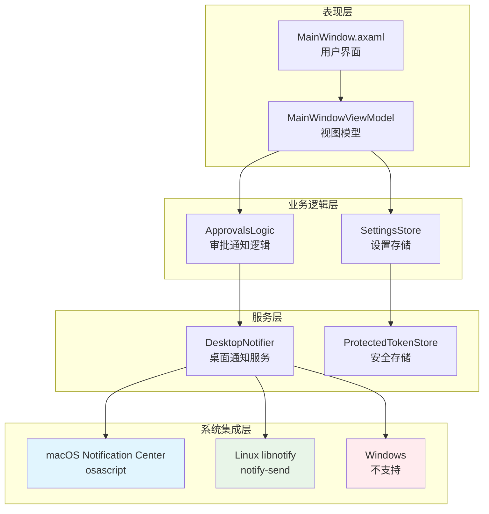
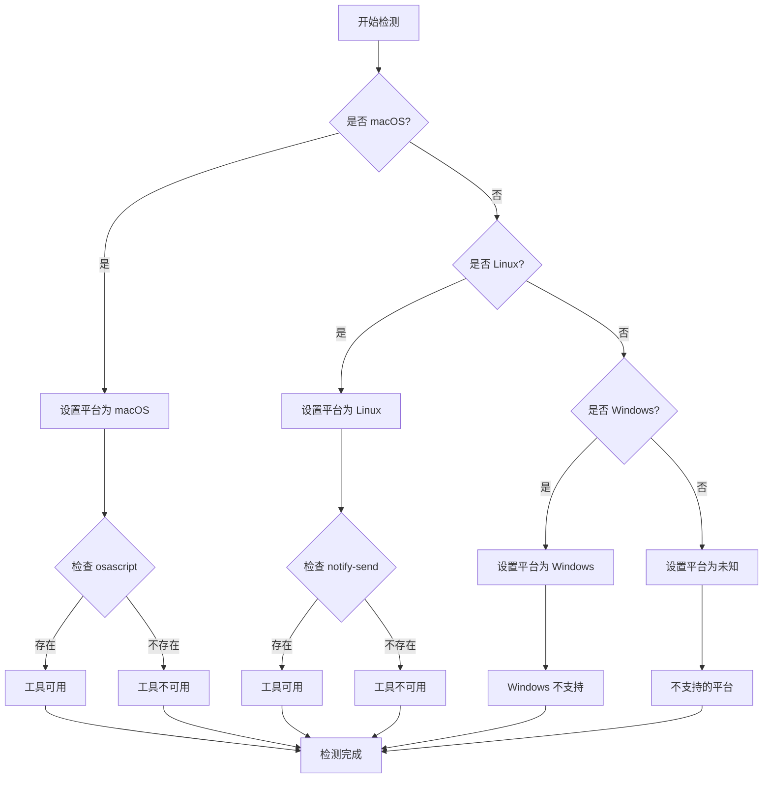
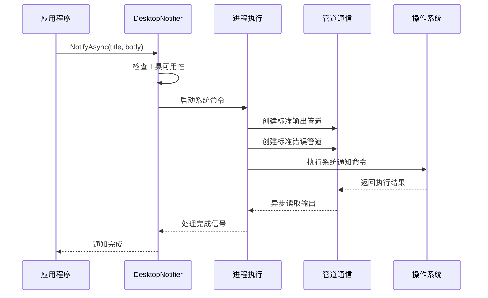
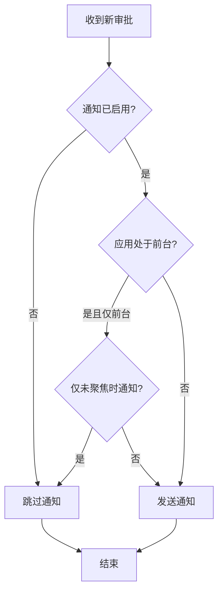
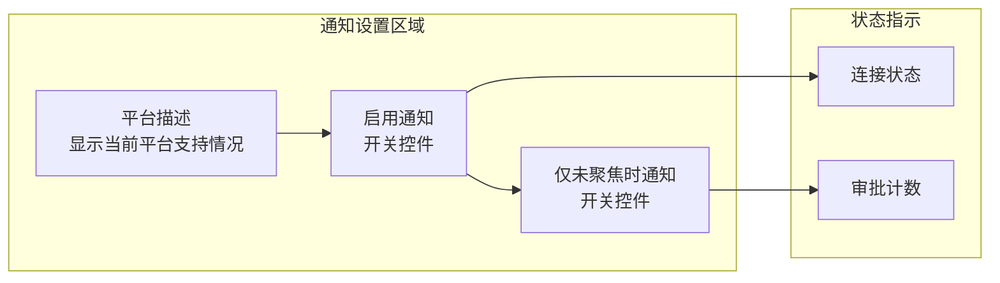
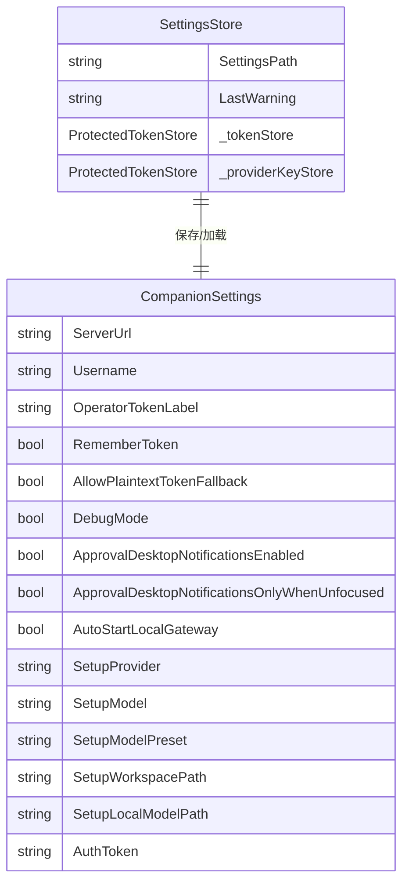
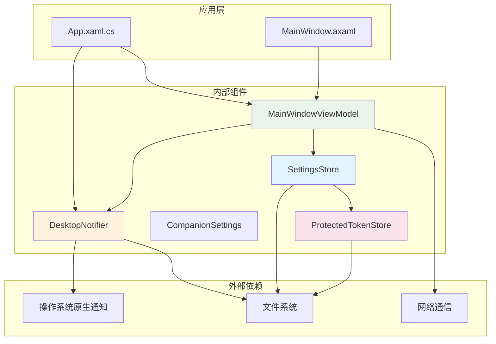

# 通知系统

<cite>
**本文档引用的文件**
- [DesktopNotifier.cs](file://src/OpenClaw.Companion/Services/DesktopNotifier.cs)
- [MainWindowViewModel.Approvals.cs](file://src/OpenClaw.Companion/ViewModels/MainWindowViewModel.Approvals.cs)
- [MainWindowViewModel.cs](file://src/OpenClaw.Companion/ViewModels/MainWindowViewModel.cs)
- [MainWindow.axaml](file://src/OpenClaw.Companion/Views/MainWindow.axaml)
- [SettingsStore.cs](file://src/OpenClaw.Companion/Services/SettingsStore.cs)
- [CompanionSettings.cs](file://src/OpenClaw.Companion/Models/CompanionSettings.cs)
- [App.axaml.cs](file://src/OpenClaw.Companion/App.axaml.cs)
- [ProtectedTokenStore.cs](file://src/OpenClaw.Companion/Services/ProtectedTokenStore.cs)
</cite>

## 目录
1. [简介](#简介)
2. [项目结构](#项目结构)
3. [核心组件](#核心组件)
4. [架构概览](#架构概览)
5. [详细组件分析](#详细组件分析)
6. [依赖关系分析](#依赖关系分析)
7. [性能考虑](#性能考虑)
8. [故障排除指南](#故障排除指南)
9. [结论](#结论)

## 简介

桌面客户端通知系统是 OpenClaw Companion 桌面应用程序的重要组成部分，负责在用户需要审批工具请求时提供及时的通知提醒。该系统实现了跨平台兼容性，支持 macOS 和 Linux 系统的原生通知功能，并通过可插拔的接口设计确保了良好的扩展性和维护性。

系统的核心功能包括：
- 自动检测和响应新的审批请求
- 跨平台桌面通知发送（macOS Notification Center、Linux libnotify）
- 用户偏好设置管理（启用/禁用通知、焦点状态控制）
- 通知权限管理和平台兼容性检查
- 通知历史记录和状态跟踪

## 项目结构

通知系统主要分布在以下目录结构中：

**图表来源**
- [DesktopNotifier.cs:1-176](file://src/OpenClaw.Companion/Services/DesktopNotifier.cs#L1-L176)
- [MainWindowViewModel.Approvals.cs:1-594](file://src/OpenClaw.Companion/ViewModels/MainWindowViewModel.Approvals.cs#L1-L594)
- [MainWindowViewModel.cs:42-513](file://src/OpenClaw.Companion/ViewModels/MainWindowViewModel.cs#L42-L513)

**章节来源**
- [DesktopNotifier.cs:1-176](file://src/OpenClaw.Companion/Services/DesktopNotifier.cs#L1-L176)
- [MainWindowViewModel.Approvals.cs:1-594](file://src/OpenClaw.Companion/ViewModels/MainWindowViewModel.Approvals.cs#L1-L594)

## 核心组件

### 通知接口层

通知系统采用接口驱动的设计模式，通过 `IDesktopNotifier` 接口定义统一的抽象层：

**图表来源**
- [DesktopNotifier.cs:6-176](file://src/OpenClaw.Companion/Services/DesktopNotifier.cs#L6-L176)

### 审批通知处理层

审批通知处理逻辑集中在 `MainWindowViewModel.Approvals` 部分，实现了智能的通知触发机制：

**图表来源**
- [MainWindowViewModel.Approvals.cs:221-291](file://src/OpenClaw.Companion/ViewModels/MainWindowViewModel.Approvals.cs#L221-L291)
- [DesktopNotifier.cs:41-52](file://src/OpenClaw.Companion/Services/DesktopNotifier.cs#L41-L52)

**章节来源**
- [DesktopNotifier.cs:6-176](file://src/OpenClaw.Companion/Services/DesktopNotifier.cs#L6-L176)
- [MainWindowViewModel.Approvals.cs:322-346](file://src/OpenClaw.Companion/ViewModels/MainWindowViewModel.Approvals.cs#L322-L346)

## 架构概览

通知系统采用分层架构设计，确保了各组件间的松耦合和高内聚：

**图表来源**
- [App.axaml.cs:34-35](file://src/OpenClaw.Companion/App.axaml.cs#L34-L35)
- [MainWindowViewModel.cs:88-115](file://src/OpenClaw.Companion/ViewModels/MainWindowViewModel.cs#L88-L115)

## 详细组件分析

### 桌面通知器实现

桌面通知器是通知系统的核心组件，负责与操作系统原生通知系统进行交互：

#### 平台检测机制

**图表来源**
- [DesktopNotifier.cs:54-71](file://src/OpenClaw.Companion/Services/DesktopNotifier.cs#L54-L71)
- [DesktopNotifier.cs:65-71](file://src/OpenClaw.Companion/Services/DesktopNotifier.cs#L65-L71)

#### 通知发送流程

通知发送过程采用了异步非阻塞的设计，确保不会影响主应用程序的响应性：

**图表来源**
- [DesktopNotifier.cs:114-163](file://src/OpenClaw.Companion/Services/DesktopNotifier.cs#L114-L163)

**章节来源**
- [DesktopNotifier.cs:15-176](file://src/OpenClaw.Companion/Services/DesktopNotifier.cs#L15-L176)

### 审批通知触发机制

审批通知系统实现了智能的通知触发策略，避免不必要的通知干扰：

#### 通知触发条件

**图表来源**
- [MainWindowViewModel.Approvals.cs:322-330](file://src/OpenClaw.Companion/ViewModels/MainWindowViewModel.Approvals.cs#L322-L330)

#### 通知内容格式化

系统支持单个和批量通知的智能格式化：

| 场景 | 标题格式 | 内容格式 | 示例 |
|------|----------|----------|------|
| 单个审批 | `Approval needed: {工具名称}` | `from {来源}` | `Approval needed: FileReadTool from email_channel` |
| 批量审批 | `{数量} approvals pending` | 前三个工具名称，超过三个显示省略号 | `3 approvals pending FileReadTool, FileWriteTool, DatabaseTool, and 1 more` |

**章节来源**
- [MainWindowViewModel.Approvals.cs:332-346](file://src/OpenClaw.Companion/ViewModels/MainWindowViewModel.Approvals.cs#L332-L346)

### 用户界面集成

通知系统的用户界面提供了直观的配置选项：

#### 设置界面元素

**图表来源**
- [MainWindow.axaml:463](file://src/OpenClaw.Companion/Views/MainWindow.axaml#L463)

**章节来源**
- [MainWindow.axaml:463](file://src/OpenClaw.Companion/Views/MainWindow.axaml#L463)

### 设置持久化机制

通知系统的用户偏好设置通过专门的存储类进行管理：

#### 设置数据模型

**图表来源**
- [CompanionSettings.cs:5-24](file://src/OpenClaw.Companion/Models/CompanionSettings.cs#L5-L24)
- [SettingsStore.cs:7-35](file://src/OpenClaw.Companion/Services/SettingsStore.cs#L7-L35)

**章节来源**
- [CompanionSettings.cs:1-25](file://src/OpenClaw.Companion/Models/CompanionSettings.cs#L1-L25)
- [SettingsStore.cs:79-118](file://src/OpenClaw.Companion/Services/SettingsStore.cs#L79-L118)

## 依赖关系分析

通知系统的依赖关系展现了清晰的分层架构：

**图表来源**
- [App.axaml.cs:34-35](file://src/OpenClaw.Companion/App.axaml.cs#L34-L35)
- [DesktopNotifier.cs:15-27](file://src/OpenClaw.Companion/Services/DesktopNotifier.cs#L15-L27)

**章节来源**
- [App.axaml.cs:34-35](file://src/OpenClaw.Companion/App.axaml.cs#L34-L35)
- [DesktopNotifier.cs:15-27](file://src/OpenClaw.Companion/Services/DesktopNotifier.cs#L15-L27)

## 性能考虑

通知系统在设计时充分考虑了性能优化：

### 异步处理机制

- **非阻塞通知发送**：使用异步任务处理通知发送，避免阻塞主线程
- **超时控制**：每个通知尝试都有5秒超时限制，防止进程泄漏
- **并发管道处理**：同时处理标准输出和错误流，避免管道缓冲区溢出

### 内存管理

- **资源自动释放**：使用 `using` 语句确保进程对象正确释放
- **内存池优化**：复用字符串构建器，减少内存分配
- **垃圾回收友好**：避免创建不必要的临时对象

### 系统资源优化

- **平台检测缓存**：平台信息只检测一次并缓存
- **工具可用性检查**：使用一次性检查避免重复系统调用
- **通知去重**：通过已知审批ID集合避免重复通知

## 故障排除指南

### 常见问题诊断

#### 通知不显示问题

**症状**：应用显示通知可用，但系统没有弹出通知

**可能原因**：
1. 系统通知中心权限未授予
2. 对应的系统工具未安装或不在PATH中
3. 应用程序无权访问系统通知服务

**解决方案**：
1. 检查系统通知权限设置
2. 验证 `osascript` (macOS) 或 `notify-send` (Linux) 是否可用
3. 重新启动应用程序以重新检测环境

#### 通知延迟问题

**症状**：审批到达后通知延迟出现

**可能原因**：
1. 审批轮询间隔设置过长
2. 网络连接不稳定
3. 系统负载过高

**解决方案**：
1. 调整审批轮询设置（活动标签页1.5秒，后台5秒）
2. 检查网络连接质量
3. 关闭其他占用系统资源的应用程序

#### 设置无法保存问题

**症状**：更改通知设置后重启应用丢失

**可能原因**：
1. 文件权限不足
2. 配置文件损坏
3. 存储路径不可写

**解决方案**：
1. 检查应用数据目录权限
2. 删除损坏的设置文件并重新配置
3. 使用管理员权限运行应用程序

**章节来源**
- [DesktopNotifier.cs:114-163](file://src/OpenClaw.Companion/Services/DesktopNotifier.cs#L114-L163)
- [SettingsStore.cs:37-77](file://src/OpenClaw.Companion/Services/SettingsStore.cs#L37-L77)

## 结论

桌面客户端通知系统通过精心设计的架构实现了跨平台的桌面通知功能。系统的主要优势包括：

### 技术优势

1. **跨平台兼容性**：支持 macOS 和 Linux 的原生通知系统
2. **智能触发机制**：基于应用状态和用户偏好的智能通知触发
3. **健壮的错误处理**：完善的异常捕获和资源清理机制
4. **用户友好的界面**：直观的设置选项和状态反馈

### 设计亮点

1. **接口驱动设计**：通过 `IDesktopNotifier` 接口实现良好的可扩展性
2. **异步非阻塞**：确保通知功能不影响应用程序的响应性
3. **资源优化**：高效的内存管理和系统资源利用
4. **安全存储**：用户设置的安全存储机制

### 改进建议

1. **Windows 支持**：未来版本可以添加对 Windows 系统通知的支持
2. **自定义样式**：允许用户自定义通知外观和行为
3. **通知历史**：增加通知历史记录功能便于审计
4. **声音效果**：添加可配置的声音提示功能

该通知系统为 OpenClaw Companion 提供了可靠的桌面通知能力，通过合理的架构设计和实现细节，确保了良好的用户体验和系统稳定性。