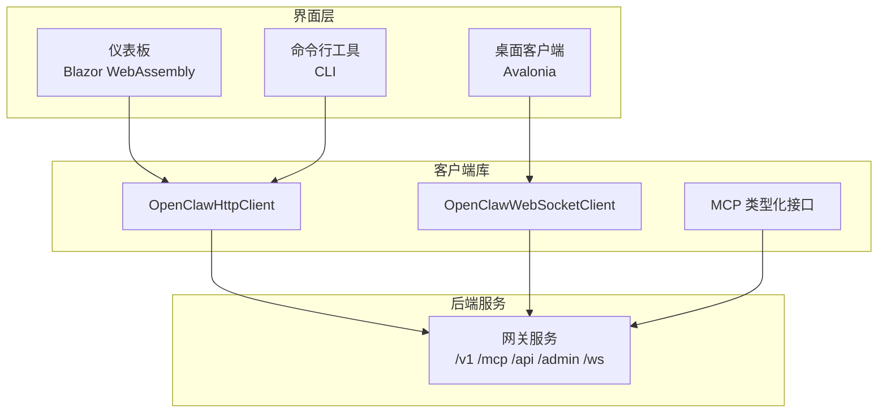
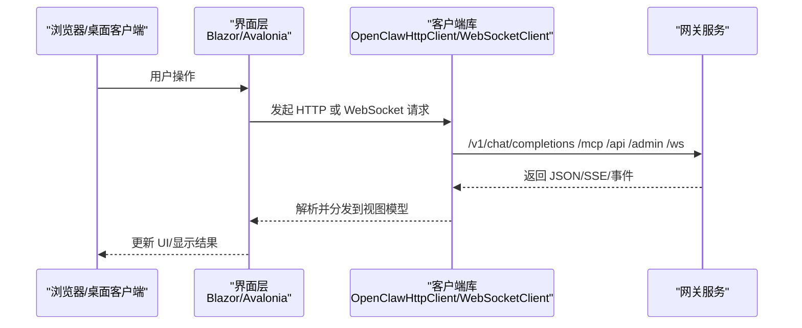
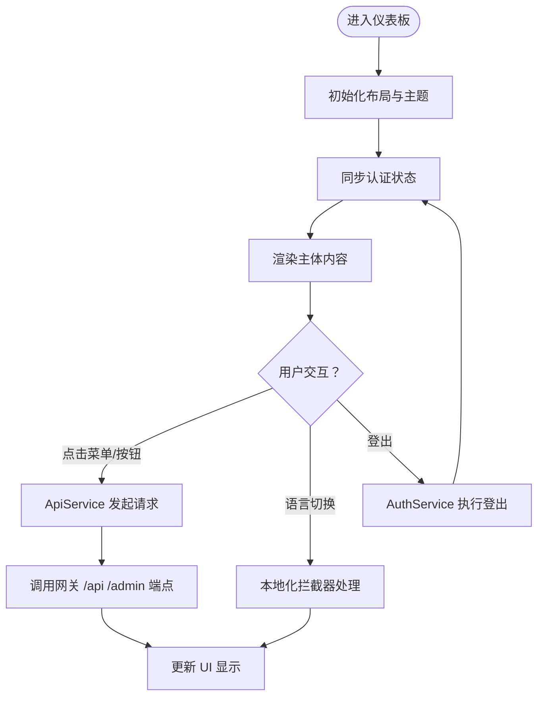
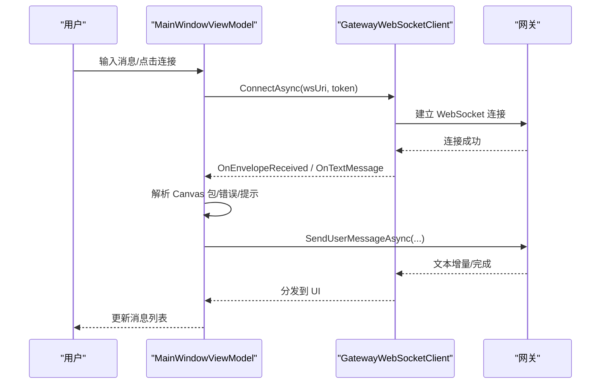
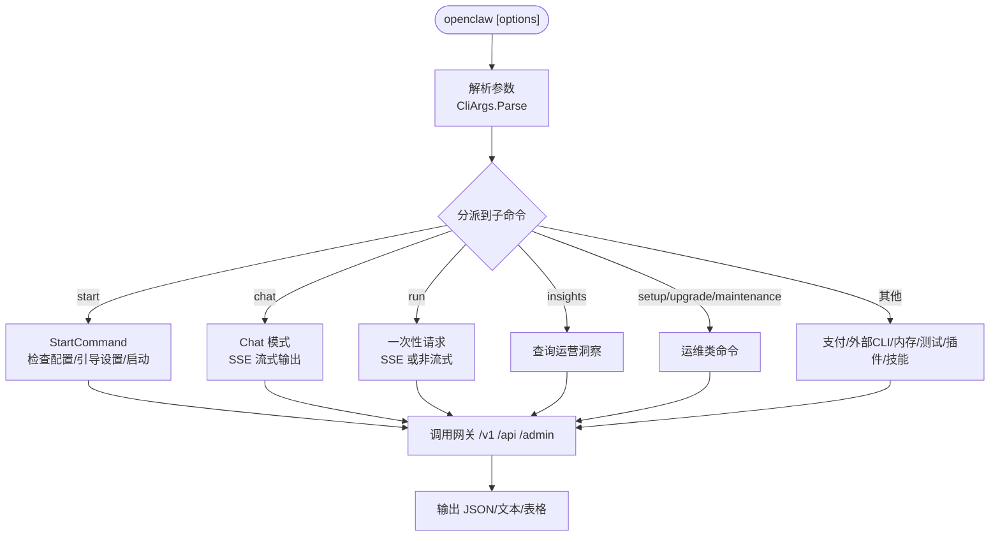
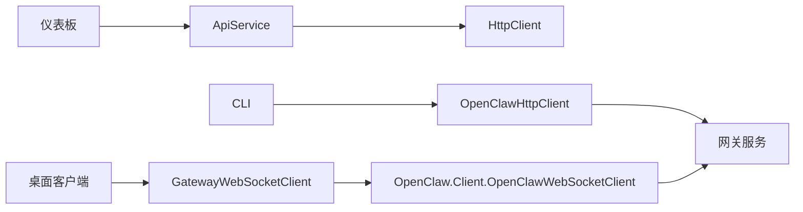

# 管理界面

<cite>
**本文引用的文件**
- [src/OpenClaw.Dashboard/App.razor](file://src/OpenClaw.Dashboard/App.razor)
- [src/OpenClaw.Dashboard/Program.cs](file://src/OpenClaw.Dashboard/Program.cs)
- [src/OpenClaw.Dashboard/Layout/MainLayout.razor](file://src/OpenClaw.Dashboard/Layout/MainLayout.razor)
- [src/OpenClaw.Dashboard/Services/ApiService.cs](file://src/OpenClaw.Dashboard/Services/ApiService.cs)
- [src/OpenClaw.Dashboard/Services/AuthService.cs](file://src/OpenClaw.Dashboard/Services/AuthService.cs)
- [src/OpenClaw.Dashboard/Services/SettingsService.cs](file://src/OpenClaw.Dashboard/Services/SettingsService.cs)
- [src/OpenClaw.Dashboard/Services/EventStreamService.cs](file://src/OpenClaw.Dashboard/Services/EventStreamService.cs)
- [src/OpenClaw.Dashboard/Services/LocalizationService.cs](file://src/OpenClaw.Dashboard/Services/LocalizationService.cs)
- [src/OpenClaw.Dashboard/Services/DashboardMudLocalizationInterceptor.cs](file://src/OpenClaw.Dashboard/Services/DashboardMudLocalizationInterceptor.cs)
- [src/OpenClaw.Companion/App.axaml](file://src/OpenClaw.Companion/App.axaml)
- [src/OpenClaw.Companion/Program.cs](file://src/OpenClaw.Companion/Program.cs)
- [src/OpenClaw.Companion/ViewModels/MainWindowViewModel.cs](file://src/OpenClaw.Companion/ViewModels/MainWindowViewModel.cs)
- [src/OpenClaw.Companion/Services/SettingsStore.cs](file://src/OpenClaw.Companion/Services/SettingsStore.cs)
- [src/OpenClaw.Companion/Services/GatewayWebSocketClient.cs](file://src/OpenClaw.Companion/Services/GatewayWebSocketClient.cs)
- [src/OpenClaw.Cli/Program.cs](file://src/OpenClaw.Cli/Program.cs)
- [src/OpenClaw.Cli/CliArgs.cs](file://src/OpenClaw.Cli/CliArgs.cs)
- [src/OpenClaw.Cli/StartCommand.cs](file://src/OpenClaw.Cli/StartCommand.cs)
- [src/OpenClaw.Client/OpenClawHttpClient.cs](file://src/OpenClaw.Client/OpenClawHttpClient.cs)
- [src/OpenClaw.Client/OpenClawWebSocketClient.cs](file://src/OpenClaw.Client/OpenClawWebSocketClient.cs)
- [src/OpenClaw.Client/McpModels.cs](file://src/OpenClaw.Client/McpModels.cs)
- [src/OpenClaw.Client/McpJsonContext.cs](file://src/OpenClaw.Client/McpJsonContext.cs)
- [src/OpenClaw.Client/GatewayEndpointResolver.cs](file://src/OpenClaw.Client/GatewayEndpointResolver.cs)
- [src/OpenClaw.Client/OpenClawLiveClient.cs](file://src/OpenClaw.Client/OpenClawLiveClient.cs)
- [src/OpenClaw.Client/OpenClawWebSocketClient.cs](file://src/OpenClaw.Client/OpenClawWebSocketClient.cs)
- [src/OpenClaw.Client/McpJsonContext.cs](file://src/OpenClaw.Client/McpJsonContext.cs)
- [src/OpenClaw.Client/McpModels.cs](file://src/OpenClaw.Client/McpModels.cs)
- [src/OpenClaw.Client/GatewayEndpointResolver.cs](file://src/OpenClaw.Client/GatewayEndpointResolver.cs)
- [src/OpenClaw.Client/OpenClawLiveClient.cs](file://src/OpenClaw.Client/OpenClawLiveClient.cs)
- [src/OpenClaw.Client/OpenClawHttpClient.cs](file://src/OpenClaw.Client/OpenClawHttpClient.cs)
</cite>

## 目录
1. [简介](#简介)
2. [项目结构](#项目结构)
3. [核心组件](#核心组件)
4. [架构总览](#架构总览)
5. [详细组件分析](#详细组件分析)
6. [依赖关系分析](#依赖关系分析)
7. [性能考虑](#性能考虑)
8. [故障排查指南](#故障排查指南)
9. [结论](#结论)
10. [附录](#附录)

## 简介
本文件为“管理界面系统”的全面技术文档，覆盖以下界面与能力：
- 运营商仪表板（Blazor WebAssembly）
- 桌面客户端（Avalonia）
- 命令行工具（CLI）
- 客户端库（HTTP/WebSocket/MCP）

文档从架构设计、用户交互模式、集成方式、使用示例、配置选项与定制化方法等方面进行深入说明，并提供开发指南与最佳实践。

## 项目结构
系统由四个主要部分组成：
- 运营商仪表板：基于 Blazor WebAssembly，提供浏览器内的管理界面，支持认证、导航、主题与本地化。
- 桌面客户端：基于 Avalonia，提供本地聊天与运行时事件订阅，支持自动连接网关、消息流式处理与审批提示。
- 命令行工具：提供丰富的子命令，涵盖启动、聊天、洞察、设置、升级、维护、支付、外部CLI、内存、测试、插件、技能等。
- 客户端库：封装 HTTP 与 WebSocket 访问，统一 MCP 接口，提供对网关 API 的类型化调用。

图表来源
- [src/OpenClaw.Dashboard/Program.cs:9-23](file://src/OpenClaw.Dashboard/Program.cs#L9-L23)
- [src/OpenClaw.Companion/App.axaml:1-22](file://src/OpenClaw.Companion/App.axaml#L1-L22)
- [src/OpenClaw.Cli/Program.cs:12-69](file://src/OpenClaw.Cli/Program.cs#L12-L69)
- [src/OpenClaw.Client/OpenClawHttpClient.cs:91-182](file://src/OpenClaw.Client/OpenClawHttpClient.cs#L91-L182)
- [src/OpenClaw.Client/OpenClawWebSocketClient.cs:1-49](file://src/OpenClaw.Client/OpenClawWebSocketClient.cs#L1-L49)

章节来源
- [src/OpenClaw.Dashboard/App.razor:1-13](file://src/OpenClaw.Dashboard/App.razor#L1-L13)
- [src/OpenClaw.Dashboard/Program.cs:9-23](file://src/OpenClaw.Dashboard/Program.cs#L9-L23)
- [src/OpenClaw.Companion/App.axaml:1-22](file://src/OpenClaw.Companion/App.axaml#L1-L22)
- [src/OpenClaw.Cli/Program.cs:12-69](file://src/OpenClaw.Cli/Program.cs#L12-L69)
- [src/OpenClaw.Client/OpenClawHttpClient.cs:91-182](file://src/OpenClaw.Client/OpenClawHttpClient.cs#L91-L182)
- [src/OpenClaw.Client/OpenClawWebSocketClient.cs:1-49](file://src/OpenClaw.Client/OpenClawWebSocketClient.cs#L1-L49)

## 核心组件
- 仪表板（Blazor WebAssembly）
  - 路由与布局：路由、NotFound 处理、主布局、主题与本地化。
  - 服务注入：MudBlazor、本地化拦截器、ApiService、AuthService、EventStreamService、SettingsService。
  - 关键服务：ApiService 封装 HTTP 请求；AuthService 管理认证状态；EventStreamService 管理事件流；SettingsService 管理前端设置。
- 桌面客户端（Avalonia）
  - 应用入口：App.axaml 定义资源、数据模板与样式；Program.cs 启动 Avalonia 生命周期。
  - 视图模型：MainWindowViewModel 负责连接、消息收发、环境包解析、审批提示解释、管理员状态加载等。
  - 服务：SettingsStore 负责本地设置与令牌存储；GatewayWebSocketClient 封装 WebSocket 客户端。
- 命令行工具（CLI）
  - 入口：Program.cs 解析命令与参数，分派到具体命令实现。
  - 参数解析：CliArgs 提供通用参数解析能力。
  - 启动流程：StartCommand 统一“有配置则直接启动，无配置则先引导设置再启动”。
- 客户端库
  - OpenClawHttpClient：集中定义所有 API URI，提供类型化请求/响应方法，支持 SSE 流式输出与 MCP 调用。
  - OpenClawWebSocketClient：封装 WebSocket 连接、消息发送与事件分发。
  - MCP 类型化：McpModels 与 McpJsonContext 提供 MCP 请求/响应的序列化上下文。

章节来源
- [src/OpenClaw.Dashboard/Program.cs:9-23](file://src/OpenClaw.Dashboard/Program.cs#L9-L23)
- [src/OpenClaw.Dashboard/Services/ApiService.cs:8-23](file://src/OpenClaw.Dashboard/Services/ApiService.cs#L8-L23)
- [src/OpenClaw.Dashboard/Services/AuthService.cs](file://src/OpenClaw.Dashboard/Services/AuthService.cs)
- [src/OpenClaw.Dashboard/Services/EventStreamService.cs](file://src/OpenClaw.Dashboard/Services/EventStreamService.cs)
- [src/OpenClaw.Dashboard/Services/SettingsService.cs](file://src/OpenClaw.Dashboard/Services/SettingsService.cs)
- [src/OpenClaw.Companion/ViewModels/MainWindowViewModel.cs:13-115](file://src/OpenClaw.Companion/ViewModels/MainWindowViewModel.cs#L13-L115)
- [src/OpenClaw.Companion/Services/SettingsStore.cs:7-35](file://src/OpenClaw.Companion/Services/SettingsStore.cs#L7-L35)
- [src/OpenClaw.Companion/Services/GatewayWebSocketClient.cs:5-15](file://src/OpenClaw.Companion/Services/GatewayWebSocketClient.cs#L5-L15)
- [src/OpenClaw.Cli/Program.cs:12-69](file://src/OpenClaw.Cli/Program.cs#L12-L69)
- [src/OpenClaw.Cli/CliArgs.cs:3-73](file://src/OpenClaw.Cli/CliArgs.cs#L3-L73)
- [src/OpenClaw.Cli/StartCommand.cs:5-47](file://src/OpenClaw.Cli/StartCommand.cs#L5-L47)
- [src/OpenClaw.Client/OpenClawHttpClient.cs:91-182](file://src/OpenClaw.Client/OpenClawHttpClient.cs#L91-L182)
- [src/OpenClaw.Client/OpenClawWebSocketClient.cs:1-49](file://src/OpenClaw.Client/OpenClawWebSocketClient.cs#L1-L49)
- [src/OpenClaw.Client/McpModels.cs](file://src/OpenClaw.Client/McpModels.cs)
- [src/OpenClaw.Client/McpJsonContext.cs](file://src/OpenClaw.Client/McpJsonContext.cs)

## 架构总览
下图展示从界面到后端的整体交互路径与职责边界：

图表来源
- [src/OpenClaw.Dashboard/Services/ApiService.cs:42-54](file://src/OpenClaw.Dashboard/Services/ApiService.cs#L42-L54)
- [src/OpenClaw.Client/OpenClawHttpClient.cs:190-260](file://src/OpenClaw.Client/OpenClawHttpClient.cs#L190-L260)
- [src/OpenClaw.Client/OpenClawWebSocketClient.cs:1-49](file://src/OpenClaw.Client/OpenClawWebSocketClient.cs#L1-L49)

章节来源
- [src/OpenClaw.Client/OpenClawHttpClient.cs:190-260](file://src/OpenClaw.Client/OpenClawHttpClient.cs#L190-L260)
- [src/OpenClaw.Client/OpenClawWebSocketClient.cs:1-49](file://src/OpenClaw.Client/OpenClawWebSocketClient.cs#L1-L49)
- [src/OpenClaw.Dashboard/Services/ApiService.cs:42-54](file://src/OpenClaw.Dashboard/Services/ApiService.cs#L42-L54)

## 详细组件分析

### 仪表板（Blazor WebAssembly）
- 路由与布局
  - 使用 Router 组件进行页面路由，NotFound 场景返回自定义布局。
  - MainLayout 提供 AppBar、抽屉菜单、语言切换、认证状态与对话框服务。
- 服务与本地化
  - MudBlazor 服务注册与主题配置。
  - 自定义 ILocalizationInterceptor 用于兜底本地化键值。
- API 与认证
  - ApiService 封装 GET/POST/PUT/DELETE，自动附加 API Key 与 CSRF Token。
  - AuthService 管理登录/登出与认证状态同步。

图表来源
- [src/OpenClaw.Dashboard/Layout/MainLayout.razor:107-126](file://src/OpenClaw.Dashboard/Layout/MainLayout.razor#L107-L126)
- [src/OpenClaw.Dashboard/Services/ApiService.cs:42-98](file://src/OpenClaw.Dashboard/Services/ApiService.cs#L42-L98)
- [src/OpenClaw.Dashboard/Services/AuthService.cs](file://src/OpenClaw.Dashboard/Services/AuthService.cs)

章节来源
- [src/OpenClaw.Dashboard/App.razor:1-13](file://src/OpenClaw.Dashboard/App.razor#L1-L13)
- [src/OpenClaw.Dashboard/Program.cs:9-23](file://src/OpenClaw.Dashboard/Program.cs#L9-L23)
- [src/OpenClaw.Dashboard/Layout/MainLayout.razor:107-126](file://src/OpenClaw.Dashboard/Layout/MainLayout.razor#L107-L126)
- [src/OpenClaw.Dashboard/Services/ApiService.cs:42-98](file://src/OpenClaw.Dashboard/Services/ApiService.cs#L42-L98)

### 桌面客户端（Avalonia）
- 应用与生命周期
  - App.axaml 配置 Fluent 主题、样式与数据模板；Program.cs 启动 Avalonia 并检测平台。
- 视图模型
  - MainWindowViewModel 负责连接/断开、消息收发、Canvas 包解析、错误处理、审批提示解释、管理员身份与部署状态加载。
  - 支持调试模式下的原始文本透传与 Canvas 事件过滤。
- 设置与安全
  - SettingsStore 负责 settings.json 的读写、受保护令牌存储、提供者密钥存储与标记文件。
  - 支持从环境变量读取 OPENCLAW_BASE_URL 与 OPENCLAW_AUTH_TOKEN。

图表来源
- [src/OpenClaw.Companion/ViewModels/MainWindowViewModel.cs:486-520](file://src/OpenClaw.Companion/ViewModels/MainWindowViewModel.cs#L486-L520)
- [src/OpenClaw.Companion/Services/GatewayWebSocketClient.cs:24-35](file://src/OpenClaw.Companion/Services/GatewayWebSocketClient.cs#L24-L35)
- [src/OpenClaw.Client/OpenClawWebSocketClient.cs:1-49](file://src/OpenClaw.Client/OpenClawWebSocketClient.cs#L1-L49)

章节来源
- [src/OpenClaw.Companion/App.axaml:1-22](file://src/OpenClaw.Companion/App.axaml#L1-L22)
- [src/OpenClaw.Companion/Program.cs:6-21](file://src/OpenClaw.Companion/Program.cs#L6-L21)
- [src/OpenClaw.Companion/ViewModels/MainWindowViewModel.cs:13-115](file://src/OpenClaw.Companion/ViewModels/MainWindowViewModel.cs#L13-L115)
- [src/OpenClaw.Companion/Services/SettingsStore.cs:7-35](file://src/OpenClaw.Companion/Services/SettingsStore.cs#L7-L35)
- [src/OpenClaw.Companion/Services/GatewayWebSocketClient.cs:5-15](file://src/OpenClaw.Companion/Services/GatewayWebSocketClient.cs#L5-L15)

### 命令行工具（CLI）
- 命令分发
  - Program.cs 根据第一个参数选择子命令，统一异常处理与帮助输出。
  - 子命令覆盖启动、聊天、洞察、设置、升级、维护、支付、外部CLI、内存、测试、插件、技能、兼容性等。
- 参数解析
  - CliArgs 支持位置参数、--option、--flag、--file、--image 等。
- 启动流程
  - StartCommand 优先检查配置是否存在，存在则直接启动；不存在则执行 Setup 并在完成后启动。

图表来源
- [src/OpenClaw.Cli/Program.cs:12-69](file://src/OpenClaw.Cli/Program.cs#L12-L69)
- [src/OpenClaw.Cli/CliArgs.cs:14-73](file://src/OpenClaw.Cli/CliArgs.cs#L14-L73)
- [src/OpenClaw.Cli/StartCommand.cs:9-47](file://src/OpenClaw.Cli/StartCommand.cs#L9-L47)

章节来源
- [src/OpenClaw.Cli/Program.cs:12-69](file://src/OpenClaw.Cli/Program.cs#L12-L69)
- [src/OpenClaw.Cli/CliArgs.cs:3-73](file://src/OpenClaw.Cli/CliArgs.cs#L3-L73)
- [src/OpenClaw.Cli/StartCommand.cs:5-47](file://src/OpenClaw.Cli/StartCommand.cs#L5-L47)

### 客户端库（HTTP/WebSocket/MCP）
- OpenClawHttpClient
  - 统一构造 /v1 /mcp /api /admin 等端点 URI，支持预设头、SSE 流式接收、MCP 初始化与工具调用。
  - 提供类型化方法：ChatCompletion、StreamChatCompletion、MCP 列表/读取/调用、支付、会话、自动化、工作流、内存、共享沙盒状态、代理包导入导出、心跳/脉搏、组织策略、设置状态、审计导出、轨迹导出、WhatsApp 管理等。
- OpenClawWebSocketClient
  - 封装 WebSocket 连接、消息发送与事件分发，支持测试注入连接以验证行为。
- MCP 类型化
  - McpModels 与 McpJsonContext 提供 MCP 请求/响应的强类型序列化。

```mermaid
classDiagram
class OpenClawHttpClient {
+ChatCompletionAsync(...)
+StreamChatCompletionAsync(...)
+InitializeMcpAsync(...)
+ListMcpToolsAsync()
+ReadMcpResourceAsync(...)
+CallMcpToolAsync(...)
+GetIntegrationDashboardAsync()
+GetIntegrationStatusAsync()
+GetPaymentSetupStatusAsync(...)
+ListPaymentFundingSourcesAsync(...)
+IssueVirtualCardAsync(...)
+ExecuteMachinePaymentAsync(...)
+GetPaymentStatusAsync(...)
+GetIntegrationApprovalsAsync(...)
+GetIntegrationApprovalHistoryAsync(...)
+ApproveToolRequestAsync(...)
+DenyToolRequestAsync(...)
+GetIntegrationProvidersAsync(...)
+GetIntegrationPluginsAsync(...)
+GetCompatibilityCatalogAsync(...)
+GetIntegrationAccountsAsync(...)
+CreateIntegrationAccountAsync(...)
+DeleteIntegrationAccountAsync(...)
+GetIntegrationBackendsAsync(...)
+ProbeIntegrationBackendAsync(...)
+StartBackendSessionAsync(...)
+SendBackendInputAsync(...)
+StopBackendSessionAsync(...)
+GetBackendSessionAsync(...)
+GetBackendEventsAsync(...)
+StreamBackendEventsAsync(...)
+GetIntegrationOperatorAuditAsync(...)
+ListSessionsAsync(...)
+GetSessionAsync(...)
+GetSessionTimelineAsync(...)
+SearchSessionsAsync(...)
+ListProfilesAsync(...)
+ListToolPresetsAsync(...)
+GetProfileAsync(...)
+SaveProfileAsync(...)
+ListMemoryNotesAsync(...)
+SearchMemoryNotesAsync(...)
+GetMemoryNoteAsync(...)
+SaveMemoryNoteAsync(...)
+DeleteMemoryNoteAsync(...)
+ExportMemoryConsoleAsync(...)
+ImportMemoryConsoleAsync(...)
+GetFractalMemoryStatusAsync(...)
+SearchFractalMemoryAsync(...)
+OpenFractalMemoryAsync(...)
+ExportFractalMemoryAsync(...)
+GetRecentFractalMemoryAsync(...)
+ValidateFractalMemoryAsync(...)
+RefreshFractalMemoryIndexAsync(...)
+CreateFractalMemoryHandoffAsync(...)
+ListSharedHarnessStateAsync(...)
+GetSharedHarnessStateAsync(...)
+GetSharedHarnessStateForSessionAsync(...)
+DetectSharedHarnessStateConflictsAsync(...)
+ExportAgentBundleAsync(...)
+ImportAgentBundleAsync(...)
+UpdateSessionMetadataAsync(...)
+PromoteSessionAsync(...)
+ListAutomationsAsync(...)
+ListAutomationTemplatesAsync(...)
+GetAutomationAsync(...)
+RunAutomationAsync(...)
+DeleteAutomationAsync(...)
+GetAutomationRunsAsync(...)
+GetAutomationRunAsync(...)
+ReplayAutomationRunAsync(...)
+ClearAutomationQuarantineAsync(...)
+ListWorkflowsAsync(...)
+RunWorkflowAsync(...)
}
class OpenClawWebSocketClient {
+ConnectAsync(...)
+DisconnectAsync()
+SendUserMessageAsync(...)
+SendEnvelopeAsync(...)
+OnTextMessage
+OnEnvelopeReceived
+OnError
}
OpenClawHttpClient --> OpenClawWebSocketClient : "组合"
```

图表来源
- [src/OpenClaw.Client/OpenClawHttpClient.cs:91-182](file://src/OpenClaw.Client/OpenClawHttpClient.cs#L91-L182)
- [src/OpenClaw.Client/OpenClawWebSocketClient.cs:1-49](file://src/OpenClaw.Client/OpenClawWebSocketClient.cs#L1-L49)

章节来源
- [src/OpenClaw.Client/OpenClawHttpClient.cs:91-182](file://src/OpenClaw.Client/OpenClawHttpClient.cs#L91-L182)
- [src/OpenClaw.Client/OpenClawWebSocketClient.cs:1-49](file://src/OpenClaw.Client/OpenClawWebSocketClient.cs#L1-L49)
- [src/OpenClaw.Client/McpModels.cs](file://src/OpenClaw.Client/McpModels.cs)
- [src/OpenClaw.Client/McpJsonContext.cs](file://src/OpenClaw.Client/McpJsonContext.cs)

## 依赖关系分析
- 组件耦合
  - 仪表板依赖 ApiService 与 MudBlazor；ApiService 依赖 HttpClient。
  - 桌面客户端依赖 GatewayWebSocketClient 与 SettingsStore；GatewayWebSocketClient 依赖 OpenClaw.Client.OpenClawWebSocketClient。
  - CLI 依赖 OpenClawHttpClient 与各命令处理器；StartCommand 依赖 SetupCommand 与 SetupLifecycleCommand。
  - 客户端库对网关服务进行统一访问，避免界面层直接耦合具体端点。
- 外部依赖
  - Blazor WebAssembly 依赖浏览器运行时与 MudBlazor。
  - Avalonia 依赖平台检测与字体资源。
  - CLI 依赖 .NET 运行时与控制台输入输出。

图表来源
- [src/OpenClaw.Dashboard/Services/ApiService.cs:10-23](file://src/OpenClaw.Dashboard/Services/ApiService.cs#L10-L23)
- [src/OpenClaw.Companion/Services/GatewayWebSocketClient.cs:5-15](file://src/OpenClaw.Companion/Services/GatewayWebSocketClient.cs#L5-L15)
- [src/OpenClaw.Client/OpenClawWebSocketClient.cs:1-49](file://src/OpenClaw.Client/OpenClawWebSocketClient.cs#L1-L49)
- [src/OpenClaw.Cli/Program.cs:12-69](file://src/OpenClaw.Cli/Program.cs#L12-L69)
- [src/OpenClaw.Client/OpenClawHttpClient.cs:91-182](file://src/OpenClaw.Client/OpenClawHttpClient.cs#L91-L182)

章节来源
- [src/OpenClaw.Dashboard/Services/ApiService.cs:10-23](file://src/OpenClaw.Dashboard/Services/ApiService.cs#L10-L23)
- [src/OpenClaw.Companion/Services/GatewayWebSocketClient.cs:5-15](file://src/OpenClaw.Companion/Services/GatewayWebSocketClient.cs#L5-L15)
- [src/OpenClaw.Client/OpenClawWebSocketClient.cs:1-49](file://src/OpenClaw.Client/OpenClawWebSocketClient.cs#L1-L49)
- [src/OpenClaw.Cli/Program.cs:12-69](file://src/OpenClaw.Cli/Program.cs#L12-L69)
- [src/OpenClaw.Client/OpenClawHttpClient.cs:91-182](file://src/OpenClaw.Client/OpenClawHttpClient.cs#L91-L182)

## 性能考虑
- 流式输出
  - SSE 流式聊天与后端事件流通过分块读取与增量拼接，减少 UI 抖动与内存占用。
- 序列化优化
  - 使用 System.Text.Json 与预构建的 JsonTypeInfo 上下文，降低序列化开销。
- 连接复用
  - WebSocket 长连接避免频繁握手；HTTP 客户端可复用连接池（由 HttpClient 默认行为提供）。
- UI 渲染
  - Blazor WebAssembly 中按需刷新与最小化状态变更，避免不必要的重渲染。

## 故障排查指南
- 仪表板
  - 认证失败：检查 AuthService 同步与登录流程；确认 X-Api-Key 与 X-Csrf-Token 是否正确附加。
  - 本地化问题：确认 ILocalizationInterceptor 是否正确兜底未匹配键值。
- 桌面客户端
  - 连接失败：检查 GatewayWebSocketClient 的连接参数与网关地址转换逻辑；查看 OnError 事件。
  - 审批提示：根据 InboundEnvelope 类型解释工具失败原因（如审批、策略阻断、运行时能力缺失）。
  - 设置读写：确认 SettingsStore 的 JSON 文件路径与权限；注意受保护令牌存储的回退机制。
- CLI
  - 命令未知或参数错误：检查 Program.cs 的命令分发与 CliArgs 的选项解析。
  - 启动失败：StartCommand 会先尝试 Setup 再启动；关注配置路径与非交互模式下的输入。
- 客户端库
  - HTTP 错误：OpenClawHttpClient 在流式场景中对 SSE 块解析失败会抛出异常；检查响应状态码与数据格式。
  - WebSocket 异常：确保连接 URI 正确且网关已启用 WebSocket；在测试中可通过内部方法注入连接。

章节来源
- [src/OpenClaw.Dashboard/Services/ApiService.cs:42-98](file://src/OpenClaw.Dashboard/Services/ApiService.cs#L42-L98)
- [src/OpenClaw.Dashboard/Services/DashboardMudLocalizationInterceptor.cs:25-31](file://src/OpenClaw.Dashboard/Services/DashboardMudLocalizationInterceptor.cs#L25-L31)
- [src/OpenClaw.Companion/ViewModels/MainWindowViewModel.cs:198-265](file://src/OpenClaw.Companion/ViewModels/MainWindowViewModel.cs#L198-L265)
- [src/OpenClaw.Companion/Services/SettingsStore.cs:37-77](file://src/OpenClaw.Companion/Services/SettingsStore.cs#L37-L77)
- [src/OpenClaw.Cli/Program.cs:78-83](file://src/OpenClaw.Cli/Program.cs#L78-L83)
- [src/OpenClaw.Cli/CliArgs.cs:75-97](file://src/OpenClaw.Cli/CliArgs.cs#L75-L97)
- [src/OpenClaw.Cli/StartCommand.cs:29-46](file://src/OpenClaw.Cli/StartCommand.cs#L29-L46)
- [src/OpenClaw.Client/OpenClawHttpClient.cs:204-260](file://src/OpenClaw.Client/OpenClawHttpClient.cs#L204-L260)
- [src/OpenClaw.Client/OpenClawWebSocketClient.cs:1-49](file://src/OpenClaw.Client/OpenClawWebSocketClient.cs#L1-L49)

## 结论
本系统通过统一的客户端库与清晰的界面分工，实现了跨浏览器、桌面与命令行的一致体验。Blazor 仪表板负责可视化管理与运营洞察，Avalonia 桌面客户端提供本地化与实时事件订阅，CLI 则面向自动化与运维场景。客户端库以类型化 API 与 MCP 接口为核心，屏蔽了后端细节，便于扩展与维护。

## 附录
- 使用示例（概述）
  - 启动本地网关并打开浏览器：openclaw start --with-companion --open-browser
  - 一次性请求并流式输出：openclaw run "总结 README" --file ./README.md
  - 交互式聊天：openclaw chat --system "简洁回答"
  - 查看运营洞察：openclaw insights --from 2024-01-01 --to 2024-12-31 --json
  - 设置与升级：openclaw setup 与 openclaw upgrade check
  - 插件与技能：openclaw plugins 与 openclaw skills
- 配置选项（概述）
  - 基础：--url、--token、--model、--system、--preset
  - 运行：--file、--image、--no-stream、--temperature、--max-tokens
  - 环境变量：OPENCLAW_BASE_URL、OPENCLAW_AUTH_TOKEN
- 定制化方法（概述）
  - 仪表板：通过 MudBlazor 主题与本地化服务定制外观与语言；通过 ApiService 扩展新端点。
  - 桌面客户端：通过 SettingsStore 自定义存储目录与令牌策略；通过 GatewayWebSocketClient 扩展事件处理。
  - CLI：通过 Program.cs 新增命令分支；通过 CliArgs 扩展参数解析；通过 StartCommand 控制启动流程。
  - 客户端库：通过 OpenClawHttpClient 新增 API 方法；通过 McpModels/McpJsonContext 新增 MCP 协议支持。