# 会话管理

<cite>
**本文引用的文件**
- [OpenClaw-Session-Management.md](file://docs/OpenClaw-Session-Management.md)
- [Session.cs](file://src/OpenClaw.Core/Models/Session.cs)
- [SessionSearchModels.cs](file://src/OpenClaw.Core/Models/SessionSearchModels.cs)
- [SessionManager.cs](file://src/OpenClaw.Core/Sessions/SessionManager.cs)
- [Sessions.razor](file://src/OpenClaw.Dashboard/Pages/Sessions.razor)
- [webchat.js](file://src/OpenClaw.Gateway/wwwroot/webchat.js)
- [admin.html](file://src/OpenClaw.Gateway/wwwroot/admin.html)
- [webchat.css](file://src/OpenClaw.Gateway/wwwroot/webchat.css)
- [SessionMetadataStore.cs](file://src/OpenClaw.Gateway/SessionMetadataStore.cs)
- [AdminEndpoints.Sessions.cs](file://src/OpenClaw.Gateway/Endpoints/AdminEndpoints.Sessions.cs)
- [SqliteMemoryStore.cs](file://src/OpenClaw.Core/Memory/SqliteMemoryStore.cs)
- [RuntimeMetrics.cs](file://src/OpenClaw.Core/Observability/RuntimeMetrics.cs)
- [AdminObservabilityService.cs](file://src/OpenClaw.Gateway/AdminObservabilityService.cs)
- [Observability.razor](file://src/OpenClaw.Dashboard/Pages/Observability.razor)
- [WebSocketEndpoints.cs](file://src/OpenClaw.Gateway/Endpoints/WebSocketEndpoints.cs)
- [OpenClawLiveClient.cs](file://src/OpenClaw.Client/OpenClawLiveClient.cs)
</cite>

## 目录
1. [简介](#简介)
2. [项目结构](#项目结构)
3. [核心组件](#核心组件)
4. [架构总览](#架构总览)
5. [详细组件分析](#详细组件分析)
6. [依赖关系分析](#依赖关系分析)
7. [性能考量](#性能考量)
8. [故障排查指南](#故障排查指南)
9. [结论](#结论)
10. [附录](#附录)

## 简介
本技术文档围绕“会话管理”页面与后端能力展开，系统阐述会话列表展示、搜索过滤、详情查看、状态管理、历史查询、统计分析、数据模型、实时更新、批量操作与会话导出等完整流程。文档结合前端 Blazor 页面、网关端点、核心会话模型与存储实现，给出代码级映射与可视化图示，帮助开发者快速理解与扩展。

## 项目结构
会话管理涉及以下关键层次：
- 前端：Blazor 页面负责会话列表与详情展示、搜索过滤、元数据编辑与分支差异查看；另有传统 HTML+JS 界面用于管理员会话总览与实时刷新。
- 网关：提供会话查询、详情、分支差异、元数据更新、导出等 API；集成会话元数据存储与持久化。
- 核心：会话模型、会话管理器、会话搜索模型、内存存储与指标观测。
- 实时：WebSocket 通道驱动会话列表自动刷新与实时事件流。

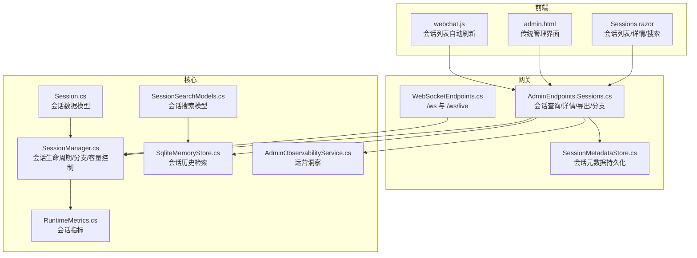

**图表来源**
- [Sessions.razor](file://src/OpenClaw.Dashboard/Pages/Sessions.razor)
- [webchat.js](file://src/OpenClaw.Gateway/wwwroot/webchat.js)
- [admin.html](file://src/OpenClaw.Gateway/wwwroot/admin.html)
- [AdminEndpoints.Sessions.cs](file://src/OpenClaw.Gateway/Endpoints/AdminEndpoints.Sessions.cs)
- [SessionMetadataStore.cs](file://src/OpenClaw.Gateway/SessionMetadataStore.cs)
- [SessionManager.cs](file://src/OpenClaw.Core/Sessions/SessionManager.cs)
- [Session.cs](file://src/OpenClaw.Core/Models/Session.cs)
- [SessionSearchModels.cs](file://src/OpenClaw.Core/Models/SessionSearchModels.cs)
- [SqliteMemoryStore.cs](file://src/OpenClaw.Core/Memory/SqliteMemoryStore.cs)
- [RuntimeMetrics.cs](file://src/OpenClaw.Core/Observability/RuntimeMetrics.cs)
- [AdminObservabilityService.cs](file://src/OpenClaw.Gateway/AdminObservabilityService.cs)
- [WebSocketEndpoints.cs](file://src/OpenClaw.Gateway/Endpoints/WebSocketEndpoints.cs)

**章节来源**
- [Sessions.razor](file://src/OpenClaw.Dashboard/Pages/Sessions.razor)
- [webchat.js](file://src/OpenClaw.Gateway/wwwroot/webchat.js)
- [admin.html](file://src/OpenClaw.Gateway/wwwroot/admin.html)
- [AdminEndpoints.Sessions.cs](file://src/OpenClaw.Gateway/Endpoints/AdminEndpoints.Sessions.cs)
- [SessionMetadataStore.cs](file://src/OpenClaw.Gateway/SessionMetadataStore.cs)
- [SessionManager.cs](file://src/OpenClaw.Core/Sessions/SessionManager.cs)
- [Session.cs](file://src/OpenClaw.Core/Models/Session.cs)
- [SessionSearchModels.cs](file://src/OpenClaw.Core/Models/SessionSearchModels.cs)
- [SqliteMemoryStore.cs](file://src/OpenClaw.Core/Memory/SqliteMemoryStore.cs)
- [RuntimeMetrics.cs](file://src/OpenClaw.Core/Observability/RuntimeMetrics.cs)
- [AdminObservabilityService.cs](file://src/OpenClaw.Gateway/AdminObservabilityService.cs)
- [WebSocketEndpoints.cs](file://src/OpenClaw.Gateway/Endpoints/WebSocketEndpoints.cs)

## 核心组件
- 会话数据模型：定义会话标识、渠道/发送者、状态、历史、令牌用量、稳定绑定、委托元数据、执行检查点等字段与序列化上下文。
- 会话管理器：集中管理会话生命周期、并发容量控制、过期清理、分支创建/恢复、持久化与后台最佳努力持久化队列。
- 会话搜索模型：封装文本、渠道、发送者、时间范围、限制与片段长度等查询参数。
- 元数据存储：基于原子 JSON 文件的会话元数据读写，支持星标、标签、待办项与当前预设。
- 网关端点：提供会话列表、详情、分支差异、元数据更新、导出等接口。
- 前端页面：Blazor 会话页与传统 HTML 管理页，支持搜索过滤、分页、详情查看、元数据编辑与分支恢复。
- 实时通道：WebSocket 与 SSE，驱动会话列表自动刷新与事件流。

**章节来源**
- [Session.cs](file://src/OpenClaw.Core/Models/Session.cs)
- [SessionManager.cs](file://src/OpenClaw.Core/Sessions/SessionManager.cs)
- [SessionSearchModels.cs](file://src/OpenClaw.Core/Models/SessionSearchModels.cs)
- [SessionMetadataStore.cs](file://src/OpenClaw.Gateway/SessionMetadataStore.cs)
- [AdminEndpoints.Sessions.cs](file://src/OpenClaw.Gateway/Endpoints/AdminEndpoints.Sessions.cs)
- [Sessions.razor](file://src/OpenClaw.Dashboard/Pages/Sessions.razor)
- [webchat.js](file://src/OpenClaw.Gateway/wwwroot/webchat.js)
- [WebSocketEndpoints.cs](file://src/OpenClaw.Gateway/Endpoints/WebSocketEndpoints.cs)

## 架构总览
会话管理采用“前端页面 + 网关 API + 核心服务”的分层设计。前端通过 HTTP 与 WebSocket 与网关交互，网关调用会话管理器与存储完成业务逻辑，最终返回给前端渲染。

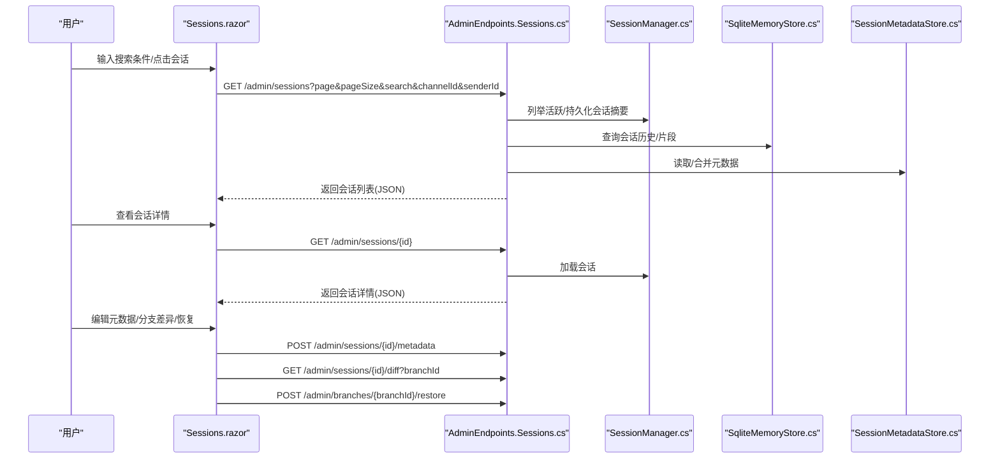

**图表来源**
- [Sessions.razor](file://src/OpenClaw.Dashboard/Pages/Sessions.razor)
- [AdminEndpoints.Sessions.cs](file://src/OpenClaw.Gateway/Endpoints/AdminEndpoints.Sessions.cs)
- [SessionManager.cs](file://src/OpenClaw.Core/Sessions/SessionManager.cs)
- [SqliteMemoryStore.cs](file://src/OpenClaw.Core/Memory/SqliteMemoryStore.cs)
- [SessionMetadataStore.cs](file://src/OpenClaw.Gateway/SessionMetadataStore.cs)

## 详细组件分析

### 会话数据模型与状态
- 模型字段涵盖会话标识、渠道/发送者、创建/最后活跃时间、历史回合、状态、令牌用量、稳定会话绑定、委托元数据、执行检查点等。
- 状态枚举包括 Active、Paused、Expired；历史回合包含角色、内容、工具调用等。
- 模型采用零分配序列化上下文，确保高性能。

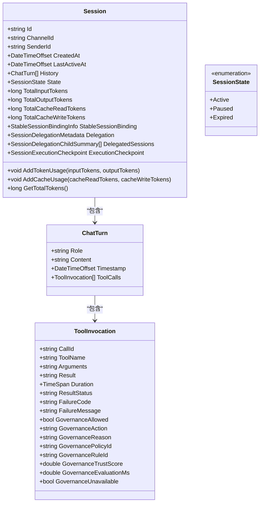

**图表来源**
- [Session.cs](file://src/OpenClaw.Core/Models/Session.cs)

**章节来源**
- [Session.cs](file://src/OpenClaw.Core/Models/Session.cs)

### 会话管理器与容量控制
- 会话管理器在内存中维护并发字典作为热缓存，支持按渠道+发送者或显式会话 ID 获取/创建。
- 准入门控与双重检查锁定保证并发安全；容量不足时先清理过期再按 LRU 淘汰。
- 提供分支创建/恢复、差异计算、加载/移除活跃会话、后台最佳努力持久化等能力。

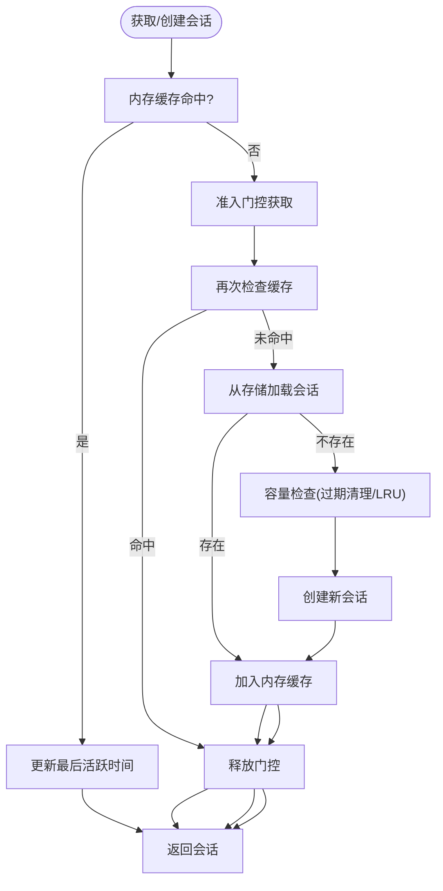

**图表来源**
- [SessionManager.cs](file://src/OpenClaw.Core/Sessions/SessionManager.cs)

**章节来源**
- [SessionManager.cs](file://src/OpenClaw.Core/Sessions/SessionManager.cs)

### 会话列表展示与搜索过滤
- 前端提供搜索框、渠道过滤、发送者过滤与分页控件；默认每页 20 条。
- 支持 Enter 键触发搜索；加载时显示骨架屏；无结果时提示。
- 网关端点接收 search、channelId、senderId、fromUtc、toUtc、state、starred、tag 等查询参数，返回合并后的活跃与持久化会话摘要。

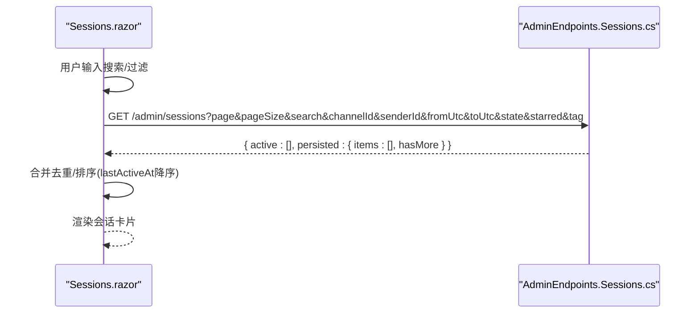

**图表来源**
- [Sessions.razor](file://src/OpenClaw.Dashboard/Pages/Sessions.razor)
- [AdminEndpoints.Sessions.cs](file://src/OpenClaw.Gateway/Endpoints/AdminEndpoints.Sessions.cs)

**章节来源**
- [Sessions.razor](file://src/OpenClaw.Dashboard/Pages/Sessions.razor)
- [AdminEndpoints.Sessions.cs](file://src/OpenClaw.Gateway/Endpoints/AdminEndpoints.Sessions.cs)

### 会话详情查看与分支管理
- 点击会话卡片加载详情，包含消息时间线、元数据、分支列表与差异对比。
- 支持编辑元数据（星标、标签、待办、当前预设），保存后刷新详情。
- 分支差异弹窗展示当前与分支的历史差异摘要；可恢复分支。

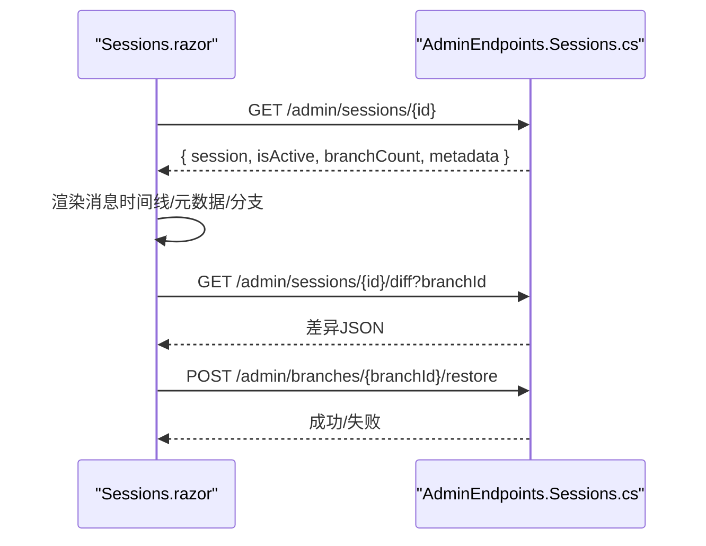

**图表来源**
- [Sessions.razor](file://src/OpenClaw.Dashboard/Pages/Sessions.razor)
- [AdminEndpoints.Sessions.cs](file://src/OpenClaw.Gateway/Endpoints/AdminEndpoints.Sessions.cs)

**章节来源**
- [Sessions.razor](file://src/OpenClaw.Dashboard/Pages/Sessions.razor)
- [AdminEndpoints.Sessions.cs](file://src/OpenClaw.Gateway/Endpoints/AdminEndpoints.Sessions.cs)

### 会话状态管理与实时更新
- 会话状态枚举支持 Active、Paused、Expired；管理器在过期清理时更新状态并持久化。
- WebSocket 与 SSE 提供实时事件流，前端定时拉取会话列表，实现“所见即所得”的实时体验。
- /ws/live 用于实时会话交互，/ws 用于通用通道接入。

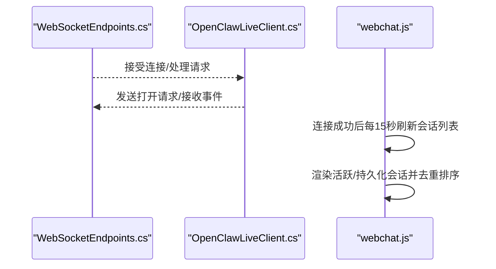

**图表来源**
- [WebSocketEndpoints.cs](file://src/OpenClaw.Gateway/Endpoints/WebSocketEndpoints.cs)
- [OpenClawLiveClient.cs](file://src/OpenClaw.Client/OpenClawLiveClient.cs)
- [webchat.js](file://src/OpenClaw.Gateway/wwwroot/webchat.js)

**章节来源**
- [WebSocketEndpoints.cs](file://src/OpenClaw.Gateway/Endpoints/WebSocketEndpoints.cs)
- [OpenClawLiveClient.cs](file://src/OpenClaw.Client/OpenClawLiveClient.cs)
- [webchat.js](file://src/OpenClaw.Gateway/wwwroot/webchat.js)

### 会话历史查询与搜索片段
- 内存存储支持按文本、渠道、发送者、时间范围查询会话历史片段，返回会话 ID、角色、时间戳、片段与评分。
- 前端会话页在加载列表时合并活跃与持久化会话，去重并按最后活跃时间排序。

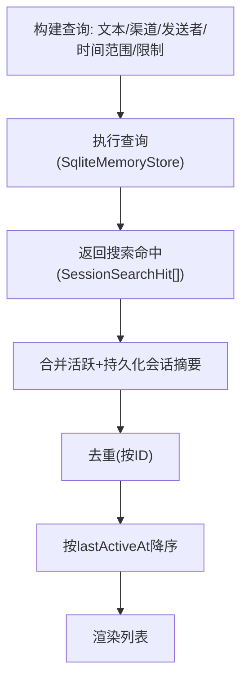

**图表来源**
- [SqliteMemoryStore.cs](file://src/OpenClaw.Core/Memory/SqliteMemoryStore.cs)
- [SessionSearchModels.cs](file://src/OpenClaw.Core/Models/SessionSearchModels.cs)
- [Sessions.razor](file://src/OpenClaw.Dashboard/Pages/Sessions.razor)

**章节来源**
- [SqliteMemoryStore.cs](file://src/OpenClaw.Core/Memory/SqliteMemoryStore.cs)
- [SessionSearchModels.cs](file://src/OpenClaw.Core/Models/SessionSearchModels.cs)
- [Sessions.razor](file://src/OpenClaw.Dashboard/Pages/Sessions.razor)

### 会话统计分析与运营洞察
- 运行时指标提供会话缓存命中/未命中、会话容量拒绝、进程历史驱逐等计数器，便于性能分析。
- 运营服务汇总活跃/持久化会话数量、最近24/7天活跃区间、按渠道/状态分布等统计。
- 观测页面支持导出会数据，便于离线分析。

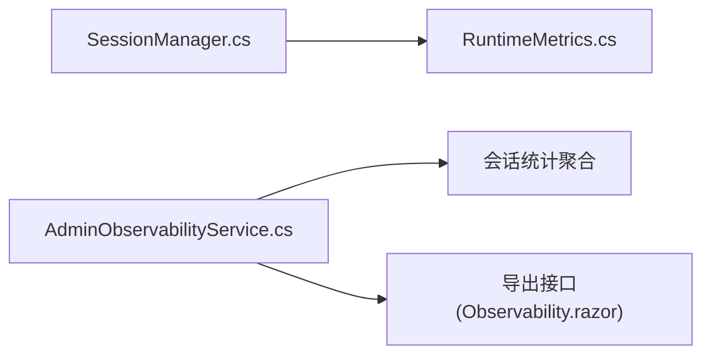

**图表来源**
- [RuntimeMetrics.cs](file://src/OpenClaw.Core/Observability/RuntimeMetrics.cs)
- [AdminObservabilityService.cs](file://src/OpenClaw.Gateway/AdminObservabilityService.cs)
- [Observability.razor](file://src/OpenClaw.Dashboard/Pages/Observability.razor)

**章节来源**
- [RuntimeMetrics.cs](file://src/OpenClaw.Core/Observability/RuntimeMetrics.cs)
- [AdminObservabilityService.cs](file://src/OpenClaw.Gateway/AdminObservabilityService.cs)
- [Observability.razor](file://src/OpenClaw.Dashboard/Pages/Observability.razor)

### 会话元数据与批量操作
- 元数据存储支持星标、标签、待办项与当前预设的原子写入，自动规范化与去重。
- 前端提供元数据编辑对话框，保存后刷新详情。
- 批量操作包括分支恢复、导出筛选结果等。

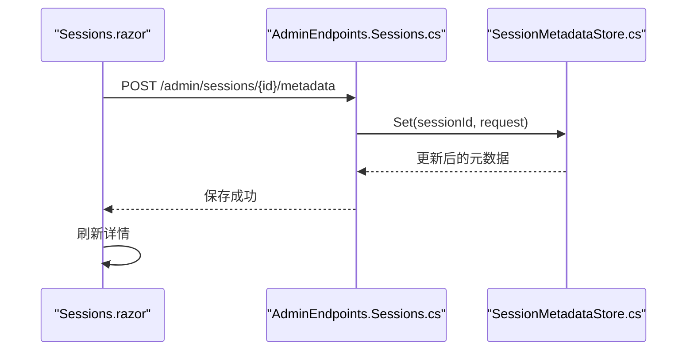

**图表来源**
- [Sessions.razor](file://src/OpenClaw.Dashboard/Pages/Sessions.razor)
- [AdminEndpoints.Sessions.cs](file://src/OpenClaw.Gateway/Endpoints/AdminEndpoints.Sessions.cs)
- [SessionMetadataStore.cs](file://src/OpenClaw.Gateway/SessionMetadataStore.cs)

**章节来源**
- [SessionMetadataStore.cs](file://src/OpenClaw.Gateway/SessionMetadataStore.cs)
- [AdminEndpoints.Sessions.cs](file://src/OpenClaw.Gateway/Endpoints/AdminEndpoints.Sessions.cs)
- [Sessions.razor](file://src/OpenClaw.Dashboard/Pages/Sessions.razor)

### 会话导出功能
- 网关提供会话导出接口，支持按筛选条件导出 JSON 结果，包含会话与元数据。
- 观测页面提供导出按钮，下载二进制文件并提示成功/错误。

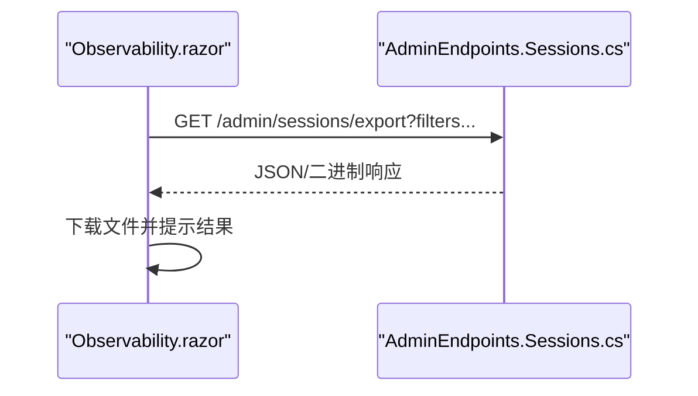

**图表来源**
- [AdminEndpoints.Sessions.cs](file://src/OpenClaw.Gateway/Endpoints/AdminEndpoints.Sessions.cs)
- [Observability.razor](file://src/OpenClaw.Dashboard/Pages/Observability.razor)

**章节来源**
- [AdminEndpoints.Sessions.cs](file://src/OpenClaw.Gateway/Endpoints/AdminEndpoints.Sessions.cs)
- [Observability.razor](file://src/OpenClaw.Dashboard/Pages/Observability.razor)

## 依赖关系分析
- 前端页面依赖网关 API；网关端点依赖会话管理器、内存存储与元数据存储。
- 会话管理器依赖运行时指标进行容量与驱逐统计。
- 实时通道与前端脚本共同实现会话列表的自动刷新。

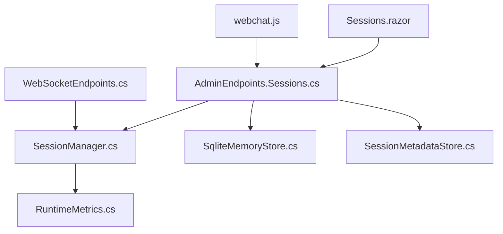

**图表来源**
- [Sessions.razor](file://src/OpenClaw.Dashboard/Pages/Sessions.razor)
- [AdminEndpoints.Sessions.cs](file://src/OpenClaw.Gateway/Endpoints/AdminEndpoints.Sessions.cs)
- [SessionManager.cs](file://src/OpenClaw.Core/Sessions/SessionManager.cs)
- [SqliteMemoryStore.cs](file://src/OpenClaw.Core/Memory/SqliteMemoryStore.cs)
- [SessionMetadataStore.cs](file://src/OpenClaw.Gateway/SessionMetadataStore.cs)
- [RuntimeMetrics.cs](file://src/OpenClaw.Core/Observability/RuntimeMetrics.cs)
- [webchat.js](file://src/OpenClaw.Gateway/wwwroot/webchat.js)
- [WebSocketEndpoints.cs](file://src/OpenClaw.Gateway/Endpoints/WebSocketEndpoints.cs)

**章节来源**
- [Sessions.razor](file://src/OpenClaw.Dashboard/Pages/Sessions.razor)
- [AdminEndpoints.Sessions.cs](file://src/OpenClaw.Gateway/Endpoints/AdminEndpoints.Sessions.cs)
- [SessionManager.cs](file://src/OpenClaw.Core/Sessions/SessionManager.cs)
- [SqliteMemoryStore.cs](file://src/OpenClaw.Core/Memory/SqliteMemoryStore.cs)
- [SessionMetadataStore.cs](file://src/OpenClaw.Gateway/SessionMetadataStore.cs)
- [RuntimeMetrics.cs](file://src/OpenClaw.Core/Observability/RuntimeMetrics.cs)
- [webchat.js](file://src/OpenClaw.Gateway/wwwroot/webchat.js)
- [WebSocketEndpoints.cs](file://src/OpenClaw.Gateway/Endpoints/WebSocketEndpoints.cs)

## 性能考量
- 并发与容量：会话管理器通过准入门控与双重检查锁定降低锁竞争；容量超限时优先过期清理，再按 LRU 驱逐，避免阻塞。
- 持久化：会话保存采用最多三次指数退避重试，提升网络抖动下的可靠性。
- 列表渲染：前端使用骨架屏与分页，减少大列表渲染压力；合并活跃与持久化会话并去重排序，避免重复渲染。
- 搜索：内存存储查询限制最大返回条数与片段长度，兼顾性能与可读性。
- 指标监控：运行时指标记录会话缓存命中/未命中、容量拒绝与驱逐次数，辅助容量规划与性能调优。

[本节为通用指导，不直接分析具体文件]

## 故障排查指南
- 会话列表为空：检查查询参数是否正确、是否有权限访问、后端是否可用。
- 详情加载失败：确认会话 ID 是否有效、后端是否返回合法 JSON、网络是否异常。
- 元数据保存失败：检查 JSON 格式、权限与磁盘写入权限。
- 导出失败：确认筛选条件与后端接口可达，浏览器下载权限。
- 实时刷新异常：检查 WebSocket 连接状态、SSE 流是否被中断、前端定时器是否正常。

**章节来源**
- [Sessions.razor](file://src/OpenClaw.Dashboard/Pages/Sessions.razor)
- [webchat.js](file://src/OpenClaw.Gateway/wwwroot/webchat.js)
- [AdminEndpoints.Sessions.cs](file://src/OpenClaw.Gateway/Endpoints/AdminEndpoints.Sessions.cs)
- [SessionMetadataStore.cs](file://src/OpenClaw.Gateway/SessionMetadataStore.cs)

## 结论
会话管理页面通过清晰的前后端职责划分与完善的网关 API，实现了会话列表展示、搜索过滤、详情查看、状态管理、历史查询、统计分析、元数据编辑、分支管理与导出等核心能力。配合会话管理器的容量控制与持久化策略、实时通道的自动刷新机制，整体具备良好的可扩展性与可观测性。

[本节为总结性内容，不直接分析具体文件]

## 附录
- 术语说明：活跃会话指内存中的活动会话；持久化会话指已落盘的会话；分支指会话历史的命名快照；元数据指会话的星标、标签、待办与当前预设等。
- 最佳实践：合理设置会话超时与并发上限；定期清理过期会话；使用筛选条件缩小导出范围；在高并发场景下避免频繁重建会话；利用指标监控容量与性能瓶颈。

[本节为补充说明，不直接分析具体文件]