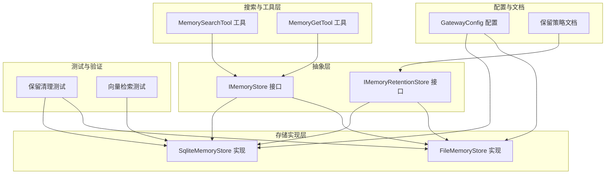
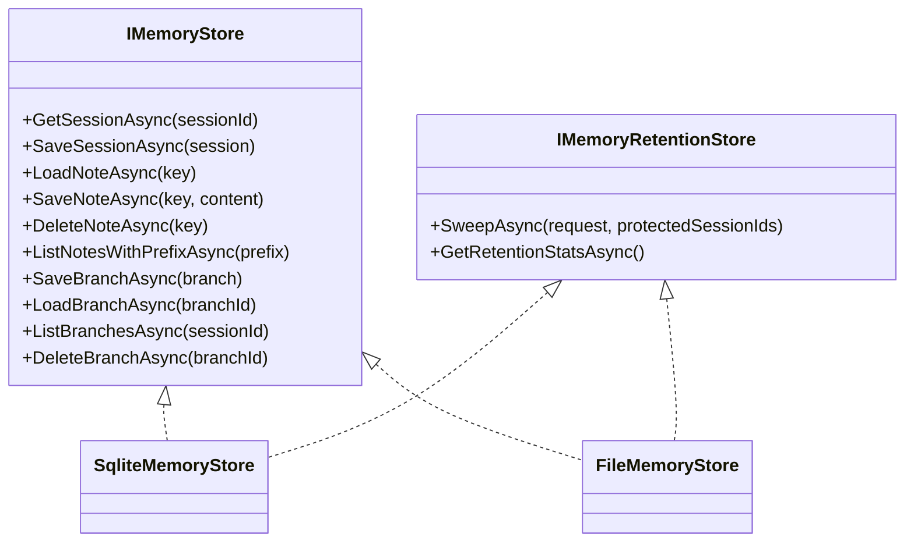
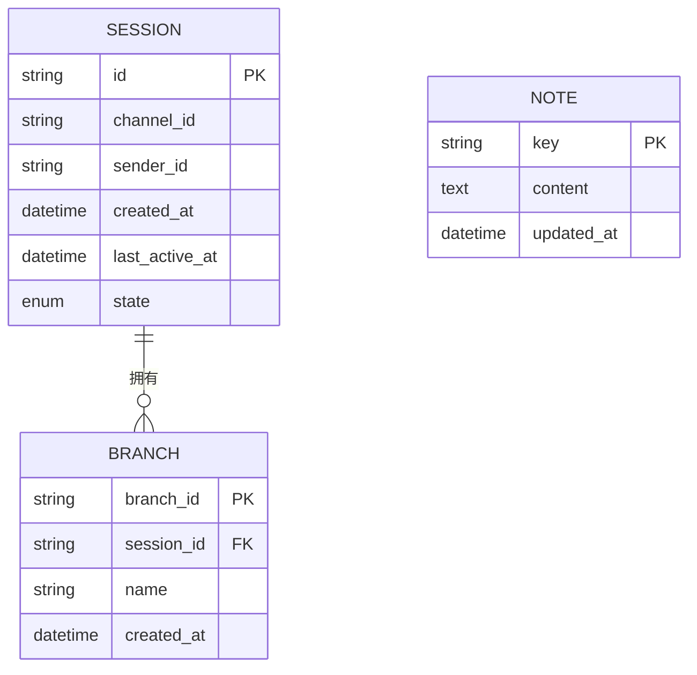
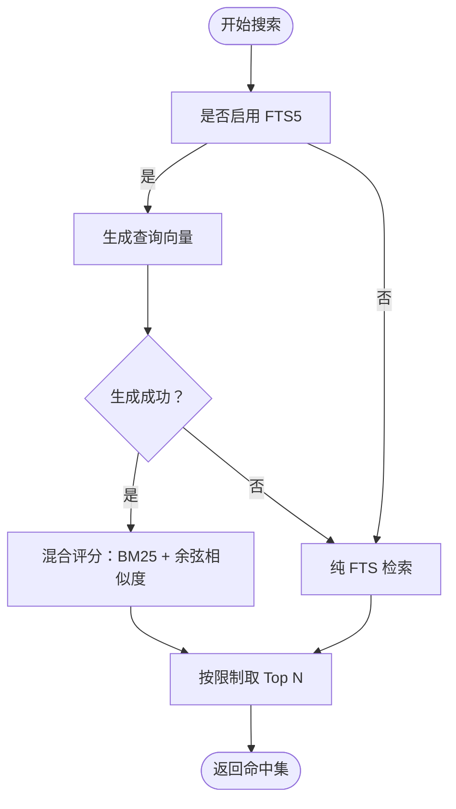
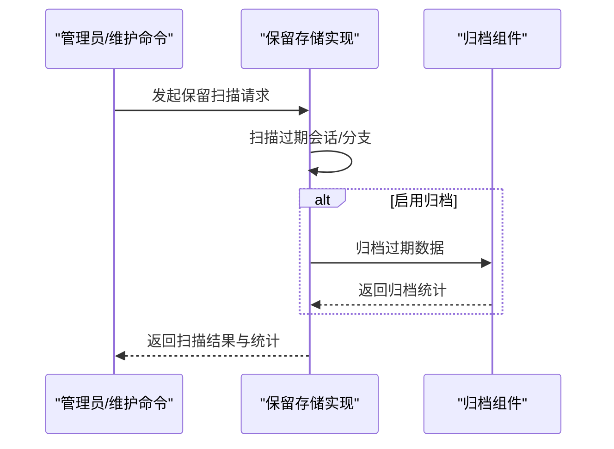
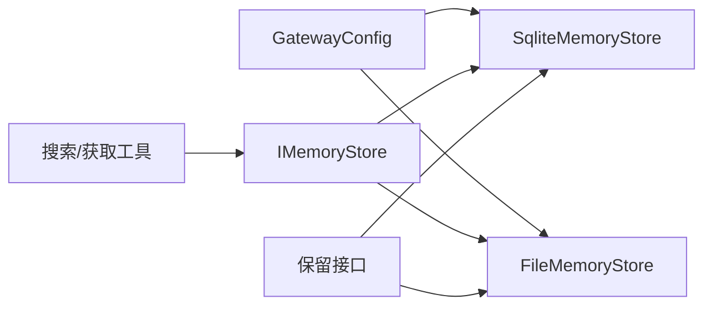

# 内存管理

<cite>
**本文引用的文件**
- [SqliteMemoryStore.cs](file://src/OpenClaw.Core/Memory/SqliteMemoryStore.cs)
- [FileMemoryStore.cs](file://src/OpenClaw.Core/Memory/FileMemoryStore.cs)
- [IMemoryStore.cs](file://src/OpenClaw.Core/Abstractions/IMemoryStore.cs)
- [IMemoryRetentionStore.cs](file://src/OpenClaw.Core/Abstractions/IMemoryRetentionStore.cs)
- [MemoryRetentionModels.cs](file://src/OpenClaw.Core/Models/MemoryRetentionModels.cs)
- [MemoryRetentionArchive.cs](file://src/OpenClaw.Core/Memory/MemoryRetentionArchive.cs)
- [MemorySearchTool.cs](file://src/OpenClaw.Agent/Tools/MemorySearchTool.cs)
- [MemoryGetTool.cs](file://src/OpenClaw.Agent/Tools/MemoryGetTool.cs)
- [GatewayConfig.cs](file://src/OpenClaw.Core/Models/GatewayConfig.cs)
- [openclaw-memory-recall-and-retention.md](file://docs/openclaw-memory-recall-and-retention.md)
- [SqliteMemoryStoreRetentionTests.cs](file://src/OpenClaw.Tests/SqliteMemoryStoreRetentionTests.cs)
- [FileMemoryStoreRetentionTests.cs](file://src/OpenClaw.Tests/FileMemoryStoreRetentionTests.cs)
- [VectorMemorySearchTests.cs](file://src/OpenClaw.Tests/VectorMemorySearchTests.cs)
- [Session.cs](file://src/OpenClaw.Core/Models/Session.cs)
</cite>

## 目录
1. [简介](#简介)
2. [项目结构](#项目结构)
3. [核心组件](#核心组件)
4. [架构总览](#架构总览)
5. [详细组件分析](#详细组件分析)
6. [依赖关系分析](#依赖关系分析)
7. [性能考量](#性能考量)
8. [故障排查指南](#故障排查指南)
9. [结论](#结论)
10. [附录](#附录)

## 简介
本文件面向内存管理页面的技术实现，系统性阐述记忆存储的查看、搜索与管理能力，涵盖记忆分类、标签系统、检索算法与存储优化机制；同时给出记忆数据模型、搜索索引、清理策略与备份恢复流程，并提供性能调优与容量规划建议。内容基于代码库中的 SQLite 文件存储、向量检索与保留清理等实现进行归纳总结。

## 项目结构
内存管理相关代码主要分布在以下模块：
- 核心抽象层：定义统一的记忆接口与可选的保留能力接口
- 存储实现层：SQLite 与文件两种后端，支持会话、分支与记忆笔记
- 搜索与工具层：面向 Agent 的搜索与获取工具
- 配置与文档：网关配置与保留策略文档
- 测试与验证：保留清理与向量检索的单元测试

**图表来源**
- [IMemoryStore.cs:9-24](file://src/OpenClaw.Core/Abstractions/IMemoryStore.cs#L9-L24)
- [IMemoryRetentionStore.cs:9-17](file://src/OpenClaw.Core/Abstractions/IMemoryRetentionStore.cs#L9-L17)
- [SqliteMemoryStore.cs:12-45](file://src/OpenClaw.Core/Memory/SqliteMemoryStore.cs#L12-L45)
- [FileMemoryStore.cs:32-76](file://src/OpenClaw.Core/Memory/FileMemoryStore.cs#L32-L76)
- [MemorySearchTool.cs:7-67](file://src/OpenClaw.Agent/Tools/MemorySearchTool.cs#L7-L67)
- [MemoryGetTool.cs:8-35](file://src/OpenClaw.Agent/Tools/MemoryGetTool.cs#L8-L35)
- [GatewayConfig.cs:175-200](file://src/OpenClaw.Core/Models/GatewayConfig.cs#L175-L200)
- [openclaw-memory-recall-and-retention.md:159-237](file://docs/openclaw-memory-recall-and-retention.md#L159-L237)
- [SqliteMemoryStoreRetentionTests.cs:162-197](file://src/OpenClaw.Tests/SqliteMemoryStoreRetentionTests.cs#L162-L197)
- [VectorMemorySearchTests.cs:54-72](file://src/OpenClaw.Tests/VectorMemorySearchTests.cs#L54-L72)

**章节来源**
- [IMemoryStore.cs:9-24](file://src/OpenClaw.Core/Abstractions/IMemoryStore.cs#L9-L24)
- [IMemoryRetentionStore.cs:9-17](file://src/OpenClaw.Core/Abstractions/IMemoryRetentionStore.cs#L9-L17)
- [SqliteMemoryStore.cs:12-45](file://src/OpenClaw.Core/Memory/SqliteMemoryStore.cs#L12-L45)
- [FileMemoryStore.cs:32-76](file://src/OpenClaw.Core/Memory/FileMemoryStore.cs#L32-L76)
- [MemorySearchTool.cs:7-67](file://src/OpenClaw.Agent/Tools/MemorySearchTool.cs#L7-L67)
- [MemoryGetTool.cs:8-35](file://src/OpenClaw.Agent/Tools/MemoryGetTool.cs#L8-L35)
- [GatewayConfig.cs:175-200](file://src/OpenClaw.Core/Models/GatewayConfig.cs#L175-L200)
- [openclaw-memory-recall-and-retention.md:159-237](file://docs/openclaw-memory-recall-and-retention.md#L159-L237)

## 核心组件
- 统一记忆接口：提供会话读写、分支读写、笔记读写与前缀列举等能力
- 可选保留接口：提供保留扫描、统计查询与归档清理能力
- SQLite 实现：内置 WAL、FTS5 与可选向量列，支持高并发与全文检索
- 文件实现：基于 URL 安全编码的键空间与内存缓存，支持原子写入
- 搜索工具：关键词搜索与结果格式化输出
- 配置模型：集中管理存储路径、保留策略、召回参数与嵌入模型

**章节来源**
- [IMemoryStore.cs:9-24](file://src/OpenClaw.Core/Abstractions/IMemoryStore.cs#L9-L24)
- [IMemoryRetentionStore.cs:9-17](file://src/OpenClaw.Core/Abstractions/IMemoryRetentionStore.cs#L9-L17)
- [SqliteMemoryStore.cs:12-45](file://src/OpenClaw.Core/Memory/SqliteMemoryStore.cs#L12-L45)
- [FileMemoryStore.cs:32-76](file://src/OpenClaw.Core/Memory/FileMemoryStore.cs#L32-L76)
- [MemorySearchTool.cs:7-67](file://src/OpenClaw.Agent/Tools/MemorySearchTool.cs#L7-L67)
- [GatewayConfig.cs:175-200](file://src/OpenClaw.Core/Models/GatewayConfig.cs#L175-L200)

## 架构总览
内存管理采用“抽象接口 + 多后端实现”的分层设计，前端通过工具与服务调用统一接口，后端根据配置选择 SQLite 或文件系统实现。保留清理作为可选能力由独立接口承载，既可由维护命令触发，也可在启动时自动执行。

**图表来源**
- [IMemoryStore.cs:9-24](file://src/OpenClaw.Core/Abstractions/IMemoryStore.cs#L9-L24)
- [IMemoryRetentionStore.cs:9-17](file://src/OpenClaw.Core/Abstractions/IMemoryRetentionStore.cs#L9-L17)
- [SqliteMemoryStore.cs:12-45](file://src/OpenClaw.Core/Memory/SqliteMemoryStore.cs#L12-L45)
- [FileMemoryStore.cs:32-76](file://src/OpenClaw.Core/Memory/FileMemoryStore.cs#L32-L76)

## 详细组件分析

### 数据模型与分类
- 会话（Session）：包含标识、渠道、发送者、历史记录、状态与令牌用量等字段
- 分支（SessionBranch）：会话内的不同思路或方案分支，具备会话绑定与创建时间
- 记忆笔记（MemoryNote）：以键值对形式存储的文本片段，支持前缀过滤与全文检索
- 保留模型：扫描请求、扫描结果、存储统计与运行状态

**图表来源**
- [Session.cs:15-135](file://src/OpenClaw.Core/Models/Session.cs#L15-L135)
- [Session.cs:548-550](file://src/OpenClaw.Core/Models/Session.cs#L548-L550)
- [MemoryRetentionModels.cs:7-51](file://src/OpenClaw.Core/Models/MemoryRetentionModels.cs#L7-L51)

**章节来源**
- [Session.cs:15-135](file://src/OpenClaw.Core/Models/Session.cs#L15-L135)
- [Session.cs:548-550](file://src/OpenClaw.Core/Models/Session.cs#L548-L550)
- [MemoryRetentionModels.cs:7-51](file://src/OpenClaw.Core/Models/MemoryRetentionModels.cs#L7-L51)

### 搜索与检索算法
- 关键词搜索：优先使用 SQLite FTS5 进行全文匹配，支持 prefix 过滤与排序
- 向量重排：当启用嵌入且生成成功时，结合 BM25 与余弦相似度进行加权重排
- 回退策略：FTS5 语法错误或嵌入生成失败时回退到纯文本匹配
- 结果限制：默认限制返回条目数量，避免资源耗尽

**图表来源**
- [SqliteMemoryStore.cs:319-490](file://src/OpenClaw.Core/Memory/SqliteMemoryStore.cs#L319-L490)
- [VectorMemorySearchTests.cs:54-72](file://src/OpenClaw.Tests/VectorMemorySearchTests.cs#L54-L72)

**章节来源**
- [SqliteMemoryStore.cs:319-490](file://src/OpenClaw.Core/Memory/SqliteMemoryStore.cs#L319-L490)
- [VectorMemorySearchTests.cs:54-72](file://src/OpenClaw.Tests/VectorMemorySearchTests.cs#L54-L72)

### 存储后端对比
- SQLite 后端
  - 特性：WAL 模式、外键约束、FTS5 虚表、触发器同步、可选向量列
  - 优势：结构化查询、事务一致性、全文检索、向量重排
  - 适用：中大型项目、需要复杂检索与向量增强的场景
- 文件后端
  - 特性：URL 安全键编码、内存缓存、原子写入、并发加载栅栏
  - 优势：零依赖、本地优先、简单可靠
  - 适用：轻量级本地开发、单机部署

**章节来源**
- [SqliteMemoryStore.cs:54-148](file://src/OpenClaw.Core/Memory/SqliteMemoryStore.cs#L54-L148)
- [FileMemoryStore.cs:32-76](file://src/OpenClaw.Core/Memory/FileMemoryStore.cs#L32-L76)

### 保留清理与归档
- 扫描策略：按最后活跃时间与创建时间阈值筛选过期会话与分支
- 保护机制：支持受保护会话集合跳过清理
- 归档流程：删除前将数据归档至按日期分区的目录结构，含元数据包装
- 清理统计：记录归档/删除数量、跳过项、错误信息与运行时长

**图表来源**
- [IMemoryRetentionStore.cs:9-17](file://src/OpenClaw.Core/Abstractions/IMemoryRetentionStore.cs#L9-L17)
- [SqliteMemoryStore.cs:654-701](file://src/OpenClaw.Core/Memory/SqliteMemoryStore.cs#L654-L701)
- [FileMemoryStore.cs:570-612](file://src/OpenClaw.Core/Memory/FileMemoryStore.cs#L570-L612)
- [MemoryRetentionArchive.cs:9-39](file://src/OpenClaw.Core/Memory/MemoryRetentionArchive.cs#L9-L39)

**章节来源**
- [IMemoryRetentionStore.cs:9-17](file://src/OpenClaw.Core/Abstractions/IMemoryRetentionStore.cs#L9-L17)
- [SqliteMemoryStore.cs:654-701](file://src/OpenClaw.Core/Memory/SqliteMemoryStore.cs#L654-L701)
- [FileMemoryStore.cs:570-612](file://src/OpenClaw.Core/Memory/FileMemoryStore.cs#L570-L612)
- [MemoryRetentionArchive.cs:9-39](file://src/OpenClaw.Core/Memory/MemoryRetentionArchive.cs#L9-L39)

### 工具与界面交互
- 记忆搜索工具：接收查询、前缀与限制参数，返回命中列表或 JSON
- 记忆获取工具：按键精确获取内容，进行输入校验与错误提示
- 输出格式：支持文本与 JSON 两种格式，便于集成与调试

**章节来源**
- [MemorySearchTool.cs:7-67](file://src/OpenClaw.Agent/Tools/MemorySearchTool.cs#L7-L67)
- [MemoryGetTool.cs:8-35](file://src/OpenClaw.Agent/Tools/MemoryGetTool.cs#L8-L35)

## 依赖关系分析
- 抽象与实现解耦：通过接口隔离后端差异，便于替换与扩展
- 搜索与嵌入：向量检索依赖外部嵌入生成器，失败时自动回退
- 配置驱动：保留策略、存储路径、召回参数均来自配置模型
- 测试覆盖：保留清理与向量检索均有针对性测试保障质量

**图表来源**
- [GatewayConfig.cs:175-200](file://src/OpenClaw.Core/Models/GatewayConfig.cs#L175-L200)
- [SqliteMemoryStore.cs:12-45](file://src/OpenClaw.Core/Memory/SqliteMemoryStore.cs#L12-L45)
- [FileMemoryStore.cs:32-76](file://src/OpenClaw.Core/Memory/FileMemoryStore.cs#L32-L76)
- [IMemoryStore.cs:9-24](file://src/OpenClaw.Core/Abstractions/IMemoryStore.cs#L9-L24)
- [IMemoryRetentionStore.cs:9-17](file://src/OpenClaw.Core/Abstractions/IMemoryRetentionStore.cs#L9-L17)

**章节来源**
- [GatewayConfig.cs:175-200](file://src/OpenClaw.Core/Models/GatewayConfig.cs#L175-L200)
- [SqliteMemoryStore.cs:12-45](file://src/OpenClaw.Core/Memory/SqliteMemoryStore.cs#L12-L45)
- [FileMemoryStore.cs:32-76](file://src/OpenClaw.Core/Memory/FileMemoryStore.cs#L32-L76)
- [IMemoryStore.cs:9-24](file://src/OpenClaw.Core/Abstractions/IMemoryStore.cs#L9-L24)
- [IMemoryRetentionStore.cs:9-17](file://src/OpenClaw.Core/Abstractions/IMemoryRetentionStore.cs#L9-L17)

## 性能考量
- SQLite
  - 使用 WAL 模式提升并发写入性能
  - FTS5 虚表与触发器保证索引一致性
  - 可选向量列与嵌入生成器配合重排，提高相关性
  - 建议：合理设置扫描上限与批处理大小，避免长时间锁竞争
- 文件
  - 内存缓存与加载栅栏降低并发冲突
  - 原子写入避免部分写入导致的数据损坏
  - 建议：控制最大缓存会话数，平衡内存占用与命中率
- 搜索
  - 限制返回条目数，避免大范围扫描
  - 在嵌入生成失败时自动回退，确保稳定性
- 保留清理
  - DryRun 模式预演，减少生产风险
  - 归档保留策略与清理周期需结合业务容量评估

[本节为通用指导，无需特定文件来源]

## 故障排查指南
- 启动失败（存储路径不可写）
  - 现象：启动报错提示存储路径不可写
  - 处理：检查环境变量与权限，确认路径可写
- 会话/分支加载异常
  - 现象：读取文件或数据库行失败，抛出损坏异常
  - 处理：查看日志定位具体文件或行，必要时进行归档与修复
- 保留扫描错误
  - 现象：扫描过程中出现跳过项或错误计数
  - 处理：检查归档路径权限、磁盘空间与保留天数配置
- 搜索无结果或性能差
  - 现象：FTS5 查询语法错误或返回为空
  - 处理：调整查询词、开启向量模式或回退到纯文本匹配

**章节来源**
- [StartupFailureReporter.cs:113-125](file://src/OpenClaw.Gateway/Bootstrap/StartupFailureReporter.cs#L113-L125)
- [SqliteMemoryStore.cs:170-178](file://src/OpenClaw.Core/Memory/SqliteMemoryStore.cs#L170-L178)
- [FileMemoryStore.cs:191-223](file://src/OpenClaw.Core/Memory/FileMemoryStore.cs#L191-L223)
- [SqliteMemoryStoreRetentionTests.cs:162-197](file://src/OpenClaw.Tests/SqliteMemoryStoreRetentionTests.cs#L162-L197)
- [FileMemoryStoreRetentionTests.cs:9-45](file://src/OpenClaw.Tests/FileMemoryStoreRetentionTests.cs#L9-L45)

## 结论
内存管理通过统一接口与多后端实现，提供了从基础的会话与笔记管理到高级的全文检索与向量重排能力；保留清理与归档机制确保了长期运行的稳定性与可审计性。结合合理的配置与容量规划，可在不同规模与场景下获得良好的性能与可靠性。

[本节为总结性内容，无需特定文件来源]

## 附录

### 配置要点与建议
- 存储路径与后端选择：根据部署环境选择 SQLite 或文件后端
- 保留策略：启用保留扫描并设置合适的 TTL 与扫描间隔
- 归档路径：确保归档目录可写并设置合理的保留天数
- 向量检索：在具备嵌入模型时启用，注意生成失败的回退逻辑

**章节来源**
- [openclaw-memory-recall-and-retention.md:159-237](file://docs/openclaw-memory-recall-and-retention.md#L159-L237)
- [GatewayConfig.cs:175-200](file://src/OpenClaw.Core/Models/GatewayConfig.cs#L175-L200)