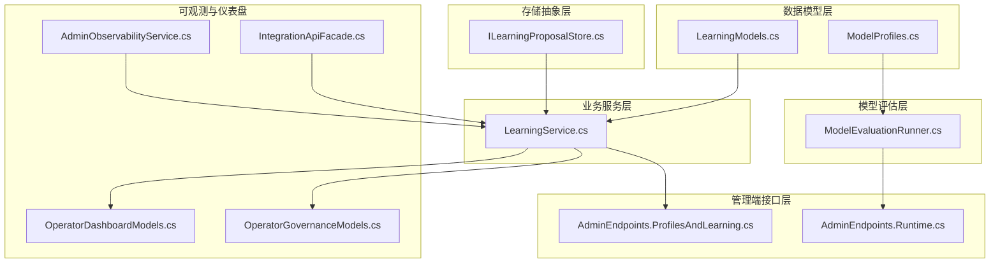
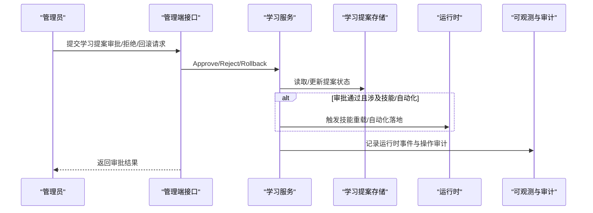
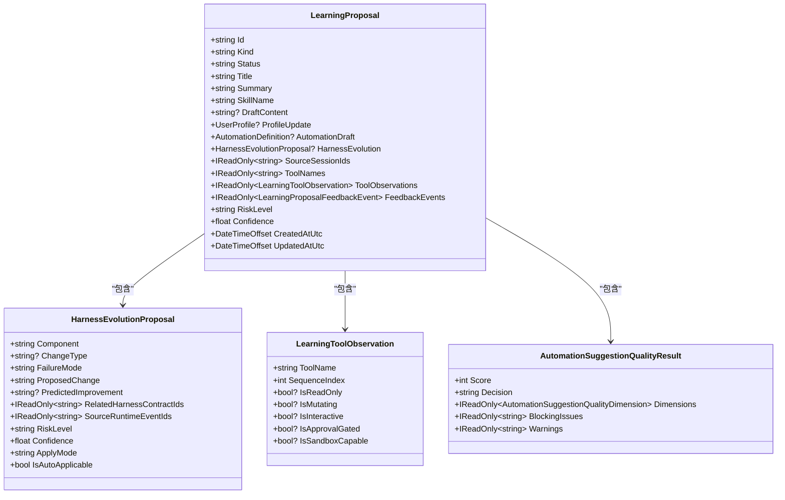
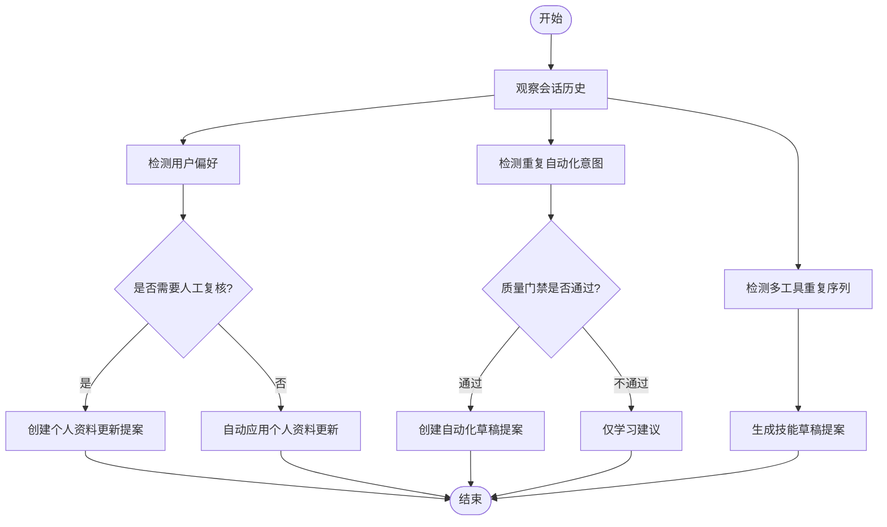
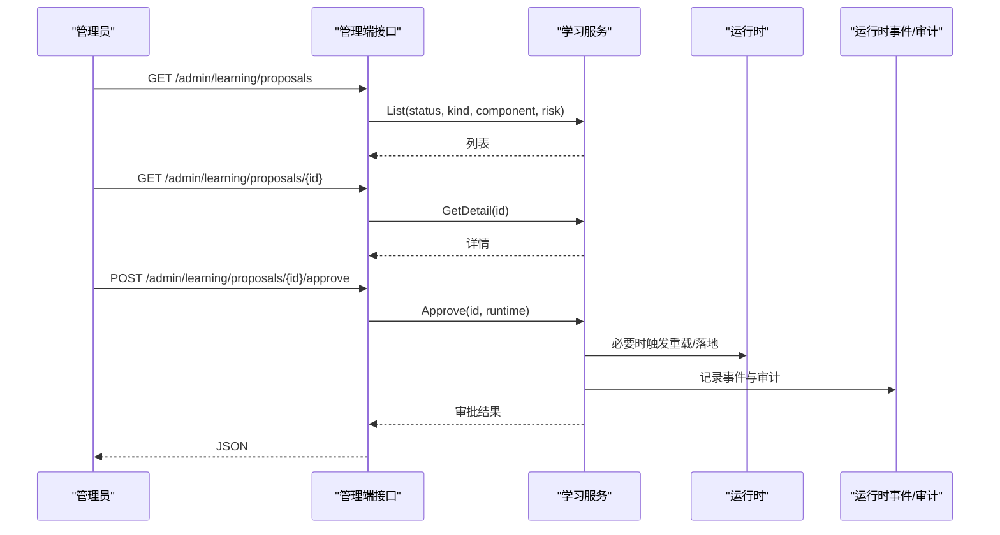
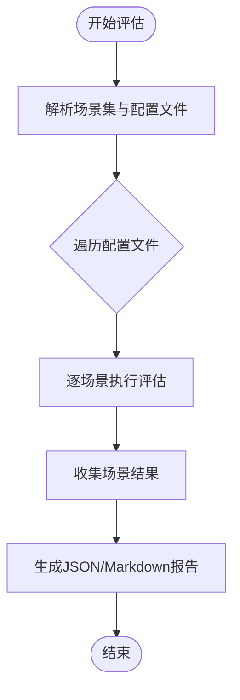
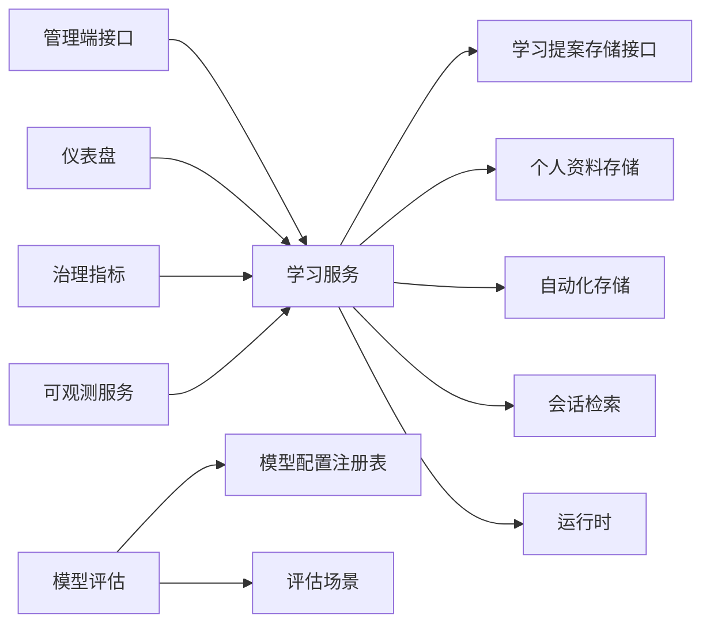

# 学习管理

<cite>
**本文引用的文件**
- [LearningModels.cs](file://src/OpenClaw.Core/Models/LearningModels.cs)
- [ILearningProposalStore.cs](file://src/OpenClaw.Core/Abstractions/ILearningProposalStore.cs)
- [LearningService.cs](file://src/OpenClaw.Gateway/LearningService.cs)
- [AdminEndpoints.ProfilesAndLearning.cs](file://src/OpenClaw.Gateway/Endpoints/AdminEndpoints.ProfilesAndLearning.cs)
- [ModelEvaluationRunner.cs](file://src/OpenClaw.Gateway/Models/ModelEvaluationRunner.cs)
- [ModelProfiles.cs](file://src/OpenClaw.Core/Models/ModelProfiles.cs)
- [Program.cs（CLI）](file://src/OpenClaw.Cli/Program.cs)
- [AdminEndpoints.Runtime.cs](file://src/OpenClaw.Gateway/Endpoints/AdminEndpoints.Runtime.cs)
- [OperatorDashboardModels.cs](file://src/OpenClaw.Core/Models/OperatorDashboardModels.cs)
- [OperatorGovernanceModels.cs](file://src/OpenClaw.Core/Models/OperatorGovernanceModels.cs)
- [IntegrationApiFacade.cs](file://src/OpenClaw.Gateway/Composition/IntegrationApiFacade.cs)
- [AdminObservabilityService.cs](file://src/OpenClaw.Gateway/AdminObservabilityService.cs)
</cite>

## 目录
1. [简介](#简介)
2. [项目结构](#项目结构)
3. [核心组件](#核心组件)
4. [架构总览](#架构总览)
5. [详细组件分析](#详细组件分析)
6. [依赖关系分析](#依赖关系分析)
7. [性能考虑](#性能考虑)
8. [故障排查指南](#故障排查指南)
9. [结论](#结论)
10. [附录：配置与使用指南](#附录配置与使用指南)

## 简介
本技术文档围绕“学习管理”能力，系统阐述学习提案的提交、审核与执行流程；详解学习算法配置、训练数据管理、模型评估指标与效果监控；并给出学习提案的数据模型、审批流程、执行状态跟踪与结果分析方法。同时提供学习系统的配置指南与性能优化建议，帮助运营与工程团队高效治理与优化学习驱动的自动化与技能演化。

## 项目结构
学习管理能力由以下关键模块构成：
- 数据模型层：定义学习提案、风险等级、工具观察、自动化建议质量维度等核心数据结构
- 存储抽象层：定义学习提案存储接口，便于替换实现
- 业务服务层：学习服务负责观察会话、生成提案、审批与回滚、技能与自动化落地
- 管理端接口层：提供学习提案的查询、详情、审批、拒绝、回滚与检测等管理端点
- 模型评估层：提供模型配置诊断与多场景评估报告生成
- 可观测与仪表盘：提供学习提案状态、趋势与治理指标的可视化

图表来源
- [LearningModels.cs:1-275](file://src/OpenClaw.Core/Models/LearningModels.cs#L1-L275)
- [ModelProfiles.cs:1-169](file://src/OpenClaw.Core/Models/ModelProfiles.cs#L1-L169)
- [ILearningProposalStore.cs:1-15](file://src/OpenClaw.Core/Abstractions/ILearningProposalStore.cs#L1-L15)
- [LearningService.cs:1-800](file://src/OpenClaw.Gateway/LearningService.cs#L1-L800)
- [AdminEndpoints.ProfilesAndLearning.cs:1-501](file://src/OpenClaw.Gateway/Endpoints/AdminEndpoints.ProfilesAndLearning.cs#L1-L501)
- [AdminEndpoints.Runtime.cs:90-119](file://src/OpenClaw.Gateway/Endpoints/AdminEndpoints.Runtime.cs#L90-L119)
- [ModelEvaluationRunner.cs:1-526](file://src/OpenClaw.Gateway/Models/ModelEvaluationRunner.cs#L1-L526)
- [OperatorDashboardModels.cs:1-105](file://src/OpenClaw.Core/Models/OperatorDashboardModels.cs#L1-L105)
- [OperatorGovernanceModels.cs:330-359](file://src/OpenClaw.Core/Models/OperatorGovernanceModels.cs#L330-L359)
- [IntegrationApiFacade.cs:419-828](file://src/OpenClaw.Gateway/Composition/IntegrationApiFacade.cs#L419-L828)
- [AdminObservabilityService.cs:1030-1071](file://src/OpenClaw.Gateway/AdminObservabilityService.cs#L1030-L1071)

章节来源
- [LearningModels.cs:1-275](file://src/OpenClaw.Core/Models/LearningModels.cs#L1-L275)
- [ModelProfiles.cs:1-169](file://src/OpenClaw.Core/Models/ModelProfiles.cs#L1-L169)
- [ILearningProposalStore.cs:1-15](file://src/OpenClaw.Core/Abstractions/ILearningProposalStore.cs#L1-L15)
- [LearningService.cs:1-800](file://src/OpenClaw.Gateway/LearningService.cs#L1-L800)
- [AdminEndpoints.ProfilesAndLearning.cs:1-501](file://src/OpenClaw.Gateway/Endpoints/AdminEndpoints.ProfilesAndLearning.cs#L1-L501)
- [AdminEndpoints.Runtime.cs:90-119](file://src/OpenClaw.Gateway/Endpoints/AdminEndpoints.Runtime.cs#L90-L119)
- [ModelEvaluationRunner.cs:1-526](file://src/OpenClaw.Gateway/Models/ModelEvaluationRunner.cs#L1-L526)
- [OperatorDashboardModels.cs:1-105](file://src/OpenClaw.Core/Models/OperatorDashboardModels.cs#L1-L105)
- [OperatorGovernanceModels.cs:330-359](file://src/OpenClaw.Core/Models/OperatorGovernanceModels.cs#L330-L359)
- [IntegrationApiFacade.cs:419-828](file://src/OpenClaw.Gateway/Composition/IntegrationApiFacade.cs#L419-L828)
- [AdminObservabilityService.cs:1030-1071](file://src/OpenClaw.Gateway/AdminObservabilityService.cs#L1030-L1071)

## 核心组件
- 学习提案数据模型：涵盖提案类型（技能草稿、个人资料更新、自动化建议、Harness 变更）、状态（待审、已批准、已拒绝、已回滚）、风险等级、工具观察、质量评分与反馈事件等
- 学习提案存储接口：统一抽象提案的增删改查，便于替换为文件或数据库实现
- 学习服务：负责会话观察、重复模式识别、提案生成、审批与回滚、技能与自动化落地、治理链接与运行时事件记录
- 管理端接口：提供学习提案列表、详情、审批、拒绝、回滚、Harness 变更提案创建与自动检测等管理操作
- 模型评估与诊断：提供模型配置诊断、多场景评估（聊天、JSON 结构化输出、工具调用、多轮连续性、压缩恢复、流式、视觉输入）与报告生成
- 仪表盘与可观测：提供学习提案状态统计、最近活动、治理指标与日志读取辅助

章节来源
- [LearningModels.cs:1-275](file://src/OpenClaw.Core/Models/LearningModels.cs#L1-L275)
- [ILearningProposalStore.cs:1-15](file://src/OpenClaw.Core/Abstractions/ILearningProposalStore.cs#L1-L15)
- [LearningService.cs:1-800](file://src/OpenClaw.Gateway/LearningService.cs#L1-L800)
- [AdminEndpoints.ProfilesAndLearning.cs:177-455](file://src/OpenClaw.Gateway/Endpoints/AdminEndpoints.ProfilesAndLearning.cs#L177-L455)
- [ModelEvaluationRunner.cs:40-175](file://src/OpenClaw.Gateway/Models/ModelEvaluationRunner.cs#L40-L175)
- [OperatorDashboardModels.cs:78-86](file://src/OpenClaw.Core/Models/OperatorDashboardModels.cs#L78-L86)
- [OperatorGovernanceModels.cs:330-359](file://src/OpenClaw.Core/Models/OperatorGovernanceModels.cs#L330-L359)

## 架构总览
学习管理采用“数据模型—存储抽象—业务服务—管理端接口—评估与可观测”的分层设计，通过管理端接口暴露学习提案的全生命周期管理，并通过模型评估与诊断保障模型选择与配置的可靠性。

图表来源
- [AdminEndpoints.ProfilesAndLearning.cs:299-455](file://src/OpenClaw.Gateway/Endpoints/AdminEndpoints.ProfilesAndLearning.cs#L299-L455)
- [LearningService.cs:375-565](file://src/OpenClaw.Gateway/LearningService.cs#L375-L565)
- [ILearningProposalStore.cs:5-14](file://src/OpenClaw.Core/Abstractions/ILearningProposalStore.cs#L5-L14)

## 详细组件分析

### 学习提案数据模型
- 提案类型与状态：支持技能草稿、个人资料更新、自动化建议、Harness 变更；状态含待审、已批准、已拒绝、已回滚
- 风险等级与置信度：支持低/中/高/严重风险与置信度打分
- 工具观察：记录工具名称、序列索引、只读/可变/交互/需要审批/沙箱能力等
- 自动化建议质量：包含质量维度、评分、阻断问题与警告
- 履历与反馈：记录反馈事件（接受/编辑后接受/拒绝等）、重复次数、指纹、验证状态与错误/警告

图表来源
- [LearningModels.cs:230-275](file://src/OpenClaw.Core/Models/LearningModels.cs#L230-L275)
- [LearningModels.cs:160-185](file://src/OpenClaw.Core/Models/LearningModels.cs#L160-L185)
- [LearningModels.cs:139-149](file://src/OpenClaw.Core/Models/LearningModels.cs#L139-L149)
- [LearningModels.cs:109-116](file://src/OpenClaw.Core/Models/LearningModels.cs#L109-L116)

章节来源
- [LearningModels.cs:1-275](file://src/OpenClaw.Core/Models/LearningModels.cs#L1-L275)

### 学习提案存储接口
- 统一抽象：List/Get/Save 提案，便于替换为文件或数据库实现
- 与学习服务协作：学习服务通过该接口持久化提案状态与变更

章节来源
- [ILearningProposalStore.cs:1-15](file://src/OpenClaw.Core/Abstractions/ILearningProposalStore.cs#L1-L15)

### 学习服务：观察、生成、审批与回滚
- 会话观察与提案生成
  - 个人资料偏好：基于用户输入中的偏好提示生成个人资料更新提案
  - 自动化建议：基于重复用户意图与可用交付通道生成自动化建议与草稿
  - 技能草稿：基于多工具序列的重复使用生成技能草稿
- 审批与执行
  - 审批通过：对个人资料更新直接写入；对自动化建议保存为受控草稿；对技能草稿落地并尝试热重载
  - 拒绝：记录拒绝原因与反馈事件
  - 回滚：对已批准的技能/自动化/个人资料进行回滚，并更新状态
- 治理与运行时事件：记录运行时事件与操作审计，支持 Harness 变更治理链接

图表来源
- [LearningService.cs:356-791](file://src/OpenClaw.Gateway/LearningService.cs#L356-L791)

章节来源
- [LearningService.cs:356-791](file://src/OpenClaw.Gateway/LearningService.cs#L356-L791)
- [LearningService.cs:375-565](file://src/OpenClaw.Gateway/LearningService.cs#L375-L565)

### 管理端接口：提案列表、详情、审批、拒绝、回滚与检测
- 列表与筛选：支持按状态、类型、组件、风险级别筛选
- 详情：返回提案、基线/当前个人资料差异、溯源信息与是否可回滚
- 审批/拒绝：记录运行时事件与操作审计
- 回滚：校验可回滚状态并执行回滚
- Harness 变更：支持手动创建与自动检测（基于运行时事件）

图表来源
- [AdminEndpoints.ProfilesAndLearning.cs:177-354](file://src/OpenClaw.Gateway/Endpoints/AdminEndpoints.ProfilesAndLearning.cs#L177-L354)
- [LearningService.cs:375-492](file://src/OpenClaw.Gateway/LearningService.cs#L375-L492)

章节来源
- [AdminEndpoints.ProfilesAndLearning.cs:177-354](file://src/OpenClaw.Gateway/Endpoints/AdminEndpoints.ProfilesAndLearning.cs#L177-L354)
- [AdminEndpoints.ProfilesAndLearning.cs:404-455](file://src/OpenClaw.Gateway/Endpoints/AdminEndpoints.ProfilesAndLearning.cs#L404-L455)

### 模型评估与效果监控
- 模型配置诊断：检查默认配置、注册状态与验证问题
- 多场景评估：纯对话、结构化 JSON 提取、工具调用正确性、多轮连续性、压缩恢复、流式、视觉输入
- 报告生成：生成 JSON 与 Markdown 报告，包含每个场景的状态、延迟、令牌用量与摘要

图表来源
- [ModelEvaluationRunner.cs:65-175](file://src/OpenClaw.Gateway/Models/ModelEvaluationRunner.cs#L65-L175)
- [ModelProfiles.cs:126-169](file://src/OpenClaw.Core/Models/ModelProfiles.cs#L126-L169)

章节来源
- [ModelEvaluationRunner.cs:40-175](file://src/OpenClaw.Gateway/Models/ModelEvaluationRunner.cs#L40-L175)
- [ModelProfiles.cs:126-169](file://src/OpenClaw.Core/Models/ModelProfiles.cs#L126-L169)
- [AdminEndpoints.Runtime.cs:92-119](file://src/OpenClaw.Gateway/Endpoints/AdminEndpoints.Runtime.cs#L92-L119)
- [Program.cs（CLI）:1003-1025](file://src/OpenClaw.Cli/Program.cs#L1003-L1025)

### 仪表盘与可观测性
- 仪表盘快照：包含会话、审批、内存、自动化、学习、委托、通道、插件与可靠性指标
- 治理指标：审批决策数、待审批数、自动化运行与失败、提供商错误与重试、运行时警告与错误、死信、活跃会话、通道漂移、操作者动作
- 日志读取：支持时间范围内的日志行解析与排序

章节来源
- [OperatorDashboardModels.cs:1-105](file://src/OpenClaw.Core/Models/OperatorDashboardModels.cs#L1-L105)
- [OperatorGovernanceModels.cs:330-359](file://src/OpenClaw.Core/Models/OperatorGovernanceModels.cs#L330-L359)
- [IntegrationApiFacade.cs:419-828](file://src/OpenClaw.Gateway/Composition/IntegrationApiFacade.cs#L419-L828)
- [AdminObservabilityService.cs:1030-1071](file://src/OpenClaw.Gateway/AdminObservabilityService.cs#L1030-L1071)

## 依赖关系分析
- 学习服务依赖存储接口、个人资料存储、自动化存储、会话检索与运行时
- 管理端接口依赖学习服务与运行时事件/审计
- 模型评估依赖模型配置注册表与场景实现
- 仪表盘与可观测依赖运行时事件与日志文件

图表来源
- [LearningService.cs:19-53](file://src/OpenClaw.Gateway/LearningService.cs#L19-L53)
- [AdminEndpoints.ProfilesAndLearning.cs:30-39](file://src/OpenClaw.Gateway/Endpoints/AdminEndpoints.ProfilesAndLearning.cs#L30-L39)
- [ModelEvaluationRunner.cs:10-35](file://src/OpenClaw.Gateway/Models/ModelEvaluationRunner.cs#L10-L35)
- [OperatorDashboardModels.cs:3-14](file://src/OpenClaw.Core/Models/OperatorDashboardModels.cs#L3-L14)
- [OperatorGovernanceModels.cs:330-359](file://src/OpenClaw.Core/Models/OperatorGovernanceModels.cs#L330-L359)
- [AdminObservabilityService.cs:1030-1071](file://src/OpenClaw.Gateway/AdminObservabilityService.cs#L1030-L1071)

章节来源
- [LearningService.cs:19-53](file://src/OpenClaw.Gateway/LearningService.cs#L19-L53)
- [AdminEndpoints.ProfilesAndLearning.cs:30-39](file://src/OpenClaw.Gateway/Endpoints/AdminEndpoints.ProfilesAndLearning.cs#L30-L39)
- [ModelEvaluationRunner.cs:10-35](file://src/OpenClaw.Gateway/Models/ModelEvaluationRunner.cs#L10-L35)
- [OperatorDashboardModels.cs:3-14](file://src/OpenClaw.Core/Models/OperatorDashboardModels.cs#L3-L14)
- [OperatorGovernanceModels.cs:330-359](file://src/OpenClaw.Core/Models/OperatorGovernanceModels.cs#L330-L359)
- [AdminObservabilityService.cs:1030-1071](file://src/OpenClaw.Gateway/AdminObservabilityService.cs#L1030-L1071)

## 性能考虑
- 批量与分页：管理端接口支持按状态/类型/组件/风险筛选，避免一次性加载全部提案
- 评估并发：模型评估在配置文件维度并行执行，场景内异步处理，支持取消
- 缓存与重试：模型配置注册表缓存状态，评估场景捕获异常并记录失败，便于重试
- 日志读取：可观测服务按时间窗口读取日志文件，避免全量扫描

[本节为通用指导，无需列出章节来源]

## 故障排查指南
- 审批失败：检查提案验证状态与错误/警告，确认是否因技能草稿冲突或内容不合规导致拒绝
- 回滚失败：确认提案处于可回滚状态、受管学习元数据匹配且目标工件存在
- 模型评估失败：查看诊断报告中的错误与警告，确认默认配置与注册状态
- 运行时事件缺失：检查运行时事件存储路径与权限，确认事件写入成功

章节来源
- [LearningService.cs:396-447](file://src/OpenClaw.Gateway/LearningService.cs#L396-L447)
- [LearningService.cs:521-565](file://src/OpenClaw.Gateway/LearningService.cs#L521-L565)
- [ModelEvaluationRunner.cs:40-63](file://src/OpenClaw.Gateway/Models/ModelEvaluationRunner.cs#L40-L63)
- [AdminEndpoints.ProfilesAndLearning.cs:404-455](file://src/OpenClaw.Gateway/Endpoints/AdminEndpoints.ProfilesAndLearning.cs#L404-L455)

## 结论
学习管理系统通过“观察—生成—审批—执行—回滚—评估—监控”的闭环，实现了对技能、自动化与运行时 Harness 的持续学习与治理。借助统一的数据模型、可替换的存储接口与完善的管理端能力，系统既保证了可扩展性，也提供了强大的可观测与治理支持。

[本节为总结，无需列出章节来源]

## 附录：配置与使用指南

### 学习算法与提案阈值配置
- 启用开关与复核要求：控制学习功能是否启用及是否需要人工复核
- 技能提案阈值与自动化提案阈值：控制重复模式达到何种次数才生成提案
- 最大草稿字符限制：限制技能草稿长度
- Harness 演进：启用、阈值与回看窗口

章节来源
- [LearningModels.cs:3-13](file://src/OpenClaw.Core/Models/LearningModels.cs#L3-L13)

### 模型评估与诊断
- 管理端接口
  - 获取模型配置状态：GET /admin/models
  - 模型诊断：GET /admin/models/doctor
  - 运行评估：POST /admin/models/evaluations（支持指定配置文件与场景）
- CLI 使用
  - 支持指定配置文件与场景，输出运行 ID、JSON 路径与 Markdown 路径

章节来源
- [AdminEndpoints.Runtime.cs:92-119](file://src/OpenClaw.Gateway/Endpoints/AdminEndpoints.Runtime.cs#L92-L119)
- [Program.cs（CLI）:1003-1025](file://src/OpenClaw.Cli/Program.cs#L1003-L1025)

### 学习提案管理
- 列表与筛选：GET /admin/learning/proposals（支持 status/kind/component/risk）
- 详情：GET /admin/learning/proposals/{id}
- 审批：POST /admin/learning/proposals/{id}/approve
- 拒绝：POST /admin/learning/proposals/{id}/reject
- 回滚：POST /admin/learning/proposals/{id}/rollback
- Harness 变更：创建与自动检测

章节来源
- [AdminEndpoints.ProfilesAndLearning.cs:177-455](file://src/OpenClaw.Gateway/Endpoints/AdminEndpoints.ProfilesAndLearning.cs#L177-L455)

### 仪表盘与可观测
- 仪表盘快照：包含学习提案状态统计与最近活动
- 治理指标：审批决策、自动化运行与失败、提供商错误与重试、运行时警告与错误、死信、活跃会话、通道漂移、操作者动作
- 日志读取：按时间窗口读取日志文件并解析

章节来源
- [OperatorDashboardModels.cs:78-86](file://src/OpenClaw.Core/Models/OperatorDashboardModels.cs#L78-L86)
- [OperatorGovernanceModels.cs:330-359](file://src/OpenClaw.Core/Models/OperatorGovernanceModels.cs#L330-L359)
- [IntegrationApiFacade.cs:419-828](file://src/OpenClaw.Gateway/Composition/IntegrationApiFacade.cs#L419-L828)
- [AdminObservabilityService.cs:1030-1071](file://src/OpenClaw.Gateway/AdminObservabilityService.cs#L1030-L1071)