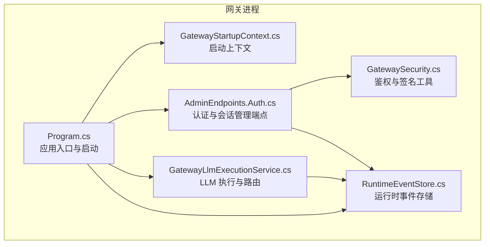
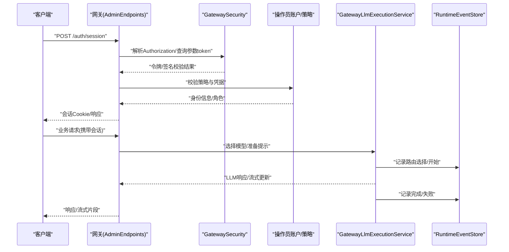
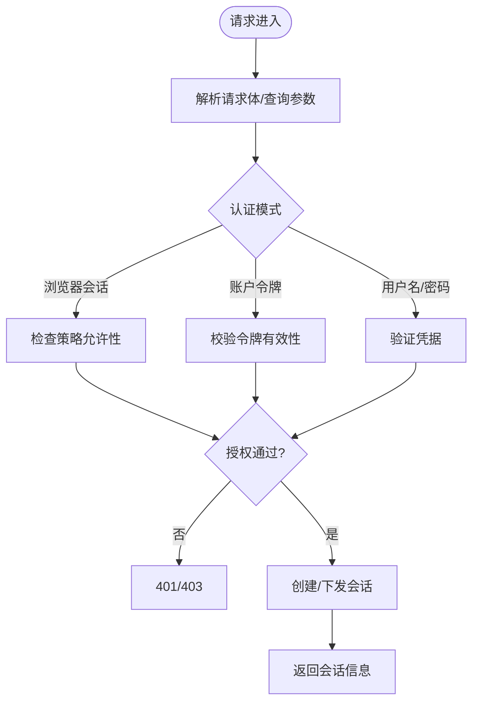
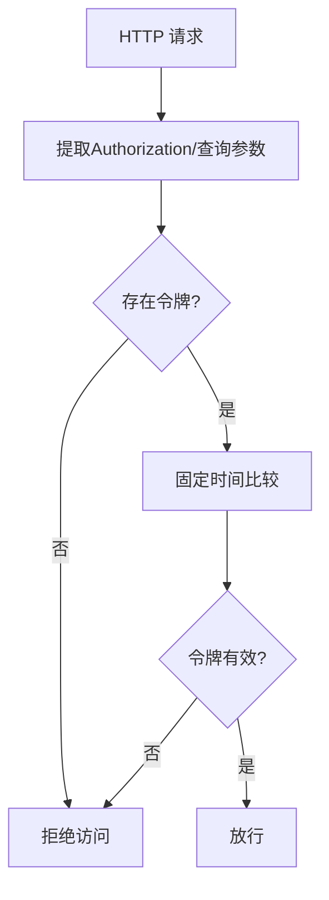
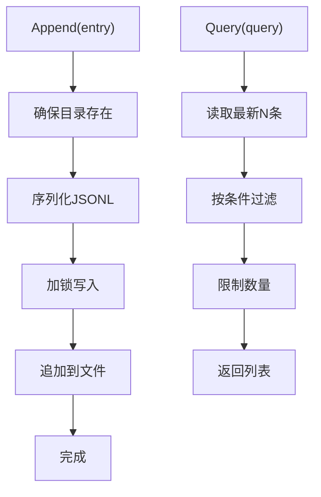
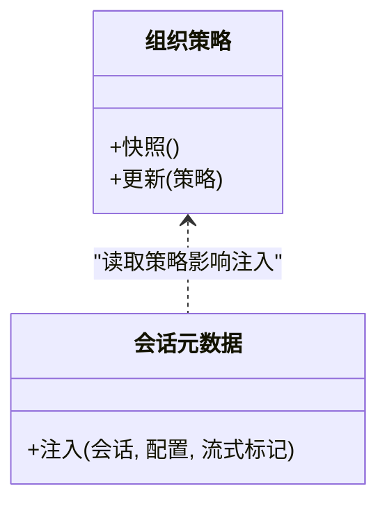
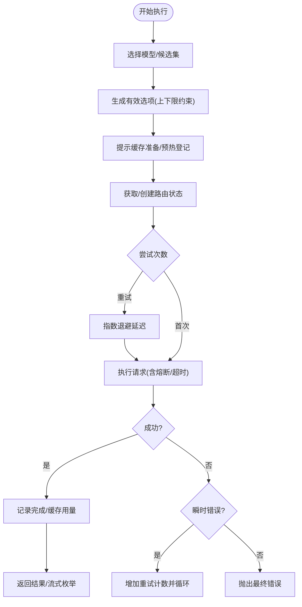
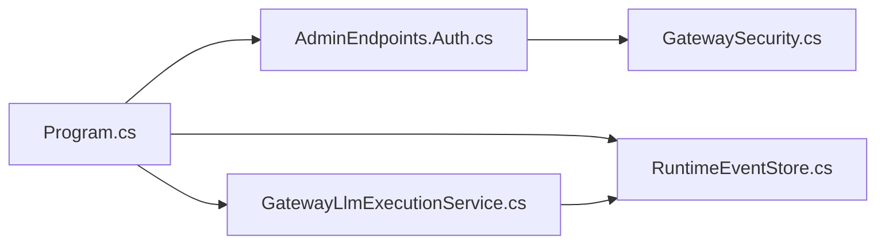

# 核心服务

<cite>
**本文引用的文件**
- [Program.cs](file://src/OpenClaw.Gateway/Program.cs)
- [GatewayLlmExecutionService.cs](file://src/OpenClaw.Gateway/GatewayLlmExecutionService.cs)
- [GatewaySecurity.cs](file://src/OpenClaw.Gateway/GatewaySecurity.cs)
- [RuntimeEventStore.cs](file://src/OpenClaw.Gateway/RuntimeEventStore.cs)
- [AdminEndpoints.Auth.cs](file://src/OpenClaw.Gateway/Endpoints/AdminEndpoints.Auth.cs)
- [GatewayStartupContext.cs](file://src/OpenClaw.Gateway/Bootstrap/GatewayStartupContext.cs)
</cite>

## 目录
1. [简介](#简介)
2. [项目结构](#项目结构)
3. [核心组件](#核心组件)
4. [架构总览](#架构总览)
5. [详细组件分析](#详细组件分析)
6. [依赖关系分析](#依赖关系分析)
7. [性能考量](#性能考量)
8. [故障排查指南](#故障排查指南)
9. [结论](#结论)
10. [附录](#附录)

## 简介
本文件面向核心服务模块，系统性阐述以下能力的设计与实现：API 服务（管理员端点与会话认证）、认证服务（浏览器会话与操作员令牌）、事件流服务（运行时事件存储与查询）以及本地化服务（组织策略与会话元数据）。文档覆盖服务间依赖、数据流转、错误处理策略、性能优化与可观测性，并提供服务注册配置、生命周期管理、缓存策略与监控指标建议，以及开发与集成最佳实践。

## 项目结构
核心服务位于网关层（Gateway），通过启动流程装配各类服务并暴露 REST 管理端点；LLM 执行服务负责模型选择、重试与熔断、提示缓存协调；安全工具提供鉴权与签名校验；事件存储提供运行时事件的持久化与查询。

**图表来源**
- [Program.cs:1-124](file://src/OpenClaw.Gateway/Program.cs#L1-L124)
- [AdminEndpoints.Auth.cs:1-399](file://src/OpenClaw.Gateway/Endpoints/AdminEndpoints.Auth.cs#L1-L399)
- [GatewaySecurity.cs:1-109](file://src/OpenClaw.Gateway/GatewaySecurity.cs#L1-L109)
- [RuntimeEventStore.cs:1-87](file://src/OpenClaw.Gateway/RuntimeEventStore.cs#L1-L87)
- [GatewayLlmExecutionService.cs:1-1026](file://src/OpenClaw.Gateway/GatewayLlmExecutionService.cs#L1-L1026)
- [GatewayStartupContext.cs:1-15](file://src/OpenClaw.Gateway/Bootstrap/GatewayStartupContext.cs#L1-L15)

**章节来源**
- [Program.cs:1-124](file://src/OpenClaw.Gateway/Program.cs#L1-L124)
- [GatewayStartupContext.cs:1-15](file://src/OpenClaw.Gateway/Bootstrap/GatewayStartupContext.cs#L1-L15)

## 核心组件
- API 服务（管理员端点）
  - 提供会话状态查询、登录（用户名/密码或账户令牌）、登出、操作员账户管理、组织策略读写等接口。
  - 基于浏览器会话与操作员令牌两种模式，结合组织策略进行授权控制。
- 认证服务
  - 鉴别 Authorization 头中的 Bearer 令牌或查询参数 token。
  - 提供固定时间比较的令牌校验与 HMAC-SHA256 签名验证。
- 事件流服务
  - 将运行时事件以 JSONL 追加到本地文件，支持按会话、通道、发送者、组件、动作与时间范围查询。
- 本地化服务
  - 组织策略快照与变更，用于控制认证模式、配额与限制。
  - 会话元数据注入到 LLM 请求头，便于下游追踪与审计。

**章节来源**
- [AdminEndpoints.Auth.cs:1-399](file://src/OpenClaw.Gateway/Endpoints/AdminEndpoints.Auth.cs#L1-L399)
- [GatewaySecurity.cs:1-109](file://src/OpenClaw.Gateway/GatewaySecurity.cs#L1-L109)
- [RuntimeEventStore.cs:1-87](file://src/OpenClaw.Gateway/RuntimeEventStore.cs#L1-L87)
- [GatewayLlmExecutionService.cs:629-647](file://src/OpenClaw.Gateway/GatewayLlmExecutionService.cs#L629-L647)

## 架构总览
下图展示从请求进入网关到执行 LLM、记录事件与返回响应的关键路径，以及认证与安全工具的参与位置。

**图表来源**
- [AdminEndpoints.Auth.cs:40-124](file://src/OpenClaw.Gateway/Endpoints/AdminEndpoints.Auth.cs#L40-L124)
- [GatewaySecurity.cs:13-37](file://src/OpenClaw.Gateway/GatewaySecurity.cs#L13-L37)
- [GatewayLlmExecutionService.cs:218-358](file://src/OpenClaw.Gateway/GatewayLlmExecutionService.cs#L218-L358)
- [RuntimeEventStore.cs:28-47](file://src/OpenClaw.Gateway/RuntimeEventStore.cs#L28-L47)

## 详细组件分析

### API 服务（管理员端点）
- 会话管理
  - GET /auth/session：基于浏览器会话获取当前会话信息。
  - POST /auth/session：支持用户名/密码、账户令牌或浏览器会话登录，受组织策略控制。
  - DELETE /auth/session：登出会话并清除 Cookie。
- 操作员账户管理
  - 列表、创建、查询、更新、删除操作员账户。
  - 对账户令牌的创建与吊销。
- 组织策略
  - GET /admin/organization-policy：读取当前策略快照。
  - PUT /admin/organization-policy：更新策略并记录审计。

**图表来源**
- [AdminEndpoints.Auth.cs:40-124](file://src/OpenClaw.Gateway/Endpoints/AdminEndpoints.Auth.cs#L40-L124)
- [AdminEndpoints.Auth.cs:126-175](file://src/OpenClaw.Gateway/Endpoints/AdminEndpoints.Auth.cs#L126-L175)
- [AdminEndpoints.Auth.cs:177-190](file://src/OpenClaw.Gateway/Endpoints/AdminEndpoints.Auth.cs#L177-L190)

**章节来源**
- [AdminEndpoints.Auth.cs:1-399](file://src/OpenClaw.Gateway/Endpoints/AdminEndpoints.Auth.cs#L1-L399)

### 认证服务
- 令牌提取
  - 支持 Authorization: Bearer 头与查询参数 token。
- 令牌校验
  - 使用固定时间比较避免时序攻击。
- 签名验证
  - HMAC-SHA256 签名校验，支持 sha256= 前缀与十六进制编码。
- 地址分类
  - 判断绑定地址是否为回环地址，用于安全策略。

**图表来源**
- [GatewaySecurity.cs:13-49](file://src/OpenClaw.Gateway/GatewaySecurity.cs#L13-L49)

**章节来源**
- [GatewaySecurity.cs:1-109](file://src/OpenClaw.Gateway/GatewaySecurity.cs#L1-L109)

### 事件流服务（运行时事件）
- 写入
  - 将事件追加到 JSONL 文件，带锁保证并发安全；异常时记录指标并告警。
- 查询
  - 支持按会话、通道、发送者、组件、动作与时间范围筛选，限制最大返回条数。
- 存储路径
  - 路径由根目录与固定子目录构成，确保隔离与可维护性。

**图表来源**
- [RuntimeEventStore.cs:28-85](file://src/OpenClaw.Gateway/RuntimeEventStore.cs#L28-L85)

**章节来源**
- [RuntimeEventStore.cs:1-87](file://src/OpenClaw.Gateway/RuntimeEventStore.cs#L1-L87)

### 本地化服务（组织策略与会话元数据）
- 组织策略
  - 快照读取与更新，影响认证模式与配额限制。
- 会话元数据注入
  - 在 LLM 请求中附加会话、通道、演员、模型配置等头部，便于下游追踪与审计。

**图表来源**
- [AdminEndpoints.Auth.cs:358-396](file://src/OpenClaw.Gateway/Endpoints/AdminEndpoints.Auth.cs#L358-L396)
- [GatewayLlmExecutionService.cs:629-647](file://src/OpenClaw.Gateway/GatewayLlmExecutionService.cs#L629-L647)

**章节来源**
- [AdminEndpoints.Auth.cs:358-396](file://src/OpenClaw.Gateway/Endpoints/AdminEndpoints.Auth.cs#L358-L396)
- [GatewayLlmExecutionService.cs:629-647](file://src/OpenClaw.Gateway/GatewayLlmExecutionService.cs#L629-L647)

### LLM 执行服务（API 服务核心）
- 模型选择与策略
  - 基于会话、消息、选项与估算输入/输出令牌，结合策略与配置选择候选模型。
- 重试与超时
  - 指数退避重试，支持每路由熔断器与超时控制。
- 提示缓存协调
  - 准备提示、记录命中/写入，规范化缓存用量。
- 事件记录
  - 路由选择、请求开始/完成/失败、流式开始/完成/失败均记录事件。
- 错误分类与上报
  - 对上游异常进行分类，必要时向用户呈现友好信息并记录。

**图表来源**
- [GatewayLlmExecutionService.cs:218-358](file://src/OpenClaw.Gateway/GatewayLlmExecutionService.cs#L218-L358)
- [GatewayLlmExecutionService.cs:360-432](file://src/OpenClaw.Gateway/GatewayLlmExecutionService.cs#L360-L432)
- [GatewayLlmExecutionService.cs:434-520](file://src/OpenClaw.Gateway/GatewayLlmExecutionService.cs#L434-L520)

**章节来源**
- [GatewayLlmExecutionService.cs:18-96](file://src/OpenClaw.Gateway/GatewayLlmExecutionService.cs#L18-L96)
- [GatewayLlmExecutionService.cs:218-520](file://src/OpenClaw.Gateway/GatewayLlmExecutionService.cs#L218-L520)

## 依赖关系分析
- 启动与装配
  - 应用入口在启动阶段构建服务容器，注册核心服务、通道、工具、后端、安全、MCP 与 A2A，并初始化运行时。
- 组件耦合
  - 管理端点依赖安全工具与操作员账户/策略服务。
  - LLM 执行服务依赖模型配置、策略服务、事件存储、使用统计与提示缓存协调器。
  - 事件存储被多个组件调用，形成跨模块观测性基础设施。
- 外部依赖
  - HTTP 客户端与 AI 扩展（模型提供商适配）由上层注册注入。

**图表来源**
- [Program.cs:67-96](file://src/OpenClaw.Gateway/Program.cs#L67-L96)
- [AdminEndpoints.Auth.cs:1-399](file://src/OpenClaw.Gateway/Endpoints/AdminEndpoints.Auth.cs#L1-L399)
- [GatewayLlmExecutionService.cs:1-1026](file://src/OpenClaw.Gateway/GatewayLlmExecutionService.cs#L1-L1026)
- [RuntimeEventStore.cs:1-87](file://src/OpenClaw.Gateway/RuntimeEventStore.cs#L1-L87)
- [GatewaySecurity.cs:1-109](file://src/OpenClaw.Gateway/GatewaySecurity.cs#L1-L109)

**章节来源**
- [Program.cs:67-96](file://src/OpenClaw.Gateway/Program.cs#L67-L96)

## 性能考量
- 模型选择与路由
  - 优先命中默认或显式配置的模型档案，减少无效尝试。
  - 严格上下文与输出令牌上限，避免超限导致的失败与重试。
- 重试与熔断
  - 指数退避降低对上游压力，熔断器在持续失败时快速失败，保护系统。
- 提示缓存
  - 预热与命中可显著降低令牌消耗与延迟；规范化缓存用量确保统计准确。
- 并发与 IO
  - 事件写入采用锁与异步 IO，避免竞争；查询限制最大返回量防止内存膨胀。
- 安全与鉴权
  - 固定时间比较与签名校验避免时序泄漏，降低侧信道风险。

[本节为通用性能指导，不直接分析具体文件]

## 故障排查指南
- 启动失败恢复
  - 应用入口在未启动成功时尝试交互式恢复，必要时输出诊断并退出。
- 认证失败
  - 检查 Authorization 头或查询参数 token 是否正确；确认组织策略允许的认证模式。
- LLM 执行错误
  - 查看路由健康快照与事件记录，定位失败原因（超时、配额、内容过滤等）。
  - 关注瞬时错误与非瞬时错误的区别，避免无意义重试。
- 事件写入失败
  - 观察日志警告与指标增量，确认文件权限与磁盘空间。

**章节来源**
- [Program.cs:99-122](file://src/OpenClaw.Gateway/Program.cs#L99-L122)
- [GatewaySecurity.cs:39-49](file://src/OpenClaw.Gateway/GatewaySecurity.cs#L39-L49)
- [GatewayLlmExecutionService.cs:333-357](file://src/OpenClaw.Gateway/GatewayLlmExecutionService.cs#L333-L357)
- [RuntimeEventStore.cs:42-46](file://src/OpenClaw.Gateway/RuntimeEventStore.cs#L42-L46)

## 结论
核心服务通过清晰的分层与职责划分，实现了安全可控的认证、可观测的事件流、稳健的 LLM 执行与灵活的本地化策略。建议在生产环境启用严格的绑定地址策略、合理的熔断与重试阈值、完善的事件监控与告警，并持续优化模型选择策略与提示缓存命中率。

[本节为总结性内容，不直接分析具体文件]

## 附录

### 服务注册与生命周期
- 注册阶段
  - 在应用构建阶段注册核心服务、通道、工具、后端、安全、MCP 与 A2A。
- 初始化阶段
  - 初始化运行时，挂载中间件与端点映射。
- 运行阶段
  - 监听绑定地址与端口，处理请求并记录事件。

**章节来源**
- [Program.cs:50-96](file://src/OpenClaw.Gateway/Program.cs#L50-L96)

### 缓存策略
- 提示缓存
  - 在执行前准备提示，记录命中/写入；规范化缓存用量，统一统计口径。
- 预热注册
  - 将准备好的提示加入预热集合，提升后续命中概率。

**章节来源**
- [GatewayLlmExecutionService.cs:255-257](file://src/OpenClaw.Gateway/GatewayLlmExecutionService.cs#L255-L257)
- [GatewayLlmExecutionService.cs:309-310](file://src/OpenClaw.Gateway/GatewayLlmExecutionService.cs#L309-L310)

### 监控指标建议
- LLM 执行
  - 请求总数、重试次数、错误次数、各路由健康状态。
- 事件存储
  - 写入失败计数、读取行解析失败计数。
- 安全
  - 令牌校验失败次数、签名验证失败次数。

**章节来源**
- [GatewayLlmExecutionService.cs:181-203](file://src/OpenClaw.Gateway/GatewayLlmExecutionService.cs#L181-L203)
- [RuntimeEventStore.cs:44-45](file://src/OpenClaw.Gateway/RuntimeEventStore.cs#L44-L45)

### 开发与集成最佳实践
- 配置与策略
  - 明确组织策略与模型档案，避免超限与配额冲突。
- 安全
  - 仅监听受信任的绑定地址；使用强令牌与签名机制。
- 可观测性
  - 全链路记录事件，保留足够元数据以便回溯。
- 性能
  - 合理设置超时与重试；利用提示缓存与预热；限制查询返回量。

[本节为通用实践建议，不直接分析具体文件]