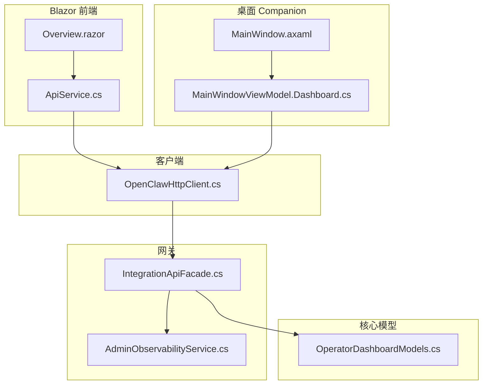
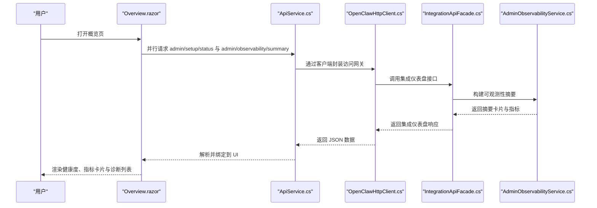
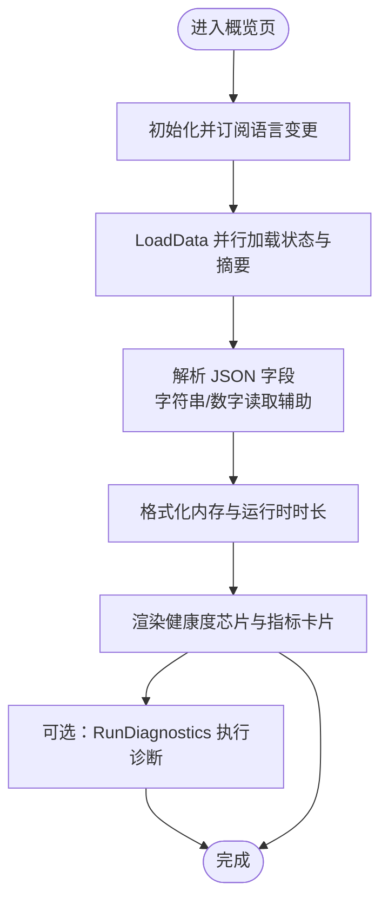
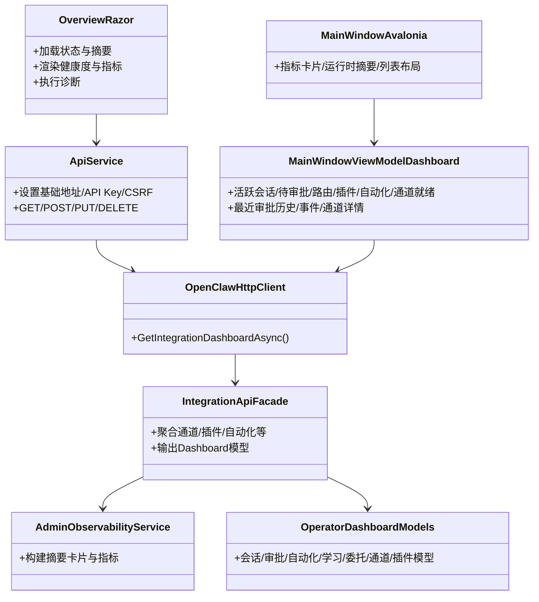

# 概览页面

<cite>
**本文引用的文件**   
- [Overview.razor](file://src/OpenClaw.Dashboard/Pages/Overview.razor)
- [ApiService.cs](file://src/OpenClaw.Dashboard/Services/ApiService.cs)
- [OperatorDashboardModels.cs](file://src/OpenClaw.Core/Models/OperatorDashboardModels.cs)
- [MainWindowViewModel.Dashboard.cs](file://src/OpenClaw.Companion/ViewModels/MainWindowViewModel.Dashboard.cs)
- [OpenClawHttpClient.cs](file://src/OpenClaw.Client/OpenClawHttpClient.cs)
- [IntegrationApiModels.cs](file://src/OpenClaw.Core/Models/IntegrationApiModels.cs)
- [IntegrationApiFacade.cs](file://src/OpenClaw.Gateway/Composition/IntegrationApiFacade.cs)
- [AdminObservabilityService.cs](file://src/OpenClaw.Gateway/AdminObservabilityService.cs)
- [MainWindow.axaml](file://src/OpenClaw.Companion/Views/MainWindow.axaml)
</cite>

## 目录
1. [简介](#简介)
2. [项目结构](#项目结构)
3. [核心组件](#核心组件)
4. [架构总览](#架构总览)
5. [详细组件分析](#详细组件分析)
6. [依赖关系分析](#依赖关系分析)
7. [性能考虑](#性能考虑)
8. [故障排查指南](#故障排查指南)
9. [结论](#结论)
10. [附录](#附录)

## 简介
本文件面向概览页面（Dashboard Overview）的技术文档，覆盖整体布局设计、关键指标展示与实时数据更新机制。概览页面由两套实现并行存在：Blazor 前端的 Overview 页面与 AvaloniaUI Companion 的仪表盘视图。前者通过 API 获取运行时状态与可观测性摘要，并以卡片与诊断列表形式呈现；后者通过客户端封装的集成接口聚合会话、审批、插件、通道等运营级指标，并在主窗口中以网格与列表展示。

## 项目结构
概览页面涉及的模块分布如下：
- Blazor 前端（Dashboard）
  - 页面：Overview.razor
  - 服务：ApiService.cs
- 运营模型（Core）
  - 模型：OperatorDashboardModels.cs
- 客户端（Client）
  - 接口封装：OpenClawHttpClient.cs
- 网关（Gateway）
  - 组合层：IntegrationApiFacade.cs
  - 可观测性：AdminObservabilityService.cs
- 桌面 Companion（Companion）
  - 视图模型：MainWindowViewModel.Dashboard.cs
  - 主窗口视图：MainWindow.axaml

**图表来源**
- [Overview.razor](file://src/OpenClaw.Dashboard/Pages/Overview.razor)
- [ApiService.cs](file://src/OpenClaw.Dashboard/Services/ApiService.cs)
- [OpenClawHttpClient.cs](file://src/OpenClaw.Client/OpenClawHttpClient.cs)
- [IntegrationApiFacade.cs](file://src/OpenClaw.Gateway/Composition/IntegrationApiFacade.cs)
- [AdminObservabilityService.cs](file://src/OpenClaw.Gateway/AdminObservabilityService.cs)
- [OperatorDashboardModels.cs](file://src/OpenClaw.Core/Models/OperatorDashboardModels.cs)
- [MainWindowViewModel.Dashboard.cs](file://src/OpenClaw.Companion/ViewModels/MainWindowViewModel.Dashboard.cs)
- [MainWindow.axaml](file://src/OpenClaw.Companion/Views/MainWindow.axaml)

**章节来源**
- [Overview.razor](file://src/OpenClaw.Dashboard/Pages/Overview.razor)
- [ApiService.cs](file://src/OpenClaw.Dashboard/Services/ApiService.cs)
- [OpenClawHttpClient.cs](file://src/OpenClaw.Client/OpenClawHttpClient.cs)
- [IntegrationApiFacade.cs](file://src/OpenClaw.Gateway/Composition/IntegrationApiFacade.cs)
- [AdminObservabilityService.cs](file://src/OpenClaw.Gateway/AdminObservabilityService.cs)
- [OperatorDashboardModels.cs](file://src/OpenClaw.Core/Models/OperatorDashboardModels.cs)
- [MainWindowViewModel.Dashboard.cs](file://src/OpenClaw.Companion/ViewModels/MainWindowViewModel.Dashboard.cs)
- [MainWindow.axaml](file://src/OpenClaw.Companion/Views/MainWindow.axaml)

## 核心组件
- 概览页面（Overview.razor）
  - 负责渲染版本号、活跃会话数、请求总量、内存占用、运行时健康度与诊断列表。
  - 使用并行加载 admin/setup/status 与 admin/observability/summary，提升首屏速度。
- API 服务（ApiService.cs）
  - 封装 HttpClient，支持设置基础地址、API Key、CSRF Token，统一 JSON 序列化配置。
  - 提供 GetAsync、GetRawAsync、PostAsync 等方法，便于页面调用后端接口。
- 运营模型（OperatorDashboardModels.cs）
  - 定义会话、审批、自动化、学习、委托、通道、插件等仪表盘快照与明细指标。
- 客户端封装（OpenClawHttpClient.cs）
  - 提供 GetIntegrationDashboardAsync 等方法，用于 Companion 侧集成仪表盘数据。
- 网关组合层（IntegrationApiFacade.cs）
  - 聚合运行时状态、通道就绪度、插件健康度、自动化统计等，输出 Dashboard 摘要。
- 可观测性服务（AdminObservabilityService.cs）
  - 构建可观测性摘要卡片与指标分桶，支撑 Overview 页面的数值与趋势展示。
- Companion 视图模型（MainWindowViewModel.Dashboard.cs）
  - 在桌面应用中展示活跃会话、待审批、路由数量、插件数、自动化数、通道就绪数与最近事件/审批历史。
- 主窗口视图（MainWindow.axaml）
  - 布局包含指标卡片、运行时摘要、最近审批决策与通道列表等区域。

**章节来源**
- [Overview.razor](file://src/OpenClaw.Dashboard/Pages/Overview.razor)
- [ApiService.cs](file://src/OpenClaw.Dashboard/Services/ApiService.cs)
- [OperatorDashboardModels.cs](file://src/OpenClaw.Core/Models/OperatorDashboardModels.cs)
- [OpenClawHttpClient.cs](file://src/OpenClaw.Client/OpenClawHttpClient.cs)
- [IntegrationApiFacade.cs](file://src/OpenClaw.Gateway/Composition/IntegrationApiFacade.cs)
- [AdminObservabilityService.cs](file://src/OpenClaw.Gateway/AdminObservabilityService.cs)
- [MainWindowViewModel.Dashboard.cs](file://src/OpenClaw.Companion/ViewModels/MainWindowViewModel.Dashboard.cs)
- [MainWindow.axaml](file://src/OpenClaw.Companion/Views/MainWindow.axaml)

## 架构总览
概览页面的数据流从前端或桌面客户端发起，经由 API 服务与客户端封装，最终由网关组合层汇总生成运营指标，并返回给前端或 Companion 展示。

**图表来源**
- [Overview.razor](file://src/OpenClaw.Dashboard/Pages/Overview.razor)
- [ApiService.cs](file://src/OpenClaw.Dashboard/Services/ApiService.cs)
- [OpenClawHttpClient.cs](file://src/OpenClaw.Client/OpenClawHttpClient.cs)
- [IntegrationApiFacade.cs](file://src/OpenClaw.Gateway/Composition/IntegrationApiFacade.cs)
- [AdminObservabilityService.cs](file://src/OpenClaw.Gateway/AdminObservabilityService.cs)

## 详细组件分析

### 组件一：概览页面（Overview.razor）
- 布局设计
  - 顶部标题与刷新按钮；健康度芯片按状态动态显示；加载时显示骨架屏网格。
  - 指标网格包含版本、活跃会话、请求总量、内存占用与运行时时长卡片。
  - 诊断区域以列表形式展示检查项、状态与建议步骤。
- 关键指标
  - 版本号、活跃会话、请求总量、内存占用、运行时时长、健康度标签与图标。
- 实时更新机制
  - 刷新按钮触发 LoadData 并行拉取状态与摘要；诊断按钮触发 RunDiagnostics 异步执行。
- 数据解析与格式化
  - 通过字符串/数字读取辅助函数与内存/时长格式化函数，兼容不同字段名与单位。
- 错误处理
  - 请求失败或解析异常时返回空值，避免页面崩溃；诊断为空时提示无数据。

**图表来源**
- [Overview.razor](file://src/OpenClaw.Dashboard/Pages/Overview.razor)

**章节来源**
- [Overview.razor](file://src/OpenClaw.Dashboard/Pages/Overview.razor)

### 组件二：API 服务（ApiService.cs）
- 功能要点
  - 设置基础地址、API Key、CSRF Token；统一 JSON 序列化策略。
  - 支持 GET/POST/PUT/DELETE/raw 方法，自动规范化 URL。
- 性能与安全
  - 避免重复序列化，减少 GC 压力；对变更类请求注入 CSRF Token。

**章节来源**
- [ApiService.cs](file://src/OpenClaw.Dashboard/Services/ApiService.cs)

### 组件三：运营模型（OperatorDashboardModels.cs）
- 数据模型
  - OperatorDashboardSnapshot：聚合会话、审批、内存、自动化、学习、委托、通道、插件与可靠性快照。
  - 各类 Dashboard*Summary：包含计数、明细与分组指标。
- 复杂度与扩展性
  - 模型以只读集合与数值为主，便于前后端传输与缓存；新增指标可通过扩展模型与映射逻辑实现。

**章节来源**
- [OperatorDashboardModels.cs](file://src/OpenClaw.Core/Models/OperatorDashboardModels.cs)

### 组件四：客户端封装（OpenClawHttpClient.cs）
- 功能要点
  - 提供 GetIntegrationDashboardAsync 等强类型方法，简化调用。
  - 内置 URI 构造与 JSON 上下文，保证序列化一致性。
- 与网关交互
  - 通过网关组合层整合多源数据，输出统一的仪表盘响应。

**章节来源**
- [OpenClawHttpClient.cs](file://src/OpenClaw.Client/OpenClawHttpClient.cs)

### 组件五：网关组合层（IntegrationApiFacade.cs）
- 功能要点
  - 聚合通道就绪度、插件健康度、自动化统计等，构建 DashboardChannelSummary 与 DashboardPluginSummary。
  - 输出 OperatorDashboardSnapshot 供上层消费。
- 与可观测性协作
  - 与 AdminObservabilityService 协同生成摘要卡片与指标分桶。

**章节来源**
- [IntegrationApiFacade.cs](file://src/OpenClaw.Gateway/Composition/IntegrationApiFacade.cs)
- [AdminObservabilityService.cs](file://src/OpenClaw.Gateway/AdminObservabilityService.cs)

### 组件六：Companion 视图模型（MainWindowViewModel.Dashboard.cs）
- 功能要点
  - 在桌面应用中展示活跃会话、待审批、路由数量、插件数、自动化数、通道就绪数。
  - 加载最近审批历史、事件与通道就绪详情，支持批量替换集合以减少 UI 抖动。
- 错误处理
  - 捕获取消、网络与无效操作异常，更新状态文本提示。

**章节来源**
- [MainWindowViewModel.Dashboard.cs](file://src/OpenClaw.Companion/ViewModels/MainWindowViewModel.Dashboard.cs)

### 组件七：主窗口视图（MainWindow.axaml）
- 功能要点
  - 指标卡片网格、运行时摘要、最近审批决策列表、通道就绪列表等区域布局。
  - 与视图模型双向绑定，支持刷新时间与连接状态展示。

**章节来源**
- [MainWindow.axaml](file://src/OpenClaw.Companion/Views/MainWindow.axaml)

## 依赖关系分析
- Overview.razor 依赖 ApiService.cs 进行网络请求，ApiService.cs 依赖 OpenClawHttpClient.cs 访问网关。
- IntegrationApiFacade.cs 依赖 AdminObservabilityService.cs 生成摘要，并输出到 OperatorDashboardModels.cs 定义的模型。
- Companion 的 MainWindowViewModel.Dashboard.cs 也依赖 OpenClawHttpClient.cs 获取集成仪表盘数据。

**图表来源**
- [Overview.razor](file://src/OpenClaw.Dashboard/Pages/Overview.razor)
- [ApiService.cs](file://src/OpenClaw.Dashboard/Services/ApiService.cs)
- [OpenClawHttpClient.cs](file://src/OpenClaw.Client/OpenClawHttpClient.cs)
- [IntegrationApiFacade.cs](file://src/OpenClaw.Gateway/Composition/IntegrationApiFacade.cs)
- [AdminObservabilityService.cs](file://src/OpenClaw.Gateway/AdminObservabilityService.cs)
- [OperatorDashboardModels.cs](file://src/OpenClaw.Core/Models/OperatorDashboardModels.cs)
- [MainWindowViewModel.Dashboard.cs](file://src/OpenClaw.Companion/ViewModels/MainWindowViewModel.Dashboard.cs)
- [MainWindow.axaml](file://src/OpenClaw.Companion/Views/MainWindow.axaml)

**章节来源**
- [Overview.razor](file://src/OpenClaw.Dashboard/Pages/Overview.razor)
- [ApiService.cs](file://src/OpenClaw.Dashboard/Services/ApiService.cs)
- [OpenClawHttpClient.cs](file://src/OpenClaw.Client/OpenClawHttpClient.cs)
- [IntegrationApiFacade.cs](file://src/OpenClaw.Gateway/Composition/IntegrationApiFacade.cs)
- [AdminObservabilityService.cs](file://src/OpenClaw.Gateway/AdminObservabilityService.cs)
- [OperatorDashboardModels.cs](file://src/OpenClaw.Core/Models/OperatorDashboardModels.cs)
- [MainWindowViewModel.Dashboard.cs](file://src/OpenClaw.Companion/ViewModels/MainWindowViewModel.Dashboard.cs)
- [MainWindow.axaml](file://src/OpenClaw.Companion/Views/MainWindow.axaml)

## 性能考虑
- 并行加载
  - 概览页在初始化时并行请求状态与摘要，缩短首屏等待时间。
- 轻量序列化
  - ApiService 统一 JSON 选项，避免重复配置带来的额外开销。
- 骨架屏与懒加载
  - 加载期间显示骨架屏，降低感知延迟；诊断区域按需触发。
- 集合替换优化
  - Companion 视图模型使用批量替换集合的方式更新列表，减少 UI 重绘。
- 缓存与节流
  - 建议对高频指标进行本地缓存与最小刷新间隔控制，避免过度请求。

[本节为通用性能建议，不直接分析具体文件]

## 故障排查指南
- 网络请求失败
  - ApiService 对非成功状态码返回空值；检查基础地址、API Key 与 CSRF Token 是否正确设置。
- JSON 解析异常
  - TryGetJsonAsync 捕获异常并返回空值；确认后端返回格式与命名策略一致。
- 诊断为空
  - RunDiagnostics 返回空列表时，检查 doctor 接口可用性与权限。
- Companion 加载异常
  - 视图模型捕获取消、网络与无效操作异常，查看状态文本提示定位问题。

**章节来源**
- [ApiService.cs](file://src/OpenClaw.Dashboard/Services/ApiService.cs)
- [Overview.razor](file://src/OpenClaw.Dashboard/Pages/Overview.razor)
- [MainWindowViewModel.Dashboard.cs](file://src/OpenClaw.Companion/ViewModels/MainWindowViewModel.Dashboard.cs)

## 结论
概览页面通过并行数据加载与统一的模型契约，实现了对运行时健康度、会话统计、工具使用与系统状态的可视化呈现。Blazor 与 Companion 两端分别满足浏览器与桌面场景的需求，结合网关组合层与可观测性服务，形成完整的运营仪表盘能力。后续可在缓存、增量更新与主题定制等方面进一步优化用户体验。

[本节为总结性内容，不直接分析具体文件]

## 附录
- 页面定制化选项建议
  - 主题与配色：基于 MudBlazor 主题变量与 CSS 自定义属性，支持浅/深色切换。
  - 指标粒度：通过查询参数或配置开关控制摘要卡片与诊断项的维度。
  - 刷新策略：提供手动刷新、定时刷新与事件驱动刷新（WebSocket）。
- 用户体验优化建议
  - 首屏骨架屏与渐进式渲染，减少感知延迟。
  - 交互反馈：加载指示器、错误提示与成功状态徽章。
  - 可访问性：为图标与按钮提供语义化标题与键盘导航支持。

[本节为概念性建议，不直接分析具体文件]