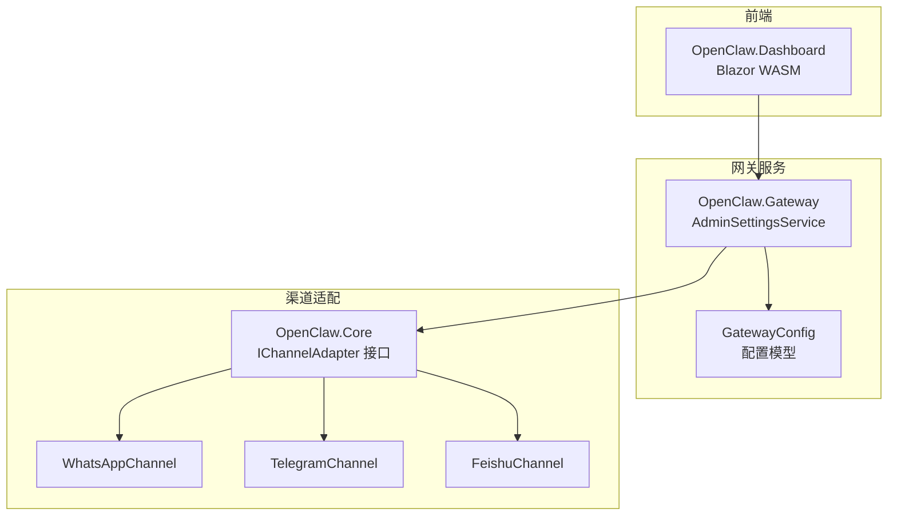
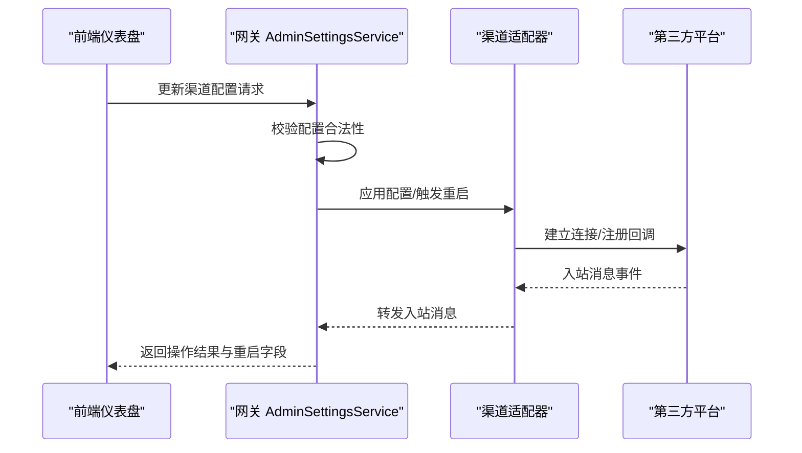
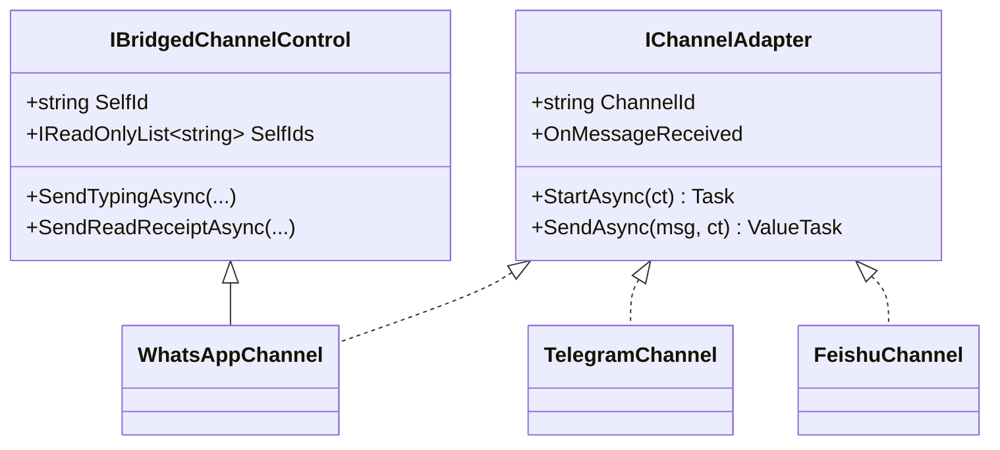
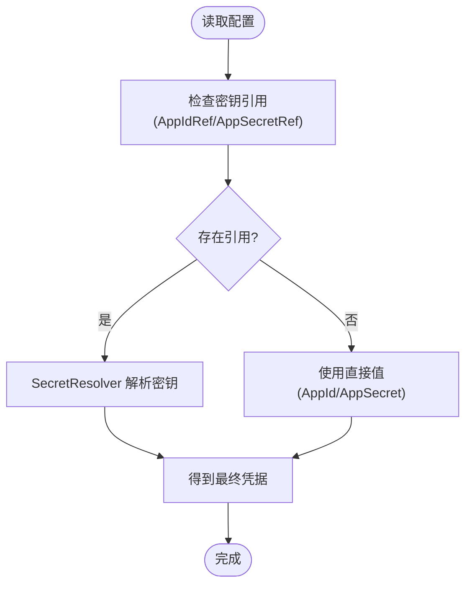
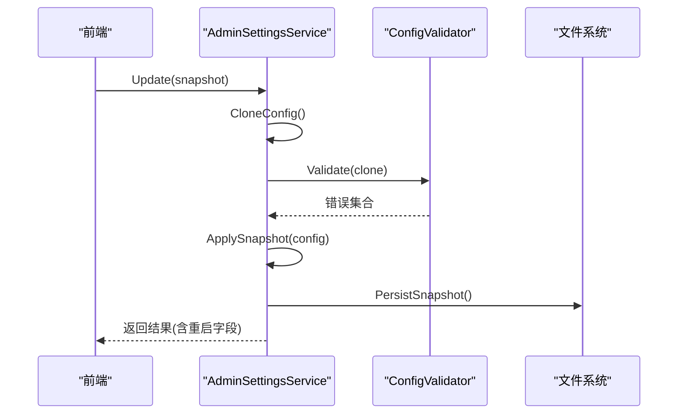
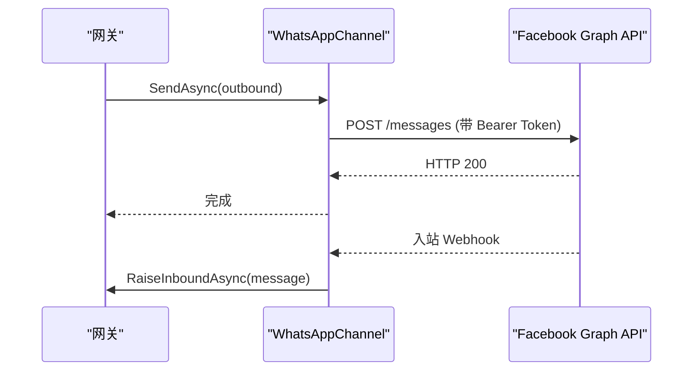
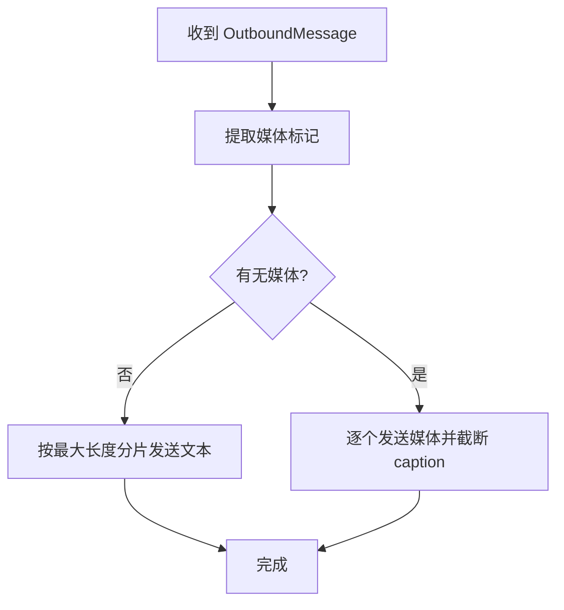
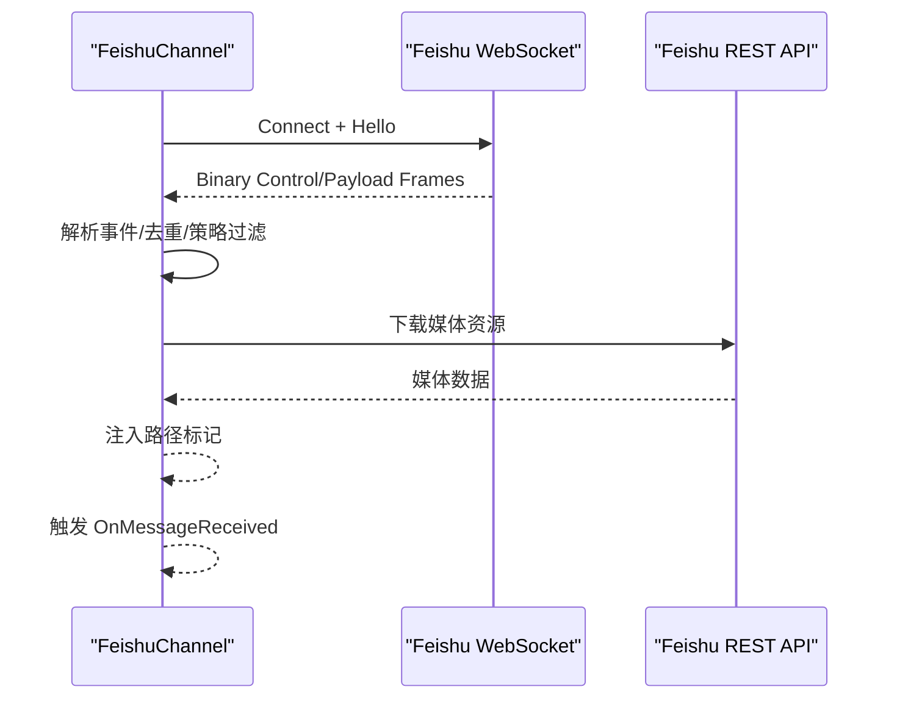
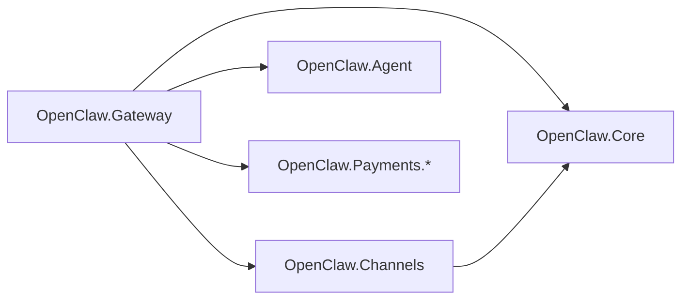

# 渠道管理

<cite>
**本文档引用的文件**
- [OpenClaw.Channels.csproj](file://src/OpenClaw.Channels/OpenClaw.Channels.csproj)
- [OpenClaw.Gateway.csproj](file://src/OpenClaw.Gateway/OpenClaw.Gateway.csproj)
- [OpenClaw.Dashboard.csproj](file://src/OpenClaw.Dashboard/OpenClaw.Dashboard.csproj)
- [KingcrabChannelConfigs.cs](file://src/OpenClaw.Core/Models/KingcrabChannelConfigs.cs)
- [IChannelAdapter.cs](file://src/OpenClaw.Core/Abstractions/IChannelAdapter.cs)
- [IBridgedChannelControl.cs](file://src/OpenClaw.Core/Abstractions/IBridgedChannelControl.cs)
- [AdminSettingsService.cs](file://src/OpenClaw.Gateway/AdminSettingsService.cs)
- [WhatsAppChannel.cs](file://src/OpenClaw.Channels/WhatsAppChannel.cs)
- [TelegramChannel.cs](file://src/OpenClaw.Channels/TelegramChannel.cs)
- [FeishuChannel.cs](file://src/OpenClaw.Channels/FeishuChannel.cs)
</cite>

## 目录
1. [简介](#简介)
2. [项目结构](#项目结构)
3. [核心组件](#核心组件)
4. [架构总览](#架构总览)
5. [详细组件分析](#详细组件分析)
6. [依赖关系分析](#依赖关系分析)
7. [性能考虑](#性能考虑)
8. [故障排查指南](#故障排查指南)
9. [结论](#结论)
10. [附录](#附录)

## 简介
本文件面向渠道管理页面，系统性阐述各类通信渠道的配置管理、状态监控与故障诊断能力。内容覆盖渠道连接状态、消息路由配置、认证设置与性能指标监控，并包含渠道适配器集成、配置验证机制、连接测试工具与渠道统计分析。最后提供安全最佳实践与运维指南，帮助在生产环境中稳定运行多渠道接入。

## 项目结构
渠道管理涉及三大层面：
- 渠道适配层：各平台（如 WhatsApp、Telegram、Feishu 等）的适配器实现，负责消息收发与事件处理。
- 网关控制层：集中配置管理、校验与持久化，提供管理员界面可编辑的参数与重启要求识别。
- 前端仪表盘：Blazor WASM 前端，承载渠道配置展示、编辑与状态可视化。

**图表来源**
- [OpenClaw.Dashboard.csproj:1-15](file://src/OpenClaw.Dashboard/OpenClaw.Dashboard.csproj#L1-L15)
- [OpenClaw.Gateway.csproj:1-143](file://src/OpenClaw.Gateway/OpenClaw.Gateway.csproj#L1-L143)
- [OpenClaw.Channels.csproj:1-14](file://src/OpenClaw.Channels/OpenClaw.Channels.csproj#L1-L14)
- [IChannelAdapter.cs:1-22](file://src/OpenClaw.Core/Abstractions/IChannelAdapter.cs#L1-L22)
- [AdminSettingsService.cs:1-589](file://src/OpenClaw.Gateway/AdminSettingsService.cs#L1-L589)

**章节来源**
- [OpenClaw.Dashboard.csproj:1-15](file://src/OpenClaw.Dashboard/OpenClaw.Dashboard.csproj#L1-L15)
- [OpenClaw.Gateway.csproj:1-143](file://src/OpenClaw.Gateway/OpenClaw.Gateway.csproj#L1-L143)
- [OpenClaw.Channels.csproj:1-14](file://src/OpenClaw.Channels/OpenClaw.Channels.csproj#L1-L14)

## 核心组件
- 渠道适配接口 IChannelAdapter：统一抽象，定义启动、发送、事件回调等能力，确保不同渠道的一致行为。
- 渠道适配器实现：如 WhatsAppChannel、TelegramChannel、FeishuChannel，分别对接官方 API/Webhook 并实现消息收发。
- 管理员设置服务 AdminSettingsService：负责配置快照、校验、持久化与重启需求识别，支撑渠道配置的在线修改与验证。
- 渠道配置模型：KingcrabChannelConfigs 提供 Feishu/DingTalk/WeCom 等特定渠道的配置项，支持密钥引用与热重载。

**章节来源**
- [IChannelAdapter.cs:1-22](file://src/OpenClaw.Core/Abstractions/IChannelAdapter.cs#L1-L22)
- [AdminSettingsService.cs:1-589](file://src/OpenClaw.Gateway/AdminSettingsService.cs#L1-L589)
- [KingcrabChannelConfigs.cs:1-126](file://src/OpenClaw.Core/Models/KingcrabChannelConfigs.cs#L1-L126)

## 架构总览
渠道管理采用“前端-网关-适配器”三层协作：
- 前端通过 HTTP API 与网关交互，获取/更新渠道配置。
- 网关对配置进行校验与持久化，必要时触发适配器重启。
- 适配器负责与第三方平台交互，处理入站事件并发送出站消息。

**图表来源**
- [AdminSettingsService.cs:220-251](file://src/OpenClaw.Gateway/AdminSettingsService.cs#L220-L251)
- [IChannelAdapter.cs:13-21](file://src/OpenClaw.Core/Abstractions/IChannelAdapter.cs#L13-L21)
- [WhatsAppChannel.cs:38-77](file://src/OpenClaw.Channels/WhatsAppChannel.cs#L38-L77)
- [TelegramChannel.cs:52-124](file://src/OpenClaw.Channels/TelegramChannel.cs#L52-L124)
- [FeishuChannel.cs:126-147](file://src/OpenClaw.Channels/FeishuChannel.cs#L126-L147)

## 详细组件分析

### 渠道适配器接口与桥接控制
- IChannelAdapter：定义 StartAsync、SendAsync、OnMessageReceived 事件，保证所有适配器具备一致的生命周期与消息处理能力。
- IBridgedChannelControl：扩展 Typing/ReadReceipt 等桥接能力，适用于需要更丰富 IM 行为的渠道。

**图表来源**
- [IChannelAdapter.cs:1-22](file://src/OpenClaw.Core/Abstractions/IChannelAdapter.cs#L1-L22)
- [IBridgedChannelControl.cs:1-12](file://src/OpenClaw.Core/Abstractions/IBridgedChannelControl.cs#L1-L12)
- [WhatsAppChannel.cs:14-34](file://src/OpenClaw.Channels/WhatsAppChannel.cs#L14-L34)
- [TelegramChannel.cs:18-47](file://src/OpenClaw.Channels/TelegramChannel.cs#L18-L47)
- [FeishuChannel.cs:21-71](file://src/OpenClaw.Channels/FeishuChannel.cs#L21-L71)

**章节来源**
- [IChannelAdapter.cs:1-22](file://src/OpenClaw.Core/Abstractions/IChannelAdapter.cs#L1-L22)
- [IBridgedChannelControl.cs:1-12](file://src/OpenClaw.Core/Abstractions/IBridgedChannelControl.cs#L1-L12)

### 渠道配置模型与密钥解析
- KingcrabChannelConfigs：提供 Feishu/DingTalk/WeCom 的配置项，支持直接值或密钥引用（如 env:），便于在不同环境间切换。
- SecretResolver：从引用解析真实密钥值，避免明文硬编码。

**图表来源**
- [KingcrabChannelConfigs.cs:13-52](file://src/OpenClaw.Core/Models/KingcrabChannelConfigs.cs#L13-L52)
- [WhatsAppChannel.cs:27-31](file://src/OpenClaw.Channels/WhatsAppChannel.cs#L27-L31)
- [FeishuChannel.cs:195-209](file://src/OpenClaw.Channels/FeishuChannel.cs#L195-L209)

**章节来源**
- [KingcrabChannelConfigs.cs:1-126](file://src/OpenClaw.Core/Models/KingcrabChannelConfigs.cs#L1-L126)
- [WhatsAppChannel.cs:27-31](file://src/OpenClaw.Channels/WhatsAppChannel.cs#L27-L31)
- [FeishuChannel.cs:195-209](file://src/OpenClaw.Channels/FeishuChannel.cs#L195-L209)

### 管理员设置服务与配置验证
- 快照创建与应用：AdminSettingsService 将当前配置转为快照，支持增量更新与回滚。
- 配置校验：调用 ConfigValidator 进行规则校验，返回错误列表。
- 持久化：将快照写入 admin-settings.json，支持路径与时间戳信息。
- 重启需求：区分即时生效与需重启的字段，向前端提示重启要求。

**图表来源**
- [AdminSettingsService.cs:220-251](file://src/OpenClaw.Gateway/AdminSettingsService.cs#L220-L251)
- [AdminSettingsService.cs:363-370](file://src/OpenClaw.Gateway/AdminSettingsService.cs#L363-L370)
- [AdminSettingsService.cs:393-455](file://src/OpenClaw.Gateway/AdminSettingsService.cs#L393-L455)

**章节来源**
- [AdminSettingsService.cs:1-589](file://src/OpenClaw.Gateway/AdminSettingsService.cs#L1-L589)

### 渠道适配器实现要点

#### WhatsApp 渠道
- 认证：使用 Cloud API Token（支持密钥引用）。
- 发送：根据媒体标记构建 payload，限制单条消息最多一个媒体附件。
- 入站：通过 Webhook 解析入站消息，触发 OnMessageReceived。

**图表来源**
- [WhatsAppChannel.cs:40-77](file://src/OpenClaw.Channels/WhatsAppChannel.cs#L40-L77)
- [WhatsAppChannel.cs:249-320](file://src/OpenClaw.Channels/WhatsAppChannel.cs#L249-L320)

**章节来源**
- [WhatsAppChannel.cs:1-320](file://src/OpenClaw.Channels/WhatsAppChannel.cs#L1-L320)

#### Telegram 渠道
- 认证：Bot Token（支持密钥引用）。
- 发送：自动分片文本、媒体分发；支持回复消息 ID；限制 caption 长度。
- 入站：由网关路由到适配器（通过 HTTP Webhook）。

**图表来源**
- [TelegramChannel.cs:54-124](file://src/OpenClaw.Channels/TelegramChannel.cs#L54-L124)
- [TelegramChannel.cs:181-188](file://src/OpenClaw.Channels/TelegramChannel.cs#L181-L188)

**章节来源**
- [TelegramChannel.cs:1-338](file://src/OpenClaw.Channels/TelegramChannel.cs#L1-L338)

#### Feishu 渠道
- 连接：WebSocket 长连接 + 心跳保活；支持二进制帧协议。
- 认证：AppId/AppSecret 获取 access_token；支持热重载与动态重启。
- 去重：内存 TTL + 磁盘持久化双层去重，防止重复处理与重放攻击。
- 入站：解析事件帧，按群组策略与 @mention 过滤，下载媒体到本地临时文件并注入路径标记。

**图表来源**
- [FeishuChannel.cs:213-262](file://src/OpenClaw.Channels/FeishuChannel.cs#L213-L262)
- [FeishuChannel.cs:415-446](file://src/OpenClaw.Channels/FeishuChannel.cs#L415-L446)
- [FeishuChannel.cs:691-761](file://src/OpenClaw.Channels/FeishuChannel.cs#L691-L761)

**章节来源**
- [FeishuChannel.cs:1-800](file://src/OpenClaw.Channels/FeishuChannel.cs#L1-L800)

### 渠道连接状态与健康检查
- 连接状态：适配器内部维护连接生命周期（如 Feishu 的 WebSocket 循环、重连退避）。
- 心跳与保活：Feishu 实现客户端心跳；其他适配器通过平台 API 或轮询维持可用性。
- 健康指标：建议结合网关侧的运行时脉搏与遥测服务采集发送/接收延迟、错误率、重试次数等。

[本节为概念性说明，不直接分析具体文件]

### 消息路由配置与策略
- 群组策略：支持 open/allowlist/disabled 三种策略，白名单可限定允许的群组与用户。
- @提及过滤：在群组场景下可仅响应被 @ 的消息，降低噪音。
- 媒体处理：根据平台能力选择直链或下载到本地临时文件，注入统一标记以便下游工具使用。

**章节来源**
- [KingcrabChannelConfigs.cs:29-52](file://src/OpenClaw.Core/Models/KingcrabChannelConfigs.cs#L29-L52)
- [FeishuChannel.cs:482-542](file://src/OpenClaw.Channels/FeishuChannel.cs#L482-L542)

### 认证设置与密钥管理
- 密钥引用：优先使用 env: 引用，避免明文存储。
- 动态解析：SecretResolver 在运行时解析密钥，支持热重载场景下的凭据刷新。
- 安全建议：最小权限原则、定期轮换、审计日志与访问控制。

**章节来源**
- [KingcrabChannelConfigs.cs:17-27](file://src/OpenClaw.Core/Models/KingcrabChannelConfigs.cs#L17-L27)
- [WhatsAppChannel.cs:27-31](file://src/OpenClaw.Channels/WhatsAppChannel.cs#L27-L31)
- [FeishuChannel.cs:195-209](file://src/OpenClaw.Channels/FeishuChannel.cs#L195-L209)

### 性能指标监控
- 发送/接收延迟：记录 HTTP 请求耗时与 WebSocket 帧往返时间。
- 错误率与重试：统计 API 失败次数、重试退避与超时。
- 媒体吞吐：下载/上传速率、缓存命中率与磁盘占用。
- 建议：结合 OpenTelemetry 采集指标并上报至可观测性平台。

[本节为概念性说明，不直接分析具体文件]

### 配置验证机制与连接测试
- 配置验证：AdminSettingsService 在更新前克隆配置并执行校验，返回错误列表。
- 连接测试：建议在前端提供“连接测试”按钮，调用适配器的最小化发送/拉取流程以验证凭据与网络连通性。
- 热重载：部分适配器支持 UpdateConfigAsync 动态更新并在后台重启，减少停机时间。

**章节来源**
- [AdminSettingsService.cs:228-238](file://src/OpenClaw.Gateway/AdminSettingsService.cs#L228-L238)
- [FeishuChannel.cs:117-122](file://src/OpenClaw.Channels/FeishuChannel.cs#L117-L122)

### 渠道统计分析
- 建议采集维度：渠道类型、消息量、媒体量、失败率、平均响应时间、去重命中率。
- 可视化：前端仪表盘展示趋势图与热力图，支持按时间/渠道/用户维度筛选。
- 报告：生成日报/周报，辅助容量规划与成本优化。

[本节为概念性说明，不直接分析具体文件]

## 依赖关系分析
- 项目引用关系：Gateway 依赖 Core、Channels、Agent、Payments 等模块；Channels 依赖 Core 的抽象与模型。
- 包依赖：Channels 引入 MailKit、Microsoft.Extensions.Http；Gateway 引入 OpenTelemetry、A2A、MudBlazor 等。
- 前后端集成：Gateway 内嵌 Blazor WASM 前端静态资源，通过静态文件服务提供。

**图表来源**
- [OpenClaw.Gateway.csproj:26-34](file://src/OpenClaw.Gateway/OpenClaw.Gateway.csproj#L26-L34)
- [OpenClaw.Channels.csproj:6-12](file://src/OpenClaw.Channels/OpenClaw.Channels.csproj#L6-L12)

**章节来源**
- [OpenClaw.Gateway.csproj:1-143](file://src/OpenClaw.Gateway/OpenClaw.Gateway.csproj#L1-L143)
- [OpenClaw.Channels.csproj:1-14](file://src/OpenClaw.Channels/OpenClaw.Channels.csproj#L1-L14)

## 性能考虑
- 连接池与复用：HTTP 客户端复用，避免频繁握手；WebSocket 长连接保持心跳。
- 去重与幂等：Feishu 的双层去重有效降低重复处理开销。
- 分片与限流：Telegram 文本分片与 caption 截断，避免平台限制；结合网关级速率限制。
- 缓存与本地化：媒体下载到本地临时文件，减少二次网络请求。

[本节为通用指导，不直接分析具体文件]

## 故障排查指南
- 配置类问题
  - 缺少密钥引用或解析失败：检查 AppIdRef/AppSecretRef 是否正确，确认 SecretResolver 能解析。
  - 群组/用户白名单导致消息被拒：核对 GroupPolicy 与 AllowedXxxIds。
- 连接类问题
  - Feishu WebSocket 断线：关注日志中的重连退避与心跳状态；确认服务端返回的控制帧类型。
  - 第三方 API 调用失败：检查 Token 有效期、URL 路径与请求头 Authorization。
- 媒体类问题
  - 无法下载媒体：确认 access_token 有效、资源 key 正确；检查临时文件写入权限。
- 验证与恢复
  - 使用 AdminSettingsService 的校验结果定位错误字段；必要时回滚到基线快照。
  - 对于需重启的配置变更，遵循前端提示进行重启。

**章节来源**
- [AdminSettingsService.cs:108-133](file://src/OpenClaw.Gateway/AdminSettingsService.cs#L108-L133)
- [FeishuChannel.cs:213-262](file://src/OpenClaw.Channels/FeishuChannel.cs#L213-L262)
- [FeishuChannel.cs:415-446](file://src/OpenClaw.Channels/FeishuChannel.cs#L415-L446)

## 结论
通过统一的适配器接口、完善的配置管理与校验机制，以及针对不同平台的特性实现（如 Feishu 的 WebSocket 长连接与去重、Telegram 的媒体分发与 caption 截断、WhatsApp 的媒体标记映射），渠道管理页面能够稳定地支撑多渠道接入。配合前端可视化与运维工具，可实现从配置到监控的全生命周期管理。

## 附录
- 安全最佳实践
  - 使用密钥引用而非明文存储；定期轮换密钥并审计访问日志。
  - 启用签名验证（如 Telegram/WhatsApp/Webhook）与令牌校验。
  - 限制入站/出站速率，启用熔断与退避策略。
- 运维指南
  - 建立变更审批流程与灰度发布策略。
  - 监控关键指标并设置告警阈值。
  - 定期备份 admin-settings.json，确保可快速回滚。

[本节为通用指导，不直接分析具体文件]