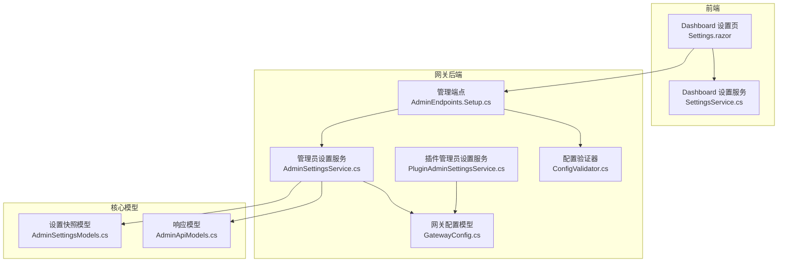
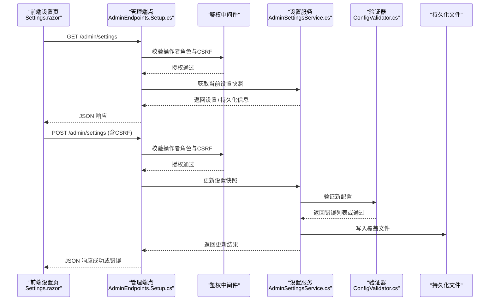
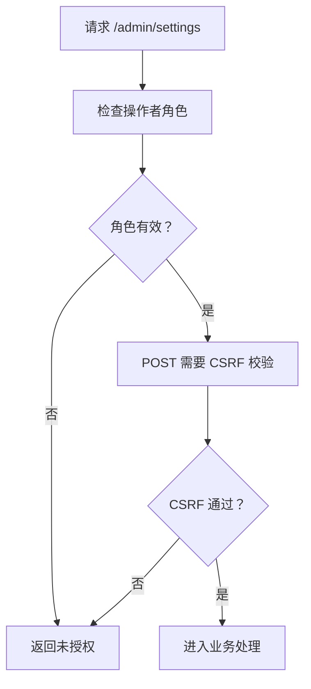
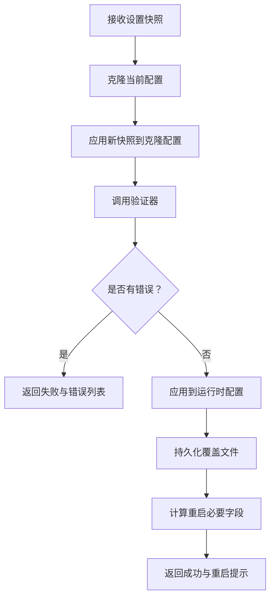
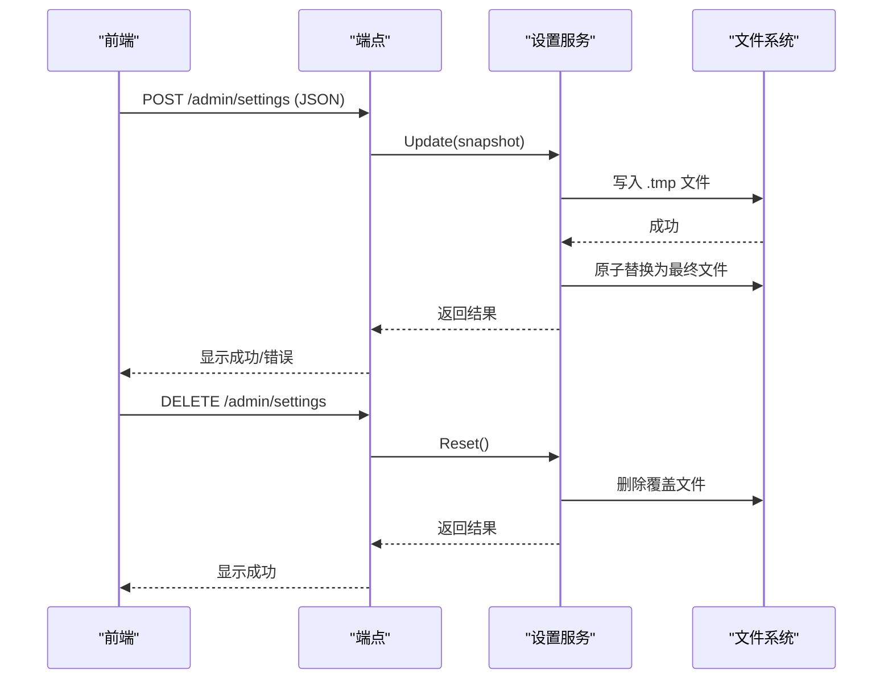
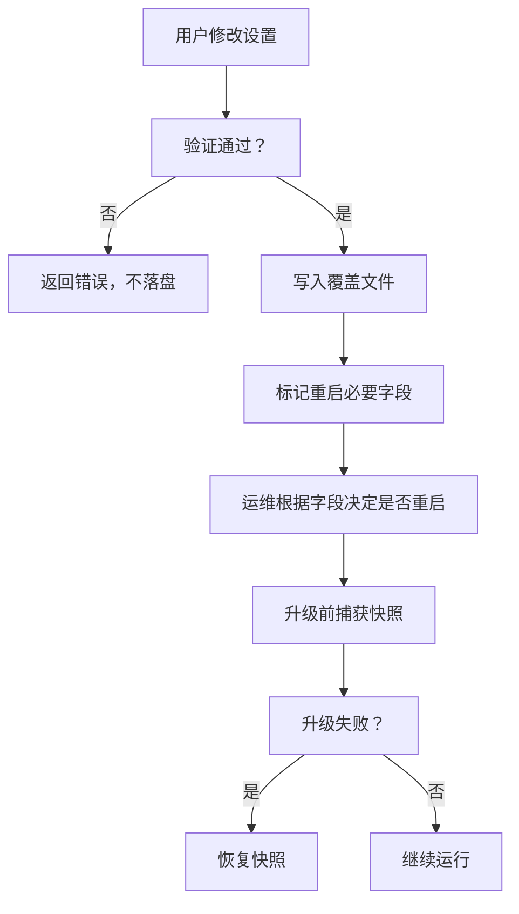
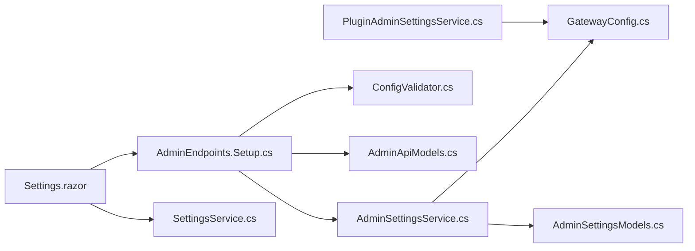

# 系统设置

<cite>
**本文引用的文件**
- [AdminSettingsModels.cs](file://src/OpenClaw.Core/Models/AdminSettingsModels.cs)
- [AdminApiModels.cs](file://src/OpenClaw.Core/Models/AdminApiModels.cs)
- [AdminSettingsService.cs](file://src/OpenClaw.Gateway/AdminSettingsService.cs)
- [PluginAdminSettingsService.cs](file://src/OpenClaw.Gateway/PluginAdminSettingsService.cs)
- [AdminEndpoints.Setup.cs](file://src/OpenClaw.Gateway/Endpoints/AdminEndpoints.Setup.cs)
- [Settings.razor](file://src/OpenClaw.Dashboard/Pages/Settings.razor)
- [SettingsService.cs](file://src/OpenClaw.Dashboard/Services/SettingsService.cs)
- [SettingsModel.cs](file://src/OpenClaw.Dashboard/Models/SettingsModel.cs)
- [ConfigValidator.cs](file://src/OpenClaw.Core/Validation/ConfigValidator.cs)
- [GatewayConfig.cs](file://src/OpenClaw.Core/Models/GatewayConfig.cs)
- [UpgradeCommands.cs](file://src/OpenClaw.Cli/UpgradeCommands.cs)
- [AdminSettingsServiceTests.cs](file://src/OpenClaw.Tests/AdminSettingsServiceTests.cs)
</cite>

## 目录
1. [简介](#简介)
2. [项目结构](#项目结构)
3. [核心组件](#核心组件)
4. [架构总览](#架构总览)
5. [详细组件分析](#详细组件分析)
6. [依赖关系分析](#依赖关系分析)
7. [性能考量](#性能考量)
8. [故障排查指南](#故障排查指南)
9. [结论](#结论)
10. [附录](#附录)

## 简介
本文件面向系统设置页面，提供从数据模型、验证规则、持久化与回滚到权限控制与安全最佳实践的完整技术文档。系统设置涵盖运行时参数、工具与内存策略、通道（渠道）策略以及插件管理等维度，支持在线编辑、导入导出与重置恢复，并通过严格的验证规则保障配置安全与一致性。

## 项目结构
系统设置涉及前端 Blazor 页面、后端 API 端点、配置服务与验证器、以及持久化存储。下图展示与“系统设置”直接相关的模块关系：

**图表来源**
- [AdminEndpoints.Setup.cs](file://src/OpenClaw.Gateway/Endpoints/AdminEndpoints.Setup.cs)
- [AdminSettingsService.cs](file://src/OpenClaw.Gateway/AdminSettingsService.cs)
- [PluginAdminSettingsService.cs](file://src/OpenClaw.Gateway/PluginAdminSettingsService.cs)
- [AdminSettingsModels.cs](file://src/OpenClaw.Core/Models/AdminSettingsModels.cs)
- [AdminApiModels.cs](file://src/OpenClaw.Core/Models/AdminApiModels.cs)
- [ConfigValidator.cs](file://src/OpenClaw.Core/Validation/ConfigValidator.cs)
- [GatewayConfig.cs](file://src/OpenClaw.Core/Models/GatewayConfig.cs)
- [Settings.razor](file://src/OpenClaw.Dashboard/Pages/Settings.razor)
- [SettingsService.cs](file://src/OpenClaw.Dashboard/Services/SettingsService.cs)

**章节来源**
- [AdminEndpoints.Setup.cs](file://src/OpenClaw.Gateway/Endpoints/AdminEndpoints.Setup.cs)
- [AdminSettingsService.cs](file://src/OpenClaw.Gateway/AdminSettingsService.cs)
- [PluginAdminSettingsService.cs](file://src/OpenClaw.Gateway/PluginAdminSettingsService.cs)
- [AdminSettingsModels.cs](file://src/OpenClaw.Core/Models/AdminSettingsModels.cs)
- [AdminApiModels.cs](file://src/OpenClaw.Core/Models/AdminApiModels.cs)
- [ConfigValidator.cs](file://src/OpenClaw.Core/Validation/ConfigValidator.cs)
- [GatewayConfig.cs](file://src/OpenClaw.Core/Models/GatewayConfig.cs)
- [Settings.razor](file://src/OpenClaw.Dashboard/Pages/Settings.razor)
- [SettingsService.cs](file://src/OpenClaw.Dashboard/Services/SettingsService.cs)

## 核心组件
- 设置数据模型：定义管理员可调优的全部字段，包括运行时、工具、内存与通道策略等。
- 配置验证器：在应用层启动或设置变更时进行强校验，拒绝不合法配置。
- 管理员设置服务：负责加载/保存覆盖配置、计算重启必要字段、生成持久化信息。
- 插件管理员设置服务：管理插件启用与配置覆盖，独立于主设置文件。
- 管理端点：提供 /admin/settings 的 GET/POST/DELETE 接口，配合权限与 CSRF 校验。
- 前端设置页：提供可视化表单、JSON 快照编辑、保存与重置操作。
- 持久化与回滚：覆盖文件写入与删除；CLI 提供升级回滚快照能力。

**章节来源**
- [AdminSettingsModels.cs](file://src/OpenClaw.Core/Models/AdminSettingsModels.cs)
- [ConfigValidator.cs](file://src/OpenClaw.Core/Validation/ConfigValidator.cs)
- [AdminSettingsService.cs](file://src/OpenClaw.Gateway/AdminSettingsService.cs)
- [PluginAdminSettingsService.cs](file://src/OpenClaw.Gateway/PluginAdminSettingsService.cs)
- [AdminEndpoints.Setup.cs](file://src/OpenClaw.Gateway/Endpoints/AdminEndpoints.Setup.cs)
- [Settings.razor](file://src/OpenClaw.Dashboard/Pages/Settings.razor)

## 架构总览
系统设置的请求-处理-响应流程如下：

**图表来源**
- [AdminEndpoints.Setup.cs](file://src/OpenClaw.Gateway/Endpoints/AdminEndpoints.Setup.cs)
- [AdminSettingsService.cs](file://src/OpenClaw.Gateway/AdminSettingsService.cs)
- [ConfigValidator.cs](file://src/OpenClaw.Core/Validation/ConfigValidator.cs)
- [Settings.razor](file://src/OpenClaw.Dashboard/Pages/Settings.razor)

## 详细组件分析

### 数据模型与字段分类
- 运行时参数：并发会话数、会话超时、使用页脚、会话令牌预算、每分钟速率限制等。
- 工具与安全：自主模式、是否需要工具审批、审批超时、并行执行、是否允许 Shell、只读模式、浏览器工具开关与评估能力等。
- 内存与保留策略：最大历史轮次、压缩开关与阈值、保留开关、启动即扫、归档开关与保留天数、每次清扫最大条目数等。
- 通道策略：短信、电报、Teams、Slack、Discord、Signal、WhatsApp 等的启用、签名验证、私聊策略、类型、Webhook 路径与密钥引用等。
- 插件管理：插件启用状态与配置覆盖，独立持久化于 admin 子目录。

上述字段均在以下模型中定义与序列化/反序列化：
- 管理员设置快照：[AdminSettingsModels.cs](file://src/OpenClaw.Core/Models/AdminSettingsModels.cs)
- 管理员设置响应：[AdminApiModels.cs](file://src/OpenClaw.Core/Models/AdminApiModels.cs)

**章节来源**
- [AdminSettingsModels.cs](file://src/OpenClaw.Core/Models/AdminSettingsModels.cs)
- [AdminApiModels.cs](file://src/OpenClaw.Core/Models/AdminApiModels.cs)

### 权限控制与鉴权
- 端点访问控制：/admin/settings 的 GET/POST/DELETE 均要求操作者角色，且 POST 需要 CSRF 校验。
- 角色与作用域：端点使用 endpointScope 参数限定操作范围，如 “admin.settings”、“admin.settings.mutate”。

**图表来源**
- [AdminEndpoints.Setup.cs](file://src/OpenClaw.Gateway/Endpoints/AdminEndpoints.Setup.cs)

**章节来源**
- [AdminEndpoints.Setup.cs](file://src/OpenClaw.Gateway/Endpoints/AdminEndpoints.Setup.cs)

### 配置验证规则与默认值管理
- 启动验证：ConfigValidator 在启动阶段对端口、LLM、内存、会话、WebSocket、工具、沙箱等进行严格校验。
- 设置变更验证：AdminSettingsService 在 Update 时克隆配置、应用新快照并通过验证器返回错误集合；错误集合为空则落盘。
- 默认值来源：AdminSettingsService.CreateSnapshot 将 GatewayConfig 中的默认值映射为快照初始值，确保未覆盖时采用安全默认。

**图表来源**
- [AdminSettingsService.cs](file://src/OpenClaw.Gateway/AdminSettingsService.cs)
- [ConfigValidator.cs](file://src/OpenClaw.Core/Validation/ConfigValidator.cs)

**章节来源**
- [AdminSettingsService.cs](file://src/OpenClaw.Gateway/AdminSettingsService.cs)
- [ConfigValidator.cs](file://src/OpenClaw.Core/Validation/ConfigValidator.cs)

### 持久化与导入导出
- 覆盖文件：设置服务将快照写入 admin-settings.json（或插件覆盖文件），采用临时文件 + 原子替换策略，避免损坏。
- 导入导出：前端设置页提供 JSON 快照文本框，支持粘贴任意合法 JSON 进行导入，保存后返回最新快照用于核对。
- 重置：DELETE /admin/settings 删除覆盖文件，恢复基线配置。

**图表来源**
- [AdminEndpoints.Setup.cs](file://src/OpenClaw.Gateway/Endpoints/AdminEndpoints.Setup.cs)
- [AdminSettingsService.cs](file://src/OpenClaw.Gateway/AdminSettingsService.cs)
- [Settings.razor](file://src/OpenClaw.Dashboard/Pages/Settings.razor)

**章节来源**
- [AdminSettingsService.cs](file://src/OpenClaw.Gateway/AdminSettingsService.cs)
- [AdminEndpoints.Setup.cs](file://src/OpenClaw.Gateway/Endpoints/AdminEndpoints.Setup.cs)
- [Settings.razor](file://src/OpenClaw.Dashboard/Pages/Settings.razor)

### 插件管理员设置
- 插件覆盖文件：独立持久化于 admin/plugin-admin-settings.json，键为插件 ID，值为启用状态与配置片段。
- 动态更新：Upsert 支持按插件 ID 更新启用状态与配置，立即落盘。
- 应用方式：ApplyEntries 将覆盖应用到运行时配置字典。

**章节来源**
- [PluginAdminSettingsService.cs](file://src/OpenClaw.Gateway/PluginAdminSettingsService.cs)

### 配置版本管理与回滚
- 版本与变更追踪：AdminSettingsService 维护“即时生效字段”与“需重启字段”的清单，Update 后返回重启必要字段列表，便于运维决策。
- 回滚能力：CLI 升级命令提供回滚快照捕获与恢复，确保升级失败时能回到上一个健康状态。

**图表来源**
- [AdminSettingsService.cs](file://src/OpenClaw.Gateway/AdminSettingsService.cs)
- [UpgradeCommands.cs](file://src/OpenClaw.Cli/UpgradeCommands.cs)

**章节来源**
- [AdminSettingsService.cs](file://src/OpenClaw.Gateway/AdminSettingsService.cs)
- [UpgradeCommands.cs](file://src/OpenClaw.Cli/UpgradeCommands.cs)

### 前端设置页面与本地偏好
- 访问控制：仅具备 admin 角色方可渲染设置页。
- 本地偏好：Dashboard 设置服务使用 localStorage 存储代理 API 基地址与 API Key，便于前端行为记忆。
- 表单与快照：提供运行时、工具、内存三大面板与完整 JSON 快照编辑区，支持保存与重置。

**章节来源**
- [Settings.razor](file://src/OpenClaw.Dashboard/Pages/Settings.razor)
- [SettingsService.cs](file://src/OpenClaw.Dashboard/Services/SettingsService.cs)
- [SettingsModel.cs](file://src/OpenClaw.Dashboard/Models/SettingsModel.cs)

## 依赖关系分析
- 管理端点依赖 AdminSettingsService 与 ConfigValidator，确保每次变更都经过验证。
- AdminSettingsService 依赖 GatewayConfig 作为运行时配置源，同时维护覆盖文件路径。
- 前端设置页依赖 API 端点，通过 JSON 交互完成导入导出与保存。
- 插件设置服务与主设置服务解耦，分别维护各自覆盖文件。

**图表来源**
- [AdminEndpoints.Setup.cs](file://src/OpenClaw.Gateway/Endpoints/AdminEndpoints.Setup.cs)
- [AdminSettingsService.cs](file://src/OpenClaw.Gateway/AdminSettingsService.cs)
- [ConfigValidator.cs](file://src/OpenClaw.Core/Validation/ConfigValidator.cs)
- [GatewayConfig.cs](file://src/OpenClaw.Core/Models/GatewayConfig.cs)
- [AdminSettingsModels.cs](file://src/OpenClaw.Core/Models/AdminSettingsModels.cs)
- [AdminApiModels.cs](file://src/OpenClaw.Core/Models/AdminApiModels.cs)
- [Settings.razor](file://src/OpenClaw.Dashboard/Pages/Settings.razor)
- [SettingsService.cs](file://src/OpenClaw.Dashboard/Services/SettingsService.cs)
- [PluginAdminSettingsService.cs](file://src/OpenClaw.Gateway/PluginAdminSettingsService.cs)

**章节来源**
- [AdminEndpoints.Setup.cs](file://src/OpenClaw.Gateway/Endpoints/AdminEndpoints.Setup.cs)
- [AdminSettingsService.cs](file://src/OpenClaw.Gateway/AdminSettingsService.cs)
- [ConfigValidator.cs](file://src/OpenClaw.Core/Validation/ConfigValidator.cs)
- [GatewayConfig.cs](file://src/OpenClaw.Core/Models/GatewayConfig.cs)
- [AdminSettingsModels.cs](file://src/OpenClaw.Core/Models/AdminSettingsModels.cs)
- [AdminApiModels.cs](file://src/OpenClaw.Core/Models/AdminApiModels.cs)
- [Settings.razor](file://src/OpenClaw.Dashboard/Pages/Settings.razor)
- [SettingsService.cs](file://src/OpenClaw.Dashboard/Services/SettingsService.cs)
- [PluginAdminSettingsService.cs](file://src/OpenClaw.Gateway/PluginAdminSettingsService.cs)

## 性能考量
- 并发安全：设置服务内部使用锁保护快照读取与更新，避免竞态。
- 原子写入：覆盖文件采用 .tmp + Move 替换，降低部分写入风险。
- 验证成本：启动验证与设置变更验证均在内存中进行，避免频繁 IO；建议批量提交以减少验证次数。
- 前端体验：设置页在加载与保存时显示进度与消息，提升可用性。

[本节为通用指导，无需特定文件引用]

## 故障排查指南
- 保存失败：若返回 400 且包含错误列表，请逐项修正字段值（如阈值范围、策略枚举值等）。
- 未生效：确认是否属于“需重启字段”，必要时执行重启。
- 重置无效：确认覆盖文件是否存在，DELETE 后应移除覆盖文件并恢复基线。
- 验证失败示例：测试用例覆盖了非法策略与阈值等场景，可参考定位问题。

**章节来源**
- [AdminSettingsServiceTests.cs](file://src/OpenClaw.Tests/AdminSettingsServiceTests.cs)
- [AdminSettingsService.cs](file://src/OpenClaw.Gateway/AdminSettingsService.cs)

## 结论
系统设置页面通过严谨的数据模型、强验证与原子持久化，实现了对运行时、工具、内存与通道的精细化控制。结合权限控制、重启必要字段提示与 CLI 回滚能力，既保证了灵活性，也确保了安全性与可恢复性。建议在生产环境遵循最小权限原则与最小变更策略，配合快照与回滚机制，实现安全可控的配置演进。

[本节为总结性内容，无需特定文件引用]

## 附录

### 字段分类与默认值速览
- 运行时：并发会话数、会话超时、使用页脚、会话令牌预算、每分钟速率限制等，默认值来自 GatewayConfig。
- 工具与安全：自主模式、审批策略、并行执行、Shell 与只读模式、浏览器工具开关等，默认值来自 GatewayConfig。
- 内存与保留：历史轮次、压缩阈值、保留策略、归档与清扫间隔等，默认值来自 GatewayConfig。
- 通道策略：各渠道启用、签名验证、私聊策略、Webhook 与密钥引用等，默认值来自 GatewayConfig。
- 插件管理：插件启用与配置覆盖，独立文件持久化。

**章节来源**
- [AdminSettingsModels.cs](file://src/OpenClaw.Core/Models/AdminSettingsModels.cs)
- [GatewayConfig.cs](file://src/OpenClaw.Core/Models/GatewayConfig.cs)

### 安全指南与最佳实践
- 最小权限：仅授予 admin 角色必要的操作者账户；POST 请求必须携带有效 CSRF。
- 逐步变更：优先修改“即时生效字段”，避免一次性大范围改动；对“需重启字段”提前规划窗口。
- 备份与回滚：升级前执行回滚快照捕获；保存前先在测试环境验证 JSON 快照。
- 密钥管理：敏感字段使用引用（如 env:...）而非明文硬编码；定期轮换密钥并清理旧引用。
- 日志审计：关注设置更新的审计记录，异常变更及时复核。

[本节为通用指导，无需特定文件引用]