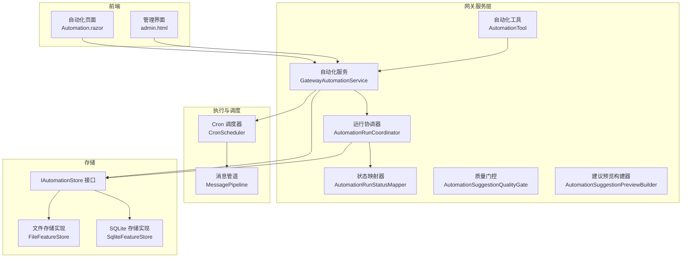
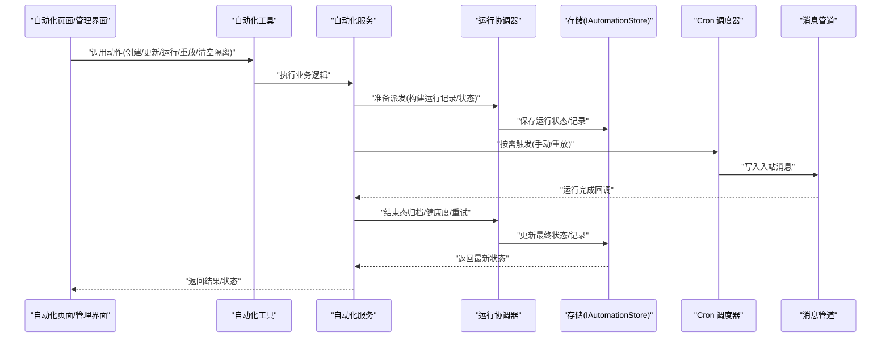
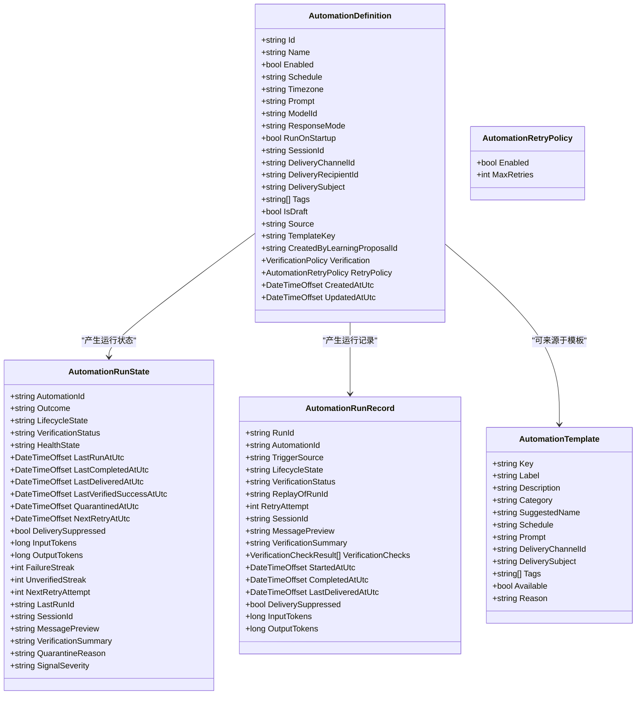
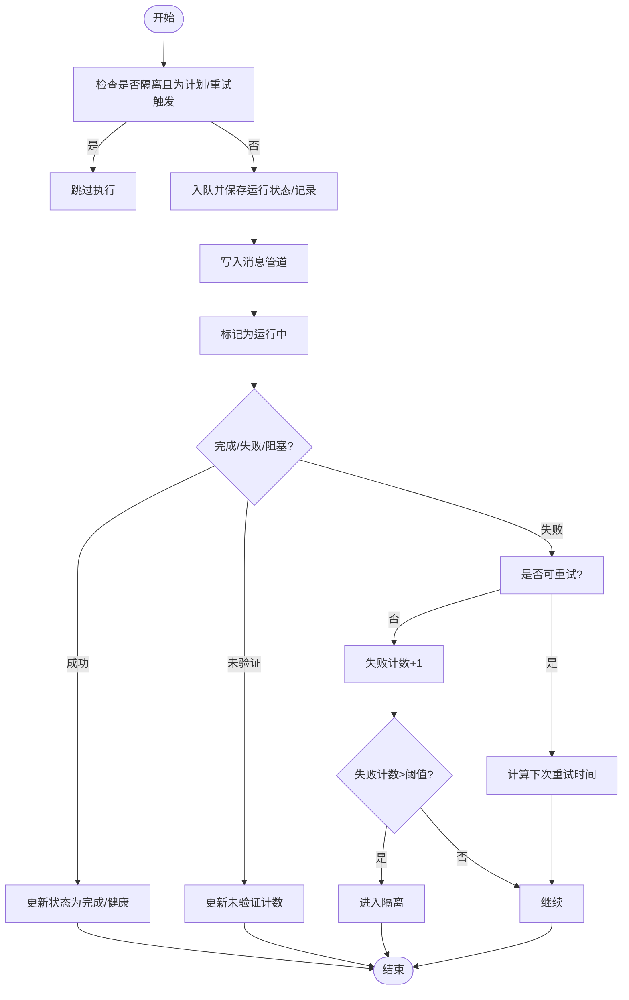
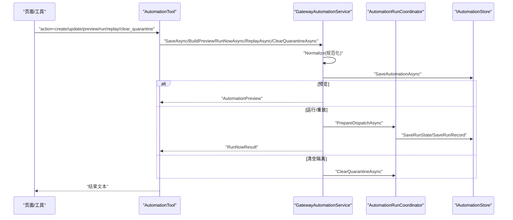
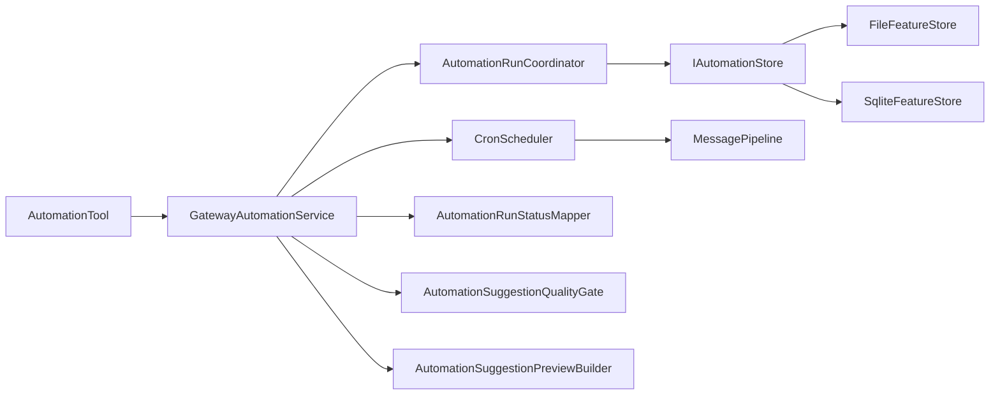

# 自动化配置

<cite>
**本文引用的文件**
- [AutomationModels.cs](file://src/OpenClaw.Core/Models/AutomationModels.cs)
- [GatewayAutomationService.cs](file://src/OpenClaw.Gateway/GatewayAutomationService.cs)
- [AutomationRunCoordinator.cs](file://src/OpenClaw.Gateway/AutomationRunCoordinator.cs)
- [AutomationRunStatusMapper.cs](file://src/OpenClaw.Gateway/AutomationRunStatusMapper.cs)
- [AutomationSuggestionQualityGate.cs](file://src/OpenClaw.Gateway/AutomationSuggestionQualityGate.cs)
- [AutomationSuggestionPreviewBuilder.cs](file://src/OpenClaw.Gateway/AutomationSuggestionPreviewBuilder.cs)
- [AutomationTool.cs](file://src/OpenClaw.Gateway/Tools/AutomationTool.cs)
- [IAutomationStore.cs](file://src/OpenClaw.Core/Abstractions/IAutomationStore.cs)
- [FileFeatureStore.cs](file://src/OpenClaw.Core/Features/FileFeatureStore.cs)
- [SqliteFeatureStore.cs](file://src/OpenClaw.Core/Features/SqliteFeatureStore.cs)
- [CronScheduler.cs](file://src/OpenClaw.Core/Pipeline/CronScheduler.cs)
- [IntegrationApiFacade.cs](file://src/OpenClaw.Gateway/Composition/IntegrationApiFacade.cs)
- [Automation.razor](file://src/OpenClaw.Dashboard/Pages/Automation.razor)
- [admin.html](file://src/OpenClaw.Gateway/wwwroot/admin.html)
- [GatewayAdminEndpointTests.cs](file://src/OpenClaw.Tests/GatewayAdminEndpointTests.cs)
</cite>

## 目录
1. [简介](#简介)
2. [项目结构](#项目结构)
3. [核心组件](#核心组件)
4. [架构总览](#架构总览)
5. [详细组件分析](#详细组件分析)
6. [依赖关系分析](#依赖关系分析)
7. [性能考量](#性能考量)
8. [故障排除指南](#故障排除指南)
9. [结论](#结论)
10. [附录](#附录)

## 简介
本文件面向自动化配置页面与后端执行引擎，系统性阐述自动化规则的创建、编辑、预览、运行、重放与管理流程；详解触发条件（计划任务）、执行策略（重试、隔离、健康度）、错误处理与监控告警；给出自动化规则的数据模型、存储与执行引擎集成方式，并提供调试工具与性能监控建议及最佳实践与故障排除指南。

## 项目结构
自动化能力由“前端页面/工具”、“网关服务层”、“执行调度器”、“状态与存储”四层构成，形成从UI到持久化的闭环。

图表来源
- [Automation.razor](file://src/OpenClaw.Dashboard/Pages/Automation.razor)
- [admin.html](file://src/OpenClaw.Gateway/wwwroot/admin.html)
- [AutomationTool.cs](file://src/OpenClaw.Gateway/Tools/AutomationTool.cs)
- [GatewayAutomationService.cs](file://src/OpenClaw.Gateway/GatewayAutomationService.cs)
- [AutomationRunCoordinator.cs](file://src/OpenClaw.Gateway/AutomationRunCoordinator.cs)
- [AutomationRunStatusMapper.cs](file://src/OpenClaw.Gateway/AutomationRunStatusMapper.cs)
- [AutomationSuggestionQualityGate.cs](file://src/OpenClaw.Gateway/AutomationSuggestionQualityGate.cs)
- [AutomationSuggestionPreviewBuilder.cs](file://src/OpenClaw.Gateway/AutomationSuggestionPreviewBuilder.cs)
- [CronScheduler.cs](file://src/OpenClaw.Core/Pipeline/CronScheduler.cs)
- [IAutomationStore.cs](file://src/OpenClaw.Core/Abstractions/IAutomationStore.cs)
- [FileFeatureStore.cs](file://src/OpenClaw.Core/Features/FileFeatureStore.cs)
- [SqliteFeatureStore.cs](file://src/OpenClaw.Core/Features/SqliteFeatureStore.cs)

章节来源
- [Automation.razor](file://src/OpenClaw.Dashboard/Pages/Automation.razor)
- [admin.html](file://src/OpenClaw.Gateway/wwwroot/admin.html)
- [GatewayAutomationService.cs](file://src/OpenClaw.Gateway/GatewayAutomationService.cs)
- [AutomationRunCoordinator.cs](file://src/OpenClaw.Gateway/AutomationRunCoordinator.cs)
- [CronScheduler.cs](file://src/OpenClaw.Core/Pipeline/CronScheduler.cs)
- [IAutomationStore.cs](file://src/OpenClaw.Core/Abstractions/IAutomationStore.cs)
- [FileFeatureStore.cs](file://src/OpenClaw.Core/Features/FileFeatureStore.cs)
- [SqliteFeatureStore.cs](file://src/OpenClaw.Core/Features/SqliteFeatureStore.cs)

## 核心组件
- 数据模型：定义自动化规则、运行状态、运行记录、模板、重试策略、验证策略等。
- 网关服务：提供自动化 CRUD、运行、重放、模板、预览、迁移、缓存刷新等能力。
- 运行协调器：负责排队、运行中状态更新、完成态归档、重试调度、隔离与健康度判定。
- 状态映射器：统一推导生命周期、验证状态、健康度、信号严重级别与最终结果。
- 工具与前端：通过工具接口与页面/仪表盘提供创建、编辑、运行、重放、清空隔离等操作。
- 存储：抽象接口与文件/SQLite实现，持久化自动化定义、运行状态与历史记录。
- 调度：基于 Cron 的调度器将自动化事件注入消息管道。

章节来源
- [AutomationModels.cs](file://src/OpenClaw.Core/Models/AutomationModels.cs)
- [GatewayAutomationService.cs](file://src/OpenClaw.Gateway/GatewayAutomationService.cs)
- [AutomationRunCoordinator.cs](file://src/OpenClaw.Gateway/AutomationRunCoordinator.cs)
- [AutomationRunStatusMapper.cs](file://src/OpenClaw.Gateway/AutomationRunStatusMapper.cs)
- [AutomationTool.cs](file://src/OpenClaw.Gateway/Tools/AutomationTool.cs)
- [IAutomationStore.cs](file://src/OpenClaw.Core/Abstractions/IAutomationStore.cs)
- [FileFeatureStore.cs](file://src/OpenClaw.Core/Features/FileFeatureStore.cs)
- [SqliteFeatureStore.cs](file://src/OpenClaw.Core/Features/SqliteFeatureStore.cs)
- [CronScheduler.cs](file://src/OpenClaw.Core/Pipeline/CronScheduler.cs)

## 架构总览
自动化配置页面与后端的交互链路如下：

图表来源
- [AutomationTool.cs](file://src/OpenClaw.Gateway/Tools/AutomationTool.cs)
- [GatewayAutomationService.cs](file://src/OpenClaw.Gateway/GatewayAutomationService.cs)
- [AutomationRunCoordinator.cs](file://src/OpenClaw.Gateway/AutomationRunCoordinator.cs)
- [IAutomationStore.cs](file://src/OpenClaw.Core/Abstractions/IAutomationStore.cs)
- [CronScheduler.cs](file://src/OpenClaw.Core/Pipeline/CronScheduler.cs)

## 详细组件分析

### 数据模型与状态机
- 自动化定义包含标识、名称、启用状态、计划表达式、时区、提示词、模型、响应模式、会话、投递通道/收件人/主题、标签、草稿、来源、模板键、学习提案关联、验证策略、重试策略、创建/更新时间等。
- 运行状态包含生命周期、验证状态、健康度、最后运行/完成/投递时间、隔离时间、输入/输出用量、失败/未验证连续次数、下一次重试时间与尝试次数、消息摘要、验证摘要、隔离原因、信号严重级别等。
- 运行记录包含触发来源、生命周期、验证状态、重放来源、重试次数、会话、消息摘要、验证摘要与检查项、开始/完成/投递时间、投递抑制、用量等。
- 模板用于快速生成常见自动化，如心跳、自定义、收件箱分流、日报、频道安全扫描、事故跟进、仓库健康等。
- 重试策略支持开关与最大重试次数；验证策略可配置在运行完成后由治理服务评估。

图表来源
- [AutomationModels.cs](file://src/OpenClaw.Core/Models/AutomationModels.cs)

章节来源
- [AutomationModels.cs](file://src/OpenClaw.Core/Models/AutomationModels.cs)

### 触发条件与执行策略
- 触发来源包括：计划任务、手动、重试、重放、心跳。
- 执行策略：
  - 队列与运行：协调器在入队时写入运行状态与运行记录，并在运行中/完成后更新状态与记录。
  - 重试：根据重试策略与触发来源决定是否允许重试，指数退避延迟，超过阈值进入隔离。
  - 隔离：连续失败达到阈值自动隔离，需人工清空隔离后恢复。
  - 健康度：根据生命周期、验证状态与隔离状态推导健康度。
  - 信号严重级别：心跳自动化可携带告警/错误信号，影响最终结果与健康度。

图表来源
- [AutomationRunCoordinator.cs](file://src/OpenClaw.Gateway/AutomationRunCoordinator.cs)
- [AutomationRunStatusMapper.cs](file://src/OpenClaw.Gateway/AutomationRunStatusMapper.cs)

章节来源
- [GatewayAutomationService.cs](file://src/OpenClaw.Gateway/GatewayAutomationService.cs)
- [AutomationRunCoordinator.cs](file://src/OpenClaw.Gateway/AutomationRunCoordinator.cs)
- [AutomationRunStatusMapper.cs](file://src/OpenClaw.Gateway/AutomationRunStatusMapper.cs)

### 创建、编辑与管理流程
- 创建/更新：工具解析参数，构建自动化定义，服务进行规范化与保存，同时记录学习反馈并刷新缓存。
- 预览：服务对候选定义进行规范化与校验，返回问题列表、模板与估算运行频次。
- 运行/重放：服务将请求转换为派发请求，协调器入队并写入管道；重放时携带原运行ID。
- 暂停/恢复：仅更新启用状态字段。
- 清空隔离：重置隔离状态与相关计数，允许后续计划/重试触发。

图表来源
- [AutomationTool.cs](file://src/OpenClaw.Gateway/Tools/AutomationTool.cs)
- [GatewayAutomationService.cs](file://src/OpenClaw.Gateway/GatewayAutomationService.cs)
- [AutomationRunCoordinator.cs](file://src/OpenClaw.Gateway/AutomationRunCoordinator.cs)
- [IAutomationStore.cs](file://src/OpenClaw.Core/Abstractions/IAutomationStore.cs)

章节来源
- [AutomationTool.cs](file://src/OpenClaw.Gateway/Tools/AutomationTool.cs)
- [GatewayAutomationService.cs](file://src/OpenClaw.Gateway/GatewayAutomationService.cs)
- [AutomationRunCoordinator.cs](file://src/OpenClaw.Gateway/AutomationRunCoordinator.cs)

### 错误处理与监控告警
- 错误处理：
  - 失败计数与未验证计数：用于判定是否进入隔离或触发重试。
  - 隔离：连续失败达到阈值自动隔离，需清空隔离后恢复。
  - 重试：指数退避延迟，受策略限制。
  - 健康度：根据生命周期、验证状态与隔离状态推导。
- 监控告警：
  - 心跳自动化可携带告警/错误信号，影响最终结果与健康度。
  - 运行记录包含验证摘要与检查项，便于审计与回溯。
  - 管理端可观测性卡片展示自动化失败数量、死信数量、操作建议等。

章节来源
- [AutomationRunCoordinator.cs](file://src/OpenClaw.Gateway/AutomationRunCoordinator.cs)
- [AutomationRunStatusMapper.cs](file://src/OpenClaw.Gateway/AutomationRunStatusMapper.cs)
- [GatewayAdminEndpointTests.cs](file://src/OpenClaw.Tests/GatewayAdminEndpointTests.cs)

### 调试工具与质量门控
- 质量门控：对候选自动化进行维度评分（意图清晰度、输入范围稳定性、输出格式、日程匹配、安全性、噪声风险、用户价值、重复风险），并给出决策（仅学习、草稿待审、就绪草稿、抑制）。
- 建议预览：生成建议理由、原始与精炼提示、质量分数与警告、期望输出分段等。
- 前端页面：提供模板选择、自动化列表、运行记录查看、运行/删除/预览/新建等操作入口。

章节来源
- [AutomationSuggestionQualityGate.cs](file://src/OpenClaw.Gateway/AutomationSuggestionQualityGate.cs)
- [AutomationSuggestionPreviewBuilder.cs](file://src/OpenClaw.Gateway/AutomationSuggestionPreviewBuilder.cs)
- [Automation.razor](file://src/OpenClaw.Dashboard/Pages/Automation.razor)
- [admin.html](file://src/OpenClaw.Gateway/wwwroot/admin.html)

### 执行引擎集成
- Cron 调度器：从作业源读取自动化作业，注入消息管道，交由运行协调器处理。
- 消息管道：承载自动化运行事件，确保有序处理与可观测性。
- 合约治理：运行完成后可附加/分离运行合约，记录验证结果与状态。

章节来源
- [CronScheduler.cs](file://src/OpenClaw.Core/Pipeline/CronScheduler.cs)
- [GatewayAutomationService.cs](file://src/OpenClaw.Gateway/GatewayAutomationService.cs)
- [AutomationRunCoordinator.cs](file://src/OpenClaw.Gateway/AutomationRunCoordinator.cs)

## 依赖关系分析

图表来源
- [AutomationTool.cs](file://src/OpenClaw.Gateway/Tools/AutomationTool.cs)
- [GatewayAutomationService.cs](file://src/OpenClaw.Gateway/GatewayAutomationService.cs)
- [AutomationRunCoordinator.cs](file://src/OpenClaw.Gateway/AutomationRunCoordinator.cs)
- [IAutomationStore.cs](file://src/OpenClaw.Core/Abstractions/IAutomationStore.cs)
- [FileFeatureStore.cs](file://src/OpenClaw.Core/Features/FileFeatureStore.cs)
- [SqliteFeatureStore.cs](file://src/OpenClaw.Core/Features/SqliteFeatureStore.cs)
- [CronScheduler.cs](file://src/OpenClaw.Core/Pipeline/CronScheduler.cs)
- [AutomationRunStatusMapper.cs](file://src/OpenClaw.Gateway/AutomationRunStatusMapper.cs)
- [AutomationSuggestionQualityGate.cs](file://src/OpenClaw.Gateway/AutomationSuggestionQualityGate.cs)
- [AutomationSuggestionPreviewBuilder.cs](file://src/OpenClaw.Gateway/AutomationSuggestionPreviewBuilder.cs)

章节来源
- [GatewayAutomationService.cs](file://src/OpenClaw.Gateway/GatewayAutomationService.cs)
- [AutomationRunCoordinator.cs](file://src/OpenClaw.Gateway/AutomationRunCoordinator.cs)
- [IAutomationStore.cs](file://src/OpenClaw.Core/Abstractions/IAutomationStore.cs)
- [FileFeatureStore.cs](file://src/OpenClaw.Core/Features/FileFeatureStore.cs)
- [SqliteFeatureStore.cs](file://src/OpenClaw.Core/Features/SqliteFeatureStore.cs)
- [CronScheduler.cs](file://src/OpenClaw.Core/Pipeline/CronScheduler.cs)

## 性能考量
- 队列与并发：服务层使用并发字典控制同一自动化同时只能运行一个实例，避免资源争用。
- 历史裁剪：运行记录保留上限，定期清理旧记录，降低存储与查询压力。
- 重试退避：采用指数退避策略，避免雪崩效应。
- 状态推导：状态映射器集中推导生命周期/健康度/结果，减少重复计算。
- 存储选择：文件存储适合开发/小规模，SQLite适合生产环境，具备事务与索引能力。

## 故障排除指南
- 自动化无法运行
  - 检查是否处于隔离状态；若是，先清空隔离再重试。
  - 查看运行状态中的失败计数与下一次重试时间。
  - 确认计划表达式与时区配置正确。
- 自动化重复运行或未运行
  - 检查是否存在正在运行的实例（并发字典）。
  - 查看 Cron 调度器是否正常注入消息。
- 输出质量不佳
  - 使用质量门控建议与预览构建器，优化提示词与输出格式要求。
  - 调整日程与输入范围稳定性，避免模糊范围导致低价值输出。
- 存储异常
  - 文件存储路径权限与磁盘空间；SQLite 存储检查数据库文件完整性与连接字符串。
- 监控与告警
  - 关注管理界面的自动化失败卡片与可观测性系列数据，定位失败趋势与根因。

章节来源
- [GatewayAutomationService.cs](file://src/OpenClaw.Gateway/GatewayAutomationService.cs)
- [AutomationRunCoordinator.cs](file://src/OpenClaw.Gateway/AutomationRunCoordinator.cs)
- [AutomationRunStatusMapper.cs](file://src/OpenClaw.Gateway/AutomationRunStatusMapper.cs)
- [AutomationSuggestionQualityGate.cs](file://src/OpenClaw.Gateway/AutomationSuggestionQualityGate.cs)
- [GatewayAdminEndpointTests.cs](file://src/OpenClaw.Tests/GatewayAdminEndpointTests.cs)

## 结论
该自动化配置体系以清晰的数据模型为基础，通过服务层编排、协调器执行、调度器驱动与存储持久化，实现了从创建、编辑、预览到运行、重放、隔离与健康度管理的全生命周期闭环。配合质量门控与前端页面，既保证了易用性也兼顾了可运维性与可观测性。

## 附录
- 最佳实践
  - 明确输入范围与时序，避免“当前/最近”等模糊描述。
  - 为外部副作用自动化增加显式确认提示。
  - 为高频自动化配置合理的重试策略与日程。
  - 使用模板快速起步，再逐步细化。
  - 定期审查健康度与失败计数，及时清空隔离或调整策略。
- 常见问题速查
  - 预览显示“缺少提示词/计划/投递通道”：补齐必填字段。
  - “已暂停/已隔离”：恢复启用或清空隔离。
  - “已在运行”：等待当前运行结束或检查并发限制。