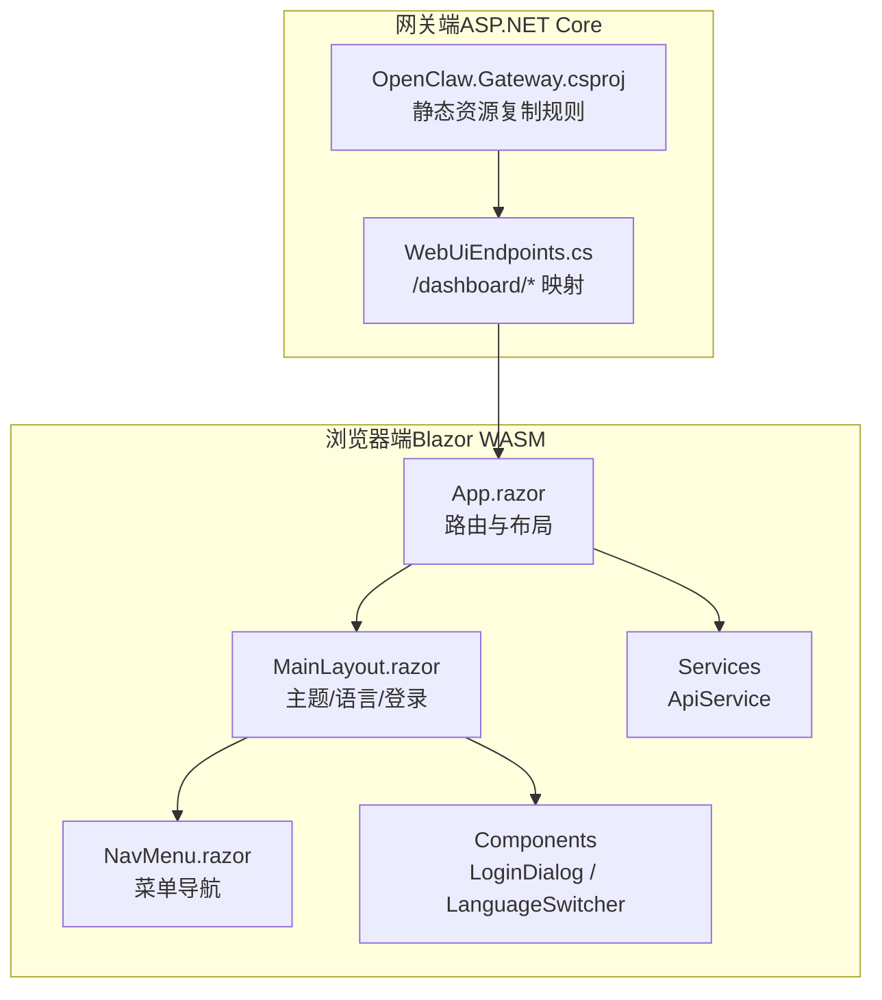
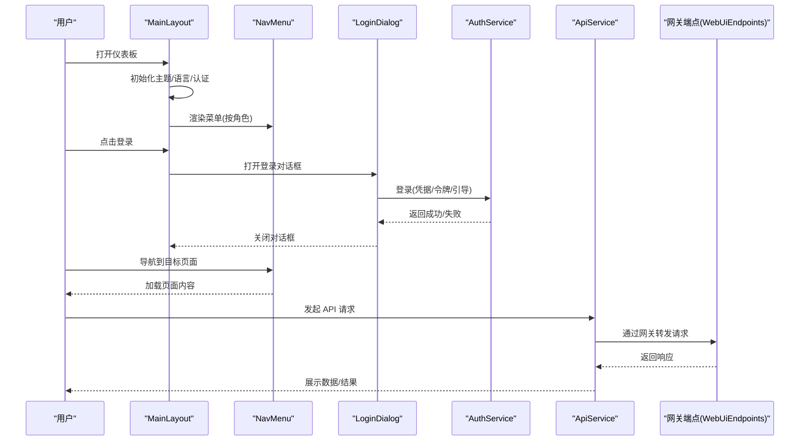
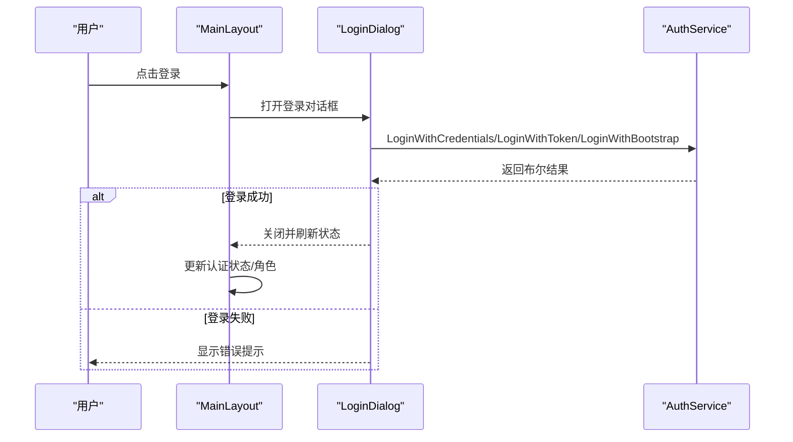
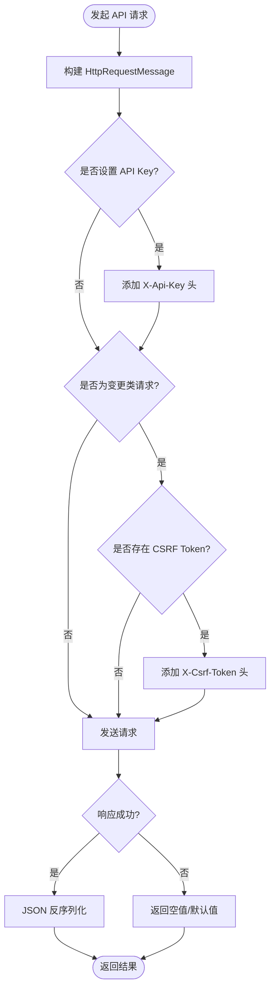
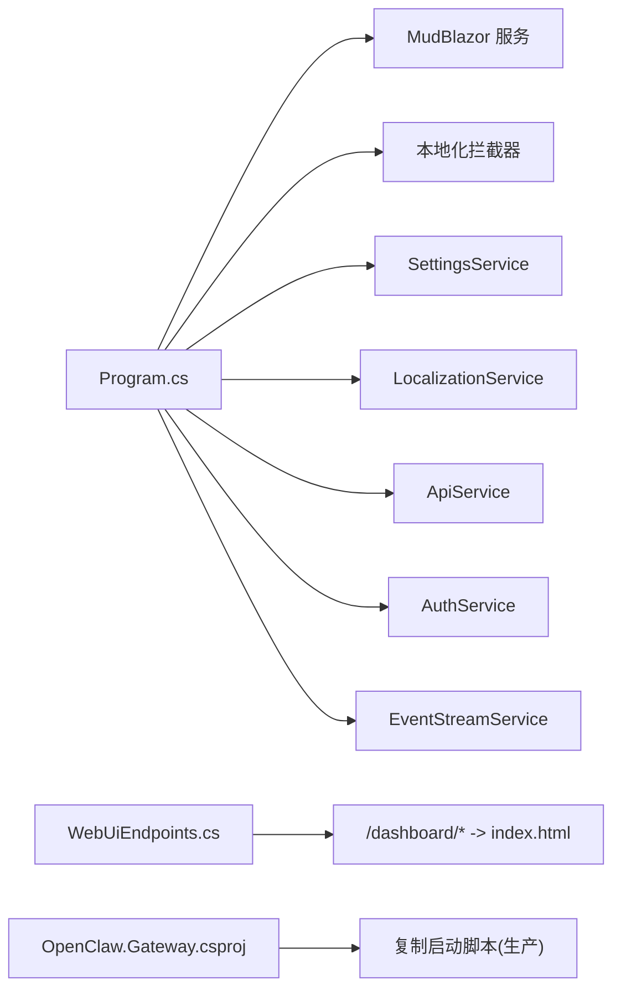

# 运营商仪表板

<cite>
**本文引用的文件**
- [OpenClaw.Dashboard.csproj](file://src/OpenClaw.Dashboard/OpenClaw.Dashboard.csproj)
- [Program.cs](file://src/OpenClaw.Dashboard/Program.cs)
- [_Imports.razor](file://src/OpenClaw.Dashboard/_Imports.razor)
- [App.razor](file://src/OpenClaw.Dashboard/App.razor)
- [MainLayout.razor](file://src/OpenClaw.Dashboard/Layout/MainLayout.razor)
- [NavMenu.razor](file://src/OpenClaw.Dashboard/Layout/NavMenu.razor)
- [LoginDialog.razor](file://src/OpenClaw.Dashboard/Components/LoginDialog.razor)
- [LanguageSwitcher.razor](file://src/OpenClaw.Dashboard/Components/LanguageSwitcher.razor)
- [ApiService.cs](file://src/OpenClaw.Dashboard/Services/ApiService.cs)
- [WebUiEndpoints.cs](file://src/OpenClaw.Gateway/Endpoints/WebUiEndpoints.cs)
- [OpenClaw.Gateway.csproj](file://src/OpenClaw.Gateway/OpenClaw.Gateway.csproj)
- [DashboardStaticAssetTests.cs](file://src/OpenClaw.Tests/DashboardStaticAssetTests.cs)
</cite>

## 目录
1. [简介](#简介)
2. [项目结构](#项目结构)
3. [核心组件](#核心组件)
4. [架构总览](#架构总览)
5. [详细组件分析](#详细组件分析)
6. [依赖关系分析](#依赖关系分析)
7. [性能考虑](#性能考虑)
8. [故障排除指南](#故障排除指南)
9. [结论](#结论)
10. [附录](#附录)

## 简介
本技术文档面向运营商仪表板（基于 Blazor WebAssembly 的浏览器端应用），系统性阐述其整体架构设计、页面布局与组件结构，并深入解析各功能页面（概览、治理、可观测性、迁移、集成、心跳、自动化配置、学习管理、内存、运维、会话、设置、技能成本、渠道、WhatsApp 等）的功能特性与使用方法。文档同时覆盖认证授权机制、API 服务集成、事件流处理以及国际化支持，并提供页面开发指南、组件复用模式与性能优化建议。

## 项目结构
仪表板采用 Blazor WebAssembly 技术栈，核心由以下层次构成：
- 应用入口与路由：Program.cs 注册服务与 HttpClient 基地址；App.razor 定义 Router 与 NotFound 处理。
- 布局与导航：MainLayout 提供主题、语言切换、登录/登出与侧边抽屉；NavMenu 根据角色动态渲染菜单项。
- 组件层：LoginDialog、LanguageSwitcher 等可复用 UI 组件。
- 服务层：ApiService 封装 HTTP 请求、CSRF 与 API Key 头部注入。
- 集成层：通过网关端点将静态资源映射到 /dashboard 路径，实现 SPA 路由回退至 index.html。

**图表来源**
- [App.razor:1-13](file://src/OpenClaw.Dashboard/App.razor#L1-L13)
- [MainLayout.razor:1-140](file://src/OpenClaw.Dashboard/Layout/MainLayout.razor#L1-L140)
- [NavMenu.razor:1-98](file://src/OpenClaw.Dashboard/Layout/NavMenu.razor#L1-L98)
- [LoginDialog.razor:1-113](file://src/OpenClaw.Dashboard/Components/LoginDialog.razor#L1-L113)
- [LanguageSwitcher.razor:1-50](file://src/OpenClaw.Dashboard/Components/LanguageSwitcher.razor#L1-L50)
- [ApiService.cs:1-146](file://src/OpenClaw.Dashboard/Services/ApiService.cs#L1-L146)
- [WebUiEndpoints.cs:57-80](file://src/OpenClaw.Gateway/Endpoints/WebUiEndpoints.cs#L57-L80)
- [OpenClaw.Gateway.csproj:106-142](file://src/OpenClaw.Gateway/OpenClaw.Gateway.csproj#L106-L142)

**章节来源**
- [OpenClaw.Dashboard.csproj:1-15](file://src/OpenClaw.Dashboard/OpenClaw.Dashboard.csproj#L1-L15)
- [Program.cs:1-32](file://src/OpenClaw.Dashboard/Program.cs#L1-L32)
- [_Imports.razor:1-15](file://src/OpenClaw.Dashboard/_Imports.razor#L1-L15)
- [App.razor:1-13](file://src/OpenClaw.Dashboard/App.razor#L1-L13)
- [MainLayout.razor:1-140](file://src/OpenClaw.Dashboard/Layout/MainLayout.razor#L1-L140)
- [NavMenu.razor:1-98](file://src/OpenClaw.Dashboard/Layout/NavMenu.razor#L1-L98)
- [LoginDialog.razor:1-113](file://src/OpenClaw.Dashboard/Components/LoginDialog.razor#L1-L113)
- [LanguageSwitcher.razor:1-50](file://src/OpenClaw.Dashboard/Components/LanguageSwitcher.razor#L1-L50)
- [ApiService.cs:1-146](file://src/OpenClaw.Dashboard/Services/ApiService.cs#L1-L146)
- [WebUiEndpoints.cs:57-80](file://src/OpenClaw.Gateway/Endpoints/WebUiEndpoints.cs#L57-L80)
- [OpenClaw.Gateway.csproj:106-142](file://src/OpenClaw.Gateway/OpenClaw.Gateway.csproj#L106-L142)

## 核心组件
- 应用入口与路由
  - Program.cs 注入 MudBlazor 服务、本地化拦截器、设置/本地化/API/认证/事件流服务，并配置 HttpClient BaseAddress。
  - App.razor 使用 Router + RouteView + LayoutView，定义 NotFound 页面。
- 布局与主题
  - MainLayout 提供深色/浅色主题、语言切换、登录状态显示与登出按钮；初始化时同步认证状态与语言。
  - NavMenu 根据用户角色显示不同菜单项，支持国际化文本。
- 认证与登录
  - LoginDialog 支持凭据、令牌与引导令牌三种登录方式，调用 AuthService 执行登录并返回结果。
- 国际化
  - LanguageSwitcher 切换 en-US 与 zh-CN，通过 LocalizationService 更新当前语言。
- API 服务
  - ApiService 统一封装 GET/POST/PUT/DELETE/RAW 请求，自动注入 API Key 与 CSRF Token，支持 JSON 序列化选项与绝对/相对路径规范化。

**章节来源**
- [Program.cs:1-32](file://src/OpenClaw.Dashboard/Program.cs#L1-L32)
- [App.razor:1-13](file://src/OpenClaw.Dashboard/App.razor#L1-L13)
- [MainLayout.razor:1-140](file://src/OpenClaw.Dashboard/Layout/MainLayout.razor#L1-L140)
- [NavMenu.razor:1-98](file://src/OpenClaw.Dashboard/Layout/NavMenu.razor#L1-L98)
- [LoginDialog.razor:1-113](file://src/OpenClaw.Dashboard/Components/LoginDialog.razor#L1-L113)
- [LanguageSwitcher.razor:1-50](file://src/OpenClaw.Dashboard/Components/LanguageSwitcher.razor#L1-L50)
- [ApiService.cs:1-146](file://src/OpenClaw.Dashboard/Services/ApiService.cs#L1-L146)

## 架构总览
仪表板以 Blazor WebAssembly 作为前端运行时，通过网关端点将静态资源暴露为 /dashboard/*，实现单页应用的客户端路由回退。认证状态与语言切换在布局层集中处理，业务页面通过服务层统一访问后端 API。

**图表来源**
- [MainLayout.razor:1-140](file://src/OpenClaw.Dashboard/Layout/MainLayout.razor#L1-L140)
- [NavMenu.razor:1-98](file://src/OpenClaw.Dashboard/Layout/NavMenu.razor#L1-L98)
- [LoginDialog.razor:1-113](file://src/OpenClaw.Dashboard/Components/LoginDialog.razor#L1-L113)
- [ApiService.cs:1-146](file://src/OpenClaw.Dashboard/Services/ApiService.cs#L1-L146)
- [WebUiEndpoints.cs:57-80](file://src/OpenClaw.Gateway/Endpoints/WebUiEndpoints.cs#L57-L80)

## 详细组件分析

### 认证与授权流程
- 登录对话框
  - 支持三种登录方式：用户名/密码、API 令牌、引导令牌。
  - 成功后关闭对话框并触发认证状态变更事件。
- 布局中的登录状态
  - 未登录显示“登录”按钮；已登录显示用户信息与角色、提供“登出”操作。
- 角色驱动的菜单
  - 不同角色显示不同菜单项，确保权限隔离。

**图表来源**
- [LoginDialog.razor:1-113](file://src/OpenClaw.Dashboard/Components/LoginDialog.razor#L1-L113)
- [MainLayout.razor:1-140](file://src/OpenClaw.Dashboard/Layout/MainLayout.razor#L1-L140)

**章节来源**
- [LoginDialog.razor:1-113](file://src/OpenClaw.Dashboard/Components/LoginDialog.razor#L1-L113)
- [MainLayout.razor:1-140](file://src/OpenClaw.Dashboard/Layout/MainLayout.razor#L1-L140)
- [NavMenu.razor:1-98](file://src/OpenClaw.Dashboard/Layout/NavMenu.razor#L1-L98)

### API 服务集成
- 功能特性
  - 统一设置 BaseUrl、API Key 与 CSRF Token。
  - 支持泛型 GET/POST/PUT/DELETE 与 RAW 请求。
  - 自动序列化/反序列化 JSON，忽略大小写属性名。
- 请求头策略
  - API Key 通过自定义头部注入。
  - 变更类请求（POST/PUT/DELETE/PATCH）在存在 CSRF Token 时附加 CSRF 头。
- URL 规范化
  - 自动处理绝对路径与相对路径，保证 API 调用一致性。

**图表来源**
- [ApiService.cs:1-146](file://src/OpenClaw.Dashboard/Services/ApiService.cs#L1-L146)

**章节来源**
- [ApiService.cs:1-146](file://src/OpenClaw.Dashboard/Services/ApiService.cs#L1-L146)

### 国际化支持
- 语言切换
  - LanguageSwitcher 提供中英文切换，更新当前语言并触发界面重绘。
- 本地化拦截器
  - 启动时注册自定义 ILocalizationInterceptor，确保键值回退到原始键，便于调试与扩展。
- 布局与菜单
  - 主题、语言与认证状态在 MainLayout 初始化时同步，NavMenu 根据语言与角色动态渲染。

**章节来源**
- [LanguageSwitcher.razor:1-50](file://src/OpenClaw.Dashboard/Components/LanguageSwitcher.razor#L1-L50)
- [Program.cs:1-32](file://src/OpenClaw.Dashboard/Program.cs#L1-L32)
- [MainLayout.razor:1-140](file://src/OpenClaw.Dashboard/Layout/MainLayout.razor#L1-L140)
- [NavMenu.razor:1-98](file://src/OpenClaw.Dashboard/Layout/NavMenu.razor#L1-L98)

### 事件流处理
- 事件订阅
  - MainLayout 订阅 LocalizationService.OnLanguageChanged 与 AuthService.OnAuthStateChanged，在事件发生时触发 UI 刷新。
- 生命周期管理
  - 在 OnInitializedAsync 中完成初始化，并在 Dispose 中解绑事件，避免内存泄漏。

**章节来源**
- [MainLayout.razor:1-140](file://src/OpenClaw.Dashboard/Layout/MainLayout.razor#L1-L140)

### 功能页面概览与使用方法
以下为各功能页面的职责与使用要点（基于菜单与角色控制）：

- 概览（Overview）
  - 全局运营视图，汇总关键指标与状态。
- 治理（Governance）
  - 面向管理员的治理与合规相关页面。
- 可观测性（Observability）
  - 运行时指标、日志与事件可视化。
- 迁移（Migration）
  - 系统迁移与升级相关页面。
- 集成（Integration）
  - 第三方系统对接与集成配置。
- 心跳（Heartbeat）
  - 面向运营人员的心跳监控与告警。
- 自动化配置（Automation）
  - 自动化任务与规则配置。
- 学习管理（Learning）
  - 学习提案、反馈与知识沉淀。
- 内存（Memory）
  - 记忆存储与检索相关页面。
- 运维（Ops）
  - 日常运维操作与工单。
- 会话（Sessions）
  - 用户会话列表与详情。
- 设置（Settings）
  - 系统级配置与参数调整。
- 技能成本（Skills Cost）
  - 技能执行成本统计与分析。
- 渠道（Channels）
  - 多渠道接入与配置（如 WhatsApp、Teams、Slack 等）。
- WhatsApp
  - WhatsApp 渠道专用配置与管理。

注：以上页面名称来源于菜单项与角色权限映射，具体实现由各页面组件负责。

**章节来源**
- [NavMenu.razor:1-98](file://src/OpenClaw.Dashboard/Layout/NavMenu.razor#L1-L98)

## 依赖关系分析
- 前端依赖
  - Blazor WebAssembly、MudBlazor UI 框架、SignalR 客户端。
  - 服务注册集中在 Program.cs，包括设置、本地化、API、认证、事件流等。
- 网关集成
  - WebUiEndpoints 将 /dashboard/* 路径映射到静态 index.html，避免浏览器返回 404 导致的解析错误。
  - OpenClaw.Gateway.csproj 在构建阶段复制非指纹化的启动脚本，确保生产环境静态文件引用正确。

**图表来源**
- [Program.cs:1-32](file://src/OpenClaw.Dashboard/Program.cs#L1-L32)
- [WebUiEndpoints.cs:57-80](file://src/OpenClaw.Gateway/Endpoints/WebUiEndpoints.cs#L57-L80)
- [OpenClaw.Gateway.csproj:106-142](file://src/OpenClaw.Gateway/OpenClaw.Gateway.csproj#L106-L142)

**章节来源**
- [OpenClaw.Dashboard.csproj:1-15](file://src/OpenClaw.Dashboard/OpenClaw.Dashboard.csproj#L1-L15)
- [Program.cs:1-32](file://src/OpenClaw.Dashboard/Program.cs#L1-L32)
- [WebUiEndpoints.cs:57-80](file://src/OpenClaw.Gateway/Endpoints/WebUiEndpoints.cs#L57-L80)
- [OpenClaw.Gateway.csproj:106-142](file://src/OpenClaw.Gateway/OpenClaw.Gateway.csproj#L106-L142)

## 性能考虑
- 构建与裁剪
  - 仪表板项目启用部分裁剪（TrimMode=partial），避免过度裁剪导致的运行时问题。
  - 全球化设置为 false，支持多语言但不使用 invariant globalization。
- 静态资源与路由
  - 网关端复制非指纹化启动脚本，确保生产环境静态资源引用稳定。
- UI 与交互
  - 使用 MudBlazor 组件库，合理使用懒加载与虚拟化（如适用）减少首屏渲染压力。
- 网络请求
  - ApiService 统一处理请求头与 JSON 序列化，避免重复逻辑与潜在错误。
- 事件订阅
  - 在布局组件中及时解绑事件，防止内存泄漏与不必要的重绘。

**章节来源**
- [OpenClaw.Dashboard.csproj:1-15](file://src/OpenClaw.Dashboard/OpenClaw.Dashboard.csproj#L1-L15)
- [DashboardStaticAssetTests.cs:1-43](file://src/OpenClaw.Tests/DashboardStaticAssetTests.cs#L1-L43)
- [OpenClaw.Gateway.csproj:106-142](file://src/OpenClaw.Gateway/OpenClaw.Gateway.csproj#L106-L142)
- [MainLayout.razor:1-140](file://src/OpenClaw.Dashboard/Layout/MainLayout.razor#L1-L140)

## 故障排除指南
- 登录失败
  - 检查 LoginDialog 的三种登录方式输入是否正确；查看错误提示与网络面板响应。
- 404 或路由异常
  - 确认 /dashboard/* 是否被网关端点正确映射到 index.html；检查静态资源路径与启动脚本复制。
- 语言切换无效
  - 确认 LanguageSwitcher 已正确设置语言并触发 OnLanguageChanged；检查本地化拦截器配置。
- API 请求失败
  - 检查 ApiService 的 BaseUrl、API Key 与 CSRF Token 设置；确认请求头是否正确附加。
- 生产环境启动脚本缺失
  - 确认 OpenClaw.Gateway.csproj 的构建目标已复制 blazor.webassembly.js 与 dotnet.js 至非指纹化路径。

**章节来源**
- [LoginDialog.razor:1-113](file://src/OpenClaw.Dashboard/Components/LoginDialog.razor#L1-L113)
- [WebUiEndpoints.cs:57-80](file://src/OpenClaw.Gateway/Endpoints/WebUiEndpoints.cs#L57-L80)
- [LanguageSwitcher.razor:1-50](file://src/OpenClaw.Dashboard/Components/LanguageSwitcher.razor#L1-L50)
- [ApiService.cs:1-146](file://src/OpenClaw.Dashboard/Services/ApiService.cs#L1-L146)
- [OpenClaw.Gateway.csproj:106-142](file://src/OpenClaw.Gateway/OpenClaw.Gateway.csproj#L106-L142)

## 结论
运营商仪表板以 Blazor WebAssembly 为基础，结合 MudBlazor UI 框架与网关端点映射，实现了现代化的浏览器端运营平台。通过集中式布局与服务层封装，系统在认证授权、国际化、API 集成与事件处理方面具备良好的可维护性与扩展性。建议在后续迭代中持续完善各功能页面的具体实现细节，并加强测试与性能监控。

## 附录

### 页面开发指南
- 组件复用
  - 优先使用 MudBlazor 组件与现有服务（ApiService、AuthService、LocalizationService）。
  - 将通用逻辑抽象为可复用组件（如提示、对话框、表单片段）。
- 路由与导航
  - 在 NavMenu 中按角色注册新页面；确保路由与布局一致。
- 国际化
  - 所有文案使用 LocalizationService 获取；新增键值并在多语言资源中补充。
- 认证与权限
  - 在页面初始化时检查认证状态；对敏感操作进行角色校验。

### 组件复用模式
- 对话框模式：通过 IDialogService 弹出 LoginDialog 等，等待结果后再更新状态。
- 事件订阅模式：在 OnInitializedAsync 中订阅事件，在 Dispose 中解绑。
- 服务封装模式：ApiService 统一处理请求头、序列化与错误返回。

### 性能优化建议
- 构建配置：保持 TrimMode=partial 与 InvariantGlobalization=false 的平衡。
- 资源加载：确保静态资源路径稳定，避免二次请求与缓存失效。
- UI 渲染：减少不必要的 StateHasChanged 调用，使用懒加载与分页。
- 网络优化：合并请求、使用缓存策略与合理的超时重试。