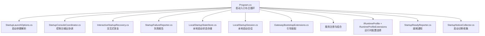
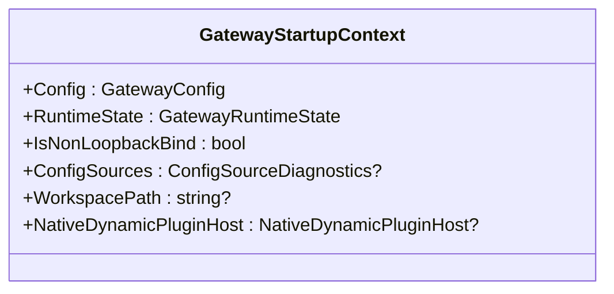
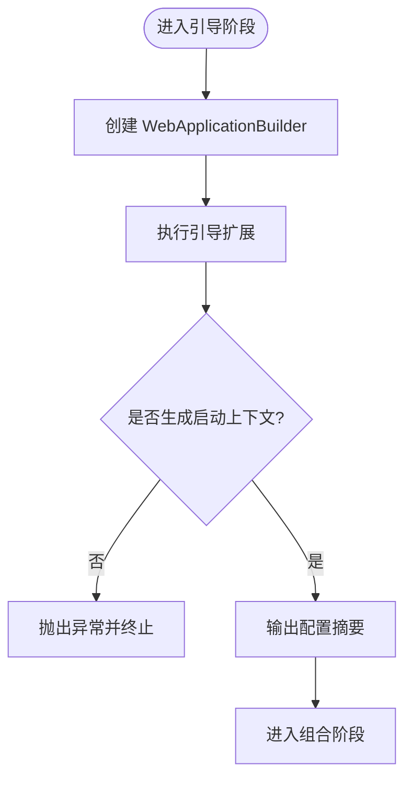
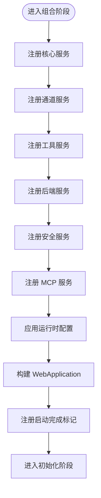
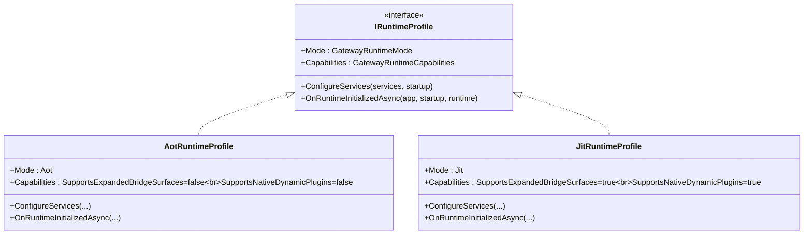
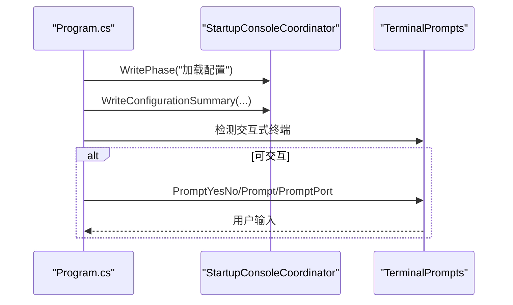
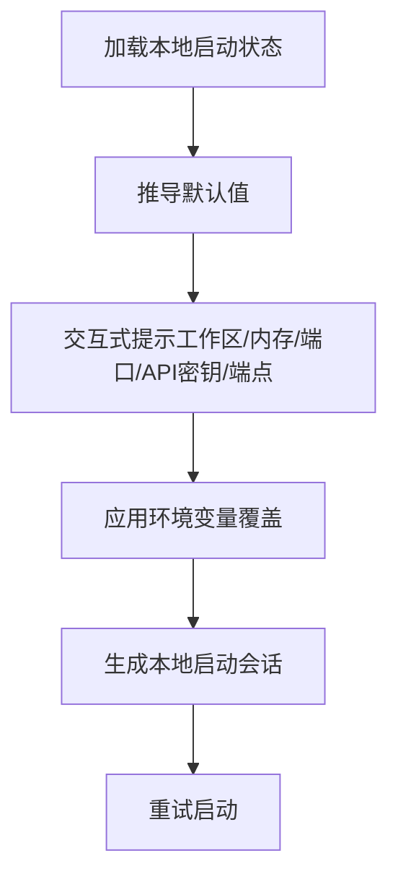
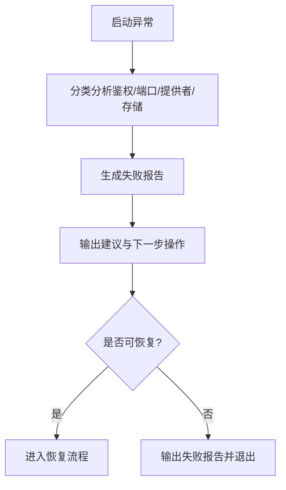
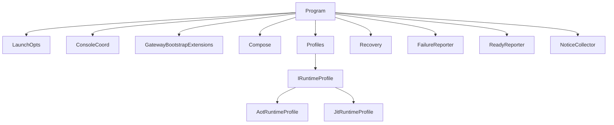

# 启动架构

<cite>
**本文引用的文件**
- [Program.cs](file://src/OpenClaw.Gateway/Program.cs)
- [GatewayStartupContext.cs](file://src/OpenClaw.Gateway/Bootstrap/GatewayStartupContext.cs)
- [StartupConsoleCoordinator.cs](file://src/OpenClaw.Gateway/Bootstrap/StartupConsoleCoordinator.cs)
- [InteractiveStartupRecovery.cs](file://src/OpenClaw.Gateway/Bootstrap/InteractiveStartupRecovery.cs)
- [StartupFailureReporter.cs](file://src/OpenClaw.Gateway/Bootstrap/StartupFailureReporter.cs)
- [StartupLaunchOptions.cs](file://src/OpenClaw.Gateway/Bootstrap/StartupLaunchOptions.cs)
- [LocalStartupStateStore.cs](file://src/OpenClaw.Gateway/Bootstrap/LocalStartupStateStore.cs)
- [LocalStartupSession.cs](file://src/OpenClaw.Gateway/Bootstrap/LocalStartupSession.cs)
- [IRuntimeProfile.cs](file://src/OpenClaw.Gateway/Profiles/IRuntimeProfile.cs)
- [RuntimeProfileExtensions.cs](file://src/OpenClaw.Gateway/Profiles/RuntimeProfileExtensions.cs)
- [AotRuntimeProfile.cs](file://src/OpenClaw.Gateway/Profiles/AotRuntimeProfile.cs)
- [JitRuntimeProfile.cs](file://src/OpenClaw.Gateway/Profiles/JitRuntimeProfile.cs)
- [StartupReadyReporter.cs](file://src/OpenClaw.Gateway/Pipeline/StartupReadyReporter.cs)
- [StartupNoticeCollector.cs](file://src/OpenClaw.Gateway/Pipeline/StartupNoticeCollector.cs)
- [GatewayBootstrapExtensions.cs](file://src/OpenClaw.Gateway/Bootstrap/GatewayBootstrapExtensions.cs)
- [GatewayStartupExtensions.cs](file://src/OpenClaw.Gateway/Bootstrap/GatewayStartupExtensions.cs)
- [GatewayRuntimeState.cs](file://src/OpenClaw.Core/Models/RuntimeModels.cs)
- [GatewayConfig.cs](file://src/OpenClaw.Core/Models/GatewayConfig.cs)
- [BindAddressClassifier.cs](file://src/OpenClaw.Core/Security/BindAddressClassifier.cs)
- [TerminalPrompts.cs](file://src/OpenClaw.Gateway/Bootstrap/TerminalPrompts.cs)
</cite>

## 目录
1. [引言](#引言)
2. [项目结构](#项目结构)
3. [核心组件](#核心组件)
4. [架构总览](#架构总览)
5. [详细组件分析](#详细组件分析)
6. [依赖关系分析](#依赖关系分析)
7. [性能考量](#性能考量)
8. [故障排查指南](#故障排查指南)
9. [结论](#结论)
10. [附录](#附录)

## 引言
本文件系统性阐述 OpenClaw.NET 网关的启动架构，聚焦三阶段启动流程：Bootstrap（引导）、Composition（组合）、Profiles（运行时配置）。重点解析 GatewayStartupContext 的职责与关键属性（Config、RuntimeState、IsNonLoopbackBind 等），并覆盖启动失败恢复机制、控制台协调器与终端提示系统、本地启动状态管理、启动诊断与恢复流程、启动顺序、错误处理策略以及性能优化建议。

## 项目结构
OpenClaw.Gateway 的启动入口位于 Program.cs，采用“循环+异常恢复”的主控流程，结合启动选项解析、引导阶段装配、组合阶段服务注册、运行时配置选择、初始化与监听等步骤。启动过程中的诊断、提示与恢复由多个协作组件完成。



图表来源
- [Program.cs:1-124](file://src/OpenClaw.Gateway/Program.cs#L1-L124)
- [StartupLaunchOptions.cs:1-122](file://src/OpenClaw.Gateway/Bootstrap/StartupLaunchOptions.cs#L1-L122)
- [StartupConsoleCoordinator.cs:1-53](file://src/OpenClaw.Gateway/Bootstrap/StartupConsoleCoordinator.cs#L1-L53)
- [InteractiveStartupRecovery.cs:1-336](file://src/OpenClaw.Gateway/Bootstrap/InteractiveStartupRecovery.cs#L1-L336)
- [StartupFailureReporter.cs:1-332](file://src/OpenClaw.Gateway/Bootstrap/StartupFailureReporter.cs#L1-L332)
- [LocalStartupStateStore.cs:1-27](file://src/OpenClaw.Gateway/Bootstrap/LocalStartupStateStore.cs#L1-L27)
- [LocalStartupSession.cs:1-12](file://src/OpenClaw.Gateway/Bootstrap/LocalStartupSession.cs#L1-L12)
- [IRuntimeProfile.cs:1-18](file://src/OpenClaw.Gateway/Profiles/IRuntimeProfile.cs#L1-L18)
- [RuntimeProfileExtensions.cs:1-22](file://src/OpenClaw.Gateway/Profiles/RuntimeProfileExtensions.cs#L1-L22)
- [StartupReadyReporter.cs](file://src/OpenClaw.Gateway/Pipeline/StartupReadyReporter.cs)
- [StartupNoticeCollector.cs](file://src/OpenClaw.Gateway/Pipeline/StartupNoticeCollector.cs)
- [GatewayBootstrapExtensions.cs](file://src/OpenClaw.Gateway/Bootstrap/GatewayBootstrapExtensions.cs)

章节来源
- [Program.cs:1-124](file://src/OpenClaw.Gateway/Program.cs#L1-L124)

## 核心组件
- GatewayStartupContext：启动上下文，承载配置、运行时状态、绑定地址类型判断、配置源诊断、工作区路径、原生动态插件宿主等关键信息。
- StartupConsoleCoordinator：统一控制台输出，提供阶段提示与配置摘要渲染。
- InteractiveStartupRecovery：交互式启动恢复，支持 Quickstart 与普通恢复，生成本地启动会话并应用环境变量覆盖。
- StartupFailureReporter：对启动失败进行分类分析，生成可读的诊断报告与修复建议。
- StartupLaunchOptions：解析命令行参数，决定医生模式、健康检查、快速启动、是否可交互等行为。
- LocalStartupStateStore/LocalStartupSession：持久化本地启动状态，记录上次启动的偏好设置；会话用于本次进程的临时覆盖。
- IRuntimeProfile/RuntimeProfileExtensions：根据运行时模式（AOT/JIT）选择不同的能力集与服务配置钩子。
- StartupReadyReporter/StartupNoticeCollector：在启动完成后输出就绪信息与收集诊断事件。

章节来源
- [GatewayStartupContext.cs:1-15](file://src/OpenClaw.Gateway/Bootstrap/GatewayStartupContext.cs#L1-L15)
- [StartupConsoleCoordinator.cs:1-53](file://src/OpenClaw.Gateway/Bootstrap/StartupConsoleCoordinator.cs#L1-L53)
- [InteractiveStartupRecovery.cs:1-336](file://src/OpenClaw.Gateway/Bootstrap/InteractiveStartupRecovery.cs#L1-L336)
- [StartupFailureReporter.cs:1-332](file://src/OpenClaw.Gateway/Bootstrap/StartupFailureReporter.cs#L1-L332)
- [StartupLaunchOptions.cs:1-122](file://src/OpenClaw.Gateway/Bootstrap/StartupLaunchOptions.cs#L1-L122)
- [LocalStartupStateStore.cs:1-27](file://src/OpenClaw.Gateway/Bootstrap/LocalStartupStateStore.cs#L1-L27)
- [LocalStartupSession.cs:1-12](file://src/OpenClaw.Gateway/Bootstrap/LocalStartupSession.cs#L1-L12)
- [IRuntimeProfile.cs:1-18](file://src/OpenClaw.Gateway/Profiles/IRuntimeProfile.cs#L1-L18)
- [RuntimeProfileExtensions.cs:1-22](file://src/OpenClaw.Gateway/Profiles/RuntimeProfileExtensions.cs#L1-L22)
- [StartupReadyReporter.cs](file://src/OpenClaw.Gateway/Pipeline/StartupReadyReporter.cs)
- [StartupNoticeCollector.cs](file://src/OpenClaw.Gateway/Pipeline/StartupNoticeCollector.cs)

## 架构总览
下图展示从入口到监听的完整启动序列，包括三阶段与恢复流程的关键节点。

```mermaid
sequenceDiagram
participant CLI as "命令行"
participant Program as "Program.cs"
participant Console as "StartupConsoleCoordinator"
participant Boot as "GatewayBootstrapExtensions"
participant Compose as "服务注册"
participant Prof as "IRuntimeProfile"
participant Ready as "StartupReadyReporter"
participant Notice as "StartupNoticeCollector"
participant Recovery as "InteractiveStartupRecovery"
participant FailRep as "StartupFailureReporter"
CLI->>Program : 解析启动参数
Program->>Console : 输出阶段提示
Program->>Boot : 执行引导阶段
Boot-->>Program : 返回启动上下文
Program->>Console : 输出配置摘要
Program->>Compose : 注册核心服务
Program->>Prof : 应用运行时配置
Program->>Program : 初始化运行时
Program->>Ready : 发布就绪事件
Program->>Notice : 收集诊断事件
Program->>Program : 映射端点与中间件
Program->>Program : 启动监听
Note over Program : 启动成功
rect rgb(255,255,255)
Program->>Recovery : 捕获异常且未启动完成
Recovery-->>Program : 可恢复则返回会话
Program->>Program : 继续循环重启
alt 不可恢复
Program->>FailRep : 写入失败报告
Program->>CLI : 退出码=1
end
```

图表来源
- [Program.cs:1-124](file://src/OpenClaw.Gateway/Program.cs#L1-L124)
- [StartupConsoleCoordinator.cs:1-53](file://src/OpenClaw.Gateway/Bootstrap/StartupConsoleCoordinator.cs#L1-L53)
- [InteractiveStartupRecovery.cs:1-336](file://src/OpenClaw.Gateway/Bootstrap/InteractiveStartupRecovery.cs#L1-L336)
- [StartupFailureReporter.cs:1-332](file://src/OpenClaw.Gateway/Bootstrap/StartupFailureReporter.cs#L1-L332)
- [StartupReadyReporter.cs](file://src/OpenClaw.Gateway/Pipeline/StartupReadyReporter.cs)
- [StartupNoticeCollector.cs](file://src/OpenClaw.Gateway/Pipeline/StartupNoticeCollector.cs)

## 详细组件分析

### GatewayStartupContext 详解
GatewayStartupContext 是启动阶段的核心数据载体，贯穿引导、组合与运行时配置阶段。其关键属性包括：
- Config：网关配置对象，包含绑定地址、端口、内存与模型提供者等。
- RuntimeState：运行时状态，包含请求模式、有效模式与动态代码支持能力等。
- IsNonLoopbackBind：基于绑定地址判断是否为非回环绑定，影响鉴权令牌要求。
- ConfigSources：配置源诊断信息，用于输出配置来源与最终生效项。
- WorkspacePath：工作区路径，可能来自本地启动会话或外部配置。
- NativeDynamicPluginHost：原生动态插件宿主，供运行时使用。



图表来源
- [GatewayStartupContext.cs:1-15](file://src/OpenClaw.Gateway/Bootstrap/GatewayStartupContext.cs#L1-L15)

章节来源
- [GatewayStartupContext.cs:1-15](file://src/OpenClaw.Gateway/Bootstrap/GatewayStartupContext.cs#L1-L15)
- [GatewayRuntimeState.cs](file://src/OpenClaw.Core/Models/RuntimeModels.cs)
- [GatewayConfig.cs](file://src/OpenClaw.Core/Models/GatewayConfig.cs)
- [BindAddressClassifier.cs](file://src/OpenClaw.Core/Security/BindAddressClassifier.cs)

### 启动三阶段与控制流

#### Bootstrap（引导阶段）
- 负责创建 WebApplicationBuilder、加载配置、执行引导扩展以构建启动上下文。
- 输出阶段提示与配置摘要，便于用户理解生效配置。
- 异常早期抛出，交由恢复流程处理。



图表来源
- [Program.cs:47-63](file://src/OpenClaw.Gateway/Program.cs#L47-L63)
- [StartupConsoleCoordinator.cs:15-37](file://src/OpenClaw.Gateway/Bootstrap/StartupConsoleCoordinator.cs#L15-L37)

章节来源
- [Program.cs:47-63](file://src/OpenClaw.Gateway/Program.cs#L47-L63)
- [StartupConsoleCoordinator.cs:15-37](file://src/OpenClaw.Gateway/Bootstrap/StartupConsoleCoordinator.cs#L15-L37)

#### Composition（组合阶段）
- 注册核心服务：OpenClaw 核心、通道、工具、后端、安全、MCP、A2A 等。
- 应用运行时配置：通过运行时配置扩展选择 AOT/JIT 配置。
- 构建应用实例，注册 ApplicationStarted 标记，为后续初始化做准备。



图表来源
- [Program.cs:67-81](file://src/OpenClaw.Gateway/Program.cs#L67-L81)
- [RuntimeProfileExtensions.cs:8-21](file://src/OpenClaw.Gateway/Profiles/RuntimeProfileExtensions.cs#L8-L21)

章节来源
- [Program.cs:67-81](file://src/OpenClaw.Gateway/Program.cs#L67-L81)
- [RuntimeProfileExtensions.cs:8-21](file://src/OpenClaw.Gateway/Profiles/RuntimeProfileExtensions.cs#L8-L21)

#### Profiles（运行时配置）
- 基于 RuntimeState.EffectiveMode 选择 AOT 或 JIT 运行时配置。
- 提供能力集（如是否支持扩展桥接面、原生动态插件）与服务注册钩子。
- 在运行时初始化完成后触发回调，允许按模式进行额外初始化。



图表来源
- [IRuntimeProfile.cs:1-18](file://src/OpenClaw.Gateway/Profiles/IRuntimeProfile.cs#L1-L18)
- [AotRuntimeProfile.cs:1-21](file://src/OpenClaw.Gateway/Profiles/AotRuntimeProfile.cs#L1-L21)
- [JitRuntimeProfile.cs:1-21](file://src/OpenClaw.Gateway/Profiles/JitRuntimeProfile.cs#L1-L21)

章节来源
- [IRuntimeProfile.cs:1-18](file://src/OpenClaw.Gateway/Profiles/IRuntimeProfile.cs#L1-L18)
- [AotRuntimeProfile.cs:1-21](file://src/OpenClaw.Gateway/Profiles/AotRuntimeProfile.cs#L1-L21)
- [JitRuntimeProfile.cs:1-21](file://src/OpenClaw.Gateway/Profiles/JitRuntimeProfile.cs#L1-L21)

### 控制台协调器与终端提示系统
- StartupConsoleCoordinator：统一输出启动阶段与配置摘要，帮助用户理解当前配置来源与生效项。
- TerminalPrompts：检测交互式终端并提供确认、输入、端口选择等提示，驱动恢复流程。



图表来源
- [StartupConsoleCoordinator.cs:8-37](file://src/OpenClaw.Gateway/Bootstrap/StartupConsoleCoordinator.cs#L8-L37)
- [TerminalPrompts.cs](file://src/OpenClaw.Gateway/Bootstrap/TerminalPrompts.cs)

章节来源
- [StartupConsoleCoordinator.cs:8-37](file://src/OpenClaw.Gateway/Bootstrap/StartupConsoleCoordinator.cs#L8-L37)
- [TerminalPrompts.cs](file://src/OpenClaw.Gateway/Bootstrap/TerminalPrompts.cs)

### 本地启动状态管理与启动恢复
- LocalStartupStateStore：原子化读写本地启动状态文件，记录上次启动的偏好（工作区、内存路径、提供者、模型、端口等）。
- LocalStartupSession：本次进程的临时覆盖，仅在当前启动有效。
- InteractiveStartupRecovery：根据异常类型与上下文，生成 Quickstart 或普通恢复会话，设置必要的环境变量覆盖，实现最小化本地启动。



图表来源
- [LocalStartupStateStore.cs:16-25](file://src/OpenClaw.Gateway/Bootstrap/LocalStartupStateStore.cs#L16-L25)
- [LocalStartupSession.cs:1-12](file://src/OpenClaw.Gateway/Bootstrap/LocalStartupSession.cs#L1-L12)
- [InteractiveStartupRecovery.cs:17-70](file://src/OpenClaw.Gateway/Bootstrap/InteractiveStartupRecovery.cs#L17-L70)
- [InteractiveStartupRecovery.cs:72-150](file://src/OpenClaw.Gateway/Bootstrap/InteractiveStartupRecovery.cs#L72-L150)

章节来源
- [LocalStartupStateStore.cs:16-25](file://src/OpenClaw.Gateway/Bootstrap/LocalStartupStateStore.cs#L16-L25)
- [LocalStartupSession.cs:1-12](file://src/OpenClaw.Gateway/Bootstrap/LocalStartupSession.cs#L1-L12)
- [InteractiveStartupRecovery.cs:17-70](file://src/OpenClaw.Gateway/Bootstrap/InteractiveStartupRecovery.cs#L17-L70)
- [InteractiveStartupRecovery.cs:72-150](file://src/OpenClaw.Gateway/Bootstrap/InteractiveStartupRecovery.cs#L72-L150)

### 启动失败恢复机制与诊断
- StartupFailureReporter：对常见问题（鉴权令牌缺失、端口占用、模型提供者配置错误、存储不可写）进行分类分析，输出标题、摘要、详情与修复建议。
- Program 中的异常捕获：在应用未标记启动完成前捕获异常，调用恢复流程；若不可恢复，则输出失败报告并退出。



图表来源
- [StartupFailureReporter.cs:52-80](file://src/OpenClaw.Gateway/Bootstrap/StartupFailureReporter.cs#L52-L80)
- [StartupFailureReporter.cs:82-233](file://src/OpenClaw.Gateway/Bootstrap/StartupFailureReporter.cs#L82-L233)
- [Program.cs:99-122](file://src/OpenClaw.Gateway/Program.cs#L99-L122)

章节来源
- [StartupFailureReporter.cs:52-80](file://src/OpenClaw.Gateway/Bootstrap/StartupFailureReporter.cs#L52-L80)
- [StartupFailureReporter.cs:82-233](file://src/OpenClaw.Gateway/Bootstrap/StartupFailureReporter.cs#L82-L233)
- [Program.cs:99-122](file://src/OpenClaw.Gateway/Program.cs#L99-L122)

### 启动顺序、错误处理策略与性能优化
- 启动顺序：解析启动选项 → 引导阶段 → 输出配置摘要 → 组合阶段 → 应用运行时配置 → 初始化运行时 → 注册中间件与端点 → 启动监听。
- 错误处理策略：仅在未标记启动完成前捕获异常，避免重复恢复；对可恢复异常进行交互式恢复；对不可恢复异常输出诊断并退出。
- 性能优化建议：
  - 使用 WebApplication.CreateSlimBuilder 降低启动开销。
  - 将一次性初始化逻辑放在运行时初始化回调中，避免在组合阶段阻塞。
  - 仅在必要时启用可选功能（如 OpenSandbox），减少服务注册与初始化成本。
  - 合理设置日志级别与可观测性组件，避免在启动路径上引入过多 IO。

章节来源
- [Program.cs:14-124](file://src/OpenClaw.Gateway/Program.cs#L14-L124)
- [StartupLaunchOptions.cs:57-71](file://src/OpenClaw.Gateway/Bootstrap/StartupLaunchOptions.cs#L57-L71)
- [OptionalFeatureSupport.cs](file://src/OpenClaw.Gateway/Bootstrap/OptionalFeatureSupport.cs)

## 依赖关系分析
- Program 依赖启动选项、控制台协调器、引导扩展、组合服务、运行时配置、恢复与失败报告组件。
- 运行时配置通过扩展方法根据 RuntimeState.EffectiveMode 选择具体实现。
- 诊断与就绪通知在 Pipeline 层提供，贯穿启动生命周期。



图表来源
- [Program.cs:1-124](file://src/OpenClaw.Gateway/Program.cs#L1-L124)
- [RuntimeProfileExtensions.cs:8-21](file://src/OpenClaw.Gateway/Profiles/RuntimeProfileExtensions.cs#L8-L21)
- [IRuntimeProfile.cs:11-17](file://src/OpenClaw.Gateway/Profiles/IRuntimeProfile.cs#L11-L17)
- [AotRuntimeProfile.cs:7-21](file://src/OpenClaw.Gateway/Profiles/AotRuntimeProfile.cs#L7-L21)
- [JitRuntimeProfile.cs:7-21](file://src/OpenClaw.Gateway/Profiles/JitRuntimeProfile.cs#L7-L21)
- [StartupReadyReporter.cs](file://src/OpenClaw.Gateway/Pipeline/StartupReadyReporter.cs)
- [StartupNoticeCollector.cs](file://src/OpenClaw.Gateway/Pipeline/StartupNoticeCollector.cs)

章节来源
- [Program.cs:1-124](file://src/OpenClaw.Gateway/Program.cs#L1-L124)
- [RuntimeProfileExtensions.cs:8-21](file://src/OpenClaw.Gateway/Profiles/RuntimeProfileExtensions.cs#L8-L21)
- [IRuntimeProfile.cs:11-17](file://src/OpenClaw.Gateway/Profiles/IRuntimeProfile.cs#L11-L17)
- [AotRuntimeProfile.cs:7-21](file://src/OpenClaw.Gateway/Profiles/AotRuntimeProfile.cs#L7-L21)
- [JitRuntimeProfile.cs:7-21](file://src/OpenClaw.Gateway/Profiles/JitRuntimeProfile.cs#L7-L21)
- [StartupReadyReporter.cs](file://src/OpenClaw.Gateway/Pipeline/StartupReadyReporter.cs)
- [StartupNoticeCollector.cs](file://src/OpenClaw.Gateway/Pipeline/StartupNoticeCollector.cs)

## 性能考量
- 启动阶段尽量减少磁盘 IO 与网络探测，将昂贵初始化延迟至运行时初始化回调。
- 合理使用服务注册的条件开关，避免在非目标模式下加载不必要服务。
- 控制台输出与诊断渲染应保持轻量，避免在生产环境引入过多日志开销。
- 对于可选集成（如 OpenSandbox），在编译期通过宏定义控制启用，减少运行时分支判断。

## 故障排查指南
- 非回环绑定需鉴权令牌：当绑定地址非回环时，必须设置鉴权令牌；可通过切换绑定地址或设置令牌解决。
- 端口占用：Kestrel 绑定失败时，更换端口或停止占用进程。
- 模型提供者配置错误：检查提供者名称、模型名、API 密钥与端点配置；必要时使用快速启动或交互式恢复。
- 存储不可写：确保内存存储根目录、SQLite 数据库路径与归档路径存在且可写。
- 医生模式与健康检查：使用相应标志进行预检，定位配置与环境问题。

章节来源
- [StartupFailureReporter.cs:82-233](file://src/OpenClaw.Gateway/Bootstrap/StartupFailureReporter.cs#L82-L233)
- [StartupLaunchOptions.cs:73-88](file://src/OpenClaw.Gateway/Bootstrap/StartupLaunchOptions.cs#L73-L88)

## 结论
OpenClaw.NET 的启动架构通过“引导—组合—运行时配置”三阶段清晰分离关注点，配合交互式恢复与诊断报告，显著提升了本地开发体验与启动成功率。GatewayStartupContext 作为跨阶段的数据枢纽，承载了配置、运行时状态与环境判断等关键信息。通过合理的错误处理策略与性能优化实践，可在保证稳定性的同时提升启动效率。

## 附录
- 关键启动流程参考路径
  - 入口与主循环：[Program.cs:14-124](file://src/OpenClaw.Gateway/Program.cs#L14-L124)
  - 启动选项解析：[StartupLaunchOptions.cs:57-71](file://src/OpenClaw.Gateway/Bootstrap/StartupLaunchOptions.cs#L57-L71)
  - 引导阶段与组合阶段：[Program.cs:53-96](file://src/OpenClaw.Gateway/Program.cs#L53-L96)
  - 运行时配置选择：[RuntimeProfileExtensions.cs:8-21](file://src/OpenClaw.Gateway/Profiles/RuntimeProfileExtensions.cs#L8-L21)
  - 失败恢复与报告：[InteractiveStartupRecovery.cs:72-150](file://src/OpenClaw.Gateway/Bootstrap/InteractiveStartupRecovery.cs#L72-L150)、[StartupFailureReporter.cs:52-80](file://src/OpenClaw.Gateway/Bootstrap/StartupFailureReporter.cs#L52-L80)
  - 诊断与就绪通知：[StartupReadyReporter.cs](file://src/OpenClaw.Gateway/Pipeline/StartupReadyReporter.cs)、[StartupNoticeCollector.cs](file://src/OpenClaw.Gateway/Pipeline/StartupNoticeCollector.cs)