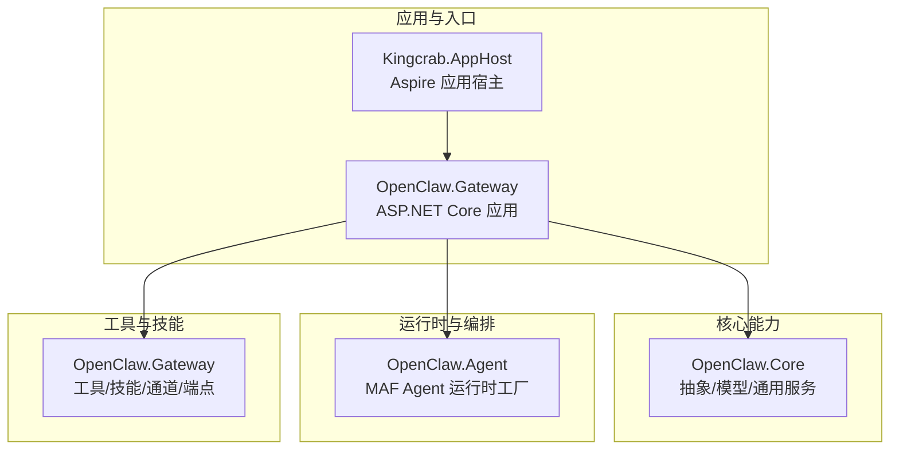
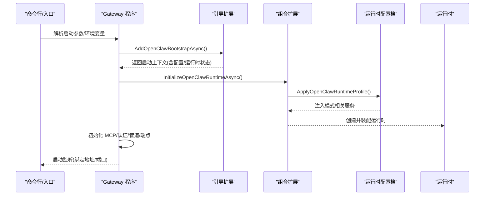
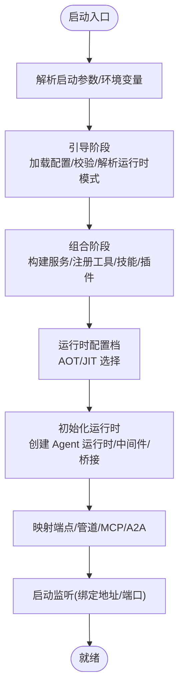
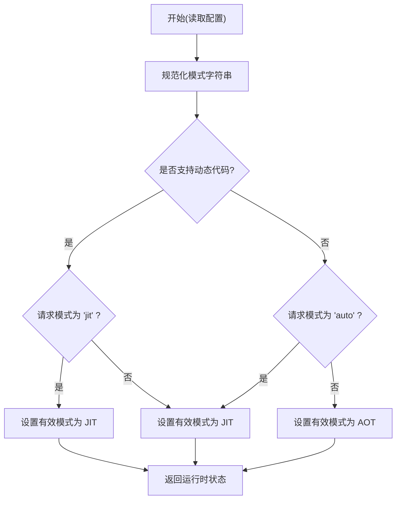
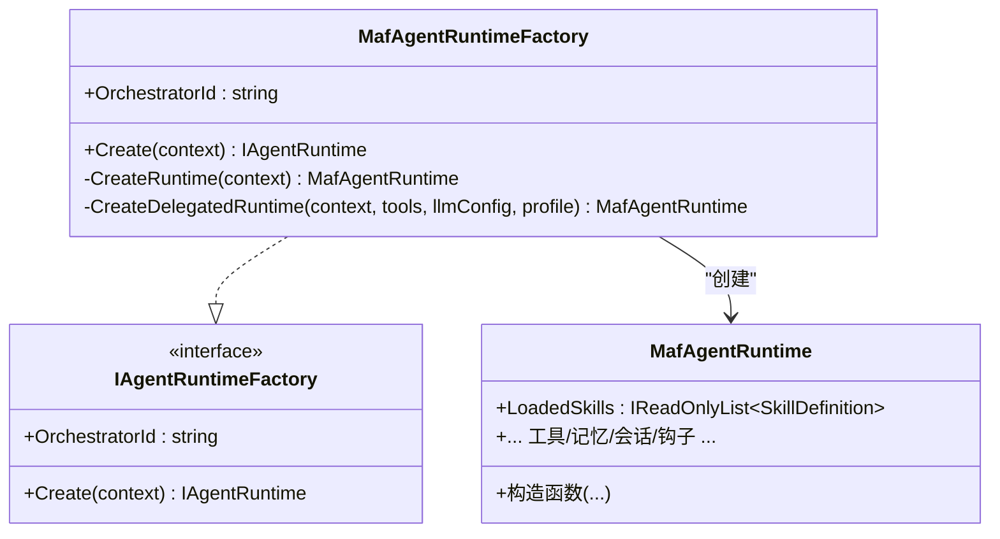
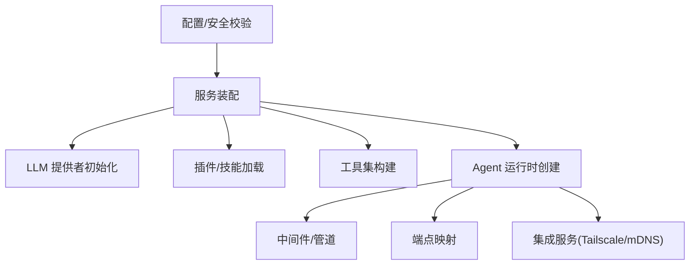
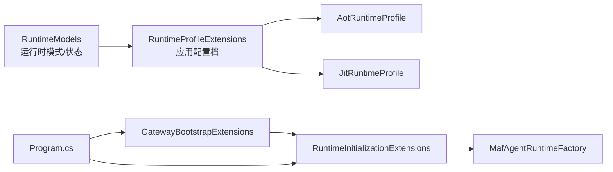

# 系统架构

<cite>
**本文引用的文件**
- [Program.cs](file://src/OpenClaw.Gateway/Program.cs)
- [GatewayBootstrapExtensions.cs](file://src/OpenClaw.Gateway/Bootstrap/GatewayBootstrapExtensions.cs)
- [RuntimeInitializationExtensions.cs](file://src/OpenClaw.Gateway/Composition/RuntimeInitializationExtensions.cs)
- [RuntimeProfileExtensions.cs](file://src/OpenClaw.Gateway/Profiles/RuntimeProfileExtensions.cs)
- [AotRuntimeProfile.cs](file://src/OpenClaw.Gateway/Profiles/AotRuntimeProfile.cs)
- [JitRuntimeProfile.cs](file://src/OpenClaw.Gateway/Profiles/JitRuntimeProfile.cs)
- [RuntimeModels.cs](file://src/OpenClaw.Core/Models/RuntimeModels.cs)
- [MafAgentRuntimeFactory.cs](file://src/OpenClaw.Agent/MafAgentRuntimeFactory.cs)
</cite>

## 目录
1. [引言](#引言)
2. [项目结构](#项目结构)
3. [核心组件](#核心组件)
4. [架构总览](#架构总览)
5. [详细组件分析](#详细组件分析)
6. [依赖关系分析](#依赖关系分析)
7. [性能考量](#性能考量)
8. [故障排查指南](#故障排查指南)
9. [结论](#结论)
10. [附录](#附录)

## 引言
本文件为 OpenClaw.NET 的系统架构文档，聚焦于高层设计、架构模式与系统边界，系统以“网关（Gateway）+ 代理运行时（Agent Runtime）”为核心，采用分层与模块化的组合式架构。系统通过三阶段启动流程完成从引导到运行时配置再到服务初始化；运行时模式支持 AOT/JIT/auto，并可选择 MA Framework（MAF）作为可选编排器。文档还涵盖组件交互、数据流、集成模式、技术决策与约束、基础设施与可扩展性、部署拓扑，以及安全、可观测性与灾难恢复等横切关注点。

## 项目结构
OpenClaw.NET 采用多项目分层组织：
- 应用宿主与入口：Kingcrab.AppHost（Aspire 配置）、OpenClaw.Gateway（ASP.NET Core 入口）
- 核心能力：OpenClaw.Core（抽象、模型、通用服务）
- 运行时与编排：OpenClaw.Agent（MAF 编排器实现）
- 工具与技能：OpenClaw.Gateway（工具、技能、通道、端点）
- 客户端与配套：OpenClaw.Client、OpenClaw.Companion、OpenClaw.Dashboard
- 插件与生态：OpenClaw.Plugins.*、OpenClaw.SkillKit、OpenClaw.PluginKit

图表来源
- [Program.cs:1-124](file://src/OpenClaw.Gateway/Program.cs#L1-L124)
- [GatewayBootstrapExtensions.cs:1-421](file://src/OpenClaw.Gateway/Bootstrap/GatewayBootstrapExtensions.cs#L1-L421)
- [RuntimeInitializationExtensions.cs:1-245](file://src/OpenClaw.Gateway/Composition/RuntimeInitializationExtensions.cs#L1-L245)

章节来源
- [Program.cs:1-124](file://src/OpenClaw.Gateway/Program.cs#L1-L124)

## 核心组件
- 启动与引导（Bootstrap）
  - 负责加载配置、校验环境、解析运行时模式、执行健康检查与医生模式、输出诊断信息。
- 组合与装配（Composition）
  - 构建运行时所需的服务集合，注册工具、技能、通道、中间件、插件与桥接，创建 Agent 运行时实例。
- 运行时配置（Profiles）
  - 基于有效运行时模式（AOT/JIT）应用相应配置档，决定功能能力与行为。
- 运行时编排（MA Framework）
  - 通过 MAF Agent Runtime Factory 创建并管理代理运行时，支持委托工具与策略化工具集。

章节来源
- [GatewayBootstrapExtensions.cs:18-135](file://src/OpenClaw.Gateway/Bootstrap/GatewayBootstrapExtensions.cs#L18-L135)
- [RuntimeInitializationExtensions.cs:35-242](file://src/OpenClaw.Gateway/Composition/RuntimeInitializationExtensions.cs#L35-L242)
- [RuntimeProfileExtensions.cs:8-21](file://src/OpenClaw.Gateway/Profiles/RuntimeProfileExtensions.cs#L8-L21)
- [AotRuntimeProfile.cs:7-21](file://src/OpenClaw.Gateway/Profiles/AotRuntimeProfile.cs#L7-L21)
- [JitRuntimeProfile.cs:7-21](file://src/OpenClaw.Gateway/Profiles/JitRuntimeProfile.cs#L7-L21)
- [MafAgentRuntimeFactory.cs:9-165](file://src/OpenClaw.Agent/MafAgentRuntimeFactory.cs#L9-L165)

## 架构总览
系统采用“引导-组合-配置-初始化-监听”的启动流水线，结合运行时模式与可选编排器，形成可扩展、可演进的运行时框架。

图表来源
- [Program.cs:47-97](file://src/OpenClaw.Gateway/Program.cs#L47-L97)
- [GatewayBootstrapExtensions.cs:18-135](file://src/OpenClaw.Gateway/Bootstrap/GatewayBootstrapExtensions.cs#L18-L135)
- [RuntimeInitializationExtensions.cs:35-242](file://src/OpenClaw.Gateway/Composition/RuntimeInitializationExtensions.cs#L35-L242)
- [RuntimeProfileExtensions.cs:8-21](file://src/OpenClaw.Gateway/Profiles/RuntimeProfileExtensions.cs#L8-L21)

## 详细组件分析

### 启动流程三阶段
- Bootstrap（引导）
  - 加载配置、合并环境变量与密钥引用、执行配置校验与可选特性兼容性检查、解析运行时模式、执行健康检查或医生模式、输出配置源诊断。
- Composition（组合）
  - 构建服务容器，注册核心、通道、工具、后端、安全、MCP、A2A 等服务；初始化 LLM 提供者、加载插件与技能、构建工具集与钩子、创建 Agent 运行时。
- Profiles（运行时配置）
  - 根据有效运行时模式（AOT/JIT）注入对应配置档，决定是否启用扩展桥面与原生动态插件能力，并在运行时初始化后回调。

图表来源
- [Program.cs:47-97](file://src/OpenClaw.Gateway/Program.cs#L47-L97)
- [GatewayBootstrapExtensions.cs:18-135](file://src/OpenClaw.Gateway/Bootstrap/GatewayBootstrapExtensions.cs#L18-L135)
- [RuntimeInitializationExtensions.cs:35-242](file://src/OpenClaw.Gateway/Composition/RuntimeInitializationExtensions.cs#L35-L242)
- [RuntimeProfileExtensions.cs:8-21](file://src/OpenClaw.Gateway/Profiles/RuntimeProfileExtensions.cs#L8-L21)

章节来源
- [Program.cs:47-97](file://src/OpenClaw.Gateway/Program.cs#L47-L97)
- [GatewayBootstrapExtensions.cs:18-135](file://src/OpenClaw.Gateway/Bootstrap/GatewayBootstrapExtensions.cs#L18-L135)
- [RuntimeInitializationExtensions.cs:35-242](file://src/OpenClaw.Gateway/Composition/RuntimeInitializationExtensions.cs#L35-L242)
- [RuntimeProfileExtensions.cs:8-21](file://src/OpenClaw.Gateway/Profiles/RuntimeProfileExtensions.cs#L8-L21)

### 运行时模式选择机制（AOT/JIT/auto）
- 模式定义与解析
  - 支持模式："auto"（默认）、"aot"、"jit"；当请求 "jit" 但运行时不支持动态代码时抛出异常。
  - 有效模式由请求模式与运行时动态代码支持共同决定：若未显式指定，则在支持动态代码时选择 JIT，否则回退至 AOT。
- 运行时状态
  - 记录请求模式、有效模式与动态代码支持状态，供后续组件使用。
- 配置档应用
  - 根据有效模式注入 AOT 或 JIT 配置档，决定运行时能力（如扩展桥面与原生动态插件支持）。

图表来源
- [RuntimeModels.cs:29-59](file://src/OpenClaw.Core/Models/RuntimeModels.cs#L29-L59)

章节来源
- [RuntimeModels.cs:5-69](file://src/OpenClaw.Core/Models/RuntimeModels.cs#L5-L69)
- [RuntimeProfileExtensions.cs:8-21](file://src/OpenClaw.Gateway/Profiles/RuntimeProfileExtensions.cs#L8-L21)
- [AotRuntimeProfile.cs:7-21](file://src/OpenClaw.Gateway/Profiles/AotRuntimeProfile.cs#L7-L21)
- [JitRuntimeProfile.cs:7-21](file://src/OpenClaw.Gateway/Profiles/JitRuntimeProfile.cs#L7-L21)

### MA Framework 作为可选编排器
- 作用
  - 通过 MAF Agent Runtime Factory 创建并管理代理运行时，支持委托工具与策略化工具集，统一接入工具、记忆、会话与治理。
- 关键点
  - 工厂根据运行时状态确保能力可用，支持委托工具以实现跨配置的代理复用与策略化路由。
  - 运行时模式与编排器类型（native/maf）在运行时状态与配置中被规范化与记录。

图表来源
- [MafAgentRuntimeFactory.cs:9-165](file://src/OpenClaw.Agent/MafAgentRuntimeFactory.cs#L9-L165)

章节来源
- [MafAgentRuntimeFactory.cs:9-165](file://src/OpenClaw.Agent/MafAgentRuntimeFactory.cs#L9-L165)
- [RuntimeInitializationExtensions.cs:150-169](file://src/OpenClaw.Gateway/Composition/RuntimeInitializationExtensions.cs#L150-L169)

### 组件交互与数据流
- 配置与安全
  - 引导阶段加载配置、校验非环回绑定的安全要求、执行医生模式与健康检查、输出配置源诊断。
- 服务装配
  - 组合阶段注册核心、通道、工具、后端、安全、MCP、A2A 等服务；初始化 LLM 提供者、加载插件与技能、构建工具集与钩子。
- 运行时生命周期
  - 初始化运行时后，启动技能监视、自动化调度、事件桥接与网络发现服务（如 Tailscale、mDNS），并在优雅停机时清理资源。
- 端点与管道
  - 映射 OpenAPI、网关端点、MCP、A2A 等，建立认证与中间件管道。

图表来源
- [GatewayBootstrapExtensions.cs:143-159](file://src/OpenClaw.Gateway/Bootstrap/GatewayBootstrapExtensions.cs#L143-L159)
- [RuntimeInitializationExtensions.cs:73-239](file://src/OpenClaw.Gateway/Composition/RuntimeInitializationExtensions.cs#L73-L239)
- [Program.cs:89-96](file://src/OpenClaw.Gateway/Program.cs#L89-L96)

章节来源
- [GatewayBootstrapExtensions.cs:143-159](file://src/OpenClaw.Gateway/Bootstrap/GatewayBootstrapExtensions.cs#L143-L159)
- [RuntimeInitializationExtensions.cs:73-239](file://src/OpenClaw.Gateway/Composition/RuntimeInitializationExtensions.cs#L73-L239)
- [Program.cs:89-96](file://src/OpenClaw.Gateway/Program.cs#L89-L96)

## 依赖关系分析
- 运行时模式与配置档
  - 依据运行时状态选择 AOT/JIT 配置档，配置档声明能力（如扩展桥面与原生动态插件支持）。
- 组合扩展与运行时工厂
  - 组合扩展负责服务装配与运行时创建；MAF 工厂负责具体代理运行时实例化与委托工具注入。
- 引导扩展与程序入口
  - 程序入口协调引导、组合、配置档与运行时初始化，处理启动失败的交互式恢复与诊断输出。

图表来源
- [RuntimeModels.cs:29-59](file://src/OpenClaw.Core/Models/RuntimeModels.cs#L29-L59)
- [RuntimeProfileExtensions.cs:8-21](file://src/OpenClaw.Gateway/Profiles/RuntimeProfileExtensions.cs#L8-L21)
- [AotRuntimeProfile.cs:7-21](file://src/OpenClaw.Gateway/Profiles/AotRuntimeProfile.cs#L7-L21)
- [JitRuntimeProfile.cs:7-21](file://src/OpenClaw.Gateway/Profiles/JitRuntimeProfile.cs#L7-L21)
- [GatewayBootstrapExtensions.cs:18-135](file://src/OpenClaw.Gateway/Bootstrap/GatewayBootstrapExtensions.cs#L18-L135)
- [RuntimeInitializationExtensions.cs:35-242](file://src/OpenClaw.Gateway/Composition/RuntimeInitializationExtensions.cs#L35-L242)
- [MafAgentRuntimeFactory.cs:9-165](file://src/OpenClaw.Agent/MafAgentRuntimeFactory.cs#L9-L165)
- [Program.cs:47-97](file://src/OpenClaw.Gateway/Program.cs#L47-L97)

章节来源
- [RuntimeProfileExtensions.cs:8-21](file://src/OpenClaw.Gateway/Profiles/RuntimeProfileExtensions.cs#L8-L21)
- [RuntimeInitializationExtensions.cs:35-242](file://src/OpenClaw.Gateway/Composition/RuntimeInitializationExtensions.cs#L35-L242)
- [Program.cs:47-97](file://src/OpenClaw.Gateway/Program.cs#L47-L97)

## 性能考量
- 运行时模式
  - AOT 在发布包中禁用动态代码，适合高并发与低延迟场景；JIT 在支持动态代码时可启用扩展桥面与原生动态插件，适合需要灵活性的场景。
- 服务装配与懒加载
  - 通过组合扩展按需注册服务，避免不必要的初始化开销；对可选集成（如 Tailscale、mDNS）仅在启用时启动。
- 中间件与限流
  - 中间件层提供速率限制与令牌预算控制，有助于在高负载下维持稳定性。
- 观测与审计
  - 内置遥测与工具使用追踪，便于定位性能瓶颈与资源消耗热点。

## 故障排查指南
- 启动失败与交互式恢复
  - 程序入口在启动前捕获异常，尝试交互式恢复（基于本地会话与状态存储），若无法恢复则输出失败报告并退出。
- 医生模式与健康检查
  - 引导扩展支持 --doctor 与 --health-check 参数，用于诊断配置问题与服务可达性。
- 配置源诊断
  - 引导扩展输出生效配置的来源与覆盖关系，辅助定位配置冲突与错误。
- 运行时模式错误
  - 当请求 JIT 但不支持动态代码时抛出异常；应调整运行时模式或构建产物。

章节来源
- [Program.cs:99-122](file://src/OpenClaw.Gateway/Program.cs#L99-L122)
- [GatewayBootstrapExtensions.cs:38-84](file://src/OpenClaw.Gateway/Bootstrap/GatewayBootstrapExtensions.cs#L38-L84)
- [GatewayBootstrapExtensions.cs:402-419](file://src/OpenClaw.Gateway/Bootstrap/GatewayBootstrapExtensions.cs#L402-L419)

## 结论
OpenClaw.NET 通过“引导-组合-配置-初始化-监听”的三阶段启动流程，结合 AOT/JIT/auto 的运行时模式与 MA Framework 可选编排器，实现了高内聚、低耦合且可扩展的系统架构。该架构在保证安全性与可观测性的前提下，提供了灵活的运行时能力与部署拓扑适配，满足从开发到生产的多样化需求。

## 附录
- 基础设施要求
  - 运行时模式：AOT 发布包禁用动态代码；JIT 需要支持动态代码的运行时。
  - 安全绑定：非环回绑定必须设置鉴权令牌，并建议启用请求者匹配的 HTTP 工具审批。
  - 可选集成：Tailscale 与 mDNS 仅在启用时启动，注意网络与防火墙配置。
- 可扩展性考虑
  - 插件与技能热加载：组合扩展支持插件与技能的加载与热重载，降低变更成本。
  - 工具与后端路由：通过执行后端配置与沙箱策略，实现工具路由与降级。
- 部署拓扑
  - 单节点：Gateway 作为独立服务，内置工具、技能与通道。
  - 多节点：结合 Aspire 应用宿主进行分布式编排与服务发现。
- 横切关注点
  - 安全：鉴权、输入净化、路径策略、URL 安全验证、白名单管理。
  - 监控：遥测、工具使用追踪、运行时指标、启动通知。
  - 灾难恢复：启动失败的交互式恢复、健康检查、优雅停机与异步清理。