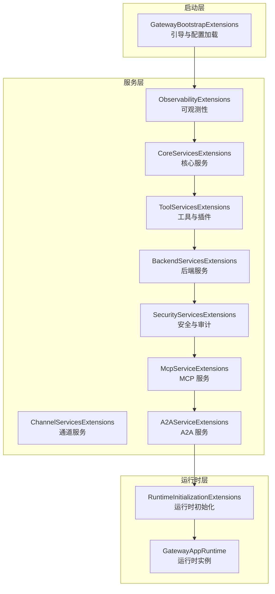
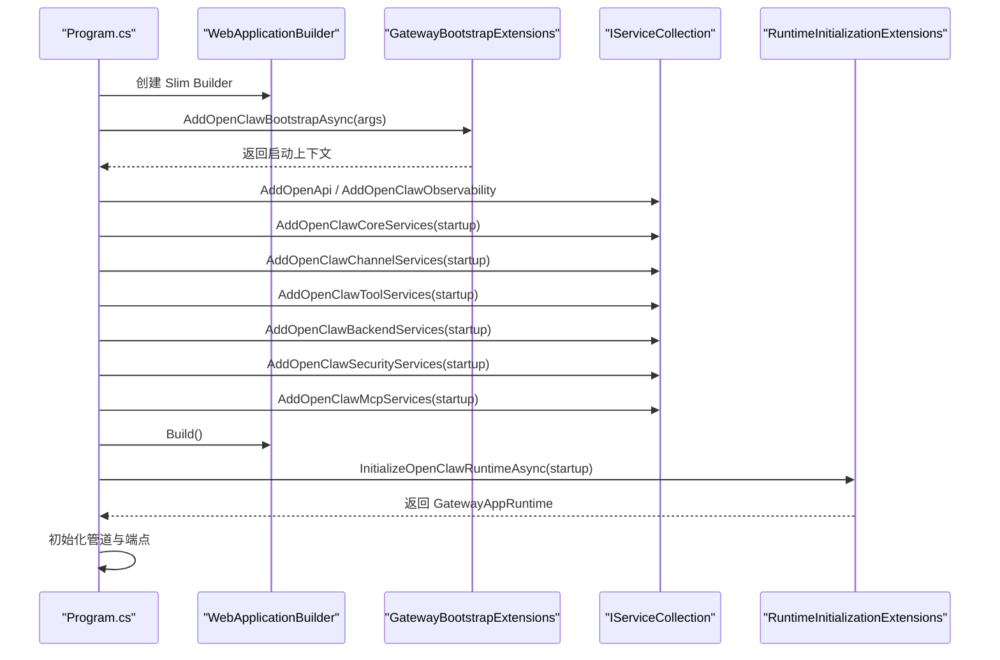
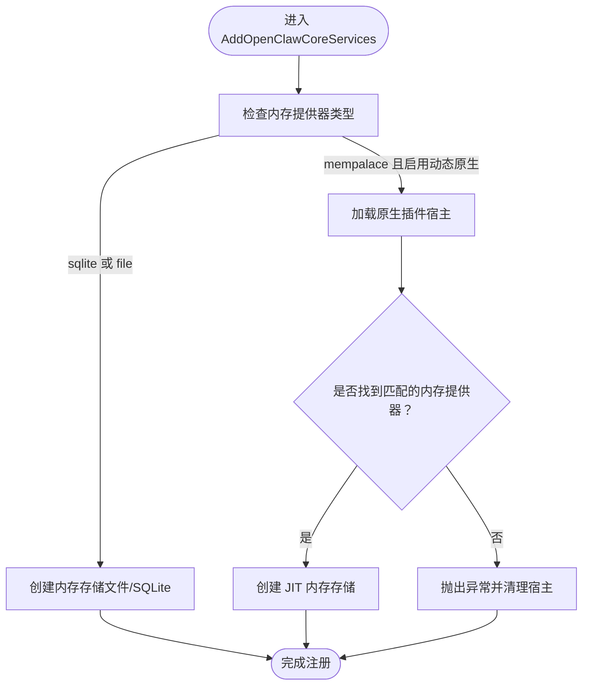
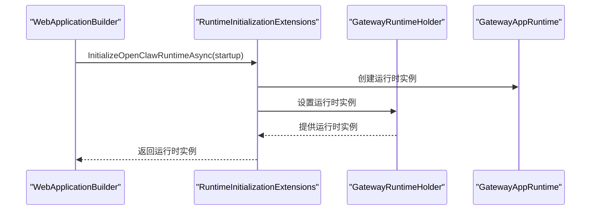
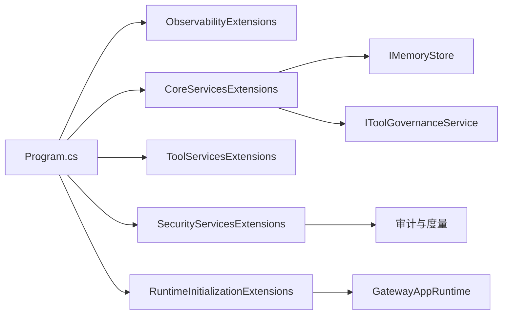

# 组件交互

<cite>
**本文引用的文件**
- [Program.cs](file://src/OpenClaw.Gateway/Program.cs)
- [CoreServicesExtensions.cs](file://src/OpenClaw.Gateway/Composition/CoreServicesExtensions.cs)
- [ToolServicesExtensions.cs](file://src/OpenClaw.Gateway/Composition/ToolServicesExtensions.cs)
- [SecurityServicesExtensions.cs](file://src/OpenClaw.Gateway/Composition/SecurityServicesExtensions.cs)
- [ObservabilityExtensions.cs](file://src/OpenClaw.Gateway/Composition/ObservabilityExtensions.cs)
- [RuntimeInitializationExtensions.cs](file://src/OpenClaw.Gateway/Composition/RuntimeInitializationExtensions.cs)
- [GatewayBootstrapExtensions.cs](file://src/OpenClaw.Gateway/Bootstrap/GatewayBootstrapExtensions.cs)
- [CoreServicesExtensionsTests.cs](file://src/OpenClaw.Tests/CoreServicesExtensionsTests.cs)
- [Extensions.cs](file://Kingcrab.ServiceDefaults/Extensions.cs)
- [GatewayRuntimeHolder.cs](file://src/OpenClaw.Gateway/Mcp/GatewayRuntimeHolder.cs)
</cite>

## 目录
1. [引言](#引言)
2. [项目结构](#项目结构)
3. [核心组件](#核心组件)
4. [架构总览](#架构总览)
5. [详细组件分析](#详细组件分析)
6. [依赖分析](#依赖分析)
7. [性能考虑](#性能考虑)
8. [故障排查指南](#故障排查指南)
9. [结论](#结论)
10. [附录](#附录)

## 引言
本文件面向 OpenClaw.NET 网关服务的组件交互与扩展机制，聚焦以下服务扩展模块及其交互模式：
- CoreServicesExtensions：核心服务注册与运行时构建
- ToolServicesExtensions：工具与插件注册
- SecurityServicesExtensions：安全策略与审计
- ObservabilityExtensions：可观测性与遥测

文档将系统阐述服务生命周期管理、依赖注入容器配置、服务间通信机制、组件注册顺序、初始化依赖关系、循环依赖避免策略、服务发现与动态加载、插件集成模式，以及组件解耦策略、接口设计原则与扩展点规划。

## 项目结构
OpenClaw.Gateway 采用“启动层 → 服务层 → 运行时层”的分层启动模型：
- 启动层（Bootstrap）：在构建 DI 容器前执行，负责环境准备、快速启动恢复、配置校验与短路退出。
- 服务层（Composition）：按功能域注册服务，包括核心、工具、安全、可观测等扩展。
- 运行时层（Runtime Initialization）：在容器构建后，基于已注册服务与应用生命周期创建运行时对象。

图示来源
- [Program.cs:65-78](file://src/OpenClaw.Gateway/Program.cs#L65-L78)
- [ObservabilityExtensions.cs:7-13](file://src/OpenClaw.Gateway/Composition/ObservabilityExtensions.cs#L7-L13)
- [CoreServicesExtensions.cs:38-249](file://src/OpenClaw.Gateway/Composition/CoreServicesExtensions.cs#L38-L249)
- [ToolServicesExtensions.cs:8-21](file://src/OpenClaw.Gateway/Composition/ToolServicesExtensions.cs#L8-L21)
- [SecurityServicesExtensions.cs:11-83](file://src/OpenClaw.Gateway/Composition/SecurityServicesExtensions.cs#L11-L83)
- [RuntimeInitializationExtensions.cs:34](file://src/OpenClaw.Gateway/Composition/RuntimeInitializationExtensions.cs#L34)

章节来源
- [Program.cs:53-83](file://src/OpenClaw.Gateway/Program.cs#L53-L83)
- [GatewayBootstrapExtensions.cs:17](file://src/OpenClaw.Gateway/Bootstrap/GatewayBootstrapExtensions.cs#L17)

## 核心组件
- 观测性扩展（ObservabilityExtensions）
  - 在 WebApplicationBuilder 上注册遥测与日志提供程序，确保所有后续注册均通过统一遥测管道输出。
  - 清空默认日志提供器并添加控制台日志，便于本地开发与诊断。
- 核心服务扩展（CoreServicesExtensions）
  - 注册学习、治理、支付、内存、会话、消息管线、自动化、计划-执行-验证、多模态、提示缓存、模型选择与评估、嵌入回填、心跳与脉搏、工作流与工件存储等服务。
  - 支持动态原生插件加载（JIT-only），在内存提供器为 mempalace 时按需加载并创建内存存储。
  - 通过 IHostApplicationLifetime 获取取消令牌，用于优雅关闭与资源释放。
- 工具服务扩展（ToolServicesExtensions）
  - 注册原生插件注册表与 MCP 服务器工具注册表，为工具发现与路由提供基础。
- 安全服务扩展（SecurityServicesExtensions）
  - 注册审批服务、配对管理、浏览器会话认证、操作员账户与组织策略、管理员设置、插件健康状态、合同治理与审计、外部 CLI 审计与事件、运行时事件存储等。
  - 通过运行时度量与使用追踪器支撑安全策略与合规审计。

章节来源
- [ObservabilityExtensions.cs:7-13](file://src/OpenClaw.Gateway/Composition/ObservabilityExtensions.cs#L7-L13)
- [CoreServicesExtensions.cs:38-249](file://src/OpenClaw.Gateway/Composition/CoreServicesExtensions.cs#L38-L249)
- [ToolServicesExtensions.cs:8-21](file://src/OpenClaw.Gateway/Composition/ToolServicesExtensions.cs#L8-L21)
- [SecurityServicesExtensions.cs:11-83](file://src/OpenClaw.Gateway/Composition/SecurityServicesExtensions.cs#L11-L83)

## 架构总览
下图展示从应用启动到运行时可用的关键序列：

图示来源
- [Program.cs:50-96](file://src/OpenClaw.Gateway/Program.cs#L50-L96)
- [GatewayBootstrapExtensions.cs:17](file://src/OpenClaw.Gateway/Bootstrap/GatewayBootstrapExtensions.cs#L17)
- [RuntimeInitializationExtensions.cs:34](file://src/OpenClaw.Gateway/Composition/RuntimeInitializationExtensions.cs#L34)

## 详细组件分析

### 观测性扩展（ObservabilityExtensions）
- 职责
  - 注册网关遥测（OTLP 导出器）与日志提供程序，确保所有后续服务注册与运行时行为均可被观测。
  - 清空默认日志提供器并添加控制台日志，提升可观测性与调试效率。
- 生命周期
  - 在容器构建前注册，保证从第一行服务注册开始即受遥测覆盖。
- 与其他组件的关系
  - 为 Core/Security/Tool 等模块的度量与审计提供基础设施。

章节来源
- [ObservabilityExtensions.cs:7-13](file://src/OpenClaw.Gateway/Composition/ObservabilityExtensions.cs#L7-L13)

### 核心服务扩展（CoreServicesExtensions）
- 职责
  - 建立网关运行所需的核心能力：学习、治理、支付、内存、会话、消息管线、自动化、计划-执行-验证、多模态、提示缓存、模型选择与评估、嵌入回填、心跳与脉搏、工作流与工件存储等。
  - 动态原生插件支持：当内存提供器为 mempalace 时，按配置加载原生插件并创建内存存储；若未启用或未匹配，抛出明确异常并清理资源。
  - 通过 IHostApplicationLifetime 获取取消令牌，确保优雅关闭。
- 关键注册点
  - 学习与治理：学习服务、治理策略、工具治理服务。
  - 支付与敏感数据处理：支付核心、敏感数据替换、外部 CLI 审计与事件。
  - 内存与会话：内存存储（文件/SQLite/JIT 动态原生）、结构化内存提供者、会话管理、保留策略。
  - 多模态与语音：音频转录、视频帧提取、文本转语音（Gemini/ElevenLabs）。
  - 工具与执行：工具预设解析、执行路由、进程执行服务、运行时事件存储。
  - 自动化与工作流：自动化协调器、计划-执行-验证、工件与证据存储。
  - 模型与提示缓存：模型选择策略、提示缓存协调与预热。
  - 周期任务：心跳、脉搏、嵌入回填、运行时关闭协调。
- 动态服务加载与插件集成
  - 当内存提供器为 mempalace 且动态原生启用时，创建 NativeDynamicPluginHost 并加载内存提供器；失败时清理宿主并抛出异常。
  - 通过插件健康服务过滤被禁用插件，避免加载无效或危险组件。
- 服务间通信机制
  - 通过 DI 解析跨模块依赖（如内存存储作为会话管理、审计日志、使用追踪器等的输入）。
  - 使用运行时度量与事件存储在执行链路中记录关键信息。
- 循环依赖避免策略
  - 将 GatewayAppRuntime 显式创建于运行时初始化阶段，不注册进 DI，避免与服务构造函数形成循环依赖。
  - 对动态插件加载失败进行显式清理，防止资源泄漏导致的隐式循环。

图示来源
- [CoreServicesExtensions.cs:295-380](file://src/OpenClaw.Gateway/Composition/CoreServicesExtensions.cs#L295-L380)

章节来源
- [CoreServicesExtensions.cs:38-249](file://src/OpenClaw.Gateway/Composition/CoreServicesExtensions.cs#L38-L249)
- [CoreServicesExtensionsTests.cs:152-150](file://src/OpenClaw.Tests/CoreServicesExtensionsTests.cs#L152-L150)

### 工具服务扩展（ToolServicesExtensions）
- 职责
  - 注册原生插件注册表与 MCP 服务器工具注册表，为工具发现与路由提供基础。
- 生命周期
  - 在核心服务之后注册，确保工具注册依赖于已建立的配置与日志基础设施。
- 与其他组件的关系
  - 与 CoreServicesExtensions 中的工具执行路由与预设解析配合，形成“发现—路由—执行”的闭环。

章节来源
- [ToolServicesExtensions.cs:8-21](file://src/OpenClaw.Gateway/Composition/ToolServicesExtensions.cs#L8-L21)

### 安全服务扩展（SecurityServicesExtensions）
- 职责
  - 注册审批服务、配对管理、浏览器会话认证、操作员账户与组织策略、管理员设置、插件健康状态、合同治理与审计、外部 CLI 审计与事件、运行时事件存储等。
- 生命周期
  - 在核心服务之后注册，确保安全相关度量与追踪器已就绪。
- 与其他组件的关系
  - 与 CoreServicesExtensions 中的工具治理服务协同，形成“策略—审批—审计”的闭环。
  - 与运行时度量结合，支持安全策略的可观测性与合规审计。

章节来源
- [SecurityServicesExtensions.cs:11-83](file://src/OpenClaw.Gateway/Composition/SecurityServicesExtensions.cs#L11-L83)

### 运行时初始化（RuntimeInitializationExtensions）
- 职责
  - 在容器构建后，基于已注册服务与应用生命周期创建运行时对象（GatewayAppRuntime），并通过参数传递给端点映射、管道配置与 MCP 鉴权中间件。
- 生命周期
  - 在 builder.Build() 之后调用，确保所有服务已注册且可解析。
- 与其他组件的关系
  - 与 Program.cs 的初始化流程衔接，确保运行时对象在请求处理前可用。
  - 通过 GatewayRuntimeHolder 单例桥接 DI 与运行时，避免直接注册运行时到 DI。

图示来源
- [RuntimeInitializationExtensions.cs:34](file://src/OpenClaw.Gateway/Composition/RuntimeInitializationExtensions.cs#L34)
- [GatewayRuntimeHolder.cs:10-19](file://src/OpenClaw.Gateway/Mcp/GatewayRuntimeHolder.cs#L10-L19)

章节来源
- [RuntimeInitializationExtensions.cs:34](file://src/OpenClaw.Gateway/Composition/RuntimeInitializationExtensions.cs#L34)
- [GatewayRuntimeHolder.cs:10-19](file://src/OpenClaw.Gateway/Mcp/GatewayRuntimeHolder.cs#L10-L19)

## 依赖分析
- 组件耦合与内聚
  - CoreServicesExtensions 作为“核心能力聚合”，内聚度高但耦合于多个子系统（内存、会话、工具、自动化、多模态、治理等）。
  - ObservabilityExtensions 低耦合、高内聚，仅负责遥测与日志基础设施。
  - ToolServicesExtensions 与 SecurityServicesExtensions 分别面向“工具发现”和“安全策略”，职责清晰。
- 直接与间接依赖
  - Program.cs 直接依赖各扩展方法与运行时初始化；间接依赖通过 DI 解析。
  - 运行时对象 GatewayAppRuntime 不注册进 DI，避免与服务构造函数形成循环依赖。
- 外部依赖与集成点
  - 通过 Kingcrab.ServiceDefaults/Extensions.cs 注入通用 Aspire 服务（服务发现、健康检查、OTel）。
  - 支持动态原生插件（JIT-only），通过 NativeDynamicPluginHost 加载内存提供器。
- 接口契约与实现细节
  - 通过抽象接口（如 IMemoryStore、IModelProfileRegistry、IToolGovernanceService 等）隔离具体实现，便于替换与测试。

图示来源
- [Program.cs:65-83](file://src/OpenClaw.Gateway/Program.cs#L65-L83)
- [CoreServicesExtensions.cs:38-249](file://src/OpenClaw.Gateway/Composition/CoreServicesExtensions.cs#L38-L249)
- [SecurityServicesExtensions.cs:11-83](file://src/OpenClaw.Gateway/Composition/SecurityServicesExtensions.cs#L11-L83)
- [RuntimeInitializationExtensions.cs:34](file://src/OpenClaw.Gateway/Composition/RuntimeInitializationExtensions.cs#L34)

章节来源
- [Program.cs:65-83](file://src/OpenClaw.Gateway/Program.cs#L65-L83)
- [Extensions.cs:18-37](file://Kingcrab.ServiceDefaults/Extensions.cs#L18-L37)

## 性能考虑
- 服务注册顺序
  - 观测性优先注册，确保后续所有服务均可被遥测覆盖，降低诊断成本。
  - 核心服务集中注册，减少多次容器构建与重复解析。
- 动态加载与 JIT
  - 动态原生插件仅在需要时加载，避免不必要的启动开销；失败时快速清理，防止资源泄漏。
- 嵌入回填与后台任务
  - 嵌入回填服务作为托管服务异步执行，不影响主请求路径。
- 日志与遥测
  - 控制台日志与 OTel 导出器在开发与生产环境均有良好覆盖，便于性能监控与问题定位。

## 故障排查指南
- 启动失败与恢复
  - 启动层（Bootstrap）支持快速启动恢复与交互式恢复，失败时可生成诊断报告。
- 动态插件加载失败
  - 当内存提供器为 mempalace 且未启用动态原生或未匹配提供器时，会抛出明确异常并清理宿主；检查配置与插件清单。
- 服务解析失败
  - 使用测试用例验证服务解析与作用域验证，确保 DI 配置正确。
- 运行时事件与审计
  - 通过运行时事件存储与审计日志定位问题根因，结合度量与追踪器进行关联分析。

章节来源
- [Program.cs:99-122](file://src/OpenClaw.Gateway/Program.cs#L99-L122)
- [CoreServicesExtensionsTests.cs:298-371](file://src/OpenClaw.Tests/CoreServicesExtensionsTests.cs#L298-L371)

## 结论
OpenClaw.NET 的组件交互架构通过“启动层—服务层—运行时层”的清晰分层，实现了可观测性优先、核心能力聚合、工具与安全分离、动态插件集成与运行时对象独立管理的设计目标。服务扩展模块围绕 DI 容器进行有序注册，配合运行时初始化与单例持有器，既保证了组件解耦与接口设计原则，又提供了良好的扩展点与插件集成模式。

## 附录
- 组件注册顺序建议
  - 观测性扩展 → 核心服务 → 通道/后端/工具 → 安全 → MCP/A2A → 运行时初始化
- 循环依赖避免策略
  - 运行时对象不注册进 DI，通过参数传递；动态插件加载失败时立即清理宿主。
- 扩展点规划
  - 新增服务时优先通过扩展方法封装，保持与现有注册顺序一致；对外暴露抽象接口，内部实现可替换。