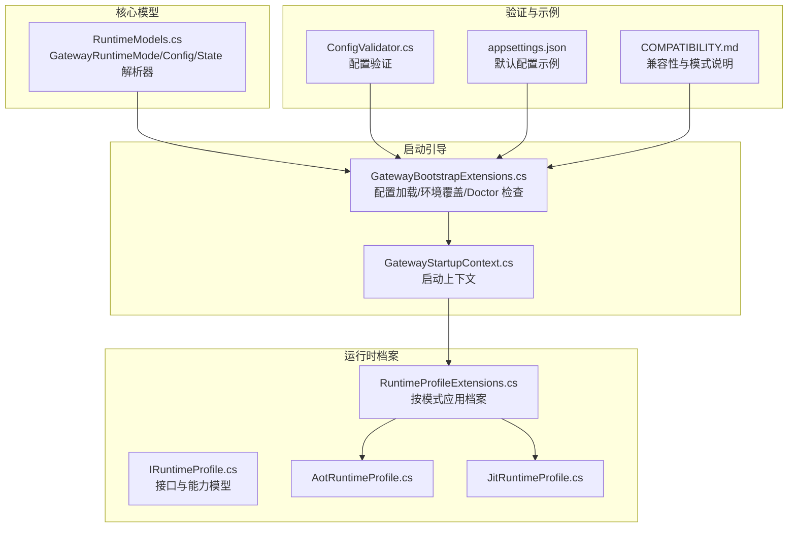
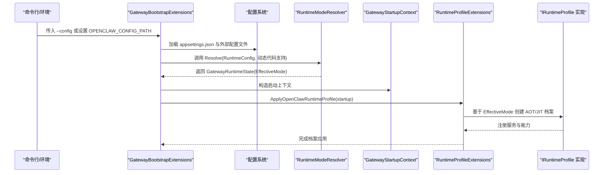
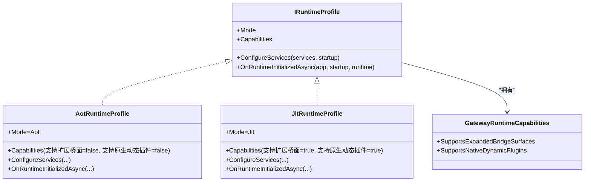
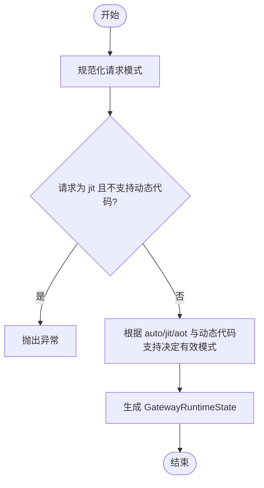
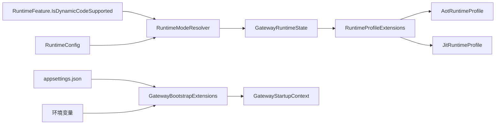

# 运行时配置

<cite>
**本文引用的文件**
- [IRuntimeProfile.cs](file://src/OpenClaw.Gateway/Profiles/IRuntimeProfile.cs)
- [AotRuntimeProfile.cs](file://src/OpenClaw.Gateway/Profiles/AotRuntimeProfile.cs)
- [JitRuntimeProfile.cs](file://src/OpenClaw.Gateway/Profiles/JitRuntimeProfile.cs)
- [RuntimeProfileExtensions.cs](file://src/OpenClaw.Gateway/Profiles/RuntimeProfileExtensions.cs)
- [RuntimeModels.cs](file://src/OpenClaw.Core/Models/RuntimeModels.cs)
- [GatewayBootstrapExtensions.cs](file://src/OpenClaw.Gateway/Bootstrap/GatewayBootstrapExtensions.cs)
- [GatewayStartupContext.cs](file://src/OpenClaw.Gateway/Bootstrap/GatewayStartupContext.cs)
- [ConfigValidator.cs](file://src/OpenClaw.Core/Validation/ConfigValidator.cs)
- [appsettings.json](file://src/OpenClaw.Gateway/appsettings.json)
- [COMPATIBILITY.md](file://COMPATIBILITY.md)
- [StartupLaunchOptionsTests.cs](file://src/OpenClaw.Tests/StartupLaunchOptionsTests.cs)
- [ContractGovernanceService.cs](file://src/OpenClaw.Gateway/ContractGovernanceService.cs)
- [MafCapabilities.cs](file://src/OpenClaw.Agent/MafCapabilities.cs)
</cite>

## 目录
1. [简介](#简介)
2. [项目结构](#项目结构)
3. [核心组件](#核心组件)
4. [架构总览](#架构总览)
5. [详细组件分析](#详细组件分析)
6. [依赖关系分析](#依赖关系分析)
7. [性能考量](#性能考量)
8. [故障排查指南](#故障排查指南)
9. [结论](#结论)
10. [附录](#附录)

## 简介
本文件系统性阐述 OpenClaw.NET 的运行时配置体系，重点覆盖：
- AOT（Ahead-of-Time）与 JIT（Just-in-Time）两种运行时模式的选择机制与配置方法
- IRuntimeProfile 接口的设计理念与扩展机制
- AotRuntimeProfile 与 JitRuntimeProfile 的实现差异、能力边界与适用场景
- auto 模式下的自动检测逻辑与运行时切换机制
- 配置优先级、环境变量影响与配置验证流程
- 不同部署场景的最佳实践与性能对比建议

## 项目结构
运行时配置相关代码主要分布在以下模块：
- 核心模型与解析：OpenClaw.Core.Models（运行时模式枚举、配置模型、解析器）
- 启动与引导：OpenClaw.Gateway.Bootstrap（启动上下文、环境变量与配置合并）
- 运行时档案与选择：OpenClaw.Gateway.Profiles（IRuntimeProfile 接口、AOT/JIT 实现、应用扩展）
- 配置验证：OpenClaw.Core.Validation（配置校验器）
- 默认配置示例：OpenClaw.Gateway.appsettings.json
- 兼容性与模式说明：COMPATIBILITY.md

图表来源
- [RuntimeModels.cs:5-68](file://src/OpenClaw.Core/Models/RuntimeModels.cs#L5-L68)
- [GatewayBootstrapExtensions.cs:67-112](file://src/OpenClaw.Gateway/Bootstrap/GatewayBootstrapExtensions.cs#L67-L112)
- [GatewayStartupContext.cs:6-14](file://src/OpenClaw.Gateway/Bootstrap/GatewayStartupContext.cs#L6-L14)
- [IRuntimeProfile.cs:7-17](file://src/OpenClaw.Gateway/Profiles/IRuntimeProfile.cs#L7-L17)
- [AotRuntimeProfile.cs:7-21](file://src/OpenClaw.Gateway/Profiles/AotRuntimeProfile.cs#L7-L21)
- [JitRuntimeProfile.cs:7-21](file://src/OpenClaw.Gateway/Profiles/JitRuntimeProfile.cs#L7-L21)
- [RuntimeProfileExtensions.cs:8-21](file://src/OpenClaw.Gateway/Profiles/RuntimeProfileExtensions.cs#L8-L21)
- [ConfigValidator.cs:236-241](file://src/OpenClaw.Core/Validation/ConfigValidator.cs#L236-L241)
- [appsettings.json:6-9](file://src/OpenClaw.Gateway/appsettings.json#L6-L9)
- [COMPATIBILITY.md:7-9](file://COMPATIBILITY.md#L7-L9)

章节来源
- [RuntimeModels.cs:5-68](file://src/OpenClaw.Core/Models/RuntimeModels.cs#L5-L68)
- [GatewayBootstrapExtensions.cs:67-112](file://src/OpenClaw.Gateway/Bootstrap/GatewayBootstrapExtensions.cs#L67-L112)
- [IRuntimeProfile.cs:7-17](file://src/OpenClaw.Gateway/Profiles/IRuntimeProfile.cs#L7-L17)
- [RuntimeProfileExtensions.cs:8-21](file://src/OpenClaw.Gateway/Profiles/RuntimeProfileExtensions.cs#L8-L21)
- [ConfigValidator.cs:236-241](file://src/OpenClaw.Core/Validation/ConfigValidator.cs#L236-L241)
- [appsettings.json:6-9](file://src/OpenClaw.Gateway/appsettings.json#L6-L9)
- [COMPATIBILITY.md:7-9](file://COMPATIBILITY.md#L7-L9)

## 核心组件
- 运行时模式与状态
  - 枚举 GatewayRuntimeMode：Aot、Jit
  - 配置 RuntimeConfig：包含 Mode（默认 auto）、Orchestrator（默认 native）
  - 状态 GatewayRuntimeState：记录 RequestedMode、EffectiveMode、DynamicCodeSupported
  - 解析器 RuntimeModeResolver：将请求模式规范化并结合动态代码支持计算 EffectiveMode
- 运行时档案 IRuntimeProfile
  - 定义 Mode、能力 GatewayRuntimeCapabilities、服务注册与初始化回调
  - 能力模型包含 SupportsExpandedBridgeSurfaces、SupportsNativeDynamicPlugins
- AOT/JIT 档案
  - AotRuntimeProfile：Strict 能力，不支持扩展桥面与原生动态插件
  - JitRuntimeProfile：宽松能力，支持扩展桥面与原生动态插件
- 启动与配置
  - GatewayBootstrapExtensions：加载 appsettings.json、命令行 --config 与环境变量 OPENCLAW_CONFIG_PATH；应用环境覆盖；执行 Doctor 检查
  - GatewayStartupContext：封装配置、运行时状态、绑定地址等上下文信息
- 验证与示例
  - ConfigValidator：校验 Runtime.Mode 与 Orchestrator 取值范围
  - appsettings.json：默认示例包含 Runtime.Mode 与 Orchestrator 字段
  - COMPATIBILITY.md：明确 auto/jit/aot 的行为与兼容性

章节来源
- [RuntimeModels.cs:5-68](file://src/OpenClaw.Core/Models/RuntimeModels.cs#L5-L68)
- [IRuntimeProfile.cs:7-17](file://src/OpenClaw.Gateway/Profiles/IRuntimeProfile.cs#L7-L17)
- [AotRuntimeProfile.cs:7-21](file://src/OpenClaw.Gateway/Profiles/AotRuntimeProfile.cs#L7-L21)
- [JitRuntimeProfile.cs:7-21](file://src/OpenClaw.Gateway/Profiles/JitRuntimeProfile.cs#L7-L21)
- [GatewayBootstrapExtensions.cs:67-112](file://src/OpenClaw.Gateway/Bootstrap/GatewayBootstrapExtensions.cs#L67-L112)
- [GatewayStartupContext.cs:6-14](file://src/OpenClaw.Gateway/Bootstrap/GatewayStartupContext.cs#L6-L14)
- [ConfigValidator.cs:236-241](file://src/OpenClaw.Core/Validation/ConfigValidator.cs#L236-L241)
- [appsettings.json:6-9](file://src/OpenClaw.Gateway/appsettings.json#L6-L9)
- [COMPATIBILITY.md:7-9](file://COMPATIBILITY.md#L7-L9)

## 架构总览
运行时配置从“配置源”到“运行时档案”的关键流程如下：

图表来源
- [GatewayBootstrapExtensions.cs:67-112](file://src/OpenClaw.Gateway/Bootstrap/GatewayBootstrapExtensions.cs#L67-L112)
- [RuntimeModels.cs:29-58](file://src/OpenClaw.Core/Models/RuntimeModels.cs#L29-L58)
- [RuntimeProfileExtensions.cs:8-21](file://src/OpenClaw.Gateway/Profiles/RuntimeProfileExtensions.cs#L8-L21)
- [IRuntimeProfile.cs:11-17](file://src/OpenClaw.Gateway/Profiles/IRuntimeProfile.cs#L11-L17)

## 详细组件分析

### IRuntimeProfile 接口与扩展机制
- 设计理念
  - 将“运行时模式”与“可装配的服务能力”解耦，通过档案（Profile）在启动阶段注入差异化能力
  - 能力模型 GatewayRuntimeCapabilities 明确桥接面扩展与原生动态插件支持
- 扩展机制
  - 通过 RuntimeProfileExtensions.ApplyOpenClawRuntimeProfile 按 EffectiveMode 选择具体档案
  - 档案负责 ConfigureServices 与 OnRuntimeInitializedAsync 生命周期钩子
- 与 MAF 的关系
  - MafCapabilities 支持在 JIT/AOT 下均可用，但仅在 MAF 启用的构建中生效

图表来源
- [IRuntimeProfile.cs:7-17](file://src/OpenClaw.Gateway/Profiles/IRuntimeProfile.cs#L7-L17)
- [AotRuntimeProfile.cs:7-21](file://src/OpenClaw.Gateway/Profiles/AotRuntimeProfile.cs#L7-L21)
- [JitRuntimeProfile.cs:7-21](file://src/OpenClaw.Gateway/Profiles/JitRuntimeProfile.cs#L7-L21)

章节来源
- [IRuntimeProfile.cs:7-17](file://src/OpenClaw.Gateway/Profiles/IRuntimeProfile.cs#L7-L17)
- [AotRuntimeProfile.cs:7-21](file://src/OpenClaw.Gateway/Profiles/AotRuntimeProfile.cs#L7-L21)
- [JitRuntimeProfile.cs:7-21](file://src/OpenClaw.Gateway/Profiles/JitRuntimeProfile.cs#L7-L21)
- [MafCapabilities.cs:5-16](file://src/OpenClaw.Agent/MafCapabilities.cs#L5-L16)

### AOT 与 JIT 档案的实现差异与适用场景
- AotRuntimeProfile
  - 能力：不支持扩展桥面与原生动态插件
  - 场景：严格内存与兼容性要求的生产环境，或无动态代码支持的构建产物
- JitRuntimeProfile
  - 能力：支持扩展桥面与原生动态插件
  - 场景：需要更广插件生态与桥接能力的开发/测试/边缘环境
- 选择原则
  - auto 模式下，若动态代码不可用则回退至 AOT；若动态代码可用则选择 JIT
  - 显式 aot/jit 则强制对应模式

章节来源
- [AotRuntimeProfile.cs:7-21](file://src/OpenClaw.Gateway/Profiles/AotRuntimeProfile.cs#L7-L21)
- [JitRuntimeProfile.cs:7-21](file://src/OpenClaw.Gateway/Profiles/JitRuntimeProfile.cs#L7-L21)
- [RuntimeModels.cs:29-58](file://src/OpenClaw.Core/Models/RuntimeModels.cs#L29-L58)
- [COMPATIBILITY.md:7-9](file://COMPATIBILITY.md#L7-L9)

### 自动检测逻辑与运行时切换机制
- 规范化与判定
  - 请求模式规范化（auto/aot/jit），结合 RuntimeFeature.IsDynamicCodeSupported 计算有效模式
  - 若请求为 jit 且不支持动态代码，抛出异常提示
- 切换规则
  - requested=aot → AOT
  - requested=jit → Jit
  - requested=auto → 若支持动态代码则 Jit，否则 AOT
- Doctor 检查与错误处理
  - 启动阶段调用 Doctor 检查，失败时可直接退出或抛出异常

图表来源
- [RuntimeModels.cs:29-58](file://src/OpenClaw.Core/Models/RuntimeModels.cs#L29-L58)
- [GatewayBootstrapExtensions.cs:86-105](file://src/OpenClaw.Gateway/Bootstrap/GatewayBootstrapExtensions.cs#L86-L105)

章节来源
- [RuntimeModels.cs:29-58](file://src/OpenClaw.Core/Models/RuntimeModels.cs#L29-L58)
- [GatewayBootstrapExtensions.cs:86-105](file://src/OpenClaw.Gateway/Bootstrap/GatewayBootstrapExtensions.cs#L86-L105)

### 配置优先级、环境变量与配置验证
- 配置来源与优先级
  - 默认 appsettings.json
  - 命令行 --config 指定的额外配置文件（可热重载）
  - 环境变量 OPENCLAW_CONFIG_PATH（与 --config 互斥用于 quickstart）
- 环境变量影响
  - OPENCLAW_CONFIG_PATH：指定额外配置路径
  - OPENCLAW_WORKSPACE：工具工作区根路径（示例）
- 配置验证
  - Runtime.Mode 必须为 auto/aot/jit
  - Runtime.Orchestrator 必须为 native/maf
  - MCP 服务器配置需满足 transport 与超时等约束
- quickstart 限制
  - quickstart 与 --config 或 OPENCLAW_CONFIG_PATH 冲突

章节来源
- [GatewayBootstrapExtensions.cs:174-212](file://src/OpenClaw.Gateway/Bootstrap/GatewayBootstrapExtensions.cs#L174-L212)
- [ConfigValidator.cs:236-241](file://src/OpenClaw.Core/Validation/ConfigValidator.cs#L236-L241)
- [StartupLaunchOptionsTests.cs:50-65](file://src/OpenClaw.Tests/StartupLaunchOptionsTests.cs#L50-L65)
- [appsettings.json:6-9](file://src/OpenClaw.Gateway/appsettings.json#L6-L9)

### 工具与合约对运行时模式的要求
- 合约治理检查
  - 若策略要求特定运行时模式（aot/jit），与当前 EffectiveMode 不一致则拒绝
  - 在 AOT 模式下，对仅 JIT 可用的工具进行过滤并给出警告
- MAF 支持
  - MafCapabilities 确保在 JIT/AOT 下均可使用 MAF，但仅在 MAF 构建中启用

章节来源
- [ContractGovernanceService.cs:68-101](file://src/OpenClaw.Gateway/ContractGovernanceService.cs#L68-L101)
- [MafCapabilities.cs:5-16](file://src/OpenClaw.Agent/MafCapabilities.cs#L5-L16)

## 依赖关系分析
- 组件耦合
  - RuntimeModeResolver 依赖 RuntimeFeature.IsDynamicCodeSupported，决定 auto 模式的最终选择
  - RuntimeProfileExtensions 依赖 GatewayRuntimeState.EffectiveMode，选择具体档案
  - IRuntimeProfile 的实现仅暴露能力与生命周期钩子，低耦合高内聚
- 外部依赖
  - 配置系统（appsettings.json 与外部 JSON 文件）
  - 环境变量（OPENCLAW_CONFIG_PATH、OPENCLAW_WORKSPACE 等）
  - Doctor 检查与配置验证器

图表来源
- [RuntimeModels.cs:29-58](file://src/OpenClaw.Core/Models/RuntimeModels.cs#L29-L58)
- [RuntimeProfileExtensions.cs:8-21](file://src/OpenClaw.Gateway/Profiles/RuntimeProfileExtensions.cs#L8-L21)
- [GatewayBootstrapExtensions.cs:67-112](file://src/OpenClaw.Gateway/Bootstrap/GatewayBootstrapExtensions.cs#L67-L112)
- [appsettings.json:6-9](file://src/OpenClaw.Gateway/appsettings.json#L6-L9)

章节来源
- [RuntimeModels.cs:29-58](file://src/OpenClaw.Core/Models/RuntimeModels.cs#L29-L58)
- [RuntimeProfileExtensions.cs:8-21](file://src/OpenClaw.Gateway/Profiles/RuntimeProfileExtensions.cs#L8-L21)
- [GatewayBootstrapExtensions.cs:67-112](file://src/OpenClaw.Gateway/Bootstrap/GatewayBootstrapExtensions.cs#L67-L112)

## 性能考量
- AOT 模式
  - 优势：启动更快、内存占用更低、兼容性更强；适合生产与资源受限环境
  - 代价：能力受限（不支持扩展桥面与原生动态插件）
- JIT 模式
  - 优势：能力更强（扩展桥面、原生动态插件），生态更丰富
  - 代价：启动时间略长、内存占用相对更高；需确保构建具备动态代码支持
- auto 模式
  - 在可动态编译的环境中优先选择 JIT，否则回退 AOT，兼顾灵活性与稳定性

章节来源
- [COMPATIBILITY.md:7-9](file://COMPATIBILITY.md#L7-L9)
- [AotRuntimeProfile.cs:7-21](file://src/OpenClaw.Gateway/Profiles/AotRuntimeProfile.cs#L7-L21)
- [JitRuntimeProfile.cs:7-21](file://src/OpenClaw.Gateway/Profiles/JitRuntimeProfile.cs#L7-L21)

## 故障排查指南
- 常见问题与定位
  - Runtime.Mode 非法：确认取值为 auto/aot/jit
  - Runtime.Orchestrator 非法：确认取值为 native/maf
  - JIT 模式在不支持动态代码的构建上启动失败：检查构建产物是否具备 JIT 能力
  - quickstart 与配置路径冲突：避免同时使用 --config 与 OPENCLAW_CONFIG_PATH
- 诊断工具
  - Doctor 检查：启动阶段自动运行，失败时可直接退出或抛错
  - 配置来源诊断：输出配置来源与合并结果，便于定位覆盖链路

章节来源
- [ConfigValidator.cs:236-241](file://src/OpenClaw.Core/Validation/ConfigValidator.cs#L236-L241)
- [GatewayBootstrapExtensions.cs:67-84](file://src/OpenClaw.Gateway/Bootstrap/GatewayBootstrapExtensions.cs#L67-L84)
- [StartupLaunchOptionsTests.cs:50-65](file://src/OpenClaw.Tests/StartupLaunchOptionsTests.cs#L50-L65)

## 结论
OpenClaw.NET 的运行时配置体系以“模式解析 + 档案应用 + 能力边界”为核心，通过清晰的接口与严格的验证，实现了在不同部署场景下的灵活切换与稳定运行。auto 模式在保证兼容性的前提下最大化利用可用能力，而显式 aot/jit 则满足特定场景的确定性需求。配合环境变量与配置验证，用户可在开发、测试与生产环境中获得一致可靠的体验。

## 附录
- 最佳实践建议
  - 生产环境优先考虑 AOT 或 auto（在支持动态代码时回退 AOT），以降低资源消耗与提升稳定性
  - 开发/测试环境使用 JIT，以便充分利用动态插件与扩展能力
  - 使用 --config 或 OPENCLAW_CONFIG_PATH 指定环境专用配置，并开启热重载
  - 在 MAF 构建中启用 Orchestrator=maf，以获得更丰富的编排能力
- 性能对比要点
  - 启动速度：AOT > auto(AOT) ≥ auto(JIT) > JIT
  - 内存占用：AOT < auto(AOT) ≤ auto(JIT) < JIT
  - 插件生态：JIT 更宽泛，AOT 更受限