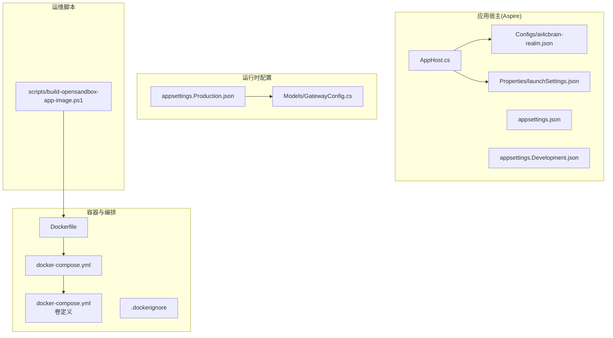
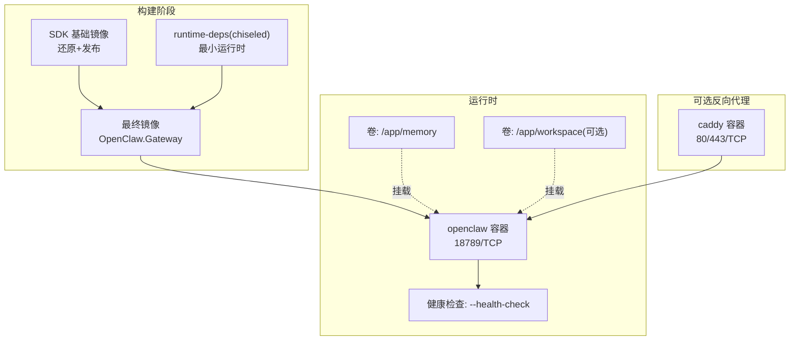
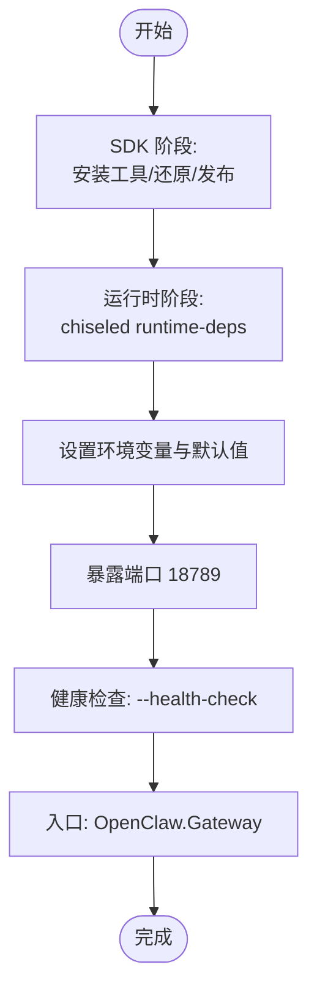
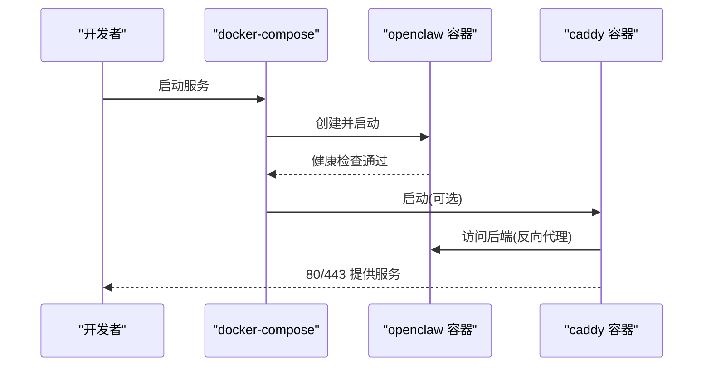
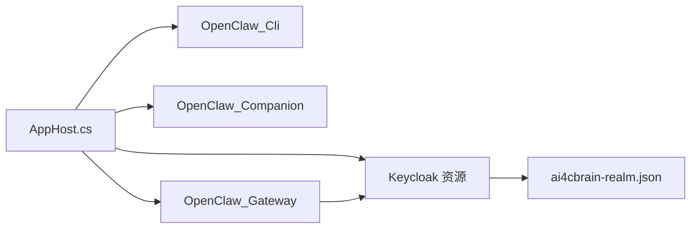
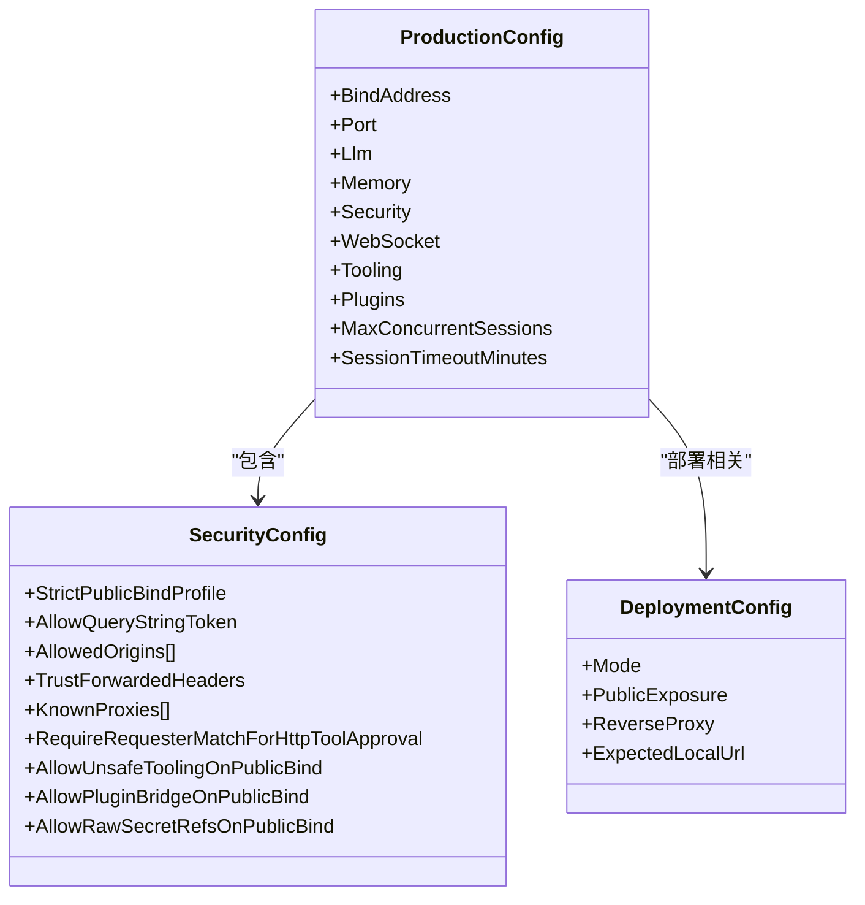
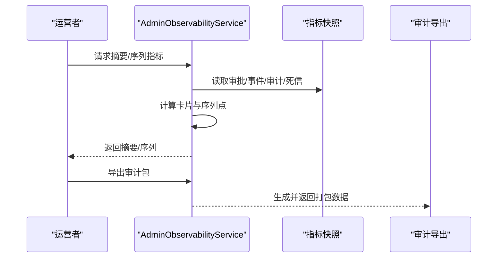
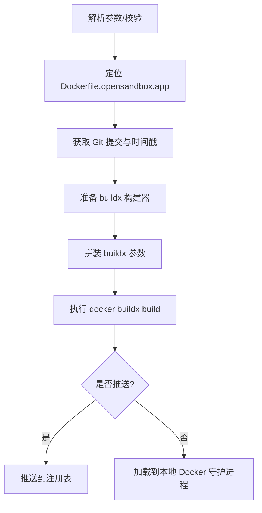
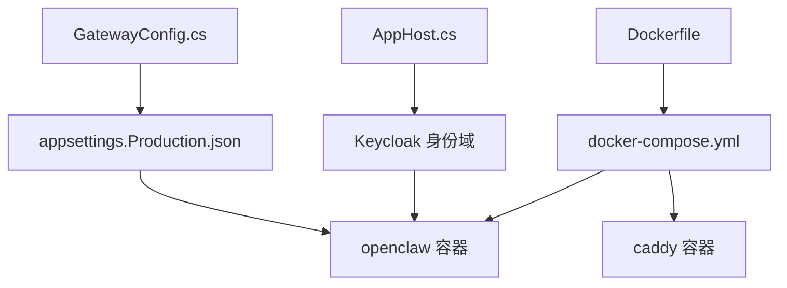

# 部署拓扑

<cite>
**本文引用的文件**
- [Dockerfile](file://Dockerfile)
- [docker-compose.yml](file://docker-compose.yml)
- [Kingcrab.AppHost\AppHost.cs](file://Kingcrab.AppHost\AppHost.cs)
- [Kingcrab.AppHost\appsettings.json](file://Kingcrab.AppHost\appsettings.json)
- [Kingcrab.AppHost\appsettings.Development.json](file://Kingcrab.AppHost\appsettings.Development.json)
- [Kingcrab.AppHost\Properties\launchSettings.json](file://Kingcrab.AppHost\Properties\launchSettings.json)
- [Kingcrab.AppHost\Configs\ai4cbrain-realm.json](file://Kingcrab.AppHost\Configs\ai4cbrain-realm.json)
- [.dockerignore](file://.dockerignore)
- [src\OpenClaw.Gateway\appsettings.Production.json](file://src\OpenClaw.Gateway\appsettings.Production.json)
- [src\OpenClaw.Core\Models\GatewayConfig.cs](file://src\OpenClaw.Core\Models\GatewayConfig.cs)
- [src\OpenClaw.Gateway\AdminObservabilityService.cs](file://src\OpenClaw.Gateway\AdminObservabilityService.cs)
- [scripts\build-opensandbox-app-image.ps1](file://scripts\build-opensandbox-app-image.ps1)
</cite>

## 目录
1. [简介](#简介)
2. [项目结构](#项目结构)
3. [核心组件](#核心组件)
4. [架构总览](#架构总览)
5. [详细组件分析](#详细组件分析)
6. [依赖关系分析](#依赖关系分析)
7. [性能考量](#性能考量)
8. [故障排查指南](#故障排查指南)
9. [结论](#结论)
10. [附录](#附录)

## 简介
本文件面向 OpenClaw.NET 的部署拓扑与运维实践，系统化阐述容器化构建与编排、生产环境配置参数、环境变量与安全策略、单/多节点部署模式、负载均衡与高可用、网络拓扑与端口映射、数据持久化与外部服务集成、监控与日志聚合、性能调优以及不同规模部署的最佳实践与故障转移策略。内容基于仓库中的 Dockerfile、docker-compose.yml、Aspire 应用宿主配置、生产配置文件与关键模型定义进行归纳总结。

## 项目结构
OpenClaw.NET 的部署相关资产主要分布在以下位置：
- 容器化与编排：根目录的 Dockerfile、docker-compose.yml、.dockerignore
- Aspire 应用宿主：Kingcrab.AppHost 下的 AppHost.cs、配置与 Keycloak 导入
- 生产配置：src/OpenClaw.Gateway/appsettings.Production.json
- 关键模型：src/OpenClaw.Core/Models/GatewayConfig.cs（部署与安全等配置）
- 运维脚本：scripts/build-opensandbox-app-image.ps1（OpenSandbox 应用镜像构建）

图表来源
- [Dockerfile:1-59](file://Dockerfile#L1-L59)
- [docker-compose.yml:1-68](file://docker-compose.yml#L1-L68)
- [Kingcrab.AppHost\AppHost.cs:1-25](file://Kingcrab.AppHost\AppHost.cs#L1-L25)
- [Kingcrab.AppHost\Properties\launchSettings.json:1-32](file://Kingcrab.AppHost\Properties\launchSettings.json#L1-L32)
- [Kingcrab.AppHost\Configs\ai4cbrain-realm.json:1-800](file://Kingcrab.AppHost\Configs\ai4cbrain-realm.json#L1-L800)
- [src\OpenClaw.Gateway\appsettings.Production.json:1-65](file://src\OpenClaw.Gateway\appsettings.Production.json#L1-L65)
- [src\OpenClaw.Core\Models\GatewayConfig.cs:719-867](file://src\OpenClaw.Core\Models\GatewayConfig.cs#L719-L867)
- [scripts\build-opensandbox-app-image.ps1:1-141](file://scripts\build-opensandbox-app-image.ps1#L1-L141)

章节来源
- [Dockerfile:1-59](file://Dockerfile#L1-L59)
- [docker-compose.yml:1-68](file://docker-compose.yml#L1-L68)
- [Kingcrab.AppHost\AppHost.cs:1-25](file://Kingcrab.AppHost\AppHost.cs#L1-L25)
- [Kingcrab.AppHost\Properties\launchSettings.json:1-32](file://Kingcrab.AppHost\Properties\launchSettings.json#L1-L32)
- [Kingcrab.AppHost\Configs\ai4cbrain-realm.json:1-800](file://Kingcrab.AppHost\Configs\ai4cbrain-realm.json#L1-L800)
- [src\OpenClaw.Gateway\appsettings.Production.json:1-65](file://src\OpenClaw.Gateway\appsettings.Production.json#L1-L65)
- [src\OpenClaw.Core\Models\GatewayConfig.cs:719-867](file://src\OpenClaw.Core\Models\GatewayConfig.cs#L719-L867)
- [scripts\build-opensandbox-app-image.ps1:1-141](file://scripts\build-opensandbox-app-image.ps1#L1-L141)

## 核心组件
- 容器镜像构建与运行
  - 多阶段构建：SDK 阶段用于还原与发布，运行时阶段采用精简的 runtime-deps 基础镜像，启用 chiseled 以减小体积。
  - 默认监听地址与端口：通过环境变量 OpenClaw__BindAddress 与 OpenClaw__Port 控制；默认暴露 18789。
  - 健康检查：通过入口参数执行内置健康检查命令。
- Compose 编排
  - 单实例服务 openclaw：端口映射 18789:18789，挂载内存卷与可选工作区卷，要求设置模型密钥与认证令牌。
  - 可选反向代理 caddy：自动 TLS，按条件依赖 openclaw 健康状态。
- Aspire 应用宿主
  - 集成 Keycloak 身份域导入与初始化，演示本地开发与资源编排。
- 生产配置
  - 包含绑定地址、端口、LLM 提供商与超时、内存存储路径与容量、安全策略、WebSocket 限制、工具沙箱权限、插件开关、并发会话与会话超时等。
- 关键模型
  - DeploymentConfig、SecurityConfig 等模型定义了部署模式、公共暴露、反向代理、信任转发头、代理列表、通道路由等。

章节来源
- [Dockerfile:35-59](file://Dockerfile#L35-L59)
- [docker-compose.yml:3-68](file://docker-compose.yml#L3-L68)
- [Kingcrab.AppHost\AppHost.cs:9-24](file://Kingcrab.AppHost\AppHost.cs#L9-L24)
- [src\OpenClaw.Gateway\appsettings.Production.json:1-65](file://src\OpenClaw.Gateway\appsettings.Production.json#L1-L65)
- [src\OpenClaw.Core\Models\GatewayConfig.cs:719-867](file://src\OpenClaw.Core\Models\GatewayConfig.cs#L719-L867)

## 架构总览
下图展示容器化部署与编排的整体视图，涵盖镜像构建、服务编排、反向代理、卷与环境变量、健康检查与启动流程。

图表来源
- [Dockerfile:1-59](file://Dockerfile#L1-L59)
- [docker-compose.yml:4-68](file://docker-compose.yml#L4-L68)

章节来源
- [Dockerfile:1-59](file://Dockerfile#L1-L59)
- [docker-compose.yml:1-68](file://docker-compose.yml#L1-L68)

## 详细组件分析

### 组件一：容器镜像构建（Dockerfile）
- 分层策略
  - SDK 阶段安装 AOT 必需工具，复制项目清单以优化缓存，还原并发布网关为单文件二进制。
  - 运行时阶段使用 chiseled 的 runtime-deps，非 root 用户运行，设置工作目录与内存目录。
- 环境变量与默认值
  - 默认绑定地址、端口、内存存储路径、工具沙箱读写根目录、插件开关等。
- 健康检查与入口
  - 健康检查通过入口参数触发；入口为网关可执行文件。

图表来源
- [Dockerfile:1-59](file://Dockerfile#L1-L59)

章节来源
- [Dockerfile:1-59](file://Dockerfile#L1-L59)

### 组件二：Compose 编排（docker-compose.yml）
- 服务定义
  - openclaw：镜像或本地构建，端口映射 18789:18789，挂载内存卷与工作区卷，设置必需环境变量与可选覆盖项。
  - caddy：可选反向代理，80/443 映射，挂载配置与数据卷，依赖 openclaw 健康。
- 卷管理
  - openclaw-memory：持久化内存数据。
  - 可选工作区卷：挂载宿主机路径到 /app/workspace。
- 健康检查
  - 使用与镜像一致的健康检查命令与间隔。

图表来源
- [docker-compose.yml:3-68](file://docker-compose.yml#L3-L68)

章节来源
- [docker-compose.yml:1-68](file://docker-compose.yml#L1-L68)

### 组件三：Aspire 应用宿主与 Keycloak 集成
- 资源编排
  - 添加 Keycloak 资源，导入 ai4cbrain-realm.json，并设置管理员账户。
  - 关联 CLI、Companion 与 Gateway 项目，Gateway 显式等待 Keycloak 就绪。
- 开发配置
  - launchSettings.json 提供 HTTPS/HTTP 启动配置与 Aspire 仪表盘端点。
  - AppHost 的日志级别在不同配置文件中设定。

图表来源
- [Kingcrab.AppHost\AppHost.cs:1-25](file://Kingcrab.AppHost\AppHost.cs#L1-L25)
- [Kingcrab.AppHost\Properties\launchSettings.json:1-32](file://Kingcrab.AppHost\Properties\launchSettings.json#L1-L32)
- [Kingcrab.AppHost\Configs\ai4cbrain-realm.json:1-800](file://Kingcrab.AppHost\Configs\ai4cbrain-realm.json#L1-L800)

章节来源
- [Kingcrab.AppHost\AppHost.cs:1-25](file://Kingcrab.AppHost\AppHost.cs#L1-L25)
- [Kingcrab.AppHost\Properties\launchSettings.json:1-32](file://Kingcrab.AppHost\Properties\launchSettings.json#L1-L32)
- [Kingcrab.AppHost\Configs\ai4cbrain-realm.json:1-800](file://Kingcrab.AppHost\Configs\ai4cbrain-realm.json#L1-L800)

### 组件四：生产环境配置与安全策略
- 绑定与端口
  - 默认绑定地址与端口由生产配置与环境变量共同决定。
- LLM 与重试
  - 提供商、模型、超时、重试次数、熔断阈值与冷却时间。
- 内存与会话
  - 存储路径、历史轮次上限、会话缓存数量、压缩阈值；并发会话与会话超时。
- 安全策略
  - 是否允许查询字符串令牌、允许的来源、是否信任转发头、已知代理列表、公共绑定下的工具与插件限制。
- WebSocket 与工具沙箱
  - 最大消息大小、最大连接数、每 IP 连接数、每连接每分钟消息数、接收超时；是否允许 Shell、只读模式、读写根目录、工具超时。
- 插件与日志
  - 插件开关；日志级别配置。

图表来源
- [src\OpenClaw.Gateway\appsettings.Production.json:1-65](file://src\OpenClaw.Gateway\appsettings.Production.json#L1-L65)
- [src\OpenClaw.Core\Models\GatewayConfig.cs:331-352](file://src\OpenClaw.Core\Models\GatewayConfig.cs#L331-L352)
- [src\OpenClaw.Core\Models\GatewayConfig.cs:855-867](file://src\OpenClaw.Core\Models\GatewayConfig.cs#L855-L867)

章节来源
- [src\OpenClaw.Gateway\appsettings.Production.json:1-65](file://src\OpenClaw.Gateway\appsettings.Production.json#L1-L65)
- [src\OpenClaw.Core\Models\GatewayConfig.cs:331-352](file://src\OpenClaw.Core\Models\GatewayConfig.cs#L331-L352)
- [src\OpenClaw.Core\Models\GatewayConfig.cs:855-867](file://src\OpenClaw.Core\Models\GatewayConfig.cs#L855-L867)

### 组件五：监控与可观测性
- 观测指标与导出
  - 支持构建摘要卡片、系列指标、审计导出包等能力，便于生成运营报表与问题定位。
- 时间范围与保留
  - 支持指定起止时间窗口、桶大小、默认窗口与保留策略。

图表来源
- [src\OpenClaw.Gateway\AdminObservabilityService.cs:117-229](file://src\OpenClaw.Gateway\AdminObservabilityService.cs#L117-L229)

章节来源
- [src\OpenClaw.Gateway\AdminObservabilityService.cs:117-229](file://src\OpenClaw.Gateway\AdminObservabilityService.cs#L117-L229)

### 组件六：OpenSandbox 应用镜像构建脚本
- 构建模式
  - 基于预构建的 base 镜像快速构建应用镜像，支持多平台与推送。
- 关键参数
  - 注册表前缀、标签、基础镜像、平台、是否推送、是否拉取最新 base、MSBuild 配置。
- 构建上下文
  - 通过 build-arg 传递配置与启用标志，设置 OCI 元数据标签。

图表来源
- [scripts\build-opensandbox-app-image.ps1:1-141](file://scripts\build-opensandbox-app-image.ps1#L1-L141)

章节来源
- [scripts\build-opensandbox-app-image.ps1:1-141](file://scripts\build-opensandbox-app-image.ps1#L1-L141)

## 依赖关系分析
- 组件耦合
  - Dockerfile 与 docker-compose.yml 强耦合：镜像标签、端口、环境变量、卷均需保持一致。
  - Aspire AppHost 与 Keycloak 导入：开发阶段的关键依赖，确保身份域可用。
  - 生产配置与运行时行为：安全策略、工具沙箱、WebSocket 限制直接影响部署安全与性能。
- 外部依赖
  - 反向代理（caddy）：可选但推荐用于公网暴露与自动 TLS。
  - LLM 提供商：通过环境变量注入密钥与端点，影响运行时可用性与成本控制。
- 循环依赖
  - 当前未发现直接循环依赖；Aspire 资源导入与网关服务之间为单向依赖。

图表来源
- [Dockerfile:1-59](file://Dockerfile#L1-L59)
- [docker-compose.yml:1-68](file://docker-compose.yml#L1-L68)
- [Kingcrab.AppHost\AppHost.cs:1-25](file://Kingcrab.AppHost\AppHost.cs#L1-L25)
- [src\OpenClaw.Gateway\appsettings.Production.json:1-65](file://src\OpenClaw.Gateway\appsettings.Production.json#L1-L65)
- [src\OpenClaw.Core\Models\GatewayConfig.cs:719-867](file://src\OpenClaw.Core\Models\GatewayConfig.cs#L719-L867)

章节来源
- [Dockerfile:1-59](file://Dockerfile#L1-L59)
- [docker-compose.yml:1-68](file://docker-compose.yml#L1-L68)
- [Kingcrab.AppHost\AppHost.cs:1-25](file://Kingcrab.AppHost\AppHost.cs#L1-L25)
- [src\OpenClaw.Gateway\appsettings.Production.json:1-65](file://src\OpenClaw.Gateway\appsettings.Production.json#L1-L65)
- [src\OpenClaw.Core\Models\GatewayConfig.cs:719-867](file://src\OpenClaw.Core\Models\GatewayConfig.cs#L719-L867)

## 性能考量
- 镜像与运行时
  - 使用 chiseled runtime-deps 降低镜像体积与攻击面；多阶段构建减少最终镜像层数。
- 并发与会话
  - 通过 MaxConcurrentSessions 与 SessionTimeoutMinutes 控制资源占用与回收效率。
- WebSocket 限流
  - 通过 MaxMessageBytes、MaxConnections、MaxConnectionsPerIp、MessagesPerMinutePerConnection 等参数限制资源消耗。
- 工具沙箱
  - 严格限制 AllowedReadRoots/AllowedWriteRoots，避免不必要的磁盘访问；禁用 Shell 降低风险。
- LLM 与熔断
  - 合理设置 TimeoutSeconds、RetryCount、CircuitBreakerThreshold 与 CoolDownSeconds，平衡吞吐与稳定性。
- 日志级别
  - 在生产环境中适度降低日志级别，避免 I/O 抖动。

## 故障排查指南
- 健康检查失败
  - 检查镜像健康检查命令与容器入口参数一致性；确认必要环境变量（如模型密钥、认证令牌）已正确设置。
- 端口冲突
  - 确认宿主机端口 18789 未被占用；若使用反向代理，检查 80/443 映射与证书配置。
- 权限与卷
  - 确认 /app/memory 与 /app/workspace 的挂载路径与权限；chiseled 镜像默认非 root 用户运行。
- 安全策略
  - 若绑定到非回环地址，确保工具与插件配置符合安全策略；必要时启用 TrustForwardedHeaders 并配置 KnownProxies。
- 观测性
  - 利用 AdminObservabilityService 的摘要与序列接口定位异常时段与错误来源；导出审计包辅助复盘。

章节来源
- [Dockerfile:55-56](file://Dockerfile#L55-L56)
- [docker-compose.yml:37-42](file://docker-compose.yml#L37-L42)
- [src\OpenClaw.Gateway\appsettings.Production.json:22-30](file://src\OpenClaw.Gateway\appsettings.Production.json#L22-L30)
- [src\OpenClaw.Gateway\AdminObservabilityService.cs:117-229](file://src\OpenClaw.Gateway\AdminObservabilityService.cs#L117-L229)

## 结论
OpenClaw.NET 的部署拓扑以多阶段容器镜像为基础，结合 docker-compose 实现单节点快速上线，并通过可选反向代理实现公网安全暴露。生产配置与安全策略共同保障了在公共绑定下的可控风险与稳定运行。配合 Aspire 的资源编排与 Keycloak 的身份域导入，开发与运维体验得到显著提升。通过可观测性接口与脚本化构建流程，团队可在不同规模场景下实现高效迭代与可靠交付。

## 附录
- 单节点 vs 多节点部署
  - 单节点：使用 docker-compose 单实例 openclaw，适合开发测试与小规模生产。
  - 多节点：建议引入反向代理与负载均衡（如 Nginx/HAProxy），结合外部数据库与对象存储实现状态共享与扩展；根据业务流量与 SLA 调整副本数与资源配额。
- 负载均衡与高可用
  - 反向代理前置统一入口，开启健康检查与会话粘性策略；对 LLM 提供商实施熔断与降级策略；对关键卷与存储采用持久化与备份方案。
- 网络拓扑与端口映射
  - openclaw: 18789/TCP；caddy: 80/443/TCP（可选）；反向代理依赖 openclaw 健康状态。
- 数据持久化与外部服务
  - /app/memory 持久化；/app/workspace 可选挂载；外部服务通过环境变量注入密钥与端点；建议使用密钥管理服务与网络隔离。
- 监控与日志
  - 使用 AdminObservabilityService 的摘要与序列接口；结合日志聚合与告警策略；定期导出审计包归档。
- 性能调优与最佳实践
  - 合理设置并发会话与会话超时；限制 WebSocket 消息与连接；严格工具沙箱策略；启用熔断与重试；优化日志级别与采样。