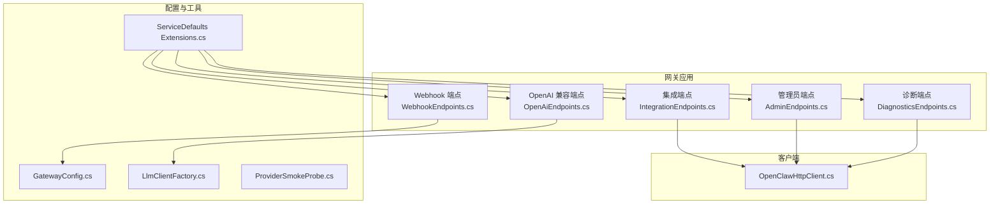
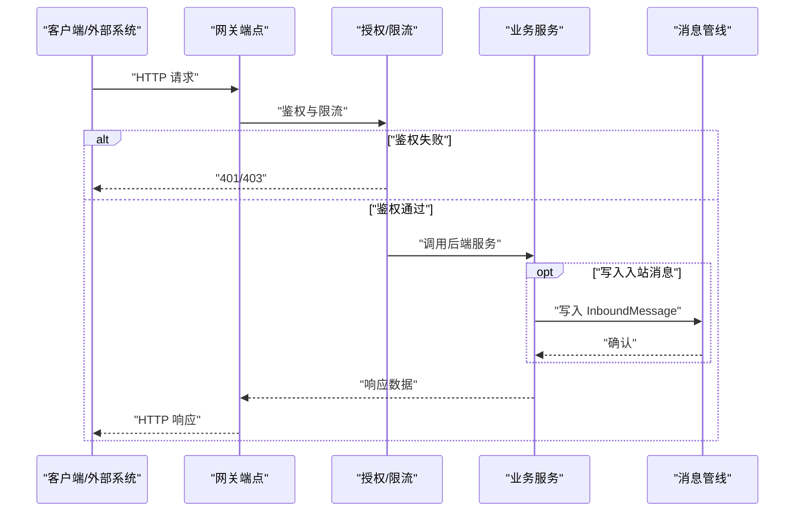
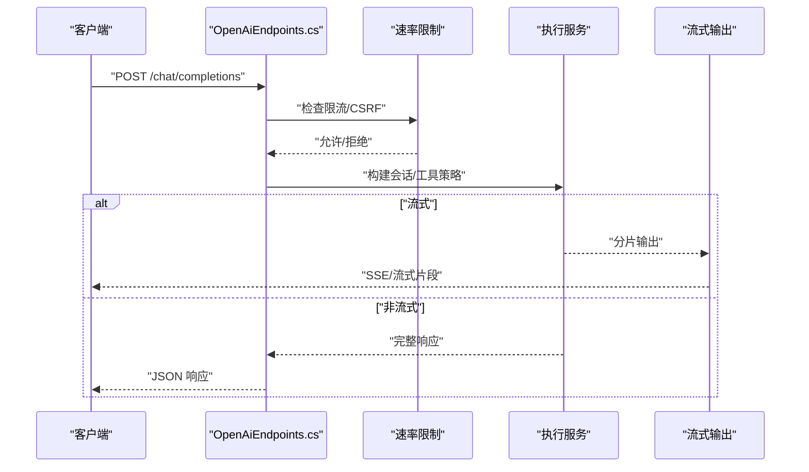
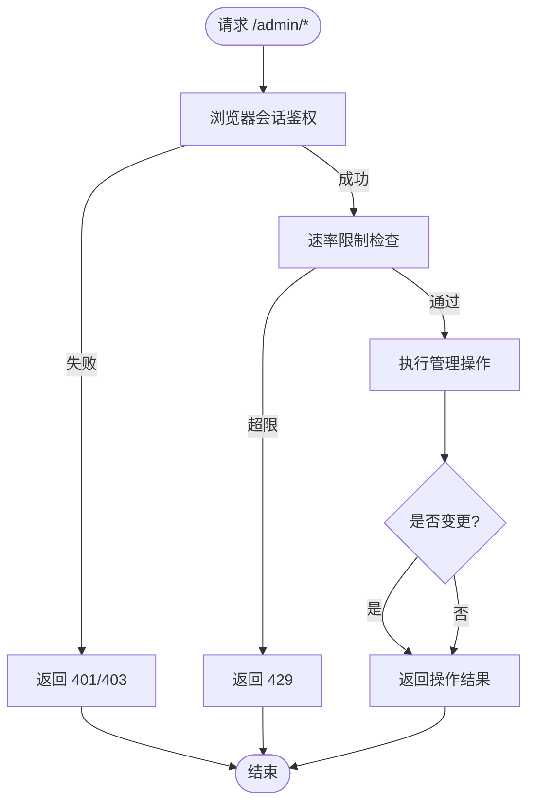
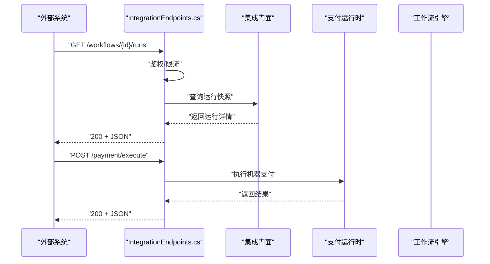
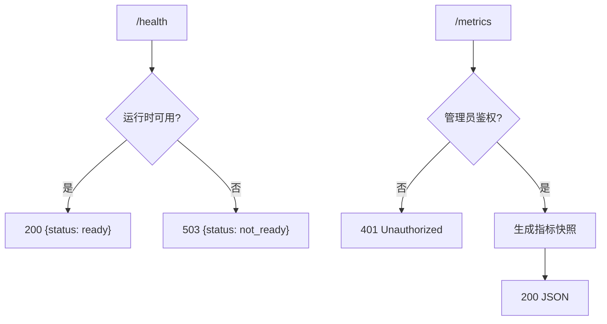
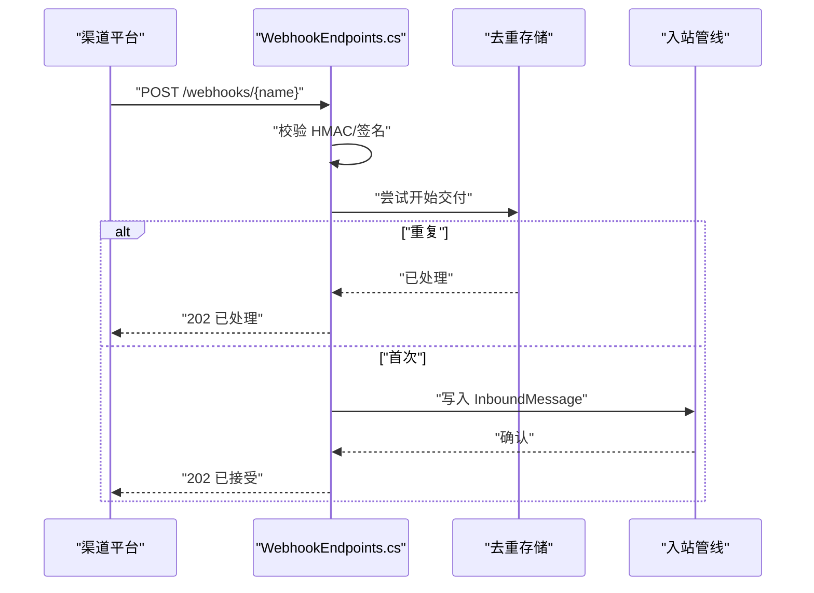
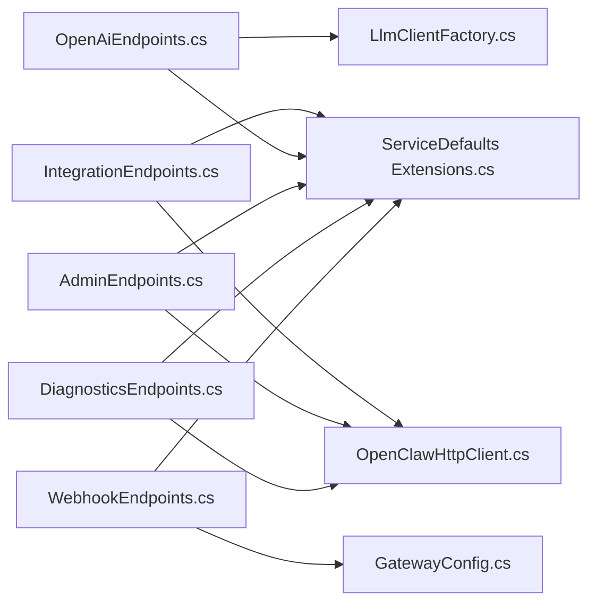

# HTTP API 端点

<cite>
**本文引用的文件**
- [OpenAiEndpoints.cs](file://src/OpenClaw.Gateway/Endpoints/OpenAiEndpoints.cs)
- [IntegrationEndpoints.cs](file://src/OpenClaw.Gateway/Endpoints/IntegrationEndpoints.cs)
- [AdminEndpoints.cs](file://src/OpenClaw.Gateway/Endpoints/AdminEndpoints.cs)
- [AdminChannelEndpoints.cs](file://src/OpenClaw.Gateway/Endpoints/AdminChannelEndpoints.cs)
- [DiagnosticsEndpoints.cs](file://src/OpenClaw.Gateway/Endpoints/DiagnosticsEndpoints.cs)
- [WebhookEndpoints.cs](file://src/OpenClaw.Gateway/Endpoints/WebhookEndpoints.cs)
- [OpenClawHttpClient.cs](file://src/OpenClaw.Client/OpenClawHttpClient.cs)
- [GatewayConfig.cs](file://src/OpenClaw.Core/Models/GatewayConfig.cs)
- [ProviderSmokeProbe.cs](file://src/OpenClaw.Core/Validation/ProviderSmokeProbe.cs)
- [LlmClientFactory.cs](file://src/OpenClaw.Gateway/Extensions/LlmClientFactory.cs)
- [Extensions.cs](file://Kingcrab.ServiceDefaults/Extensions.cs)
</cite>

## 目录
1. [简介](#简介)
2. [项目结构](#项目结构)
3. [核心组件](#核心组件)
4. [架构总览](#架构总览)
5. [详细端点文档](#详细端点文档)
   1. [OpenAI 兼容接口](#openai-兼容接口)
   2. [管理员端点](#管理员端点)
   3. [集成端点](#集成端点)
   4. [诊断与可观测性端点](#诊断与可观测性端点)
   5. [Webhook 接入端点](#webhook-接入端点)
6. [依赖关系分析](#依赖关系分析)
7. [性能与流式处理](#性能与流式处理)
8. [故障排查指南](#故障排查指南)
9. [结论](#结论)

## 简介
本文件系统化梳理了 Kingcrab/OpenClaw 网关的 HTTP API 端点，覆盖 OpenAI 兼容接口、管理员端点、集成端点、诊断与可观测性端点以及各类渠道 Webhook 接入。文档对每个端点提供 HTTP 方法、URL 模式、请求/响应结构、认证方式、错误处理、状态码说明，并补充流式响应、批量操作与实时通信相关能力。

## 项目结构
- 网关层通过 Endpoints 命名空间下的多个文件注册路由，按功能域划分：OpenAI 兼容、集成、管理、诊断、Webhook 等。
- 客户端通过 OpenClawHttpClient 统一构造管理端与集成端的 API URI，便于跨服务调用。
- 配置模型 GatewayConfig 决定各渠道 Webhook 路径、验证参数等，影响端点暴露与安全策略。

**图表来源**
- [OpenAiEndpoints.cs:13-20](file://src/OpenClaw.Gateway/Endpoints/OpenAiEndpoints.cs#L13-L20)
- [IntegrationEndpoints.cs:13-40](file://src/OpenClaw.Gateway/Endpoints/IntegrationEndpoints.cs#L13-L40)
- [AdminEndpoints.cs:32-162](file://src/OpenClaw.Gateway/Endpoints/AdminEndpoints.cs#L32-L162)
- [DiagnosticsEndpoints.cs:18-80](file://src/OpenClaw.Gateway/Endpoints/DiagnosticsEndpoints.cs#L18-L80)
- [WebhookEndpoints.cs:16-673](file://src/OpenClaw.Gateway/Endpoints/WebhookEndpoints.cs#L16-L673)
- [OpenClawHttpClient.cs:153-170](file://src/OpenClaw.Client/OpenClawHttpClient.cs#L153-L170)
- [GatewayConfig.cs:550-573](file://src/OpenClaw.Core/Models/GatewayConfig.cs#L550-L573)
- [LlmClientFactory.cs:256-274](file://src/OpenClaw.Gateway/Extensions/LlmClientFactory.cs#L256-L274)
- [ProviderSmokeProbe.cs:276-292](file://src/OpenClaw.Core/Validation/ProviderSmokeProbe.cs#L276-L292)
- [Extensions.cs:128-146](file://Kingcrab.ServiceDefaults/Extensions.cs#L128-L146)

**章节来源**
- [OpenAiEndpoints.cs:13-20](file://src/OpenClaw.Gateway/Endpoints/OpenAiEndpoints.cs#L13-L20)
- [IntegrationEndpoints.cs:13-40](file://src/OpenClaw.Gateway/Endpoints/IntegrationEndpoints.cs#L13-L40)
- [AdminEndpoints.cs:32-162](file://src/OpenClaw.Gateway/Endpoints/AdminEndpoints.cs#L32-L162)
- [DiagnosticsEndpoints.cs:18-80](file://src/OpenClaw.Gateway/Endpoints/DiagnosticsEndpoints.cs#L18-L80)
- [WebhookEndpoints.cs:16-673](file://src/OpenClaw.Gateway/Endpoints/WebhookEndpoints.cs#L16-L673)
- [OpenClawHttpClient.cs:153-170](file://src/OpenClaw.Client/OpenClawHttpClient.cs#L153-L170)
- [GatewayConfig.cs:550-573](file://src/OpenClaw.Core/Models/GatewayConfig.cs#L550-L573)
- [LlmClientFactory.cs:256-274](file://src/OpenClaw.Gateway/Extensions/LlmClientFactory.cs#L256-L274)
- [ProviderSmokeProbe.cs:276-292](file://src/OpenClaw.Core/Validation/ProviderSmokeProbe.cs#L276-L292)
- [Extensions.cs:128-146](file://Kingcrab.ServiceDefaults/Extensions.cs#L128-L146)

## 核心组件
- OpenAI 兼容端点：提供聊天补全与流式响应等能力，支持会话头与工具策略控制。
- 集成端点：面向外部系统与仪表盘的只读/变更接口，含工作流、自动化、支付、兼容性导出等。
- 管理端点：面向运营人员的配置、账户、策略、维护等管理能力。
- 诊断端点：健康检查、指标导出、组织策略查询等。
- Webhook 端点：多渠道入站消息接入，含签名验证、去重、死信记录等。

**章节来源**
- [OpenAiEndpoints.cs:13-20](file://src/OpenClaw.Gateway/Endpoints/OpenAiEndpoints.cs#L13-L20)
- [IntegrationEndpoints.cs:13-40](file://src/OpenClaw.Gateway/Endpoints/IntegrationEndpoints.cs#L13-L40)
- [AdminEndpoints.cs:32-162](file://src/OpenClaw.Gateway/Endpoints/AdminEndpoints.cs#L32-L162)
- [DiagnosticsEndpoints.cs:18-80](file://src/OpenClaw.Gateway/Endpoints/DiagnosticsEndpoints.cs#L18-L80)
- [WebhookEndpoints.cs:16-673](file://src/OpenClaw.Gateway/Endpoints/WebhookEndpoints.cs#L16-L673)

## 架构总览
下图展示端到端调用链：客户端或外部系统发起请求，经由网关端点进行鉴权与限流，再进入业务处理管线或直接返回结果；Webhook 端点负责渠道入站消息的校验与去重。

**图表来源**
- [IntegrationEndpoints.cs:22-40](file://src/OpenClaw.Gateway/Endpoints/IntegrationEndpoints.cs#L22-L40)
- [WebhookEndpoints.cs:25-101](file://src/OpenClaw.Gateway/Endpoints/WebhookEndpoints.cs#L25-L101)

**章节来源**
- [IntegrationEndpoints.cs:22-40](file://src/OpenClaw.Gateway/Endpoints/IntegrationEndpoints.cs#L22-L40)
- [WebhookEndpoints.cs:25-101](file://src/OpenClaw.Gateway/Endpoints/WebhookEndpoints.cs#L25-L101)

## 详细端点文档

### OpenAI 兼容接口
- 路由前缀：/v1（在 OpenAI 兼容端点中映射）
- 支持方法：POST
- 路由列表
  - POST /chat/completions
  - POST /completions（如存在）
- 认证与限流
  - 使用统一的 Operator 浏览器会话鉴权与 CSRF 校验。
  - 受速率限制策略保护，违规返回 429 或错误响应。
- 请求体要点
  - 支持流式响应（stream），客户端需正确处理 SSE/流式片段。
  - 支持会话头 X-OpenClaw-Session-Id 以维持稳定会话。
  - 工具调用策略受模型配置与预设影响，可抑制隐式工具。
- 响应与状态码
  - 成功：200（非流式）或 200（流式 SSE）。
  - 失败：400/401/403/429/500 等，携带统一错误响应体。
- 使用场景
  - 与 OpenAI SDK 兼容的聊天机器人、代理编排、工具调用编排。

**图表来源**
- [OpenAiEndpoints.cs:13-20](file://src/OpenClaw.Gateway/Endpoints/OpenAiEndpoints.cs#L13-L20)
- [OpenAiEndpoints.cs:22-45](file://src/OpenClaw.Gateway/Endpoints/OpenAiEndpoints.cs#L22-L45)

**章节来源**
- [OpenAiEndpoints.cs:13-20](file://src/OpenClaw.Gateway/Endpoints/OpenAiEndpoints.cs#L13-L20)
- [OpenAiEndpoints.cs:22-45](file://src/OpenClaw.Gateway/Endpoints/OpenAiEndpoints.cs#L22-L45)

### 管理员端点
- 路由前缀：/admin
- 主要路由
  - GET /admin/models
  - GET /admin/models/doctor
  - GET /admin/models/evaluations
  - GET /admin/external-cli/connectors
  - GET /admin/external-cli/preview
  - POST /admin/external-cli/execute
  - POST /admin/approvals/simulate
  - POST /tools/approve
  - GET /admin/accounts/test-resolution
  - GET /admin/backends
  - GET /admin/incident/export
  - POST /auth/operator-token
  - GET /admin/operator-accounts
  - PUT /admin/operator-accounts/{username}
  - GET /admin/organization-policy
  - GET /admin/setup/status
  - GET /admin/insights
  - GET /admin/observability/summary
  - GET /admin/observability/series
  - GET /admin/channels/{channel}
  - POST /admin/channels/{channel}/update
- 认证与限流
  - 需要管理员浏览器会话鉴权，部分变更类操作要求 CSRF。
  - 受策略限制的速率限制保护。
- 错误处理
  - 404：未知渠道或资源不存在。
  - 429：超过策略限流。
  - 400/500：参数错误或后端异常。
- 使用场景
  - 运营面板、配置热更、审批模拟、外部 CLI 执行、可观测性洞察。

**图表来源**
- [AdminEndpoints.cs:32-162](file://src/OpenClaw.Gateway/Endpoints/AdminEndpoints.cs#L32-L162)
- [AdminChannelEndpoints.cs:20-71](file://src/OpenClaw.Gateway/Endpoints/AdminChannelEndpoints.cs#L20-L71)

**章节来源**
- [AdminEndpoints.cs:32-162](file://src/OpenClaw.Gateway/Endpoints/AdminEndpoints.cs#L32-L162)
- [AdminChannelEndpoints.cs:20-71](file://src/OpenClaw.Gateway/Endpoints/AdminChannelEndpoints.cs#L20-L71)
- [OpenClawHttpClient.cs:153-170](file://src/OpenClaw.Client/OpenClawHttpClient.cs#L153-L170)

### 集成端点
- 路由前缀：/api/integration
- 主要路由
  - GET /dashboard
  - GET /status
  - GET /approvals
  - GET /approval-history
  - GET /providers
  - GET /plugins
  - GET /compatibility/catalog
  - GET /compatibility/export
  - GET /operator-audit
  - GET /sessions
  - GET /sessions/{id}
  - GET /sessions/{id}/timeline
  - GET /session-search
  - GET /profiles
  - GET /profiles/{actorId}
  - PUT /profiles/{actorId}
  - GET /automations
  - GET /automations/templates
  - GET /automations/{id}
  - GET /automations/{id}/runs
  - GET /automations/{id}/runs/{runId}
  - POST /automations/{id}/run
  - POST /automations/{id}/runs/{runId}/replay
  - POST /automations/{id}/quarantine/clear
  - DELETE /automations/{id}
  - GET /runtime-events
  - GET /payment/setup
  - GET /payment/funding
  - POST /payment/virtual-card
  - POST /payment/execute
  - GET /payment/status/{id}
  - POST /text-to-speech
  - GET /tool-presets
  - GET /workflows
  - POST /workflows/{workflowId}/runs
  - GET /workflows/{workflowId}/runs/{runId}
  - POST /workflows/{workflowId}/runs/{runId}/responses
- 认证与限流
  - 需要浏览器会话鉴权，部分变更类操作要求 CSRF。
  - 读取类默认不强制 CSRF。
- 错误处理
  - 400：请求体无效或必填字段缺失。
  - 404：资源不存在。
  - 403/401：鉴权失败。
  - 500：后端异常。
- 使用场景
  - 第三方系统对接、自动化编排、支付能力集成、文本转语音、工作流执行与追踪。

**图表来源**
- [IntegrationEndpoints.cs:325-388](file://src/OpenClaw.Gateway/Endpoints/IntegrationEndpoints.cs#L325-L388)
- [IntegrationEndpoints.cs:744-785](file://src/OpenClaw.Gateway/Endpoints/IntegrationEndpoints.cs#L744-L785)

**章节来源**
- [IntegrationEndpoints.cs:13-40](file://src/OpenClaw.Gateway/Endpoints/IntegrationEndpoints.cs#L13-L40)
- [IntegrationEndpoints.cs:325-388](file://src/OpenClaw.Gateway/Endpoints/IntegrationEndpoints.cs#L325-L388)
- [IntegrationEndpoints.cs:744-785](file://src/OpenClaw.Gateway/Endpoints/IntegrationEndpoints.cs#L744-L785)

### 诊断与可观测性端点
- 路由前缀：/
- 主要路由
  - GET /health
  - GET /metrics
  - GET /metrics/providers
  - GET /admin/setup/status
- 认证与限流
  - /metrics 与 /metrics/providers 对于非开发环境默认不公开，需管理员鉴权。
  - /health 用于容器/平台健康探针。
- 错误处理
  - /health：就绪失败返回 503。
  - /metrics：鉴权失败返回 401。
- 使用场景
  - 健康巡检、指标采集、提供商状态监控、设置自检。

**图表来源**
- [DiagnosticsEndpoints.cs:51-80](file://src/OpenClaw.Gateway/Endpoints/DiagnosticsEndpoints.cs#L51-L80)
- [Extensions.cs:128-146](file://Kingcrab.ServiceDefaults/Extensions.cs#L128-L146)

**章节来源**
- [DiagnosticsEndpoints.cs:51-80](file://src/OpenClaw.Gateway/Endpoints/DiagnosticsEndpoints.cs#L51-L80)
- [Extensions.cs:128-146](file://Kingcrab.ServiceDefaults/Extensions.cs#L128-L146)

### Webhook 接入端点
- 路由前缀：由配置决定（如 /whatsapp/inbound、/webhooks/{name} 等）
- 主要路由
  - POST /webhooks/{name}
  - POST /whatsapp/inbound（官方/桥接）
  - POST /telegram/inbound
  - POST /slack/events
  - POST /slack/slash-command
  - POST /sms/twilio
  - POST /teams/webhook
  - POST /discord/webhook
  - POST /gmail/push
- 认证与安全
  - 各渠道具备独立签名验证（如 Telegram、Slack、Twilio、Discord、Gmail）。
  - 去重：基于交付键（MessageSid、event_id、hashed key 等）防止重复处理。
  - 死信记录：异常时记录死信条目，保留负载预览与回放消息。
- 错误处理
  - 400：表单内容缺失、请求体过大。
  - 401：签名验证失败或密钥缺失。
  - 413：请求体超限。
  - 500：处理异常。
- 使用场景
  - 多渠道消息接入、事件驱动触发、第三方平台回调。

**图表来源**
- [WebhookEndpoints.cs:545-632](file://src/OpenClaw.Gateway/Endpoints/WebhookEndpoints.cs#L545-L632)
- [WebhookEndpoints.cs:16-194](file://src/OpenClaw.Gateway/Endpoints/WebhookEndpoints.cs#L16-L194)

**章节来源**
- [WebhookEndpoints.cs:16-194](file://src/OpenClaw.Gateway/Endpoints/WebhookEndpoints.cs#L16-L194)
- [WebhookEndpoints.cs:545-632](file://src/OpenClaw.Gateway/Endpoints/WebhookEndpoints.cs#L545-L632)
- [GatewayConfig.cs:550-573](file://src/OpenClaw.Core/Models/GatewayConfig.cs#L550-L573)

## 依赖关系分析
- 端点与服务
  - OpenAI 兼容端点依赖 LLM 客户端工厂与模型配置。
  - 集成端点依赖集成门面与支付运行时。
  - 管理端点依赖浏览器会话、组织策略、维护运行时等。
  - Webhook 端点依赖各渠道处理器与去重存储。
- 配置与安全
  - GatewayConfig 决定 Webhook 路径、验证开关与最大请求大小。
  - ProviderSmokeProbe 提供提供商凭据与认证模式判断逻辑。
- 默认端点
  - ServiceDefaults 的扩展在开发环境自动注册 /health 与 /alive 健康检查。

**图表来源**
- [OpenAiEndpoints.cs:13-20](file://src/OpenClaw.Gateway/Endpoints/OpenAiEndpoints.cs#L13-L20)
- [IntegrationEndpoints.cs:13-40](file://src/OpenClaw.Gateway/Endpoints/IntegrationEndpoints.cs#L13-L40)
- [AdminEndpoints.cs:32-162](file://src/OpenClaw.Gateway/Endpoints/AdminEndpoints.cs#L32-L162)
- [DiagnosticsEndpoints.cs:18-80](file://src/OpenClaw.Gateway/Endpoints/DiagnosticsEndpoints.cs#L18-L80)
- [WebhookEndpoints.cs:16-673](file://src/OpenClaw.Gateway/Endpoints/WebhookEndpoints.cs#L16-L673)
- [OpenClawHttpClient.cs:153-170](file://src/OpenClaw.Client/OpenClawHttpClient.cs#L153-L170)
- [GatewayConfig.cs:550-573](file://src/OpenClaw.Core/Models/GatewayConfig.cs#L550-L573)
- [LlmClientFactory.cs:256-274](file://src/OpenClaw.Gateway/Extensions/LlmClientFactory.cs#L256-L274)
- [ProviderSmokeProbe.cs:276-292](file://src/OpenClaw.Core/Validation/ProviderSmokeProbe.cs#L276-L292)
- [Extensions.cs:128-146](file://Kingcrab.ServiceDefaults/Extensions.cs#L128-L146)

**章节来源**
- [OpenAiEndpoints.cs:13-20](file://src/OpenClaw.Gateway/Endpoints/OpenAiEndpoints.cs#L13-L20)
- [IntegrationEndpoints.cs:13-40](file://src/OpenClaw.Gateway/Endpoints/IntegrationEndpoints.cs#L13-L40)
- [AdminEndpoints.cs:32-162](file://src/OpenClaw.Gateway/Endpoints/AdminEndpoints.cs#L32-L162)
- [DiagnosticsEndpoints.cs:18-80](file://src/OpenClaw.Gateway/Endpoints/DiagnosticsEndpoints.cs#L18-L80)
- [WebhookEndpoints.cs:16-673](file://src/OpenClaw.Gateway/Endpoints/WebhookEndpoints.cs#L16-L673)
- [OpenClawHttpClient.cs:153-170](file://src/OpenClaw.Client/OpenClawHttpClient.cs#L153-L170)
- [GatewayConfig.cs:550-573](file://src/OpenClaw.Core/Models/GatewayConfig.cs#L550-L573)
- [LlmClientFactory.cs:256-274](file://src/OpenClaw.Gateway/Extensions/LlmClientFactory.cs#L256-L274)
- [ProviderSmokeProbe.cs:276-292](file://src/OpenClaw.Core/Validation/ProviderSmokeProbe.cs#L276-L292)
- [Extensions.cs:128-146](file://Kingcrab.ServiceDefaults/Extensions.cs#L128-L146)

## 性能与流式处理
- 流式响应
  - OpenAI 兼容端点支持流式输出，客户端需正确处理分片与中断。
- 请求大小限制
  - Webhook 端点按渠道配置最大请求字节，超限返回 413。
- 速率限制
  - 管理端与集成端对变更类操作启用 CSRF 与策略限流，避免滥用。
- 指标与可观测性
  - /metrics 与 /metrics/providers 导出运行时指标，辅助容量规划与问题定位。

**章节来源**
- [WebhookEndpoints.cs:27-42](file://src/OpenClaw.Gateway/Endpoints/WebhookEndpoints.cs#L27-L42)
- [IntegrationEndpoints.cs:325-357](file://src/OpenClaw.Gateway/Endpoints/IntegrationEndpoints.cs#L325-L357)
- [DiagnosticsEndpoints.cs:68-80](file://src/OpenClaw.Gateway/Endpoints/DiagnosticsEndpoints.cs#L68-L80)

## 故障排查指南
- 鉴权失败
  - 确认浏览器会话有效，变更类操作需 CSRF。
- 请求体错误
  - 检查 JSON 结构、必填字段与大小限制。
- 渠道 Webhook 重复或失败
  - 查看去重键与死信记录，确认签名与密钥配置。
- 健康与指标
  - /health 503 表示运行时不可用；/metrics 401 表示鉴权不足。

**章节来源**
- [WebhookEndpoints.cs:52-101](file://src/OpenClaw.Gateway/Endpoints/WebhookEndpoints.cs#L52-L101)
- [IntegrationEndpoints.cs:265-301](file://src/OpenClaw.Gateway/Endpoints/IntegrationEndpoints.cs#L265-L301)
- [DiagnosticsEndpoints.cs:51-80](file://src/OpenClaw.Gateway/Endpoints/DiagnosticsEndpoints.cs#L51-L80)

## 结论
本文档系统化梳理了 Kingcrab/OpenClaw 的 HTTP API 端点，覆盖 OpenAI 兼容、集成、管理、诊断与 Webhook 等领域。建议在生产环境中：
- 明确鉴权与 CSRF 策略，严格限制变更类操作。
- 合理配置渠道 Webhook 的签名与去重策略。
- 利用 /metrics 与 /admin/observability 端点持续观测系统健康。
- 对流式响应与大请求体做好客户端与服务端的边界控制。