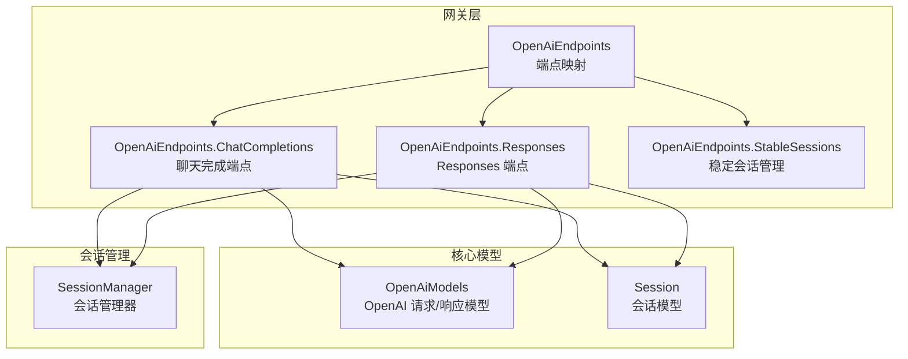
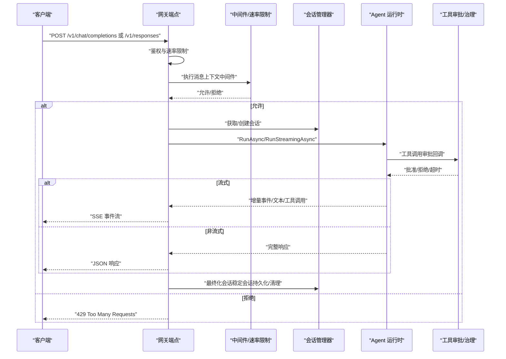
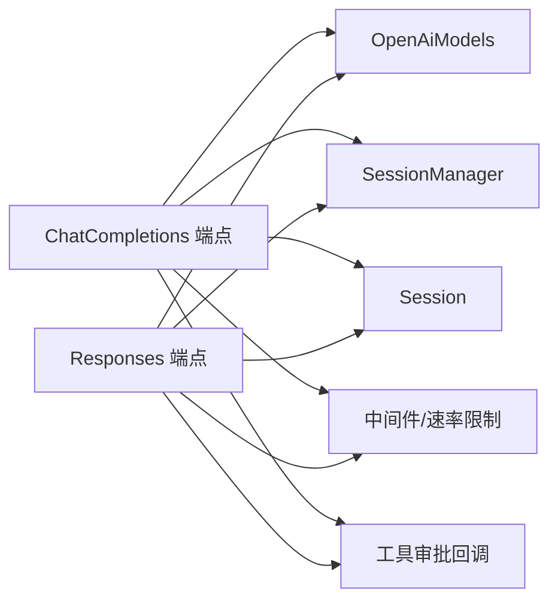

# OpenAI 兼容 API

<cite>
**本文引用的文件**
- [OpenAiEndpoints.ChatCompletions.cs](file://src/OpenClaw.Gateway/Endpoints/OpenAiEndpoints.ChatCompletions.cs)
- [OpenAiEndpoints.Responses.cs](file://src/OpenClaw.Gateway/Endpoints/OpenAiEndpoints.Responses.cs)
- [OpenAiEndpoints.cs](file://src/OpenClaw.Gateway/Endpoints/OpenAiEndpoints.cs)
- [OpenAiEndpoints.StableSessions.cs](file://src/OpenClaw.Gateway/Endpoints/OpenAiEndpoints.StableSessions.cs)
- [OpenAiModels.cs](file://src/OpenClaw.Core/Models/OpenAiModels.cs)
- [Session.cs](file://src/OpenClaw.Core/Models/Session.cs)
- [SessionManager.cs](file://src/OpenClaw.Core/Sessions/SessionManager.cs)
- [OpenClaw-Session-Management.md](file://docs/OpenClaw-Session-Management.md)
- [OpenAiEndpointTests.cs](file://src/OpenClaw.Tests/OpenAiEndpointTests.cs)
- [LocalInferenceSupervisorTests.cs](file://src/OpenClaw.Tests/LocalInferenceSupervisorTests.cs)
</cite>

## 目录
1. [简介](#简介)
2. [项目结构](#项目结构)
3. [核心组件](#核心组件)
4. [架构总览](#架构总览)
5. [详细组件分析](#详细组件分析)
6. [依赖关系分析](#依赖关系分析)
7. [性能考量](#性能考量)
8. [故障排查指南](#故障排查指南)
9. [结论](#结论)
10. [附录](#附录)

## 简介
本文件为 OpenAI 兼容 API 的详细技术文档，聚焦以下端点的完整规范与实现细节：
- POST /v1/chat/completions：聊天完成请求，支持非流式与流式响应，含工具调用与输出增量。
- POST /v1/responses：简化版响应 API，支持非流式与流式响应，提供 SSE 事件序列与工具调用结果。

文档覆盖请求格式、响应结构、流式输出格式、稳定会话管理、工具权限控制、错误处理与性能优化建议，并提供端到端的调用流程图与时序图，帮助开发者快速集成与排障。

## 项目结构
OpenAI 兼容 API 的实现位于网关层的端点映射模块，核心数据模型位于核心模型库，会话管理位于核心会话模块。整体结构如下：

图表来源
- [OpenAiEndpoints.cs:13-20](file://src/OpenClaw.Gateway/Endpoints/OpenAiEndpoints.cs#L13-L20)
- [OpenAiEndpoints.ChatCompletions.cs:12-17](file://src/OpenClaw.Gateway/Endpoints/OpenAiEndpoints.ChatCompletions.cs#L12-L17)
- [OpenAiEndpoints.Responses.cs:12-17](file://src/OpenClaw.Gateway/Endpoints/OpenAiEndpoints.Responses.cs#L12-L17)
- [OpenAiEndpoints.StableSessions.cs:1-150](file://src/OpenClaw.Gateway/Endpoints/OpenAiEndpoints.StableSessions.cs#L1-L150)
- [OpenAiModels.cs:17-571](file://src/OpenClaw.Core/Models/OpenAiModels.cs#L17-L571)
- [Session.cs:15-135](file://src/OpenClaw.Core/Models/Session.cs#L15-L135)
- [SessionManager.cs:13-36](file://src/OpenClaw.Core/Sessions/SessionManager.cs#L13-L36)

章节来源
- [OpenAiEndpoints.cs:13-20](file://src/OpenClaw.Gateway/Endpoints/OpenAiEndpoints.cs#L13-L20)
- [OpenAiEndpoints.ChatCompletions.cs:12-17](file://src/OpenClaw.Gateway/Endpoints/OpenAiEndpoints.ChatCompletions.cs#L12-L17)
- [OpenAiEndpoints.Responses.cs:12-17](file://src/OpenClaw.Gateway/Endpoints/OpenAiEndpoints.Responses.cs#L12-L17)
- [OpenAiEndpoints.StableSessions.cs:1-150](file://src/OpenClaw.Gateway/Endpoints/OpenAiEndpoints.StableSessions.cs#L1-L150)
- [OpenAiModels.cs:17-571](file://src/OpenClaw.Core/Models/OpenAiModels.cs#L17-L571)
- [Session.cs:15-135](file://src/OpenClaw.Core/Models/Session.cs#L15-L135)
- [SessionManager.cs:13-36](file://src/OpenClaw.Core/Sessions/SessionManager.cs#L13-L36)

## 核心组件
- OpenAI 请求/响应模型：定义聊天完成与 Responses API 的请求体、响应体、流式块与 SSE 事件类型。
- 会话模型与会话管理器：负责会话创建、历史管理、令牌用量统计、稳定会话绑定与持久化。
- 端点映射：将 HTTP 请求路由到 Agent 运行时，处理速率限制、中间件、工具审批回调与流式输出。

章节来源
- [OpenAiModels.cs:17-571](file://src/OpenClaw.Core/Models/OpenAiModels.cs#L17-L571)
- [Session.cs:15-135](file://src/OpenClaw.Core/Models/Session.cs#L15-L135)
- [SessionManager.cs:13-36](file://src/OpenClaw.Core/Sessions/SessionManager.cs#L13-L36)
- [OpenAiEndpoints.ChatCompletions.cs:12-17](file://src/OpenClaw.Gateway/Endpoints/OpenAiEndpoints.ChatCompletions.cs#L12-L17)
- [OpenAiEndpoints.Responses.cs:12-17](file://src/OpenClaw.Gateway/Endpoints/OpenAiEndpoints.Responses.cs#L12-L17)

## 架构总览
OpenAI 兼容 API 的请求处理链路如下：

图表来源
- [OpenAiEndpoints.ChatCompletions.cs:17-366](file://src/OpenClaw.Gateway/Endpoints/OpenAiEndpoints.ChatCompletions.cs#L17-L366)
- [OpenAiEndpoints.Responses.cs:17-612](file://src/OpenClaw.Gateway/Endpoints/OpenAiEndpoints.Responses.cs#L17-L612)
- [OpenAiEndpoints.StableSessions.cs:25-50](file://src/OpenClaw.Gateway/Endpoints/OpenAiEndpoints.StableSessions.cs#L25-L50)
- [SessionManager.cs:45-130](file://src/OpenClaw.Core/Sessions/SessionManager.cs#L45-L130)

## 详细组件分析

### /v1/chat/completions 端点
- 功能概述
  - 支持非流式与流式两种响应模式。
  - 流式输出采用 OpenAI 兼容的 chat.completion.chunk 结构，包含角色、内容增量与工具调用增量。
  - 支持稳定会话绑定与 Hydration 历史注入。
  - 集成中间件、速率限制、工具审批与治理记录。

- 请求格式
  - 路径：POST /v1/chat/completions
  - 头部：
    - Authorization：必需（由网关鉴权逻辑决定）
    - X-OpenClaw-Preset：可选，用于激活特定工具预设
    - X-OpenClaw-Session-Id：可选，稳定会话标识
  - 请求体字段（OpenAiChatCompletionRequest）：
    - model：模型名称（可选，覆盖会话模型配置）
    - messages：消息数组（至少包含一条消息）
    - stream：是否启用流式响应
    - temperature：采样温度
    - max_tokens：最大生成长度

- 非流式响应
  - 响应体：OpenAiChatCompletionResponse
  - 字段：id、object、created、model、choices、usage
  - choices[].message：assistant 回复内容
  - usage：prompt_tokens、completion_tokens、total_tokens

- 流式响应（SSE）
  - Content-Type：text/event-stream
  - 事件类型与负载：
    - 首个事件：包含角色 "assistant"
    - 后续事件：包含内容增量 "content"
    - 工具调用开始：包含 "tool_calls" 数组，包含函数名与空参数
    - 工具调用增量：包含 "openclaw_tool_delta"
    - 工具调用结果：包含 "openclaw_tool_result"
    - 结束事件："[DONE]"

- 稳定会话管理
  - 通过请求头 X-OpenClaw-Session-Id 传递稳定会话标识。
  - 网关根据请求者 IP/密钥生成命名空间，绑定外部会话 ID。
  - 若绑定不一致，返回 409；若无效，返回 400。
  - 流式场景下，会话在响应完成后进行最佳努力持久化。

- 工具权限控制
  - 通过 ToolApprovalCallbackFactory 创建审批回调，结合治理服务记录决策。
  - 当模型配置不支持工具时，可自动抑制隐式工具调用。

- 错误处理
  - 400：请求体无效、缺少必要字段、稳定会话 ID 不合法
  - 401：未授权
  - 409：稳定会话绑定不一致
  - 413：请求体过大
  - 429：速率限制或中间件短路
  - 5xx：上游提供方异常（流式场景下转换为失败事件）

- 示例
  - 请求示例路径：[OpenAiEndpointTests.cs:15-38](file://src/OpenClaw.Tests/OpenAiEndpointTests.cs#L15-L38)
  - 流式响应示例路径：[LocalInferenceSupervisorTests.cs:346-361](file://src/OpenClaw.Tests/LocalInferenceSupervisorTests.cs#L346-L361)

章节来源
- [OpenAiEndpoints.ChatCompletions.cs:17-366](file://src/OpenClaw.Gateway/Endpoints/OpenAiEndpoints.ChatCompletions.cs#L17-L366)
- [OpenAiEndpoints.StableSessions.cs:52-122](file://src/OpenClaw.Gateway/Endpoints/OpenAiEndpoints.StableSessions.cs#L52-L122)
- [OpenAiModels.cs:188-286](file://src/OpenClaw.Core/Models/OpenAiModels.cs#L188-L286)
- [OpenAiEndpointTests.cs:15-38](file://src/OpenClaw.Tests/OpenAiEndpointTests.cs#L15-L38)
- [LocalInferenceSupervisorTests.cs:346-361](file://src/OpenClaw.Tests/LocalInferenceSupervisorTests.cs#L346-L361)

### /v1/responses 端点
- 功能概述
  - 简化输入格式，支持字符串提示或结构化消息。
  - 流式输出采用 Responses API 的 SSE 事件序列，包含 response.created、response.in_progress、response.completed、response.failed 等事件。
  - 支持工具调用参数增量、工具输出增量与工具结果事件。

- 请求格式
  - 路径：POST /v1/responses
  - 头部：
    - Authorization：必需
    - X-OpenClaw-Preset：可选，激活预设
    - X-OpenClaw-Session-Id：可选，稳定会话
  - 请求体字段（OpenAiResponseRequest）：
    - model：模型名称（可选）
    - input：字符串提示或结构化消息
    - stream：是否启用流式响应
    - temperature：采样温度
    - max_output_tokens：最大输出长度

- 非流式响应
  - 响应体：OpenAiResponseResponse
  - 字段：id、object、created_at、model、status、output、usage、error

- 流式响应（SSE）
  - 事件类型与负载：
    - response.created：初始化响应对象（空 output）
    - response.in_progress：状态更新（空 output）
    - response.output_item.added：新增输出项（消息/函数调用/结果）
    - response.content_part.added/done：内容片段添加/完成
    - response.output_text.delta/done：文本增量/完成
    - response.function_call_arguments.delta/done：函数参数增量/完成
    - response.openclaw_tool_delta：工具输出增量
    - response.openclaw_tool_result：工具结果事件
    - response.completed：完成事件
    - response.failed：失败事件（包含错误码与消息）

- 稳定会话管理
  - 与聊天完成端点一致，通过请求头绑定稳定会话，冲突时返回 409。

- 工具权限控制
  - 与聊天完成端点一致，使用工具审批回调与治理记录。

- 错误处理
  - 400：缺少 input 字段、请求体无效
  - 401：未授权
  - 409：稳定会话绑定不一致
  - 429：速率限制或中间件短路
  - 5xx：上游提供方异常，转换为 response.failed 事件

- 示例
  - 流式事件序列示例路径：[LocalInferenceSupervisorTests.cs:350-357](file://src/OpenClaw.Tests/LocalInferenceSupervisorTests.cs#L350-L357)

章节来源
- [OpenAiEndpoints.Responses.cs:17-612](file://src/OpenClaw.Gateway/Endpoints/OpenAiEndpoints.Responses.cs#L17-L612)
- [OpenAiEndpoints.StableSessions.cs:52-122](file://src/OpenClaw.Gateway/Endpoints/OpenAiEndpoints.StableSessions.cs#L52-L122)
- [OpenAiModels.cs:294-570](file://src/OpenClaw.Core/Models/OpenAiModels.cs#L294-L570)
- [LocalInferenceSupervisorTests.cs:350-357](file://src/OpenClaw.Tests/LocalInferenceSupervisorTests.cs#L350-L357)

### 稳定会话管理
- 绑定规则
  - 外部会话 ID + 请求者标识生成命名空间，确保跨请求者隔离。
  - 会话创建时可选择稳定会话 ID，否则生成临时会话。
  - 绑定一致性校验失败返回 409；非法 ID 返回 400。

- 生命周期
  - 响应结束后，稳定会话进行最佳努力持久化；若无历史且未绑定则清理内存会话。
  - 会话锁用于分支、持久化与历史追加等操作的串行化。

- 安全性
  - 稳定会话 ID 长度与字符集限制，禁止路径遍历字符。

章节来源
- [OpenAiEndpoints.StableSessions.cs:52-148](file://src/OpenClaw.Gateway/Endpoints/OpenAiEndpoints.StableSessions.cs#L52-L148)
- [SessionManager.cs:474-530](file://src/OpenClaw.Core/Sessions/SessionManager.cs#L474-L530)
- [OpenClaw-Session-Management.md:1-278](file://docs/OpenClaw-Session-Management.md#L1-L278)

### 工具权限控制与治理
- 工具审批回调
  - 通过 ToolApprovalCallbackFactory 创建，结合治理服务记录批准/拒绝/超时。
  - 支持支付相关的审批决策记录。

- 隐式工具抑制
  - 当模型配置不支持工具时，可通过会话路由覆盖抑制隐式工具调用。

章节来源
- [OpenAiEndpoints.cs:22-86](file://src/OpenClaw.Gateway/Endpoints/OpenAiEndpoints.cs#L22-L86)
- [ToolApprovalCallbackFactory.cs:10-39](file://src/OpenClaw.Gateway/ToolApprovalCallbackFactory.cs#L10-L39)
- [GovernanceLedgerService.cs:140-265](file://src/OpenClaw.Gateway/GovernanceLedgerService.cs#L140-L265)

## 依赖关系分析
- 端点到模型
  - OpenAiEndpoints.ChatCompletions 与 OpenAiEndpoints.Responses 均依赖 OpenAiModels 中的请求/响应类型与流式事件类型。
- 端点到会话
  - 两端点均通过 SessionManager 获取/创建会话，使用 Session 模型维护历史与令牌用量。
- 端点到中间件与速率限制
  - 两端点均通过中间件管道执行消息上下文，支持速率限制与短路响应。
- 端点到工具审批
  - 两端点均通过 ToolApprovalCallbackFactory 创建审批回调，接入治理记录。

图表来源
- [OpenAiEndpoints.ChatCompletions.cs:1-368](file://src/OpenClaw.Gateway/Endpoints/OpenAiEndpoints.ChatCompletions.cs#L1-L368)
- [OpenAiEndpoints.Responses.cs:1-614](file://src/OpenClaw.Gateway/Endpoints/OpenAiEndpoints.Responses.cs#L1-L614)
- [OpenAiModels.cs:17-571](file://src/OpenClaw.Core/Models/OpenAiModels.cs#L17-L571)
- [SessionManager.cs:13-36](file://src/OpenClaw.Core/Sessions/SessionManager.cs#L13-L36)
- [Session.cs:15-135](file://src/OpenClaw.Core/Models/Session.cs#L15-L135)

章节来源
- [OpenAiEndpoints.ChatCompletions.cs:1-368](file://src/OpenClaw.Gateway/Endpoints/OpenAiEndpoints.ChatCompletions.cs#L1-L368)
- [OpenAiEndpoints.Responses.cs:1-614](file://src/OpenClaw.Gateway/Endpoints/OpenAiEndpoints.Responses.cs#L1-L614)
- [OpenAiModels.cs:17-571](file://src/OpenClaw.Core/Models/OpenAiModels.cs#L17-L571)
- [SessionManager.cs:13-36](file://src/OpenClaw.Core/Sessions/SessionManager.cs#L13-L36)
- [Session.cs:15-135](file://src/OpenClaw.Core/Models/Session.cs#L15-L135)

## 性能考量
- 会话容量与淘汰
  - 通过 MaxConcurrentSessions 限制并发会话数，超过上限时先扫描过期会话，再按 LRU 淘汰，最后抛出异常。
  - 建议在高并发场景下合理设置阈值，并监控容量拒绝指标。
- 持久化策略
  - 带重试的指数退避（最多 3 次），避免瞬时存储抖动影响请求延迟。
- 流式输出
  - SSE 事件逐段写出，注意客户端缓冲与网络拥塞控制。
- 工具调用
  - 工具审批可能引入额外延迟，建议在预设中明确工具集合，减少审批等待。

章节来源
- [SessionManager.cs:443-460](file://src/OpenClaw.Core/Sessions/SessionManager.cs#L443-L460)
- [SessionManager.cs:135-172](file://src/OpenClaw.Core/Sessions/SessionManager.cs#L135-L172)
- [OpenClaw-Session-Management.md:69-79](file://docs/OpenClaw-Session-Management.md#L69-L79)

## 故障排查指南
- 常见错误码
  - 400：请求体无效、缺少必要字段、稳定会话 ID 不合法
  - 401：未授权
  - 409：稳定会话绑定不一致
  - 413：请求体过大
  - 429：速率限制或中间件短路
  - 5xx：上游提供方异常
- 流式失败处理
  - 流式场景下，上游异常会被转换为 response.failed 事件，客户端应监听并展示错误信息。
- 会话问题
  - 检查稳定会话命名空间与请求者绑定是否一致；确认会话未过期或被 LRU 淘汰。
- 工具审批
  - 若工具调用长时间无响应，检查审批超时与治理记录；确认工具预设与模型能力匹配。

章节来源
- [OpenAiEndpoints.ChatCompletions.cs:35-52](file://src/OpenClaw.Gateway/Endpoints/OpenAiEndpoints.ChatCompletions.cs#L35-L52)
- [OpenAiEndpoints.Responses.cs:32-45](file://src/OpenClaw.Gateway/Endpoints/OpenAiEndpoints.Responses.cs#L32-L45)
- [OpenAiEndpoints.StableSessions.cs:94-122](file://src/OpenClaw.Gateway/Endpoints/OpenAiEndpoints.StableSessions.cs#L94-L122)
- [OpenAiEndpoints.Responses.cs:565-570](file://src/OpenClaw.Gateway/Endpoints/OpenAiEndpoints.Responses.cs#L565-L570)

## 结论
OpenAI 兼容 API 在保持与 OpenAI SDK 兼容的同时，提供了稳定的会话管理、灵活的工具权限控制与健壮的流式输出机制。通过明确的请求/响应模型、严格的错误处理与性能优化策略，开发者可以高效集成聊天完成与 Responses 两类能力，并在生产环境中获得可靠的稳定性与可观测性。

## 附录

### 请求与响应模型概览
- 聊天完成请求/响应
  - 请求：OpenAiChatCompletionRequest
  - 响应：OpenAiChatCompletionResponse
  - 流式块：OpenAiStreamChunk
- Responses 请求/响应
  - 请求：OpenAiResponseRequest
  - 响应：OpenAiResponseResponse
  - 流式事件：OpenAiResponseCreatedEvent、OpenAiResponseInProgressEvent、OpenAiResponseCompletedEvent、OpenAiResponseFailedEvent 等

章节来源
- [OpenAiModels.cs:188-570](file://src/OpenClaw.Core/Models/OpenAiModels.cs#L188-L570)