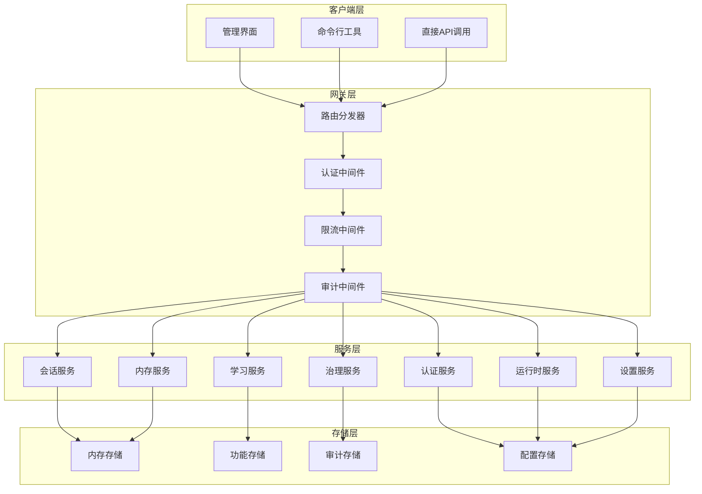
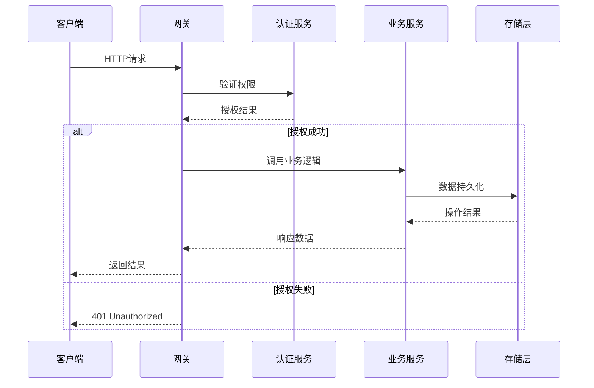

# 管理员管理端点

<cite>
**本文档引用的文件**
- [AdminEndpoints.cs](file://src/OpenClaw.Gateway/Endpoints/AdminEndpoints.cs)
- [AdminEndpoints.Auth.cs](file://src/OpenClaw.Gateway/Endpoints/AdminEndpoints.Auth.cs)
- [AdminEndpoints.Sessions.cs](file://src/OpenClaw.Gateway/Endpoints/AdminEndpoints.Sessions.cs)
- [AdminEndpoints.Memory.cs](file://src/OpenClaw.Gateway/Endpoints/AdminEndpoints.Memory.cs)
- [AdminEndpoints.ProfilesAndLearning.cs](file://src/OpenClaw.Gateway/Endpoints/AdminEndpoints.ProfilesAndLearning.cs)
- [AdminEndpoints.GovernanceLedger.cs](file://src/OpenClaw.Gateway/Endpoints/AdminEndpoints.GovernanceLedger.cs)
- [AdminEndpoints.Runtime.cs](file://src/OpenClaw.Gateway/Endpoints/AdminEndpoints.Runtime.cs)
- [AdminEndpoints.Setup.cs](file://src/OpenClaw.Gateway/Endpoints/AdminEndpoints.Setup.cs)
- [AdminApiModels.cs](file://src/OpenClaw.Core/Models/AdminApiModels.cs)
- [AdminSettingsModels.cs](file://src/OpenClaw.Core/Models/AdminSettingsModels.cs)
- [GatewayAdminEndpointTests.cs](file://src/OpenClaw.Tests/GatewayAdminEndpointTests.cs)
</cite>

## 目录
1. [简介](#简介)
2. [项目结构](#项目结构)
3. [核心组件](#核心组件)
4. [架构概览](#架构概览)
5. [详细组件分析](#详细组件分析)
6. [依赖关系分析](#依赖关系分析)
7. [性能考虑](#性能考虑)
8. [故障排除指南](#故障排除指南)
9. [结论](#结论)

## 简介

本文档为 OpenClaw 系统的管理员管理端点提供了全面的 API 文档。该系统是一个智能代理平台，包含丰富的管理功能，涵盖认证管理、会话管理、内存管理、配置文件管理、学习管理、治理账本和系统设置等多个方面。

系统采用模块化设计，通过 HTTP 端点提供统一的管理接口。每个端点都实现了严格的权限控制和审计日志功能，确保系统的安全性和可追溯性。

## 项目结构

OpenClaw 管理端点基于分层架构设计，主要分为以下几个层次：

**图表来源**
- [AdminEndpoints.cs:32-162](file://src/OpenClaw.Gateway/Endpoints/AdminEndpoints.cs#L32-L162)

**章节来源**
- [AdminEndpoints.cs:1-164](file://src/OpenClaw.Gateway/Endpoints/AdminEndpoints.cs#L1-L164)

## 核心组件

### 管理端点映射器

主管理端点映射器负责协调各个子系统的端点注册，包括认证、会话、内存、学习、治理等模块。

### 权限控制系统

系统实现了基于作用域的权限控制机制，每个端点都有明确的权限要求：
- `admin.auth`: 认证相关操作
- `admin.sessions`: 会话管理
- `admin.memory`: 内存管理
- `admin.learning`: 学习管理
- `admin.governance`: 治理管理
- `admin.settings`: 设置管理
- `admin.observability`: 可观测性

### 审计日志系统

所有管理操作都会被记录到审计日志中，包括操作类型、操作者、时间戳和详细信息。

**章节来源**
- [AdminEndpoints.cs:106-145](file://src/OpenClaw.Gateway/Endpoints/AdminEndpoints.cs#L106-L145)

## 架构概览

系统采用微服务架构，通过 HTTP 端点提供统一的管理接口。架构特点包括：

**图表来源**
- [AdminEndpoints.Auth.cs:40-124](file://src/OpenClaw.Gateway/Endpoints/AdminEndpoints.Auth.cs#L40-L124)

## 详细组件分析

### 认证管理端点

#### 会话管理

**GET /auth/session**
- 功能：获取当前会话信息
- 权限：无需认证（但会检查现有会话）
- 响应：会话状态和用户信息
- 错误：未授权时返回 401

**POST /auth/session**
- 功能：创建新会话
- 请求体：用户名密码或账户令牌
- 支持模式：浏览器会话、账户令牌
- 响应：会话令牌和用户权限
- 错误：认证失败返回 401

**DELETE /auth/session**
- 功能：删除当前会话
- 权限：需要 CSRF 保护
- 响应：操作确认
- 错误：会话不存在返回 404

**章节来源**
- [AdminEndpoints.Auth.cs:40-190](file://src/OpenClaw.Gateway/Endpoints/AdminEndpoints.Auth.cs#L40-L190)

#### 操作员账户管理

**GET /admin/operator-accounts**
- 功能：列出所有操作员账户
- 权限：admin.operator-accounts
- 响应：账户列表
- 分页：支持分页查询

**POST /admin/operator-accounts**
- 功能：创建新操作员账户
- 权限：admin.operator-accounts.mutate
- 请求体：账户创建信息
- 响应：新建账户详情
- 错误：重复用户名返回 400

**GET /admin/operator-accounts/{id}**
- 功能：获取特定账户详情
- 权限：admin.operator-accounts
- 响应：账户详情
- 错误：账户不存在返回 404

**PUT /admin/operator-accounts/{id}**
- 功能：更新账户信息
- 权限：admin.operator-accounts.mutate
- 请求体：更新信息
- 响应：更新后的账户
- 错误：账户不存在返回 404

**DELETE /admin/operator-accounts/{id}**
- 功能：删除账户
- 权限：admin.operator-accounts.mutate
- 响应：删除结果
- 错误：账户不存在返回 404

**POST /admin/operator-accounts/{id}/tokens**
- 功能：创建账户令牌
- 权限：admin.operator-accounts.mutate
- 请求体：令牌配置
- 响应：新令牌信息
- 错误：账户不存在返回 404

**DELETE /admin/operator-accounts/{id}/tokens/{tokenId}**
- 功能：撤销账户令牌
- 权限：admin.operator-accounts.mutate
- 响应：撤销结果
- 错误：令牌不存在返回 404

**章节来源**
- [AdminEndpoints.Auth.cs:192-356](file://src/OpenClaw.Gateway/Endpoints/AdminEndpoints.Auth.cs#L192-L356)

#### 组织策略管理

**GET /admin/organization-policy**
- 功能：获取组织策略
- 权限：admin.organization-policy
- 响应：当前策略快照
- 错误：无权限返回 401

**PUT /admin/organization-policy**
- 功能：更新组织策略
- 权限：admin.organization-policy.mutate
- 请求体：新的策略配置
- 响应：更新后的策略
- 错误：验证失败返回 400

**章节来源**
- [AdminEndpoints.Auth.cs:358-396](file://src/OpenClaw.Gateway/Endpoints/AdminEndpoints.Auth.cs#L358-L396)

### 会话管理端点

#### 会话列表和详情

**GET /admin/sessions**
- 功能：获取会话列表
- 权限：admin.sessions
- 查询参数：分页、搜索、过滤条件
- 响应：活动会话和持久化会话
- 性能：支持大数据量分页

**GET /admin/sessions/{id}**
- 功能：获取会话详情
- 权限：admin.session.detail
- 响应：会话完整信息
- 错误：会话不存在返回 404

**章节来源**
- [AdminEndpoints.Sessions.cs:40-113](file://src/OpenClaw.Gateway/Endpoints/AdminEndpoints.Sessions.cs#L40-L113)

#### 会话推广和分支管理

**POST /admin/sessions/{id}/promote**
- 功能：将会话推广为自动化、策略或技能草稿
- 权限：admin.session.promote
- 请求体：推广目标类型
- 响应：创建的资源详情
- 错误：不支持的目标类型返回 400

**GET /admin/sessions/{id}/branches**
- 功能：获取会话分支列表
- 权限：admin.session.branches
- 响应：分支详情
- 用途：会话历史追踪

**POST /admin/branches/{id}/restore**
- 功能：恢复分支到会话
- 权限：admin.branch.restore
- 响应：恢复结果
- 错误：分支不存在返回 404

**章节来源**
- [AdminEndpoints.Sessions.cs:115-327](file://src/OpenClaw.Gateway/Endpoints/AdminEndpoints.Sessions.cs#L115-L327)

#### 会话元数据和导出

**GET /admin/sessions/{id}/timeline**
- 功能：获取会话时间线事件
- 权限：admin.session.timeline
- 响应：事件和使用统计
- 用途：会话分析和审计

**GET /admin/sessions/{id}/diff**
- 功能：比较会话分支差异
- 权限：admin.session.diff
- 响应：差异报告
- 用途：变更追踪

**POST /admin/sessions/{id}/metadata**
- 功能：更新会话元数据
- 权限：admin.session.metadata
- 请求体：元数据更新
- 响应：更新后的元数据
- 错误：更新失败返回 500

**GET /admin/sessions/export**
- 功能：批量导出会话
- 权限：admin.sessions.export
- 响应：会话导出包
- 用途：备份和迁移

**章节来源**
- [AdminEndpoints.Sessions.cs:328-434](file://src/OpenClaw.Gateway/Endpoints/AdminEndpoints.Sessions.cs#L328-L434)

### 内存管理端点

#### 结构化内存管理

**GET /admin/memory/fractal/status**
- 功能：获取结构化内存状态
- 权限：admin.memory
- 响应：内存状态信息
- 错误：内存提供者未注册返回 503

**GET /admin/memory/fractal/search**
- 功能：搜索结构化内存
- 权限：admin.memory
- 查询参数：查询词、限制、范围
- 响应：搜索结果
- 错误：查询词为空返回 400

**GET /admin/memory/fractal/open**
- 功能：打开内存路径
- 权限：admin.memory
- 查询参数：路径、深度、视图
- 响应：内存内容
- 错误：路径为空返回 400

**章节来源**
- [AdminEndpoints.Memory.cs:45-123](file://src/OpenClaw.Gateway/Endpoints/AdminEndpoints.Memory.cs#L45-L123)

#### 内存笔记管理

**GET /admin/memory/notes**
- 功能：列出内存笔记
- 权限：admin.memory
- 查询参数：前缀、类别、项目ID、限制
- 响应：笔记列表
- 错误：内存目录不可用返回 501

**GET /admin/memory/search**
- 功能：搜索内存内容
- 权限：admin.memory
- 查询参数：查询词、类别、项目ID、限制
- 响应：搜索结果
- 错误：查询词为空返回 400

**GET /admin/memory/notes/{key}**
- 功能：获取单个笔记
- 权限：admin.memory
- 响应：笔记详情
- 错误：笔记不存在返回 404

**POST /admin/memory/notes**
- 功能：创建或更新笔记
- 权限：admin.memory.mutate
- 请求体：笔记内容
- 响应：保存后的笔记
- 错误：无效键返回 400

**DELETE /admin/memory/notes/{key}**
- 功能：删除笔记
- 权限：admin.memory.mutate
- 响应：删除结果
- 错误：笔记不存在返回 404

**章节来源**
- [AdminEndpoints.Memory.cs:197-426](file://src/OpenClaw.Gateway/Endpoints/AdminEndpoints.Memory.cs#L197-L426)

#### 内存导入导出

**GET /admin/memory/export**
- 功能：导出内存数据
- 权限：admin.memory.export
- 查询参数：过滤条件和导出选项
- 响应：内存导出包
- 包含：笔记、配置文件、提案、自动化

**POST /admin/memory/import**
- 功能：导入内存数据
- 权限：admin.memory.mutate
- 请求体：内存导出包
- 响应：导入统计
- 错误：无效数据返回 400

**章节来源**
- [AdminEndpoints.Memory.cs:428-582](file://src/OpenClaw.Gateway/Endpoints/AdminEndpoints.Memory.cs#L428-L582)

### 学习管理端点

#### 配置文件管理

**GET /admin/profiles**
- 功能：获取集成配置文件列表
- 权限：admin.profiles
- 响应：配置文件列表

**GET /admin/profiles/export**
- 功能：导出配置文件
- 权限：admin.profiles.export
- 查询参数：演员ID过滤、是否包含提案
- 响应：配置文件导出包

**POST /admin/profiles/import**
- 功能：导入配置文件
- 权限：admin.profiles.mutate
- 请求体：配置文件导出包
- 响应：导入统计
- 错误：无效数据返回 400

**章节来源**
- [AdminEndpoints.ProfilesAndLearning.cs:40-154](file://src/OpenClaw.Gateway/Endpoints/AdminEndpoints.ProfilesAndLearning.cs#L40-L154)

#### 学习提案管理

**GET /admin/learning/proposals**
- 功能：获取学习提案列表
- 权限：admin.learning
- 查询参数：状态、类型、组件、风险等级
- 响应：提案列表

**POST /admin/learning/proposals/harness-change**
- 功能：创建框架变更提案
- 权限：admin.learning.mutate
- 请求体：框架变更信息
- 响应：创建的提案
- 错误：无效参数返回 400

**POST /admin/learning/proposals/harness-change/detect**
- 功能：检测框架变更提案
- 权限：admin.learning.mutate
- 请求体：检测配置
- 响应：检测结果
- 错误：检测失败返回 400

**GET /admin/learning/proposals/{id}**
- 功能：获取提案详情
- 权限：admin.learning
- 响应：提案详情
- 错误：提案不存在返回 404

**章节来源**
- [AdminEndpoints.ProfilesAndLearning.cs:177-284](file://src/OpenClaw.Gateway/Endpoints/AdminEndpoints.ProfilesAndLearning.cs#L177-L284)

#### 提案审批流程

**POST /admin/learning/proposals/{id}/approve**
- 功能：批准学习提案
- 权限：admin.learning.mutate
- 响应：批准后的提案
- 特殊：框架变更提案会同时更新治理账本

**POST /admin/learning/proposals/{id}/reject**
- 功能：拒绝学习提案
- 权限：admin.learning.mutate
- 请求体：拒绝原因
- 响应：拒绝后的提案

**POST /admin/learning/proposals/{id}/rollback**
- 功能：回滚学习提案
- 权限：admin.learning.mutate
- 请求体：回滚原因
- 响应：回滚后的提案
- 错误：不可回滚状态返回 400

**章节来源**
- [AdminEndpoints.ProfilesAndLearning.cs:299-455](file://src/OpenClaw.Gateway/Endpoints/AdminEndpoints.ProfilesAndLearning.cs#L299-L455)

### 治理账本端点

#### 账本查询和管理

**GET /admin/governance/ledger**
- 功能：查询治理账本
- 权限：admin.governance
- 查询参数：决策状态、工具名、动作类型、风险等级、会话ID等
- 响应：账本条目列表

**GET /admin/governance/ledger/{id}**
- 功能：获取账本条目详情
- 权限：admin.governance
- 响应：账本条目详情
- 错误：条目不存在返回 404

**POST /admin/governance/ledger**
- 功能：创建账本条目
- 权限：admin.governance.mutate
- 请求体：账本条目信息
- 响应：创建的条目
- 错误：无效数据返回 400

**POST /admin/governance/ledger/{id}/revoke**
- 功能：撤销账本条目
- 权限：admin.governance.mutate
- 请求体：撤销原因
- 响应：撤销后的条目
- 错误：条目不存在返回 404

**章节来源**
- [AdminEndpoints.GovernanceLedger.cs:15-204](file://src/OpenClaw.Gateway/Endpoints/AdminEndpoints.GovernanceLedger.cs#L15-L204)

### 运行时管理端点

#### 工具审批管理

**GET /tools/approvals**
- 功能：获取待处理的工具审批
- 权限：admin.approvals
- 查询参数：频道ID、发送者ID
- 响应：待审批列表

**GET /tools/approvals/history**
- 功能：获取审批历史
- 权限：admin.approvals.history
- 查询参数：限制、过滤条件
- 响应：历史记录列表

**章节来源**
- [AdminEndpoints.Runtime.cs:39-70](file://src/OpenClaw.Gateway/Endpoints/AdminEndpoints.Runtime.cs#L39-L70)

#### 提供商和模型管理

**GET /admin/providers**
- 功能：获取提供商状态
- 权限：admin.providers
- 响应：提供商配置、路由、使用情况、策略

**GET /admin/models**
- 功能：获取模型配置状态
- 权限：admin.models
- 响应：模型配置状态

**GET /admin/models/doctor**
- 功能：获取模型选择诊断
- 权限：admin.models.doctor
- 响应：模型选择建议

**POST /admin/models/evaluations**
- 功能：执行模型评估
- 权限：admin.models.evaluate
- 请求体：评估配置
- 响应：评估报告

**章节来源**
- [AdminEndpoints.Runtime.cs:72-129](file://src/OpenClaw.Gateway/Endpoints/AdminEndpoints.Runtime.cs#L72-L129)

#### 运行时事件和脉冲

**GET /admin/events**
- 功能：获取运行时事件
- 权限：admin.events
- 查询参数：限制、过滤条件
- 响应：事件列表

**GET /admin/pulse/status**
- 功能：获取脉冲状态
- 权限：admin.pulse.status
- 响应：脉冲状态

**POST /admin/pulse/run**
- 功能：手动触发脉冲
- 权限：admin.pulse.run
- 请求体：脉冲配置
- 响应：执行结果

**POST /admin/pulse/enable**
- 功能：启用脉冲
- 权限：admin.pulse.mutate
- 响应：更新后的状态

**POST /admin/pulse/disable**
- 功能：禁用脉冲
- 权限：admin.pulse.mutate
- 响应：更新后的状态

**章节来源**
- [AdminEndpoints.Runtime.cs:206-294](file://src/OpenClaw.Gateway/Endpoints/AdminEndpoints.Runtime.cs#L206-L294)

#### 审计和Webhook管理

**GET /admin/audit**
- 功能：获取操作审计
- 权限：admin.audit
- 查询参数：限制、过滤条件
- 响应：审计记录

**GET /admin/webhooks/dead-letter**
- 功能：获取死信队列
- 权限：admin.webhooks
- 响应：死信记录列表

**POST /admin/webhooks/dead-letter/{id}/replay**
- 功能：重放死信
- 权限：admin.webhooks.mutate
- 响应：重放结果

**POST /admin/webhooks/dead-letter/{id}/discard**
- 功能：丢弃死信
- 权限：admin.webhooks.mutate
- 响应：丢弃结果

**章节来源**
- [AdminEndpoints.Runtime.cs:369-430](file://src/OpenClaw.Gateway/Endpoints/AdminEndpoints.Runtime.cs#L369-L430)

### 系统设置端点

#### 系统摘要和状态

**GET /admin/summary**
- 功能：获取系统摘要
- 权限：admin.summary
- 响应：系统状态摘要
- 包含：认证、运行时、设置、通道、保留、插件、使用情况

**GET /admin/setup/status**
- 功能：获取安装状态
- 权限：admin.setup.status
- 响应：安装状态报告

**章节来源**
- [AdminEndpoints.Setup.cs:47-146](file://src/OpenClaw.Gateway/Endpoints/AdminEndpoints.Setup.cs#L47-L146)

#### 维护和可观测性

**GET /admin/maintenance**
- 功能：获取维护报告
- 权限：admin.observability
- 响应：维护扫描结果

**POST /admin/maintenance/fix**
- 功能：执行维护修复
- 权限：admin.observability
- 请求体：修复配置
- 响应：修复结果

**GET /admin/setup/verify**
- 功能：验证安装配置
- 权限：admin.setup.status
- 响应：验证结果

**章节来源**
- [AdminEndpoints.Setup.cs:148-222](file://src/OpenClaw.Gateway/Endpoints/AdminEndpoints.Setup.cs#L148-L222)

#### 设置管理

**GET /admin/settings**
- 功能：获取当前设置
- 权限：admin.settings
- 响应：设置快照和持久化信息

**POST /admin/settings**
- 功能：更新设置
- 权限：admin.settings.mutate
- 请求体：设置快照
- 响应：更新后的设置
- 错误：验证失败返回 400

**DELETE /admin/settings**
- 功能：重置设置
- 权限：admin.settings.mutate
- 响应：重置后的设置

**章节来源**
- [AdminEndpoints.Setup.cs:365-432](file://src/OpenClaw.Gateway/Endpoints/AdminEndpoints.Setup.cs#L365-L432)

#### 心跳管理

**GET /admin/heartbeat**
- 功能：获取心跳配置预览
- 权限：admin.heartbeat
- 响应：心跳配置预览

**POST /admin/heartbeat/preview**
- 功能：预览心跳配置
- 权限：admin.heartbeat.preview
- 请求体：心跳配置
- 响应：配置预览

**PUT /admin/heartbeat**
- 功能：保存心跳配置
- 权限：admin.heartbeat.mutate
- 请求体：心跳配置
- 响应：保存后的配置
- 错误：配置验证失败返回 400

**GET /admin/heartbeat/status**
- 功能：获取心跳状态
- 权限：admin.heartbeat.status
- 响应：心跳状态

**章节来源**
- [AdminEndpoints.Setup.cs:434-512](file://src/OpenClaw.Gateway/Endpoints/AdminEndpoints.Setup.cs#L434-L512)

## 依赖关系分析

系统各组件之间的依赖关系如下：

```mermaid
graph TB
subgraph "认证层"
AuthEndpoints[认证端点]
OperatorAccounts[操作员账户]
BrowserSessions[浏览器会话]
OrganizationPolicy[组织策略]
end
subgraph "会话层"
SessionEndpoints[会话端点]
SessionManager[会话管理器]
SessionMetadata[会话元数据]
end
subgraph "内存层"
MemoryEndpoints[内存端点]
MemoryStore[内存存储]
StructuredMemory[结构化内存]
end
subgraph "学习层"
LearningEndpoints[学习端点]
LearningService[学习服务]
ProposalStore[提案存储]
end
subgraph "治理层"
GovernanceEndpoints[治理端点]
GovernanceLedger[治理账本]
AuditStore[审计存储]
end
subgraph "运行时层"
RuntimeEndpoints[运行时端点]
RuntimeEvents[运行时事件]
ProviderUsage[提供商使用]
end
subgraph "设置层"
SetupEndpoints[设置端点]
AdminSettings[管理设置]
Heartbeat[心跳服务]
end
AuthEndpoints --> OperatorAccounts
AuthEndpoints --> BrowserSessions
AuthEndpoints --> OrganizationPolicy
SessionEndpoints --> SessionManager
SessionEndpoints --> SessionMetadata
MemoryEndpoints --> MemoryStore
MemoryEndpoints --> StructuredMemory
LearningEndpoints --> LearningService
LearningEndpoints --> ProposalStore
GovernanceEndpoints --> GovernanceLedger
GovernanceEndpoints --> AuditStore
RuntimeEndpoints --> RuntimeEvents
RuntimeEndpoints --> ProviderUsage
SetupEndpoints --> AdminSettings
SetupEndpoints --> Heartbeat
```

**图表来源**
- [AdminEndpoints.cs:106-145](file://src/OpenClaw.Gateway/Endpoints/AdminEndpoints.cs#L106-L145)

**章节来源**
- [AdminEndpoints.cs:32-162](file://src/OpenClaw.Gateway/Endpoints/AdminEndpoints.cs#L32-L162)

## 性能考虑

### 缓存策略
- 结构化内存搜索结果缓存
- 会话列表分页缓存
- 配置文件快照缓存

### 异步处理
- 大数据量导出采用异步处理
- 批量操作支持后台执行
- 内存索引刷新异步执行

### 限流机制
- API 请求频率限制
- 并发会话数量限制
- 文件上传大小限制

## 故障排除指南

### 常见问题和解决方案

**认证相关问题**
- 401 未授权：检查会话有效性或重新登录
- 403 禁止访问：检查用户权限和作用域
- 429 请求过快：等待限流冷却或调整请求频率

**数据访问问题**
- 404 未找到：检查资源 ID 是否正确
- 400 参数错误：验证请求参数格式
- 500 服务器错误：查看日志获取详细信息

**性能问题**
- 查询超时：优化查询条件或增加限制
- 内存不足：检查系统资源使用情况
- 导出失败：减少导出数据量或分批处理

**章节来源**
- [GatewayAdminEndpointTests.cs:649-666](file://src/OpenClaw.Tests/GatewayAdminEndpointTests.cs#L649-L666)

## 结论

OpenClaw 的管理员管理端点提供了全面的系统管理功能，涵盖了从基础认证到高级治理的各个方面。系统的设计注重安全性、可扩展性和易用性，通过清晰的权限控制和详细的审计日志确保了系统的可控性。

主要优势包括：
- 完整的 CRUD 操作支持
- 严格的安全权限控制
- 详细的审计和监控功能
- 灵活的配置管理
- 强大的导出和导入能力

建议在生产环境中：
- 启用适当的日志记录和监控
- 定期审查权限配置
- 建立备份和恢复策略
- 制定应急响应计划