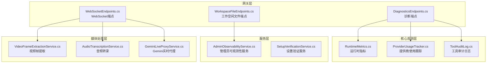
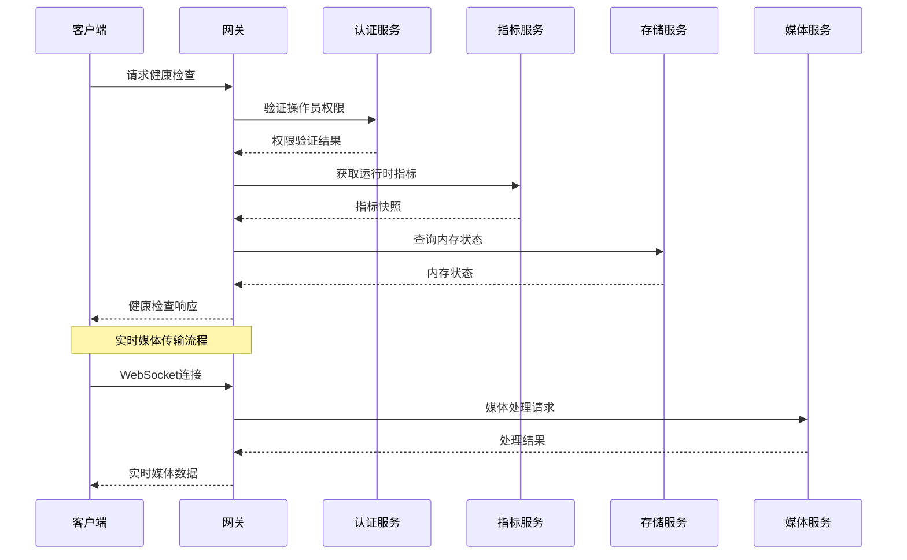
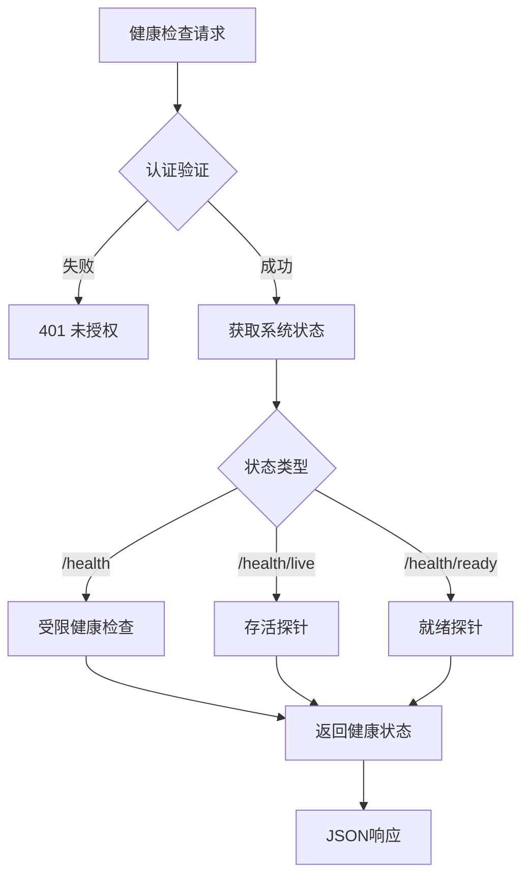
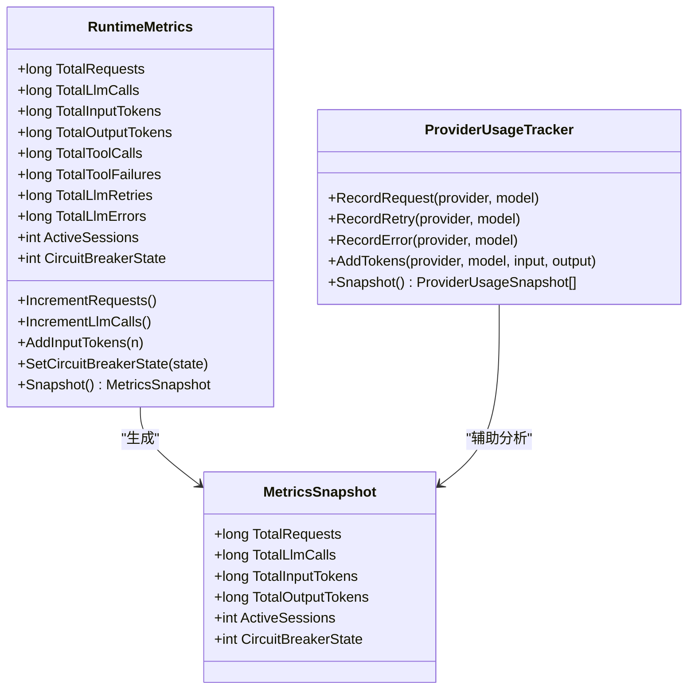
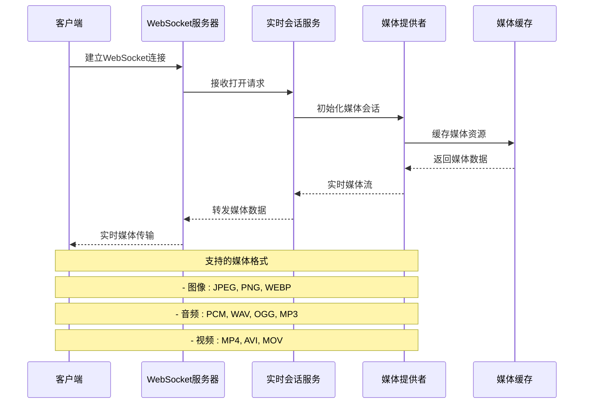
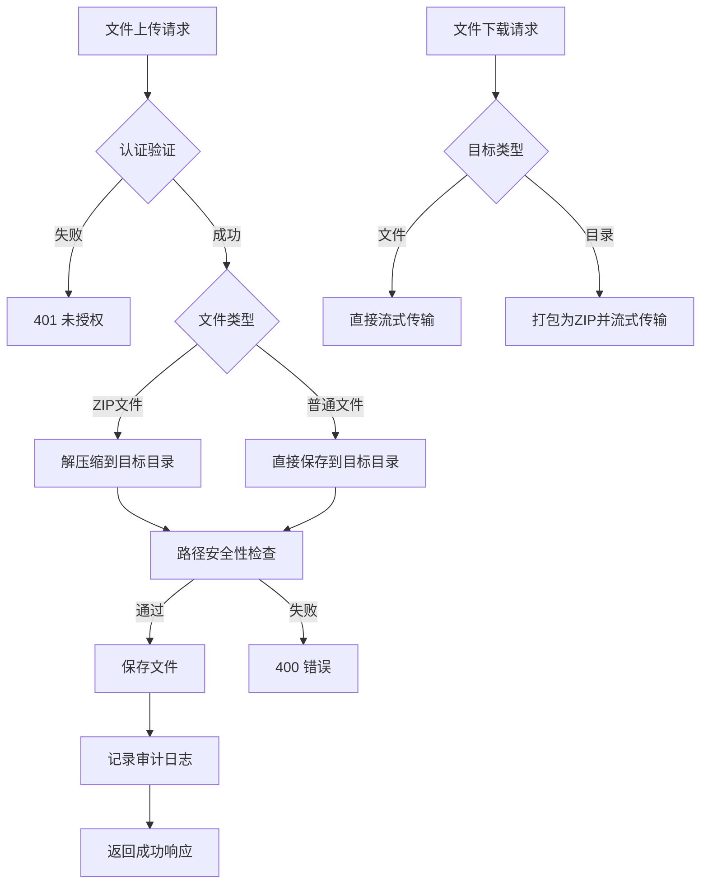
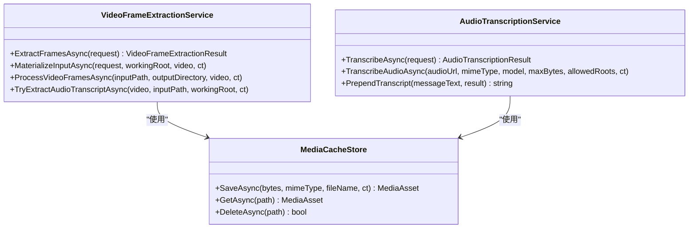
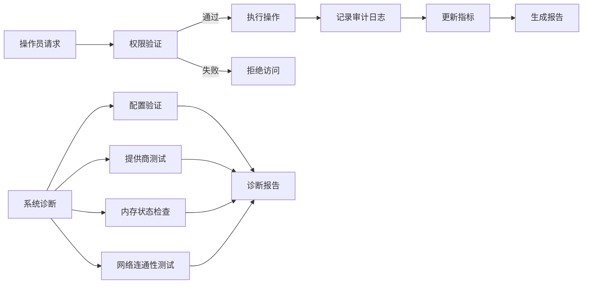
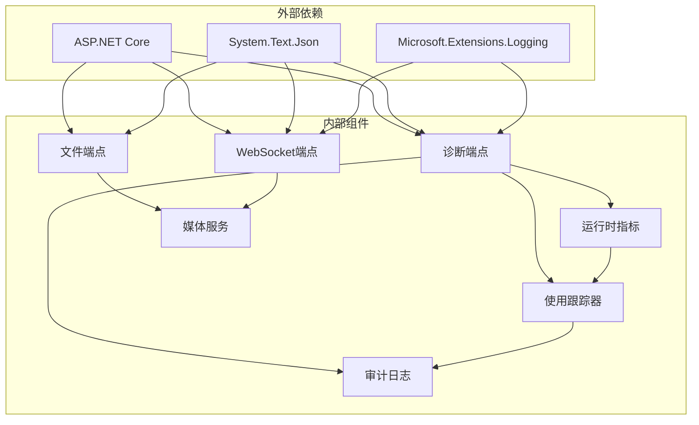

# 诊断监控端点

<cite>
**本文档引用的文件**
- [DiagnosticsEndpoints.cs](file://src/OpenClaw.Gateway/Endpoints/DiagnosticsEndpoints.cs)
- [WorkspaceFileEndpoints.cs](file://src/OpenClaw.Gateway/Endpoints/WorkspaceFileEndpoints.cs)
- [WebSocketEndpoints.cs](file://src/OpenClaw.Gateway/Endpoints/WebSocketEndpoints.cs)
- [RuntimeMetrics.cs](file://src/OpenClaw.Core/Observability/RuntimeMetrics.cs)
- [ProviderUsageTracker.cs](file://src/OpenClaw.Core/Observability/ProviderUsageTracker.cs)
- [ToolAuditLog.cs](file://src/OpenClaw.Core/Observability/ToolAuditLog.cs)
- [AdminObservabilityService.cs](file://src/OpenClaw.Gateway/AdminObservabilityService.cs)
- [SetupVerificationService.cs](file://src/OpenClaw.Core/Validation/SetupVerificationService.cs)
- [WebSocketChannel.cs](file://src/OpenClaw.Channels/WebSocketChannel.cs)
- [OpenClawLiveClient.cs](file://src/OpenClaw.Client/OpenClawLiveClient.cs)
- [webchat.html](file://src/OpenClaw.Gateway/wwwroot/webchat.html)
- [webchat.js](file://src/OpenClaw.Gateway/wwwroot/webchat.js)
- [VideoFrameExtractionService.cs](file://src/OpenClaw.Gateway/VideoFrameExtractionService.cs)
- [AudioTranscriptionService.cs](file://src/OpenClaw.Gateway/AudioTranscriptionService.cs)
- [GeminiLiveProxyService.cs](file://src/OpenClaw.Gateway/GeminiLiveProxyService.cs)
- [TerminalUi.cs](file://src/OpenClaw.Tui/TerminalUi.cs)
</cite>

## 目录
1. [简介](#简介)
2. [项目结构](#项目结构)
3. [核心组件](#核心组件)
4. [架构概览](#架构概览)
5. [详细组件分析](#详细组件分析)
6. [依赖关系分析](#依赖关系分析)
7. [性能考虑](#性能考虑)
8. [故障排除指南](#故障排除指南)
9. [结论](#结论)

## 简介

诊断监控端点是 OpenClaw.NET 系统的核心运维组件，负责提供全面的系统健康检查、性能监控、媒体处理和工作空间管理功能。该系统通过 REST API 和 WebSocket 实时通信机制，为操作员提供实时的系统状态查询、性能指标获取、媒体流处理和文件管理能力。

系统采用分层架构设计，包含诊断监控层、媒体处理层、文件管理层和实时通信层，每个层次都有专门的端点和服务来满足不同的监控需求。

## 项目结构

OpenClaw.NET 的诊断监控系统主要分布在以下关键目录中：

**图表来源**
- [DiagnosticsEndpoints.cs:11-194](file://src/OpenClaw.Gateway/Endpoints/DiagnosticsEndpoints.cs#L11-L194)
- [WorkspaceFileEndpoints.cs:9-458](file://src/OpenClaw.Gateway/Endpoints/WorkspaceFileEndpoints.cs#L9-L458)
- [WebSocketEndpoints.cs:11-191](file://src/OpenClaw.Gateway/Endpoints/WebSocketEndpoints.cs#L11-L191)

**章节来源**
- [DiagnosticsEndpoints.cs:18-194](file://src/OpenClaw.Gateway/Endpoints/DiagnosticsEndpoints.cs#L18-L194)
- [WorkspaceFileEndpoints.cs:13-355](file://src/OpenClaw.Gateway/Endpoints/WorkspaceFileEndpoints.cs#L13-L355)
- [WebSocketEndpoints.cs:13-61](file://src/OpenClaw.Gateway/Endpoints/WebSocketEndpoints.cs#L13-L61)

## 核心组件

### 健康检查端点

系统提供多层次的健康检查机制：

- **/health**: 受限访问的健康检查，返回系统状态和运行时间
- **/health/live**: 无认证的存活探针，用于负载均衡器和Kubernetes探针
- **/health/ready**: 无认证的就绪探针，验证运行时是否已初始化

### 性能监控端点

提供详细的运行时指标和使用情况统计：

- **/metrics**: 综合运行时指标快照
- **/metrics/providers**: 提供商使用情况统计
- **/metrics/tools**: 工具使用统计
- **/admin/audit/tools**: 最近工具执行审计

### 诊断和维护端点

- **/memory/retention/status**: 内存保留状态查询
- **/memory/retention/sweep**: 内存清理操作
- **/doctor**: 系统设置诊断报告
- **/doctor/text**: 纯文本格式的诊断报告

**章节来源**
- [DiagnosticsEndpoints.cs:32-191](file://src/OpenClaw.Gateway/Endpoints/DiagnosticsEndpoints.cs#L32-L191)

## 架构概览

诊断监控系统的整体架构采用模块化设计，各组件职责明确：

**图表来源**
- [DiagnosticsEndpoints.cs:32-76](file://src/OpenClaw.Gateway/Endpoints/DiagnosticsEndpoints.cs#L32-L76)
- [WebSocketEndpoints.cs:28-60](file://src/OpenClaw.Gateway/Endpoints/WebSocketEndpoints.cs#L28-L60)

## 详细组件分析

### 健康检查和状态监控

健康检查系统提供三个级别的状态检测：

**图表来源**
- [DiagnosticsEndpoints.cs:32-66](file://src/OpenClaw.Gateway/Endpoints/DiagnosticsEndpoints.cs#L32-L66)

健康检查响应包含以下关键字段：
- `status`: 系统状态（"ok"、"ready"、"not_ready"）
- `uptime`: 系统运行时间（毫秒）

**章节来源**
- [DiagnosticsEndpoints.cs:32-66](file://src/OpenClaw.Gateway/Endpoints/DiagnosticsEndpoints.cs#L32-L66)

### 性能指标收集和分析

运行时指标系统采用高性能的原子计数器设计：

**图表来源**
- [RuntimeMetrics.cs:10-312](file://src/OpenClaw.Core/Observability/RuntimeMetrics.cs#L10-L312)
- [ProviderUsageTracker.cs:40-45](file://src/OpenClaw.Core/Observability/ProviderUsageTracker.cs#L40-L45)

性能指标分类包括：
- **计数器指标**: 请求总数、LLM调用次数、工具调用次数等
- **令牌指标**: 输入令牌、输出令牌统计
- **会话指标**: 活跃会话数、会话驱逐次数
- **进程指标**: 进程启动、完成、失败统计
- **缓存指标**: 提示缓存读写、预热效果

**章节来源**
- [RuntimeMetrics.cs:129-250](file://src/OpenClaw.Core/Observability/RuntimeMetrics.cs#L129-L250)

### 实时媒体传输系统

媒体传输系统支持多种媒体格式的实时处理和传输：

**图表来源**
- [WebSocketEndpoints.cs:28-60](file://src/OpenClaw.Gateway/Endpoints/WebSocketEndpoints.cs#L28-L60)
- [GeminiLiveProxyService.cs:225-266](file://src/OpenClaw.Gateway/GeminiLiveProxyService.cs#L225-L266)

媒体传输协议支持：
- **文本消息**: JSON格式的控制和状态消息
- **二进制消息**: 原始音频和视频数据
- **Base64编码**: 图像和音频数据的编码传输

**章节来源**
- [WebSocketEndpoints.cs:133-164](file://src/OpenClaw.Gateway/Endpoints/WebSocketEndpoints.cs#L133-L164)
- [webchat.html:3101-3122](file://src/OpenClaw.Gateway/wwwroot/webchat.html#L3101-L3122)

### 工作空间文件管理系统

文件管理系统提供安全的文件上传、下载和目录浏览功能：

**图表来源**
- [WorkspaceFileEndpoints.cs:24-179](file://src/OpenClaw.Gateway/Endpoints/WorkspaceFileEndpoints.cs#L24-L179)

文件管理特性：
- **安全上传**: 支持单个或批量文件上传
- **ZIP解压**: 单个ZIP文件自动解压到指定目录
- **路径安全**: 防止目录遍历攻击
- **大小限制**: 默认100MB上传限制
- **内容类型**: 自动识别和设置正确的MIME类型

**章节来源**
- [WorkspaceFileEndpoints.cs:11-179](file://src/OpenClaw.Gateway/Endpoints/WorkspaceFileEndpoints.cs#L11-L179)

### 媒体处理和转录服务

系统提供完整的媒体处理能力，包括视频帧提取和音频转录：

**图表来源**
- [VideoFrameExtractionService.cs:40-268](file://src/OpenClaw.Gateway/VideoFrameExtractionService.cs#L40-L268)
- [AudioTranscriptionService.cs:177-215](file://src/OpenClaw.Gateway/AudioTranscriptionService.cs#L177-L215)

媒体处理流程：
1. **输入材料化**: 将远程媒体资源下载到本地工作目录
2. **视频帧提取**: 使用FFmpeg按时间间隔提取图像帧
3. **音频转录**: 提取音频轨道并进行语音识别
4. **结果缓存**: 将处理后的媒体资源存储到缓存系统

**章节来源**
- [VideoFrameExtractionService.cs:59-268](file://src/OpenClaw.Gateway/VideoFrameExtractionService.cs#L59-L268)

### 审计和诊断系统

系统提供全面的审计日志和诊断报告功能：

**图表来源**
- [SetupVerificationService.cs:139-164](file://src/OpenClaw.Core/Validation/SetupVerificationService.cs#L139-L164)
- [ToolAuditLog.cs:10-32](file://src/OpenClaw.Core/Observability/ToolAuditLog.cs#L10-L32)

审计日志包含的关键信息：
- 时间戳和操作员标识
- 工具名称和执行参数
- 执行结果和持续时间
- 治理决策和原因
- 错误信息和超时状态

**章节来源**
- [ToolAuditLog.cs:10-32](file://src/OpenClaw.Core/Observability/ToolAuditLog.cs#L10-L32)
- [SetupVerificationService.cs:201-222](file://src/OpenClaw.Core/Validation/SetupVerificationService.cs#L201-L222)

## 依赖关系分析

诊断监控系统的组件间依赖关系如下：

**图表来源**
- [DiagnosticsEndpoints.cs:1-8](file://src/OpenClaw.Gateway/Endpoints/DiagnosticsEndpoints.cs#L1-L8)
- [WebSocketEndpoints.cs:1-8](file://src/OpenClaw.Gateway/Endpoints/WebSocketEndpoints.cs#L1-L8)

**章节来源**
- [DiagnosticsEndpoints.cs:1-8](file://src/OpenClaw.Gateway/Endpoints/DiagnosticsEndpoints.cs#L1-L8)
- [WebSocketEndpoints.cs:1-8](file://src/OpenClaw.Gateway/Endpoints/WebSocketEndpoints.cs#L1-L8)

## 性能考虑

### 并发处理优化

系统采用多种并发优化策略：

- **原子操作**: 运行时指标使用原子操作确保线程安全
- **无锁设计**: 关键路径避免使用锁机制
- **异步I/O**: 文件操作和网络请求采用异步模式
- **内存池**: 大对象分配使用内存池减少GC压力

### 缓存策略

- **指标缓存**: 运行时指标定期快照缓存
- **媒体缓存**: 处理后的媒体资源缓存到本地存储
- **审计日志**: JSON Lines格式支持高效的增量读取

### 资源管理

- **连接池**: 数据库和外部API连接池管理
- **文件句柄**: 严格控制文件句柄生命周期
- **内存使用**: 流式处理大文件避免内存峰值

## 故障排除指南

### 常见问题诊断

1. **健康检查失败**
   - 检查认证头和CSRF令牌
   - 验证会话管理器状态
   - 查看系统日志中的异常信息

2. **媒体传输中断**
   - 确认WebSocket连接状态
   - 检查媒体提供者可用性
   - 验证FFmpeg安装和权限

3. **文件上传失败**
   - 检查磁盘空间和权限
   - 验证文件大小限制
   - 确认目标路径存在且可写

### 诊断工具

系统提供多种诊断工具：

- **纯文本诊断**: `/doctor/text` 端点提供可读性强的诊断报告
- **审计导出**: 导出完整的操作审计和系统状态
- **指标监控**: 实时监控关键性能指标
- **日志分析**: 结构化日志支持快速问题定位

**章节来源**
- [DiagnosticsEndpoints.cs:169-191](file://src/OpenClaw.Gateway/Endpoints/DiagnosticsEndpoints.cs#L169-L191)
- [AdminObservabilityService.cs](file://src/OpenClaw.Gateway/AdminObservabilityService.cs#L229)

## 结论

OpenClaw.NET 的诊断监控端点系统提供了全面的运维监控能力，涵盖了系统健康检查、性能监控、媒体处理和文件管理等核心功能。系统采用模块化设计，具有良好的扩展性和可靠性。

关键优势包括：
- **多层健康检查**: 支持不同场景的健康状态验证
- **实时监控**: 提供实时的性能指标和状态信息
- **安全的媒体处理**: 完整的媒体格式支持和安全防护
- **全面的审计**: 详细的操作记录和诊断报告
- **灵活的文件管理**: 安全的文件上传下载和目录管理

该系统为 OpenClaw.NET 的稳定运行提供了坚实的技术基础，能够有效支持各种规模的部署场景。