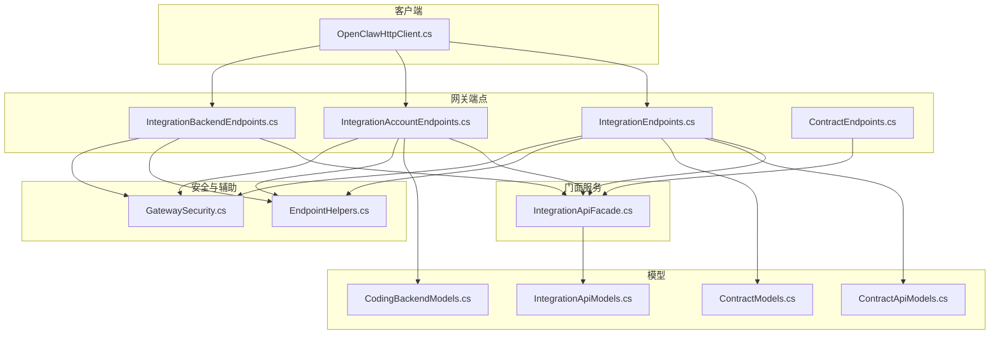
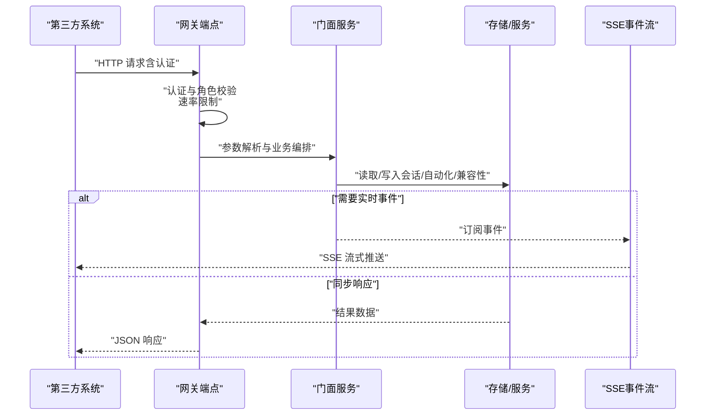
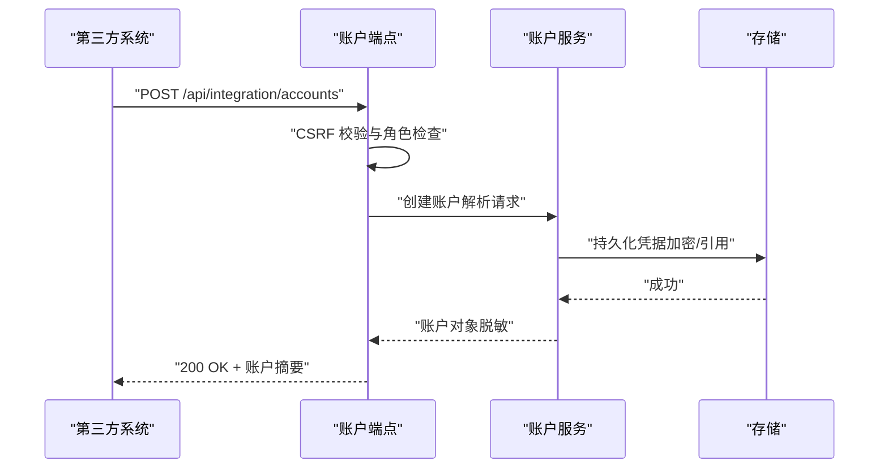
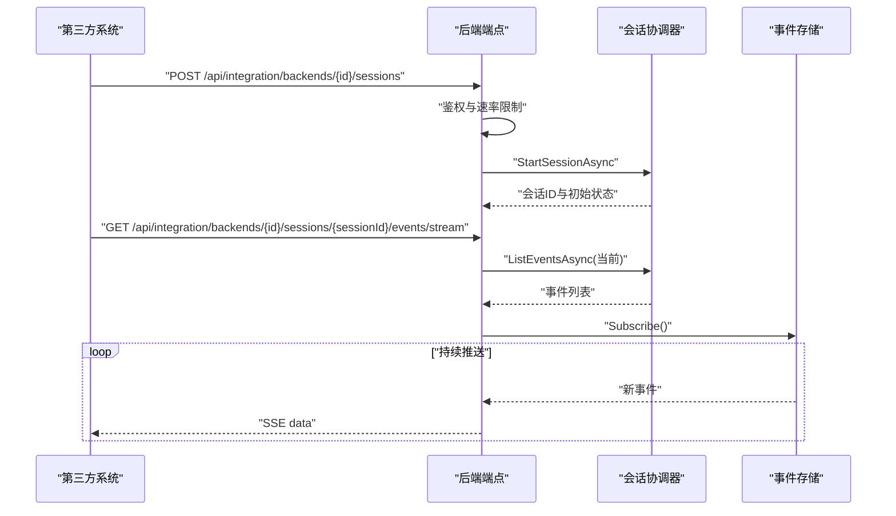
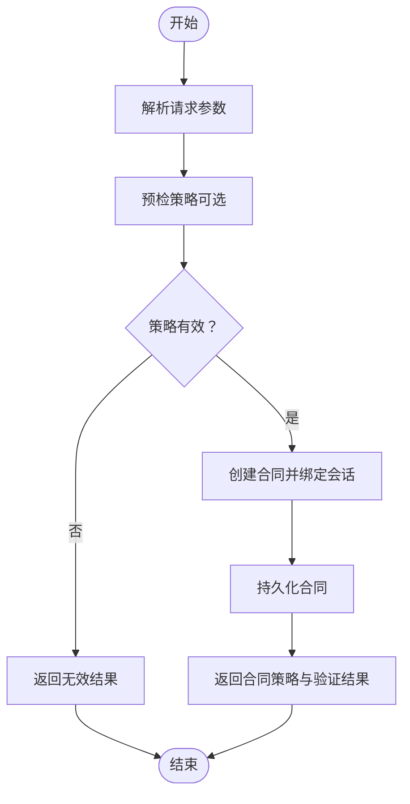
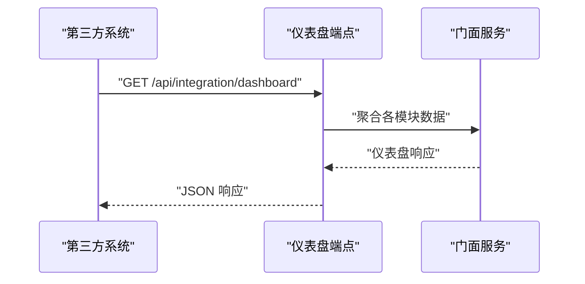
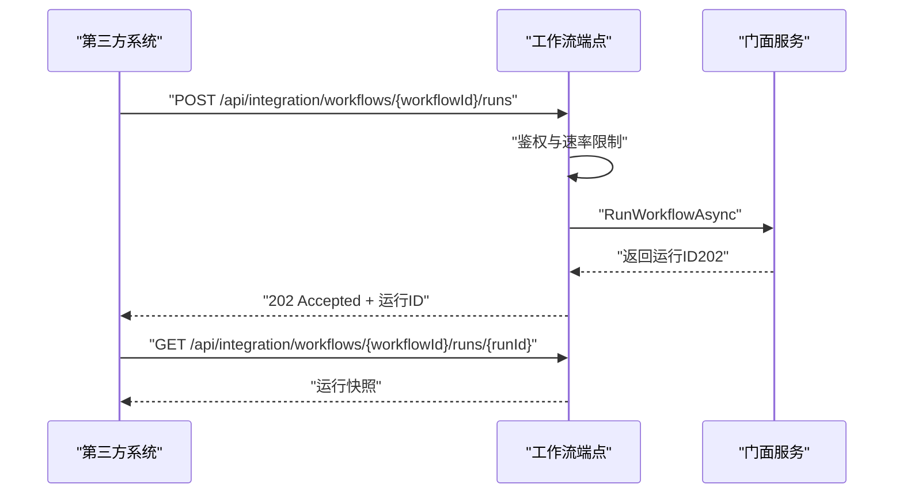
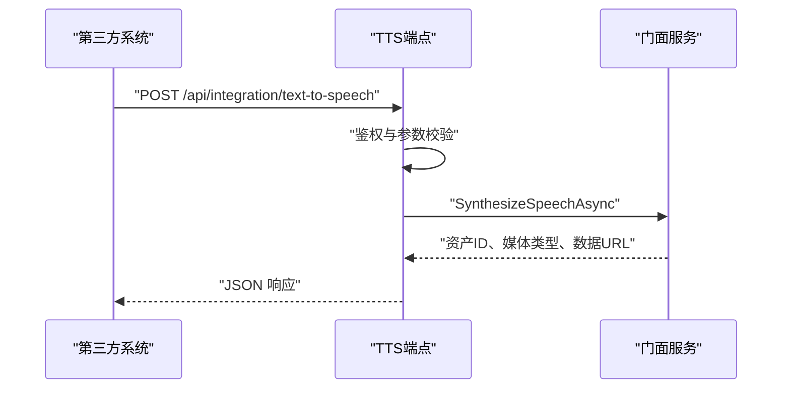
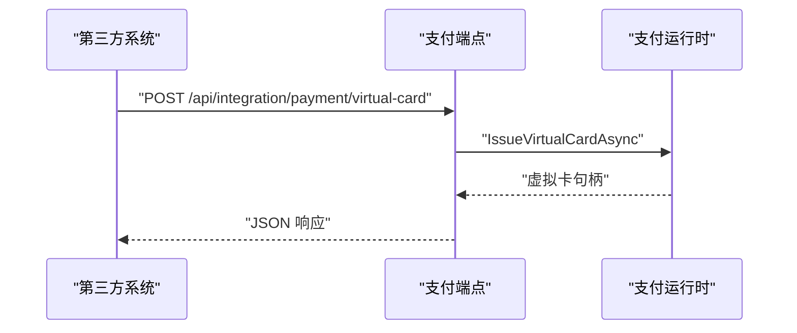
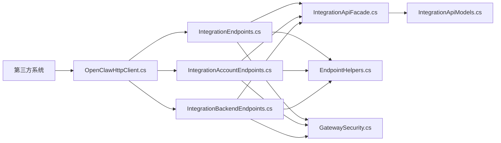

# 集成 API 端点

<cite>
**本文档引用的文件**
- [IntegrationEndpoints.cs](file://src/OpenClaw.Gateway/Endpoints/IntegrationEndpoints.cs)
- [IntegrationAccountEndpoints.cs](file://src/OpenClaw.Gateway/Endpoints/IntegrationAccountEndpoints.cs)
- [IntegrationBackendEndpoints.cs](file://src/OpenClaw.Gateway/Endpoints/IntegrationBackendEndpoints.cs)
- [IntegrationApiModels.cs](file://src/OpenClaw.Core/Models/IntegrationApiModels.cs)
- [IntegrationApiFacade.cs](file://src/OpenClaw.Gateway/Composition/IntegrationApiFacade.cs)
- [IntegrationAccountCreateRequest](file://src/OpenClaw.Core/Models/CodingBackendModels.cs)
- [ContractApiModels.cs](file://src/OpenClaw.Core/Models/ContractApiModels.cs)
- [ContractModels.cs](file://src/OpenClaw.Core/Models/ContractModels.cs)
- [EndpointHelpers.cs](file://src/OpenClaw.Gateway/Endpoints/EndpointHelpers.cs)
- [GatewaySecurity.cs](file://src/OpenClaw.Gateway/GatewaySecurity.cs)
- [OpenClawHttpClient.cs](file://src/OpenClaw.Client/OpenClawHttpClient.cs)
- [ContractEndpoints.cs](file://src/OpenClaw.Gateway/Endpoints/ContractEndpoints.cs)
- [GatewayAdminEndpointTests.cs](file://src/OpenClaw.Tests/GatewayAdminEndpointTests.cs)
</cite>

## 目录
1. [简介](#简介)
2. [项目结构](#项目结构)
3. [核心组件](#核心组件)
4. [架构总览](#架构总览)
5. [详细组件分析](#详细组件分析)
6. [依赖关系分析](#依赖关系分析)
7. [性能考量](#性能考量)
8. [故障排除指南](#故障排除指南)
9. [结论](#结论)
10. [附录](#附录)

## 简介
本文件面向需要对接 OpenClaw 平台的第三方系统，提供集成 API 的完整文档。重点覆盖以下领域：
- 账户集成：连接外部服务的凭据管理与生命周期
- 后端服务集成：后端会话探测、启动、输入与事件流式传输
- 合同管理：工具调用范围、成本与令牌上限等策略的预检与创建
- 工作空间文件管理：通过后端会话进行文件读写与命令执行（基于后端能力）
- 认证与授权：支持多种认证模式与角色控制
- 数据交换格式：统一的 JSON 模型与响应结构
- 同步策略：SSE 事件流、异步运行与轮询查询
- 安全考虑：速率限制、CSRF、请求体大小限制与最小权限原则
- 版本兼容性：兼容性目录导出与运行时模式评估

## 项目结构
集成 API 主要由网关层端点、模型定义与门面服务组成，并通过客户端封装统一访问入口。

**图表来源**
- [IntegrationEndpoints.cs:13-955](file://src/OpenClaw.Gateway/Endpoints/IntegrationEndpoints.cs#L13-L955)
- [IntegrationAccountEndpoints.cs:10-135](file://src/OpenClaw.Gateway/Endpoints/IntegrationAccountEndpoints.cs#L10-L135)
- [IntegrationBackendEndpoints.cs:10-287](file://src/OpenClaw.Gateway/Endpoints/IntegrationBackendEndpoints.cs#L10-L287)
- [IntegrationApiModels.cs:1-203](file://src/OpenClaw.Core/Models/IntegrationApiModels.cs#L1-L203)
- [IntegrationApiFacade.cs:11-966](file://src/OpenClaw.Gateway/Composition/IntegrationApiFacade.cs#L11-L966)
- [EndpointHelpers.cs:10-366](file://src/OpenClaw.Gateway/Endpoints/EndpointHelpers.cs#L10-L366)
- [GatewaySecurity.cs:1-44](file://src/OpenClaw.Gateway/GatewaySecurity.cs#L1-L44)
- [OpenClawHttpClient.cs:32-122](file://src/OpenClaw.Client/OpenClawHttpClient.cs#L32-L122)

**章节来源**
- [IntegrationEndpoints.cs:13-955](file://src/OpenClaw.Gateway/Endpoints/IntegrationEndpoints.cs#L13-L955)
- [IntegrationApiModels.cs:1-203](file://src/OpenClaw.Core/Models/IntegrationApiModels.cs#L1-L203)

## 核心组件
- 网关端点组：统一挂载在 `/api/integration` 下，按功能划分子组（账户、后端、会话、自动化、工作流、支付等）
- 门面服务：集中编排会话、自动化、兼容性、文本转语音等功能，屏蔽底层存储与服务细节
- 模型定义：标准化请求/响应结构，确保跨模块一致性
- 安全与中间件：统一认证、角色校验、速率限制与请求体大小限制
- 客户端封装：提供统一的 URI 构造与方法映射，便于第三方 SDK 使用

**章节来源**
- [IntegrationEndpoints.cs:13-955](file://src/OpenClaw.Gateway/Endpoints/IntegrationEndpoints.cs#L13-L955)
- [IntegrationApiFacade.cs:11-966](file://src/OpenClaw.Gateway/Composition/IntegrationApiFacade.cs#L11-L966)
- [IntegrationApiModels.cs:1-203](file://src/OpenClaw.Core/Models/IntegrationApiModels.cs#L1-L203)
- [EndpointHelpers.cs:10-366](file://src/OpenClaw.Gateway/Endpoints/EndpointHelpers.cs#L10-L366)
- [GatewaySecurity.cs:1-44](file://src/OpenClaw.Gateway/GatewaySecurity.cs#L1-L44)
- [OpenClawHttpClient.cs:32-122](file://src/OpenClaw.Client/OpenClawHttpClient.cs#L32-L122)

## 架构总览
集成 API 的典型调用链路如下：

**图表来源**
- [IntegrationEndpoints.cs:22-800](file://src/OpenClaw.Gateway/Endpoints/IntegrationEndpoints.cs#L22-L800)
- [IntegrationApiFacade.cs:11-966](file://src/OpenClaw.Gateway/Composition/IntegrationApiFacade.cs#L11-L966)
- [EndpointHelpers.cs:180-240](file://src/OpenClaw.Gateway/Endpoints/EndpointHelpers.cs#L180-L240)

## 详细组件分析

### 账户集成（第三方服务凭据）
- 端点路径
  - GET /api/integration/accounts：列出已连接账户（敏感字段脱敏返回）
  - GET /api/integration/accounts/{id}：获取指定账户详情
  - POST /api/integration/accounts：创建新账户（支持明文密钥或密钥引用）
  - DELETE /api/integration/accounts/{id}：删除账户
- 认证与授权
  - 需要具备 integration.accounts 权限域
  - 变更类操作要求 CSRF 校验
- 数据模型
  - 创建请求：包含提供商标识、显示名、密钥来源（明文/引用）、作用域、过期时间、状态等
  - 响应：返回账户摘要，敏感信息字段为空
- 安全要点
  - 所有凭据均经服务端脱敏返回
  - 支持密钥引用与文件路径两种机密存储方式
- 典型流程

**图表来源**
- [IntegrationAccountEndpoints.cs:45-83](file://src/OpenClaw.Gateway/Endpoints/IntegrationAccountEndpoints.cs#L45-L83)
- [IntegrationAccountCreateRequest:303-312](file://src/OpenClaw.Core/Models/CodingBackendModels.cs#L303-L312)

**章节来源**
- [IntegrationAccountEndpoints.cs:10-135](file://src/OpenClaw.Gateway/Endpoints/IntegrationAccountEndpoints.cs#L10-L135)
- [IntegrationApiModels.cs:1-111](file://src/OpenClaw.Core/Models/IntegrationApiModels.cs#L1-L111)
- [IntegrationAccountCreateRequest:303-312](file://src/OpenClaw.Core/Models/CodingBackendModels.cs#L303-L312)

### 后端服务集成（会话与事件流）
- 端点路径
  - GET /api/integration/backends：列出可用后端
  - GET /api/integration/backends/{id}：获取后端详情
  - POST /api/integration/backends/{id}/probe：探测后端可执行性
  - POST /api/integration/backends/{id}/sessions：启动会话
  - POST /api/integration/backends/{id}/sessions/{sessionId}/input：向会话发送输入
  - DELETE /api/integration/backends/{id}/sessions/{sessionId}：停止会话
  - GET /api/integration/backends/{id}/sessions/{sessionId}：查询会话
  - GET /api/integration/backends/{id}/sessions/{sessionId}/events：分页获取事件
  - GET /api/integration/backends/{id}/sessions/{sessionId}/events/stream：SSE 实时事件流
- 认证与授权
  - 列表/查询：integration.read
  - 变更/探测：integration.mutate
- 数据模型
  - 探测请求：工作空间路径、模型、环境变量、凭据来源
  - 会话输入：文本、是否追加换行、是否关闭输入
  - 事件流：按序列号增量推送，支持终止事件
- 同步策略
  - 事件列表：分页查询，支持 afterSequence 与 limit
  - 事件流：SSE，自动断开条件为会话终止事件或达到最后序列
- 典型流程

**图表来源**
- [IntegrationBackendEndpoints.cs:62-172](file://src/OpenClaw.Gateway/Endpoints/IntegrationBackendEndpoints.cs#L62-L172)
- [IntegrationBackendEndpoints.cs:175-215](file://src/OpenClaw.Gateway/Endpoints/IntegrationBackendEndpoints.cs#L175-L215)

**章节来源**
- [IntegrationBackendEndpoints.cs:10-287](file://src/OpenClaw.Gateway/Endpoints/IntegrationBackendEndpoints.cs#L10-L287)
- [IntegrationApiModels.cs:1-111](file://src/OpenClaw.Core/Models/IntegrationApiModels.cs#L1-L111)

### 合同管理（工具调用与成本控制）
- 端点路径
  - POST /api/contracts/validate：预检合同策略，返回允许的工具与限制
  - POST /api/contracts：创建合同并绑定到会话
  - GET /api/contracts：列出合同
  - GET /api/contracts/{id}：获取合同详情
  - POST /api/contracts/{id}/cancel：取消合同
- 认证与授权
  - 预检：contract.read
  - 创建/变更：contract.mutate
- 数据模型
  - 创建请求：会话ID、名称、所需运行时模式、请求工具、作用域能力、最大成本、软预警、令牌上限、工具调用次数、运行时长、验证策略等
  - 策略模型：包含最大令牌数、工具调用次数、运行时长、验证策略、创建者、创建时间等
  - 作用域能力：对特定工具限定文件系统根路径
- 同步策略
  - 预检立即返回；创建返回合同策略与验证结果；取消为幂等变更
- 典型流程

**图表来源**
- [ContractEndpoints.cs:60-163](file://src/OpenClaw.Gateway/Endpoints/ContractEndpoints.cs#L60-L163)
- [ContractApiModels.cs:1-64](file://src/OpenClaw.Core/Models/ContractApiModels.cs#L1-L64)
- [ContractModels.cs:65-101](file://src/OpenClaw.Core/Models/ContractModels.cs#L65-L101)

**章节来源**
- [ContractEndpoints.cs:60-163](file://src/OpenClaw.Gateway/Endpoints/ContractEndpoints.cs#L60-L163)
- [ContractApiModels.cs:1-64](file://src/OpenClaw.Core/Models/ContractApiModels.cs#L1-L64)
- [ContractModels.cs:65-101](file://src/OpenClaw.Core/Models/ContractModels.cs#L65-L101)

### 工作空间文件管理（通过后端会话）
- 适用场景
  - 在受控后端环境中执行文件读写、命令执行与内容检索
  - 通过会话输入与事件流实现异步交互
- 关键点
  - 文件操作需受限于后端能力与作用域能力（ScopedCapability）
  - 建议使用后端会话的事件流监控执行进度与结果
- 与合同的关系
  - 可结合合同策略限制工具调用次数与运行时长，避免滥用

**章节来源**
- [IntegrationBackendEndpoints.cs:83-103](file://src/OpenClaw.Gateway/Endpoints/IntegrationBackendEndpoints.cs#L83-L103)
- [ContractModels.cs:86-93](file://src/OpenClaw.Core/Models/ContractModels.cs#L86-L93)

### 集成仪表盘与可观测性
- 端点路径
  - GET /api/integration/dashboard：聚合状态、待审批、审批历史、提供方、插件、运行事件与运营面板快照
  - GET /api/integration/status：健康状态、运行时状态、指标、活动会话数、待审批数、活跃审批授权数
  - GET /api/integration/approvals：列出待审批请求
  - GET /api/integration/approval-history：审批历史查询
  - GET /api/integration/providers：提供方路由、用量、策略与最近对话
  - GET /api/integration/plugins：插件健康快照
  - GET /api/integration/compatibility/catalog：兼容性目录筛选
  - GET /api/integration/compatibility/export：兼容性导出（含通道就绪度、插件、目录）
  - GET /api/integration/operator-audit：操作审计查询
  - GET /api/integration/runtime-events：运行时事件查询
- 数据模型
  - 仪表盘响应：包含状态、审批、审批历史、提供方、插件、运行事件与运营快照
  - 运行时事件：支持按会话、通道、发送者、组件、动作、时间范围查询
- 典型流程

**图表来源**
- [IntegrationEndpoints.cs:22-156](file://src/OpenClaw.Gateway/Endpoints/IntegrationEndpoints.cs#L22-L156)
- [IntegrationApiModels.cs:142-151](file://src/OpenClaw.Core/Models/IntegrationApiModels.cs#L142-L151)

**章节来源**
- [IntegrationEndpoints.cs:22-156](file://src/OpenClaw.Gateway/Endpoints/IntegrationEndpoints.cs#L22-L156)
- [IntegrationApiModels.cs:142-151](file://src/OpenClaw.Core/Models/IntegrationApiModels.cs#L142-L151)

### 工作流与自动化
- 端点路径
  - GET /api/integration/workflows：列出可用工作流
  - POST /api/integration/workflows/{workflowId}/runs：提交运行请求（异步 202）
  - GET /api/integration/workflows/{workflowId}/runs/{runId}：查询运行快照
  - POST /api/integration/workflows/{workflowId}/runs/{runId}/responses：提交响应以推进工作流
  - GET /api/integration/automations：列出自动化
  - GET /api/integration/automations/templates：列出模板
  - GET /api/integration/automations/{id}：自动化详情
  - GET /api/integration/automations/{id}/runs：运行记录
  - GET /api/integration/automations/{id}/runs/{runId}：运行详情
  - POST /api/integration/automations/{id}/run：运行一次（可干跑）
  - POST /api/integration/automations/{id}/runs/{runId}/replay：重放运行
  - POST /api/integration/automations/{id}/quarantine/clear：清除隔离
  - DELETE /api/integration/automations/{id}：删除自动化
- 数据模型
  - 工作流请求/响应：与门面注册的工作流类型一致
  - 自动化运行请求：支持干跑标记
- 典型流程

**图表来源**
- [IntegrationEndpoints.cs:325-388](file://src/OpenClaw.Gateway/Endpoints/IntegrationEndpoints.cs#L325-L388)

**章节来源**
- [IntegrationEndpoints.cs:314-388](file://src/OpenClaw.Gateway/Endpoints/IntegrationEndpoints.cs#L314-L388)
- [IntegrationApiModels.cs:168-192](file://src/OpenClaw.Core/Models/IntegrationApiModels.cs#L168-L192)

### 文本转语音与消息队列
- 端点路径
  - GET /api/integration/text-to-speech：将文本合成语音资产（返回数据URL与媒体类型）
  - POST /api/integration/messages：将消息排队进入系统（可指定通道、发送者、会话）
- 数据模型
  - 文本转语音请求：文本、提供方、音色、模型等
  - 消息请求：文本、通道、发送者、会话、消息ID、回复消息ID等
- 典型流程

**图表来源**
- [IntegrationEndpoints.cs:259-301](file://src/OpenClaw.Gateway/Endpoints/IntegrationEndpoints.cs#L259-L301)
- [IntegrationApiModels.cs:52-68](file://src/OpenClaw.Core/Models/IntegrationApiModels.cs#L52-L68)

**章节来源**
- [IntegrationEndpoints.cs:259-301](file://src/OpenClaw.Gateway/Endpoints/IntegrationEndpoints.cs#L259-L301)
- [IntegrationApiModels.cs:28-45](file://src/OpenClaw.Core/Models/IntegrationApiModels.cs#L28-L45)

### 支付集成（可选）
- 端点路径
  - GET /api/integration/payment/setup：查询支付提供方设置状态
  - GET /api/integration/payment/funding：列出资金来源
  - POST /api/integration/payment/virtual-card：签发虚拟卡
  - POST /api/integration/payment/execute：执行机器支付
  - GET /api/integration/payment/status/{id}：查询支付状态
- 数据模型
  - 虚拟卡请求：商户名、提供方ID、环境等
  - 机器支付请求：金额、币种、资金来源、描述等
- 典型流程

**图表来源**
- [IntegrationEndpoints.cs:701-742](file://src/OpenClaw.Gateway/Endpoints/IntegrationEndpoints.cs#L701-L742)

**章节来源**
- [IntegrationEndpoints.cs:666-785](file://src/OpenClaw.Gateway/Endpoints/IntegrationEndpoints.cs#L666-L785)

## 依赖关系分析
- 端点到门面：所有集成端点通过门面服务编排业务逻辑
- 门面到存储：会话、自动化、兼容性、配置等通过各自存储接口访问
- 安全与中间件：统一的认证、角色校验、速率限制与请求体大小限制
- 客户端：OpenClawHttpClient 统一构造集成 API 的 URI 并暴露方法

**图表来源**
- [OpenClawHttpClient.cs:32-122](file://src/OpenClaw.Client/OpenClawHttpClient.cs#L32-L122)
- [IntegrationEndpoints.cs:13-955](file://src/OpenClaw.Gateway/Endpoints/IntegrationEndpoints.cs#L13-L955)
- [IntegrationApiFacade.cs:11-966](file://src/OpenClaw.Gateway/Composition/IntegrationApiFacade.cs#L11-L966)
- [EndpointHelpers.cs:10-366](file://src/OpenClaw.Gateway/Endpoints/EndpointHelpers.cs#L10-L366)
- [GatewaySecurity.cs:1-44](file://src/OpenClaw.Gateway/GatewaySecurity.cs#L1-L44)

**章节来源**
- [OpenClawHttpClient.cs:32-122](file://src/OpenClaw.Client/OpenClawHttpClient.cs#L32-L122)
- [IntegrationEndpoints.cs:13-955](file://src/OpenClaw.Gateway/Endpoints/IntegrationEndpoints.cs#L13-L955)
- [IntegrationApiFacade.cs:11-966](file://src/OpenClaw.Gateway/Composition/IntegrationApiFacade.cs#L11-L966)
- [EndpointHelpers.cs:10-366](file://src/OpenClaw.Gateway/Endpoints/EndpointHelpers.cs#L10-L366)
- [GatewaySecurity.cs:1-44](file://src/OpenClaw.Gateway/GatewaySecurity.cs#L1-L44)

## 性能考量
- SSE 事件流
  - 仅在存在新事件时推送，避免空轮询
  - 终止条件明确（会话完成/失败/取消或达到最后序列）
- 分页查询
  - 事件与会话搜索支持 limit 与 afterSequence 控制数据量
- 速率限制
  - 支持基于操作员账户、浏览器会话与 IP 的多级消费
  - 支持策略 ID 标识超额原因
- 请求体大小限制
  - 动态设置最大请求体大小，防止过大负载

**章节来源**
- [IntegrationBackendEndpoints.cs:151-172](file://src/OpenClaw.Gateway/Endpoints/IntegrationBackendEndpoints.cs#L151-L172)
- [IntegrationEndpoints.cs:158-246](file://src/OpenClaw.Gateway/Endpoints/IntegrationEndpoints.cs#L158-L246)
- [EndpointHelpers.cs:180-240](file://src/OpenClaw.Gateway/Endpoints/EndpointHelpers.cs#L180-L240)
- [EndpointHelpers.cs:133-143](file://src/OpenClaw.Gateway/Endpoints/EndpointHelpers.cs#L133-L143)

## 故障排除指南
- 认证失败
  - 检查 Authorization 头是否为 Bearer Token，或是否允许查询字符串 token
  - 非回环绑定时需提供有效令牌
- 角色不足
  - 确认操作域（如 integration.accounts、integration.mutate、contract.mutate）对应的角色权限
- 速率限制
  - 返回 429，检查被哪个策略 ID 阻断；可降低频率或提升配额
- 会话不存在
  - 查询会话或事件时若返回“未找到”，确认会话ID与后端ID匹配
- 支付相关
  - 若支付未启用，相关端点会返回禁用状态；检查配置与提供方状态
- 单元测试参考
  - 可参考测试用例中的请求构造与期望响应，验证集成行为

**章节来源**
- [GatewaySecurity.cs:13-37](file://src/OpenClaw.Gateway/GatewaySecurity.cs#L13-L37)
- [EndpointHelpers.cs:203-240](file://src/OpenClaw.Gateway/Endpoints/EndpointHelpers.cs#L203-L240)
- [IntegrationBackendEndpoints.cs:115-126](file://src/OpenClaw.Gateway/Endpoints/IntegrationBackendEndpoints.cs#L115-L126)
- [IntegrationEndpoints.cs:666-785](file://src/OpenClaw.Gateway/Endpoints/IntegrationEndpoints.cs#L666-L785)
- [GatewayAdminEndpointTests.cs:5115-5686](file://src/OpenClaw.Tests/GatewayAdminEndpointTests.cs#L5115-L5686)

## 结论
集成 API 提供了从账户凭据管理、后端会话与事件流、合同策略、工作流与自动化到支付与可观测性的完整能力集。通过统一的认证与授权、速率限制与最小权限原则，以及标准化的数据模型与 SSE 事件流，第三方系统可以安全、稳定地接入平台核心能力。建议在生产中结合合同策略与兼容性导出来约束工具使用范围，并利用事件流与仪表盘实现可观测性与自动化编排。

## 附录

### 认证与授权机制
- 支持的认证模式
  - Bearer Token（Authorization 头或查询字符串，取决于配置）
  - 操作员账户令牌
  - 浏览器会话（带 CSRF）
  - 引导令牌（非回环绑定时的管理员令牌）
- 角色与权限域
  - Viewer、Operator、Admin 三级角色
  - 不同端点域对应不同最低角色要求
- 速率限制
  - 支持按账户、浏览器会话与 IP 三维度消费
  - 返回被阻断的策略 ID 以便定位

**章节来源**
- [EndpointHelpers.cs:47-131](file://src/OpenClaw.Gateway/Endpoints/EndpointHelpers.cs#L47-L131)
- [EndpointHelpers.cs:242-307](file://src/OpenClaw.Gateway/Endpoints/EndpointHelpers.cs#L242-L307)
- [EndpointHelpers.cs:180-201](file://src/OpenClaw.Gateway/Endpoints/EndpointHelpers.cs#L180-L201)
- [GatewaySecurity.cs:13-37](file://src/OpenClaw.Gateway/GatewaySecurity.cs#L13-L37)

### 数据交换格式与模型
- 统一采用 JSON 序列化/反序列化
- 响应模型以 Integration*Response 与 CoreJsonContext 默认上下文为准
- 请求模型以 Integration*Request 与 CoreJsonContext 默认上下文为准

**章节来源**
- [IntegrationApiModels.cs:1-203](file://src/OpenClaw.Core/Models/IntegrationApiModels.cs#L1-L203)
- [IntegrationEndpoints.cs:26-800](file://src/OpenClaw.Gateway/Endpoints/IntegrationEndpoints.cs#L26-L800)

### 同步策略与事件流
- 事件列表：afterSequence + limit 分页
- 事件流：SSE，自动断开条件明确
- 异步运行：工作流与自动化运行返回 202，后续轮询查询快照

**章节来源**
- [IntegrationBackendEndpoints.cs:128-172](file://src/OpenClaw.Gateway/Endpoints/IntegrationBackendEndpoints.cs#L128-L172)
- [IntegrationEndpoints.cs:325-388](file://src/OpenClaw.Gateway/Endpoints/IntegrationEndpoints.cs#L325-L388)

### 安全考虑与最佳实践
- 最小权限：仅授予必要角色与端点域
- CSRF：变更类操作必须携带 CSRF
- 机密管理：优先使用密钥引用或文件路径，避免明文泄露
- 速率限制：合理规划调用频率，避免触发策略阻断
- 版本兼容：定期拉取兼容性目录与导出，评估运行时模式与通道就绪度

**章节来源**
- [IntegrationAccountEndpoints.cs:47-112](file://src/OpenClaw.Gateway/Endpoints/IntegrationAccountEndpoints.cs#L47-L112)
- [IntegrationEndpoints.cs:106-129](file://src/OpenClaw.Gateway/Endpoints/IntegrationEndpoints.cs#L106-L129)
- [IntegrationApiFacade.cs:226-236](file://src/OpenClaw.Gateway/Composition/IntegrationApiFacade.cs#L226-L236)