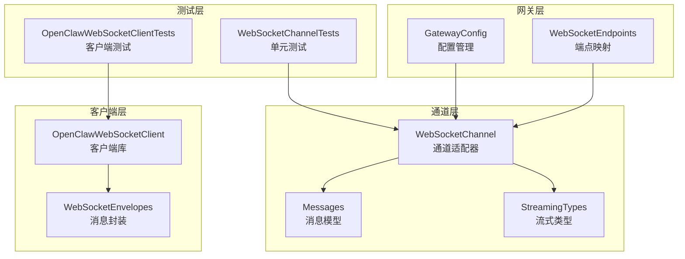
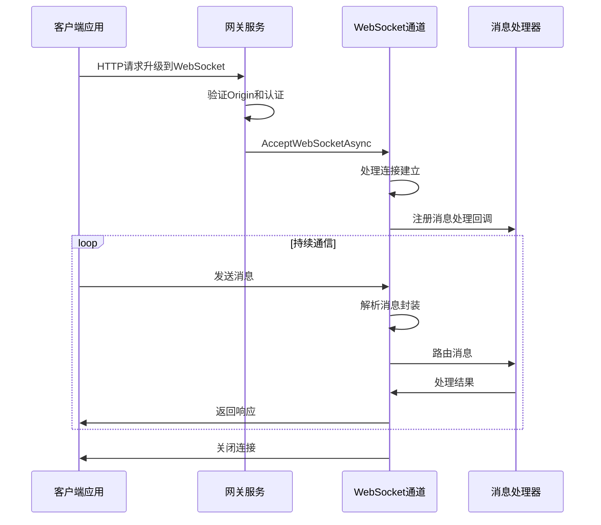
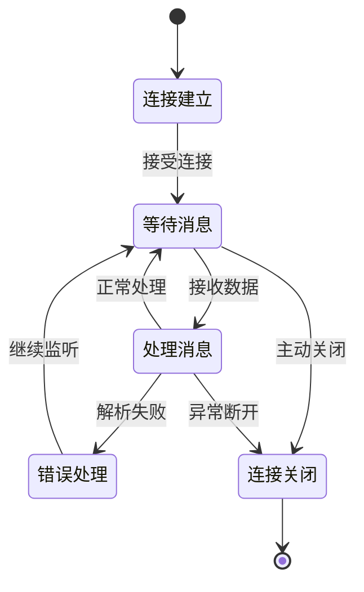
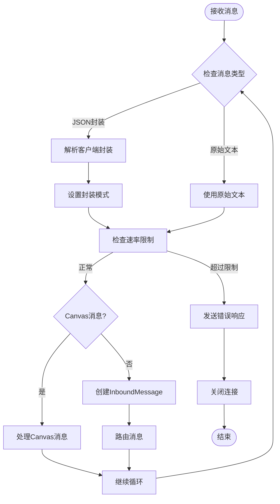
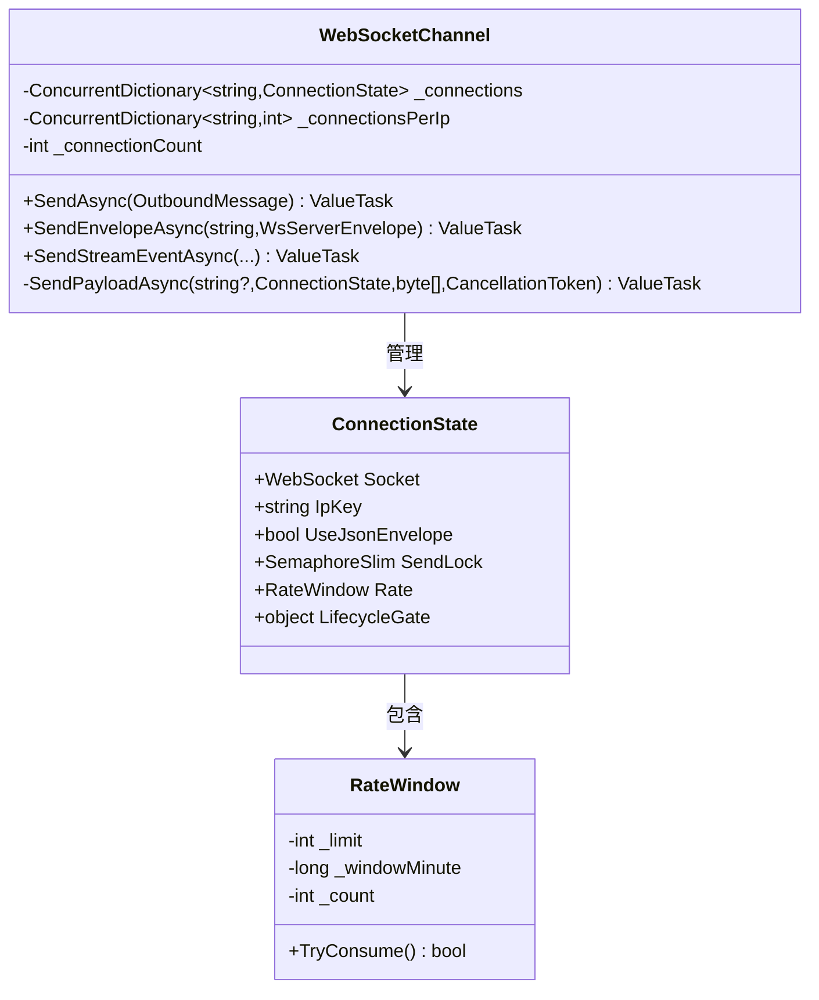
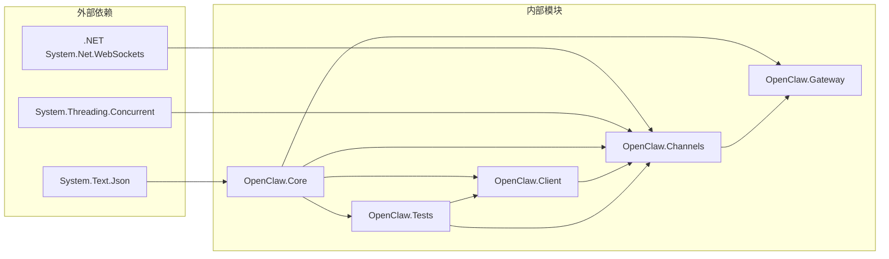
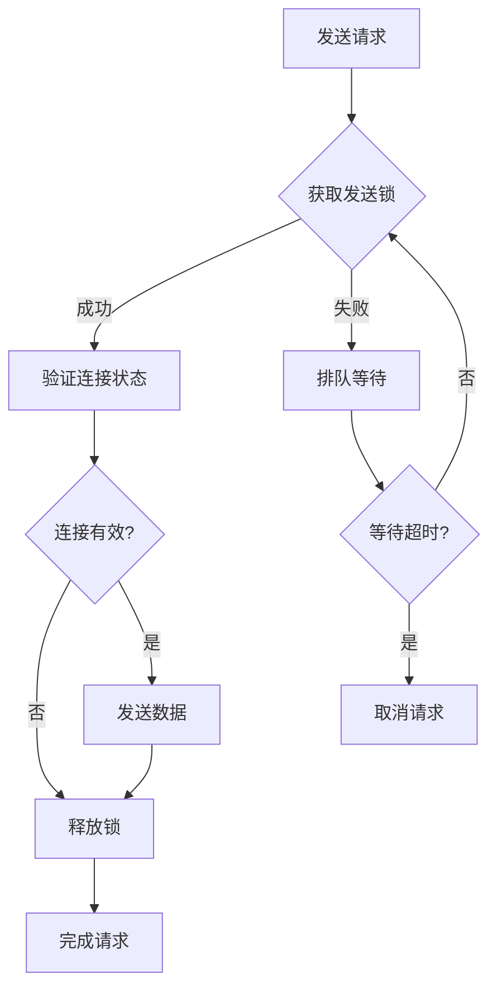

# WebSocket端点

<cite>
**本文档引用的文件**
- [WebSocketChannel.cs](file://src/OpenClaw.Channels/WebSocketChannel.cs)
- [WebSocketEnvelopes.cs](file://src/OpenClaw.Core/Models/WebSocketEnvelopes.cs)
- [WebSocketEndpoints.cs](file://src/OpenClaw.Gateway/Endpoints/WebSocketEndpoints.cs)
- [OpenClawWebSocketClient.cs](file://src/OpenClaw.Client/OpenClawWebSocketClient.cs)
- [GatewayConfig.cs](file://src/OpenClaw.Core/Models/GatewayConfig.cs)
- [Messages.cs](file://src/OpenClaw.Core/Models/Messages.cs)
- [StreamingTypes.cs](file://src/OpenClaw.Core/Models/StreamingTypes.cs)
- [WebSocketChannelTests.cs](file://src/OpenClaw.Tests/WebSocketChannelTests.cs)
- [OpenClawWebSocketClientTests.cs](file://src/OpenClaw.Tests/OpenClawWebSocketClientTests.cs)
</cite>

## 目录
1. [简介](#简介)
2. [项目结构](#项目结构)
3. [核心组件](#核心组件)
4. [架构概览](#架构概览)
5. [详细组件分析](#详细组件分析)
6. [依赖关系分析](#依赖关系分析)
7. [性能考虑](#性能考虑)
8. [故障排除指南](#故障排除指南)
9. [结论](#结论)

## 简介

本文档为Kingcrab项目的WebSocket端点提供了全面的API文档。该系统实现了实时通信协议，支持双向数据传输，包括JSON消息封装和原始文本传输两种模式。WebSocket端点作为主要的控制平面，为配套应用程序提供实时通信能力。

系统采用分层架构设计，包含网关端点映射、通道适配器、客户端库和测试框架等组件。支持连接管理、消息路由、速率限制和错误处理等核心功能。

## 项目结构

**图表来源**
- [WebSocketEndpoints.cs:13-61](file://src/OpenClaw.Gateway/Endpoints/WebSocketEndpoints.cs#L13-L61)
- [WebSocketChannel.cs:16-75](file://src/OpenClaw.Channels/WebSocketChannel.cs#L16-L75)
- [OpenClawWebSocketClient.cs:9-248](file://src/OpenClaw.Client/OpenClawWebSocketClient.cs#L9-L248)

**章节来源**
- [WebSocketEndpoints.cs:1-191](file://src/OpenClaw.Gateway/Endpoints/WebSocketEndpoints.cs#L1-L191)
- [WebSocketChannel.cs:1-650](file://src/OpenClaw.Channels/WebSocketChannel.cs#L1-L650)
- [OpenClawWebSocketClient.cs:1-248](file://src/OpenClaw.Client/OpenClawWebSocketClient.cs#L1-L248)

## 核心组件

### WebSocket通道适配器

WebSocketChannel是系统的核心组件，实现了IChannelAdapter接口，负责处理WebSocket连接和消息传输。

**主要特性：**
- 支持JSON封装消息和原始文本消息
- 连接状态管理
- 速率限制控制
- 消息解析和路由
- 流式事件传输

**关键配置参数：**
- 最大消息大小：256KB（默认）
- 最大连接数：1,000（默认）
- 每IP最大连接数：50（默认）
- 每分钟消息限制：120条（默认）
- 接收超时：120秒（默认）

**章节来源**
- [WebSocketChannel.cs:67-75](file://src/OpenClaw.Channels/WebSocketChannel.cs#L67-L75)
- [GatewayConfig.cs:386-393](file://src/OpenClaw.Core/Models/GatewayConfig.cs#L386-L393)

### WebSocket消息封装

系统定义了标准的消息封装格式，支持JSON序列化和反序列化。

**客户端封装（WsClientEnvelope）：**
- Type：消息类型标识
- Text/Content：消息内容
- SessionId：会话标识
- MessageId/ReplyToMessageId：消息关联
- Canvas相关字段：UI交互支持

**服务器封装（WsServerEnvelope）：**
- Type：响应类型
- Text：响应内容
- InReplyToMessageId：回复关联
- 流式事件支持：工具执行状态

**章节来源**
- [WebSocketEnvelopes.cs:7-108](file://src/OpenClaw.Core/Models/WebSocketEnvelopes.cs#L7-L108)

### 网关端点映射

WebSocketEndpoints负责HTTP到WebSocket的升级转换，实现安全验证和连接管理。

**端点配置：**
- `/ws`：标准WebSocket端点
- `/ws/live`：实时会话端点

**安全验证：**
- Origin验证
- 认证令牌验证
- IP速率限制
- 绑定地址检查

**章节来源**
- [WebSocketEndpoints.cs:18-61](file://src/OpenClaw.Gateway/Endpoints/WebSocketEndpoints.cs#L18-L61)

## 架构概览

**图表来源**
- [WebSocketEndpoints.cs:18-26](file://src/OpenClaw.Gateway/Endpoints/WebSocketEndpoints.cs#L18-L26)
- [WebSocketChannel.cs:76-151](file://src/OpenClaw.Channels/WebSocketChannel.cs#L76-L151)

## 详细组件分析

### 连接管理机制

WebSocketChannel实现了完整的连接生命周期管理：

**连接状态管理：**
- 连接计数跟踪
- IP地址分组统计
- 并发连接限制
- 生命周期清理

**章节来源**
- [WebSocketChannel.cs:334-381](file://src/OpenClaw.Channels/WebSocketChannel.cs#L334-L381)

### 消息处理流程

系统支持两种消息处理模式：

**消息类型支持：**
- 用户消息（user_message）
- Canvas就绪（canvas_ready）
- Canvas确认（canvas_ack）
- 工具审批（tool_approval_decision）
- A2UI事件和操作

**章节来源**
- [WebSocketChannel.cs:523-587](file://src/OpenClaw.Channels/WebSocketChannel.cs#L523-L587)

### 出站消息投递

**投递策略：**
- 基于客户端ID的精确路由
- 封装模式自动检测
- 发送锁防止并发冲突
- 连接状态验证

**章节来源**
- [WebSocketChannel.cs:153-232](file://src/OpenClaw.Channels/WebSocketChannel.cs#L153-L232)

### 客户端实现指南

OpenClawWebSocketClient提供了完整的客户端实现：

**连接管理：**
- 自动重连机制
- 发送锁保护
- 接收循环独立线程
- 资源清理

**消息发送：**
- JSON封装支持
- 大小限制检查
- 异步发送队列
- 错误处理

**事件处理：**
- 文本消息回调
- 封装消息回调
- 错误事件通知

**章节来源**
- [OpenClawWebSocketClient.cs:38-227](file://src/OpenClaw.Client/OpenClawWebSocketClient.cs#L38-L227)

## 依赖关系分析

**依赖特点：**
- 松耦合设计，模块间职责清晰
- 标准库优先，减少第三方依赖
- 类型安全的JSON序列化
- 并发安全的数据结构

**章节来源**
- [WebSocketChannel.cs:1-8](file://src/OpenClaw.Channels/WebSocketChannel.cs#L1-L8)
- [OpenClawWebSocketClient.cs:1-5](file://src/OpenClaw.Client/OpenClawWebSocketClient.cs#L1-L5)

## 性能考虑

### 速率限制机制

系统实现了多层速率限制以确保稳定性：

**连接级限制：**
- 全局连接数上限
- 每IP连接数限制
- 动态连接计数更新

**消息级限制：**
- 每分钟消息配额
- 时间窗口滑动计算
- 实时消费检查

**内存管理：**
- 对象池化缓冲区
- 及时释放资源
- 防止内存泄漏

### 并发控制

**优化策略：**
- 发送锁防止并发冲突
- 连接状态快速验证
- 超时机制避免阻塞
- 资源池化减少GC

**章节来源**
- [WebSocketChannel.cs:383-433](file://src/OpenClaw.Channels/WebSocketChannel.cs#L383-L433)

## 故障排除指南

### 常见问题诊断

**连接被拒绝：**
- 检查Origin验证配置
- 验证认证令牌有效性
- 确认IP白名单设置
- 查看绑定地址配置

**消息丢失：**
- 验证消息大小限制
- 检查速率限制配置
- 确认客户端封装模式
- 排查网络中断情况

**性能问题：**
- 监控连接数使用率
- 分析消息处理时间
- 检查内存使用情况
- 评估CPU占用率

### 错误处理机制

**异常分类：**
- 连接异常：网络中断、超时
- 解析异常：JSON格式错误
- 业务异常：权限不足、配额超限
- 系统异常：资源不足、内部错误

**恢复策略：**
- 自动重连机制
- 优雅降级处理
- 错误日志记录
- 资源清理保证

**章节来源**
- [WebSocketChannel.cs:435-510](file://src/OpenClaw.Channels/WebSocketChannel.cs#L435-L510)
- [WebSocketChannelTests.cs:408-433](file://src/OpenClaw.Tests/WebSocketChannelTests.cs#L408-L433)

## 结论

Kingcrab的WebSocket端点系统提供了完整、可靠的实时通信解决方案。通过精心设计的架构和完善的错误处理机制，系统能够满足生产环境的高可用性要求。

**核心优势：**
- 清晰的分层架构设计
- 完善的连接和消息管理
- 强大的扩展性和可维护性
- 丰富的测试覆盖

**适用场景：**
- 实时聊天应用
- 控制面板通信
- 数据流传输
- 事件驱动系统

该系统为开发者提供了清晰的API接口和详细的实现参考，便于集成和扩展各种实时通信需求。