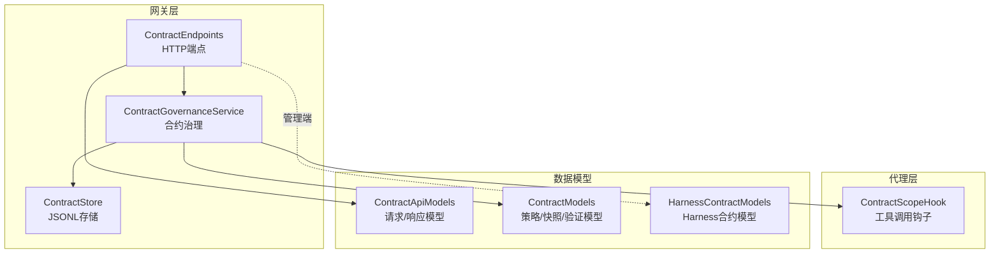
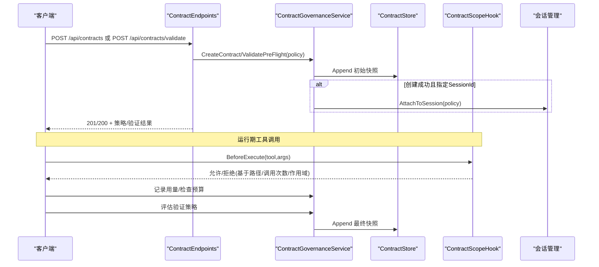
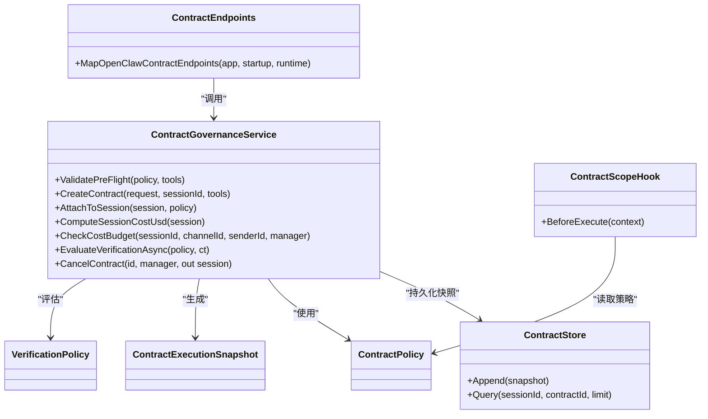
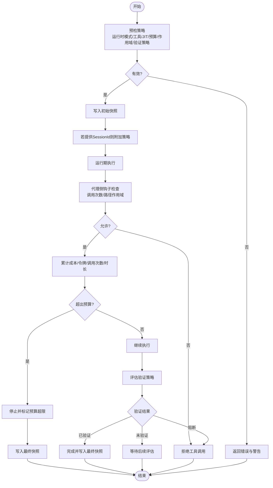

# 合约端点

<cite>
**本文引用的文件**
- [ContractEndpoints.cs](file://src/OpenClaw.Gateway/Endpoints/ContractEndpoints.cs)
- [ContractApiModels.cs](file://src/OpenClaw.Core/Models/ContractApiModels.cs)
- [ContractModels.cs](file://src/OpenClaw.Core/Models/ContractModels.cs)
- [ContractGovernanceService.cs](file://src/OpenClaw.Gateway/ContractGovernanceService.cs)
- [ContractStore.cs](file://src/OpenClaw.Gateway/ContractStore.cs)
- [ContractScopeHook.cs](file://src/OpenClaw.Agent/ContractScopeHook.cs)
- [HarnessContractModels.cs](file://src/OpenClaw.Core/Models/HarnessContractModels.cs)
- [AdminEndpoints.HarnessContracts.cs](file://src/OpenClaw.Gateway/Endpoints/AdminEndpoints.HarnessContracts.cs)
</cite>

## 目录
1. [简介](#简介)
2. [项目结构](#项目结构)
3. [核心组件](#核心组件)
4. [架构总览](#架构总览)
5. [详细组件分析](#详细组件分析)
6. [依赖关系分析](#依赖关系分析)
7. [性能考虑](#性能考虑)
8. [故障排查指南](#故障排查指南)
9. [结论](#结论)
10. [附录](#附录)

## 简介
本文件面向合约端点的API文档，聚焦于“合约管理”相关能力，包括合约创建、预检验证、状态查询、取消终止等。文档同时阐述合约模板（策略）的构成、执行流程、状态跟踪与合规性检查机制，并提供开发示例与最佳实践建议，帮助开发者在保证安全与合规的前提下高效使用合约端点。

## 项目结构
合约端点位于网关层，围绕“合约治理服务”组织，结合“合约存储”持久化快照，并通过“代理侧钩子”在运行期强制执行路径与调用次数等约束。管理员端还提供“Harness合约”的管理接口，用于更高阶的自动化工作流治理。

图表来源
- [ContractEndpoints.cs:1-280](file://src/OpenClaw.Gateway/Endpoints/ContractEndpoints.cs#L1-L280)
- [ContractGovernanceService.cs:1-826](file://src/OpenClaw.Gateway/ContractGovernanceService.cs#L1-L826)
- [ContractStore.cs:1-67](file://src/OpenClaw.Gateway/ContractStore.cs#L1-L67)
- [ContractScopeHook.cs:1-225](file://src/OpenClaw.Agent/ContractScopeHook.cs#L1-L225)
- [ContractApiModels.cs:1-65](file://src/OpenClaw.Core/Models/ContractApiModels.cs#L1-L65)
- [ContractModels.cs:1-131](file://src/OpenClaw.Core/Models/ContractModels.cs#L1-L131)
- [HarnessContractModels.cs:1-193](file://src/OpenClaw.Core/Models/HarnessContractModels.cs#L1-L193)

章节来源
- [ContractEndpoints.cs:1-280](file://src/OpenClaw.Gateway/Endpoints/ContractEndpoints.cs#L1-L280)
- [ContractGovernanceService.cs:1-826](file://src/OpenClaw.Gateway/ContractGovernanceService.cs#L1-L826)
- [ContractStore.cs:1-67](file://src/OpenClaw.Gateway/ContractStore.cs#L1-L67)
- [ContractScopeHook.cs:1-225](file://src/OpenClaw.Agent/ContractScopeHook.cs#L1-L225)
- [ContractApiModels.cs:1-65](file://src/OpenClaw.Core/Models/ContractApiModels.cs#L1-L65)
- [ContractModels.cs:1-131](file://src/OpenClaw.Core/Models/ContractModels.cs#L1-L131)
- [HarnessContractModels.cs:1-193](file://src/OpenClaw.Core/Models/HarnessContractModels.cs#L1-L193)

## 核心组件
- 合约端点组：提供合约创建、预检验证、列表查询、详情查询、取消等REST接口。
- 合约治理服务：负责策略校验、成本估算、预算检查、生命周期管理、验证评估与快照生成。
- 合约存储：以JSONL格式持久化合约执行快照，支持按会话/合约ID查询。
- 代理侧钩子：在工具调用前强制执行路径范围、工具调用次数等约束。
- 数据模型：定义合约策略、验证策略、执行快照及API请求/响应结构。

章节来源
- [ContractEndpoints.cs:10-194](file://src/OpenClaw.Gateway/Endpoints/ContractEndpoints.cs#L10-L194)
- [ContractGovernanceService.cs:17-487](file://src/OpenClaw.Gateway/ContractGovernanceService.cs#L17-L487)
- [ContractStore.cs:7-66](file://src/OpenClaw.Gateway/ContractStore.cs#L7-L66)
- [ContractScopeHook.cs:13-116](file://src/OpenClaw.Agent/ContractScopeHook.cs#L13-L116)
- [ContractApiModels.cs:6-65](file://src/OpenClaw.Core/Models/ContractApiModels.cs#L6-L65)
- [ContractModels.cs:41-131](file://src/OpenClaw.Core/Models/ContractModels.cs#L41-L131)

## 架构总览
下图展示从HTTP请求到策略校验、会话绑定、运行期钩子控制以及验证评估的整体流程。

图表来源
- [ContractEndpoints.cs:20-120](file://src/OpenClaw.Gateway/Endpoints/ContractEndpoints.cs#L20-L120)
- [ContractGovernanceService.cs:53-207](file://src/OpenClaw.Gateway/ContractGovernanceService.cs#L53-L207)
- [ContractStore.cs:25-43](file://src/OpenClaw.Gateway/ContractStore.cs#L25-L43)
- [ContractScopeHook.cs:37-110](file://src/OpenClaw.Agent/ContractScopeHook.cs#L37-L110)

## 详细组件分析

### 合约端点（API）
- 预检验证
  - 方法：POST /api/contracts/validate
  - 功能：构建临时策略进行预检，返回工具可用性、预算与模式合规性等结果。
  - 安全：需要授权与CSRF保护；记录审计。
- 创建合约
  - 方法：POST /api/contracts
  - 功能：创建合约策略并持久化初始快照；如提供SessionId则将策略附加至会话。
  - 安全：需要授权与CSRF保护；记录审计。
- 列表查询
  - 方法：GET /api/contracts
  - 功能：按会话过滤列出最近合约快照。
  - 安全：需要授权；记录审计。
- 详情查询
  - 方法：GET /api/contracts/{id}
  - 功能：返回合约策略与最新执行快照。
  - 安全：需要授权；记录审计。
- 取消合约
  - 方法：POST /api/contracts/{id}/cancel
  - 功能：标记合约为取消，移除会话上的策略并持久化最终快照。
  - 安全：需要授权与CSRF保护；记录审计与运行事件。

章节来源
- [ContractEndpoints.cs:20-194](file://src/OpenClaw.Gateway/Endpoints/ContractEndpoints.cs#L20-L194)

### 合约治理服务（策略与生命周期）
- 预检验证
  - 运行时模式校验（AOT/JIT）、工具可用性与JIT兼容性、预算参数合法性、作用域能力有效性、验证策略完整性。
- 创建合约
  - 生成唯一ID、构建策略、执行预检、写入初始快照、发出运行事件。
- 会话绑定
  - 将策略写入会话并初始化基线用量，随后生成活跃快照。
- 成本与预算
  - 实时累计USD成本、令牌用量、工具调用次数、运行时长；支持软预警与硬阈值。
- 取消与解绑
  - 清理会话上的策略与基线，生成取消快照。
- 验证评估
  - 支持文件存在/包含、HTTP状态码、HTTP正文包含、操作员确认等检查项，输出聚合状态与明细。

章节来源
- [ContractGovernanceService.cs:53-487](file://src/OpenClaw.Gateway/ContractGovernanceService.cs#L53-L487)

### 合约存储（快照持久化）
- 存储介质：JSONL文件，按时间倒序保留最新快照。
- 查询能力：支持按会话ID或合约ID过滤，限制最大返回条数。
- 并发与可靠性：文件级锁保护追加写入，异常时记录警告日志。

章节来源
- [ContractStore.cs:25-66](file://src/OpenClaw.Gateway/ContractStore.cs#L25-L66)

### 代理侧钩子（运行期合规）
- 执行时机：工具调用前（BeforeExecute）。
- 控制维度：
  - 工具调用次数上限（MaxToolCalls）
  - 路径作用域限制（ScopedCapabilities），仅允许在白名单路径内访问
  - 特殊工具（shell/code_exec/git/process/file_*等）在有作用域限制时的额外约束
- 路径解析：支持~展开与真实路径规范化比较，严格限定在允许根路径内。

章节来源
- [ContractScopeHook.cs:37-110](file://src/OpenClaw.Agent/ContractScopeHook.cs#L37-L110)

### 数据模型（策略、快照与API）
- 合约策略（ContractPolicy）
  - 包含运行时模式要求、工具清单、作用域能力、预算限额、验证策略等。
- 执行快照（ContractExecutionSnapshot）
  - 记录合约状态、累计成本/令牌/调用次数、耗时、生命周期与验证状态。
- 验证策略（VerificationPolicy/Check）
  - 支持多种检查类型，含HTTP与文件类检查，以及操作员确认阻断。
- API模型（ContractApiModels）
  - 请求/响应结构，涵盖创建、验证、列表、详情等场景。

章节来源
- [ContractModels.cs:41-131](file://src/OpenClaw.Core/Models/ContractModels.cs#L41-L131)
- [ContractApiModels.cs:6-65](file://src/OpenClaw.Core/Models/ContractApiModels.cs#L6-L65)

### 管理端Harness合约（扩展能力）
- 端点：/admin/harness/contracts（列表/详情/创建/状态更新）
- 用途：面向Harness合约的全生命周期管理，支持状态变更与审计记录。
- 与普通合约的关系：Harness合约关注更高阶的工作流与资源约束，适合复杂自动化场景。

章节来源
- [AdminEndpoints.HarnessContracts.cs:14-179](file://src/OpenClaw.Gateway/Endpoints/AdminEndpoints.HarnessContracts.cs#L14-L179)
- [HarnessContractModels.cs:48-193](file://src/OpenClaw.Core/Models/HarnessContractModels.cs#L48-L193)

## 依赖关系分析

图表来源
- [ContractEndpoints.cs:10-194](file://src/OpenClaw.Gateway/Endpoints/ContractEndpoints.cs#L10-L194)
- [ContractGovernanceService.cs:17-487](file://src/OpenClaw.Gateway/ContractGovernanceService.cs#L17-L487)
- [ContractStore.cs:7-66](file://src/OpenClaw.Gateway/ContractStore.cs#L7-L66)
- [ContractScopeHook.cs:13-116](file://src/OpenClaw.Agent/ContractScopeHook.cs#L13-L116)
- [ContractModels.cs:41-131](file://src/OpenClaw.Core/Models/ContractModels.cs#L41-L131)

## 性能考虑
- 预检验证避免昂贵的创建流程，适合批量策略快速评估。
- 快照写入采用文件追加+锁保护，建议控制请求频率，避免高并发写入抖动。
- 验证策略中的HTTP检查设置超时与大小限制，防止阻塞与资源滥用。
- 成本与用量统计基于会话历史与基线差值，避免重复扫描全量历史。

## 故障排查指南
- 预检失败
  - 检查运行时模式是否匹配（AOT/JIT）、工具是否注册、预算参数是否合法、作用域路径是否配置。
- 创建失败
  - 查看运行事件与审计日志，确认策略ID与会话ID是否正确，是否存在权限或速率限制。
- 运行期被拒
  - 检查代理侧钩子日志，确认是否超过工具调用次数、路径是否在作用域范围内。
- 验证未通过
  - 核对验证策略的检查项（文件/HTTP/操作员确认），查看具体检查结果摘要。
- 取消后仍受限
  - 确认会话是否已解绑策略并持久化，检查当前会话的ContractPolicy是否为空。

章节来源
- [ContractGovernanceService.cs:53-139](file://src/OpenClaw.Gateway/ContractGovernanceService.cs#L53-L139)
- [ContractScopeHook.cs:43-110](file://src/OpenClaw.Agent/ContractScopeHook.cs#L43-L110)
- [ContractStore.cs:25-43](file://src/OpenClaw.Gateway/ContractStore.cs#L25-L43)

## 结论
合约端点提供了从策略创建、预检、会话绑定到运行期合规与验证评估的完整闭环。通过严格的预算与作用域控制、可观测的快照与审计，以及可扩展的验证策略，系统在保障安全与合规的同时，也为复杂自动化场景提供了灵活的治理能力。管理员端Harness合约进一步增强了对高级工作流的治理深度。

## 附录

### API定义与示例

- 预检验证
  - 方法与路径：POST /api/contracts/validate
  - 请求体：ContractValidateRequest（包含运行时模式、工具清单、作用域能力、预算与验证策略）
  - 响应体：ContractValidationResult（包含是否有效、授予/拒绝工具、错误与警告、有效运行时模式）
  - 示例参考：[ContractApiModels.cs:36-47](file://src/OpenClaw.Core/Models/ContractApiModels.cs#L36-L47)

- 创建合约
  - 方法与路径：POST /api/contracts
  - 请求体：ContractCreateRequest（可选SessionId、名称、工具清单、作用域能力、预算、验证策略）
  - 响应体：ContractCreateResponse（包含策略与验证结果）
  - 示例参考：[ContractApiModels.cs:6-31](file://src/OpenClaw.Core/Models/ContractApiModels.cs#L6-L31)

- 列出合约
  - 方法与路径：GET /api/contracts?sessionId=&limit=
  - 响应体：ContractListResponse（包含若干ContractStatusResponse）
  - 示例参考：[ContractApiModels.cs:61-65](file://src/OpenClaw.Core/Models/ContractApiModels.cs#L61-L65)

- 查询单个合约
  - 方法与路径：GET /api/contracts/{id}
  - 响应体：ContractStatusResponse（包含策略与执行快照）
  - 示例参考：[ContractApiModels.cs:52-56](file://src/OpenClaw.Core/Models/ContractApiModels.cs#L52-L56)

- 取消合约
  - 方法与路径：POST /api/contracts/{id}/cancel
  - 响应体：OperationStatusResponse（成功/失败）
  - 示例参考：[ContractEndpoints.cs:156-193](file://src/OpenClaw.Gateway/Endpoints/ContractEndpoints.cs#L156-L193)

- 管理端Harness合约
  - 列表：GET /admin/harness/contracts
  - 详情：GET /admin/harness/contracts/{id}
  - 创建：POST /admin/harness/contracts
  - 状态更新：POST /admin/harness/contracts/{id}/status
  - 示例参考：[AdminEndpoints.HarnessContracts.cs:14-179](file://src/OpenClaw.Gateway/Endpoints/AdminEndpoints.HarnessContracts.cs#L14-L179)

### 合规性检查流程

图表来源
- [ContractGovernanceService.cs:53-487](file://src/OpenClaw.Gateway/ContractGovernanceService.cs#L53-L487)
- [ContractScopeHook.cs:37-110](file://src/OpenClaw.Agent/ContractScopeHook.cs#L37-L110)

### 开发示例与最佳实践
- 策略设计
  - 明确运行时模式要求（AOT/JIT），确保工具与模式兼容。
  - 合理设置预算上限与软预警阈值，避免意外超支。
  - 使用作用域能力限制敏感工具的路径访问，最小化权限。
- 验证策略
  - 对关键产出使用文件/HTTP检查，确保结果可验证。
  - 对需要人工确认的步骤使用操作员确认阻断，确保质量门禁。
- 生命周期管理
  - 在创建后及时附加到目标会话，以便启用实时预算与用量统计。
  - 定期查询快照了解执行状态，必要时提前取消以止损。
- 安全与审计
  - 所有管理操作均需授权与CSRF保护，并记录审计日志。
  - 对HTTP验证目标进行地址白名单与本地回环限制，避免内网探测风险。