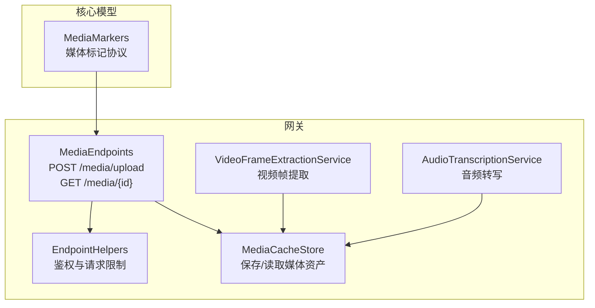
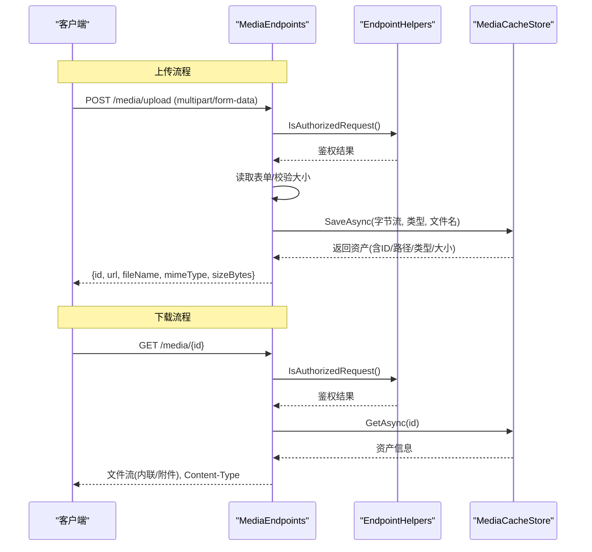
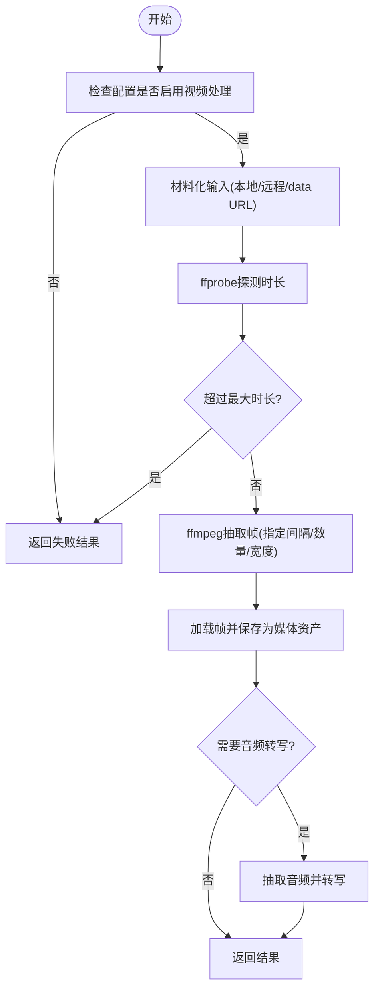
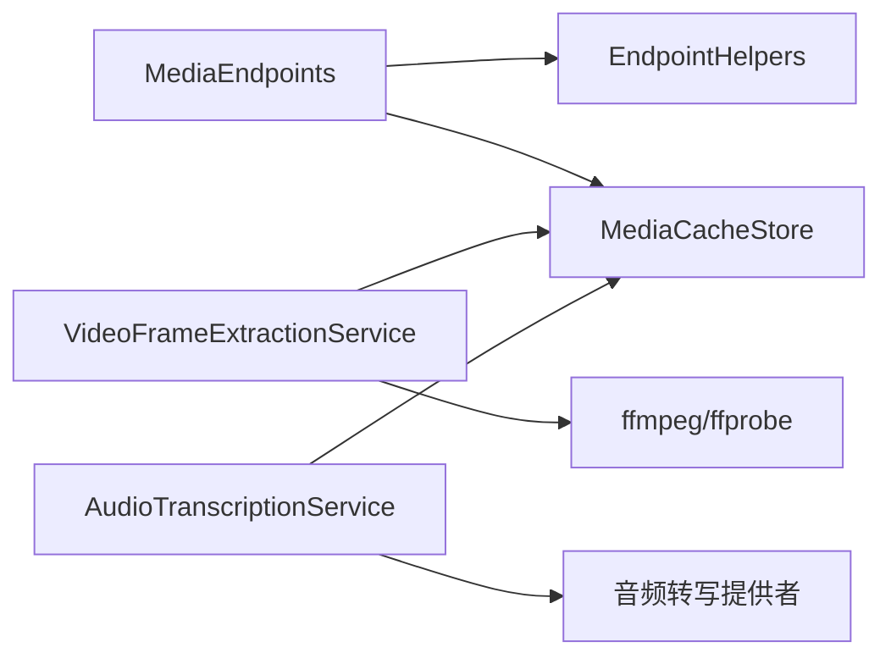

# 媒体端点

<cite>
**本文引用的文件**
- [MediaEndpoints.cs](file://src/OpenClaw.Gateway/Endpoints/MediaEndpoints.cs)
- [MediaCacheStore.cs](file://src/OpenClaw.Gateway/MediaCacheStore.cs)
- [VideoFrameExtractionService.cs](file://src/OpenClaw.Gateway/VideoFrameExtractionService.cs)
- [AudioTranscriptionService.cs](file://src/OpenClaw.Gateway/AudioTranscriptionService.cs)
- [EndpointHelpers.cs](file://src/OpenClaw.Gateway/Endpoints/EndpointHelpers.cs)
- [GatewayStartupContext.cs](file://src/OpenClaw.Gateway/Bootstrap/GatewayStartupContext.cs)
- [MediaMarkers.cs](file://src/OpenClaw.Core/Models/MediaMarkers.cs)
- [MediaMarkerProtocolTests.cs](file://src/OpenClaw.Tests/MediaMarkerProtocolTests.cs)
- [MinerUPdfTool.cs](file://src/OpenClaw.Agent/Tools/MinerUPdfTool.cs)
- [GeminiMultimodalService.cs](file://src/OpenClaw.Gateway/GeminiMultimodalService.cs)
</cite>

## 目录
1. [简介](#简介)
2. [项目结构](#项目结构)
3. [核心组件](#核心组件)
4. [架构总览](#架构总览)
5. [详细组件分析](#详细组件分析)
6. [依赖关系分析](#依赖关系分析)
7. [性能考虑](#性能考虑)
8. [故障排查指南](#故障排查指南)
9. [结论](#结论)
10. [附录](#附录)

## 简介
本文件面向“媒体端点”的API文档与实现说明，覆盖媒体文件上传、下载、预览与管理的完整流程；解释媒体处理（视频帧提取、音频转写）流程、文件格式支持、存储策略与访问控制；并提供操作示例与性能优化建议。目标是帮助开发者与运维人员快速理解与正确使用媒体能力。

## 项目结构
媒体能力由网关层的端点、缓存存储、处理服务与安全辅助模块共同组成，核心文件如下：
- 端点映射：负责HTTP接口暴露与请求校验
- 存储：负责媒体资产持久化与元数据管理
- 处理：负责视频帧提取与音频转写等多媒体处理
- 安全：负责鉴权与速率限制
- 模型：负责媒体标记协议与跨渠道媒体解析

图表来源
- [MediaEndpoints.cs:1-87](file://src/OpenClaw.Gateway/Endpoints/MediaEndpoints.cs#L1-L87)
- [EndpointHelpers.cs:1-46](file://src/OpenClaw.Gateway/Endpoints/EndpointHelpers.cs#L1-L46)
- [MediaCacheStore.cs:1-68](file://src/OpenClaw.Gateway/MediaCacheStore.cs#L1-L68)
- [VideoFrameExtractionService.cs:1-426](file://src/OpenClaw.Gateway/VideoFrameExtractionService.cs#L1-L426)
- [AudioTranscriptionService.cs:1-223](file://src/OpenClaw.Gateway/AudioTranscriptionService.cs#L1-L223)
- [MediaMarkers.cs:1-164](file://src/OpenClaw.Core/Models/MediaMarkers.cs#L1-L164)

章节来源
- [MediaEndpoints.cs:1-87](file://src/OpenClaw.Gateway/Endpoints/MediaEndpoints.cs#L1-L87)
- [MediaCacheStore.cs:1-68](file://src/OpenClaw.Gateway/MediaCacheStore.cs#L1-L68)
- [VideoFrameExtractionService.cs:1-426](file://src/OpenClaw.Gateway/VideoFrameExtractionService.cs#L1-L426)
- [AudioTranscriptionService.cs:1-223](file://src/OpenClaw.Gateway/AudioTranscriptionService.cs#L1-L223)
- [EndpointHelpers.cs:1-46](file://src/OpenClaw.Gateway/Endpoints/EndpointHelpers.cs#L1-L46)
- [MediaMarkers.cs:1-164](file://src/OpenClaw.Core/Models/MediaMarkers.cs#L1-L164)

## 核心组件
- 媒体端点：提供上传与下载两个核心接口，支持多部分表单上传与按ID下载
- 媒体缓存存储：统一保存媒体文件与JSON元数据，自动推断扩展名
- 视频帧提取服务：基于ffmpeg/ffprobe进行视频时长探测、抽帧与可选音频转写
- 音频转写服务：通过可插拔提供者对音频进行转写，支持超时与降级策略
- 安全辅助：在非回环绑定时进行令牌鉴权，支持浏览器会话与速率限制
- 媒体标记协议：用于消息中嵌入媒体URL或路径标记，便于工具与通道识别

章节来源
- [MediaEndpoints.cs:1-87](file://src/OpenClaw.Gateway/Endpoints/MediaEndpoints.cs#L1-L87)
- [MediaCacheStore.cs:1-68](file://src/OpenClaw.Gateway/MediaCacheStore.cs#L1-L68)
- [VideoFrameExtractionService.cs:1-426](file://src/OpenClaw.Gateway/VideoFrameExtractionService.cs#L1-L426)
- [AudioTranscriptionService.cs:1-223](file://src/OpenClaw.Gateway/AudioTranscriptionService.cs#L1-L223)
- [EndpointHelpers.cs:1-46](file://src/OpenClaw.Gateway/Endpoints/EndpointHelpers.cs#L1-L46)
- [MediaMarkers.cs:1-164](file://src/OpenClaw.Core/Models/MediaMarkers.cs#L1-L164)

## 架构总览
媒体端点的调用链路如下：

图表来源
- [MediaEndpoints.cs:13-84](file://src/OpenClaw.Gateway/Endpoints/MediaEndpoints.cs#L13-L84)
- [EndpointHelpers.cs:35-46](file://src/OpenClaw.Gateway/Endpoints/EndpointHelpers.cs#L35-L46)
- [MediaCacheStore.cs:16-50](file://src/OpenClaw.Gateway/MediaCacheStore.cs#L16-L50)

## 详细组件分析

### 媒体上传端点
- 接口定义
  - 方法：POST
  - 路径：/media/upload
  - 请求体：multipart/form-data，字段名为file
  - 成功响应：返回对象包含id、url、fileName、mimeType、sizeBytes
- 行为与约束
  - 非回环绑定时需携带有效令牌
  - 最大上传体积限制（默认50MB）
  - 仅接受multipart/form-data
  - 读取IFormFile后将内容加载到内存再保存
- 错误码
  - 401：未授权
  - 400：表单读取失败或缺少文件
  - 413：超过最大上传体积
- 输出示例
  - 返回字段：id（媒体唯一标识）、url（下载地址）、fileName（原始文件名）、mimeType（媒体类型）、sizeBytes（字节数）

章节来源
- [MediaEndpoints.cs:13-60](file://src/OpenClaw.Gateway/Endpoints/MediaEndpoints.cs#L13-L60)

### 媒体下载端点
- 接口定义
  - 方法：GET
  - 路径：/media/{id}
  - 参数：id（媒体唯一标识）
- 行为与约束
  - 非回环绑定时需携带有效令牌
  - 对id进行路径遍历字符过滤
  - 根据媒体类型选择内联显示或附件下载
  - 启用范围请求以支持断点续传与预览
- 错误码
  - 401：未授权
  - 404：id不存在或文件缺失
- 输出示例
  - 返回对应媒体文件，Content-Disposition根据类型自动设置

章节来源
- [MediaEndpoints.cs:62-84](file://src/OpenClaw.Gateway/Endpoints/MediaEndpoints.cs#L62-L84)

### 媒体缓存存储
- 功能
  - 生成唯一ID并推断扩展名
  - 将媒体字节写入磁盘
  - 写入同名JSON元数据文件
- 关键点
  - 扩展名推断优先使用文件名后缀，其次依据媒体类型
  - 支持的媒体类型映射包括常见图片与音频格式
- 数据结构
  - 资产对象包含：Id、MediaType、FileName、Path、SizeBytes、CreatedAtUtc

章节来源
- [MediaCacheStore.cs:16-66](file://src/OpenClaw.Gateway/MediaCacheStore.cs#L16-L66)

### 视频帧提取服务
- 功能
  - 探测视频时长与尺寸
  - 使用ffmpeg按固定间隔抽取JPG帧
  - 可选抽取音频并转写文本
  - 将每帧与音频保存为媒体资产并返回
- 输入
  - 支持本地文件URI、data URL（要求base64编码）、二进制数据
- 配置与限制
  - 最大视频体积、最大帧数、帧间隔、帧宽度、最大时长
- 失败降级
  - 当启用降级模式时，异常被转换为结果对象并记录日志

图表来源
- [VideoFrameExtractionService.cs:59-105](file://src/OpenClaw.Gateway/VideoFrameExtractionService.cs#L59-L105)
- [VideoFrameExtractionService.cs:107-145](file://src/OpenClaw.Gateway/VideoFrameExtractionService.cs#L107-L145)
- [VideoFrameExtractionService.cs:169-215](file://src/OpenClaw.Gateway/VideoFrameExtractionService.cs#L169-L215)
- [VideoFrameExtractionService.cs:217-267](file://src/OpenClaw.Gateway/VideoFrameExtractionService.cs#L217-L267)

章节来源
- [VideoFrameExtractionService.cs:1-426](file://src/OpenClaw.Gateway/VideoFrameExtractionService.cs#L1-L426)

### 音频转写服务
- 功能
  - 通过可插拔提供者执行音频转写
  - 支持超时控制与失败降级
  - 限制音频大小与允许的本地根目录
- 提供者
  - 示例：Gemini音频转写提供者
- 失败降级
  - 根据配置决定抛出异常还是返回可用结果

章节来源
- [AudioTranscriptionService.cs:1-223](file://src/OpenClaw.Gateway/AudioTranscriptionService.cs#L1-L223)
- [GeminiMultimodalService.cs:283-311](file://src/OpenClaw.Gateway/GeminiMultimodalService.cs#L283-L311)

### 媒体标记协议
- 作用
  - 在文本中识别并提取媒体标记（如图片URL、文件URL、视频URL、音频URL等）
  - 支持Telegram特定文件ID标记
- 应用
  - 工具与通道在解析消息时可利用该协议定位媒体资源
  - 测试用例验证了多种标记格式的解析

章节来源
- [MediaMarkers.cs:1-164](file://src/OpenClaw.Core/Models/MediaMarkers.cs#L1-L164)
- [MediaMarkerProtocolTests.cs:1-46](file://src/OpenClaw.Tests/MediaMarkerProtocolTests.cs#L1-L46)

### 访问控制与安全
- 非回环绑定场景下，必须携带有效令牌
- 支持从查询参数或请求头读取令牌
- 提供浏览器会话鉴权与速率限制消费逻辑

章节来源
- [EndpointHelpers.cs:35-46](file://src/OpenClaw.Gateway/Endpoints/EndpointHelpers.cs#L35-L46)
- [GatewayStartupContext.cs:1-15](file://src/OpenClaw.Gateway/Bootstrap/GatewayStartupContext.cs#L1-L15)

## 依赖关系分析
- 端点依赖安全辅助进行鉴权
- 端点与处理服务均依赖媒体缓存存储进行持久化
- 视频帧提取服务依赖ffmpeg/ffprobe可执行文件
- 音频转写服务依赖可插拔提供者（如Gemini）

图表来源
- [MediaEndpoints.cs:1-87](file://src/OpenClaw.Gateway/Endpoints/MediaEndpoints.cs#L1-L87)
- [EndpointHelpers.cs:1-46](file://src/OpenClaw.Gateway/Endpoints/EndpointHelpers.cs#L1-L46)
- [MediaCacheStore.cs:1-68](file://src/OpenClaw.Gateway/MediaCacheStore.cs#L1-L68)
- [VideoFrameExtractionService.cs:1-426](file://src/OpenClaw.Gateway/VideoFrameExtractionService.cs#L1-L426)
- [AudioTranscriptionService.cs:1-223](file://src/OpenClaw.Gateway/AudioTranscriptionService.cs#L1-L223)

章节来源
- [MediaEndpoints.cs:1-87](file://src/OpenClaw.Gateway/Endpoints/MediaEndpoints.cs#L1-L87)
- [EndpointHelpers.cs:1-46](file://src/OpenClaw.Gateway/Endpoints/EndpointHelpers.cs#L1-L46)
- [MediaCacheStore.cs:1-68](file://src/OpenClaw.Gateway/MediaCacheStore.cs#L1-L68)
- [VideoFrameExtractionService.cs:1-426](file://src/OpenClaw.Gateway/VideoFrameExtractionService.cs#L1-L426)
- [AudioTranscriptionService.cs:1-223](file://src/OpenClaw.Gateway/AudioTranscriptionService.cs#L1-L223)

## 性能考虑
- 上传内存占用
  - 上传端点将整个文件读入内存后再保存，适合中小文件（默认上限50MB）。对于大文件建议采用分块上传或外部存储直传方案
- 下载范围请求
  - 已启用range处理，有利于大文件断点续传与浏览器预览
- 视频处理
  - 抽帧受帧间隔、最大帧数、帧宽与最大时长限制，避免过度消耗CPU与IO
  - ffmpeg/ffprobe需提前部署并确保可执行权限
- 音频转写
  - 设置合理超时时间，必要时启用降级模式避免阻塞
- 缓存与清理
  - 建议定期清理媒体缓存目录，避免磁盘空间膨胀

## 故障排查指南
- 401 未授权
  - 确认非回环绑定场景下已正确传递令牌
  - 检查令牌是否与配置一致
- 400 表单读取失败
  - 确认请求体为multipart/form-data且包含file字段
- 413 超过最大上传体积
  - 减小文件或调整服务端配置（如需修改源码中的常量）
- 404 媒体不存在
  - 检查ID是否包含路径遍历字符
  - 确认媒体文件与元数据是否存在
- 视频处理失败
  - 检查ffmpeg/ffprobe是否可用
  - 确认视频时长、大小与帧参数未超出限制
- 音频转写失败
  - 检查提供者名称与配置
  - 查看超时与降级策略是否符合预期

章节来源
- [MediaEndpoints.cs:17-84](file://src/OpenClaw.Gateway/Endpoints/MediaEndpoints.cs#L17-L84)
- [EndpointHelpers.cs:35-46](file://src/OpenClaw.Gateway/Endpoints/EndpointHelpers.cs#L35-L46)
- [VideoFrameExtractionService.cs:147-192](file://src/OpenClaw.Gateway/VideoFrameExtractionService.cs#L147-L192)
- [AudioTranscriptionService.cs:47-123](file://src/OpenClaw.Gateway/AudioTranscriptionService.cs#L47-L123)

## 结论
媒体端点提供了简洁可靠的上传与下载能力，并结合视频帧提取与音频转写形成完整的多媒体处理闭环。通过令牌鉴权与范围下载提升安全性与可用性。建议在生产环境中关注内存占用、处理工具部署与缓存清理，以获得更稳定的性能表现。

## 附录

### API定义与示例

- 上传媒体
  - 方法：POST
  - 路径：/media/upload
  - 请求体：multipart/form-data，字段名file
  - 成功响应字段：id、url、fileName、mimeType、sizeBytes
  - 参考路径：[MediaEndpoints.cs:13-60](file://src/OpenClaw.Gateway/Endpoints/MediaEndpoints.cs#L13-L60)

- 下载媒体
  - 方法：GET
  - 路径：/media/{id}
  - 成功响应：媒体文件流，Content-Disposition根据类型自动设置
  - 参考路径：[MediaEndpoints.cs:62-84](file://src/OpenClaw.Gateway/Endpoints/MediaEndpoints.cs#L62-L84)

- 视频帧提取
  - 输入：本地文件URI、data URL（base64）或二进制数据
  - 输出：帧列表与可选音频转写结果
  - 参考路径：[VideoFrameExtractionService.cs:59-105](file://src/OpenClaw.Gateway/VideoFrameExtractionService.cs#L59-L105)

- 音频转写
  - 输入：音频URL、MIME类型、文件名与提供者配置
  - 输出：转写文本与提供者信息
  - 参考路径：[AudioTranscriptionService.cs:47-123](file://src/OpenClaw.Gateway/AudioTranscriptionService.cs#L47-L123)

### 文件格式支持
- 图片：PNG、JPEG
- 音频：WAV、MP3
- 视频：MP4、WebM、QuickTime（由处理服务推断扩展名）

章节来源
- [MediaCacheStore.cs:52-66](file://src/OpenClaw.Gateway/MediaCacheStore.cs#L52-L66)
- [VideoFrameExtractionService.cs:351-364](file://src/OpenClaw.Gateway/VideoFrameExtractionService.cs#L351-L364)

### 存储策略
- 媒体文件与元数据JSON同目录存放
- 元数据包含媒体类型、文件名、路径、大小与创建时间
- 建议定期清理过期资产，避免磁盘压力

章节来源
- [MediaCacheStore.cs:16-50](file://src/OpenClaw.Gateway/MediaCacheStore.cs#L16-L50)

### 访问控制
- 非回环绑定时强制令牌校验
- 支持从查询参数或请求头读取令牌
- 可结合浏览器会话与速率限制策略

章节来源
- [EndpointHelpers.cs:35-46](file://src/OpenClaw.Gateway/Endpoints/EndpointHelpers.cs#L35-L46)
- [GatewayStartupContext.cs:1-15](file://src/OpenClaw.Gateway/Bootstrap/GatewayStartupContext.cs#L1-L15)

### 媒体标记协议使用
- 在消息中嵌入媒体标记，便于工具与通道解析
- 支持标准URL标记与Telegram文件ID标记
- 参考测试用例验证解析行为

章节来源
- [MediaMarkers.cs:22-164](file://src/OpenClaw.Core/Models/MediaMarkers.cs#L22-L164)
- [MediaMarkerProtocolTests.cs:1-46](file://src/OpenClaw.Tests/MediaMarkerProtocolTests.cs#L1-L46)

### 工具与通道中的媒体解析
- PDF工具支持通过/media/{id} URL或标记解析媒体文件
- 多个渠道适配器将媒体标记映射为平台特定的发送载荷

章节来源
- [MinerUPdfTool.cs:165-222](file://src/OpenClaw.Agent/Tools/MinerUPdfTool.cs#L165-L222)