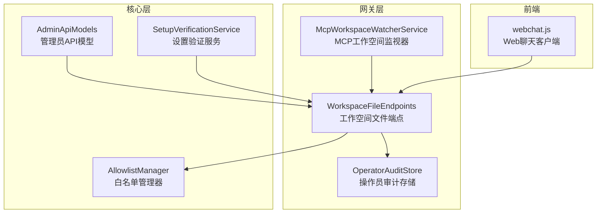
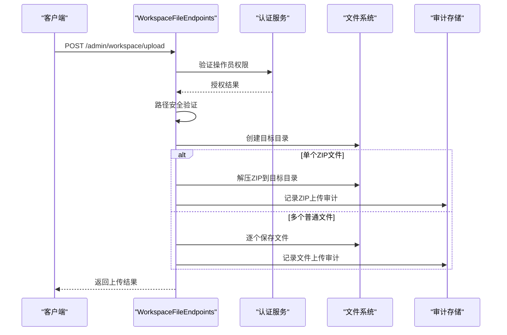
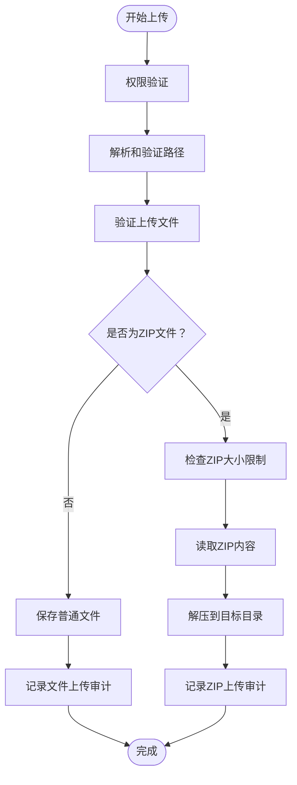
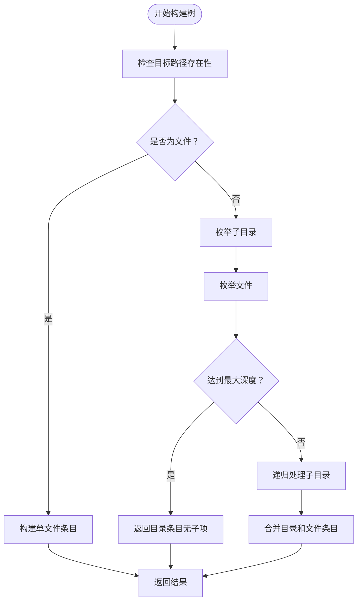
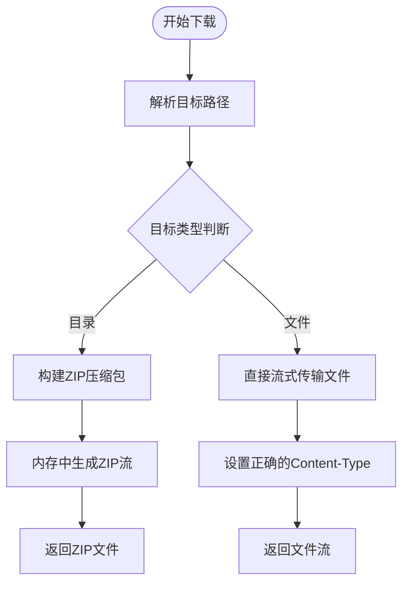
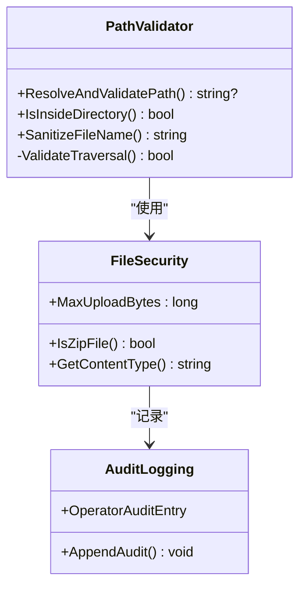
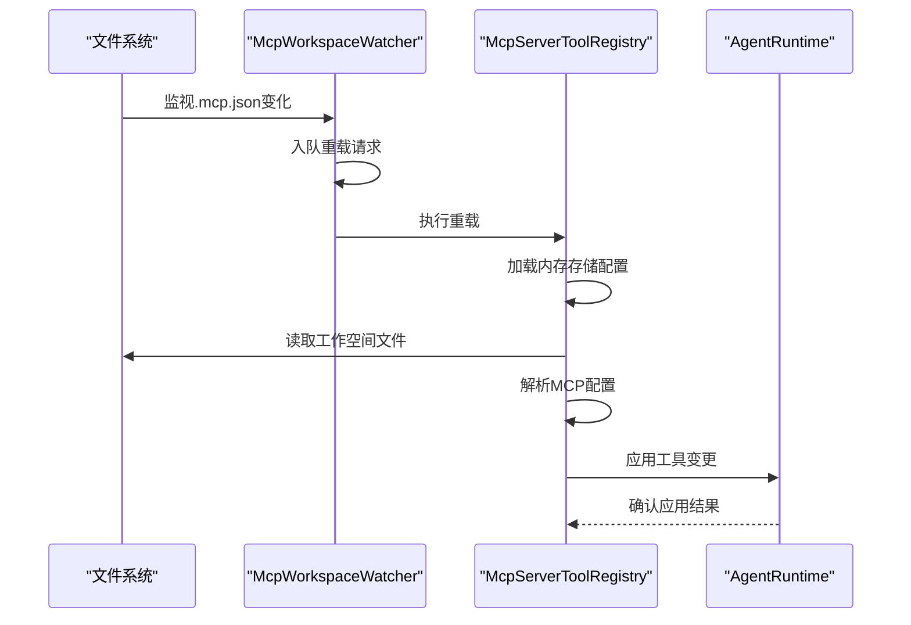
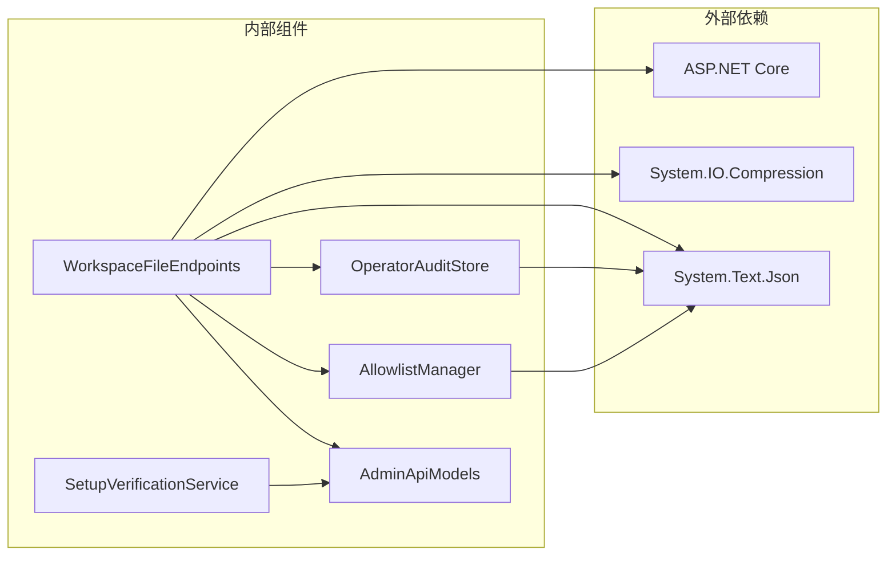

# 工作空间文件端点

<cite>
**本文档引用的文件**
- [WorkspaceFileEndpoints.cs](file://src/OpenClaw.Gateway/Endpoints/WorkspaceFileEndpoints.cs)
- [McpWorkspaceWatcherService.cs](file://src/OpenClaw.Gateway/McpWorkspaceWatcherService.cs)
- [AdminApiModels.cs](file://src/OpenClaw.Core/Models/AdminApiModels.cs)
- [OperatorAuditStore.cs](file://src/OpenClaw.Gateway/OperatorAuditStore.cs)
- [SetupVerificationService.cs](file://src/OpenClaw.Core/Validation/SetupVerificationService.cs)
- [AllowlistManager.cs](file://src/OpenClaw.Core/Security/AllowlistManager.cs)
- [webchat.js](file://src/OpenClaw.Gateway/wwwroot/webchat.js)
- [TOOLS_GUIDE.md](file://docs/TOOLS_GUIDE.md)
</cite>

## 目录
1. [简介](#简介)
2. [项目结构](#项目结构)
3. [核心组件](#核心组件)
4. [架构概览](#架构概览)
5. [详细组件分析](#详细组件分析)
6. [依赖关系分析](#依赖关系分析)
7. [性能考虑](#性能考虑)
8. [故障排除指南](#故障排除指南)
9. [结论](#结论)
10. [附录](#附录)

## 简介
本文件档详细描述了工作空间文件管理相关的API端点，涵盖文件浏览、编辑、版本控制和协作功能。文档重点说明文件权限管理、同步机制和冲突解决策略，并提供工作空间集成示例和最佳实践。

## 项目结构
工作空间文件端点位于网关层的端点映射模块中，结合文件系统操作、安全验证和审计日志功能，形成完整的文件管理能力。

**图表来源**
- [WorkspaceFileEndpoints.cs:1-458](file://src/OpenClaw.Gateway/Endpoints/WorkspaceFileEndpoints.cs#L1-458)
- [McpWorkspaceWatcherService.cs:1-221](file://src/OpenClaw.Gateway/McpWorkspaceWatcherService.cs#L1-221)

**章节来源**
- [WorkspaceFileEndpoints.cs:1-458](file://src/OpenClaw.Gateway/Endpoints/WorkspaceFileEndpoints.cs#L1-458)
- [McpWorkspaceWatcherService.cs:1-221](file://src/OpenClaw.Gateway/McpWorkspaceWatcherService.cs#L1-221)

## 核心组件
工作空间文件端点包含三个主要API：

### 上传端点
- **POST /admin/workspace/upload**：支持单个ZIP文件解压或多个文件直接上传
- 支持相对路径参数，自动进行路径安全验证
- 文件大小限制为100MB，防止资源滥用
- 单文件模式下自动清理非法字符，确保文件名安全

### 树形浏览端点
- **GET /admin/workspace/tree**：递归获取目录树结构
- 支持深度参数控制遍历深度，默认深度为6
- 对于大目录可使用深度参数限制遍历范围
- 权限不足时忽略相应目录项，避免泄露信息

### 下载端点
- **GET /admin/workspace/download**：支持单文件直传和目录打包下载
- 目录下载自动创建ZIP压缩包在内存中生成并流式传输
- 文件类型根据扩展名自动识别，设置合适的Content-Type

**章节来源**
- [WorkspaceFileEndpoints.cs:21-355](file://src/OpenClaw.Gateway/Endpoints/WorkspaceFileEndpoints.cs#L21-355)

## 架构概览
工作空间文件管理采用分层架构设计，确保安全性、性能和可维护性。

**图表来源**
- [WorkspaceFileEndpoints.cs:24-179](file://src/OpenClaw.Gateway/Endpoints/WorkspaceFileEndpoints.cs#L24-179)
- [OperatorAuditStore.cs:38-103](file://src/OpenClaw.Gateway/OperatorAuditStore.cs#L38-103)

## 详细组件分析

### 文件上传处理流程
上传功能支持两种模式：ZIP解压模式和文件直传模式。

**图表来源**
- [WorkspaceFileEndpoints.cs:64-179](file://src/OpenClaw.Gateway/Endpoints/WorkspaceFileEndpoints.cs#L64-179)

### 树形目录构建算法
树形浏览端点采用递归算法构建目录结构，支持深度控制和权限处理。

**图表来源**
- [WorkspaceFileEndpoints.cs:220-277](file://src/OpenClaw.Gateway/Endpoints/WorkspaceFileEndpoints.cs#L220-277)

### 下载机制实现
下载功能根据目标类型选择不同的处理策略。

**图表来源**
- [WorkspaceFileEndpoints.cs:280-354](file://src/OpenClaw.Gateway/Endpoints/WorkspaceFileEndpoints.cs#L280-354)

### 安全验证机制
系统实施多层安全验证确保文件操作的安全性。

**图表来源**
- [WorkspaceFileEndpoints.cs:361-457](file://src/OpenClaw.Gateway/Endpoints/WorkspaceFileEndpoints.cs#L361-457)

**章节来源**
- [WorkspaceFileEndpoints.cs:1-458](file://src/OpenClaw.Gateway/Endpoints/WorkspaceFileEndpoints.cs#L1-458)

### MCP工作空间监视器
MCP工作空间监视器提供热重载功能，无需重启服务即可更新MCP服务器配置。

**图表来源**
- [McpWorkspaceWatcherService.cs:85-151](file://src/OpenClaw.Gateway/McpWorkspaceWatcherService.cs#L85-151)

**章节来源**
- [McpWorkspaceWatcherService.cs:1-221](file://src/OpenClaw.Gateway/McpWorkspaceWatcherService.cs#L1-221)

## 依赖关系分析
工作空间文件端点依赖多个核心组件实现完整的文件管理功能。

**图表来源**
- [WorkspaceFileEndpoints.cs:1-6](file://src/OpenClaw.Gateway/Endpoints/WorkspaceFileEndpoints.cs#L1-6)
- [OperatorAuditStore.cs:1-37](file://src/OpenClaw.Gateway/OperatorAuditStore.cs#L1-37)

**章节来源**
- [WorkspaceFileEndpoints.cs:1-20](file://src/OpenClaw.Gateway/Endpoints/WorkspaceFileEndpoints.cs#L1-20)
- [OperatorAuditStore.cs:1-37](file://src/OpenClaw.Gateway/OperatorAuditStore.cs#L1-37)

## 性能考虑
工作空间文件端点在设计时充分考虑了性能优化：

### 内存管理
- ZIP文件解压使用流式处理，避免内存峰值
- 目录打包下载在内存中生成ZIP，支持大文件传输
- 文件复制使用异步I/O操作，提高并发性能

### 缓存策略
- 路径解析结果不缓存，确保实时安全性
- 文件内容不缓存，保证数据一致性
- 审计日志采用追加写入，减少磁盘竞争

### 并发控制
- 使用有界通道实现重载去抖，避免频繁重启
- 文件操作使用独占文件锁，防止并发写入冲突
- 审计写入使用互斥锁保护

## 故障排除指南
常见问题及解决方案：

### 权限相关错误
- **401 未授权**：检查操作员认证状态和CSRF令牌
- **403 禁止访问**：验证用户角色和工具表面配置
- **400 路径无效**：确认路径不包含`..`且在工作空间根目录内

### 文件操作错误
- **413 请求实体过大**：文件大小超过100MB限制
- **500 服务器内部错误**：检查磁盘空间和文件系统权限
- **429 请求数量过多**：触发速率限制策略

### 配置问题
- **501 未实现**：检查OPENCLAW_WORKSPACE环境变量配置
- **404 路径不存在**：验证目标路径的正确性和可访问性

**章节来源**
- [WorkspaceFileEndpoints.cs:30-42](file://src/OpenClaw.Gateway/Endpoints/WorkspaceFileEndpoints.cs#L30-42)
- [SetupVerificationService.cs:461-487](file://src/OpenClaw.Core/Validation/SetupVerificationService.cs#L461-487)

## 结论
工作空间文件端点提供了完整的企业级文件管理解决方案，具备以下特点：

- **安全性**：多层路径验证、文件名清理、审计日志
- **可靠性**：错误处理、超时控制、资源清理
- **性能**：流式处理、异步I/O、内存优化
- **可维护性**：模块化设计、清晰的职责分离

通过合理的配置和最佳实践，可以构建稳定可靠的工作空间文件管理系统。

## 附录

### API参考
所有端点均需要操作员身份验证，部分端点需要CSRF保护。

**上传文件**
- 方法：POST
- 路径：/admin/workspace/upload
- 参数：dir（相对子目录）
- 内容类型：multipart/form-data
- 限制：单文件≤100MB，ZIP文件解压后总大小≤100MB

**获取目录树**
- 方法：GET
- 路径：/admin/workspace/tree
- 参数：path（目标路径），depth（最大深度，默认6）
- 响应：递归目录结构

**下载文件/目录**
- 方法：GET
- 路径：/admin/workspace/download
- 参数：path（目标路径）
- 响应：单文件直接传输，目录打包为ZIP

### 最佳实践
1. **安全配置**：在生产环境中启用只读模式和根目录限制
2. **监控审计**：定期检查审计日志，监控文件操作活动
3. **备份策略**：建立定期备份机制，防止意外删除
4. **性能优化**：合理设置深度参数，避免大目录的深度遍历
5. **错误处理**：实现适当的错误处理和重试机制

**章节来源**
- [TOOLS_GUIDE.md:239-286](file://docs/TOOLS_GUIDE.md#L239-286)
- [webchat.js:3342-3370](file://src/OpenClaw.Gateway/wwwroot/webchat.js#L3342-3370)