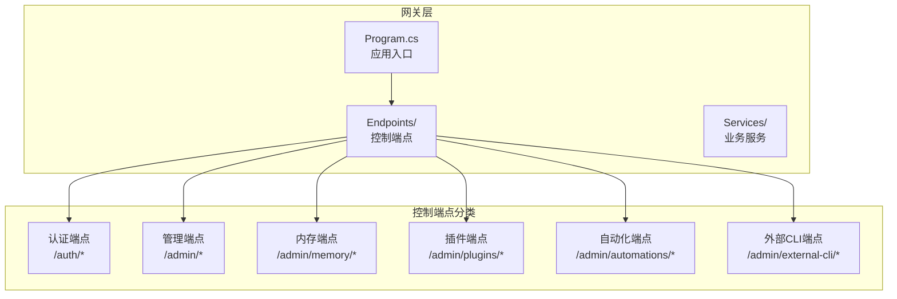
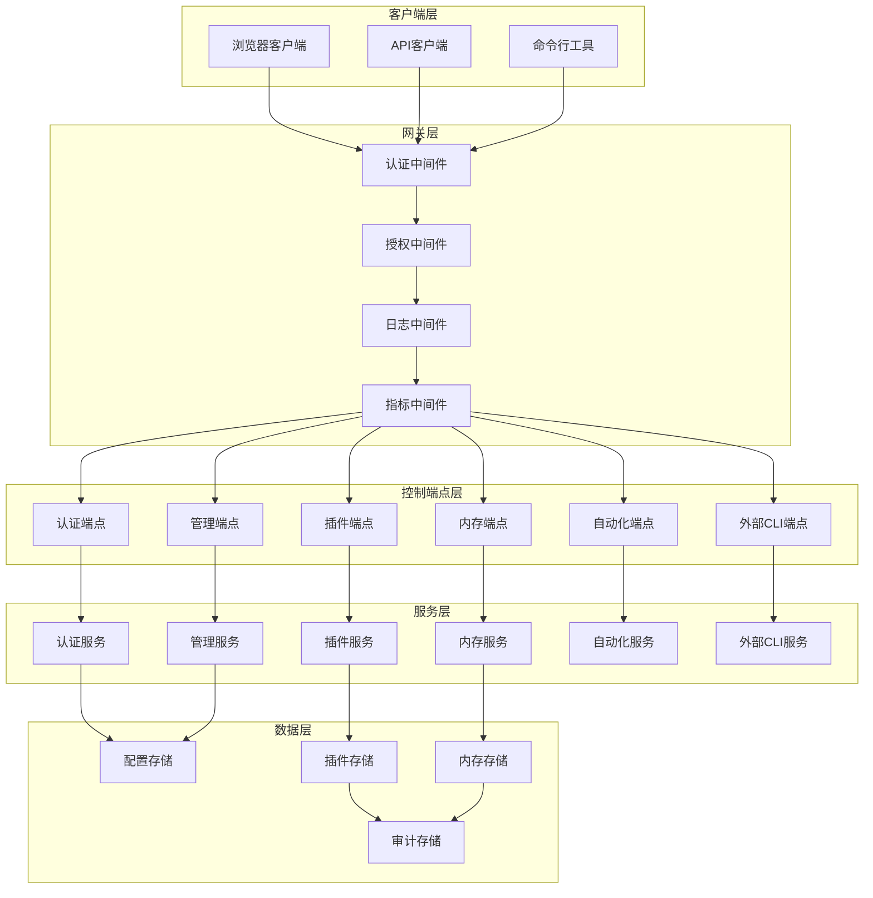
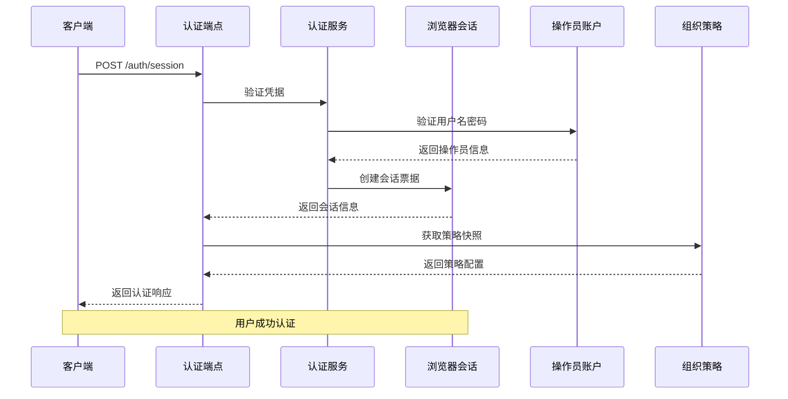
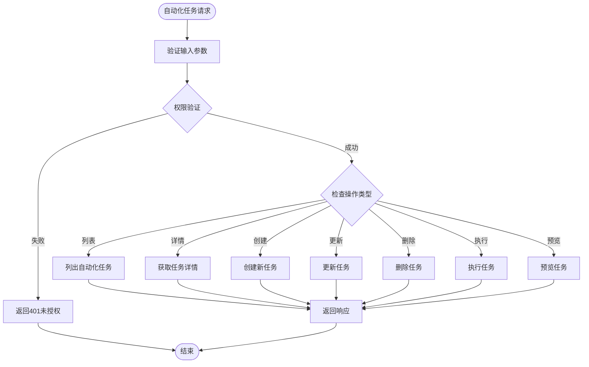
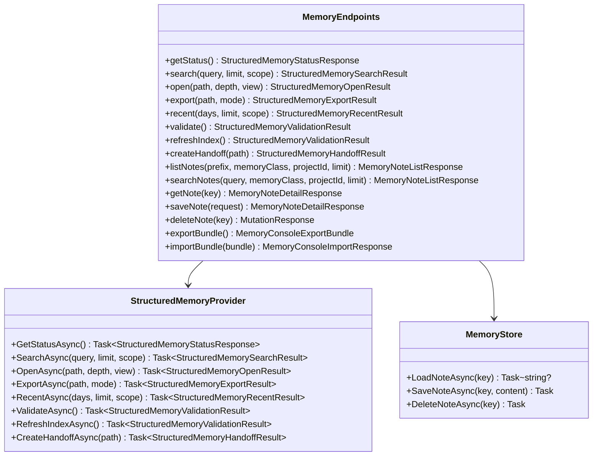
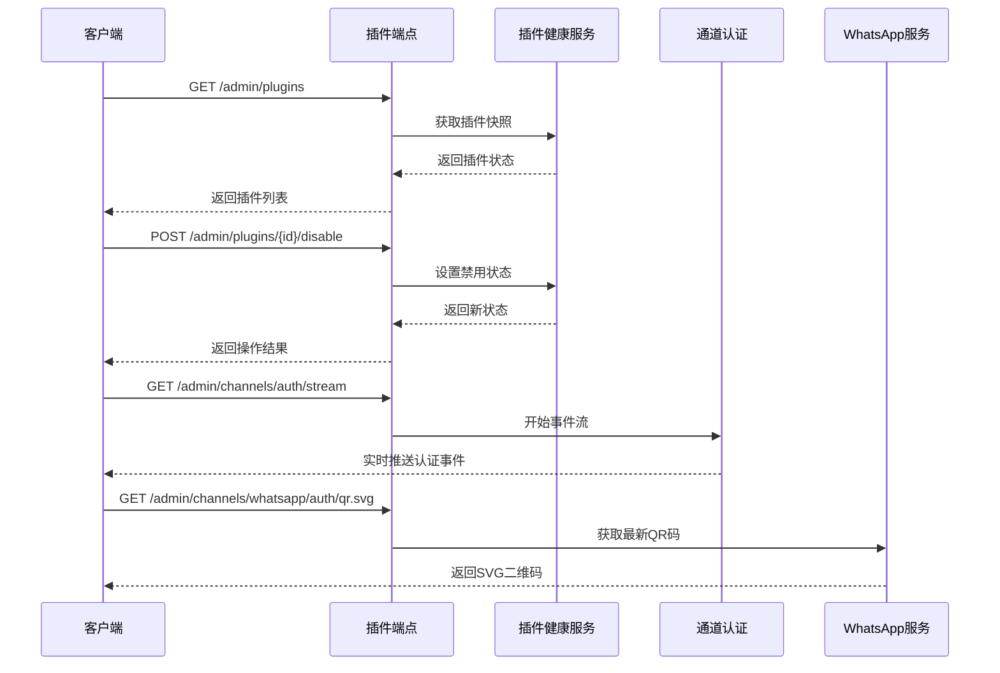
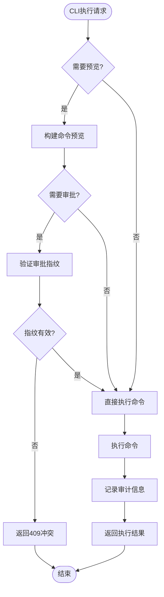
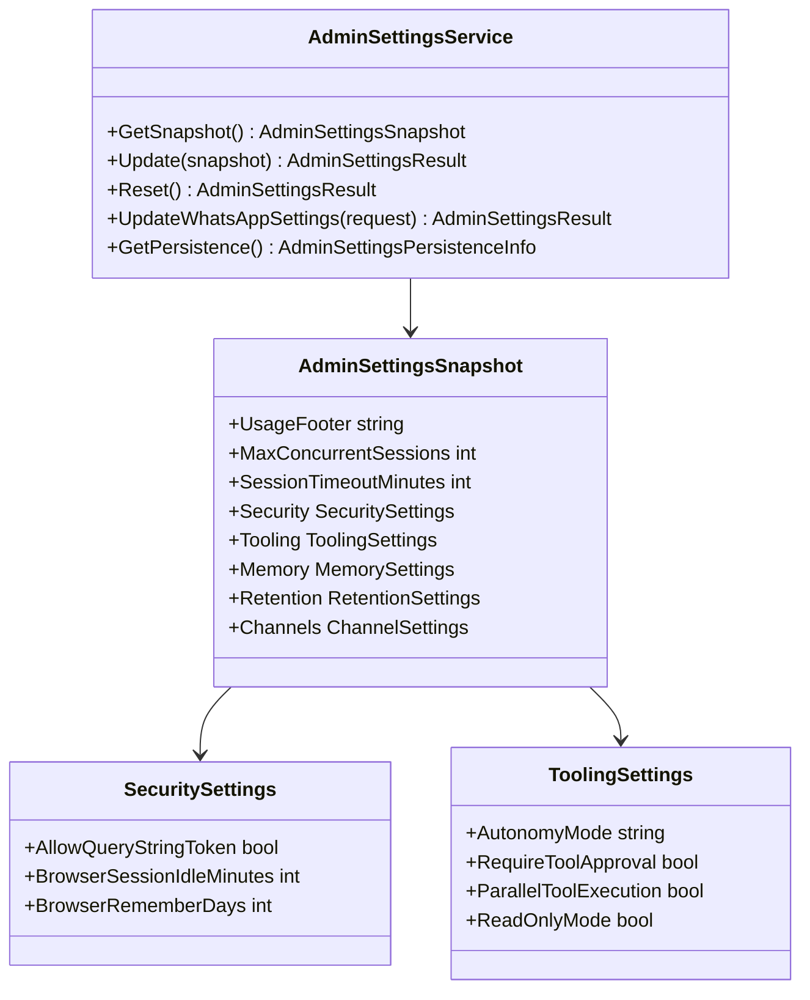
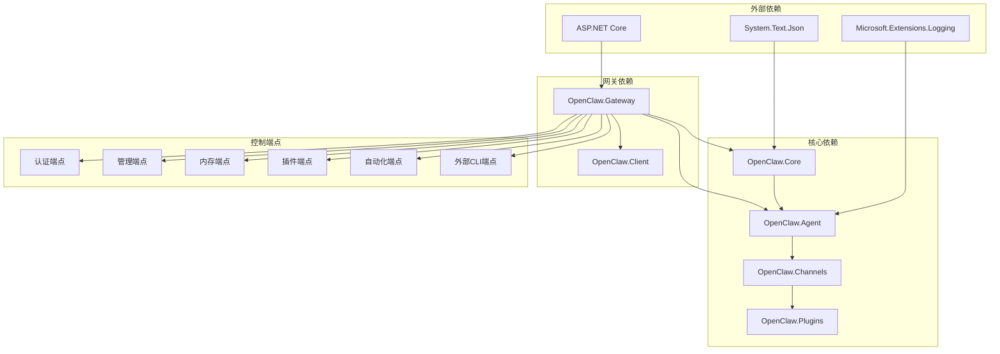

# 控制端点

<cite>
**本文档引用的文件**
- [Program.cs](file://src/OpenClaw.Gateway/Program.cs)
- [AdminEndpoints.Auth.cs](file://src/OpenClaw.Gateway/Endpoints/AdminEndpoints.Auth.cs)
- [AdminEndpoints.Automations.cs](file://src/OpenClaw.Gateway/Endpoints/AdminEndpoints.Automations.cs)
- [AdminEndpoints.Memory.cs](file://src/OpenClaw.Gateway/Endpoints/AdminEndpoints.Memory.cs)
- [AdminEndpoints.PluginsAndChannels.cs](file://src/OpenClaw.Gateway/Endpoints/AdminEndpoints.PluginsAndChannels.cs)
- [AdminEndpoints.CodebaseMap.cs](file://src/OpenClaw.Gateway/Endpoints/AdminEndpoints.CodebaseMap.cs)
- [AdminEndpoints.ExternalCli.cs](file://src/OpenClaw.Gateway/Endpoints/AdminEndpoints.ExternalCli.cs)
- [AdminEndpoints.GovernanceLedger.cs](file://src/OpenClaw.Gateway/Endpoints/AdminEndpoints.GovernanceLedger.cs)
- [AdminEndpoints.HarnessContracts.cs](file://src/OpenClaw.Gateway/Endpoints/AdminEndpoints.HarnessContracts.cs)
- [AdminEndpoints.ProfilesAndLearning.cs](file://src/OpenClaw.Gateway/Endpoints/AdminEndpoints.ProfilesAndLearning.cs)
- [AdminSettingsService.cs](file://src/OpenClaw.Gateway/AdminSettingsService.cs)
</cite>

## 目录
1. [简介](#简介)
2. [项目结构](#项目结构)
3. [核心组件](#核心组件)
4. [架构概览](#架构概览)
5. [详细组件分析](#详细组件分析)
6. [依赖关系分析](#依赖关系分析)
7. [性能考虑](#性能考虑)
8. [故障排除指南](#故障排除指南)
9. [结论](#结论)

## 简介

控制端点是Kingcrab系统中用于运行时控制、状态查询、配置更新和系统维护的核心API接口集合。这些端点提供了对系统进行全面管理和控制的能力，包括用户认证管理、自动化任务控制、内存管理、插件和通道管理、配置设置等关键功能。

系统通过严格的权限控制和安全机制确保只有授权的操作员才能访问和控制系统功能。所有操作都记录在审计日志中，便于追踪和合规性检查。

## 项目结构

Kingcrab项目的控制端点主要位于OpenClaw.Gateway模块中，采用按功能分组的组织方式：

**图表来源**
- [Program.cs:1-124](file://src/OpenClaw.Gateway/Program.cs#L1-L124)

**章节来源**
- [Program.cs:1-124](file://src/OpenClaw.Gateway/Program.cs#L1-L124)

## 核心组件

控制端点系统由以下核心组件构成：

### 权限管理系统
- 操作员身份验证和授权
- CSRF保护机制
- 角色和权限管理
- 审计日志记录

### 配置管理系统
- 运行时配置更新
- 设置持久化存储
- 配置验证和回滚
- 即时生效和重启需求字段

### 业务服务层
- 自动化任务管理
- 内存和知识管理
- 插件和通道控制
- 外部CLI执行管理

**章节来源**
- [AdminEndpoints.Auth.cs:1-399](file://src/OpenClaw.Gateway/Endpoints/AdminEndpoints.Auth.cs#L1-L399)
- [AdminSettingsService.cs:1-589](file://src/OpenClaw.Gateway/AdminSettingsService.cs#L1-L589)

## 架构概览

控制端点系统采用分层架构设计，确保了清晰的职责分离和良好的可维护性：

**图表来源**
- [Program.cs:80-96](file://src/OpenClaw.Gateway/Program.cs#L80-L96)

## 详细组件分析

### 认证和授权端点

认证系统提供了多种登录方式和会话管理功能：

#### 用户会话管理
- 获取当前会话信息
- 创建新的用户会话
- 删除用户会话
- 会话状态验证

#### 操作员账户管理
- 列出所有操作员账户
- 创建新操作员账户
- 更新操作员账户信息
- 删除操作员账户
- 管理操作员令牌

#### 组织策略管理
- 获取当前组织策略
- 更新组织策略设置
- 策略验证和应用

**图表来源**
- [AdminEndpoints.Auth.cs:40-124](file://src/OpenClaw.Gateway/Endpoints/AdminEndpoints.Auth.cs#L40-L124)

**章节来源**
- [AdminEndpoints.Auth.cs:1-399](file://src/OpenClaw.Gateway/Endpoints/AdminEndpoints.Auth.cs#L1-L399)

### 自动化任务控制端点

自动化系统提供了完整的生命周期管理：

#### 自动化任务管理
- 列出所有自动化任务
- 获取单个自动化任务详情
- 创建新自动化任务
- 更新现有自动化任务
- 删除自动化任务

#### 自动化任务执行
- 执行自动化任务（支持干运行）
- 查看任务执行历史
- 重新播放任务执行
- 清除任务隔离状态

#### 自动化任务监控
- 获取任务运行状态
- 查看任务执行记录
- 预览自动化定义
- 迁移旧版自动化

**图表来源**
- [AdminEndpoints.Automations.cs:39-292](file://src/OpenClaw.Gateway/Endpoints/AdminEndpoints.Automations.cs#L39-L292)

**章节来源**
- [AdminEndpoints.Automations.cs:1-292](file://src/OpenClaw.Gateway/Endpoints/AdminEndpoints.Automations.cs#L1-L292)

### 内存和知识管理端点

内存管理系统提供了结构化记忆和知识管理功能：

#### 结构化记忆管理
- 获取结构化记忆状态
- 搜索结构化记忆
- 打开记忆视图
- 导出记忆内容
- 获取最近记忆
- 验证记忆完整性
- 刷新索引
- 创建记忆交接

#### 记忆笔记管理
- 列出记忆笔记
- 搜索记忆内容
- 获取单个记忆笔记
- 创建或更新记忆笔记
- 删除记忆笔记

#### 批量导入导出
- 导出内存数据包
- 导入内存数据包
- 导出代理捆绑包
- 导入代理捆绑包

**图表来源**
- [AdminEndpoints.Memory.cs:45-856](file://src/OpenClaw.Gateway/Endpoints/AdminEndpoints.Memory.cs#L45-L856)

**章节来源**
- [AdminEndpoints.Memory.cs:1-856](file://src/OpenClaw.Gateway/Endpoints/AdminEndpoints.Memory.cs#L1-L856)

### 插件和通道管理端点

插件和通道管理系统提供了对系统扩展和通信渠道的全面控制：

#### 插件管理
- 列出所有插件状态
- 获取单个插件信息
- 启用/禁用插件
- 标记/清除插件审查状态
- 对插件进行隔离处理

#### 通道管理
- 获取通道认证状态
- 实时流式获取认证事件
- 生成WhatsApp认证二维码
- 管理WhatsApp设置
- 重启WhatsApp通道

#### 兼容性管理
- 获取兼容性目录
- 导出兼容性数据
- 管理兼容性状态

**图表来源**
- [AdminEndpoints.PluginsAndChannels.cs:147-458](file://src/OpenClaw.Gateway/Endpoints/AdminEndpoints.PluginsAndChannels.cs#L147-L458)

**章节来源**
- [AdminEndpoints.PluginsAndChannels.cs:1-458](file://src/OpenClaw.Gateway/Endpoints/AdminEndpoints.PluginsAndChannels.cs#L1-L458)

### 外部CLI执行端点

外部CLI执行系统提供了安全的命令行操作能力：

#### 连接器管理
- 列出可用连接器
- 获取连接器状态
- 列出连接器命令

#### 命令执行
- 预览命令执行（支持干运行）
- 执行已批准的命令
- 审计和记录执行结果

#### 安全控制
- 命令审批指纹验证
- 风险级别评估
- 只读模式支持

**图表来源**
- [AdminEndpoints.ExternalCli.cs:81-218](file://src/OpenClaw.Gateway/Endpoints/AdminEndpoints.ExternalCli.cs#L81-L218)

**章节来源**
- [AdminEndpoints.ExternalCli.cs:1-265](file://src/OpenClaw.Gateway/Endpoints/AdminEndpoints.ExternalCli.cs#L1-L265)

### 配置管理服务

配置管理系统提供了运行时配置的动态更新能力：

#### 配置快照管理
- 创建当前配置快照
- 加载持久化配置
- 应用配置到运行时

#### 配置验证
- 验证配置有效性
- 检测重启必需字段
- 错误收集和报告

#### 特定配置管理
- WhatsApp设置管理
- 通用设置管理
- 配置重置功能

**图表来源**
- [AdminSettingsService.cs:8-589](file://src/OpenClaw.Gateway/AdminSettingsService.cs#L8-L589)

**章节来源**
- [AdminSettingsService.cs:1-589](file://src/OpenClaw.Gateway/AdminSettingsService.cs#L1-L589)

## 依赖关系分析

控制端点系统具有清晰的依赖关系层次：

**图表来源**
- [Program.cs:1-14](file://src/OpenClaw.Gateway/Program.cs#L1-L14)

**章节来源**
- [Program.cs:1-124](file://src/OpenClaw.Gateway/Program.cs#L1-L124)

## 性能考虑

控制端点系统在设计时充分考虑了性能优化：

### 缓存策略
- 配置快照缓存减少磁盘I/O
- 会话信息缓存提升认证性能
- 插件状态缓存避免重复查询

### 异步处理
- 所有I/O操作采用异步模式
- 大数据量操作支持流式处理
- 并发限制防止资源耗尽

### 资源管理
- 连接池管理数据库连接
- 文件句柄自动释放
- 内存使用监控和限制

## 故障排除指南

### 常见问题诊断

#### 认证问题
- 检查会话是否过期
- 验证CSRF令牌有效性
- 确认操作员权限级别

#### 配置更新失败
- 检查配置验证错误
- 确认重启必需字段
- 验证配置文件权限

#### 自动化执行异常
- 查看任务执行日志
- 检查资源可用性
- 验证依赖服务状态

#### 内存操作失败
- 检查存储空间
- 验证文件权限
- 确认索引完整性

**章节来源**
- [AdminEndpoints.Auth.cs:177-190](file://src/OpenClaw.Gateway/Endpoints/AdminEndpoints.Auth.cs#L177-L190)
- [AdminEndpoints.Automations.cs:219-239](file://src/OpenClaw.Gateway/Endpoints/AdminEndpoints.Automations.cs#L219-L239)
- [AdminEndpoints.Memory.cs:138-162](file://src/OpenClaw.Gateway/Endpoints/AdminEndpoints.Memory.cs#L138-L162)

## 结论

Kingcrab的控制端点系统提供了全面而强大的系统管理能力。通过模块化的架构设计、严格的权限控制和完善的审计机制，系统能够安全有效地管理复杂的AI代理运行环境。

关键特性包括：
- **全面的管理覆盖**：从认证到自动化，从内存到插件的全方位管理
- **严格的安全控制**：多层认证、授权和审计机制
- **灵活的配置管理**：运行时配置更新和持久化存储
- **强大的扩展性**：插件系统和通道管理支持系统扩展
- **完善的监控**：实时事件流和详细的审计日志

这些端点为系统管理员提供了必要的工具来监控、控制和维护Kingcrab系统的正常运行，确保了系统的安全性、可靠性和可维护性。