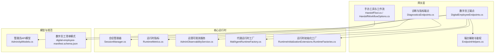
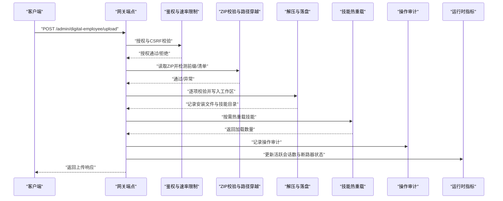
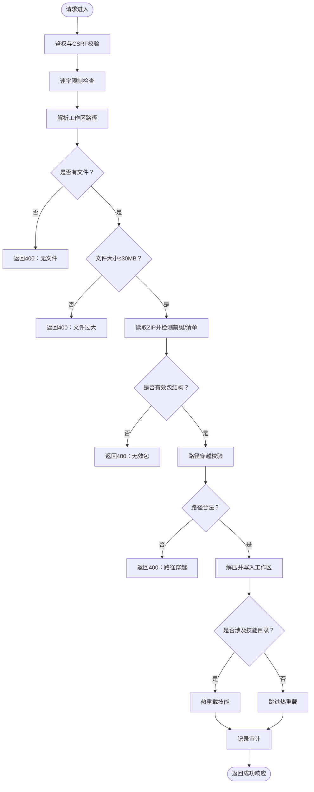
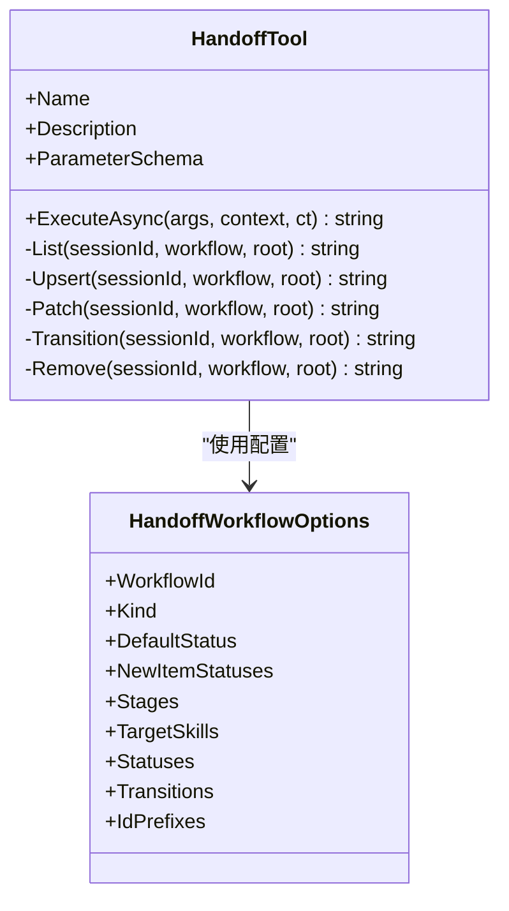
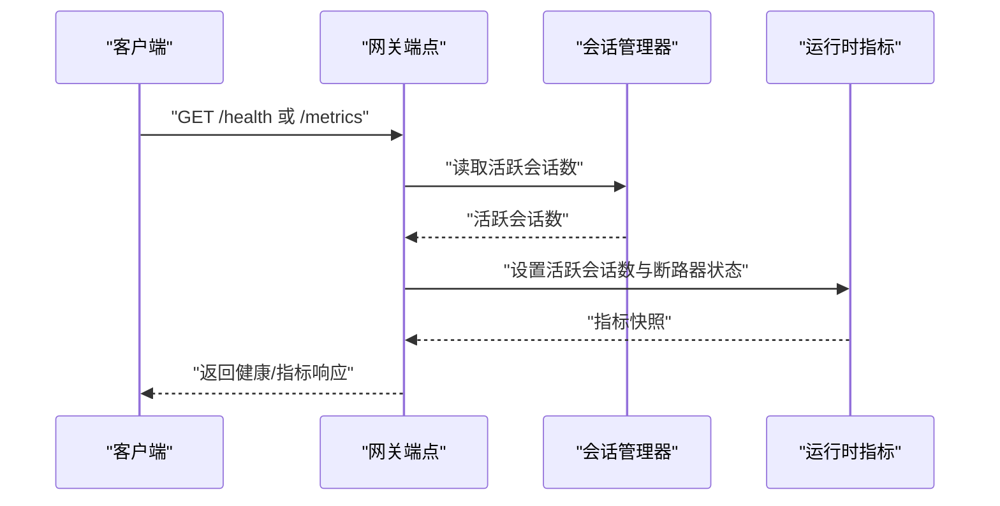
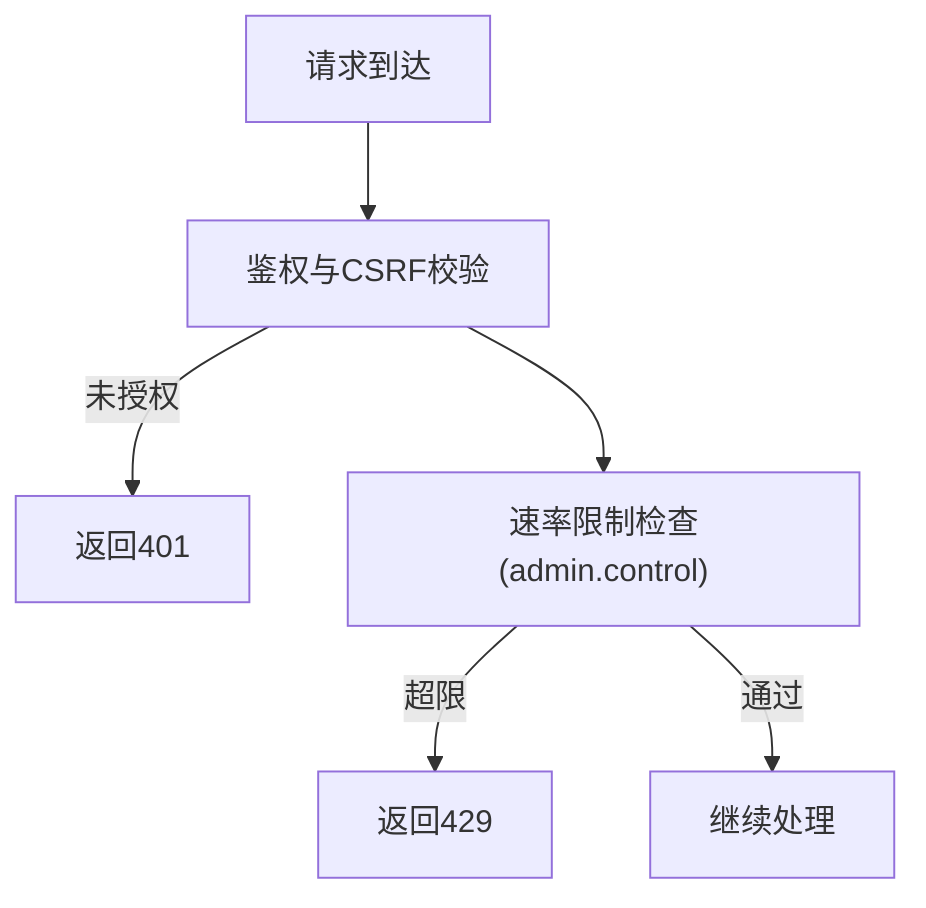
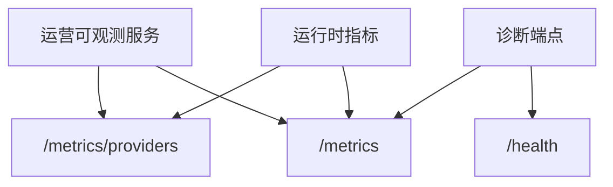
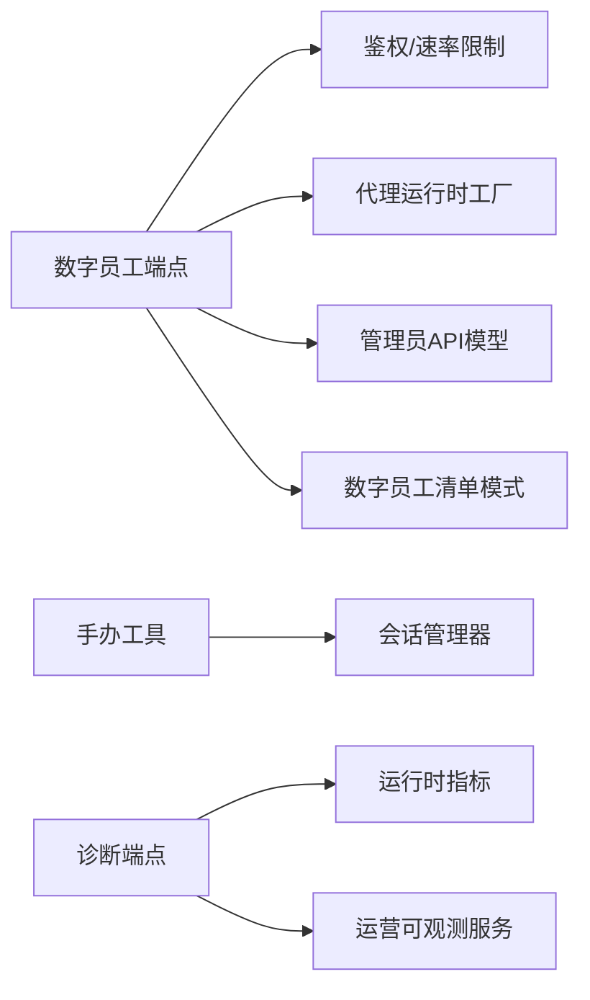

# 数字员工端点

<cite>
**本文引用的文件**   
- [DigitalEmployeeEndpoints.cs](file://src/OpenClaw.Gateway/Endpoints/DigitalEmployeeEndpoints.cs)
- [AdminApiModels.cs](file://src/OpenClaw.Core/Models/AdminApiModels.cs)
- [digital-employee-manifest.schema.json](file://docs/schemas/digital-employee-manifest.schema.json)
- [SessionManager.cs](file://src/OpenClaw.Core/Sessions/SessionManager.cs)
- [HandoffTool.cs](file://src/OpenClaw.Gateway/Tools/HandoffTool.cs)
- [HandoffWorkflowOptions.cs](file://src/OpenClaw.Gateway/Tools/HandoffWorkflowOptions.cs)
- [RuntimeMetrics.cs](file://src/OpenClaw.Core/Observability/RuntimeMetrics.cs)
- [DiagnosticsEndpoints.cs](file://src/OpenClaw.Gateway/Endpoints/DiagnosticsEndpoints.cs)
- [AdminObservabilityService.cs](file://src/OpenClaw.Gateway/AdminObservabilityService.cs)
- [OperatorGovernanceModels.cs](file://src/OpenClaw.Core/Models/OperatorGovernanceModels.cs)
- [EndpointHelpers.cs](file://src/OpenClaw.Gateway/Endpoints/EndpointHelpers.cs)
- [MafAgentRuntimeFactory.cs](file://src/OpenClaw.Agent/MafAgentRuntimeFactory.cs)
- [RuntimeInitializationExtensions.RuntimeFactories.cs](file://src/OpenClaw.Gateway/Composition/RuntimeInitializationExtensions.RuntimeFactories.cs)
- [webchat.js](file://src/OpenClaw.Gateway/wwwroot/webchat.js)
</cite>

## 目录
1. [简介](#简介)
2. [项目结构](#项目结构)
3. [核心组件](#核心组件)
4. [架构总览](#架构总览)
5. [详细组件分析](#详细组件分析)
6. [依赖关系分析](#依赖关系分析)
7. [性能考量](#性能考量)
8. [故障排查指南](#故障排查指南)
9. [结论](#结论)
10. [附录](#附录)

## 简介
本文件为“数字员工端点”的完整API文档，聚焦于数字员工的生命周期管理、权限控制、工作负载分配与性能监控。内容覆盖以下方面：
- 数字员工配置与技能包上传、校验与热重载
- 任务分配与状态流转（基于手办工作流）
- 会话与状态查询（会话管理、健康与指标）
- 权限与速率限制（操作员授权、CSRF、速率限制）
- 性能监控与可观测性（运行指标、服务健康、通道漂移）

## 项目结构
数字员工端点位于网关层的端点映射模块中，结合运行时状态、会话管理与可观测性服务，形成从上传到运行的闭环。

**图表来源**
- [DigitalEmployeeEndpoints.cs:19-228](file://src/OpenClaw.Gateway/Endpoints/DigitalEmployeeEndpoints.cs#L19-L228)
- [HandoffTool.cs:37-314](file://src/OpenClaw.Gateway/Tools/HandoffTool.cs#L37-L314)
- [DiagnosticsEndpoints.cs:51-80](file://src/OpenClaw.Gateway/Endpoints/DiagnosticsEndpoints.cs#L51-L80)
- [SessionManager.cs:59-106](file://src/OpenClaw.Core/Sessions/SessionManager.cs#L59-L106)
- [RuntimeMetrics.cs:212-239](file://src/OpenClaw.Core/Observability/RuntimeMetrics.cs#L212-L239)
- [AdminObservabilityService.cs:160-182](file://src/OpenClaw.Gateway/AdminObservabilityService.cs#L160-L182)
- [MafAgentRuntimeFactory.cs:95-123](file://src/OpenClaw.Agent/MafAgentRuntimeFactory.cs#L95-L123)
- [RuntimeInitializationExtensions.RuntimeFactories.cs:38-67](file://src/OpenClaw.Gateway/Composition/RuntimeInitializationExtensions.RuntimeFactories.cs#L38-L67)
- [AdminApiModels.cs:278-320](file://src/OpenClaw.Core/Models/AdminApiModels.cs#L278-L320)
- [digital-employee-manifest.schema.json:1-37](file://docs/schemas/digital-employee-manifest.schema.json#L1-L37)

**章节来源**
- [DigitalEmployeeEndpoints.cs:19-228](file://src/OpenClaw.Gateway/Endpoints/DigitalEmployeeEndpoints.cs#L19-L228)
- [AdminApiModels.cs:278-320](file://src/OpenClaw.Core/Models/AdminApiModels.cs#L278-L320)
- [digital-employee-manifest.schema.json:1-37](file://docs/schemas/digital-employee-manifest.schema.json#L1-L37)

## 核心组件
- 数字员工上传端点：接收ZIP包，执行路径穿越校验、解压、白名单文件落盘、技能热重载与审计记录。
- 手办工作流工具：支持任务列表、新增、补丁更新、状态流转与删除，配合工作流配置实现状态机。
- 会话管理与状态查询：集中式会话缓存、持久化与容量控制；健康与指标端点提供运行态快照。
- 权限与速率限制：基于浏览器会话与CSRF的授权、速率限制策略、审计记录。
- 可观测性：运行时指标、健康检查、通道漂移评估与系列化指标构建。

**章节来源**
- [DigitalEmployeeEndpoints.cs:19-228](file://src/OpenClaw.Gateway/Endpoints/DigitalEmployeeEndpoints.cs#L19-L228)
- [HandoffTool.cs:37-314](file://src/OpenClaw.Gateway/Tools/HandoffTool.cs#L37-L314)
- [SessionManager.cs:59-106](file://src/OpenClaw.Core/Sessions/SessionManager.cs#L59-L106)
- [DiagnosticsEndpoints.cs:51-80](file://src/OpenClaw.Gateway/Endpoints/DiagnosticsEndpoints.cs#L51-L80)
- [RuntimeMetrics.cs:212-239](file://src/OpenClaw.Core/Observability/RuntimeMetrics.cs#L212-L239)
- [AdminObservabilityService.cs:160-182](file://src/OpenClaw.Gateway/AdminObservabilityService.cs#L160-L182)

## 架构总览
数字员工端点贯穿“上传—校验—落盘—热重载—审计—可观测”的主链路，同时与会话管理、工作流工具、运行时指标与健康检查协同，形成完整的生命周期管理闭环。

**图表来源**
- [DigitalEmployeeEndpoints.cs:40-227](file://src/OpenClaw.Gateway/Endpoints/DigitalEmployeeEndpoints.cs#L40-L227)
- [DiagnosticsEndpoints.cs:68-76](file://src/OpenClaw.Gateway/Endpoints/DiagnosticsEndpoints.cs#L68-L76)

## 详细组件分析

### 数字员工上传端点
- 功能概述
  - 接收multipart/form-data，要求单个ZIP包，支持顶层包装目录自动剥离。
  - 白名单文件：config/下的AGENTS.md、SOUL.md、IDENTITY.md、MEMORY.md；skills/<name>/**；ontology/*.md（ontology 切片体系详见 [本体切片](../../本体切片/本体切片.md)）。
  - 读取manifest.json中的name字段用于响应与审计。
  - 对ZIP进行路径穿越检测，拒绝越界路径。
  - 成功后触发技能热重载（若存在技能变更），并记录审计。
- 请求与响应
  - 请求：POST /admin/digital-employee/upload（multipart/form-data，单文件）
  - 响应：DigitalEmployeeUploadResponse（Success、Error、Name、SkillsInstalled、InstalledFiles、TotalSkillsLoaded）
- 安全与合规
  - 速率限制策略：admin.control
  - CSRF保护：requireCsrf: true
  - 路径穿越防护：严格校验目标路径是否位于工作区根之下
  - 文件大小限制：最大30MB
- 失败与错误码
  - 400：无文件、ZIP过大、无效ZIP、非有效包结构
  - 429：超出速率限制
  - 500：提取失败
  - 501：未配置工作区路径

**图表来源**
- [DigitalEmployeeEndpoints.cs:40-227](file://src/OpenClaw.Gateway/Endpoints/DigitalEmployeeEndpoints.cs#L40-L227)

**章节来源**
- [DigitalEmployeeEndpoints.cs:19-228](file://src/OpenClaw.Gateway/Endpoints/DigitalEmployeeEndpoints.cs#L19-L228)
- [AdminApiModels.cs:278-290](file://src/OpenClaw.Core/Models/AdminApiModels.cs#L278-L290)
- [digital-employee-manifest.schema.json:1-37](file://docs/schemas/digital-employee-manifest.schema.json#L1-L37)

### 手办工作流与任务管理
- 功能概述
  - 支持对会话范围内的手办任务进行list/upsert/patch/transition/remove操作。
  - 工作流配置定义状态集合、阶段、目标技能、默认状态与状态转移矩阵。
  - 通过参数action驱动不同动作，支持指纹、修订号、关联待办与文件等字段。
- 关键参数
  - action：list、upsert、patch、transition、remove
  - workflow_id：指定工作流
  - handoff_id：任务唯一标识
  - status：目标状态（配合状态机）
  - patch：补丁对象（用于部分字段更新）
  - expected_revision：期望修订号，用于乐观并发控制
- 状态机与约束
  - 默认状态与可用状态集由工作流配置决定
  - 状态转移遵循预定义映射，非法转移会被拒绝
  - 任务必须具备标题；模板非custom时需要目标字段

**图表来源**
- [HandoffTool.cs:51-314](file://src/OpenClaw.Gateway/Tools/HandoffTool.cs#L51-L314)
- [HandoffWorkflowOptions.cs:60-87](file://src/OpenClaw.Gateway/Tools/HandoffWorkflowOptions.cs#L60-L87)

**章节来源**
- [HandoffTool.cs:37-314](file://src/OpenClaw.Gateway/Tools/HandoffTool.cs#L37-L314)
- [HandoffWorkflowOptions.cs:59-87](file://src/OpenClaw.Gateway/Tools/HandoffWorkflowOptions.cs#L59-L87)

### 会话管理与状态查询
- 会话管理
  - 内存权威：ConcurrentDictionary作为热缓存，IMemoryStore作为持久化后端
  - 准入控制：并发门控、容量检查（过期扫描与LRU淘汰）
  - 键派生：标准路径channelId:senderId；显式路径sessionId
- 状态查询端点
  - GET /health：健康检查
  - GET /metrics：运行时指标快照（活跃会话数、断路器状态等）
  - GET /metrics/providers：提供商维度指标

**图表来源**
- [DiagnosticsEndpoints.cs:51-80](file://src/OpenClaw.Gateway/Endpoints/DiagnosticsEndpoints.cs#L51-L80)
- [SessionManager.cs:59-106](file://src/OpenClaw.Core/Sessions/SessionManager.cs#L59-L106)
- [RuntimeMetrics.cs:212-239](file://src/OpenClaw.Core/Observability/RuntimeMetrics.cs#L212-L239)

**章节来源**
- [SessionManager.cs:59-106](file://src/OpenClaw.Core/Sessions/SessionManager.cs#L59-L106)
- [DiagnosticsEndpoints.cs:51-80](file://src/OpenClaw.Gateway/Endpoints/DiagnosticsEndpoints.cs#L51-L80)
- [RuntimeMetrics.cs:212-239](file://src/OpenClaw.Core/Observability/RuntimeMetrics.cs#L212-L239)

### 权限控制与速率限制
- 鉴权与角色
  - 基于浏览器会话与CSRF令牌
  - 针对admin.*作用域的端点采用更严格的授权策略
- 速率限制
  - 使用“admin.control”策略进行配额控制
  - 超限时返回429 Too Many Requests
- 审计
  - 记录操作者、认证方式、目标与摘要

**图表来源**
- [DigitalEmployeeEndpoints.cs:42-50](file://src/OpenClaw.Gateway/Endpoints/DigitalEmployeeEndpoints.cs#L42-L50)
- [EndpointHelpers.cs:264-283](file://src/OpenClaw.Gateway/Endpoints/EndpointHelpers.cs#L264-L283)

**章节来源**
- [DigitalEmployeeEndpoints.cs:42-50](file://src/OpenClaw.Gateway/Endpoints/DigitalEmployeeEndpoints.cs#L42-L50)
- [EndpointHelpers.cs:264-283](file://src/OpenClaw.Gateway/Endpoints/EndpointHelpers.cs#L264-L283)

### 性能监控与可观测性
- 运行时指标
  - 包含进程启动/完成/失败/超时/回收、沙箱租约、保留清理、会话缓存命中、提示词缓存、脉搏运行等
- 健康与通道漂移
  - 健康检查：/health
  - 指标端点：/metrics、/metrics/providers
  - 通道漂移评估：基于通道就绪状态与缺失需求统计
- 运维卡片与系列化指标
  - 提供审批延迟、提供商错误/重试、操作员动作等汇总卡片
  - 支持时间序列聚合与桶化

**图表来源**
- [DiagnosticsEndpoints.cs:51-80](file://src/OpenClaw.Gateway/Endpoints/DiagnosticsEndpoints.cs#L51-L80)
- [RuntimeMetrics.cs:212-239](file://src/OpenClaw.Core/Observability/RuntimeMetrics.cs#L212-L239)
- [AdminObservabilityService.cs:160-182](file://src/OpenClaw.Gateway/AdminObservabilityService.cs#L160-L182)
- [OperatorGovernanceModels.cs:330-359](file://src/OpenClaw.Core/Models/OperatorGovernanceModels.cs#L330-L359)

**章节来源**
- [RuntimeMetrics.cs:212-239](file://src/OpenClaw.Core/Observability/RuntimeMetrics.cs#L212-L239)
- [AdminObservabilityService.cs:160-182](file://src/OpenClaw.Gateway/AdminObservabilityService.cs#L160-L182)
- [OperatorGovernanceModels.cs:330-359](file://src/OpenClaw.Core/Models/OperatorGovernanceModels.cs#L330-L359)

## 依赖关系分析
- 组件耦合
  - 数字员工端点依赖鉴权与速率限制、工作区路径解析、运行时操作状态与审计
  - 手办工具依赖会话管理器与工作流配置，提供任务级CRUD与状态机
  - 诊断端点依赖会话管理器与运行时指标，提供健康与指标快照
- 外部依赖
  - 浏览器会话认证、CSRF令牌、JSON序列化上下文
  - ZIP归档读取、文件系统写入、路径规范化

**图表来源**
- [DigitalEmployeeEndpoints.cs:19-228](file://src/OpenClaw.Gateway/Endpoints/DigitalEmployeeEndpoints.cs#L19-L228)
- [HandoffTool.cs:37-314](file://src/OpenClaw.Gateway/Tools/HandoffTool.cs#L37-L314)
- [DiagnosticsEndpoints.cs:51-80](file://src/OpenClaw.Gateway/Endpoints/DiagnosticsEndpoints.cs#L51-L80)
- [RuntimeInitializationExtensions.RuntimeFactories.cs:38-67](file://src/OpenClaw.Gateway/Composition/RuntimeInitializationExtensions.RuntimeFactories.cs#L38-L67)

**章节来源**
- [DigitalEmployeeEndpoints.cs:19-228](file://src/OpenClaw.Gateway/Endpoints/DigitalEmployeeEndpoints.cs#L19-L228)
- [RuntimeInitializationExtensions.RuntimeFactories.cs:38-67](file://src/OpenClaw.Gateway/Composition/RuntimeInitializationExtensions.RuntimeFactories.cs#L38-L67)

## 性能考量
- 上传性能
  - ZIP在内存缓冲以便多次读取，注意大包内存占用
  - 技能热重载仅在检测到技能目录变更时触发，减少不必要开销
- 会话与指标
  - 指标端点动态刷新活跃会话数与断路器状态，避免重复计算
  - 通道漂移评估按需聚合，避免高频扫描
- 安全与稳定性
  - 路径穿越校验与文件大小限制降低异常输入风险
  - 速率限制防止滥用，保障系统稳定

## 故障排查指南
- 上传失败
  - 400：确认multipart/form-data格式、文件大小与ZIP有效性；检查工作区路径配置
  - 429：调整调用频率或提升配额
  - 500：查看后端日志定位提取异常
- 工作流状态异常
  - 检查工作流配置的状态集合与转移映射
  - 确认handoff_id与期望修订号一致
- 健康与指标异常
  - /health返回not_ready：检查会话存储与运行时状态
  - /metrics返回401：确认鉴权与CSRF令牌有效

**章节来源**
- [DigitalEmployeeEndpoints.cs:42-50](file://src/OpenClaw.Gateway/Endpoints/DigitalEmployeeEndpoints.cs#L42-L50)
- [HandoffTool.cs:235-307](file://src/OpenClaw.Gateway/Tools/HandoffTool.cs#L235-L307)
- [DiagnosticsEndpoints.cs:51-80](file://src/OpenClaw.Gateway/Endpoints/DiagnosticsEndpoints.cs#L51-L80)

## 结论
数字员工端点提供了从配置与技能包上传、路径安全校验、热重载与审计，到任务状态管理、会话与健康监控、以及可观测性的完整能力。通过严格的权限与速率限制、完善的错误处理与可观测性，确保系统在高并发与复杂任务场景下的稳定性与可运维性。

## 附录
- API参考
  - 上传数字员工包
    - 方法：POST
    - 路径：/admin/digital-employee/upload
    - 表单字段：zip（单文件，ZIP）
    - 响应：DigitalEmployeeUploadResponse
  - 列出/查询健康
    - 方法：GET
    - 路径：/health
    - 响应：HealthResponse
  - 获取运行时指标
    - 方法：GET
    - 路径：/metrics
    - 响应：MetricsSnapshot
  - 获取提供商指标
    - 方法：GET
    - 路径：/metrics/providers
    - 响应：ProviderUsageSnapshot[]
- 集成示例（前端）
  - 参考网关内嵌的webchat.js中的上传逻辑，构造FormData并携带认证头访问/admin/workspace/upload或/admin/digital-employee/upload

**章节来源**
- [webchat.js:3352-3392](file://src/OpenClaw.Gateway/wwwroot/webchat.js#L3352-L3392)