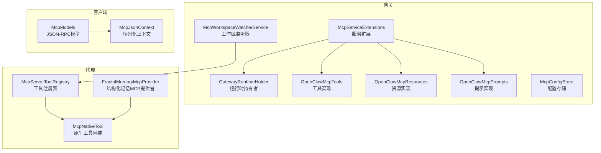
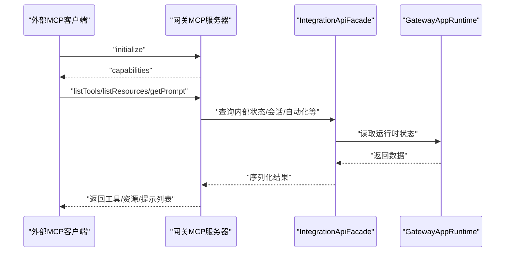
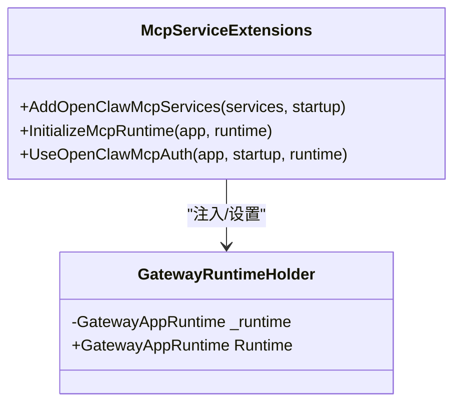
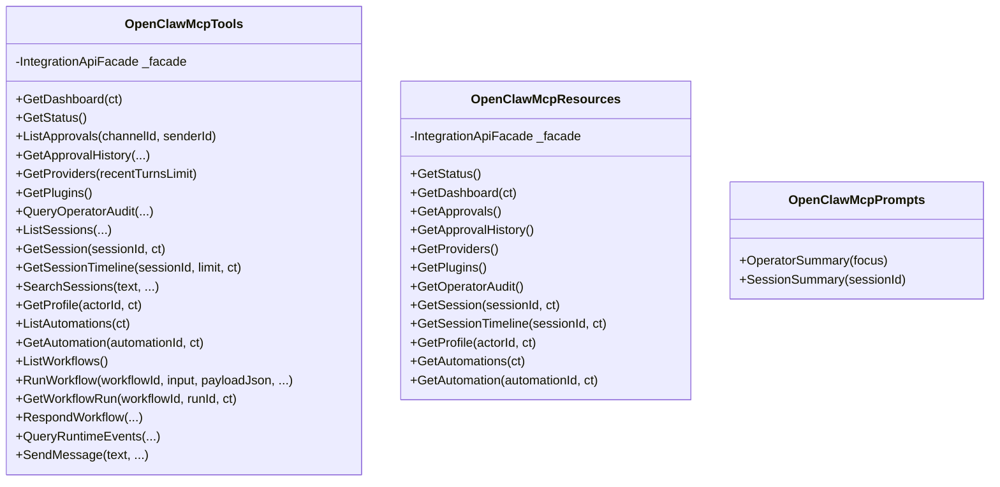
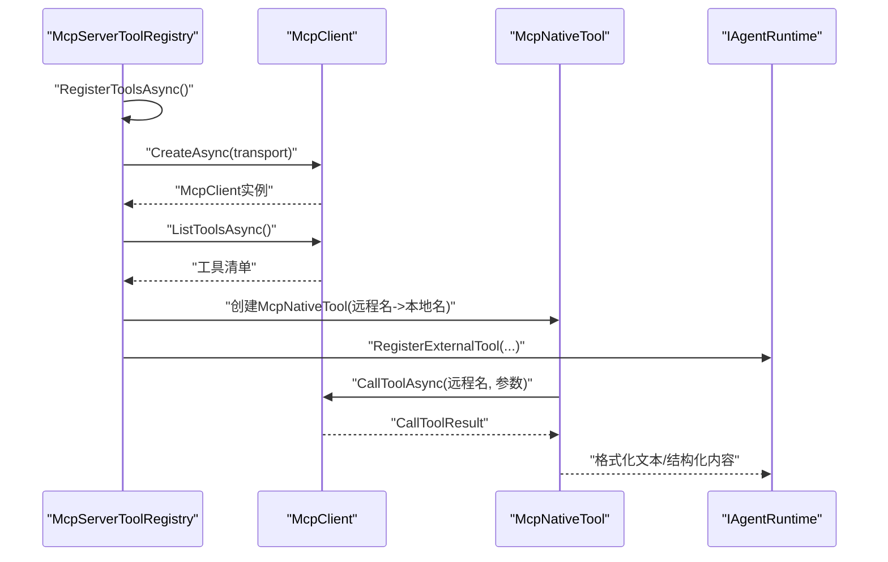
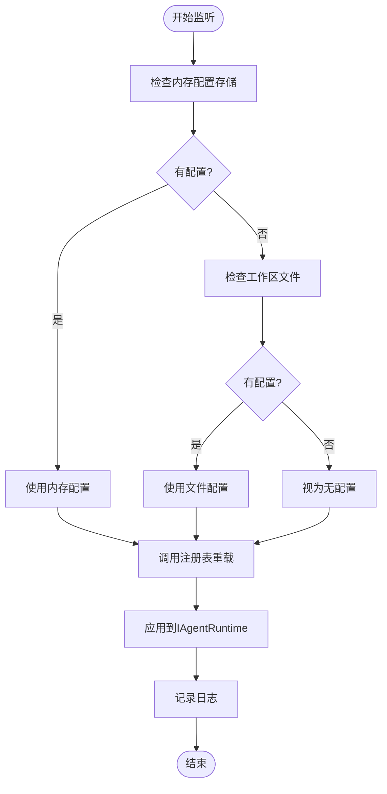
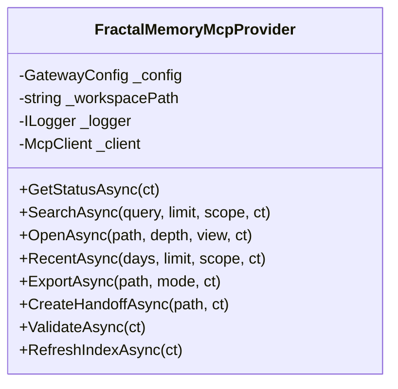
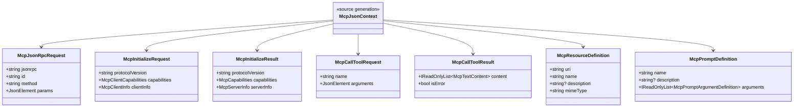
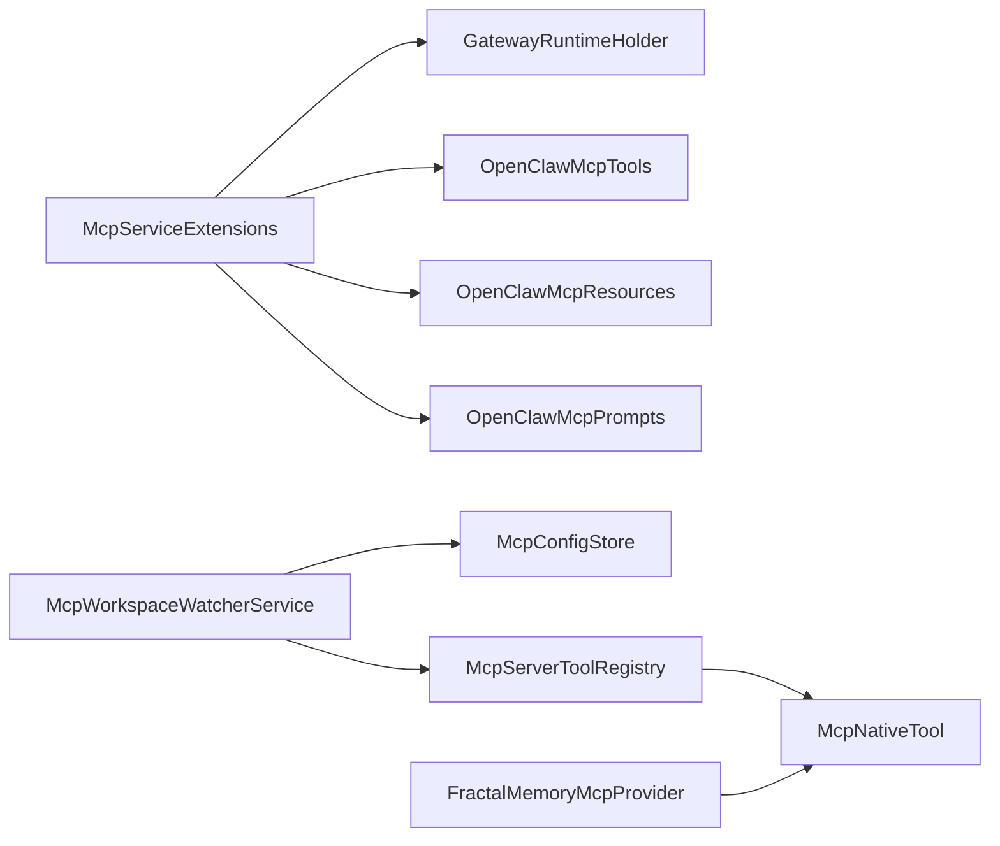

# MCP协议支持

<cite>
**本文档引用的文件**
- [GatewayRuntimeHolder.cs](file://src/OpenClaw.Gateway/Mcp/GatewayRuntimeHolder.cs)
- [McpServiceExtensions.cs](file://src/OpenClaw.Gateway/Mcp/McpServiceExtensions.cs)
- [OpenClawMcpTools.cs](file://src/OpenClaw.Gateway/Mcp/OpenClawMcpTools.cs)
- [OpenClawMcpResources.cs](file://src/OpenClaw.Gateway/Mcp/OpenClawMcpResources.cs)
- [OpenClawMcpPrompts.cs](file://src/OpenClaw.Gateway/Mcp/OpenClawMcpPrompts.cs)
- [McpWorkspaceWatcherService.cs](file://src/OpenClaw.Gateway/McpWorkspaceWatcherService.cs)
- [McpConfigStore.cs](file://src/OpenClaw.Gateway/Mcp/McpConfigStore.cs)
- [McpServerToolRegistry.cs](file://src/OpenClaw.Agent/Plugins/McpServerToolRegistry.cs)
- [McpNativeTool.cs](file://src/OpenClaw.Agent/Tools/McpNativeTool.cs)
- [FractalMemoryMcpProvider.cs](file://src/OpenClaw.Agent/Memory/FractalMemoryMcpProvider.cs)
- [McpModels.cs](file://src/OpenClaw.Client/McpModels.cs)
- [McpJsonContext.cs](file://src/OpenClaw.Client/McpJsonContext.cs)
</cite>

## 目录
1. [引言](#引言)
2. [项目结构](#项目结构)
3. [核心组件](#核心组件)
4. [架构总览](#架构总览)
5. [详细组件分析](#详细组件分析)
6. [依赖关系分析](#依赖关系分析)
7. [性能考虑](#性能考虑)
8. [故障排除指南](#故障排除指南)
9. [结论](#结论)
10. [附录](#附录)

## 引言
本文件系统性阐述Kingcrab项目中对MCP（Model Context Protocol）协议的支持，覆盖协议架构、消息格式与通信机制；详细说明MCP服务扩展、运行时持有者与提示管理；阐述MCP工具注册、资源管理与工作流协调；解释MCP与网关其他组件的集成方式与数据流转；包含MCP客户端连接、消息处理与错误恢复机制；并提供MCP工具开发示例、协议实现指南与性能优化建议。

## 项目结构
MCP支持在网关与代理两端均有实现：
- 网关侧：通过官方ModelContextProtocol.AspNetCore库注册MCP服务器端能力，暴露工具、资源与提示，并提供认证与限流中间件。
- 代理侧：发现外部MCP服务器，动态注册为原生工具；同时提供内存类MCP工具（如Fractal Memory）以增强结构化记忆能力。
- 客户端侧：定义MCP JSON-RPC消息模型与序列化上下文，便于与MCP服务器交互。

**图表来源**
- [GatewayRuntimeHolder.cs:10-20](file://src/OpenClaw.Gateway/Mcp/GatewayRuntimeHolder.cs#L10-L20)
- [McpServiceExtensions.cs:20-46](file://src/OpenClaw.Gateway/Mcp/McpServiceExtensions.cs#L20-L46)
- [OpenClawMcpTools.cs:14-319](file://src/OpenClaw.Gateway/Mcp/OpenClawMcpTools.cs#L14-L319)
- [OpenClawMcpResources.cs:9-116](file://src/OpenClaw.Gateway/Mcp/OpenClawMcpResources.cs#L9-L116)
- [OpenClawMcpPrompts.cs:12-71](file://src/OpenClaw.Gateway/Mcp/OpenClawMcpPrompts.cs#L12-L71)
- [McpWorkspaceWatcherService.cs:20-221](file://src/OpenClaw.Gateway/McpWorkspaceWatcherService.cs#L20-L221)
- [McpConfigStore.cs:11-110](file://src/OpenClaw.Gateway/Mcp/McpConfigStore.cs#L11-L110)
- [McpServerToolRegistry.cs:16-369](file://src/OpenClaw.Agent/Plugins/McpServerToolRegistry.cs#L16-L369)
- [McpNativeTool.cs:9-118](file://src/OpenClaw.Agent/Tools/McpNativeTool.cs#L9-L118)
- [FractalMemoryMcpProvider.cs:13-828](file://src/OpenClaw.Agent/Memory/FractalMemoryMcpProvider.cs#L13-L828)
- [McpModels.cs:1-187](file://src/OpenClaw.Client/McpModels.cs#L1-L187)
- [McpJsonContext.cs:1-39](file://src/OpenClaw.Client/McpJsonContext.cs#L1-L39)

**章节来源**
- [McpServiceExtensions.cs:11-91](file://src/OpenClaw.Gateway/Mcp/McpServiceExtensions.cs#L11-L91)
- [McpWorkspaceWatcherService.cs:20-221](file://src/OpenClaw.Gateway/McpWorkspaceWatcherService.cs#L20-L221)

## 核心组件
- 运行时持有者：在DI容器构建后桥接至GatewayAppRuntime，确保MCP服务初始化前后的正确引用。
- 服务扩展：注册官方MCP服务器、HTTP传输、工具/资源/提示类型，并提供认证与限流中间件。
- 工具实现：封装网关内部状态查询、会话管理、自动化与工作流控制等能力，统一序列化输出。
- 资源实现：以URI模板形式暴露只读资源快照，便于外部系统按需拉取。
- 提示实现：纯模板式提示，指导模型有效使用可用资源与工具。
- 工作区监听器：监控工作区mcp.json变更，热重载外部MCP服务器配置。
- 配置存储：持久化工作区MCP配置到内存数据卷，独立于文件系统监听。
- 工具注册表：连接外部MCP服务器，解析工具清单并注册为原生工具。
- 原生工具包装：将外部MCP工具调用映射为原生工具执行流程。
- 结构化记忆MCP提供者：通过MCP工具访问Fractal Memory能力，提供搜索、打开、最近项、导出、交接等操作。
- 客户端模型：定义MCP JSON-RPC请求/响应、初始化、工具/资源/提示能力与内容块结构。

**章节来源**
- [GatewayRuntimeHolder.cs:10-20](file://src/OpenClaw.Gateway/Mcp/GatewayRuntimeHolder.cs#L10-L20)
- [McpServiceExtensions.cs:20-91](file://src/OpenClaw.Gateway/Mcp/McpServiceExtensions.cs#L20-L91)
- [OpenClawMcpTools.cs:14-319](file://src/OpenClaw.Gateway/Mcp/OpenClawMcpTools.cs#L14-L319)
- [OpenClawMcpResources.cs:9-116](file://src/OpenClaw.Gateway/Mcp/OpenClawMcpResources.cs#L9-L116)
- [OpenClawMcpPrompts.cs:12-71](file://src/OpenClaw.Gateway/Mcp/OpenClawMcpPrompts.cs#L12-L71)
- [McpWorkspaceWatcherService.cs:20-221](file://src/OpenClaw.Gateway/McpWorkspaceWatcherService.cs#L20-L221)
- [McpConfigStore.cs:11-110](file://src/OpenClaw.Gateway/Mcp/McpConfigStore.cs#L11-L110)
- [McpServerToolRegistry.cs:16-369](file://src/OpenClaw.Agent/Plugins/McpServerToolRegistry.cs#L16-L369)
- [McpNativeTool.cs:9-118](file://src/OpenClaw.Agent/Tools/McpNativeTool.cs#L9-L118)
- [FractalMemoryMcpProvider.cs:13-828](file://src/OpenClaw.Agent/Memory/FractalMemoryMcpProvider.cs#L13-L828)
- [McpModels.cs:1-187](file://src/OpenClaw.Client/McpModels.cs#L1-L187)
- [McpJsonContext.cs:1-39](file://src/OpenClaw.Client/McpJsonContext.cs#L1-L39)

## 架构总览
MCP在Kingcrab中采用“网关服务端 + 代理客户端”的双端架构：
- 网关作为MCP服务器，向外部模型或工具提供工具、资源与提示。
- 代理作为MCP客户端，连接外部MCP服务器并将工具注册为原生工具，同时可直接调用结构化记忆MCP工具。
- 工作区监听器与配置存储确保外部MCP服务器配置的热更新与持久化。

**图表来源**
- [McpServiceExtensions.cs:32-46](file://src/OpenClaw.Gateway/Mcp/McpServiceExtensions.cs#L32-L46)
- [OpenClawMcpTools.cs:21-319](file://src/OpenClaw.Gateway/Mcp/OpenClawMcpTools.cs#L21-L319)
- [OpenClawMcpResources.cs:16-116](file://src/OpenClaw.Gateway/Mcp/OpenClawMcpResources.cs#L16-L116)
- [OpenClawMcpPrompts.cs:15-71](file://src/OpenClaw.Gateway/Mcp/OpenClawMcpPrompts.cs#L15-L71)

## 详细组件分析

### 组件A：网关MCP服务扩展与运行时持有者
- 服务扩展负责注册MCP服务器、HTTP传输、工具/资源/提示类型，并注入运行时持有者以桥接GatewayAppRuntime。
- 运行时持有者在应用启动前由程序入口设置，避免在未初始化时被访问。

**图表来源**
- [GatewayRuntimeHolder.cs:10-20](file://src/OpenClaw.Gateway/Mcp/GatewayRuntimeHolder.cs#L10-L20)
- [McpServiceExtensions.cs:20-91](file://src/OpenClaw.Gateway/Mcp/McpServiceExtensions.cs#L20-L91)

**章节来源**
- [GatewayRuntimeHolder.cs:10-20](file://src/OpenClaw.Gateway/Mcp/GatewayRuntimeHolder.cs#L10-L20)
- [McpServiceExtensions.cs:20-91](file://src/OpenClaw.Gateway/Mcp/McpServiceExtensions.cs#L20-L91)

### 组件B：MCP工具、资源与提示实现
- 工具实现：将网关内部能力封装为MCP工具，统一使用Json序列化上下文输出。
- 资源实现：以URI模板暴露只读资源快照，支持会话详情、时间线、仪表盘等。
- 提示实现：模板式提示，指导模型使用资源与工具进行总结与分析。

**图表来源**
- [OpenClawMcpTools.cs:14-319](file://src/OpenClaw.Gateway/Mcp/OpenClawMcpTools.cs#L14-L319)
- [OpenClawMcpResources.cs:9-116](file://src/OpenClaw.Gateway/Mcp/OpenClawMcpResources.cs#L9-L116)
- [OpenClawMcpPrompts.cs:12-71](file://src/OpenClaw.Gateway/Mcp/OpenClawMcpPrompts.cs#L12-L71)

**章节来源**
- [OpenClawMcpTools.cs:14-319](file://src/OpenClaw.Gateway/Mcp/OpenClawMcpTools.cs#L14-L319)
- [OpenClawMcpResources.cs:9-116](file://src/OpenClaw.Gateway/Mcp/OpenClawMcpResources.cs#L9-L116)
- [OpenClawMcpPrompts.cs:12-71](file://src/OpenClaw.Gateway/Mcp/OpenClawMcpPrompts.cs#L12-L71)

### 组件C：代理侧MCP工具注册与原生工具包装
- 工具注册表：连接外部MCP服务器，解析工具清单，生成本地工具名称与描述，并包装为原生工具注册到系统。
- 原生工具包装：将外部MCP工具调用映射为原生工具执行，处理参数解析、错误返回与内容格式化。

**图表来源**
- [McpServerToolRegistry.cs:41-138](file://src/OpenClaw.Agent/Plugins/McpServerToolRegistry.cs#L41-L138)
- [McpNativeTool.cs:20-70](file://src/OpenClaw.Agent/Tools/McpNativeTool.cs#L20-L70)

**章节来源**
- [McpServerToolRegistry.cs:16-369](file://src/OpenClaw.Agent/Plugins/McpServerToolRegistry.cs#L16-L369)
- [McpNativeTool.cs:9-118](file://src/OpenClaw.Agent/Tools/McpNativeTool.cs#L9-L118)

### 组件D：工作区监听器与配置存储
- 工作区监听器：优先从内存配置存储加载，其次回退到工作区文件，触发工具热重载并应用到运行时。
- 配置存储：原子写入mcp.json，支持启用/禁用与服务器字典持久化。

**图表来源**
- [McpWorkspaceWatcherService.cs:105-151](file://src/OpenClaw.Gateway/McpWorkspaceWatcherService.cs#L105-L151)
- [McpConfigStore.cs:53-89](file://src/OpenClaw.Gateway/Mcp/McpConfigStore.cs#L53-L89)

**章节来源**
- [McpWorkspaceWatcherService.cs:20-221](file://src/OpenClaw.Gateway/McpWorkspaceWatcherService.cs#L20-L221)
- [McpConfigStore.cs:11-110](file://src/OpenClaw.Gateway/Mcp/McpConfigStore.cs#L11-L110)

### 组件E：结构化记忆MCP提供者
- 通过MCP工具访问Fractal Memory能力，支持搜索、打开、最近项、导出、交接、验证与索引刷新。
- 内置超时控制、异常友好化与多类型内容解析。

**图表来源**
- [FractalMemoryMcpProvider.cs:13-828](file://src/OpenClaw.Agent/Memory/FractalMemoryMcpProvider.cs#L13-L828)

**章节来源**
- [FractalMemoryMcpProvider.cs:13-828](file://src/OpenClaw.Agent/Memory/FractalMemoryMcpProvider.cs#L13-L828)

### 组件F：客户端模型与序列化上下文
- 定义MCP JSON-RPC请求/响应、初始化、能力声明与内容块结构。
- 使用源生成上下文提升序列化性能与安全性。

**图表来源**
- [McpModels.cs:5-187](file://src/OpenClaw.Client/McpModels.cs#L5-L187)
- [McpJsonContext.cs:5-39](file://src/OpenClaw.Client/McpJsonContext.cs#L5-L39)

**章节来源**
- [McpModels.cs:1-187](file://src/OpenClaw.Client/McpModels.cs#L1-L187)
- [McpJsonContext.cs:1-39](file://src/OpenClaw.Client/McpJsonContext.cs#L1-L39)

## 依赖关系分析
- 网关MCP服务扩展依赖运行时持有者与集成门面，以提供工具/资源/提示能力。
- 工具/资源/提示实现依赖集成门面访问内部状态与业务数据。
- 工作区监听器依赖配置存储与工具注册表，实现热重载。
- 代理工具注册表依赖MCP客户端库，连接外部服务器并注册原生工具。
- 结构化记忆MCP提供者依赖MCP客户端库与配置，提供记忆能力。

**图表来源**
- [McpServiceExtensions.cs:20-91](file://src/OpenClaw.Gateway/Mcp/McpServiceExtensions.cs#L20-L91)
- [McpWorkspaceWatcherService.cs:20-221](file://src/OpenClaw.Gateway/McpWorkspaceWatcherService.cs#L20-L221)
- [McpServerToolRegistry.cs:16-369](file://src/OpenClaw.Agent/Plugins/McpServerToolRegistry.cs#L16-L369)
- [FractalMemoryMcpProvider.cs:13-828](file://src/OpenClaw.Agent/Memory/FractalMemoryMcpProvider.cs#L13-L828)

**章节来源**
- [McpServiceExtensions.cs:20-91](file://src/OpenClaw.Gateway/Mcp/McpServiceExtensions.cs#L20-L91)
- [McpWorkspaceWatcherService.cs:20-221](file://src/OpenClaw.Gateway/McpWorkspaceWatcherService.cs#L20-L221)
- [McpServerToolRegistry.cs:16-369](file://src/OpenClaw.Agent/Plugins/McpServerToolRegistry.cs#L16-L369)
- [FractalMemoryMcpProvider.cs:13-828](file://src/OpenClaw.Agent/Memory/FractalMemoryMcpProvider.cs#L13-L828)

## 性能考虑
- 序列化优化：使用源生成的JsonSerializerContext减少反射开销，提高工具/资源/提示输出性能。
- 连接复用：MCP客户端在提供者与注册表中复用连接，避免频繁建立/断开。
- 超时控制：对外部MCP调用设置合理超时，防止阻塞与资源泄露。
- 并发控制：使用信号量与互斥保护共享资源（如MCP客户端），避免竞态。
- 热重载去抖：工作区监听器使用有界通道（丢弃最旧）合并快速事件，降低重复重载成本。
- 原子写入：配置存储采用临时文件+重命名策略，保证写入一致性与原子性。

## 故障排除指南
- 初始化失败：检查运行时持有者是否已设置，确认服务注册顺序与应用构建阶段。
- 认证/限流：确保MCP端点中间件已启用，核对授权策略与IP速率限制。
- 外部MCP服务器：校验传输类型（stdio/http）、命令/URL、环境变量与头部解析；检查超时与取消令牌。
- 工具参数：确保传入JSON参数为对象且符合输入模式；注意空值与类型转换。
- 结构化记忆：确认Fractal Memory模式、MCP命令与仓库根路径配置；查看可用性状态与警告信息。
- 配置加载：优先检查内存存储配置，其次检查工作区文件；关注解析异常与I/O错误日志。

**章节来源**
- [McpServiceExtensions.cs:66-89](file://src/OpenClaw.Gateway/Mcp/McpServiceExtensions.cs#L66-L89)
- [McpServerToolRegistry.cs:225-290](file://src/OpenClaw.Agent/Plugins/McpServerToolRegistry.cs#L225-L290)
- [McpNativeTool.cs:20-70](file://src/OpenClaw.Agent/Tools/McpNativeTool.cs#L20-L70)
- [FractalMemoryMcpProvider.cs:279-330](file://src/OpenClaw.Agent/Memory/FractalMemoryMcpProvider.cs#L279-L330)
- [McpWorkspaceWatcherService.cs:153-208](file://src/OpenClaw.Gateway/McpWorkspaceWatcherService.cs#L153-L208)

## 结论
Kingcrab对MCP协议的支持实现了网关与代理两端的完整闭环：网关提供工具、资源与提示，代理发现并注册外部工具，工作区监听器与配置存储保障热重载与持久化，客户端模型与序列化上下文确保跨组件一致的通信格式。该设计既满足了与外部MCP生态的兼容，又保持了与内部运行时的紧密集成。

## 附录

### MCP协议实现指南
- 服务端注册：使用官方MCP库注册服务器信息、HTTP传输、工具/资源/提示类型。
- 工具实现：遵循工具方法签名与参数描述，统一序列化输出；对异常进行友好化处理。
- 资源实现：使用URI模板定义资源，支持路径参数与查询；确保内容类型与JSON格式。
- 提示实现：编写模板式提示，明确角色与内容，指导模型使用资源与工具。
- 客户端交互：使用JSON-RPC模型与序列化上下文，确保请求/响应一致性。

**章节来源**
- [McpServiceExtensions.cs:32-46](file://src/OpenClaw.Gateway/Mcp/McpServiceExtensions.cs#L32-L46)
- [OpenClawMcpTools.cs:21-319](file://src/OpenClaw.Gateway/Mcp/OpenClawMcpTools.cs#L21-L319)
- [OpenClawMcpResources.cs:16-116](file://src/OpenClaw.Gateway/Mcp/OpenClawMcpResources.cs#L16-L116)
- [OpenClawMcpPrompts.cs:15-71](file://src/OpenClaw.Gateway/Mcp/OpenClawMcpPrompts.cs#L15-L71)
- [McpModels.cs:27-187](file://src/OpenClaw.Client/McpModels.cs#L27-L187)
- [McpJsonContext.cs:5-39](file://src/OpenClaw.Client/McpJsonContext.cs#L5-L39)

### MCP工具开发示例
- 外部工具接入：在工作区配置中添加MCP服务器，监听器自动发现并注册为原生工具。
- 原生工具调用：工具包装器负责参数解析与结果格式化，支持取消与错误处理。
- 结构化记忆：通过MCP工具访问Fractal Memory，实现搜索、打开、导出等操作。

**章节来源**
- [McpWorkspaceWatcherService.cs:105-151](file://src/OpenClaw.Gateway/McpWorkspaceWatcherService.cs#L105-L151)
- [McpServerToolRegistry.cs:78-138](file://src/OpenClaw.Agent/Plugins/McpServerToolRegistry.cs#L78-L138)
- [McpNativeTool.cs:20-70](file://src/OpenClaw.Agent/Tools/McpNativeTool.cs#L20-L70)
- [FractalMemoryMcpProvider.cs:222-277](file://src/OpenClaw.Agent/Memory/FractalMemoryMcpProvider.cs#L222-L277)