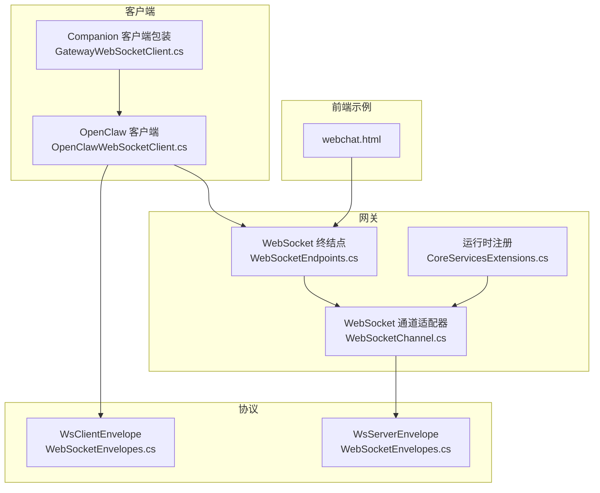
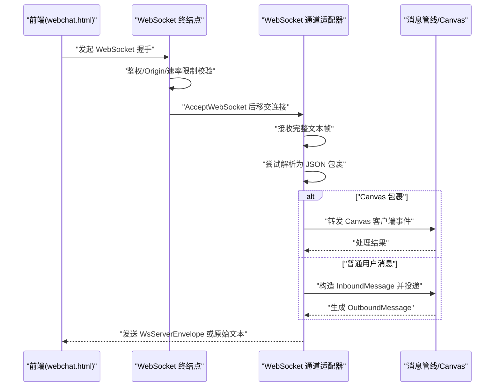
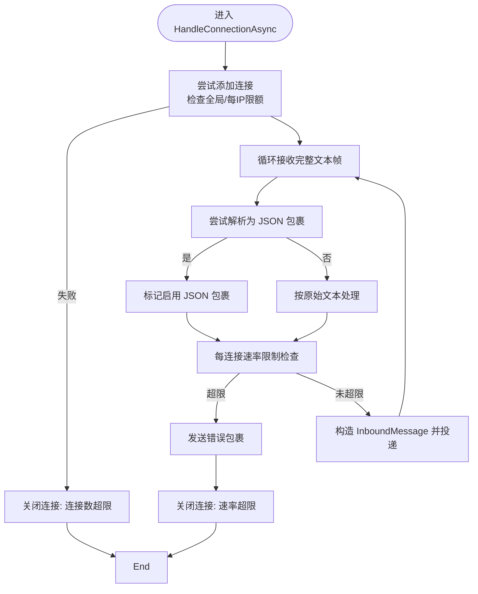
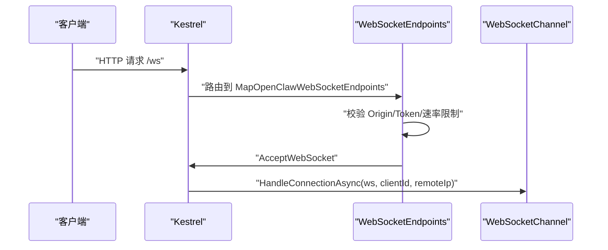
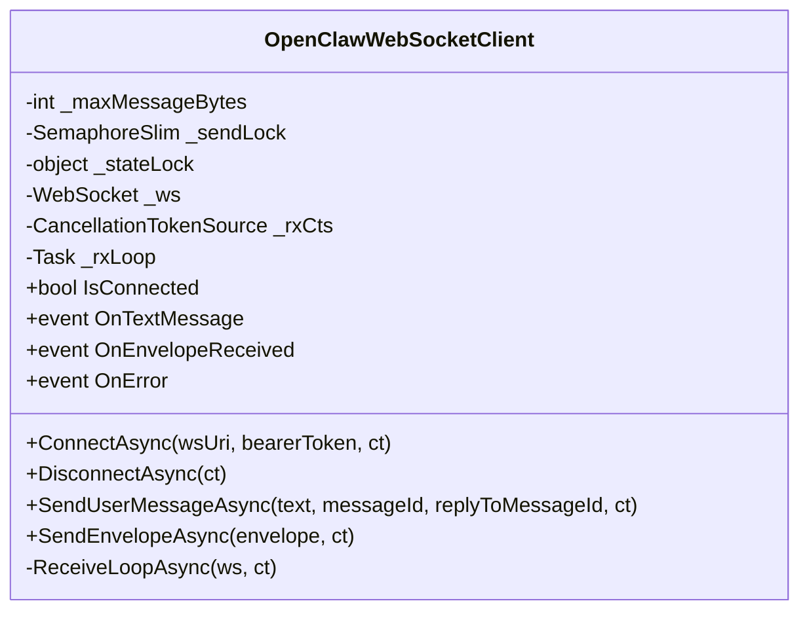
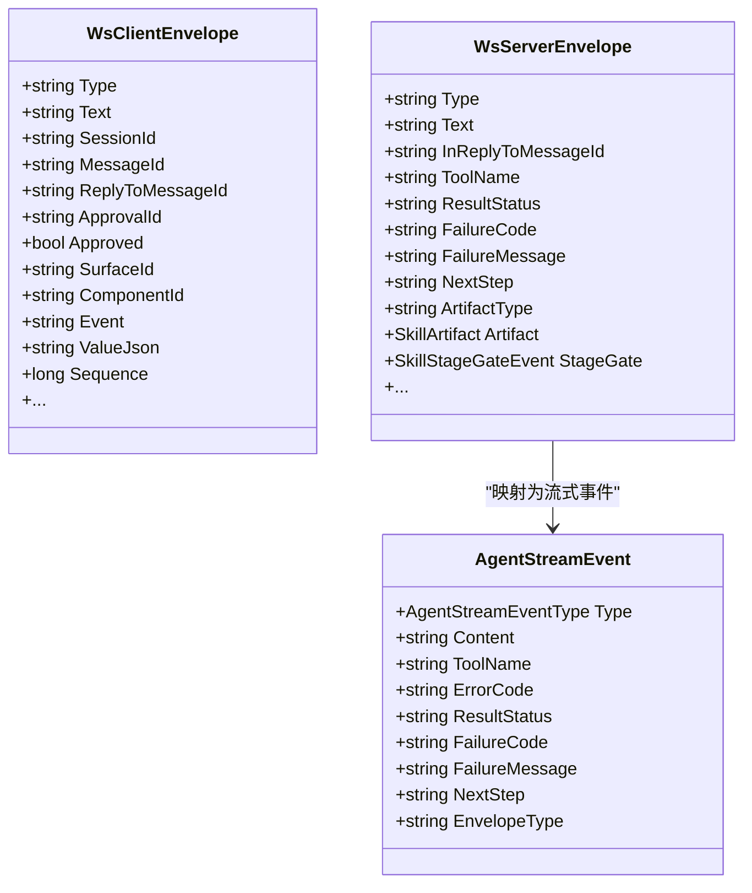
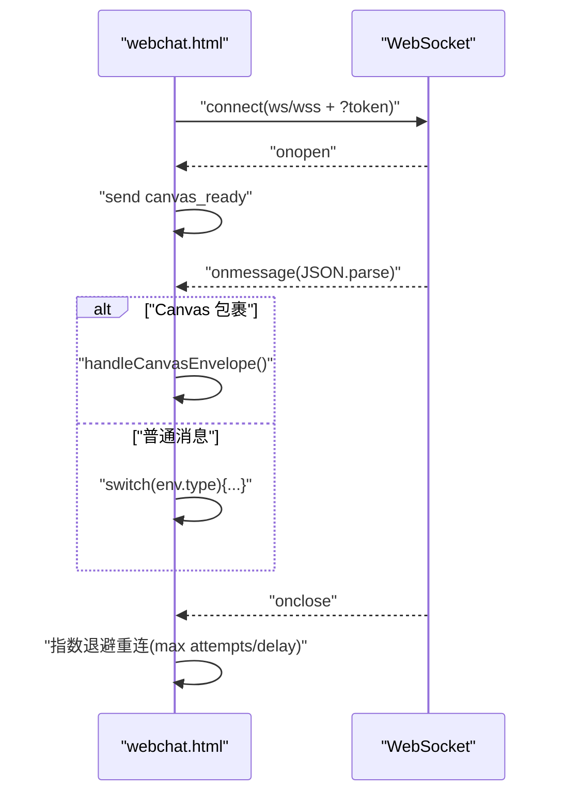
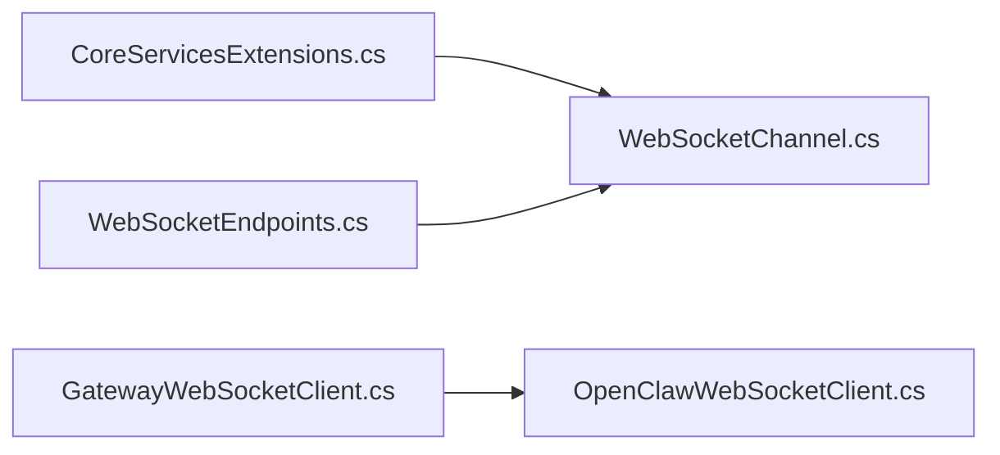

# WebSocket 通信

<cite>
**本文引用的文件**
- [WebSocketChannel.cs](file://src/OpenClaw.Channels/WebSocketChannel.cs)
- [OpenClawWebSocketClient.cs](file://src/OpenClaw.Client/OpenClawWebSocketClient.cs)
- [WebSocketEnvelopes.cs](file://src/OpenClaw.Core/Models/WebSocketEnvelopes.cs)
- [WebSocketEndpoints.cs](file://src/OpenClaw.Gateway/Endpoints/WebSocketEndpoints.cs)
- [GatewayWebSocketClient.cs](file://src/OpenClaw.Companion/Services/GatewayWebSocketClient.cs)
- [StreamingTypes.cs](file://src/OpenClaw.Core/Models/StreamingTypes.cs)
- [webchat.html](file://src/OpenClaw.Gateway/wwwroot/webchat.html)
- [OpenClawWebSocketClientTests.cs](file://src/OpenClaw.Tests/OpenClawWebSocketClientTests.cs)
- [WebSocketChannelTests.cs](file://src/OpenClaw.Tests/WebSocketChannelTests.cs)
- [CoreServicesExtensions.cs](file://src/OpenClaw.Gateway/Composition/CoreServicesExtensions.cs)
</cite>

## 目录
1. [简介](#简介)
2. [项目结构](#项目结构)
3. [核心组件](#核心组件)
4. [架构总览](#架构总览)
5. [详细组件分析](#详细组件分析)
6. [依赖关系分析](#依赖关系分析)
7. [性能考量](#性能考量)
8. [故障排查指南](#故障排查指南)
9. [结论](#结论)
10. [附录](#附录)

## 简介
本技术文档围绕 WebSocket 通信系统进行深入解析，覆盖实时双向通信的实现机制、消息格式与事件类型、状态管理、入站消息处理、出站消息投递、连接生命周期管理与错误恢复策略，并给出消息协议规范、心跳与重连逻辑、性能优化建议以及客户端连接示例、消息序列化与调试工具使用指南。目标是帮助开发者快速理解并高效扩展该系统的 WebSocket 能力。

## 项目结构
WebSocket 通信涉及以下关键模块：
- 网关端：Kestrel 接收器、WebSocket 终结点、通道适配器（负责连接管理、消息编解码、速率限制、流式事件）
- 客户端：通用 WebSocket 客户端（支持文本与 JSON 包裹）、配套 Companion 客户端包装
- 协议模型：客户端/服务端包裹消息结构体
- 前端示例：网页聊天界面，演示连接、事件分发与重连策略
- 测试：覆盖客户端行为、通道适配器行为与边界条件

**图表来源**
- [WebSocketEndpoints.cs:18-26](file://src/OpenClaw.Gateway/Endpoints/WebSocketEndpoints.cs#L18-L26)
- [WebSocketChannel.cs:67-74](file://src/OpenClaw.Channels/WebSocketChannel.cs#L67-L74)
- [CoreServicesExtensions.cs:234](file://src/OpenClaw.Gateway/Composition/CoreServicesExtensions.cs#L234)
- [OpenClawWebSocketClient.cs:38-57](file://src/OpenClaw.Client/OpenClawWebSocketClient.cs#L38-L57)
- [GatewayWebSocketClient.cs:24-32](file://src/OpenClaw.Companion/Services/GatewayWebSocketClient.cs#L24-L32)
- [WebSocketEnvelopes.cs:7-48](file://src/OpenClaw.Core/Models/WebSocketEnvelopes.cs#L7-L48)
- [WebSocketEnvelopes.cs:53-108](file://src/OpenClaw.Core/Models/WebSocketEnvelopes.cs#L53-L108)
- [webchat.html:4350-4374](file://src/OpenClaw.Gateway/wwwroot/webchat.html#L4350-L4374)

**章节来源**
- [WebSocketEndpoints.cs:18-61](file://src/OpenClaw.Gateway/Endpoints/WebSocketEndpoints.cs#L18-L61)
- [WebSocketChannel.cs:67-74](file://src/OpenClaw.Channels/WebSocketChannel.cs#L67-L74)
- [CoreServicesExtensions.cs:234](file://src/OpenClaw.Gateway/Composition/CoreServicesExtensions.cs#L234)
- [OpenClawWebSocketClient.cs:38-57](file://src/OpenClaw.Client/OpenClawWebSocketClient.cs#L38-L57)
- [GatewayWebSocketClient.cs:24-32](file://src/OpenClaw.Companion/Services/GatewayWebSocketClient.cs#L24-L32)
- [WebSocketEnvelopes.cs:7-48](file://src/OpenClaw.Core/Models/WebSocketEnvelopes.cs#L7-L48)
- [WebSocketEnvelopes.cs:53-108](file://src/OpenClaw.Core/Models/WebSocketEnvelopes.cs#L53-L108)
- [webchat.html:4350-4374](file://src/OpenClaw.Gateway/wwwroot/webchat.html#L4350-L4374)

## 核心组件
- WebSocket 通道适配器（网关侧）：负责连接接入、入站消息解析、Canvas 交互处理、速率限制、出站消息投递与流式事件发送、连接生命周期管理与清理。
- 网关 WebSocket 终结点：Kestrel 层面的 /ws 路由，完成握手、鉴权与请求校验后交由通道适配器处理。
- 客户端 WebSocket 客户端：负责连接建立、收发循环、JSON 包裹解析、错误回调与断开清理。
- 包裹消息模型：统一的客户端/服务端消息结构，支持 Canvas 交互、工具审批、流式事件等。
- 前端示例：webchat.html 展示连接、事件分发与指数退避重连策略。

**章节来源**
- [WebSocketChannel.cs:16-74](file://src/OpenClaw.Channels/WebSocketChannel.cs#L16-L74)
- [WebSocketEndpoints.cs:18-61](file://src/OpenClaw.Gateway/Endpoints/WebSocketEndpoints.cs#L18-L61)
- [OpenClawWebSocketClient.cs:9-37](file://src/OpenClaw.Client/OpenClawWebSocketClient.cs#L9-L37)
- [WebSocketEnvelopes.cs:7-108](file://src/OpenClaw.Core/Models/WebSocketEnvelopes.cs#L7-L108)
- [webchat.html:4350-4490](file://src/OpenClaw.Gateway/wwwroot/webchat.html#L4350-L4490)

## 架构总览
WebSocket 通信采用“终结点 → 通道适配器 → 上层业务”的分层设计。客户端通过 /ws 连接，网关侧进行鉴权与限流校验，随后进入通道适配器的消息循环；通道适配器将解析后的消息转交给上层消息管线或 Canvas 命令总线；服务端通过包裹消息向客户端推送响应、流式事件与工具审批等。

**图表来源**
- [WebSocketEndpoints.cs:18-26](file://src/OpenClaw.Gateway/Endpoints/WebSocketEndpoints.cs#L18-L26)
- [WebSocketChannel.cs:76-151](file://src/OpenClaw.Channels/WebSocketChannel.cs#L76-L151)
- [WebSocketChannel.cs:153-183](file://src/OpenClaw.Channels/WebSocketChannel.cs#L153-L183)
- [webchat.html:4350-4454](file://src/OpenClaw.Gateway/wwwroot/webchat.html#L4350-L4454)

**章节来源**
- [WebSocketEndpoints.cs:18-61](file://src/OpenClaw.Gateway/Endpoints/WebSocketEndpoints.cs#L18-L61)
- [WebSocketChannel.cs:76-151](file://src/OpenClaw.Channels/WebSocketChannel.cs#L76-L151)
- [WebSocketChannel.cs:153-183](file://src/OpenClaw.Channels/WebSocketChannel.cs#L153-L183)
- [webchat.html:4350-4454](file://src/OpenClaw.Gateway/wwwroot/webchat.html#L4350-L4454)

## 详细组件分析

### WebSocket 通道适配器（网关侧）
- 连接管理
  - 使用并发字典维护 clientId 到连接状态的映射，支持每 IP 最大连接数限制与全局最大连接数限制。
  - 连接建立时记录远端 IP 键，用于每 IP 限额统计。
- 入站消息处理
  - 循环接收完整文本帧，支持可选接收超时；超过最大消息长度会主动关闭连接。
  - 尝试将文本解析为 JSON 包裹（WsClientEnvelope），若成功则标记客户端启用 JSON 包裹模式。
  - Canvas 包裹（如 a2ui_event/a2ui_action/canvas_ready 等）单独处理并可选择中断后续普通消息处理。
  - 构造 InboundMessage 并触发 OnMessageReceived 事件，供上层处理。
- 出站消息投递
  - 若客户端使用 JSON 包裹，则以 WsServerEnvelope 发送；否则直接发送原始文本。
  - 支持流式事件发送（仅 JSON 包裹模式），将 AgentStreamEvent 映射为对应包类型。
  - 发送过程使用信号量锁确保并发安全，同时对移除中的连接进行保护。
- 速率限制
  - 每连接每分钟消息计数窗口，超过阈值时发送错误包裹并关闭连接。
- 生命周期与清理
  - 连接断开或异常时清理资源，释放发送锁，减少每 IP 计数，全局连接计数回退。
  - 提供测试辅助方法用于注入/移除连接。

**图表来源**
- [WebSocketChannel.cs:76-151](file://src/OpenClaw.Channels/WebSocketChannel.cs#L76-L151)
- [WebSocketChannel.cs:334-370](file://src/OpenClaw.Channels/WebSocketChannel.cs#L334-L370)
- [WebSocketChannel.cs:435-510](file://src/OpenClaw.Channels/WebSocketChannel.cs#L435-L510)
- [WebSocketChannel.cs:523-581](file://src/OpenClaw.Channels/WebSocketChannel.cs#L523-L581)

**章节来源**
- [WebSocketChannel.cs:76-151](file://src/OpenClaw.Channels/WebSocketChannel.cs#L76-L151)
- [WebSocketChannel.cs:153-183](file://src/OpenClaw.Channels/WebSocketChannel.cs#L153-L183)
- [WebSocketChannel.cs:247-296](file://src/OpenClaw.Channels/WebSocketChannel.cs#L247-L296)
- [WebSocketChannel.cs:334-370](file://src/OpenClaw.Channels/WebSocketChannel.cs#L334-L370)
- [WebSocketChannel.cs:435-510](file://src/OpenClaw.Channels/WebSocketChannel.cs#L435-L510)
- [WebSocketChannel.cs:523-581](file://src/OpenClaw.Channels/WebSocketChannel.cs#L523-L581)

### 网关 WebSocket 终结点
- 路由映射：/ws 与 /ws/live
- 请求校验：检查 WebSocket 请求、Origin 白名单、非本地绑定下的授权令牌、IP 级速率限制桶。
- 连接移交：接受握手后将连接移交至 WebSocketChannel.HandleConnectionAsync。

**图表来源**
- [WebSocketEndpoints.cs:18-26](file://src/OpenClaw.Gateway/Endpoints/WebSocketEndpoints.cs#L18-L26)
- [WebSocketEndpoints.cs:63-94](file://src/OpenClaw.Gateway/Endpoints/WebSocketEndpoints.cs#L63-L94)

**章节来源**
- [WebSocketEndpoints.cs:18-61](file://src/OpenClaw.Gateway/Endpoints/WebSocketEndpoints.cs#L18-L61)
- [WebSocketEndpoints.cs:63-94](file://src/OpenClaw.Gateway/Endpoints/WebSocketEndpoints.cs#L63-L94)

### 客户端 WebSocket 客户端
- 连接与断开
  - ConnectAsync 支持设置 Authorization 头，启动接收循环；DisconnectAsync 有序取消接收、等待退出、关闭/释放资源。
- 发送
  - SendEnvelopeAsync 序列化 WsClientEnvelope，检查最大消息大小，串行发送。
  - SendUserMessageAsync 快捷封装用户消息。
- 接收
  - ReceiveLoopAsync 循环接收帧，拼接完整消息，回调 OnTextMessage；尝试反序列化为 WsServerEnvelope 并回调 OnEnvelopeReceived；异常通过 OnError 回调。
- 状态
  - IsConnected 反映当前连接状态；内部使用锁保护状态与发送锁。

**图表来源**
- [OpenClawWebSocketClient.cs:9-37](file://src/OpenClaw.Client/OpenClawWebSocketClient.cs#L9-L37)
- [OpenClawWebSocketClient.cs:38-117](file://src/OpenClaw.Client/OpenClawWebSocketClient.cs#L38-L117)
- [OpenClawWebSocketClient.cs:119-156](file://src/OpenClaw.Client/OpenClawWebSocketClient.cs#L119-L156)
- [OpenClawWebSocketClient.cs:158-227](file://src/OpenClaw.Client/OpenClawWebSocketClient.cs#L158-L227)

**章节来源**
- [OpenClawWebSocketClient.cs:9-37](file://src/OpenClaw.Client/OpenClawWebSocketClient.cs#L9-L37)
- [OpenClawWebSocketClient.cs:38-117](file://src/OpenClaw.Client/OpenClawWebSocketClient.cs#L38-L117)
- [OpenClawWebSocketClient.cs:119-156](file://src/OpenClaw.Client/OpenClawWebSocketClient.cs#L119-L156)
- [OpenClawWebSocketClient.cs:158-227](file://src/OpenClaw.Client/OpenClawWebSocketClient.cs#L158-L227)

### 包裹消息模型与事件类型
- WsClientEnvelope：客户端发送的包裹，支持用户消息、Canvas 交互、工具审批决策等字段。
- WsServerEnvelope：服务端发送的包裹，支持文本、流式事件、工具执行状态、错误信息等。
- AgentStreamEvent：流式事件枚举与结构，映射为 WsServerEnvelope 的 Type 字段（如 assistant_chunk、tool_start、tool_result、error、assistant_done）。

**图表来源**
- [WebSocketEnvelopes.cs:7-48](file://src/OpenClaw.Core/Models/WebSocketEnvelopes.cs#L7-L48)
- [WebSocketEnvelopes.cs:53-108](file://src/OpenClaw.Core/Models/WebSocketEnvelopes.cs#L53-L108)
- [StreamingTypes.cs:31-87](file://src/OpenClaw.Core/Models/StreamingTypes.cs#L31-L87)

**章节来源**
- [WebSocketEnvelopes.cs:7-108](file://src/OpenClaw.Core/Models/WebSocketEnvelopes.cs#L7-L108)
- [StreamingTypes.cs:6-25](file://src/OpenClaw.Core/Models/StreamingTypes.cs#L6-L25)
- [StreamingTypes.cs:31-87](file://src/OpenClaw.Core/Models/StreamingTypes.cs#L31-L87)

### 前端示例与重连逻辑
- 连接建立：根据协议自动选择 ws/wss，支持携带 token 查询参数。
- 事件分发：识别 canvas 与普通消息类型，分别处理打字指示、文本增量、工具执行、错误提示等。
- 重连策略：指数退避、最大重连次数与最大延迟控制，认证/授权失败时停止自动重连并提示更新 token。

**图表来源**
- [webchat.html:4350-4374](file://src/OpenClaw.Gateway/wwwroot/webchat.html#L4350-L4374)
- [webchat.html:4376-4454](file://src/OpenClaw.Gateway/wwwroot/webchat.html#L4376-L4454)
- [webchat.html:4456-4490](file://src/OpenClaw.Gateway/wwwroot/webchat.html#L4456-L4490)

**章节来源**
- [webchat.html:4350-4374](file://src/OpenClaw.Gateway/wwwroot/webchat.html#L4350-L4374)
- [webchat.html:4376-4454](file://src/OpenClaw.Gateway/wwwroot/webchat.html#L4376-L4454)
- [webchat.html:4456-4490](file://src/OpenClaw.Gateway/wwwroot/webchat.html#L4456-L4490)

## 依赖关系分析
- 运行时注册：CoreServicesExtensions 将 WebSocketChannel 注册为单例，供网关运行时使用。
- 终结点依赖：WebSocketEndpoints 在路由中直接调用 runtime.WebSocketChannel.HandleConnectionAsync。
- 客户端依赖：GatewayWebSocketClient 作为 Companion 的薄包装，内部持有 OpenClaw.Client.OpenClawWebSocketClient。

**图表来源**
- [CoreServicesExtensions.cs:234](file://src/OpenClaw.Gateway/Composition/CoreServicesExtensions.cs#L234)
- [WebSocketEndpoints.cs:24-25](file://src/OpenClaw.Gateway/Endpoints/WebSocketEndpoints.cs#L24-L25)
- [GatewayWebSocketClient.cs:7-15](file://src/OpenClaw.Companion/Services/GatewayWebSocketClient.cs#L7-L15)

**章节来源**
- [CoreServicesExtensions.cs:234](file://src/OpenClaw.Gateway/Composition/CoreServicesExtensions.cs#L234)
- [WebSocketEndpoints.cs:24-25](file://src/OpenClaw.Gateway/Endpoints/WebSocketEndpoints.cs#L24-L25)
- [GatewayWebSocketClient.cs:7-15](file://src/OpenClaw.Companion/Services/GatewayWebSocketClient.cs#L7-L15)

## 性能考量
- 内存与缓冲
  - 使用 ArrayPool<byte> 与 ArrayBufferWriter<byte> 降低 GC 压力，按需扩容但受最大消息大小限制。
- 并发与锁
  - 发送路径使用 SemaphoreSlim 保证串行发送；连接移除与发送锁释放采用细粒度门控与预留计数，避免竞态。
- 速率限制
  - 每连接每分钟滑动窗口计数，超限即刻反馈错误并断开，防止过载。
- 接收超时
  - 可配置接收超时，避免长时间阻塞导致资源占用。
- 序列化
  - 使用 System.Text.Json 与预构建的 CoreJsonContext，减少反射与装箱开销。

**章节来源**
- [WebSocketChannel.cs:435-510](file://src/OpenClaw.Channels/WebSocketChannel.cs#L435-L510)
- [WebSocketChannel.cs:383-412](file://src/OpenClaw.Channels/WebSocketChannel.cs#L383-L412)
- [WebSocketChannel.cs:41-65](file://src/OpenClaw.Channels/WebSocketChannel.cs#L41-L65)
- [OpenClawWebSocketClient.cs:130-156](file://src/OpenClaw.Client/OpenClawWebSocketClient.cs#L130-L156)

## 故障排查指南
- 常见错误与恢复
  - 速率超限：通道适配器在启用 JSON 包裹时发送错误包裹并断开连接；客户端应监听 OnError 并提示用户稍后重试。
  - 接收超时：通道适配器在超时后主动关闭连接；前端应触发指数退避重连。
  - 连接被提前关闭：通道适配器忽略不完整的“连接被提前关闭”异常，避免误判；客户端断开时等待在途发送完成。
- 单元测试参考
  - 客户端测试验证断开时等待在途发送完成、回调异常不会中断接收循环。
  - 通道适配器测试验证速率超限时发送错误并断开、接收超时断开、并发发送场景无异常。

**章节来源**
- [WebSocketChannel.cs:96-112](file://src/OpenClaw.Channels/WebSocketChannel.cs#L96-L112)
- [WebSocketChannel.cs:470-474](file://src/OpenClaw.Channels/WebSocketChannel.cs#L470-L474)
- [OpenClawWebSocketClientTests.cs:8-26](file://src/OpenClaw.Tests/OpenClawWebSocketClientTests.cs#L8-L26)
- [OpenClawWebSocketClientTests.cs:28-56](file://src/OpenClaw.Tests/OpenClawWebSocketClientTests.cs#L28-L56)
- [WebSocketChannelTests.cs:408-417](file://src/OpenClaw.Tests/WebSocketChannelTests.cs#L408-L417)
- [WebSocketChannelTests.cs:419-433](file://src/OpenClaw.Tests/WebSocketChannelTests.cs#L419-L433)

## 结论
该 WebSocket 通信系统通过清晰的分层设计与严格的边界控制，实现了高可靠、可扩展的实时双向通信能力。通道适配器承担了连接管理、消息编解码、Canvas 交互与流式事件的关键职责；网关终结点提供安全与限流保障；客户端提供稳定的连接与事件分发能力；前端示例展示了从连接到重连的完整闭环。配合完善的测试与性能优化策略，系统可在生产环境中稳定运行并持续演进。

## 附录

### 消息协议规范（摘要）
- 客户端发送（WsClientEnvelope）
  - 类型：user_message、tool_approval_decision、canvas_*、a2ui_* 等
  - 关键字段：Type、Text/Content、SessionId、MessageId、ReplyToMessageId、ApprovalId、Approved、Canvas 相关字段
- 服务端发送（WsServerEnvelope）
  - 类型：assistant_message、assistant_chunk、tool_start、tool_chunk、tool_result、error、assistant_done、artifact、skill_stage_gate 等
  - 关键字段：Type、Text/InReplyToMessageId、ToolName、ResultStatus、FailureCode/FailureMessage、NextStep、Artifact/StageGate 等
- 流式事件（AgentStreamEvent → WsServerEnvelope.Type）
  - 文本增量：assistant_chunk
  - 工具开始：tool_start
  - 工具增量：tool_chunk
  - 工具结果：tool_result
  - 错误：error
  - 完成：assistant_done

**章节来源**
- [WebSocketEnvelopes.cs:7-48](file://src/OpenClaw.Core/Models/WebSocketEnvelopes.cs#L7-L48)
- [WebSocketEnvelopes.cs:53-108](file://src/OpenClaw.Core/Models/WebSocketEnvelopes.cs#L53-L108)
- [StreamingTypes.cs:77-87](file://src/OpenClaw.Core/Models/StreamingTypes.cs#L77-L87)

### 心跳机制与重连逻辑
- 心跳
  - 通道适配器未内置心跳循环；如需心跳，请在客户端侧自行实现（例如定时发送 ping/pong 或空包），并在接收侧检测超时后触发断开与重连。
- 重连
  - 前端示例采用指数退避策略，支持最大重连次数与最大延迟；遇到认证/授权错误时停止自动重连并提示更新 token。

**章节来源**
- [webchat.html:4456-4490](file://src/OpenClaw.Gateway/wwwroot/webchat.html#L4456-L4490)

### 客户端连接示例与调试
- 客户端连接
  - 使用 OpenClawWebSocketClient.ConnectAsync(wsUri, bearerToken, ct) 建立连接；设置 Authorization 头以传递令牌。
  - 监听 OnTextMessage 与 OnEnvelopeReceived 获取原始文本与包裹消息；OnError 处理异常。
- 调试工具
  - 使用单元测试中的 TestWebSocket 替换真实连接，模拟发送/接收、阻塞与异常场景，验证客户端/通道适配器行为。
  - 前端 webchat.html 提供可视化调试：连接状态、消息渲染、错误提示与重连日志。

**章节来源**
- [OpenClawWebSocketClient.cs:38-57](file://src/OpenClaw.Client/OpenClawWebSocketClient.cs#L38-L57)
- [OpenClawWebSocketClient.cs:158-227](file://src/OpenClaw.Client/OpenClawWebSocketClient.cs#L158-L227)
- [OpenClawWebSocketClientTests.cs:8-26](file://src/OpenClaw.Tests/OpenClawWebSocketClientTests.cs#L8-L26)
- [OpenClawWebSocketClientTests.cs:28-56](file://src/OpenClaw.Tests/OpenClawWebSocketClientTests.cs#L28-L56)
- [webchat.html:4350-4374](file://src/OpenClaw.Gateway/wwwroot/webchat.html#L4350-L4374)