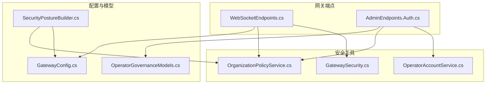
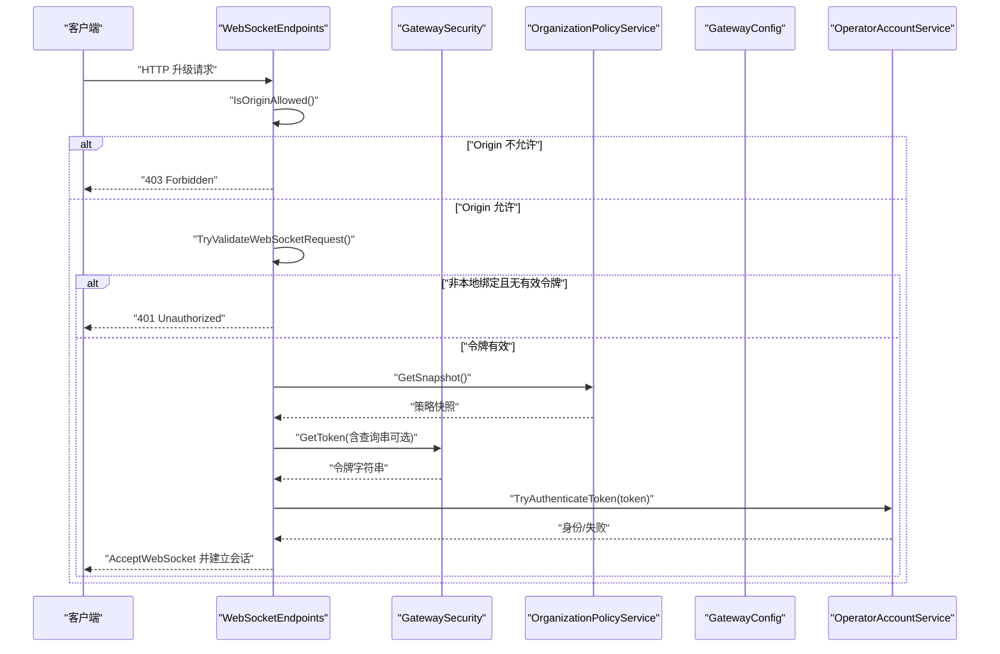
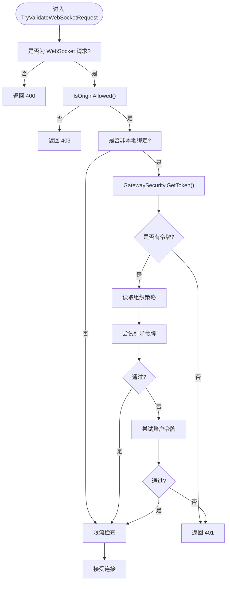
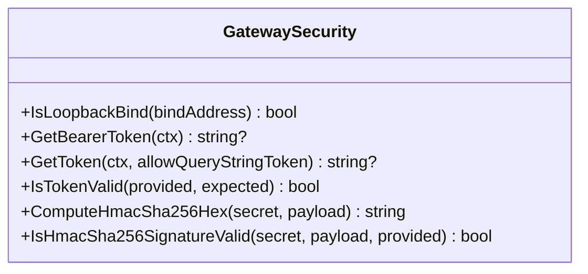
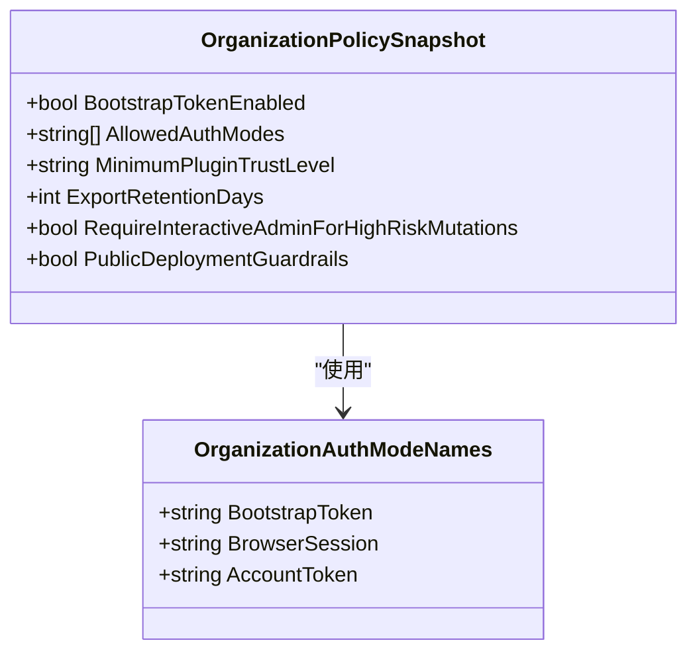
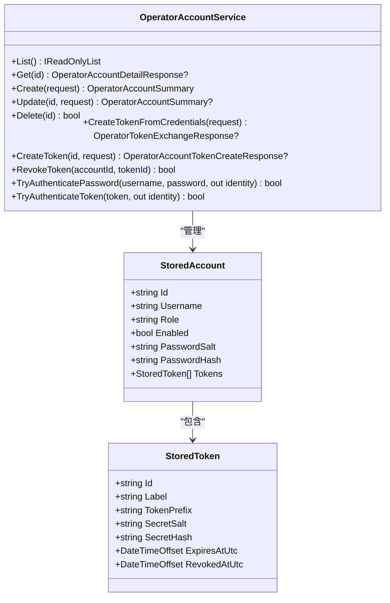
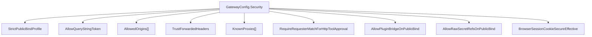
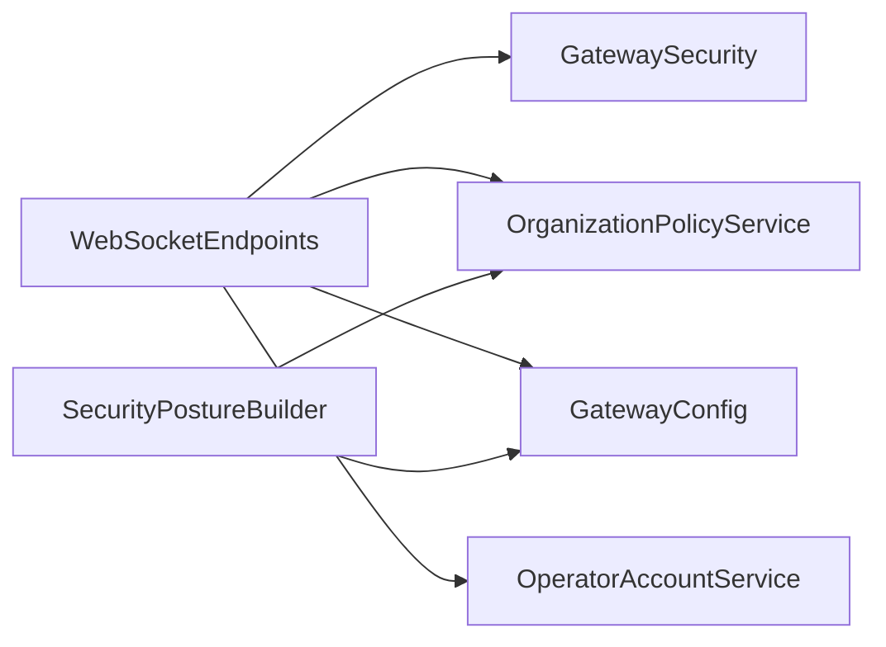

# 安全认证

<cite>
**本文引用的文件**
- [WebSocketEndpoints.cs](file://src/OpenClaw.Gateway/Endpoints/WebSocketEndpoints.cs)
- [GatewaySecurity.cs](file://src/OpenClaw.Gateway/GatewaySecurity.cs)
- [OperatorAccountService.cs](file://src/OpenClaw.Gateway/OperatorAccountService.cs)
- [OrganizationPolicyService.cs](file://src/OpenClaw.Gateway/OrganizationPolicyService.cs)
- [GatewayConfig.cs](file://src/OpenClaw.Core/Models/GatewayConfig.cs)
- [OperatorGovernanceModels.cs](file://src/OpenClaw.Core/Models/OperatorGovernanceModels.cs)
- [SecurityPostureBuilder.cs](file://src/OpenClaw.Gateway/SecurityPostureBuilder.cs)
- [AdminEndpoints.Auth.cs](file://src/OpenClaw.Gateway/Endpoints/AdminEndpoints.Auth.cs)
</cite>

## 目录
1. [简介](#简介)
2. [项目结构](#项目结构)
3. [核心组件](#核心组件)
4. [架构总览](#架构总览)
5. [详细组件分析](#详细组件分析)
6. [依赖关系分析](#依赖关系分析)
7. [性能考量](#性能考量)
8. [故障排查指南](#故障排查指南)
9. [结论](#结论)
10. [附录](#附录)

## 简介
本文件面向 WebSocket 安全认证系统，围绕以下目标展开：Origin 验证、令牌认证（引导令牌与账户令牌）、跨域安全策略；非本地绑定的安全机制、授权令牌验证与组织策略集成；安全配置选项、威胁防护与合规要求；以及安全最佳实践、漏洞防护与审计日志配置。内容基于代码库中的实际实现进行梳理与可视化说明。

## 项目结构
WebSocket 安全认证相关的核心代码主要分布在网关层的端点、安全工具与服务中，同时与配置模型、组织策略、操作员账户服务紧密耦合。下图展示关键模块之间的关系：

**图表来源**
- [WebSocketEndpoints.cs](file://src/OpenClaw.Gateway/Endpoints/WebSocketEndpoints.cs)
- [GatewaySecurity.cs](file://src/OpenClaw.Gateway/GatewaySecurity.cs)
- [OperatorAccountService.cs](file://src/OpenClaw.Gateway/OperatorAccountService.cs)
- [OrganizationPolicyService.cs](file://src/OpenClaw.Gateway/OrganizationPolicyService.cs)
- [GatewayConfig.cs](file://src/OpenClaw.Core/Models/GatewayConfig.cs)
- [OperatorGovernanceModels.cs](file://src/OpenClaw.Core/Models/OperatorGovernanceModels.cs)
- [SecurityPostureBuilder.cs](file://src/OpenClaw.Gateway/SecurityPostureBuilder.cs)
- [AdminEndpoints.Auth.cs](file://src/OpenClaw.Gateway/Endpoints/AdminEndpoints.Auth.cs)

**章节来源**
- [WebSocketEndpoints.cs](file://src/OpenClaw.Gateway/Endpoints/WebSocketEndpoints.cs)
- [GatewaySecurity.cs](file://src/OpenClaw.Gateway/GatewaySecurity.cs)
- [OperatorAccountService.cs](file://src/OpenClaw.Gateway/OperatorAccountService.cs)
- [OrganizationPolicyService.cs](file://src/OpenClaw.Gateway/OrganizationPolicyService.cs)
- [GatewayConfig.cs](file://src/OpenClaw.Core/Models/GatewayConfig.cs)
- [OperatorGovernanceModels.cs](file://src/OpenClaw.Core/Models/OperatorGovernanceModels.cs)
- [SecurityPostureBuilder.cs](file://src/OpenClaw.Gateway/SecurityPostureBuilder.cs)
- [AdminEndpoints.Auth.cs](file://src/OpenClaw.Gateway/Endpoints/AdminEndpoints.Auth.cs)

## 核心组件
- WebSocket 端点与握手校验：负责拦截 WebSocket 请求、执行 Origin 验证、在非本地绑定场景下强制令牌认证，并应用速率限制。
- 安全工具：提供令牌提取、Bearer 与查询串令牌支持、恒定时序比较的令牌校验、HMAC-SHA256 签名校验等能力。
- 组织策略服务：加载与规范化组织级认证模式与策略快照，影响 WebSocket 与 HTTP 的认证路径。
- 操作员账户服务：管理操作员账号、密码哈希与令牌生成、令牌认证与撤销。
- 配置模型：集中定义安全配置项（如允许的 Origin、是否允许查询串令牌、代理信任等）与 WebSocket 连接与消息限制。
- 安全态势构建器：根据部署状态与配置生成安全风险标志与建议，辅助合规与加固。

**章节来源**
- [WebSocketEndpoints.cs](file://src/OpenClaw.Gateway/Endpoints/WebSocketEndpoints.cs)
- [GatewaySecurity.cs](file://src/OpenClaw.Gateway/GatewaySecurity.cs)
- [OrganizationPolicyService.cs](file://src/OpenClaw.Gateway/OrganizationPolicyService.cs)
- [OperatorAccountService.cs](file://src/OpenClaw.Gateway/OperatorAccountService.cs)
- [GatewayConfig.cs](file://src/OpenClaw.Core/Models/GatewayConfig.cs)
- [SecurityPostureBuilder.cs](file://src/OpenClaw.Gateway/SecurityPostureBuilder.cs)

## 架构总览
WebSocket 安全认证的关键流程如下：客户端发起 WebSocket 握手，服务器端点先进行 Origin 校验；若为非本地绑定，还需通过令牌认证（支持引导令牌与账户令牌），随后进行速率限制检查，最终建立连接。组织策略决定允许的认证模式与开关，配置模型提供安全参数与 WebSocket 限制。

**图表来源**
- [WebSocketEndpoints.cs](file://src/OpenClaw.Gateway/Endpoints/WebSocketEndpoints.cs)
- [GatewaySecurity.cs](file://src/OpenClaw.Gateway/GatewaySecurity.cs)
- [OrganizationPolicyService.cs](file://src/OpenClaw.Gateway/OrganizationPolicyService.cs)
- [OperatorAccountService.cs](file://src/OpenClaw.Gateway/OperatorAccountService.cs)
- [GatewayConfig.cs](file://src/OpenClaw.Core/Models/GatewayConfig.cs)

## 详细组件分析

### WebSocket 端点与握手校验
- Origin 验证优先：若未携带 Origin 或为空则放行；否则与请求 Host 的方案、主机与端口严格匹配；也可使用预设允许列表。
- 非本地绑定强制令牌：当绑定地址非本地时，必须提供有效令牌（支持 Authorization 头或查询串 token，后者受配置控制）。
- 认证模式选择：优先尝试引导令牌（配置中的 AuthToken），其次尝试账户令牌（通过操作员账户服务验证）。
- 速率限制：对 IP 级别进行桶限流，避免滥用。
- 错误处理：握手失败时返回相应状态码并在 Live 会话中发送错误包。

**图表来源**
- [WebSocketEndpoints.cs](file://src/OpenClaw.Gateway/Endpoints/WebSocketEndpoints.cs)
- [GatewaySecurity.cs](file://src/OpenClaw.Gateway/GatewaySecurity.cs)

**章节来源**
- [WebSocketEndpoints.cs](file://src/OpenClaw.Gateway/Endpoints/WebSocketEndpoints.cs)

### 安全工具：令牌提取与校验
- 提取策略：优先从 Authorization: Bearer 头提取；若允许查询串，则从 token 查询参数提取。
- 恒定时序比较：使用固定时间比较算法对比期望令牌与提供的令牌，防止时序攻击。
- HMAC-SHA256 签名校验：支持带 sha256= 前缀的十六进制签名，进行解码与恒定时序比较。
- 适用范围：用于 WebSocket 与 HTTP 的令牌校验，保障令牌泄露面最小化。

**图表来源**
- [GatewaySecurity.cs](file://src/OpenClaw.Gateway/GatewaySecurity.cs)

**章节来源**
- [GatewaySecurity.cs](file://src/OpenClaw.Gateway/GatewaySecurity.cs)

### 组织策略与认证模式
- 策略快照：包含是否启用引导令牌、允许的认证模式数组、最低插件信任级别、导出保留天数等。
- 模式枚举：引导令牌、浏览器会话、账户令牌。
- 规范化：对模式数组去空白、去重、小写化，确保一致性与默认值。

**图表来源**
- [OrganizationPolicyService.cs](file://src/OpenClaw.Gateway/OrganizationPolicyService.cs)
- [OperatorGovernanceModels.cs](file://src/OpenClaw.Core/Models/OperatorGovernanceModels.cs)

**章节来源**
- [OrganizationPolicyService.cs](file://src/OpenClaw.Gateway/OrganizationPolicyService.cs)
- [OperatorGovernanceModels.cs](file://src/OpenClaw.Core/Models/OperatorGovernanceModels.cs)

### 操作员账户与令牌认证
- 密码哈希：PBKDF2 使用盐值与迭代次数生成哈希，登录时恒定时序比较。
- 令牌生成：随机密钥生成完整令牌，仅保存前缀与盐+哈希，登录时先匹配前缀再进行恒定时序比较。
- 令牌生命周期：支持过期时间与撤销标记，撤销后即刻失效。
- 会话认证：支持基于密码的浏览器会话认证，返回身份快照。

**图表来源**
- [OperatorAccountService.cs](file://src/OpenClaw.Gateway/OperatorAccountService.cs)

**章节来源**
- [OperatorAccountService.cs](file://src/OpenClaw.Gateway/OperatorAccountService.cs)

### 安全配置与跨域策略
- 公共绑定安全预设：非本地绑定时采用更严格的启动前安全配置，降低不安全工具与桥接的风险。
- 允许的 Origin 列表：可显式配置白名单，优先于动态校验。
- 查询串令牌：默认关闭，需显式开启以降低令牌泄露风险。
- 代理与转发头：可信任转发头并配置已知代理，用于正确识别客户端 IP 与协议。
- 工具审批与插件桥接：在公共绑定下限制或禁止高风险配置，降低供应链与本地执行风险。
- 浏览器会话 Cookie Secure 效果：在公共绑定或信任转发头时生效，提升会话安全性。

**图表来源**
- [GatewayConfig.cs](file://src/OpenClaw.Core/Models/GatewayConfig.cs)
- [SecurityPostureBuilder.cs](file://src/OpenClaw.Gateway/SecurityPostureBuilder.cs)

**章节来源**
- [GatewayConfig.cs](file://src/OpenClaw.Core/Models/GatewayConfig.cs)
- [SecurityPostureBuilder.cs](file://src/OpenClaw.Gateway/SecurityPostureBuilder.cs)

### 安全态势与合规建议
- 风险标志：公共绑定缺少引导令牌、浏览器会话 Cookie 可能不安全、插件桥接启用、原始密钥引用、未沙箱化的 shell/process、未签名的第三方通道 Webhook、审批模式缺失工具清单等。
- 建议措施：配置引导令牌、启用请求者匹配、信任转发头并配置代理、禁用高风险工具或启用沙箱、为各通道启用签名验证、完善审批工具清单。
- 输出：安全态势响应对象包含风险标志与建议列表，便于 CLI 与仪表盘展示。

**章节来源**
- [SecurityPostureBuilder.cs](file://src/OpenClaw.Gateway/SecurityPostureBuilder.cs)

### 管理端认证与令牌发放
- 管理端接口：支持以用户名/密码交换获取账户令牌，受组织策略控制。
- 审计记录：成功发放令牌后写入操作员审计，包含身份信息与摘要。
- 与前端配合：前端通过管理端接口完成登录与令牌持久化，后续使用 Bearer 或查询串令牌访问 WebSocket。

**章节来源**
- [AdminEndpoints.Auth.cs](file://src/OpenClaw.Gateway/Endpoints/AdminEndpoints.Auth.cs)
- [OperatorAccountService.cs](file://src/OpenClaw.Gateway/OperatorAccountService.cs)
- [OperatorGovernanceModels.cs](file://src/OpenClaw.Core/Models/OperatorGovernanceModels.cs)

## 依赖关系分析
- WebSocketEndpoints 依赖 GatewaySecurity 进行令牌提取与校验，依赖 OrganizationPolicyService 获取策略，依赖 GatewayConfig 中的 WebSocket 限制与安全配置。
- OperatorAccountService 独立维护账户与令牌状态，为 WebSocket 与 HTTP 提供统一的身份认证入口。
- SecurityPostureBuilder 依据配置与运行态生成安全风险与建议，指导部署与加固。

**图表来源**
- [WebSocketEndpoints.cs](file://src/OpenClaw.Gateway/Endpoints/WebSocketEndpoints.cs)
- [GatewaySecurity.cs](file://src/OpenClaw.Gateway/GatewaySecurity.cs)
- [OrganizationPolicyService.cs](file://src/OpenClaw.Gateway/OrganizationPolicyService.cs)
- [OperatorAccountService.cs](file://src/OpenClaw.Gateway/OperatorAccountService.cs)
- [GatewayConfig.cs](file://src/OpenClaw.Core/Models/GatewayConfig.cs)
- [SecurityPostureBuilder.cs](file://src/OpenClaw.Gateway/SecurityPostureBuilder.cs)

**章节来源**
- [WebSocketEndpoints.cs](file://src/OpenClaw.Gateway/Endpoints/WebSocketEndpoints.cs)
- [GatewaySecurity.cs](file://src/OpenClaw.Gateway/GatewaySecurity.cs)
- [OrganizationPolicyService.cs](file://src/OpenClaw.Gateway/OrganizationPolicyService.cs)
- [OperatorAccountService.cs](file://src/OpenClaw.Gateway/OperatorAccountService.cs)
- [GatewayConfig.cs](file://src/OpenClaw.Core/Models/GatewayConfig.cs)
- [SecurityPostureBuilder.cs](file://src/OpenClaw.Gateway/SecurityPostureBuilder.cs)

## 性能考量
- 令牌提取与校验：恒定时序比较与 PBKDF2 哈希计算均为常量时间/近似常量时间，开销可控。
- 速率限制：基于 IP 的轻量级限流，避免握手阶段的资源耗尽。
- WebSocket 限制：最大消息大小、每连接每分钟消息数、接收超时等参数可调，平衡吞吐与资源占用。
- 建议：在高并发场景下，结合反向代理与连接池优化，合理设置 WebSocketConfig 参数。

## 故障排查指南
- 403 Forbidden（Origin 不允许）：检查 AllowedOrigins 配置或动态校验逻辑（方案、主机、端口必须一致）。
- 401 Unauthorized（非本地绑定无令牌）：确认 Authorization 头或查询串 token 是否正确传递；检查组织策略是否允许对应认证模式。
- 429 Too Many Requests：检查速率限制配置与客户端行为，必要时调整限流阈值。
- 登录失败：核对用户名/密码与 PBKDF2 哈希匹配；检查账户是否启用、令牌是否过期或撤销。
- 安全风险提示：根据安全态势建议逐项加固，特别是公共绑定场景下的工具与桥接配置。

**章节来源**
- [WebSocketEndpoints.cs](file://src/OpenClaw.Gateway/Endpoints/WebSocketEndpoints.cs)
- [OperatorAccountService.cs](file://src/OpenClaw.Gateway/OperatorAccountService.cs)
- [SecurityPostureBuilder.cs](file://src/OpenClaw.Gateway/SecurityPostureBuilder.cs)

## 结论
该 WebSocket 安全认证体系通过严格的 Origin 验证、非本地绑定强制令牌认证、组织策略驱动的模式选择、以及恒定时序比较与 PBKDF2 哈希等安全机制，有效降低了跨域与令牌泄露风险。结合安全配置与安全态势构建器，可在公共绑定场景下实现更强的合规性与可审计性。建议在生产环境中启用引导令牌、信任转发头、签名验证与沙箱隔离，并定期审查安全态势与审计日志。

## 附录
- 安全最佳实践
  - 公共绑定必须配置引导令牌；关闭查询串令牌；启用各通道签名验证；限制插件桥接与原始密钥引用。
  - 启用浏览器会话 Cookie Secure 效果；对 shell/process 等高风险工具进行沙箱化或禁用。
  - 明确审批工具清单，避免“全工具”模式；启用请求者匹配以增强 HTTP 工具审批的可追溯性。
- 漏洞防护
  - 防止时序攻击：使用恒定时序比较；避免泄露令牌长度信息。
  - 防止暴力破解：PBKDF2 迭代次数与盐值管理；限制登录尝试频率。
  - 防止跨站脚本与 CSRF：严格 Origin 校验与 SameSite/Cookie Secure 策略（在信任转发头前提下生效）。
- 审计日志配置
  - 管理端认证发放与撤销应记录到操作员审计；导出审计包时包含 operator-audit.jsonl 与治理账本（可选）。
  - 定期导出并归档审计数据，设置合理的保留天数，满足合规要求。