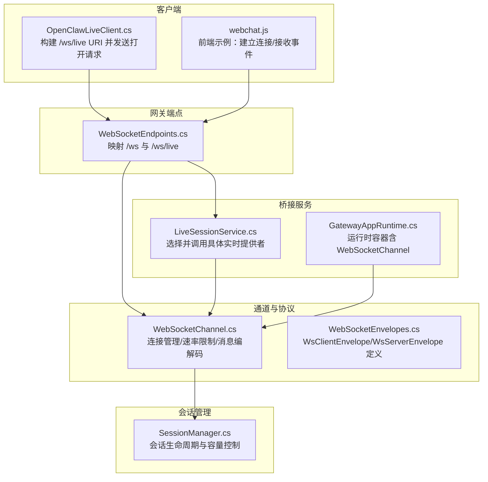
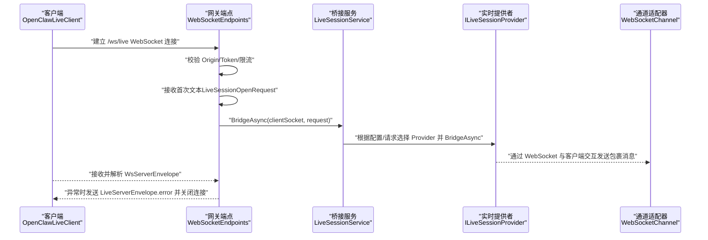
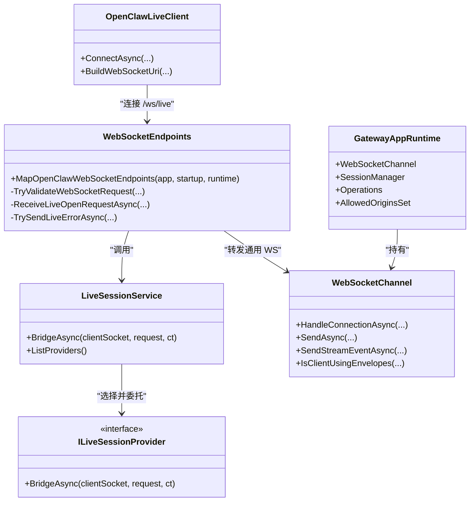

# 实时会话

<cite>
**本文引用的文件**
- [WebSocketEndpoints.cs](file://src/OpenClaw.Gateway/Endpoints/WebSocketEndpoints.cs)
- [LiveSessionService.cs](file://src/OpenClaw.Gateway/TextToSpeechService.cs)
- [WebSocketChannel.cs](file://src/OpenClaw.Channels/WebSocketChannel.cs)
- [WebSocketEnvelopes.cs](file://src/OpenClaw.Core/Models/WebSocketEnvelopes.cs)
- [OpenClawLiveClient.cs](file://src/OpenClaw.Client/OpenClawLiveClient.cs)
- [SessionManager.cs](file://src/OpenClaw.Core/Sessions/SessionManager.cs)
- [GatewayAppRuntime.cs](file://src/OpenClaw.Gateway/Composition/GatewayAppRuntime.cs)
- [webchat.js](file://src/OpenClaw.Gateway/wwwroot/webchat.js)
</cite>

## 目录
1. [简介](#简介)
2. [项目结构](#项目结构)
3. [核心组件](#核心组件)
4. [架构总览](#架构总览)
5. [详细组件分析](#详细组件分析)
6. [依赖关系分析](#依赖关系分析)
7. [性能考虑](#性能考虑)
8. [故障排查指南](#故障排查指南)
9. [结论](#结论)
10. [附录](#附录)

## 简介
本文件面向 WebSocket 实时会话系统，聚焦 /ws/live 端点的实现机制、会话打开请求处理与桥接服务，系统性阐述实时通信协议、会话状态管理、错误恢复策略、会话生命周期、并发控制与资源管理，并提供配置要点、调试方法与性能优化建议。

## 项目结构
实时会话能力由网关端点、通道适配器、会话服务与客户端共同构成，关键文件如下图所示：

**图表来源**
- [WebSocketEndpoints.cs:13-61](file://src/OpenClaw.Gateway/Endpoints/WebSocketEndpoints.cs#L13-L61)
- [LiveSessionService.cs:66-100](file://src/OpenClaw.Gateway/TextToSpeechService.cs#L66-L100)
- [WebSocketChannel.cs:16-317](file://src/OpenClaw.Channels/WebSocketChannel.cs#L16-L317)
- [WebSocketEnvelopes.cs:7-108](file://src/OpenClaw.Core/Models/WebSocketEnvelopes.cs#L7-L108)
- [OpenClawLiveClient.cs:49-87](file://src/OpenClaw.Client/OpenClawLiveClient.cs#L49-L87)
- [GatewayAppRuntime.cs:21-64](file://src/OpenClaw.Gateway/Composition/GatewayAppRuntime.cs#L21-L64)
- [SessionManager.cs:13-348](file://src/OpenClaw.Core/Sessions/SessionManager.cs#L13-L348)

**章节来源**
- [WebSocketEndpoints.cs:13-61](file://src/OpenClaw.Gateway/Endpoints/WebSocketEndpoints.cs#L13-L61)
- [LiveSessionService.cs:66-100](file://src/OpenClaw.Gateway/TextToSpeechService.cs#L66-L100)
- [WebSocketChannel.cs:16-317](file://src/OpenClaw.Channels/WebSocketChannel.cs#L16-L317)
- [WebSocketEnvelopes.cs:7-108](file://src/OpenClaw.Core/Models/WebSocketEnvelopes.cs#L7-L108)
- [OpenClawLiveClient.cs:49-87](file://src/OpenClaw.Client/OpenClawLiveClient.cs#L49-L87)
- [GatewayAppRuntime.cs:21-64](file://src/OpenClaw.Gateway/Composition/GatewayAppRuntime.cs#L21-L64)
- [SessionManager.cs:13-348](file://src/OpenClaw.Core/Sessions/SessionManager.cs#L13-L348)

## 核心组件
- 网关端点与握手校验
  - /ws/live 接受 WebSocket 握手，进行 Origin/Token/限流校验，接收首次打开请求后交由 LiveSessionService 处理。
- 桥接服务
  - LiveSessionService 基于配置与请求选择具体实时提供者（如 Gemini），执行桥接逻辑。
- 通道适配器
  - WebSocketChannel 负责连接接入、速率限制、消息解析与发送、并发控制与资源回收。
- 协议模型
  - WsClientEnvelope/WsServerEnvelope 定义了客户端与服务器之间的 JSON 包裹消息格式。
- 客户端
  - OpenClawLiveClient 构建 /ws/live URI，发送打开请求，接收并解析服务器包裹消息。
- 会话管理
  - SessionManager 提供会话创建、活跃度维护、过期清理与并发容量控制。

**章节来源**
- [WebSocketEndpoints.cs:28-61](file://src/OpenClaw.Gateway/Endpoints/WebSocketEndpoints.cs#L28-L61)
- [LiveSessionService.cs:82-96](file://src/OpenClaw.Gateway/TextToSpeechService.cs#L82-L96)
- [WebSocketChannel.cs:76-151](file://src/OpenClaw.Channels/WebSocketChannel.cs#L76-L151)
- [WebSocketEnvelopes.cs:7-108](file://src/OpenClaw.Core/Models/WebSocketEnvelopes.cs#L7-L108)
- [OpenClawLiveClient.cs:60-87](file://src/OpenClaw.Client/OpenClawLiveClient.cs#L60-L87)
- [SessionManager.cs:29-130](file://src/OpenClaw.Core/Sessions/SessionManager.cs#L29-L130)

## 架构总览
/ws/live 的端到端流程如下：

**图表来源**
- [WebSocketEndpoints.cs:28-61](file://src/OpenClaw.Gateway/Endpoints/WebSocketEndpoints.cs#L28-L61)
- [LiveSessionService.cs:82-96](file://src/OpenClaw.Gateway/TextToSpeechService.cs#L82-L96)
- [WebSocketChannel.cs:76-151](file://src/OpenClaw.Channels/WebSocketChannel.cs#L76-L151)
- [OpenClawLiveClient.cs:60-87](file://src/OpenClaw.Client/OpenClawLiveClient.cs#L60-L87)

## 详细组件分析

### /ws/live 端点与握手校验
- 功能要点
  - 接受 WebSocket 握手，进行 Origin 允许性检查、授权令牌校验（非本地绑定场景）、IP 维度的速率限制桶消费。
  - 接收首个文本帧作为 LiveSessionOpenRequest，反序列化后交由 LiveSessionService。
  - 异常路径：记录警告日志并向客户端发送 LiveServerEnvelope.error；最终确保连接正常关闭。
- 关键行为
  - 校验失败返回 400/403/401/429。
  - 成功后进入桥接阶段，不再复用通用通道消息分发。

**章节来源**
- [WebSocketEndpoints.cs:28-61](file://src/OpenClaw.Gateway/Endpoints/WebSocketEndpoints.cs#L28-L61)
- [WebSocketEndpoints.cs:63-94](file://src/OpenClaw.Gateway/Endpoints/WebSocketEndpoints.cs#L63-L94)
- [WebSocketEndpoints.cs:151-175](file://src/OpenClaw.Gateway/Endpoints/WebSocketEndpoints.cs#L151-L175)
- [WebSocketEndpoints.cs:177-189](file://src/OpenClaw.Gateway/Endpoints/WebSocketEndpoints.cs#L177-L189)

### LiveSessionService 桥接服务
- 功能要点
  - 依据配置判断多模态是否启用；若未启用则直接抛出异常。
  - 解析请求中的 Provider 字段，若为空则使用默认配置项。
  - 在已注册的 ILiveSessionProvider 中查找对应提供者，不存在则抛出异常。
  - 记录日志后调用具体 Provider 的 BridgeAsync，完成与客户端的实时桥接。
- 错误处理
  - 配置禁用或未知 Provider 将抛出异常，由上层端点捕获并回传错误包裹。

**章节来源**
- [LiveSessionService.cs:82-96](file://src/OpenClaw.Gateway/TextToSpeechService.cs#L82-L96)

### WebSocketChannel 通道适配器
- 连接接入与准入控制
  - 维护连接数与每 IP 连接数上限，超过则拒绝并关闭。
  - 使用生命周期门控与发送锁保证并发安全。
- 消息处理
  - 接收完整文本消息，支持分片重组；对非文本消息忽略。
  - 尝试解析为 WsClientEnvelope，识别画布交互等特殊类型并触发相应事件。
  - 速率限制：按每分钟消息数窗口计数，超限则发送错误包裹并关闭连接。
- 发送路径
  - 支持两种模式：JSON 包裹（用于流式事件）与原始文本。
  - 流式事件仅在包裹模式下生效，通过 SendStreamEventAsync 发送特定类型包裹。
- 资源回收
  - 断开连接时释放发送锁、关闭套接字并更新统计。

**章节来源**
- [WebSocketChannel.cs:76-151](file://src/OpenClaw.Channels/WebSocketChannel.cs#L76-L151)
- [WebSocketChannel.cs:153-183](file://src/OpenClaw.Channels/WebSocketChannel.cs#L153-L183)
- [WebSocketChannel.cs:247-296](file://src/OpenClaw.Channels/WebSocketChannel.cs#L247-L296)
- [WebSocketChannel.cs:334-381](file://src/OpenClaw.Channels/WebSocketChannel.cs#L334-L381)

### 实时通信协议与消息模型
- 客户端到服务器
  - 可选 JSON 包裹 WsClientEnvelope，支持用户消息、工具审批决策、画布交互等类型。
  - 若非包裹格式，通道将视为纯文本透传。
- 服务器到客户端
  - JSON 包裹 WsServerEnvelope，承载文本、流式事件、工具审批状态、错误信息等。
  - 客户端可按类型解析并渲染 UI 或继续后续交互。
- 前端示例
  - webchat.js 展示了连接建立、错误处理、消息解析与视图切换等流程。

**章节来源**
- [WebSocketEnvelopes.cs:7-108](file://src/OpenClaw.Core/Models/WebSocketEnvelopes.cs#L7-L108)
- [webchat.js:828-861](file://src/OpenClaw.Gateway/wwwroot/webchat.js#L828-L861)

### 客户端连接与打开请求
- 客户端职责
  - 构造 /ws/live URI（自动将 http/https 转换为 ws/wss）。
  - 建立连接后发送 LiveSessionOpenRequest 文本帧，随后启动接收循环。
  - 解析服务器包裹消息，驱动 UI 与业务逻辑。
- 打开请求
  - 可为空，表示使用默认 Provider；也可指定 Provider 名称。

**章节来源**
- [OpenClawLiveClient.cs:49-87](file://src/OpenClaw.Client/OpenClawLiveClient.cs#L49-L87)
- [WebSocketEndpoints.cs:151-159](file://src/OpenClaw.Gateway/Endpoints/WebSocketEndpoints.cs#L151-L159)

### 会话状态管理与生命周期
- 生命周期
  - 创建：首次接入或显式指定会话 ID 时创建；活跃时间刷新。
  - 活跃：持续接收消息更新 LastActiveAt；支持并发锁保障一致性。
  - 过期：超出超时阈值后标记为 Expired 并从内存中移除。
  - 移除：显式 RemoveActive 或持久化后清理。
- 并发与容量
  - 全局准入门控与会话级锁，避免竞态。
  - 最大并发会话数限制，防止资源耗尽。
- 与通道的协作
  - 通道负责连接级速率限制与消息路由；会话管理负责业务级状态与持久化。

**章节来源**
- [SessionManager.cs:29-130](file://src/OpenClaw.Core/Sessions/SessionManager.cs#L29-L130)
- [SessionManager.cs:338-348](file://src/OpenClaw.Core/Sessions/SessionManager.cs#L338-L348)

## 依赖关系分析
- 组件耦合
  - WebSocketEndpoints 依赖 LiveSessionService 与运行时环境（认证、限流、允许的 Origin）。
  - LiveSessionService 依赖配置与 ILiveSessionProvider 注册表。
  - WebSocketChannel 依赖运行时容器（GatewayAppRuntime）提供的会话管理与指标。
- 外部集成
  - 前端 webchat.js 通过标准 WebSocket API 与 /ws/live 交互。
  - 客户端 OpenClawLiveClient 与网关端点保持一致的消息契约。

**图表来源**
- [WebSocketEndpoints.cs:13-61](file://src/OpenClaw.Gateway/Endpoints/WebSocketEndpoints.cs#L13-L61)
- [LiveSessionService.cs:66-100](file://src/OpenClaw.Gateway/TextToSpeechService.cs#L66-L100)
- [WebSocketChannel.cs:16-317](file://src/OpenClaw.Channels/WebSocketChannel.cs#L16-L317)
- [GatewayAppRuntime.cs:21-64](file://src/OpenClaw.Gateway/Composition/GatewayAppRuntime.cs#L21-L64)
- [OpenClawLiveClient.cs:60-87](file://src/OpenClaw.Client/OpenClawLiveClient.cs#L60-L87)

**章节来源**
- [WebSocketEndpoints.cs:13-61](file://src/OpenClaw.Gateway/Endpoints/WebSocketEndpoints.cs#L13-L61)
- [LiveSessionService.cs:66-100](file://src/OpenClaw.Gateway/TextToSpeechService.cs#L66-L100)
- [WebSocketChannel.cs:16-317](file://src/OpenClaw.Channels/WebSocketChannel.cs#L16-L317)
- [GatewayAppRuntime.cs:21-64](file://src/OpenClaw.Gateway/Composition/GatewayAppRuntime.cs#L21-L64)
- [OpenClawLiveClient.cs:60-87](file://src/OpenClaw.Client/OpenClawLiveClient.cs#L60-L87)

## 性能考虑
- 连接与速率限制
  - 通道侧按连接维度限制每分钟消息数，避免单连接拥塞；同时限制总连接数与每 IP 连接数，防止滥用。
- 内存与缓冲
  - 接收采用数组池与可变缓冲区，支持分片消息重组；设置最大消息大小，超限主动关闭。
- 并发与锁
  - 发送路径使用信号量锁与生命周期门控，避免并发写入与资源竞争。
- 会话容量
  - 会话管理器通过全局准入门控与最大并发限制，保护后端资源。
- 建议
  - 合理设置 MaxConnections、MessagesPerMinutePerConnection、MaxMessageBytes。
  - 对高频流式事件使用包裹模式，减少冗余文本传输。
  - 前端按需发送，避免短周期高频小消息导致速率限制触发。

[本节为通用指导，无需列出具体文件来源]

## 故障排查指南
- 常见错误与定位
  - 400/403/401/429：检查 Origin、Token 与限流策略；确认绑定地址与认证模式。
  - 连接被拒绝（policy violation）：检查 MaxConnections/MaxConnectionsPerIp 是否超限。
  - 速率限制触发：调整 MessagesPerMinutePerConnection 或降低发送频率。
  - 消息过大：增大 MaxMessageBytes 或拆分消息。
- 日志与诊断
  - 端点层捕获异常并记录日志，同时向客户端发送 LiveServerEnvelope.error。
  - 客户端侧对解析异常与断连进行回调通知。
- 前端验证
  - webchat.js 展示了连接状态、消息解析与错误提示，可用于快速验证链路。

**章节来源**
- [WebSocketEndpoints.cs:63-94](file://src/OpenClaw.Gateway/Endpoints/WebSocketEndpoints.cs#L63-L94)
- [WebSocketEndpoints.cs:43-48](file://src/OpenClaw.Gateway/Endpoints/WebSocketEndpoints.cs#L43-L48)
- [WebSocketChannel.cs:96-112](file://src/OpenClaw.Channels/WebSocketChannel.cs#L96-L112)
- [WebSocketChannel.cs:491-495](file://src/OpenClaw.Channels/WebSocketChannel.cs#L491-L495)
- [webchat.js:828-861](file://src/OpenClaw.Gateway/wwwroot/webchat.js#L828-L861)

## 结论
/ws/live 实时会话通过严格的握手校验、可插拔的桥接服务与稳健的通道适配器，实现了高可用的多模态实时交互。结合会话管理与速率限制策略，系统在保证用户体验的同时有效保护了后端资源。建议在生产环境中合理配置各项参数，并配合前端示例与日志进行持续监控与优化。

[本节为总结性内容，无需列出具体文件来源]

## 附录

### 实时会话配置要点
- 多模态开关与默认提供者
  - 通过配置启用多模态与实时提供者，默认值决定未指定 Provider 时的行为。
- 连接与速率限制
  - 最大连接数、每 IP 最大连接数、每分钟消息数限制、接收超时、最大消息大小。
- 认证与跨域
  - 非本地绑定时要求有效 Token；Origin 白名单或同源策略校验。

**章节来源**
- [LiveSessionService.cs:84-89](file://src/OpenClaw.Gateway/TextToSpeechService.cs#L84-L89)
- [WebSocketEndpoints.cs:87-93](file://src/OpenClaw.Gateway/Endpoints/WebSocketEndpoints.cs#L87-L93)
- [WebSocketEndpoints.cs:120-149](file://src/OpenClaw.Gateway/Endpoints/WebSocketEndpoints.cs#L120-L149)
- [WebSocketChannel.cs:334-381](file://src/OpenClaw.Channels/WebSocketChannel.cs#L334-L381)

### 调试方法
- 客户端
  - 使用 OpenClawLiveClient 的连接与发送接口，监听 OnEnvelopeReceived 与 OnError 回调。
- 网关
  - 观察端点日志输出，关注握手失败原因与桥接异常。
- 前端
  - webchat.js 提供连接状态与消息解析示例，便于快速定位问题。

**章节来源**
- [OpenClawLiveClient.cs:60-87](file://src/OpenClaw.Client/OpenClawLiveClient.cs#L60-L87)
- [WebSocketEndpoints.cs:43-48](file://src/OpenClaw.Gateway/Endpoints/WebSocketEndpoints.cs#L43-L48)
- [webchat.js:828-861](file://src/OpenClaw.Gateway/wwwroot/webchat.js#L828-L861)