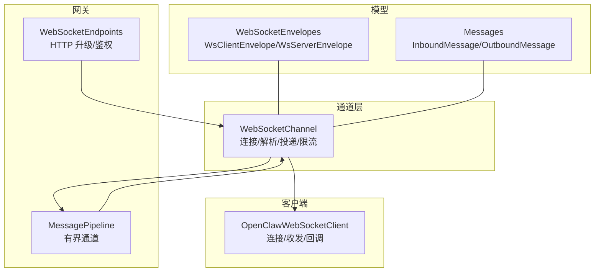
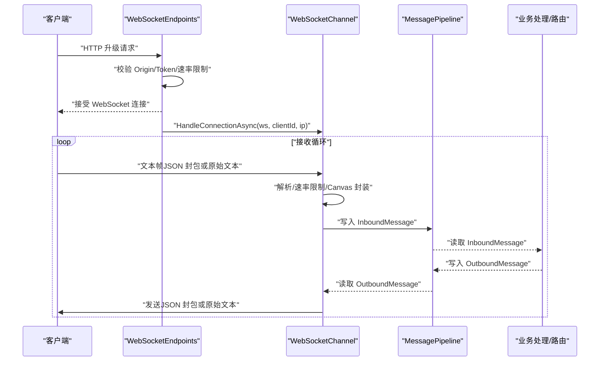
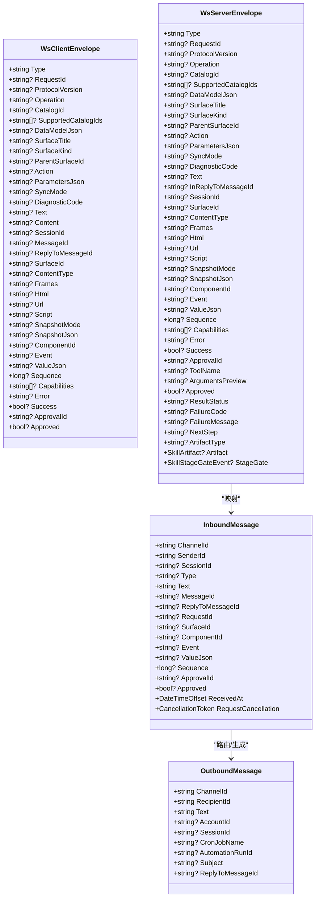
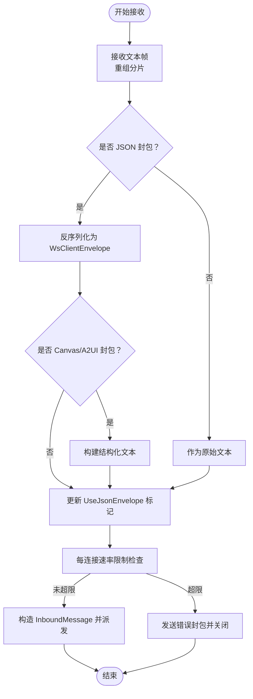
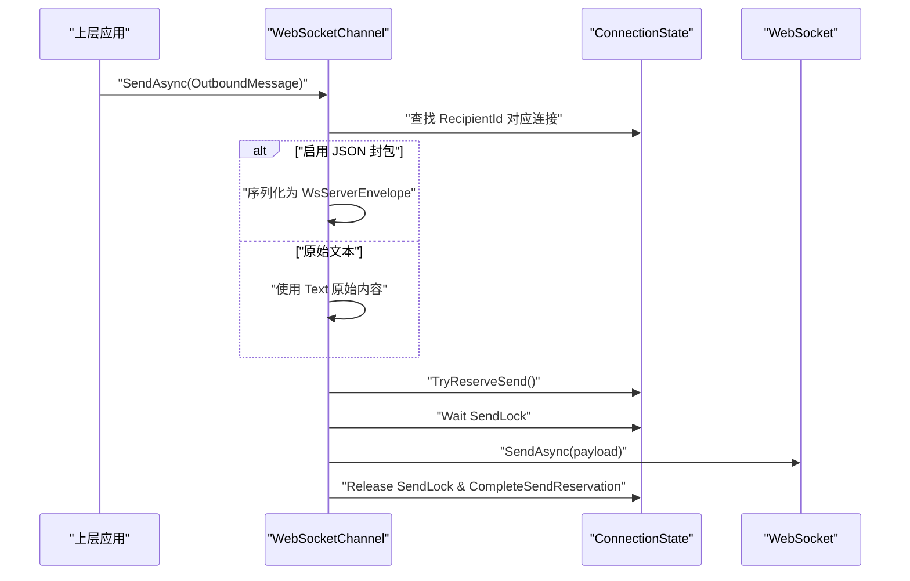
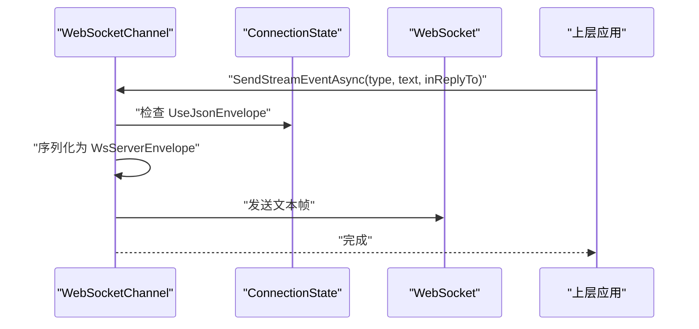
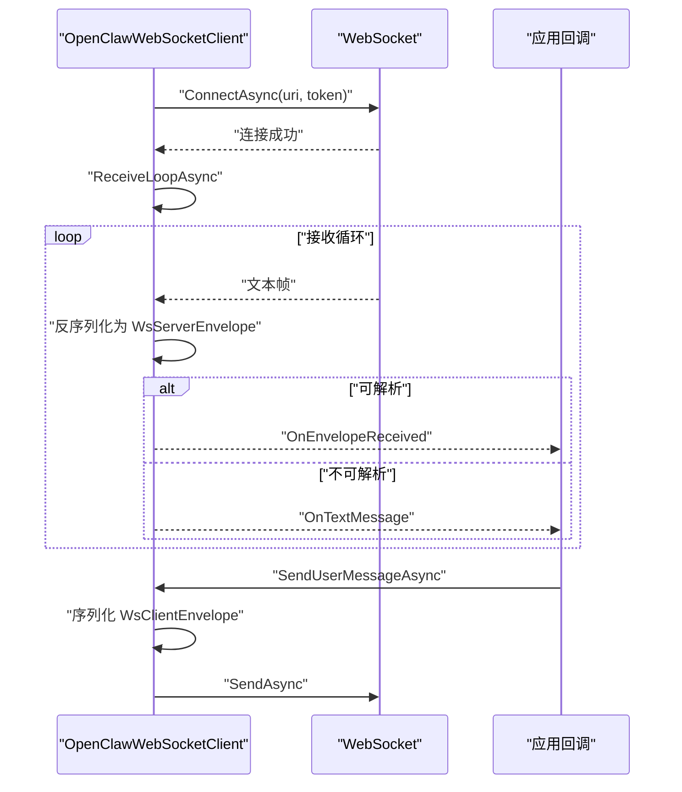
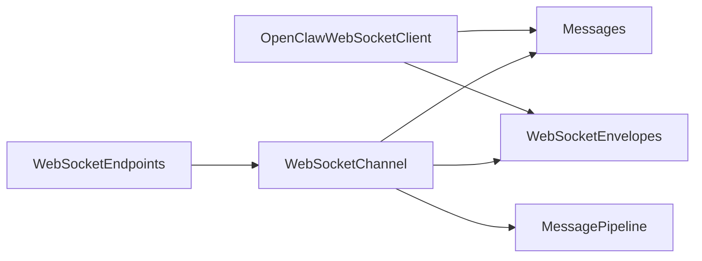

# 消息处理

<cite>
**本文引用的文件**
- [WebSocketEnvelopes.cs](file://src/OpenClaw.Core/Models/WebSocketEnvelopes.cs)
- [Messages.cs](file://src/OpenClaw.Core/Models/Messages.cs)
- [WebSocketChannel.cs](file://src/OpenClaw.Channels/WebSocketChannel.cs)
- [OpenClawWebSocketClient.cs](file://src/OpenClaw.Client/OpenClawWebSocketClient.cs)
- [WebSocketEndpoints.cs](file://src/OpenClaw.Gateway/Endpoints/WebSocketEndpoints.cs)
- [MessagePipeline.cs](file://src/OpenClaw.Core/Pipeline/MessagePipeline.cs)
- [WebSocketChannelTests.cs](file://src/OpenClaw.Tests/WebSocketChannelTests.cs)
- [OpenClawWebSocketClientTests.cs](file://src/OpenClaw.Tests/OpenClawWebSocketClientTests.cs)
- [webchat.js](file://src/OpenClaw.Gateway/wwwroot/webchat.js)
</cite>

## 目录
1. [简介](#简介)
2. [项目结构](#项目结构)
3. [核心组件](#核心组件)
4. [架构总览](#架构总览)
5. [详细组件分析](#详细组件分析)
6. [依赖关系分析](#依赖关系分析)
7. [性能考量](#性能考量)
8. [故障排查指南](#故障排查指南)
9. [结论](#结论)
10. [附录](#附录)

## 简介
本文件面向 WebSocket 消息处理系统，提供从协议规范、消息类型与序列化、到入站处理、出站投递与路由策略的完整技术文档。内容覆盖：
- 消息格式规范与 JSON 封装体（客户端/服务端）
- 入站消息解析与 Canvas 交互封装
- 出站消息投递与流式事件发送
- 消息路由策略与速率限制
- 错误处理、重试机制与连接生命周期管理
- 调试工具与性能监控建议

## 项目结构
WebSocket 消息处理涉及以下关键模块：
- 协议模型：定义客户端/服务端封包结构
- 通道适配器：负责连接接入、消息收发、速率控制与路由
- 客户端：兼容原始文本与 JSON 封包的双向通信
- 网关端点：HTTP 到 WebSocket 的升级与安全校验
- 管道：高吞吐、有界缓冲的消息通道
- 测试：覆盖路由、速率限制、Canvas 交互、流式事件等场景

图表来源
- [WebSocketEndpoints.cs:13-61](file://src/OpenClaw.Gateway/Endpoints/WebSocketEndpoints.cs#L13-L61)
- [WebSocketChannel.cs:16-75](file://src/OpenClaw.Channels/WebSocketChannel.cs#L16-L75)
- [MessagePipeline.cs:11-28](file://src/OpenClaw.Core/Pipeline/MessagePipeline.cs#L11-L28)
- [OpenClawWebSocketClient.cs:9-37](file://src/OpenClaw.Client/OpenClawWebSocketClient.cs#L9-L37)
- [WebSocketEnvelopes.cs:7-108](file://src/OpenClaw.Core/Models/WebSocketEnvelopes.cs#L7-L108)
- [Messages.cs:6-61](file://src/OpenClaw.Core/Models/Messages.cs#L6-L61)

章节来源
- [WebSocketEndpoints.cs:13-61](file://src/OpenClaw.Gateway/Endpoints/WebSocketEndpoints.cs#L13-L61)
- [WebSocketChannel.cs:16-75](file://src/OpenClaw.Channels/WebSocketChannel.cs#L16-L75)
- [MessagePipeline.cs:11-28](file://src/OpenClaw.Core/Pipeline/MessagePipeline.cs#L11-L28)
- [OpenClawWebSocketClient.cs:9-37](file://src/OpenClaw.Client/OpenClawWebSocketClient.cs#L9-L37)
- [WebSocketEnvelopes.cs:7-108](file://src/OpenClaw.Core/Models/WebSocketEnvelopes.cs#L7-L108)
- [Messages.cs:6-61](file://src/OpenClaw.Core/Models/Messages.cs#L6-L61)

## 核心组件
- WebSocketEnvelopes：定义客户端（WsClientEnvelope）与服务端（WsServerEnvelope）封包字段，支持 Canvas/A2UI 交互、工具审批、流式事件等扩展字段。
- WebSocketChannel：实现连接接入、消息解析、按会话/客户端路由、速率限制、流式事件发送与错误封包。
- OpenClawWebSocketClient：客户端连接、收发循环、回调分发、异常隔离。
- WebSocketEndpoints：HTTP 升级为 WebSocket，Origin/Token 校验与速率限制。
- MessagePipeline：基于 System.Threading.Channels 的有界通道，用于入站/出站消息背压。
- Messages：通用入站/出站消息载体，承载路由所需标识。

章节来源
- [WebSocketEnvelopes.cs:7-108](file://src/OpenClaw.Core/Models/WebSocketEnvelopes.cs#L7-L108)
- [WebSocketChannel.cs:16-75](file://src/OpenClaw.Channels/WebSocketChannel.cs#L16-L75)
- [OpenClawWebSocketClient.cs:9-37](file://src/OpenClaw.Client/OpenClawWebSocketClient.cs#L9-L37)
- [WebSocketEndpoints.cs:13-61](file://src/OpenClaw.Gateway/Endpoints/WebSocketEndpoints.cs#L13-L61)
- [MessagePipeline.cs:11-28](file://src/OpenClaw.Core/Pipeline/MessagePipeline.cs#L11-L28)
- [Messages.cs:6-61](file://src/OpenClaw.Core/Models/Messages.cs#L6-L61)

## 架构总览
WebSocket 控制面以 Kestrel 作为监听器，通过网关端点完成握手与鉴权后交由通道适配器处理。通道适配器将入站消息转为通用 InboundMessage 并触发事件；出站消息根据目标客户端选择封包格式并投递。

图表来源
- [WebSocketEndpoints.cs:18-26](file://src/OpenClaw.Gateway/Endpoints/WebSocketEndpoints.cs#L18-L26)
- [WebSocketChannel.cs:76-151](file://src/OpenClaw.Channels/WebSocketChannel.cs#L76-L151)
- [MessagePipeline.cs:30-33](file://src/OpenClaw.Core/Pipeline/MessagePipeline.cs#L30-L33)

## 详细组件分析

### 协议与消息模型
- 客户端封包（WsClientEnvelope）：包含消息类型、会话/消息 ID、文本/内容、Canvas 字段、工具审批决策等。
- 服务端封包（WsServerEnvelope）：包含消息类型、回复引用、流式事件、工具执行结果、错误封包等。
- 通用消息（InboundMessage/OutboundMessage）：统一承载路由与业务处理所需的标识字段。

图表来源
- [WebSocketEnvelopes.cs:7-108](file://src/OpenClaw.Core/Models/WebSocketEnvelopes.cs#L7-L108)
- [Messages.cs:6-61](file://src/OpenClaw.Core/Models/Messages.cs#L6-L61)

章节来源
- [WebSocketEnvelopes.cs:7-108](file://src/OpenClaw.Core/Models/WebSocketEnvelopes.cs#L7-L108)
- [Messages.cs:6-61](file://src/OpenClaw.Core/Models/Messages.cs#L6-L61)

### 入站消息处理流程
- 连接接入：网关端点完成鉴权与速率限制后，将 WebSocket 交给通道适配器。
- 接收与重组：按帧接收文本，支持分片消息重组，超长消息直接关闭。
- 解析与判定：尝试解析为客户端封包；若首字符非 { 则视为原始文本；识别 Canvas/A2UI 封包并转换为结构化文本。
- 速率限制：每连接每分钟窗口计数，超限则发送错误封包并关闭连接。
- 事件派发：将解析后的 InboundMessage 通过事件通知上层处理。

图表来源
- [WebSocketChannel.cs:76-151](file://src/OpenClaw.Channels/WebSocketChannel.cs#L76-L151)
- [WebSocketChannel.cs:523-581](file://src/OpenClaw.Channels/WebSocketChannel.cs#L523-L581)
- [WebSocketChannel.cs:435-510](file://src/OpenClaw.Channels/WebSocketChannel.cs#L435-L510)

章节来源
- [WebSocketChannel.cs:76-151](file://src/OpenClaw.Channels/WebSocketChannel.cs#L76-L151)
- [WebSocketChannel.cs:523-581](file://src/OpenClaw.Channels/WebSocketChannel.cs#L523-L581)
- [WebSocketChannel.cs:435-510](file://src/OpenClaw.Channels/WebSocketChannel.cs#L435-L510)

### 出站消息投递机制
- 路由策略：按 RecipientId 查找连接状态，确保发送锁与连接有效性。
- 封包选择：若客户端启用 JSON 封包，则发送 WsServerEnvelope；否则发送原始文本。
- 发送顺序：使用信号量保证单连接串行发送，避免交错帧。
- 异常处理：忽略对象已释放/WebSocket 异常/无效操作异常，防止发送线程崩溃。

图表来源
- [WebSocketChannel.cs:153-170](file://src/OpenClaw.Channels/WebSocketChannel.cs#L153-L170)
- [WebSocketChannel.cs:192-232](file://src/OpenClaw.Channels/WebSocketChannel.cs#L192-L232)

章节来源
- [WebSocketChannel.cs:153-170](file://src/OpenClaw.Channels/WebSocketChannel.cs#L153-L170)
- [WebSocketChannel.cs:192-232](file://src/OpenClaw.Channels/WebSocketChannel.cs#L192-L232)

### 流式事件与 Canvas 交互
- 流式事件：仅对启用 JSON 封包的客户端开放，支持发送多种类型事件（如打字开始、工具执行状态等）。
- Canvas/A2UI：识别特定类型封包，构建结构化文本以便上层会话消息处理；部分交互封包不转化为用户消息，仅触发 Canvas 回调。

图表来源
- [WebSocketChannel.cs:247-296](file://src/OpenClaw.Channels/WebSocketChannel.cs#L247-L296)

章节来源
- [WebSocketChannel.cs:247-296](file://src/OpenClaw.Channels/WebSocketChannel.cs#L247-L296)
- [WebSocketChannel.cs:583-593](file://src/OpenClaw.Channels/WebSocketChannel.cs#L583-L593)

### 客户端序列化与收发
- 客户端连接：建立 WebSocket 后启动接收循环，按帧读取并重组，支持最大消息长度限制。
- 反序列化：优先尝试解析为服务端封包；失败则回退为原始文本。
- 发送：序列化客户端封包，进行大小校验后发送；发送过程互斥，断开时等待在途发送完成。

图表来源
- [OpenClawWebSocketClient.cs:38-57](file://src/OpenClaw.Client/OpenClawWebSocketClient.cs#L38-L57)
- [OpenClawWebSocketClient.cs:158-227](file://src/OpenClaw.Client/OpenClawWebSocketClient.cs#L158-L227)
- [OpenClawWebSocketClient.cs:119-156](file://src/OpenClaw.Client/OpenClawWebSocketClient.cs#L119-L156)

章节来源
- [OpenClawWebSocketClient.cs:38-57](file://src/OpenClaw.Client/OpenClawWebSocketClient.cs#L38-L57)
- [OpenClawWebSocketClient.cs:158-227](file://src/OpenClaw.Client/OpenClawWebSocketClient.cs#L158-L227)
- [OpenClawWebSocketClient.cs:119-156](file://src/OpenClaw.Client/OpenClawWebSocketClient.cs#L119-L156)

### 网关端点与安全校验
- HTTP 升级：仅接受 WebSocket 请求，校验 Origin 与 Token，非本地绑定时要求授权令牌。
- 速率限制：按 IP 与端点桶进行消费，超限返回 429。
- 异常处理：捕获异常并发送错误封包，最后正常关闭。

章节来源
- [WebSocketEndpoints.cs:18-61](file://src/OpenClaw.Gateway/Endpoints/WebSocketEndpoints.cs#L18-L61)
- [WebSocketEndpoints.cs:63-94](file://src/OpenClaw.Gateway/Endpoints/WebSocketEndpoints.cs#L63-L94)
- [WebSocketEndpoints.cs:151-190](file://src/OpenClaw.Gateway/Endpoints/WebSocketEndpoints.cs#L151-L190)

### 消息路由策略
- 通道适配器：按 RecipientId 路由至具体连接；Canvas/A2UI 交互封包可独立触发回调而不转为用户消息。
- 管道：入站/出站通道采用有界缓冲与等待模式，防止内存压力；关闭时丢弃剩余消息并记录警告日志。

章节来源
- [WebSocketChannel.cs:153-170](file://src/OpenClaw.Channels/WebSocketChannel.cs#L153-L170)
- [WebSocketChannel.cs:583-593](file://src/OpenClaw.Channels/WebSocketChannel.cs#L583-L593)
- [MessagePipeline.cs:17-28](file://src/OpenClaw.Core/Pipeline/MessagePipeline.cs#L17-L28)
- [MessagePipeline.cs:46-54](file://src/OpenClaw.Core/Pipeline/MessagePipeline.cs#L46-L54)

### 错误处理、重试与确认
- 错误处理：接收/发送异常被吞并或转换为错误封包；速率超限发送错误封包并关闭连接；接收超时主动关闭。
- 重试机制：未在通道适配器中实现自动重试；客户端断开时等待在途发送完成，避免资源泄漏。
- 确认与会话：支持 MessageId/ReplyToMessageId/SurfaceId/Sequence 等字段，便于端到端确认与状态同步。

章节来源
- [WebSocketChannel.cs:435-510](file://src/OpenClaw.Channels/WebSocketChannel.cs#L435-L510)
- [WebSocketChannel.cs:96-112](file://src/OpenClaw.Channels/WebSocketChannel.cs#L96-L112)
- [OpenClawWebSocketClient.cs:59-117](file://src/OpenClaw.Client/OpenClawWebSocketClient.cs#L59-L117)

## 依赖关系分析
- 组件耦合：通道适配器依赖模型与 JSON 上下文；网关端点依赖通道适配器与安全策略；客户端独立于通道适配器但共享模型。
- 外部依赖：System.Net.WebSockets、System.Text.Json、System.Threading.Channels。
- 潜在环路：无直接循环依赖；消息通过管道解耦。

图表来源
- [WebSocketEndpoints.cs:13-61](file://src/OpenClaw.Gateway/Endpoints/WebSocketEndpoints.cs#L13-L61)
- [WebSocketChannel.cs:16-75](file://src/OpenClaw.Channels/WebSocketChannel.cs#L16-L75)
- [OpenClawWebSocketClient.cs:9-37](file://src/OpenClaw.Client/OpenClawWebSocketClient.cs#L9-L37)
- [MessagePipeline.cs:11-28](file://src/OpenClaw.Core/Pipeline/MessagePipeline.cs#L11-L28)
- [WebSocketEnvelopes.cs:7-108](file://src/OpenClaw.Core/Models/WebSocketEnvelopes.cs#L7-L108)
- [Messages.cs:6-61](file://src/OpenClaw.Core/Models/Messages.cs#L6-L61)

## 性能考量
- 内存与缓冲：接收/发送使用数组池与缓冲写入器，避免频繁分配；最大消息长度限制防止内存压力。
- 速率限制：每连接每分钟滑动窗口计数，超限即刻拒绝新消息并发送错误封包。
- 通道背压：有界通道在高负载下自动阻塞写入，避免 OOM。
- 序列化：使用强类型上下文进行高性能 JSON 序列化/反序列化。

章节来源
- [WebSocketChannel.cs:435-510](file://src/OpenClaw.Channels/WebSocketChannel.cs#L435-L510)
- [WebSocketChannel.cs:41-65](file://src/OpenClaw.Channels/WebSocketChannel.cs#L41-L65)
- [MessagePipeline.cs:17-28](file://src/OpenClaw.Core/Pipeline/MessagePipeline.cs#L17-L28)

## 故障排查指南
- 断开后仍在发送：客户端在断开时等待在途发送完成，确保互斥锁释放。
- Canvas/A2UI 不触发用户消息：特定交互封包仅触发 Canvas 回调，不转化为用户消息。
- 速率超限：客户端收到错误封包并被关闭；检查每连接速率限制配置。
- 接收超时：长时间无消息导致超时关闭；调整接收超时参数。
- 测试验证：通过单元测试覆盖路由、Canvas 交互、速率限制、流式事件等场景。

章节来源
- [OpenClawWebSocketClientTests.cs:8-26](file://src/OpenClaw.Tests/OpenClawWebSocketClientTests.cs#L8-L26)
- [WebSocketChannelTests.cs:185-244](file://src/OpenClaw.Tests/WebSocketChannelTests.cs#L185-L244)
- [WebSocketChannelTests.cs:389-417](file://src/OpenClaw.Tests/WebSocketChannelTests.cs#L389-L417)
- [WebSocketChannelTests.cs:420-433](file://src/OpenClaw.Tests/WebSocketChannelTests.cs#L420-L433)

## 结论
该 WebSocket 消息处理系统以“原始文本 + JSON 封包”双模态并存，结合 Canvas/A2UI 专用封包与严格的速率限制，实现了稳定可控的双向通信。通道适配器承担解析、路由与投递职责，配合有界通道与客户端互斥发送，兼顾性能与可靠性。建议在生产环境中：
- 明确客户端封包启用策略与 Canvas 交互边界
- 配置合理的速率限制与消息大小上限
- 使用测试用例覆盖关键路径，持续验证稳定性

## 附录

### 消息格式规范与示例
- 客户端封包（WsClientEnvelope）
  - 必填字段：Type
  - 常用字段：Text/Content、SessionId、MessageId、ReplyToMessageId、ApprovalId、Approved
  - Canvas/A2UI 字段：SurfaceId、ComponentId、Event/Action、ValueJson、Sequence、DataModelJson 等
- 服务端封包（WsServerEnvelope）
  - 必填字段：Type
  - 常用字段：Text、InReplyToMessageId、SessionId、SurfaceId、Sequence
  - 工具执行与错误：ToolName、ResultStatus、FailureCode/FailureMessage、NextStep、Error/Success
  - Canvas/A2UI：Components、DataModelJson、SyncMode、DiagnosticCode 等
- 通用消息（InboundMessage/OutboundMessage）
  - InboundMessage：ChannelId、SenderId、SessionId、Type、Text、MessageId、ReplyToMessageId、SurfaceId、ComponentId、Event、ValueJson、Sequence、ApprovalId、Approved
  - OutboundMessage：ChannelId、RecipientId、Text、ReplyToMessageId、SessionId

章节来源
- [WebSocketEnvelopes.cs:7-108](file://src/OpenClaw.Core/Models/WebSocketEnvelopes.cs#L7-L108)
- [Messages.cs:6-61](file://src/OpenClaw.Core/Models/Messages.cs#L6-L61)

### 调试工具与前端示例
- 前端示例：webchat.js 展示了如何连接 WebSocket、处理不同类型的封包（如打字开始）、维护连接状态与视图模式。
- 建议：在浏览器控制台观察封包类型与键值，定位 Canvas/A2UI 交互问题；利用 OnError 回调捕获客户端异常。

章节来源
- [webchat.js:828-861](file://src/OpenClaw.Gateway/wwwroot/webchat.js#L828-L861)