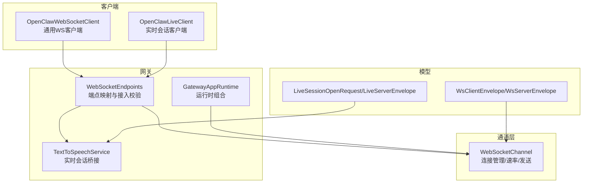
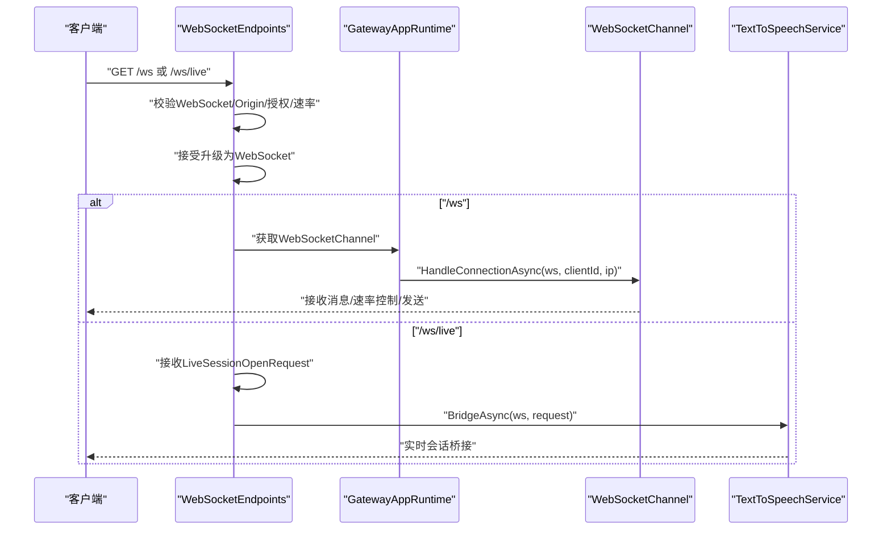
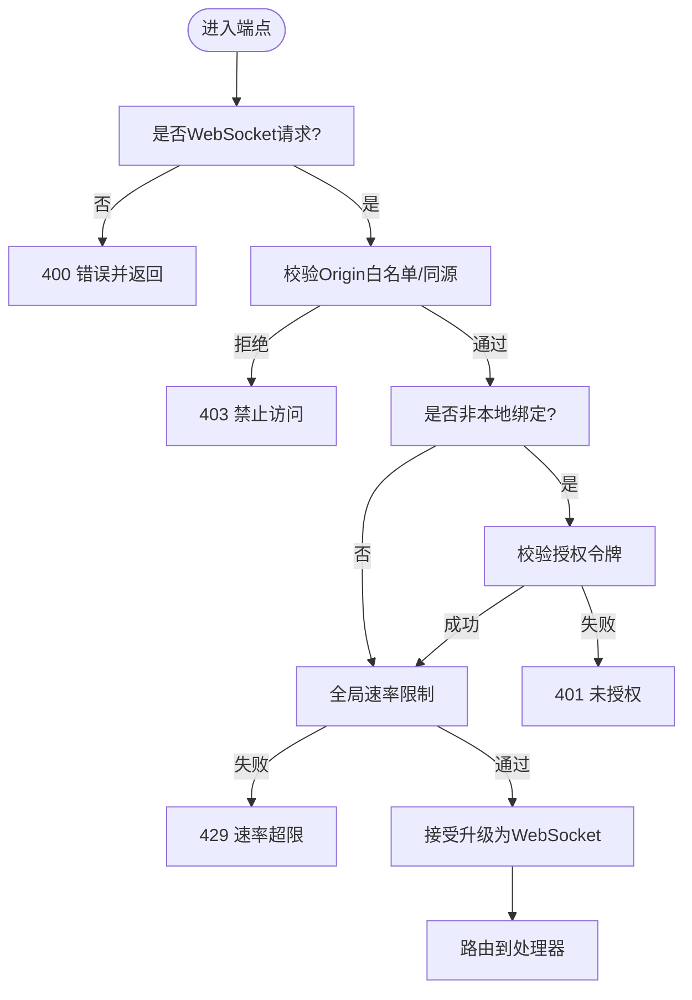
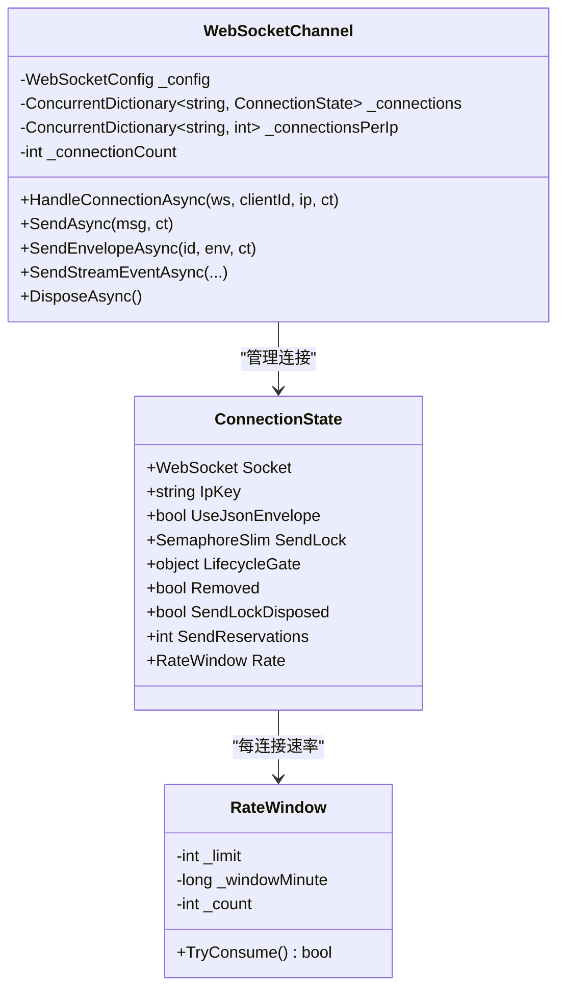
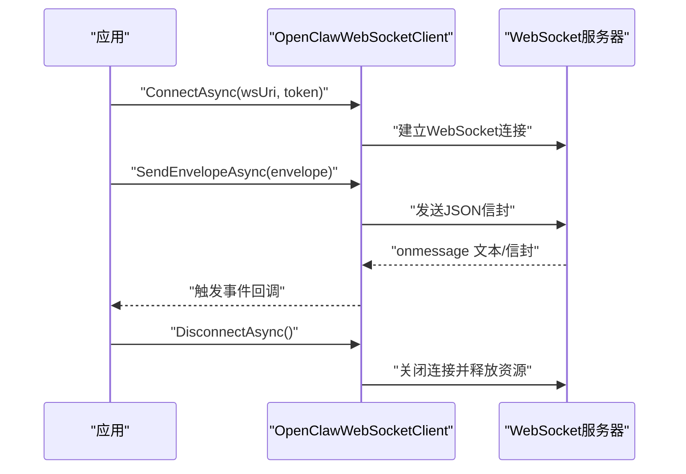
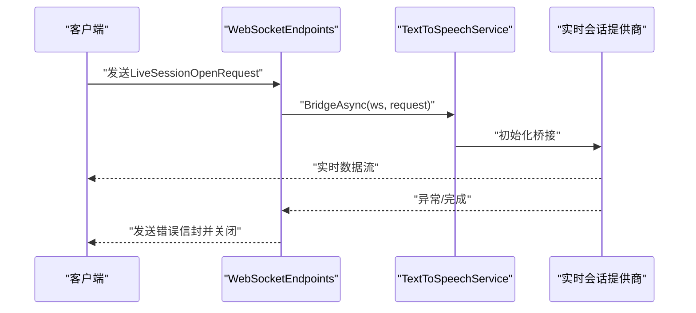
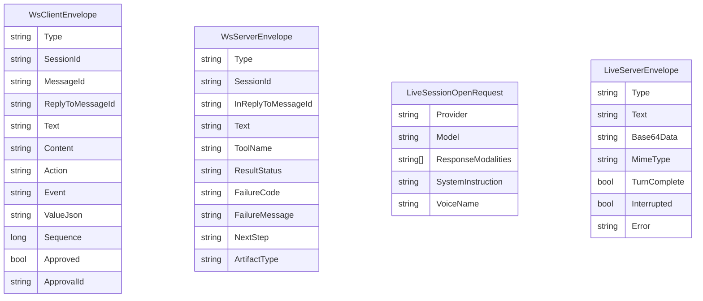
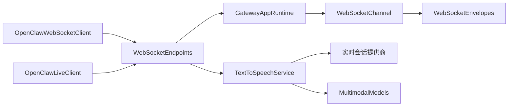
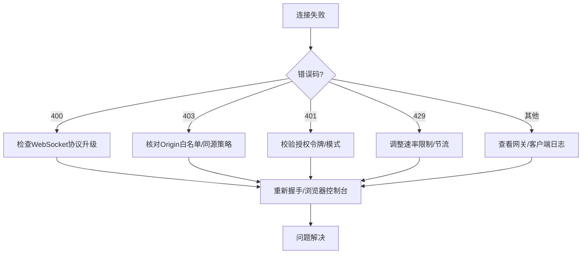

# 连接管理

<cite>
**本文引用的文件**
- [WebSocketEndpoints.cs](file://src/OpenClaw.Gateway/Endpoints/WebSocketEndpoints.cs)
- [WebSocketChannel.cs](file://src/OpenClaw.Channels/WebSocketChannel.cs)
- [WebSocketEnvelopes.cs](file://src/OpenClaw.Core/Models/WebSocketEnvelopes.cs)
- [OpenClawWebSocketClient.cs](file://src/OpenClaw.Client/OpenClawWebSocketClient.cs)
- [OpenClawLiveClient.cs](file://src/OpenClaw.Client/OpenClawLiveClient.cs)
- [GatewayAppRuntime.cs](file://src/OpenClaw.Gateway/Composition/GatewayAppRuntime.cs)
- [Program.cs](file://src/OpenClaw.Gateway/Program.cs)
- [MultimodalModels.cs](file://src/OpenClaw.Core/Models/MultimodalModels.cs)
- [TextToSpeechService.cs](file://src/OpenClaw.Gateway/TextToSpeechService.cs)
- [webchat.js](file://src/OpenClaw.Gateway/wwwroot/webchat.js)
- [ManagedGatewayService.cs](file://src/OpenClaw.Companion/Services/ManagedGatewayService.cs)
- [WebSocketChannelTests.cs](file://src/OpenClaw.Tests/WebSocketChannelTests.cs)
</cite>

## 目录
1. [简介](#简介)
2. [项目结构](#项目结构)
3. [核心组件](#核心组件)
4. [架构总览](#架构总览)
5. [详细组件分析](#详细组件分析)
6. [依赖关系分析](#依赖关系分析)
7. [性能考量](#性能考量)
8. [故障排查指南](#故障排查指南)
9. [结论](#结论)
10. [附录](#附录)

## 简介
本文件面向 WebSocket 连接管理系统，系统性阐述连接建立流程、身份验证与安全校验、速率限制与安全策略、以及 /ws 与 /ws/live 两个端点的用途与实现差异。文档还覆盖连接生命周期管理、异常处理、超时机制与资源清理策略，并提供连接状态监控、故障诊断与性能优化的方法。

## 项目结构
围绕 WebSocket 的关键模块分布如下：
- 网关端点：负责请求接入、安全校验与会话桥接
- 通道适配器：负责连接管理、消息解析、速率控制与发送
- 客户端封装：提供通用 WebSocket 客户端与“实时会话”客户端
- 模型定义：统一客户端与服务端的 WebSocket 信封格式
- 运行时组合：装配网关运行期所需的服务与通道
- 多模态服务：为 /ws/live 提供实时会话桥接能力

**图表来源**
- [WebSocketEndpoints.cs:13-61](file://src/OpenClaw.Gateway/Endpoints/WebSocketEndpoints.cs#L13-L61)
- [GatewayAppRuntime.cs:21-63](file://src/OpenClaw.Gateway/Composition/GatewayAppRuntime.cs#L21-L63)
- [TextToSpeechService.cs:72-100](file://src/OpenClaw.Gateway/TextToSpeechService.cs#L72-L100)
- [WebSocketChannel.cs:16-74](file://src/OpenClaw.Channels/WebSocketChannel.cs#L16-L74)
- [OpenClawWebSocketClient.cs:9-37](file://src/OpenClaw.Client/OpenClawWebSocketClient.cs#L9-L37)
- [OpenClawLiveClient.cs:49-88](file://src/OpenClaw.Client/OpenClawLiveClient.cs#L49-L88)
- [WebSocketEnvelopes.cs:7-108](file://src/OpenClaw.Core/Models/WebSocketEnvelopes.cs#L7-L108)
- [MultimodalModels.cs:82-117](file://src/OpenClaw.Core/Models/MultimodalModels.cs#L82-L117)

**章节来源**
- [Program.cs:89-96](file://src/OpenClaw.Gateway/Program.cs#L89-L96)
- [WebSocketEndpoints.cs:13-61](file://src/OpenClaw.Gateway/Endpoints/WebSocketEndpoints.cs#L13-L61)

## 核心组件
- 网关端点与接入校验：负责 /ws 与 /ws/live 的映射、请求合法性检查（WebSocket 协议、Origin 白名单、非本地绑定时的授权令牌）、速率限制（ActorRateLimits）。
- 通道适配器：维护连接字典、按 IP 限流、每连接速率窗口、消息接收缓冲与超时、JSON 信封解析与事件派发、发送锁与并发安全。
- 客户端封装：通用客户端支持文本与 JSON 信封；实时会话客户端负责发送打开请求并启动接收循环。
- 模型定义：统一客户端与服务端的 JSON 信封字段，支持工具审批、画布交互、多模态实时会话等。
- 运行时组合：装配 WebSocketChannel、中间件、会话管理、安全策略等。
- 多模态服务：根据请求选择实时会话提供商并进行桥接。

**章节来源**
- [WebSocketEndpoints.cs:63-149](file://src/OpenClaw.Gateway/Endpoints/WebSocketEndpoints.cs#L63-L149)
- [WebSocketChannel.cs:16-74](file://src/OpenClaw.Channels/WebSocketChannel.cs#L16-L74)
- [OpenClawWebSocketClient.cs:9-37](file://src/OpenClaw.Client/OpenClawWebSocketClient.cs#L9-L37)
- [OpenClawLiveClient.cs:49-88](file://src/OpenClaw.Client/OpenClawLiveClient.cs#L49-L88)
- [WebSocketEnvelopes.cs:7-108](file://src/OpenClaw.Core/Models/WebSocketEnvelopes.cs#L7-L108)
- [GatewayAppRuntime.cs:21-63](file://src/OpenClaw.Gateway/Composition/GatewayAppRuntime.cs#L21-L63)
- [TextToSpeechService.cs:72-100](file://src/OpenClaw.Gateway/TextToSpeechService.cs#L72-L100)

## 架构总览
下图展示从客户端到服务端的关键交互路径与职责分工：

**图表来源**
- [WebSocketEndpoints.cs:18-60](file://src/OpenClaw.Gateway/Endpoints/WebSocketEndpoints.cs#L18-L60)
- [GatewayAppRuntime.cs:27-28](file://src/OpenClaw.Gateway/Composition/GatewayAppRuntime.cs#L27-L28)
- [WebSocketChannel.cs:76-151](file://src/OpenClaw.Channels/WebSocketChannel.cs#L76-L151)
- [TextToSpeechService.cs:82-96](file://src/OpenClaw.Gateway/TextToSpeechService.cs#L82-L96)

## 详细组件分析

### 端点与接入校验（/ws 与 /ws/live）
- /ws：通用聊天通道，用于文本消息与 JSON 信封消息。接入前执行：
  - 必须是 WebSocket 请求
  - Origin 校验（白名单或同源同端口）
  - 非本地绑定时要求有效授权令牌（支持引导令牌与账户令牌）
  - 全局速率限制（按 IP 与桶标识）
- /ws/live：实时会话通道，先接收一次文本负载（LiveSessionOpenRequest），再由实时会话服务桥接到指定提供商。异常时返回错误信封并关闭连接。

**图表来源**
- [WebSocketEndpoints.cs:63-149](file://src/OpenClaw.Gateway/Endpoints/WebSocketEndpoints.cs#L63-L149)

**章节来源**
- [/ws 映射与处理:18-26](file://src/OpenClaw.Gateway/Endpoints/WebSocketEndpoints.cs#L18-L26)
- [/ws/live 映射与处理:28-60](file://src/OpenClaw.Gateway/Endpoints/WebSocketEndpoints.cs#L28-L60)
- [授权令牌校验逻辑:96-118](file://src/OpenClaw.Gateway/Endpoints/WebSocketEndpoints.cs#L96-L118)
- [Origin 校验逻辑:120-149](file://src/OpenClaw.Gateway/Endpoints/WebSocketEndpoints.cs#L120-L149)

### 通道适配器（WebSocketChannel）
- 连接管理
  - 使用并发字典维护 clientId 到连接状态的映射
  - 维护每 IP 连接计数，防止滥用
  - 总连接数上限保护
- 速率控制
  - 每连接分钟级速率窗口（基于时间片累加计数）
  - 超限时发送错误信封并关闭连接
- 消息处理
  - 接收完整文本消息，支持超时与长度限制
  - 解析 JSON 信封，识别画布交互与工具审批决策
  - 对使用 JSON 信封的客户端支持流式事件发送
- 发送与并发
  - 发送使用信号量锁，避免并发写入
  - 发送预留与生命周期门控，确保在移除连接时安全释放
- 生命周期与清理
  - 正常关闭与异常关闭均尝试关闭并释放资源
  - 关闭时清理连接计数与每 IP 计数

**图表来源**
- [WebSocketChannel.cs:16-74](file://src/OpenClaw.Channels/WebSocketChannel.cs#L16-L74)
- [WebSocketChannel.cs:23-65](file://src/OpenClaw.Channels/WebSocketChannel.cs#L23-L65)

**章节来源**
- [连接添加与限流:334-370](file://src/OpenClaw.Channels/WebSocketChannel.cs#L334-L370)
- [速率窗口实现:41-65](file://src/OpenClaw.Channels/WebSocketChannel.cs#L41-L65)
- [消息接收与超时处理:435-510](file://src/OpenClaw.Channels/WebSocketChannel.cs#L435-L510)
- [发送与并发控制:192-232](file://src/OpenClaw.Channels/WebSocketChannel.cs#L192-L232)
- [连接移除与资源清理:372-433](file://src/OpenClaw.Channels/WebSocketChannel.cs#L372-L433)

### 客户端封装
- 通用 WebSocket 客户端
  - 支持连接/断开、发送 JSON 信封、接收文本与信封事件
  - 发送使用互斥锁，断开时清理资源并等待接收循环退出
- 实时会话客户端
  - 自动构建 /ws/live 的 URI（ws/wss）
  - 连接后发送 LiveSessionOpenRequest，启动接收循环

**图表来源**
- [OpenClawWebSocketClient.cs:38-117](file://src/OpenClaw.Client/OpenClawWebSocketClient.cs#L38-L117)
- [OpenClawWebSocketClient.cs:158-227](file://src/OpenClaw.Client/OpenClawWebSocketClient.cs#L158-L227)

**章节来源**
- [通用客户端连接与断开:38-117](file://src/OpenClaw.Client/OpenClawWebSocketClient.cs#L38-L117)
- [通用客户端消息收发:158-227](file://src/OpenClaw.Client/OpenClawWebSocketClient.cs#L158-L227)
- [实时会话客户端 URI 构建:49-58](file://src/OpenClaw.Client/OpenClawLiveClient.cs#L49-L58)
- [实时会话客户端连接与发送:60-87](file://src/OpenClaw.Client/OpenClawLiveClient.cs#L60-L87)

### 实时会话桥接（/ws/live）
- 客户端发送一次文本作为打开请求（LiveSessionOpenRequest）
- 网关侧解析请求并调用实时会话服务
- 服务根据配置选择提供商并桥接双向流
- 异常时向客户端发送错误信封并关闭连接

**图表来源**
- [WebSocketEndpoints.cs:34-59](file://src/OpenClaw.Gateway/Endpoints/WebSocketEndpoints.cs#L34-L59)
- [TextToSpeechService.cs:82-96](file://src/OpenClaw.Gateway/TextToSpeechService.cs#L82-L96)
- [MultimodalModels.cs:82-117](file://src/OpenClaw.Core/Models/MultimodalModels.cs#L82-L117)

**章节来源**
- [接收打开请求:151-159](file://src/OpenClaw.Gateway/Endpoints/WebSocketEndpoints.cs#L151-L159)
- [实时会话桥接入口:37-38](file://src/OpenClaw.Gateway/Endpoints/WebSocketEndpoints.cs#L37-L38)
- [实时会话服务实现:82-96](file://src/OpenClaw.Gateway/TextToSpeechService.cs#L82-L96)
- [实时会话模型:82-117](file://src/OpenClaw.Core/Models/MultimodalModels.cs#L82-L117)

### 信封模型与协议
- 客户端信封（WsClientEnvelope）：承载用户消息、画布交互、工具审批等
- 服务器信封（WsServerEnvelope）：承载回复、工具审批状态、阶段门事件等
- 实时会话信封（LiveClientEnvelope/LiveServerEnvelope）：承载多模态文本/媒体数据与中断标记

**图表来源**
- [WebSocketEnvelopes.cs:7-108](file://src/OpenClaw.Core/Models/WebSocketEnvelopes.cs#L7-L108)
- [MultimodalModels.cs:82-117](file://src/OpenClaw.Core/Models/MultimodalModels.cs#L82-L117)

**章节来源**
- [客户端信封定义:7-48](file://src/OpenClaw.Core/Models/WebSocketEnvelopes.cs#L7-L48)
- [服务器信封定义:53-108](file://src/OpenClaw.Core/Models/WebSocketEnvelopes.cs#L53-L108)
- [实时会话请求/响应模型:82-117](file://src/OpenClaw.Core/Models/MultimodalModels.cs#L82-L117)

## 依赖关系分析
- 网关端点依赖运行时组合对象，其中包含 WebSocketChannel
- 通道适配器不直接依赖外部服务，但其行为受运行时配置影响（如最大消息大小、接收超时）
- 客户端封装独立于网关端点，但遵循相同的信封协议
- 实时会话桥接依赖多模态配置与提供商注册表

**图表来源**
- [GatewayAppRuntime.cs:27-28](file://src/OpenClaw.Gateway/Composition/GatewayAppRuntime.cs#L27-L28)
- [WebSocketEndpoints.cs:18-60](file://src/OpenClaw.Gateway/Endpoints/WebSocketEndpoints.cs#L18-L60)
- [TextToSpeechService.cs:72-100](file://src/OpenClaw.Gateway/TextToSpeechService.cs#L72-L100)
- [OpenClawWebSocketClient.cs:38-57](file://src/OpenClaw.Client/OpenClawWebSocketClient.cs#L38-L57)
- [OpenClawLiveClient.cs:60-87](file://src/OpenClaw.Client/OpenClawLiveClient.cs#L60-L87)
- [WebSocketEnvelopes.cs:7-108](file://src/OpenClaw.Core/Models/WebSocketEnvelopes.cs#L7-L108)
- [MultimodalModels.cs:82-117](file://src/OpenClaw.Core/Models/MultimodalModels.cs#L82-L117)

**章节来源**
- [运行时组合:21-63](file://src/OpenClaw.Gateway/Composition/GatewayAppRuntime.cs#L21-L63)
- [端点映射:13-61](file://src/OpenClaw.Gateway/Endpoints/WebSocketEndpoints.cs#L13-L61)

## 性能考量
- 连接与发送并发
  - 使用信号量锁保证发送原子性，避免并发写入导致的帧交错
  - 发送预留与生命周期门控，确保在连接移除时安全释放
- 内存与缓冲
  - 接收使用数组池与内存流，避免频繁分配
  - 文本消息长度限制与 JSON 抽取长度限制，防止内存压力
- 速率控制
  - 每连接分钟级速率窗口，结合全局速率限制，平衡公平性与吞吐
- 超时与健壮性
  - 接收超时自动关闭，避免僵尸连接占用资源
  - 异常捕获与优雅降级，确保系统稳定

**章节来源**
- [发送并发与清理:192-232](file://src/OpenClaw.Channels/WebSocketChannel.cs#L192-L232)
- [接收缓冲与超时:435-510](file://src/OpenClaw.Channels/WebSocketChannel.cs#L435-L510)
- [速率窗口:41-65](file://src/OpenClaw.Channels/WebSocketChannel.cs#L41-L65)
- [客户端发送限制:135-136](file://src/OpenClaw.Client/OpenClawWebSocketClient.cs#L135-L136)

## 故障排查指南
- 常见错误与定位
  - 400：非 WebSocket 请求（检查协议升级）
  - 403：Origin 不被允许（核对前端页面与网关允许列表）
  - 401：未授权（确认令牌类型与配置）
  - 429：速率超限（查看全局与每 IP 速率限制）
  - 连接被关闭：检查接收超时、消息过大、速率超限
- 日志与诊断
  - 网关端点对 /ws/live 失败记录警告日志
  - 客户端断开时清理资源并等待接收循环退出
- 单元测试参考
  - 速率超限关闭连接与错误信封
  - 接收超时关闭连接
  - 并发发送与连接移除的安全性

**图表来源**
- [WebSocketEndpoints.cs:69-93](file://src/OpenClaw.Gateway/Endpoints/WebSocketEndpoints.cs#L69-L93)
- [WebSocketEndpoints.cs:43-58](file://src/OpenClaw.Gateway/Endpoints/WebSocketEndpoints.cs#L43-L58)
- [WebSocketChannelTests.cs:408-433](file://src/OpenClaw.Tests/WebSocketChannelTests.cs#L408-L433)

**章节来源**
- [端点错误处理:69-93](file://src/OpenClaw.Gateway/Endpoints/WebSocketEndpoints.cs#L69-L93)
- [实时会话错误处理:43-48](file://src/OpenClaw.Gateway/Endpoints/WebSocketEndpoints.cs#L43-L48)
- [速率超限测试:408-417](file://src/OpenClaw.Tests/WebSocketChannelTests.cs#L408-L417)
- [接收超时测试:420-433](file://src/OpenClaw.Tests/WebSocketChannelTests.cs#L420-L433)

## 结论
该 WebSocket 连接管理系统以清晰的分层设计实现了高可用、可扩展的实时通信能力。/ws 提供通用聊天通道，/ws/live 提供多模态实时会话桥接。系统通过严格的接入校验、速率限制与超时机制保障稳定性，并以并发安全与资源清理策略确保长期运行的可靠性。配合完善的日志与单元测试，便于快速定位与修复问题。

## 附录
- 前端示例：WebChat UI 通过 /ws 连接并切换到 live 视图
- Companion 应用：自动构建 /ws 与 /ws/live 的 WebSocket 地址
- 运行时启动：程序入口装配端点与中间件，启动监听

**章节来源**
- [WebChat UI 示例:828-861](file://src/OpenClaw.Gateway/wwwroot/webchat.js#L828-L861)
- [Companion 应用地址构建:455-479](file://src/OpenClaw.Companion/Services/ManagedGatewayService.cs#L455-L479)
- [程序入口与端点映射:89-96](file://src/OpenClaw.Gateway/Program.cs#L89-L96)