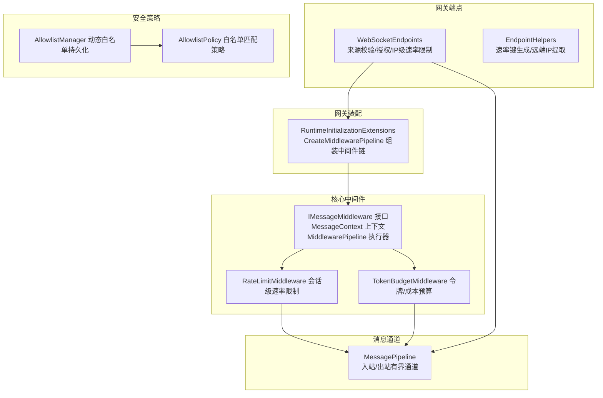
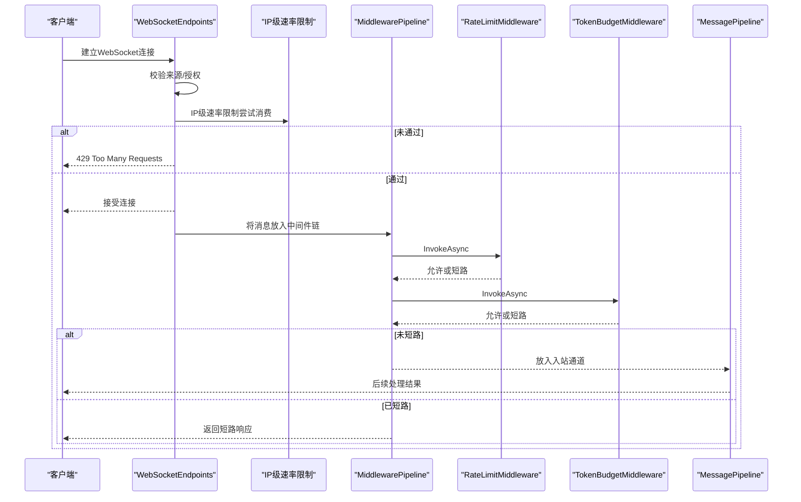
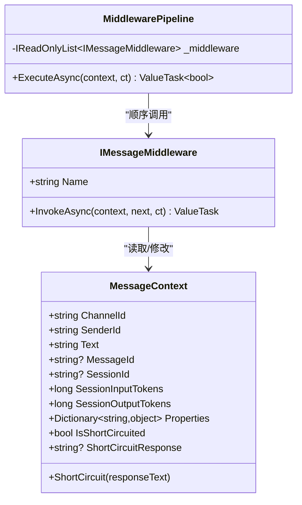
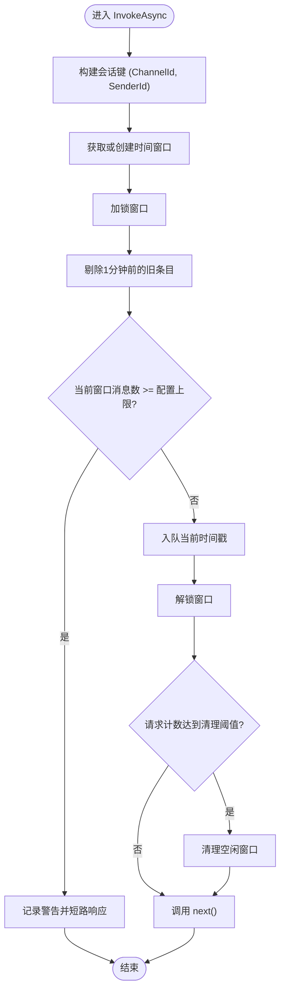
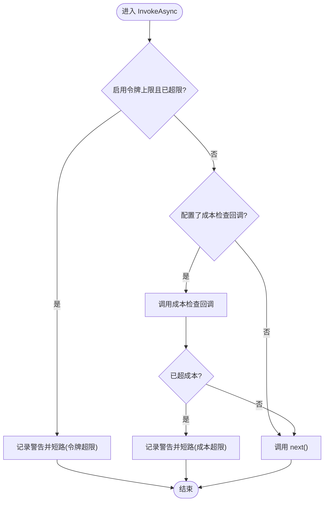
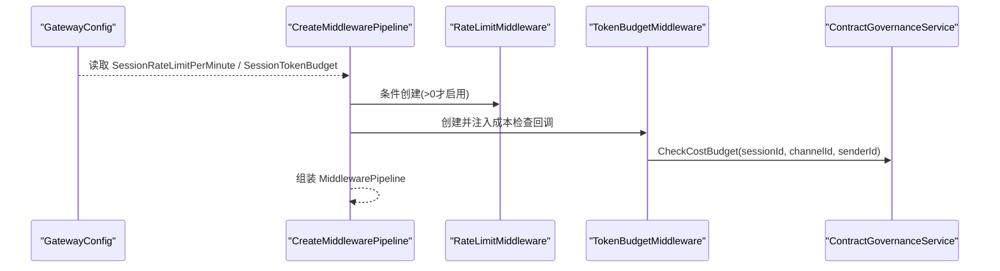
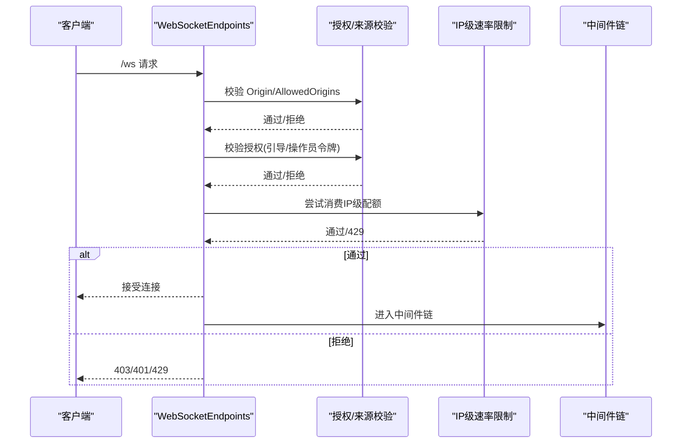
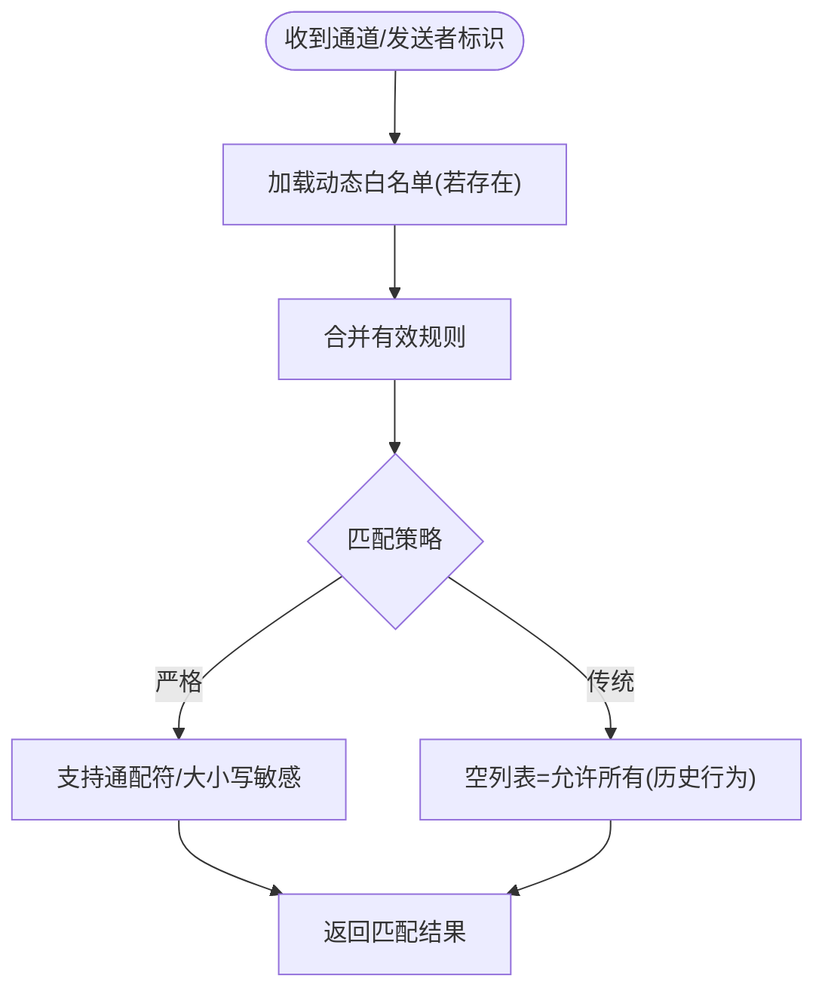
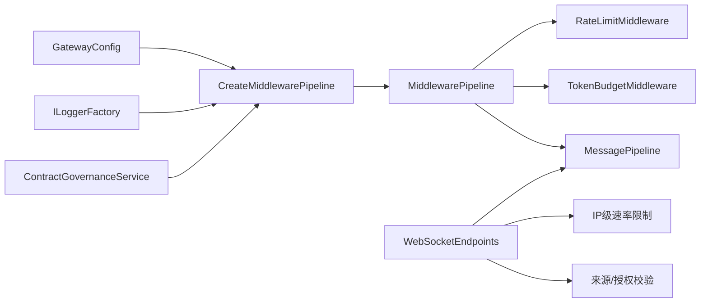

# 中间件管道

<cite>
**本文引用的文件**
- [IMessageMiddleware.cs](file://src/OpenClaw.Core/Middleware/IMessageMiddleware.cs)
- [RateLimitMiddleware.cs](file://src/OpenClaw.Core/Middleware/RateLimitMiddleware.cs)
- [TokenBudgetMiddleware.cs](file://src/OpenClaw.Core/Middleware/TokenBudgetMiddleware.cs)
- [RuntimeInitializationExtensions.RuntimeFactories.cs](file://src/OpenClaw.Gateway/Composition/RuntimeInitializationExtensions.RuntimeFactories.cs)
- [WebSocketEndpoints.cs](file://src/OpenClaw.Gateway/Endpoints/WebSocketEndpoints.cs)
- [EndpointHelpers.cs](file://src/OpenClaw.Gateway/Endpoints/EndpointHelpers.cs)
- [MessagePipeline.cs](file://src/OpenClaw.Core/Pipeline/MessagePipeline.cs)
- [AllowlistManager.cs](file://src/OpenClaw.Core/Security/AllowlistManager.cs)
- [AllowlistPolicy.cs](file://src/OpenClaw.Core/Security/AllowlistPolicy.cs)
- [ContractGovernanceTests.cs](file://src/OpenClaw.Tests/ContractGovernanceTests.cs)
- [BeyondBaseTests.cs](file://src/OpenClaw.Tests/BeyondBaseTests.cs)
</cite>

## 目录
1. [简介](#简介)
2. [项目结构](#项目结构)
3. [核心组件](#核心组件)
4. [架构总览](#架构总览)
5. [组件详解](#组件详解)
6. [依赖关系分析](#依赖关系分析)
7. [性能考量](#性能考量)
8. [故障排查指南](#故障排查指南)
9. [结论](#结论)
10. [附录](#附录)

## 简介
本文件系统性地文档化了网关中间件管道模块，覆盖中间件执行顺序、请求处理流水线、响应处理机制，以及安全中间件、限流中间件、令牌预算中间件的实现原理与配置要点。文档还涵盖中间件链的组合模式、异常处理策略、监控集成、调试方法、与路由系统及身份认证系统的协作关系，并提供中间件开发指南与最佳实践。

## 项目结构
中间件管道位于核心库中，由接口定义、具体中间件实现、以及在网关运行时装配中间件链的工厂方法组成；同时，网关端点在进入业务处理前进行基础校验（如来源校验、授权、速率限制），随后将消息交由中间件管道处理。

**图表来源**
- [IMessageMiddleware.cs:44-96](file://src/OpenClaw.Core/Middleware/IMessageMiddleware.cs#L44-L96)
- [RateLimitMiddleware.cs:10-92](file://src/OpenClaw.Core/Middleware/RateLimitMiddleware.cs#L10-L92)
- [TokenBudgetMiddleware.cs:12-70](file://src/OpenClaw.Core/Middleware/TokenBudgetMiddleware.cs#L12-L70)
- [RuntimeInitializationExtensions.RuntimeFactories.cs:325-344](file://src/OpenClaw.Gateway/Composition/RuntimeInitializationExtensions.RuntimeFactories.cs#L325-L344)
- [WebSocketEndpoints.cs:63-94](file://src/OpenClaw.Gateway/Endpoints/WebSocketEndpoints.cs#L63-L94)
- [EndpointHelpers.cs:145-163](file://src/OpenClaw.Gateway/Endpoints/EndpointHelpers.cs#L145-L163)
- [MessagePipeline.cs:11-55](file://src/OpenClaw.Core/Pipeline/MessagePipeline.cs#L11-L55)
- [AllowlistManager.cs:19-125](file://src/OpenClaw.Core/Security/AllowlistManager.cs#L19-L125)
- [AllowlistPolicy.cs:9-42](file://src/OpenClaw.Core/Security/AllowlistPolicy.cs#L9-L42)

**章节来源**
- [IMessageMiddleware.cs:1-97](file://src/OpenClaw.Core/Middleware/IMessageMiddleware.cs#L1-L97)
- [RuntimeInitializationExtensions.RuntimeFactories.cs:325-344](file://src/OpenClaw.Gateway/Composition/RuntimeInitializationExtensions.RuntimeFactories.cs#L325-L344)
- [WebSocketEndpoints.cs:1-191](file://src/OpenClaw.Gateway/Endpoints/WebSocketEndpoints.cs#L1-L191)
- [MessagePipeline.cs:1-56](file://src/OpenClaw.Core/Pipeline/MessagePipeline.cs#L1-L56)

## 核心组件
- 消息上下文与中间件接口：定义了可传递的上下文、可短路的信号、以及中间件链的执行器。
- 会话级速率限制中间件：基于时间窗口统计消息频率，超过阈值则短路。
- 令牌/成本预算中间件：检查会话累计输入输出令牌数与USD成本预算，超限则短路。
- 中间件链装配：根据配置动态组装中间件列表，注入合约治理的成本检查回调。
- 网关端点前置校验：来源校验、授权校验、IP级速率限制，通过后再进入中间件链。
- 安全白名单：支持动态白名单文件与匹配策略，用于控制通道方向的允许集合。

**章节来源**
- [IMessageMiddleware.cs:7-96](file://src/OpenClaw.Core/Middleware/IMessageMiddleware.cs#L7-L96)
- [RateLimitMiddleware.cs:10-92](file://src/OpenClaw.Core/Middleware/RateLimitMiddleware.cs#L10-L92)
- [TokenBudgetMiddleware.cs:12-70](file://src/OpenClaw.Core/Middleware/TokenBudgetMiddleware.cs#L12-L70)
- [RuntimeInitializationExtensions.RuntimeFactories.cs:325-344](file://src/OpenClaw.Gateway/Composition/RuntimeInitializationExtensions.RuntimeFactories.cs#L325-L344)
- [WebSocketEndpoints.cs:63-94](file://src/OpenClaw.Gateway/Endpoints/WebSocketEndpoints.cs#L63-L94)
- [AllowlistManager.cs:19-125](file://src/OpenClaw.Core/Security/AllowlistManager.cs#L19-L125)
- [AllowlistPolicy.cs:9-42](file://src/OpenClaw.Core/Security/AllowlistPolicy.cs#L9-L42)

## 架构总览
中间件管道采用“链式调用 + 短路返回”的设计，每个中间件可读取/修改上下文或直接短路后续处理。网关端点在进入业务处理前完成基础安全与限流校验，再将消息交给中间件链。中间件链完成后，若未被短路，则进入消息通道继续后续处理。

**图表来源**
- [WebSocketEndpoints.cs:63-94](file://src/OpenClaw.Gateway/Endpoints/WebSocketEndpoints.cs#L63-L94)
- [IMessageMiddleware.cs:59-96](file://src/OpenClaw.Core/Middleware/IMessageMiddleware.cs#L59-L96)
- [RateLimitMiddleware.cs:39-68](file://src/OpenClaw.Core/Middleware/RateLimitMiddleware.cs#L39-L68)
- [TokenBudgetMiddleware.cs:36-69](file://src/OpenClaw.Core/Middleware/TokenBudgetMiddleware.cs#L36-L69)
- [MessagePipeline.cs:30-33](file://src/OpenClaw.Core/Pipeline/MessagePipeline.cs#L30-L33)

## 组件详解

### 中间件接口与执行器
- MessageContext：承载通道标识、发送者、消息文本、会话ID、令牌计数、任意属性字典，以及短路能力。
- IMessageMiddleware：定义中间件名称与异步处理方法，调用 next 进入下一个中间件。
- MiddlewarePipeline：按注册顺序迭代执行，遇到短路即停止，返回是否继续后续处理。

**图表来源**
- [IMessageMiddleware.cs:7-96](file://src/OpenClaw.Core/Middleware/IMessageMiddleware.cs#L7-L96)

**章节来源**
- [IMessageMiddleware.cs:7-96](file://src/OpenClaw.Core/Middleware/IMessageMiddleware.cs#L7-L96)

### 会话级速率限制中间件
- 基于会话维度（ChannelId + SenderId）维护时间窗口队列，剔除过期条目后判断是否超限。
- 超限时记录警告日志并短路，提示用户稍后再试。
- 定期清理空闲窗口，降低内存占用。

**图表来源**
- [RateLimitMiddleware.cs:39-91](file://src/OpenClaw.Core/Middleware/RateLimitMiddleware.cs#L39-L91)

**章节来源**
- [RateLimitMiddleware.cs:10-92](file://src/OpenClaw.Core/Middleware/RateLimitMiddleware.cs#L10-L92)

### 令牌/成本预算中间件
- 检查会话累计令牌数（输入+输出）是否超过上限，超限则短路。
- 可选的成本预算回调：按 (sessionId, channelId, senderId) 查询当前USD成本，超限则短路。
- 记录警告日志并返回用户友好提示。

**图表来源**
- [TokenBudgetMiddleware.cs:36-69](file://src/OpenClaw.Core/Middleware/TokenBudgetMiddleware.cs#L36-L69)

**章节来源**
- [TokenBudgetMiddleware.cs:12-70](file://src/OpenClaw.Core/Middleware/TokenBudgetMiddleware.cs#L12-L70)
- [ContractGovernanceTests.cs:662-693](file://src/OpenClaw.Tests/ContractGovernanceTests.cs#L662-L693)
- [BeyondBaseTests.cs:425-470](file://src/OpenClaw.Tests/BeyondBaseTests.cs#L425-L470)

### 中间件链装配与组合模式
- 根据配置决定是否启用会话级速率限制。
- 注入合约治理的成本检查回调，形成“令牌预算 + 成本预算”的组合。
- 中间件按注册顺序串联，先做速率限制，再做预算检查。

**图表来源**
- [RuntimeInitializationExtensions.RuntimeFactories.cs:325-344](file://src/OpenClaw.Gateway/Composition/RuntimeInitializationExtensions.RuntimeFactories.cs#L325-L344)
- [TokenBudgetMiddleware.cs:26-34](file://src/OpenClaw.Core/Middleware/TokenBudgetMiddleware.cs#L26-L34)

**章节来源**
- [RuntimeInitializationExtensions.RuntimeFactories.cs:325-344](file://src/OpenClaw.Gateway/Composition/RuntimeInitializationExtensions.RuntimeFactories.cs#L325-L344)

### 与路由系统、身份认证的协作
- WebSocket端点在接入层完成来源校验、授权校验与IP级速率限制，通过后才进入中间件链。
- 来源校验：允许白名单或同源策略；授权校验：支持引导令牌与操作员令牌。
- IP级速率限制：使用 EndpointHelpers 提供的键生成策略，区分token与IP两种场景。

**图表来源**
- [WebSocketEndpoints.cs:63-94](file://src/OpenClaw.Gateway/Endpoints/WebSocketEndpoints.cs#L63-L94)
- [EndpointHelpers.cs:145-163](file://src/OpenClaw.Gateway/Endpoints/EndpointHelpers.cs#L145-L163)

**章节来源**
- [WebSocketEndpoints.cs:1-191](file://src/OpenClaw.Gateway/Endpoints/WebSocketEndpoints.cs#L1-L191)
- [EndpointHelpers.cs:137-173](file://src/OpenClaw.Gateway/Endpoints/EndpointHelpers.cs#L137-L173)

### 安全中间件与白名单
- 动态白名单：以通道为单位持久化到磁盘，支持增删改，优先于静态配置。
- 匹配策略：支持严格模式与传统模式，支持通配符与glob匹配。
- 与中间件结合：可在中间件中读取白名单策略，决定是否放行或进一步处理。

**图表来源**
- [AllowlistManager.cs:32-51](file://src/OpenClaw.Core/Security/AllowlistManager.cs#L32-L51)
- [AllowlistPolicy.cs:18-40](file://src/OpenClaw.Core/Security/AllowlistPolicy.cs#L18-L40)

**章节来源**
- [AllowlistManager.cs:19-125](file://src/OpenClaw.Core/Security/AllowlistManager.cs#L19-L125)
- [AllowlistPolicy.cs:9-42](file://src/OpenClaw.Core/Security/AllowlistPolicy.cs#L9-L42)

## 依赖关系分析
- 中间件依赖于配置与日志工厂；TokenBudgetMiddleware 依赖合约治理服务提供的成本检查回调。
- 网关端点依赖运行时状态中的全局速率限制器与白名单集合。
- 消息通道作为背压机制，保障高吞吐下的稳定性。

**图表来源**
- [RuntimeInitializationExtensions.RuntimeFactories.cs:325-344](file://src/OpenClaw.Gateway/Composition/RuntimeInitializationExtensions.RuntimeFactories.cs#L325-L344)
- [WebSocketEndpoints.cs:63-94](file://src/OpenClaw.Gateway/Endpoints/WebSocketEndpoints.cs#L63-L94)
- [MessagePipeline.cs:11-55](file://src/OpenClaw.Core/Pipeline/MessagePipeline.cs#L11-L55)

**章节来源**
- [RuntimeInitializationExtensions.RuntimeFactories.cs:325-344](file://src/OpenClaw.Gateway/Composition/RuntimeInitializationExtensions.RuntimeFactories.cs#L325-L344)
- [WebSocketEndpoints.cs:63-94](file://src/OpenClaw.Gateway/Endpoints/WebSocketEndpoints.cs#L63-L94)
- [MessagePipeline.cs:11-55](file://src/OpenClaw.Core/Pipeline/MessagePipeline.cs#L11-L55)

## 性能考量
- 中间件链为同步迭代，避免额外分配；短路可提前终止后续中间件。
- 会话级速率限制使用队列与定期清理，时间复杂度近似O(1)摊销；注意清理阈值与内存占用平衡。
- 令牌/成本预算检查为常量开销；成本检查回调应尽量轻量。
- 网关端点前置校验减少无效请求进入中间件链，降低整体延迟。
- 消息通道采用有界缓冲与背压，防止内存峰值过高。

[本节为通用性能讨论，不直接分析具体文件]

## 故障排查指南
- 速率限制频繁触发：检查会话键聚合是否合理、清理阈值是否过低、是否需要放宽或分桶。
- 令牌/成本预算过早阻断：确认会话令牌计数是否正确更新、成本回调参数是否传入正确、预算上限设置是否合理。
- WebSocket接入失败：检查来源校验、授权令牌、IP级速率限制是否命中。
- 日志定位：中间件均支持日志记录，关注短路原因与阈值信息。

**章节来源**
- [RateLimitMiddleware.cs:54-57](file://src/OpenClaw.Core/Middleware/RateLimitMiddleware.cs#L54-L57)
- [TokenBudgetMiddleware.cs:44-49](file://src/OpenClaw.Core/Middleware/TokenBudgetMiddleware.cs#L44-L49)
- [WebSocketEndpoints.cs:75-91](file://src/OpenClaw.Gateway/Endpoints/WebSocketEndpoints.cs#L75-L91)

## 结论
中间件管道通过清晰的接口与链式执行模型，提供了可插拔的安全与治理能力。结合网关端点的前置校验与消息通道的背压机制，系统在保证安全性的同时具备良好的吞吐与稳定性。通过合理的配置与监控，可灵活应对不同场景下的流量与预算约束。

[本节为总结性内容，不直接分析具体文件]

## 附录

### 配置选项与行为
- 会话级速率限制
  - 开关：SessionRateLimitPerMinute > 0 时启用
  - 行为：按 (ChannelId, SenderId) 维度统计每分钟消息数，超限短路
  - 相关参数：IdleTtl（空闲窗口保留时长）、CleanupEvery（清理频率）
- 令牌预算
  - 开关：SessionTokenBudget > 0 时启用
  - 行为：累计输入+输出令牌数超限短路
- 成本预算
  - 通过 TokenBudgetMiddleware 的回调注入，按会话维度检查USD成本
- 网关端点
  - 来源校验：AllowedOrigins 或同源策略
  - 授权：支持引导令牌与操作员令牌
  - IP级速率限制：按IP或token键进行配额控制

**章节来源**
- [RuntimeInitializationExtensions.RuntimeFactories.cs:332-341](file://src/OpenClaw.Gateway/Composition/RuntimeInitializationExtensions.RuntimeFactories.cs#L332-L341)
- [WebSocketEndpoints.cs:75-91](file://src/OpenClaw.Gateway/Endpoints/WebSocketEndpoints.cs#L75-L91)
- [EndpointHelpers.cs:145-163](file://src/OpenClaw.Gateway/Endpoints/EndpointHelpers.cs#L145-L163)

### 调试方法
- 启用中间件日志：通过日志工厂创建命名日志，观察短路原因与阈值告警。
- 单元测试参考：利用测试用例验证中间件短路路径与通过路径。
- 关键路径验证：在端点与中间件之间插入最小可复现场景，逐步缩小问题范围。

**章节来源**
- [ContractGovernanceTests.cs:662-693](file://src/OpenClaw.Tests/ContractGovernanceTests.cs#L662-L693)
- [BeyondBaseTests.cs:408-470](file://src/OpenClaw.Tests/BeyondBaseTests.cs#L408-L470)

### 中间件开发指南与最佳实践
- 设计原则
  - 保持无副作用：仅在必要时修改上下文，避免跨中间件耦合。
  - 明确短路条件：对异常与边界情况给出明确的短路响应。
  - 轻量回调：成本检查等回调应避免重IO与长耗时逻辑。
- 组合模式
  - 顺序重要：将快速失败的中间件置于靠前位置（如来源/授权/IP级限流）。
  - 可插拔：通过配置开关控制中间件启用与否，便于灰度与回滚。
- 监控与可观测性
  - 为每个中间件提供独立的日志命名空间，便于定位。
  - 对关键指标（短路次数、平均处理时延、队列长度）进行采集与告警。

[本节为通用指导，不直接分析具体文件]