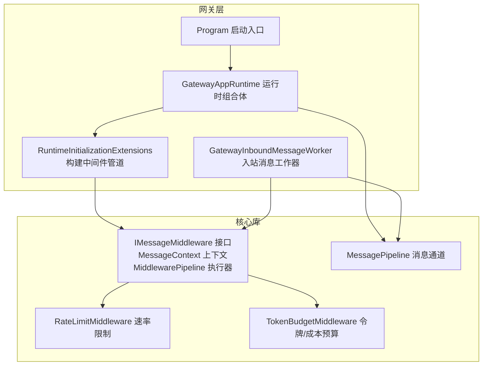
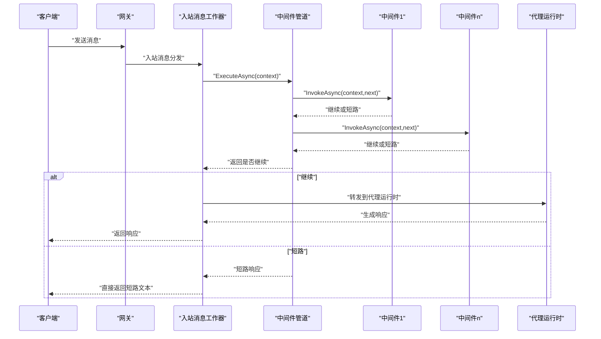
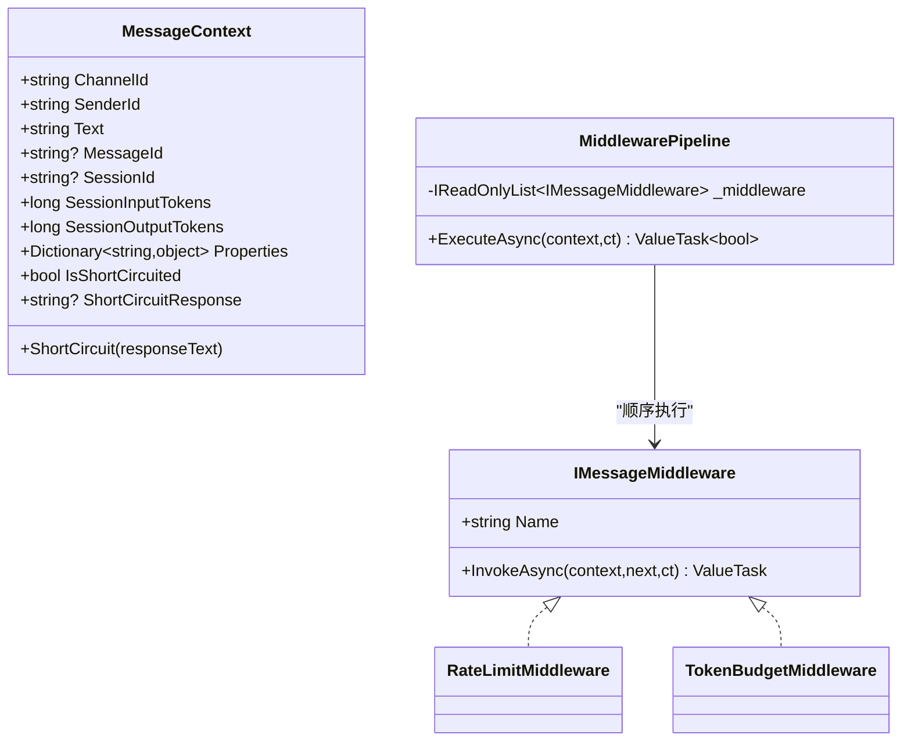
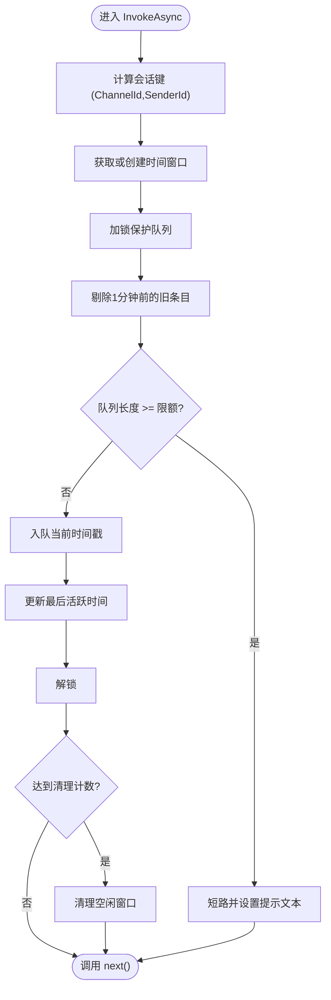
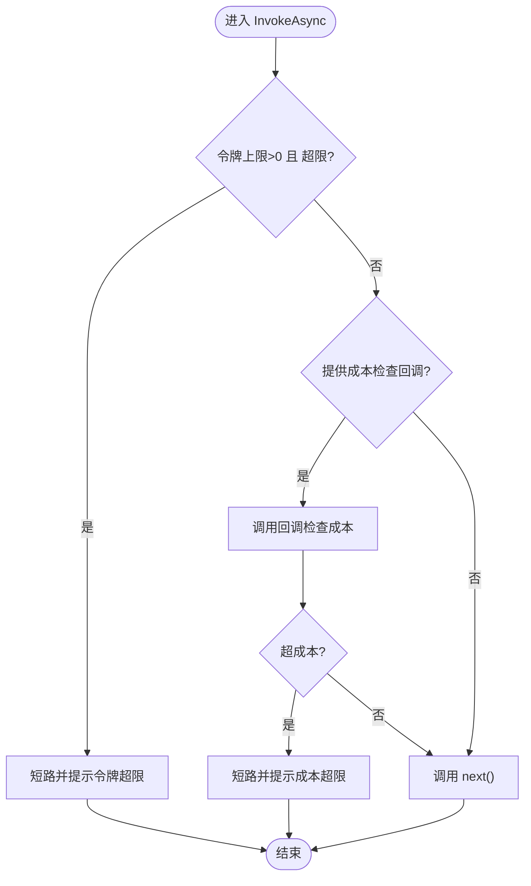
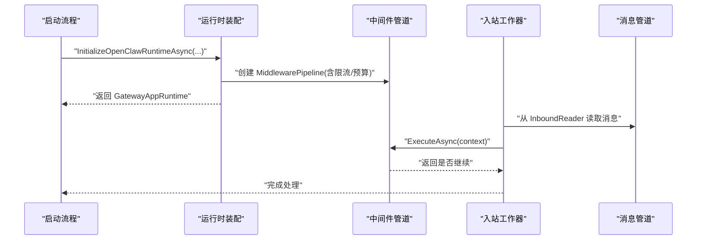
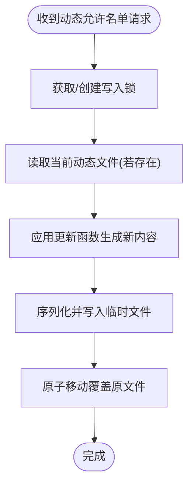
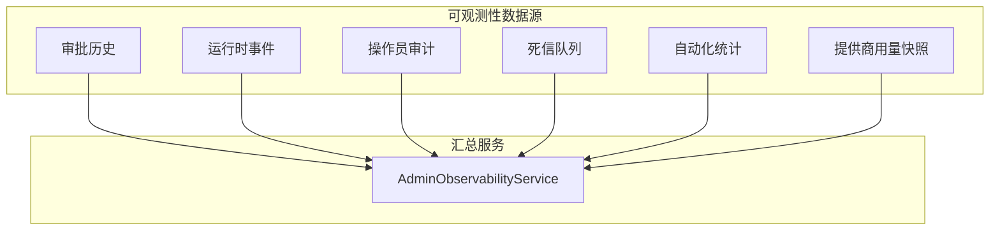
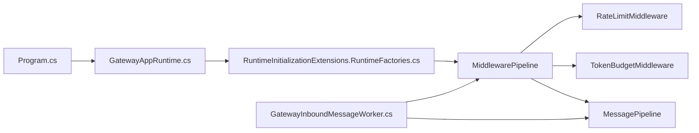

# 中间件管道

<cite>
**本文引用的文件**
- [IMessageMiddleware.cs](file://src/OpenClaw.Core/Middleware/IMessageMiddleware.cs)
- [RateLimitMiddleware.cs](file://src/OpenClaw.Core/Middleware/RateLimitMiddleware.cs)
- [TokenBudgetMiddleware.cs](file://src/OpenClaw.Core/Middleware/TokenBudgetMiddleware.cs)
- [MessagePipeline.cs](file://src/OpenClaw.Core/Pipeline/MessagePipeline.cs)
- [Program.cs](file://src/OpenClaw.Gateway/Program.cs)
- [GatewayAppRuntime.cs](file://src/OpenClaw.Gateway/Composition/GatewayAppRuntime.cs)
- [RuntimeInitializationExtensions.RuntimeFactories.cs](file://src/OpenClaw.Gateway/Composition/RuntimeInitializationExtensions.RuntimeFactories.cs)
- [GatewayInboundMessageWorker.cs](file://src/OpenClaw.Gateway/Extensions/GatewayInboundMessageWorker.cs)
- [AdminObservabilityService.cs](file://src/OpenClaw.Gateway/AdminObservabilityService.cs)
- [OperatorGovernanceModels.cs](file://src/OpenClaw.Core/Models/OperatorGovernanceModels.cs)
- [AllowlistManager.cs](file://src/OpenClaw.Core/Security/AllowlistManager.cs)
- [BeyondBaseTests.cs](file://src/OpenClaw.Tests/BeyondBaseTests.cs)
- [architecture-startup-refactor.md](file://docs/architecture-startup-refactor.md)
</cite>

## 目录
1. [简介](#简介)
2. [项目结构](#项目结构)
3. [核心组件](#核心组件)
4. [架构总览](#架构总览)
5. [详细组件分析](#详细组件分析)
6. [依赖关系分析](#依赖关系分析)
7. [性能考量](#性能考量)
8. [故障排查指南](#故障排查指南)
9. [结论](#结论)
10. [附录](#附录)

## 简介
本文件面向中间件管道系统，系统化阐述消息在进入代理运行时之前的处理流程与机制。重点覆盖以下方面：
- 中间件执行顺序与短路行为
- 请求处理流程与响应处理机制
- 速率限制、令牌预算、日志记录、安全检查与可观测性中间件的职责与实现要点
- 中间件配置、自定义中间件开发与性能监控
- 提供中间件链路图、执行时序图与调试技巧

## 项目结构
中间件管道位于核心库中，由接口、管道执行器以及若干内置中间件组成；网关层负责装配与调度。

**图表来源**
- [Program.cs:1-124](file://src/OpenClaw.Gateway/Program.cs#L1-L124)
- [GatewayAppRuntime.cs:21-33](file://src/OpenClaw.Gateway/Composition/GatewayAppRuntime.cs#L21-L33)
- [RuntimeInitializationExtensions.RuntimeFactories.cs:330-344](file://src/OpenClaw.Gateway/Composition/RuntimeInitializationExtensions.RuntimeFactories.cs#L330-L344)
- [GatewayInboundMessageWorker.cs:18-39](file://src/OpenClaw.Gateway/Extensions/GatewayInboundMessageWorker.cs#L18-L39)
- [IMessageMiddleware.cs:7-96](file://src/OpenClaw.Core/Middleware/IMessageMiddleware.cs#L7-L96)
- [MessagePipeline.cs:11-56](file://src/OpenClaw.Core/Pipeline/MessagePipeline.cs#L11-L56)

**章节来源**
- [Program.cs:1-124](file://src/OpenClaw.Gateway/Program.cs#L1-L124)
- [architecture-startup-refactor.md:1-57](file://docs/architecture-startup-refactor.md#L1-L57)

## 核心组件
- MessageContext：贯穿中间件链的消息上下文，支持属性传递、短路控制与会话级令牌计数。
- IMessageMiddleware：中间件接口，定义名称与异步处理方法。
- MiddlewarePipeline：按注册顺序执行中间件，支持短路后停止后续执行。
- RateLimitMiddleware：基于会话的时间窗口限流。
- TokenBudgetMiddleware：基于会话令牌总量与可选成本上限进行预算检查。
- MessagePipeline：基于有界通道的高吞吐消息管线，用于入站/出站消息的背压与生命周期管理。

**章节来源**
- [IMessageMiddleware.cs:7-96](file://src/OpenClaw.Core/Middleware/IMessageMiddleware.cs#L7-L96)
- [RateLimitMiddleware.cs:10-93](file://src/OpenClaw.Core/Middleware/RateLimitMiddleware.cs#L10-L93)
- [TokenBudgetMiddleware.cs:12-71](file://src/OpenClaw.Core/Middleware/TokenBudgetMiddleware.cs#L12-L71)
- [MessagePipeline.cs:11-56](file://src/OpenClaw.Core/Pipeline/MessagePipeline.cs#L11-L56)

## 架构总览
中间件在消息进入代理运行时之前执行，形成一条可组合的处理链。网关启动时根据配置装配中间件列表，随后在入站消息处理路径中依次调用。

**图表来源**
- [GatewayInboundMessageWorker.cs:18-39](file://src/OpenClaw.Gateway/Extensions/GatewayInboundMessageWorker.cs#L18-L39)
- [IMessageMiddleware.cs:44-54](file://src/OpenClaw.Core/Middleware/IMessageMiddleware.cs#L44-L54)
- [IMessageMiddleware.cs:59-96](file://src/OpenClaw.Core/Middleware/IMessageMiddleware.cs#L59-L96)

## 详细组件分析

### 中间件接口与管道执行器
- MessageContext：承载通道标识、发送者、消息文本、会话标识与令牌计数；提供 Properties 字典用于中间件间传递数据；提供 ShortCircuit 方法以短路整条链路。
- IMessageMiddleware：要求实现 Name 与 InvokeAsync，后者接收当前上下文与“下一个中间件”的回调。
- MiddlewarePipeline：维护中间件有序列表，通过闭包递归调用，遇到短路即停止；返回布尔值指示是否继续进入代理运行时。

**图表来源**
- [IMessageMiddleware.cs:7-96](file://src/OpenClaw.Core/Middleware/IMessageMiddleware.cs#L7-L96)

**章节来源**
- [IMessageMiddleware.cs:7-96](file://src/OpenClaw.Core/Middleware/IMessageMiddleware.cs#L7-L96)

### 速率限制中间件（RateLimitMiddleware）
- 作用：按会话维度进行每分钟消息数量限制，采用时间窗口队列与空闲过期清理策略。
- 关键点：
  - 使用并发字典按 (ChannelId, SenderId) 维度维护时间窗口。
  - 每次检查剔除过期条目，若超过阈值则短路并返回提示。
  - 定期清理长时间无活动的会话窗口，降低内存占用。
- 配置参数：最大每分钟消息数、日志记录器、空闲 TTL、清理频率。

**图表来源**
- [RateLimitMiddleware.cs:39-91](file://src/OpenClaw.Core/Middleware/RateLimitMiddleware.cs#L39-L91)

**章节来源**
- [RateLimitMiddleware.cs:10-93](file://src/OpenClaw.Core/Middleware/RateLimitMiddleware.cs#L10-L93)

### 令牌预算中间件（TokenBudgetMiddleware）
- 作用：基于会话输入/输出令牌总数进行预算检查；可选地通过回调检查美元成本预算。
- 关键点：
  - 当令牌超限时短路并返回用户友好提示。
  - 成本检查仅在提供回调时生效，回调返回 (最大成本, 当前成本, 是否超限)。
- 配置参数：会话令牌上限（0 表示不限额）、日志记录器、成本检查回调。

**图表来源**
- [TokenBudgetMiddleware.cs:36-69](file://src/OpenClaw.Core/Middleware/TokenBudgetMiddleware.cs#L36-L69)

**章节来源**
- [TokenBudgetMiddleware.cs:12-71](file://src/OpenClaw.Core/Middleware/TokenBudgetMiddleware.cs#L12-L71)

### 网关装配与执行路径
- 程序入口 Program 负责构建应用、注册服务、初始化运行时并映射路由。
- 运行时组合体 GatewayAppRuntime 持有中间件管道与消息管道等核心对象。
- 运行时工厂在装配阶段根据配置创建中间件列表（如速率限制与令牌预算），并封装为 MiddlewarePipeline。
- 入站消息工作器从消息管道读取入站消息，先执行中间件管道，再决定是否转发至代理运行时。

**图表来源**
- [Program.cs:80-98](file://src/OpenClaw.Gateway/Program.cs#L80-L98)
- [GatewayAppRuntime.cs:21-33](file://src/OpenClaw.Gateway/Composition/GatewayAppRuntime.cs#L21-L33)
- [RuntimeInitializationExtensions.RuntimeFactories.cs:330-344](file://src/OpenClaw.Gateway/Composition/RuntimeInitializationExtensions.RuntimeFactories.cs#L330-L344)
- [GatewayInboundMessageWorker.cs:18-39](file://src/OpenClaw.Gateway/Extensions/GatewayInboundMessageWorker.cs#L18-L39)

**章节来源**
- [Program.cs:1-124](file://src/OpenClaw.Gateway/Program.cs#L1-L124)
- [GatewayAppRuntime.cs:21-33](file://src/OpenClaw.Gateway/Composition/GatewayAppRuntime.cs#L21-L33)
- [RuntimeInitializationExtensions.RuntimeFactories.cs:330-344](file://src/OpenClaw.Gateway/Composition/RuntimeInitializationExtensions.RuntimeFactories.cs#L330-L344)
- [GatewayInboundMessageWorker.cs:18-39](file://src/OpenClaw.Gateway/Extensions/GatewayInboundMessageWorker.cs#L18-L39)

### 安全检查与允许名单
- 允许名单管理器支持动态加载与持久化，优先动态文件，其次静态配置；提供增删改接口与线程安全写入。
- 可结合中间件在消息进入代理前进行来源合法性校验（例如在自定义中间件中读取允许名单并决定放行或短路）。

**图表来源**
- [AllowlistManager.cs:53-84](file://src/OpenClaw.Core/Security/AllowlistManager.cs#L53-L84)

**章节来源**
- [AllowlistManager.cs:19-126](file://src/OpenClaw.Core/Security/AllowlistManager.cs#L19-L126)

### 可观测性与性能监控
- 网关提供可观测性汇总服务，聚合审批、运行时事件、工具调用、提供商用量等指标，便于运营侧监控系统健康状况。
- 模型定义包含卡片式指标、延迟分布、错误统计等，支撑仪表盘展示与导出。

**图表来源**
- [AdminObservabilityService.cs:117-131](file://src/OpenClaw.Gateway/AdminObservabilityService.cs#L117-L131)
- [OperatorGovernanceModels.cs:344-433](file://src/OpenClaw.Core/Models/OperatorGovernanceModels.cs#L344-L433)

**章节来源**
- [AdminObservabilityService.cs:107-131](file://src/OpenClaw.Gateway/AdminObservabilityService.cs#L107-L131)
- [OperatorGovernanceModels.cs:330-449](file://src/OpenClaw.Core/Models/OperatorGovernanceModels.cs#L330-L449)

## 依赖关系分析
- 网关层通过运行时装配将中间件注入到消息处理路径，确保在进入代理运行时前完成必要的检查与转换。
- 中间件之间通过 MessageContext 的 Properties 实现轻量数据共享，避免强耦合。
- 令牌预算中间件依赖外部成本检查回调，该回调通常来自合约治理服务，体现跨模块协作。

**图表来源**
- [Program.cs:80-98](file://src/OpenClaw.Gateway/Program.cs#L80-L98)
- [GatewayAppRuntime.cs:21-33](file://src/OpenClaw.Gateway/Composition/GatewayAppRuntime.cs#L21-L33)
- [RuntimeInitializationExtensions.RuntimeFactories.cs:330-344](file://src/OpenClaw.Gateway/Composition/RuntimeInitializationExtensions.RuntimeFactories.cs#L330-L344)
- [GatewayInboundMessageWorker.cs:18-39](file://src/OpenClaw.Gateway/Extensions/GatewayInboundMessageWorker.cs#L18-L39)
- [IMessageMiddleware.cs:59-96](file://src/OpenClaw.Core/Middleware/IMessageMiddleware.cs#L59-L96)

**章节来源**
- [Program.cs:1-124](file://src/OpenClaw.Gateway/Program.cs#L1-L124)
- [GatewayAppRuntime.cs:21-33](file://src/OpenClaw.Gateway/Composition/GatewayAppRuntime.cs#L21-L33)
- [RuntimeInitializationExtensions.RuntimeFactories.cs:330-344](file://src/OpenClaw.Gateway/Composition/RuntimeInitializationExtensions.RuntimeFactories.cs#L330-L344)
- [GatewayInboundMessageWorker.cs:18-39](file://src/OpenClaw.Gateway/Extensions/GatewayInboundMessageWorker.cs#L18-L39)
- [IMessageMiddleware.cs:59-96](file://src/OpenClaw.Core/Middleware/IMessageMiddleware.cs#L59-L96)

## 性能考量
- 中间件链执行路径为零分配热点：测试用例验证了中间件执行的低分配特性，适合高吞吐场景。
- 有界通道的 MessagePipeline 在高负载下提供背压，防止内存溢出；关闭时会丢弃剩余消息并记录告警，便于定位积压问题。
- 速率限制中间件采用队列与定期清理策略，避免无限增长；可通过配置调整清理频率与空闲 TTL。

**章节来源**
- [BeyondBaseTests.cs:357-379](file://src/OpenClaw.Tests/BeyondBaseTests.cs#L357-L379)
- [MessagePipeline.cs:17-56](file://src/OpenClaw.Core/Pipeline/MessagePipeline.cs#L17-L56)
- [RateLimitMiddleware.cs:27-37](file://src/OpenClaw.Core/Middleware/RateLimitMiddleware.cs#L27-L37)

## 故障排查指南
- 中间件顺序与短路
  - 若上游中间件短路，下游中间件不会执行；可通过测试用例验证顺序与短路行为。
- 速率限制触发
  - 当出现“发送过快”类提示时，检查每分钟消息数配置与会话键（ChannelId/SenderId）是否正确。
- 令牌预算触发
  - 当出现“会话已达令牌预算”提示时，确认会话令牌计数是否正确累加，以及预算配置是否合理。
- 成本预算触发
  - 当出现“会话已达成本预算”提示时，检查成本检查回调逻辑与当前会话的成本统计。
- 日志与可观测性
  - 利用可观测性汇总服务查看审批延迟、提供商错误与工具调用情况，辅助定位问题根因。

**章节来源**
- [BeyondBaseTests.cs:319-343](file://src/OpenClaw.Tests/BeyondBaseTests.cs#L319-L343)
- [BeyondBaseTests.cs:385-419](file://src/OpenClaw.Tests/BeyondBaseTests.cs#L385-L419)
- [BeyondBaseTests.cs:425-472](file://src/OpenClaw.Tests/BeyondBaseTests.cs#L425-L472)
- [AdminObservabilityService.cs:117-131](file://src/OpenClaw.Gateway/AdminObservabilityService.cs#L117-L131)

## 结论
中间件管道通过清晰的接口与可组合的设计，在消息进入代理运行时前提供了统一的检查、转换与短路能力。速率限制与令牌预算中间件分别从“速度”和“消耗”两个维度保障系统稳定与成本可控；配合允许名单与可观测性，形成完整的安全与运维闭环。通过有界通道与低分配执行路径，系统在高并发场景下仍能保持良好性能。

## 附录

### 中间件配置清单
- 速率限制
  - 最大每分钟消息数
  - 日志记录器
  - 空闲 TTL
  - 清理频率
- 令牌预算
  - 会话令牌上限（0 表示不限额）
  - 日志记录器
  - 成本检查回调（可选）

**章节来源**
- [RateLimitMiddleware.cs:27-37](file://src/OpenClaw.Core/Middleware/RateLimitMiddleware.cs#L27-L37)
- [TokenBudgetMiddleware.cs:26-34](file://src/OpenClaw.Core/Middleware/TokenBudgetMiddleware.cs#L26-L34)

### 自定义中间件开发步骤
- 实现 IMessageMiddleware 接口，定义 Name 与 InvokeAsync。
- 在中间件内部读取/修改 MessageContext 的字段或 Properties。
- 通过调用 next() 将控制权交给下一个中间件；必要时调用 context.ShortCircuit(...) 进行短路。
- 在网关运行时装配阶段将自定义中间件加入中间件列表。

**章节来源**
- [IMessageMiddleware.cs:44-54](file://src/OpenClaw.Core/Middleware/IMessageMiddleware.cs#L44-L54)
- [RuntimeInitializationExtensions.RuntimeFactories.cs:330-344](file://src/OpenClaw.Gateway/Composition/RuntimeInitializationExtensions.RuntimeFactories.cs#L330-L344)