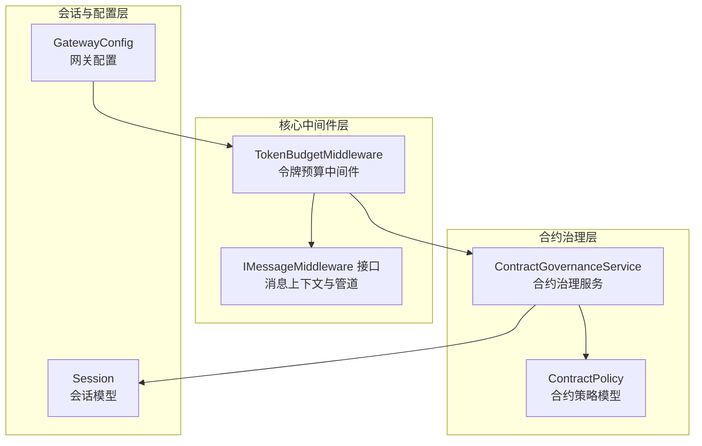
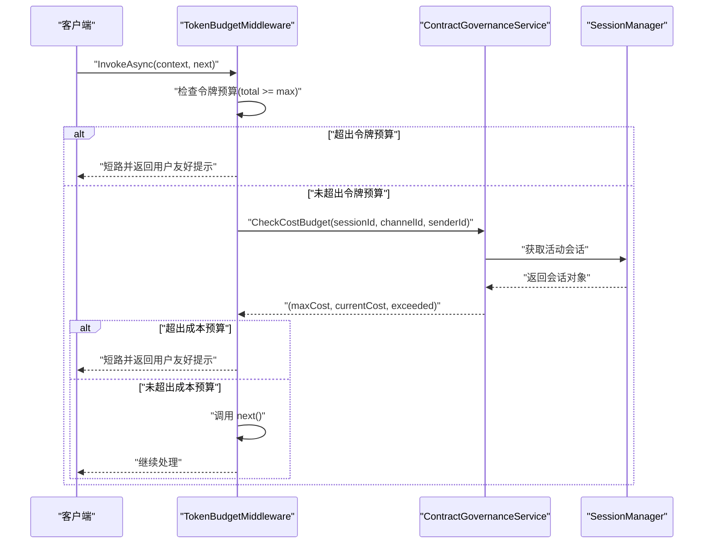
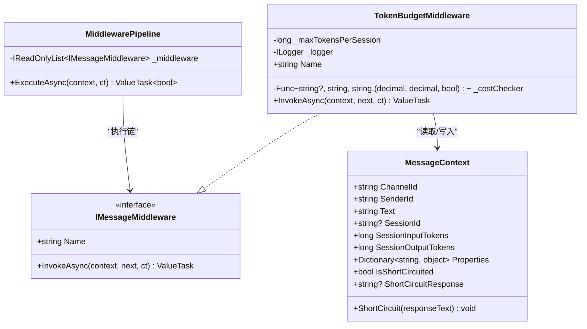
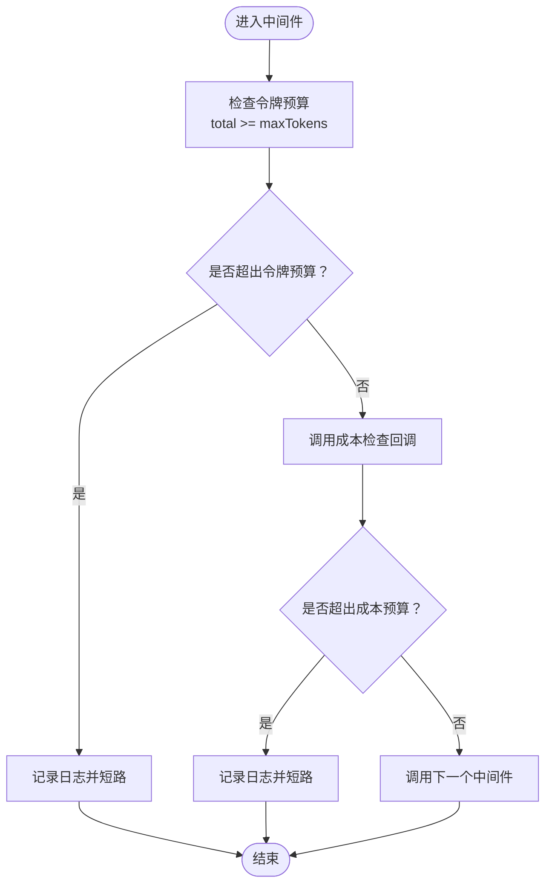
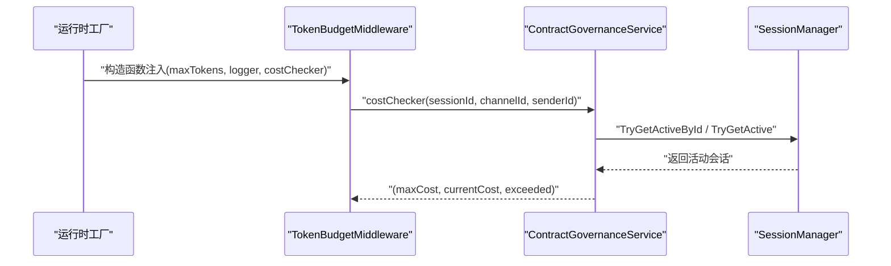
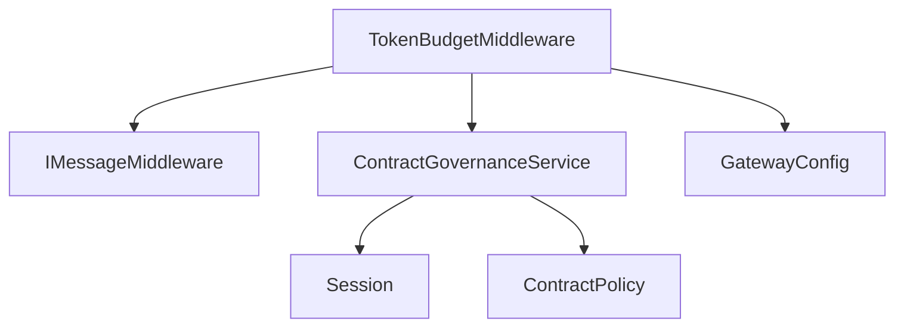

# 令牌预算中间件

<cite>
**本文档引用的文件**
- [TokenBudgetMiddleware.cs](file://src/OpenClaw.Core/Middleware/TokenBudgetMiddleware.cs)
- [IMessageMiddleware.cs](file://src/OpenClaw.Core/Middleware/IMessageMiddleware.cs)
- [RuntimeInitializationExtensions.RuntimeFactories.cs](file://src/OpenClaw.Gateway/Composition/RuntimeInitializationExtensions.RuntimeFactories.cs)
- [ContractGovernanceService.cs](file://src/OpenClaw.Gateway/ContractGovernanceService.cs)
- [ContractModels.cs](file://src/OpenClaw.Core/Middleware/ContractModels.cs)
- [Session.cs](file://src/OpenClaw.Core/Models/Session.cs)
- [GatewayConfig.cs](file://src/OpenClaw.Core/Models/GatewayConfig.cs)
- [BeyondBaseTests.cs](file://src/OpenClaw.Tests/BeyondBaseTests.cs)
- [ContractGovernanceTests.cs](file://src/OpenClaw.Tests/ContractGovernanceTests.cs)
</cite>

## 目录
1. [简介](#简介)
2. [项目结构](#项目结构)
3. [核心组件](#核心组件)
4. [架构概览](#架构概览)
5. [详细组件分析](#详细组件分析)
6. [依赖关系分析](#依赖关系分析)
7. [性能考虑](#性能考虑)
8. [故障排除指南](#故障排除指南)
9. [结论](#结论)

## 简介
本文档详细说明了令牌预算中间件的设计与实现，包括令牌预算计算、分配策略、消耗跟踪机制，以及与合约治理系统的集成。文档涵盖以下关键主题：
- 令牌桶算法与预算更新频率
- 超预算处理逻辑
- 预算配置、成本计算与资源控制策略
- 预算监控、异常处理与性能优化建议

## 项目结构
令牌预算中间件位于 OpenClaw.Core 的中间件层，通过消息管道在代理运行前进行拦截与校验。其与合约治理服务、会话模型、网关配置等模块协同工作。

**图表来源**
- [TokenBudgetMiddleware.cs:12-71](file://src/OpenClaw.Core/Middleware/TokenBudgetMiddleware.cs#L12-L71)
- [IMessageMiddleware.cs:7-97](file://src/OpenClaw.Core/Middleware/IMessageMiddleware.cs#L7-L97)
- [ContractGovernanceService.cs:383-408](file://src/OpenClaw.Gateway/ContractGovernanceService.cs#L383-L408)
- [ContractModels.cs:41-80](file://src/OpenClaw.Core/Middleware/ContractModels.cs#L41-L80)
- [Session.cs:15-135](file://src/OpenClaw.Core/Models/Session.cs#L15-L135)
- [GatewayConfig.cs:53-79](file://src/OpenClaw.Core/Models/GatewayConfig.cs#L53-L79)

**章节来源**
- [TokenBudgetMiddleware.cs:12-71](file://src/OpenClaw.Core/Middleware/TokenBudgetMiddleware.cs#L12-L71)
- [IMessageMiddleware.cs:7-97](file://src/OpenClaw.Core/Middleware/IMessageMiddleware.cs#L7-L97)
- [RuntimeInitializationExtensions.RuntimeFactories.cs:335-341](file://src/OpenClaw.Gateway/Composition/RuntimeInitializationExtensions.RuntimeFactories.cs#L335-L341)

## 核心组件
- 令牌预算中间件：负责在消息进入代理运行前检查会话级令牌预算与美元成本预算，并根据结果短路或放行请求。
- 消息上下文与管道：定义消息在中间件链中的传递方式与短路机制。
- 合约治理服务：提供美元成本预算检查回调，基于会话状态与合约策略返回当前累计成本与是否超限。
- 会话模型：维护会话级令牌计数（输入/输出）与合约相关基线值。
- 网关配置：提供会话令牌预算上限、估算准入控制开关、成本率配置等参数。

**章节来源**
- [TokenBudgetMiddleware.cs:12-71](file://src/OpenClaw.Core/Middleware/TokenBudgetMiddleware.cs#L12-L71)
- [IMessageMiddleware.cs:7-97](file://src/OpenClaw.Core/Middleware/IMessageMiddleware.cs#L7-L97)
- [ContractGovernanceService.cs:383-408](file://src/OpenClaw.Gateway/ContractGovernanceService.cs#L383-L408)
- [Session.cs:15-135](file://src/OpenClaw.Core/Models/Session.cs#L15-L135)
- [GatewayConfig.cs:53-79](file://src/OpenClaw.Core/Models/GatewayConfig.cs#L53-L79)

## 架构概览
令牌预算中间件在消息管道中执行两次检查：
1) 令牌预算检查：基于会话输入/输出令牌累加值与配置上限比较。
2) 成本预算检查：通过合约治理服务回调，基于会话合约策略与累计成本判断。

**图表来源**
- [TokenBudgetMiddleware.cs:36-69](file://src/OpenClaw.Core/Middleware/TokenBudgetMiddleware.cs#L36-L69)
- [ContractGovernanceService.cs:387-408](file://src/OpenClaw.Gateway/ContractGovernanceService.cs#L387-L408)
- [RuntimeInitializationExtensions.RuntimeFactories.cs:335-341](file://src/OpenClaw.Gateway/Composition/RuntimeInitializationExtensions.RuntimeFactories.cs#L335-L341)

## 详细组件分析

### 令牌预算中间件类图

**图表来源**
- [TokenBudgetMiddleware.cs:12-71](file://src/OpenClaw.Core/Middleware/TokenBudgetMiddleware.cs#L12-L71)
- [IMessageMiddleware.cs:7-97](file://src/OpenClaw.Core/Middleware/IMessageMiddleware.cs#L7-L97)

**章节来源**
- [TokenBudgetMiddleware.cs:12-71](file://src/OpenClaw.Core/Middleware/TokenBudgetMiddleware.cs#L12-L71)
- [IMessageMiddleware.cs:7-97](file://src/OpenClaw.Core/Middleware/IMessageMiddleware.cs#L7-L97)

### 令牌预算计算与分配策略
- 计算方式：总令牌数 = 会话输入令牌 + 会话输出令牌。
- 分配策略：
  - 令牌预算上限由网关配置提供，0 表示无限制。
  - 成本预算上限由合约策略提供，0 表示无限制；支持软警告阈值。
- 更新频率：令牌计数在每次代理回合完成后外部更新（会话模型维护累加值），中间件仅在新消息进入时读取当前值进行检查。

**图表来源**
- [TokenBudgetMiddleware.cs:36-69](file://src/OpenClaw.Core/Middleware/TokenBudgetMiddleware.cs#L36-L69)
- [Session.cs:64-135](file://src/OpenClaw.Core/Models/Session.cs#L64-L135)
- [GatewayConfig.cs:53-79](file://src/OpenClaw.Core/Models/GatewayConfig.cs#L53-L79)

**章节来源**
- [TokenBudgetMiddleware.cs:36-69](file://src/OpenClaw.Core/Middleware/TokenBudgetMiddleware.cs#L36-L69)
- [Session.cs:64-135](file://src/OpenClaw.Core/Models/Session.cs#L64-L135)
- [GatewayConfig.cs:53-79](file://src/OpenClaw.Core/Models/GatewayConfig.cs#L53-L79)

### 成本计算与资源控制策略
- 成本计算来源：合约治理服务根据会话状态与合约策略返回当前累计成本与上限。
- 资源控制策略：
  - 令牌预算：按输入/输出令牌累加，支持无限制模式。
  - 成本预算：按合约策略的美元上限与软警告阈值控制。
  - 初始化集成：在运行时工厂中注入成本检查回调，确保中间件可访问会话与合约信息。

**图表来源**
- [RuntimeInitializationExtensions.RuntimeFactories.cs:335-341](file://src/OpenClaw.Gateway/Composition/RuntimeInitializationExtensions.RuntimeFactories.cs#L335-L341)
- [ContractGovernanceService.cs:387-408](file://src/OpenClaw.Gateway/ContractGovernanceService.cs#L387-L408)

**章节来源**
- [RuntimeInitializationExtensions.RuntimeFactories.cs:335-341](file://src/OpenClaw.Gateway/Composition/RuntimeInitializationExtensions.RuntimeFactories.cs#L335-L341)
- [ContractGovernanceService.cs:387-408](file://src/OpenClaw.Gateway/ContractGovernanceService.cs#L387-L408)

### 超预算处理逻辑
- 令牌超限：直接短路，返回用户可理解的提示信息，避免继续处理。
- 成本超限：同样短路，提示用户调整预算或开启新对话。
- 日志记录：对超限场景进行警告日志记录，便于审计与监控。

**章节来源**
- [TokenBudgetMiddleware.cs:44-49](file://src/OpenClaw.Core/Middleware/TokenBudgetMiddleware.cs#L44-L49)
- [TokenBudgetMiddleware.cs:59-64](file://src/OpenClaw.Core/Middleware/TokenBudgetMiddleware.cs#L59-L64)

### 预算配置与初始化
- 令牌预算上限：通过网关配置项设置，支持无限制模式。
- 成本预算回调：在运行时工厂中构建，基于会话管理器查询活动会话并返回成本检查结果。
- 中间件注册：在消息管道中按顺序添加，确保在代理运行前完成检查。

**章节来源**
- [GatewayConfig.cs:53-79](file://src/OpenClaw.Core/Models/GatewayConfig.cs#L53-L79)
- [RuntimeInitializationExtensions.RuntimeFactories.cs:335-341](file://src/OpenClaw.Gateway/Composition/RuntimeInitializationExtensions.RuntimeFactories.cs#L335-L341)

## 依赖关系分析
- 低耦合设计：中间件通过接口与回调解耦，便于替换成本检查实现。
- 数据流清晰：消息上下文贯穿整个管道，中间件只读取必要字段，避免侵入性修改。
- 可扩展性强：新增检查维度（如工具调用次数）可通过扩展消息上下文属性实现。

**图表来源**
- [TokenBudgetMiddleware.cs:12-71](file://src/OpenClaw.Core/Middleware/TokenBudgetMiddleware.cs#L12-L71)
- [IMessageMiddleware.cs:7-97](file://src/OpenClaw.Core/Middleware/IMessageMiddleware.cs#L7-L97)
- [ContractGovernanceService.cs:383-408](file://src/OpenClaw.Gateway/ContractGovernanceService.cs#L383-L408)
- [ContractModels.cs:41-80](file://src/OpenClaw.Core/Middleware/ContractModels.cs#L41-L80)
- [Session.cs:15-135](file://src/OpenClaw.Core/Models/Session.cs#L15-L135)
- [GatewayConfig.cs:53-79](file://src/OpenClaw.Core/Models/GatewayConfig.cs#L53-L79)

**章节来源**
- [TokenBudgetMiddleware.cs:12-71](file://src/OpenClaw.Core/Middleware/TokenBudgetMiddleware.cs#L12-L71)
- [IMessageMiddleware.cs:7-97](file://src/OpenClaw.Core/Middleware/IMessageMiddleware.cs#L7-L97)
- [ContractGovernanceService.cs:383-408](file://src/OpenClaw.Gateway/ContractGovernanceService.cs#L383-L408)
- [ContractModels.cs:41-80](file://src/OpenClaw.Core/Middleware/ContractModels.cs#L41-L80)
- [Session.cs:15-135](file://src/OpenClaw.Core/Models/Session.cs#L15-L135)
- [GatewayConfig.cs:53-79](file://src/OpenClaw.Core/Models/GatewayConfig.cs#L53-L79)

## 性能考虑
- 常量时间检查：令牌与成本检查均为 O(1) 操作，开销极小。
- 最小化分配：消息上下文的属性字典按需分配，避免热路径上的额外内存分配。
- 并发安全：会话令牌计数采用原子操作，保证多线程环境下的正确性。
- 提示与短路：超限时立即短路，减少不必要的后续处理。

[本节为通用性能讨论，不直接分析具体文件]

## 故障排除指南
- 测试覆盖：
  - 令牌预算：验证低于预算允许通过、超出预算短路、无限制模式放行。
  - 成本预算：验证成本超限时短路、无成本检查器时放行。
- 常见问题定位：
  - 确认网关配置中的令牌预算上限设置是否符合预期。
  - 检查合约策略的成本上限与软警告阈值配置。
  - 查看中间件日志，确认短路原因（令牌或成本）。

**章节来源**
- [BeyondBaseTests.cs:425-472](file://src/OpenClaw.Tests/BeyondBaseTests.cs#L425-L472)
- [ContractGovernanceTests.cs:661-692](file://src/OpenClaw.Tests/ContractGovernanceTests.cs#L661-L692)

## 结论
令牌预算中间件通过简洁高效的检查逻辑，在消息进入代理运行前实现了会话级令牌与成本的双重控制。其与合约治理服务的松耦合集成，使得预算策略具备良好的可配置性与可扩展性。配合完善的测试与日志记录，能够在保障系统稳定性的前提下，为用户提供清晰的反馈与可控的资源使用体验。