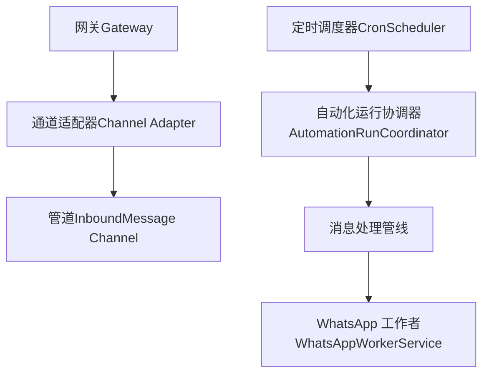
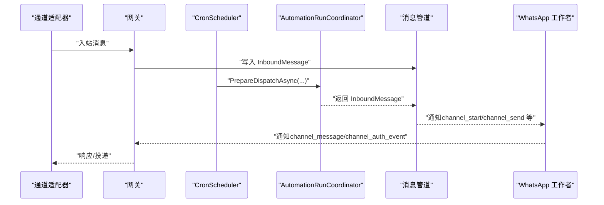
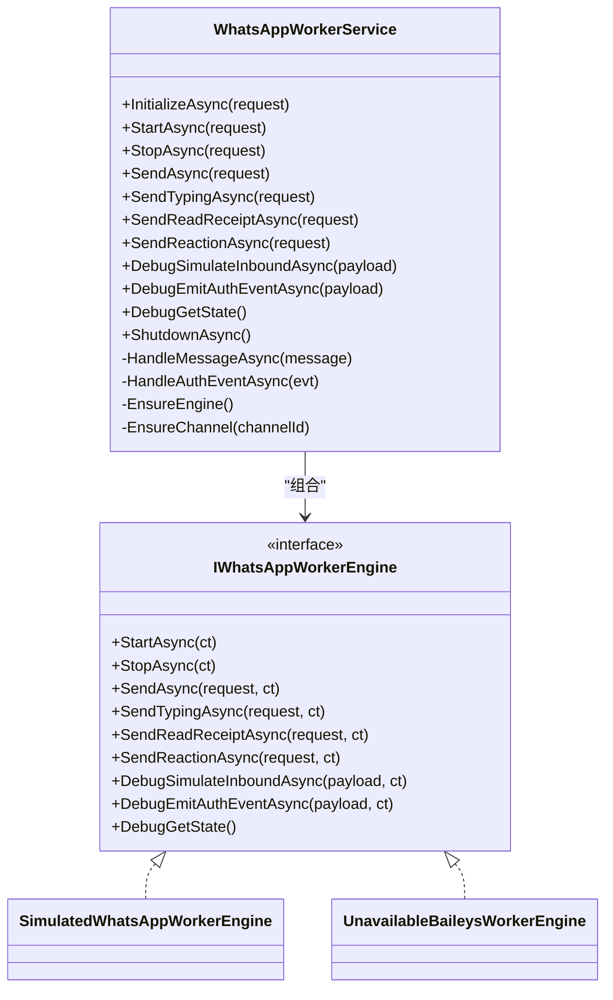
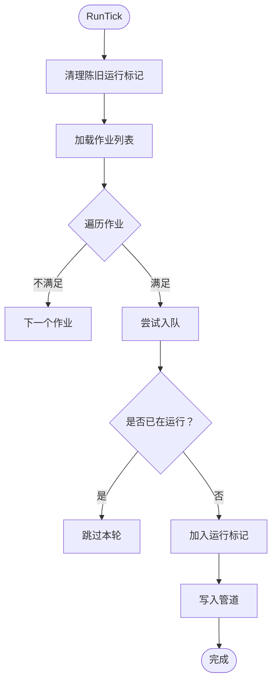
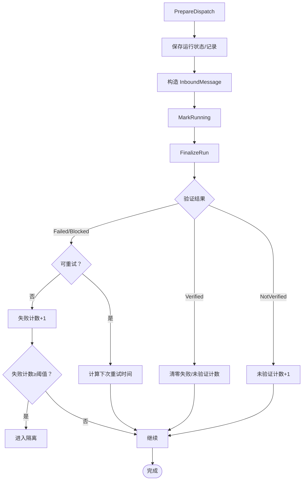
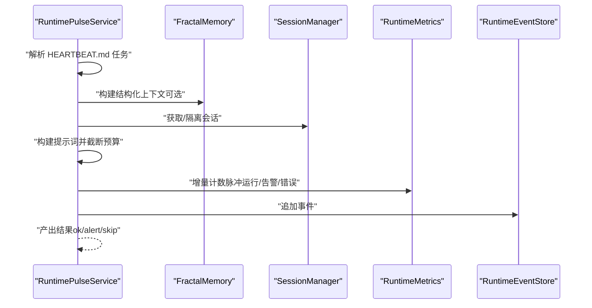
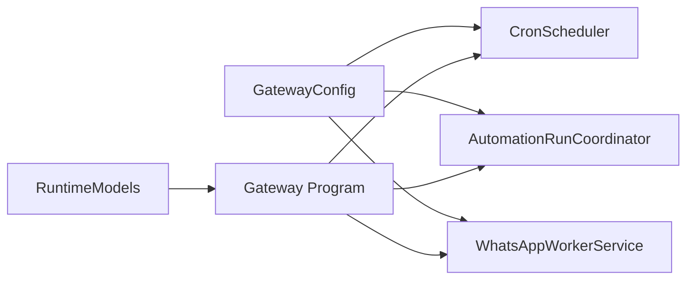

# 工作者集成

<cite>
**本文引用的文件**
- [WhatsAppWorkerService.cs](file://src/OpenClaw.WhatsApp.BaileysWorker/WhatsAppWorkerService.cs)
- [Program.cs](file://src/OpenClaw.WhatsApp.BaileysWorker/Program.cs)
- [AutomationRunCoordinator.cs](file://src/OpenClaw.Gateway/AutomationRunCoordinator.cs)
- [CronScheduler.cs](file://src/OpenClaw.Core/Pipeline/CronScheduler.cs)
- [RuntimePulseService.cs](file://src/OpenClaw.Gateway/RuntimePulseService.cs)
- [Program.cs](file://src/OpenClaw.Gateway/Program.cs)
- [GatewayConfig.cs](file://src/OpenClaw.Core/Models/GatewayConfig.cs)
- [RuntimeModels.cs](file://src/OpenClaw.Core/Models/RuntimeModels.cs)
- [RuntimeMetrics.cs](file://src/OpenClaw.Core/Observability/RuntimeMetrics.cs)
- [AdminObservabilityService.cs](file://src/OpenClaw.Gateway/AdminObservabilityService.cs)
- [openclaw-gateway-startup-layers.md](file://docs/openclaw-gateway-startup-layers.md)
</cite>

## 目录
1. [简介](#简介)
2. [项目结构](#项目结构)
3. [核心组件](#核心组件)
4. [架构总览](#架构总览)
5. [详细组件分析](#详细组件分析)
6. [依赖关系分析](#依赖关系分析)
7. [性能考量](#性能考量)
8. [故障排查指南](#故障排查指南)
9. [结论](#结论)
10. [附录](#附录)

## 简介
本文件面向“工作者集成系统”，聚焦于工作者线程管理、任务调度与资源分配机制，系统性阐述工作者数量配置、负载均衡与故障恢复策略，以及工作者生命周期管理、性能监控与资源优化方法。文档同时提供工作者配置示例、调试方法与性能调优建议，帮助读者在生产环境中稳定、高效地运行各类工作者。

## 项目结构
该系统围绕“网关（Gateway）+ 通道（Channel）+ 工作者（Worker）”三层协作展开：
- 网关负责统一编排、任务调度、自动化运行协调与可观测性。
- 通道适配器负责接入外部渠道（如 WhatsApp、Teams 等），并将消息进入统一管道。
- 工作者作为独立进程或模拟引擎，承载特定通道的桥接与消息收发能力（如 WhatsApp Baileys 工作者）。

图示来源
- [Program.cs:1-124](file://src/OpenClaw.Gateway/Program.cs#L1-L124)
- [CronScheduler.cs:1-272](file://src/OpenClaw.Core/Pipeline/CronScheduler.cs#L1-L272)
- [AutomationRunCoordinator.cs:1-484](file://src/OpenClaw.Gateway/AutomationRunCoordinator.cs#L1-L484)
- [WhatsAppWorkerService.cs:1-174](file://src/OpenClaw.WhatsApp.BaileysWorker/WhatsAppWorkerService.cs#L1-L174)

章节来源
- [Program.cs:1-124](file://src/OpenClaw.Gateway/Program.cs#L1-L124)
- [openclaw-gateway-startup-layers.md:181-209](file://docs/openclaw-gateway-startup-layers.md#L181-L209)

## 核心组件
- 工作者生命周期与桥接：WhatsApp 工作者通过标准输入输出协议与网关通信，支持初始化、启动/停止、发送消息、打字态、已读回执、反应等操作，并提供调试仿真与状态查询。
- 定时调度与任务队列：CronScheduler 基于表达式触发任务，使用并发字典跟踪运行状态，避免重叠执行，并将消息写入统一管道。
- 自动化运行协调：AutomationRunCoordinator 负责自动化任务的排队、运行标记、完成归档、重试与隔离、健康状态评估与隔离（Quarantine）。
- 运行脉冲与可观测性：RuntimePulseService 周期性扫描 HEARTBEAT.md 并生成提示，驱动自动化检查与告警；结合 RuntimeMetrics 与 AdminObservabilityService 提供指标聚合与可视化。
- 网关启动与后台工作者：Program.cs 负责启动循环、错误恢复与优雅关闭；启动层文档说明后台工作者数量限制与通道生命周期。

章节来源
- [WhatsAppWorkerService.cs:1-174](file://src/OpenClaw.WhatsApp.BaileysWorker/WhatsAppWorkerService.cs#L1-L174)
- [Program.cs:1-122](file://src/OpenClaw.WhatsApp.BaileysWorker/Program.cs#L1-L122)
- [CronScheduler.cs:1-272](file://src/OpenClaw.Core/Pipeline/CronScheduler.cs#L1-L272)
- [AutomationRunCoordinator.cs:1-484](file://src/OpenClaw.Gateway/AutomationRunCoordinator.cs#L1-L484)
- [RuntimePulseService.cs:1-800](file://src/OpenClaw.Gateway/RuntimePulseService.cs#L1-L800)
- [Program.cs:1-124](file://src/OpenClaw.Gateway/Program.cs#L1-L124)
- [openclaw-gateway-startup-layers.md:181-209](file://docs/openclaw-gateway-startup-layers.md#L181-L209)

## 架构总览
下图展示从通道到工作者的端到端流程，包括网关启动、通道生命周期、定时任务与自动化运行协调，以及工作者的桥接与通知机制。

图示来源
- [Program.cs:1-124](file://src/OpenClaw.Gateway/Program.cs#L1-L124)
- [CronScheduler.cs:146-190](file://src/OpenClaw.Core/Pipeline/CronScheduler.cs#L146-L190)
- [AutomationRunCoordinator.cs:26-111](file://src/OpenClaw.Gateway/AutomationRunCoordinator.cs#L26-L111)
- [WhatsAppWorkerService.cs:101-152](file://src/OpenClaw.WhatsApp.BaileysWorker/WhatsAppWorkerService.cs#L101-L152)

## 详细组件分析

### 组件一：WhatsApp 工作者桥接与生命周期
- 初始化与配置：支持从请求参数反序列化配置，创建引擎实例并订阅消息与认证事件。
- 控制接口：提供启动、停止、发送文本/打字态/已读回执/反应等方法；调试接口支持仿真入站消息与认证事件。
- 引擎类型：当前仅支持“simulated”驱动；若使用其他驱动需通过宿主进程启动。
- 生命周期：通过标准输入输出协议进行请求/响应交互，支持优雅关闭与资源释放。

图示来源
- [WhatsAppWorkerService.cs:7-174](file://src/OpenClaw.WhatsApp.BaileysWorker/WhatsAppWorkerService.cs#L7-L174)
- [WhatsAppWorkerService.cs:200-373](file://src/OpenClaw.WhatsApp.BaileysWorker/WhatsAppWorkerService.cs#L200-L373)

章节来源
- [WhatsAppWorkerService.cs:15-99](file://src/OpenClaw.WhatsApp.BaileysWorker/WhatsAppWorkerService.cs#L15-L99)
- [Program.cs:10-67](file://src/OpenClaw.WhatsApp.BaileysWorker/Program.cs#L10-L67)

### 组件二：定时调度与任务队列
- 触发机制：基于 NCrontab 解析表达式，支持时区转换与秒级精度判断。
- 并发控制：使用并发字典记录运行中的作业，超过最大运行时长则清理陈旧标记，避免重复执行。
- 入队策略：将任务封装为 InboundMessage 写入通道；若配置了自动化 ID，则先经 AutomationRunCoordinator 准备派发。
- 启动即刻执行：支持 RunOnStartup 标记的任务在启动时立即触发一次。

图示来源
- [CronScheduler.cs:69-101](file://src/OpenClaw.Core/Pipeline/CronScheduler.cs#L69-L101)
- [CronScheduler.cs:111-144](file://src/OpenClaw.Core/Pipeline/CronScheduler.cs#L111-L144)
- [CronScheduler.cs:146-190](file://src/OpenClaw.Core/Pipeline/CronScheduler.cs#L146-L190)

章节来源
- [CronScheduler.cs:1-272](file://src/OpenClaw.Core/Pipeline/CronScheduler.cs#L1-L272)

### 组件三：自动化运行协调与健康治理
- 排队与预览：构建消息预览，保存运行状态与记录，限制历史记录数量。
- 运行标记：将状态更新为 Running，并在心跳任务场景下跳过记录持久化。
- 完成归档与重试：根据验证结果与触发源决定失败计数、未验证计数、下次重试时间与隔离阈值。
- 健康与隔离：连续失败达到阈值后进入 Quarantine，支持手动清除隔离状态。
- 堵塞检测：对长时间未更新的 Running 状态判定为 Stuck 并更新状态与记录。

图示来源
- [AutomationRunCoordinator.cs:26-111](file://src/OpenClaw.Gateway/AutomationRunCoordinator.cs#L26-L111)
- [AutomationRunCoordinator.cs:119-180](file://src/OpenClaw.Gateway/AutomationRunCoordinator.cs#L119-L180)
- [AutomationRunCoordinator.cs:182-342](file://src/OpenClaw.Gateway/AutomationRunCoordinator.cs#L182-L342)
- [AutomationRunCoordinator.cs:378-437](file://src/OpenClaw.Gateway/AutomationRunCoordinator.cs#L378-L437)

章节来源
- [AutomationRunCoordinator.cs:1-484](file://src/OpenClaw.Gateway/AutomationRunCoordinator.cs#L1-L484)

### 组件四：运行脉冲与可观测性
- 周期性扫描：读取 HEARTBEAT.md，解析任务并筛选到期任务，构建提示词并执行运行。
- 上下文与会话：支持 Fractal Memory 结构化上下文注入，支持隔离会话与模型覆盖。
- 指标与事件：记录脉冲运行次数、告警数、错误数与持续时间；事件写入运行事件存储。
- 可视化与状态：提供状态文件与事件聚合，支持管理员查看运行状态与最近告警。

图示来源
- [RuntimePulseService.cs:136-299](file://src/OpenClaw.Gateway/RuntimePulseService.cs#L136-L299)
- [RuntimePulseService.cs:301-353](file://src/OpenClaw.Gateway/RuntimePulseService.cs#L301-L353)
- [RuntimeMetrics.cs:170-185](file://src/OpenClaw.Core/Observability/RuntimeMetrics.cs#L170-L185)
- [AdminObservabilityService.cs:182-200](file://src/OpenClaw.Gateway/AdminObservabilityService.cs#L182-L200)

章节来源
- [RuntimePulseService.cs:1-800](file://src/OpenClaw.Gateway/RuntimePulseService.cs#L1-L800)
- [RuntimeMetrics.cs:170-185](file://src/OpenClaw.Core/Observability/RuntimeMetrics.cs#L170-L185)
- [AdminObservabilityService.cs:182-200](file://src/OpenClaw.Gateway/AdminObservabilityService.cs#L182-L200)

## 依赖关系分析
- 工作者与网关：工作者通过标准输入输出协议与网关交互，网关将通道消息与自动化任务统一写入管道，工作者仅处理其通道相关命令。
- 调度与协调：CronScheduler 与 AutomationRunCoordinator 分别负责周期性任务与自动化生命周期，二者均依赖统一的 InboundMessage 管道。
- 配置与运行模式：GatewayConfig 提供运行、内存、工具、通道等配置项；RuntimeModels 定义运行模式（AOT/JIT）与编排器选择（native/maf）。
- 启动与关闭：Program.cs 负责启动循环、错误恢复与优雅关闭；启动层文档指出后台工作者数量限制在 1~4 之间。

图示来源
- [GatewayConfig.cs:1-800](file://src/OpenClaw.Core/Models/GatewayConfig.cs#L1-L800)
- [RuntimeModels.cs:1-69](file://src/OpenClaw.Core/Models/RuntimeModels.cs#L1-L69)
- [CronScheduler.cs:1-36](file://src/OpenClaw.Core/Pipeline/CronScheduler.cs#L1-L36)
- [AutomationRunCoordinator.cs:1-24](file://src/OpenClaw.Gateway/AutomationRunCoordinator.cs#L1-L24)
- [Program.cs:1-124](file://src/OpenClaw.Gateway/Program.cs#L1-L124)
- [openclaw-gateway-startup-layers.md:181-209](file://docs/openclaw-gateway-startup-layers.md#L181-L209)

章节来源
- [GatewayConfig.cs:1-800](file://src/OpenClaw.Core/Models/GatewayConfig.cs#L1-L800)
- [openclaw-gateway-startup-layers.md:181-209](file://docs/openclaw-gateway-startup-layers.md#L181-L209)

## 性能考量
- 并发与背压：CronScheduler 使用并发字典避免重叠执行；通道适配器与工作者通过事件/异步 I/O 降低阻塞。
- 资源预算：GatewayConfig 提供会话令牌预算、速率限制与优雅关闭等待时间，防止资源耗尽。
- 运行模式：RuntimeModels 支持 AOT/JIT 模式切换，依据运行环境选择最优模式。
- 指标与观测：RuntimeMetrics 提供脉冲运行、告警、错误等计数器；AdminObservabilityService 聚合指标并支持可视化。
- 任务截断：RuntimePulseService 对提示词长度进行预算截断，避免超限导致的性能退化。

章节来源
- [CronScheduler.cs:111-144](file://src/OpenClaw.Core/Pipeline/CronScheduler.cs#L111-L144)
- [GatewayConfig.cs:50-79](file://src/OpenClaw.Core/Models/GatewayConfig.cs#L50-L79)
- [RuntimeModels.cs:29-59](file://src/OpenClaw.Core/Models/RuntimeModels.cs#L29-L59)
- [RuntimeMetrics.cs:170-185](file://src/OpenClaw.Core/Observability/RuntimeMetrics.cs#L170-L185)
- [RuntimePulseService.cs:398-403](file://src/OpenClaw.Gateway/RuntimePulseService.cs#L398-L403)

## 故障排查指南
- 启动与恢复：Program.cs 在启动异常时尝试交互式恢复，必要时输出失败报告；启动层文档说明后台工作者数量限制与通道生命周期。
- 工作者状态：WhatsAppWorkerService 提供调试接口（仿真入站、发射认证事件、获取状态），便于定位桥接问题。
- 自动化隔离：AutomationRunCoordinator 支持失败计数与隔离阈值，可通过接口清除隔离状态；Stuck 检测自动将长时间无进展的运行标记为 Stuck。
- 指标与事件：AdminObservabilityService 聚合指标与事件，RuntimeMetrics 提供增量计数，便于快速定位异常峰值与瓶颈。

章节来源
- [Program.cs:99-122](file://src/OpenClaw.Gateway/Program.cs#L99-L122)
- [openclaw-gateway-startup-layers.md:181-209](file://docs/openclaw-gateway-startup-layers.md#L181-L209)
- [WhatsAppWorkerService.cs:79-93](file://src/OpenClaw.WhatsApp.BaileysWorker/WhatsAppWorkerService.cs#L79-L93)
- [AutomationRunCoordinator.cs:378-437](file://src/OpenClaw.Gateway/AutomationRunCoordinator.cs#L378-L437)
- [AdminObservabilityService.cs:182-200](file://src/OpenClaw.Gateway/AdminObservabilityService.cs#L182-L200)
- [RuntimeMetrics.cs:170-185](file://src/OpenClaw.Core/Observability/RuntimeMetrics.cs#L170-L185)

## 结论
本系统通过“网关统一编排 + 通道适配 + 工作者桥接”的架构实现了稳定的工作者集成。定时调度与自动化协调确保任务有序执行，健康治理与隔离机制提升系统韧性，可观测性与指标体系保障运维效率。结合配置项与运行模式选择，可在不同环境下实现性能与安全的平衡。

## 附录

### 工作者数量配置与负载均衡
- 后台工作者数量：启动层文档指出后台工作者数量限制在 1 到 4 之间，建议根据 CPU 核心数与任务类型合理设置。
- 通道生命周期：StartChannels 将适配器事件连接至管道并后台启动，确保消息处理的并发性与稳定性。

章节来源
- [openclaw-gateway-startup-layers.md:181-209](file://docs/openclaw-gateway-startup-layers.md#L181-L209)

### 负载均衡与故障恢复策略
- 调度去重：CronScheduler 使用运行标记避免重叠执行，超过最大运行时长自动清理陈旧标记。
- 自动化重试：AutomationRunCoordinator 基于指数回退策略与最大重试次数控制失败恢复节奏。
- 健康隔离：失败计数达到阈值后进入隔离，支持手动清除；Stuck 检测自动标记长时间无进展的运行。

章节来源
- [CronScheduler.cs:111-144](file://src/OpenClaw.Core/Pipeline/CronScheduler.cs#L111-L144)
- [AutomationRunCoordinator.cs:232-249](file://src/OpenClaw.Gateway/AutomationRunCoordinator.cs#L232-L249)
- [AutomationRunCoordinator.cs:378-437](file://src/OpenClaw.Gateway/AutomationRunCoordinator.cs#L378-L437)

### 工作者生命周期管理
- 初始化与控制：WhatsAppWorkerService 提供 init、start、stop、send、typing、receipt、reaction 等方法，支持调试仿真与状态查询。
- 优雅关闭：工作者与网关均支持优雅关闭，确保在退出前完成必要的资源回收。

章节来源
- [WhatsAppWorkerService.cs:15-99](file://src/OpenClaw.WhatsApp.BaileysWorker/WhatsAppWorkerService.cs#L15-L99)
- [Program.cs:94-99](file://src/OpenClaw.WhatsApp.BaileysWorker/Program.cs#L94-L99)

### 性能监控与资源优化
- 指标采集：RuntimeMetrics 提供脉冲运行、告警、错误、会话数等计数器；AdminObservabilityService 聚合指标并支持可视化。
- 预算控制：GatewayConfig 提供会话令牌预算、速率限制与优雅关闭等待时间；RuntimePulseService 对提示词长度进行预算截断。
- 运行模式：RuntimeModels 支持 AOT/JIT 模式切换，依据运行环境选择最优模式。

章节来源
- [RuntimeMetrics.cs:170-185](file://src/OpenClaw.Core/Observability/RuntimeMetrics.cs#L170-L185)
- [AdminObservabilityService.cs:182-200](file://src/OpenClaw.Gateway/AdminObservabilityService.cs#L182-L200)
- [GatewayConfig.cs:50-79](file://src/OpenClaw.Core/Models/GatewayConfig.cs#L50-L79)
- [RuntimePulseService.cs:398-403](file://src/OpenClaw.Gateway/RuntimePulseService.cs#L398-L403)
- [RuntimeModels.cs:29-59](file://src/OpenClaw.Core/Models/RuntimeModels.cs#L29-L59)

### 工作者配置示例与调试方法
- 配置示例：GatewayConfig 的 ChannelsConfig 与 WhatsAppChannelConfig 提供通道启用、策略、Webhook 参数与 FirstPartyWorker 配置项；RuntimeConfig 支持运行模式与编排器选择。
- 调试方法：WhatsAppWorkerService 提供调试仿真入站消息与认证事件接口；Program.cs 通过标准输入输出协议与网关交互，便于本地联调。

章节来源
- [GatewayConfig.cs:534-634](file://src/OpenClaw.Core/Models/GatewayConfig.cs#L534-L634)
- [GatewayConfig.cs:789-800](file://src/OpenClaw.Core/Models/GatewayConfig.cs#L789-L800)
- [RuntimeModels.cs:11-27](file://src/OpenClaw.Core/Models/RuntimeModels.cs#L11-L27)
- [WhatsAppWorkerService.cs:79-93](file://src/OpenClaw.WhatsApp.BaileysWorker/WhatsAppWorkerService.cs#L79-L93)
- [Program.cs:10-67](file://src/OpenClaw.WhatsApp.BaileysWorker/Program.cs#L10-L67)