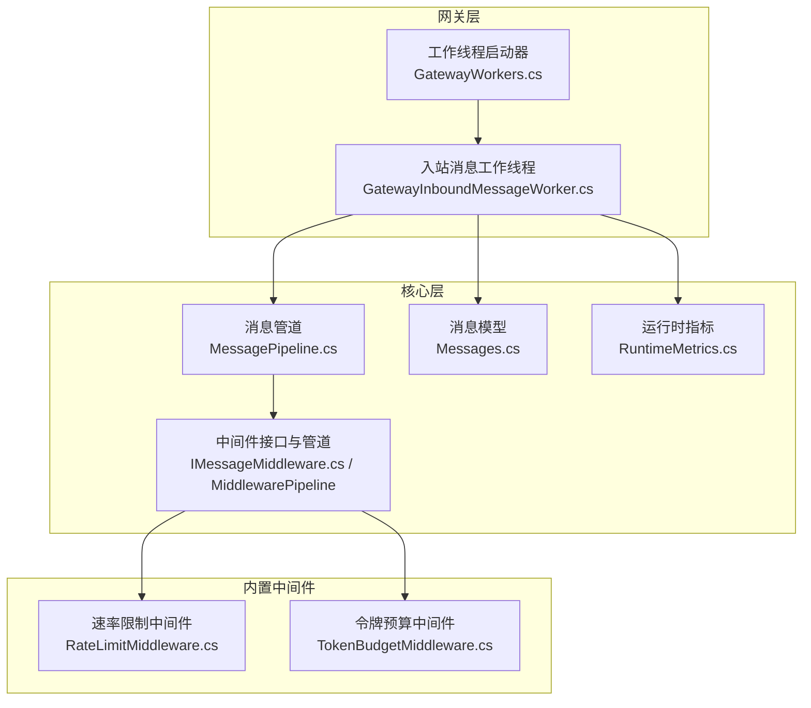
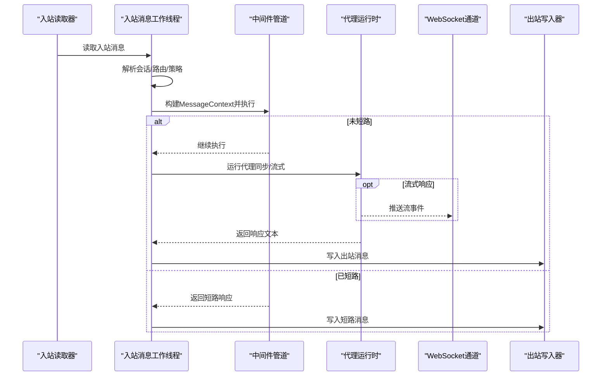
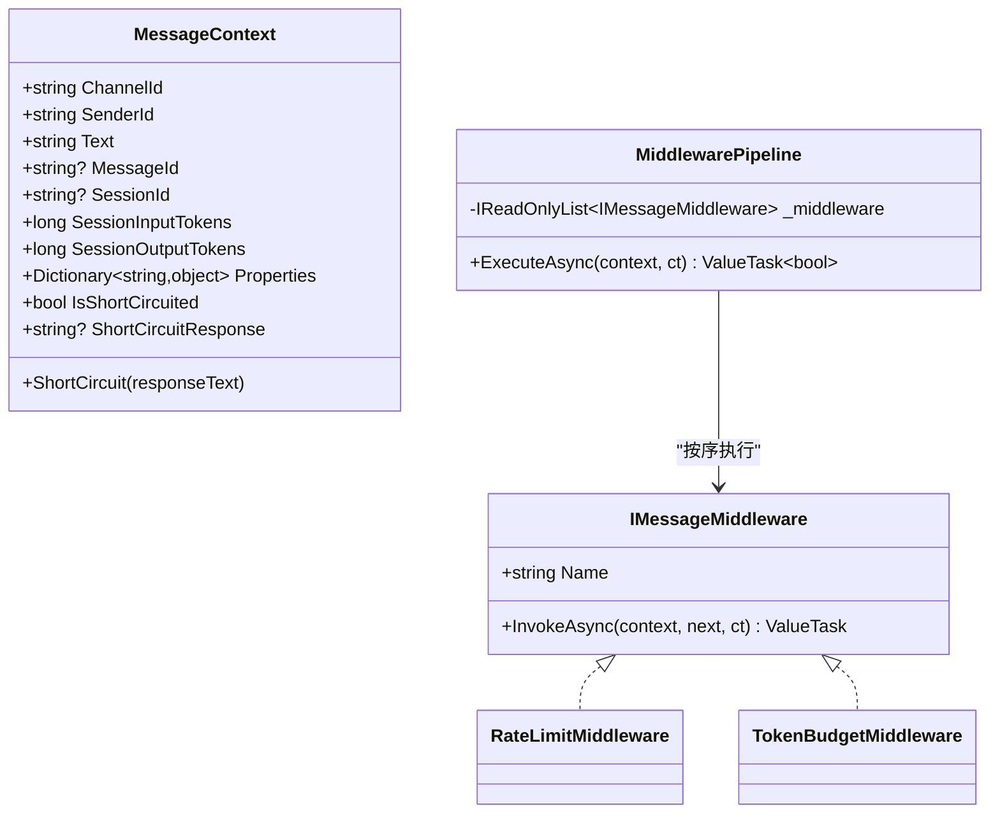
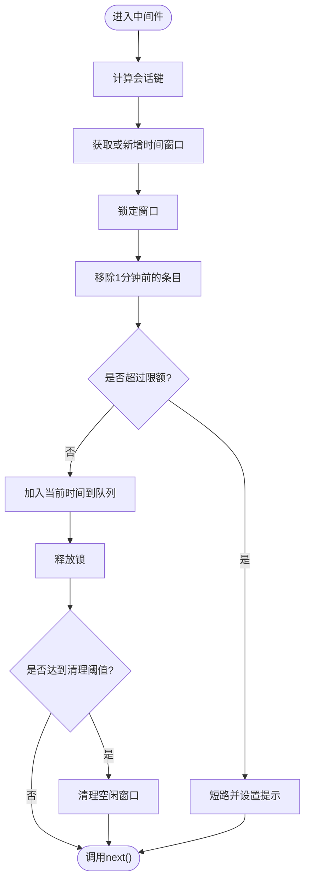
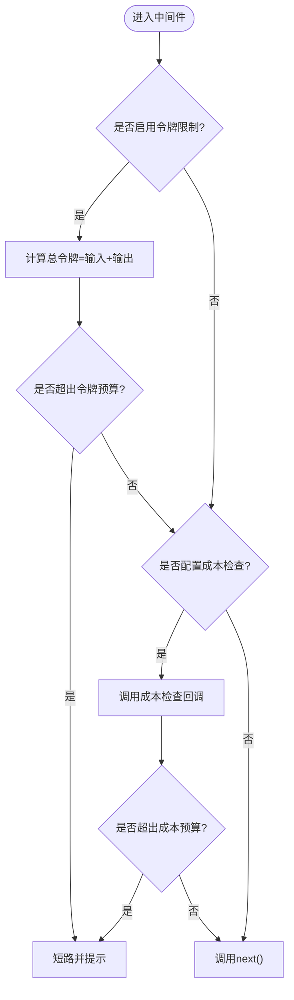
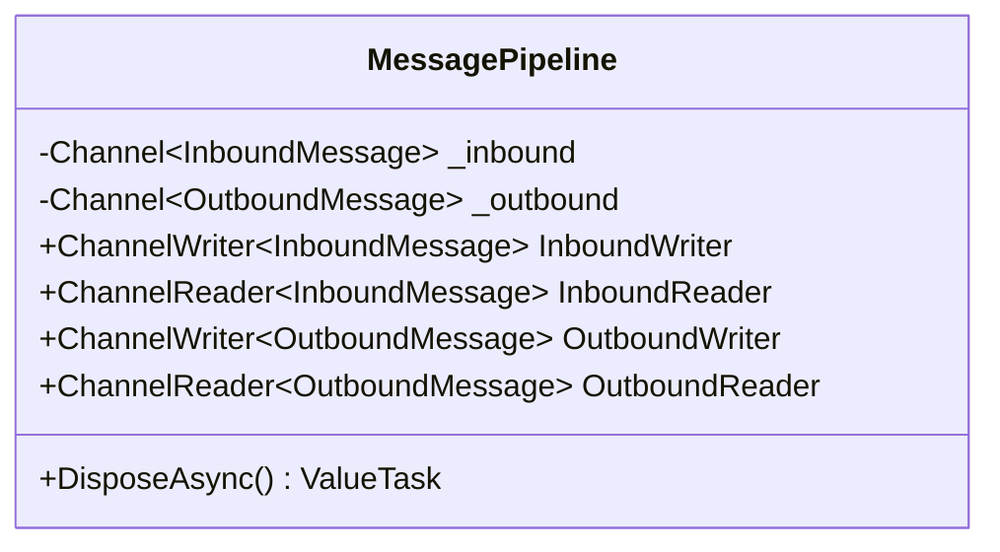
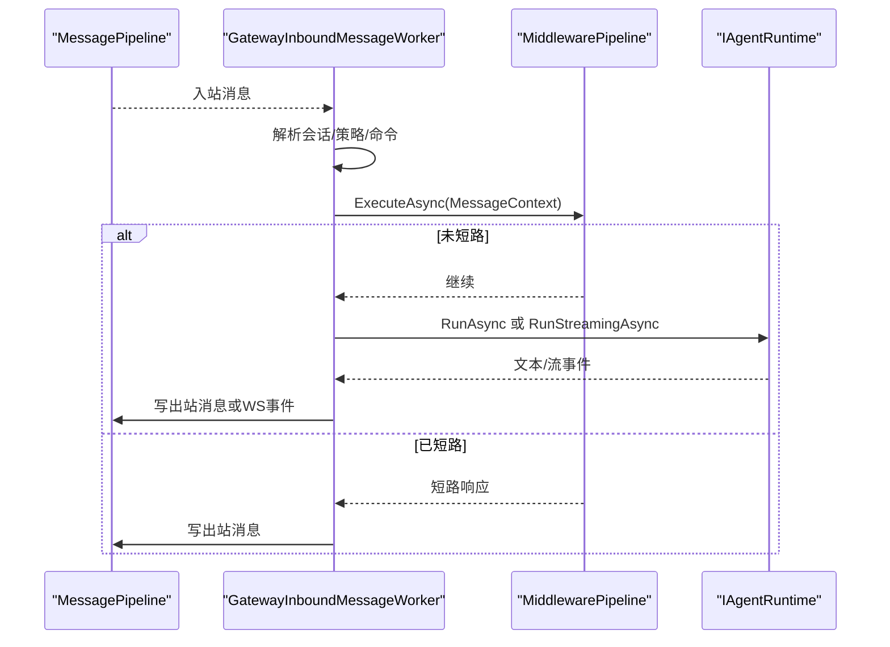
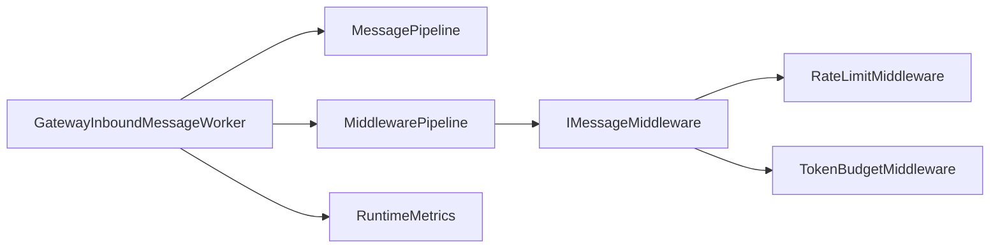

# 消息中间件

<cite>
**本文档引用的文件**
- [IMessageMiddleware.cs](file://src/OpenClaw.Core/Middleware/IMessageMiddleware.cs)
- [MessagePipeline.cs](file://src/OpenClaw.Core/Pipeline/MessagePipeline.cs)
- [RateLimitMiddleware.cs](file://src/OpenClaw.Core/Middleware/RateLimitMiddleware.cs)
- [TokenBudgetMiddleware.cs](file://src/OpenClaw.Core/Middleware/TokenBudgetMiddleware.cs)
- [Messages.cs](file://src/OpenClaw.Core/Models/Messages.cs)
- [GatewayInboundMessageWorker.cs](file://src/OpenClaw.Gateway/Extensions/GatewayInboundMessageWorker.cs)
- [GatewayWorkers.cs](file://src/OpenClaw.Gateway/Extensions/GatewayWorkers.cs)
- [RuntimeMetrics.cs](file://src/OpenClaw.Core/Observability/RuntimeMetrics.cs)
- [BeyondBaseTests.cs](file://src/OpenClaw.Tests/BeyondBaseTests.cs)
</cite>

## 目录
1. [简介](#简介)
2. [项目结构](#项目结构)
3. [核心组件](#核心组件)
4. [架构总览](#架构总览)
5. [详细组件分析](#详细组件分析)
6. [依赖关系分析](#依赖关系分析)
7. [性能考量](#性能考量)
8. [故障排查指南](#故障排查指南)
9. [结论](#结论)
10. [附录：自定义中间件开发指南](#附录自定义中间件开发指南)

## 简介
本文件面向消息中间件系统，聚焦消息处理管道、中间件接口与执行流程，系统性阐述消息预处理、后处理与错误处理机制，覆盖中间件注册、执行顺序与链式调用策略，并提供自定义中间件开发指南、性能监控与调试技巧。该系统采用基于 System.Threading.Channels 的高吞吐量消息通道，结合可组合的中间件管道，实现对入站消息的统一预处理与短路控制。

## 项目结构
消息中间件相关代码主要分布在以下模块：
- 核心中间件与管道：OpenClaw.Core/Middleware 与 OpenClaw.Core/Pipeline
- 网关入口与工作线程：OpenClaw.Gateway/Extensions
- 模型定义：OpenClaw.Core/Models
- 观测性指标：OpenClaw.Core/Observability
- 测试验证：OpenClaw.Tests

**图表来源**
- [GatewayWorkers.cs:18-83](file://src/OpenClaw.Gateway/Extensions/GatewayWorkers.cs#L18-L83)
- [GatewayInboundMessageWorker.cs:20-83](file://src/OpenClaw.Gateway/Extensions/GatewayInboundMessageWorker.cs#L20-L83)
- [MessagePipeline.cs:11-55](file://src/OpenClaw.Core/Pipeline/MessagePipeline.cs#L11-L55)
- [IMessageMiddleware.cs:44-96](file://src/OpenClaw.Core/Middleware/IMessageMiddleware.cs#L44-L96)
- [RateLimitMiddleware.cs:10-92](file://src/OpenClaw.Core/Middleware/RateLimitMiddleware.cs#L10-L92)
- [TokenBudgetMiddleware.cs:12-70](file://src/OpenClaw.Core/Middleware/TokenBudgetMiddleware.cs#L12-L70)
- [Messages.cs:6-61](file://src/OpenClaw.Core/Models/Messages.cs#L6-L61)
- [RuntimeMetrics.cs:10-312](file://src/OpenClaw.Core/Observability/RuntimeMetrics.cs#L10-L312)

**章节来源**
- [GatewayWorkers.cs:18-83](file://src/OpenClaw.Gateway/Extensions/GatewayWorkers.cs#L18-L83)
- [GatewayInboundMessageWorker.cs:20-83](file://src/OpenClaw.Gateway/Extensions/GatewayInboundMessageWorker.cs#L20-L83)
- [MessagePipeline.cs:11-55](file://src/OpenClaw.Core/Pipeline/MessagePipeline.cs#L11-L55)
- [IMessageMiddleware.cs:44-96](file://src/OpenClaw.Core/Middleware/IMessageMiddleware.cs#L44-L96)
- [RateLimitMiddleware.cs:10-92](file://src/OpenClaw.Core/Middleware/RateLimitMiddleware.cs#L10-L92)
- [TokenBudgetMiddleware.cs:12-70](file://src/OpenClaw.Core/Middleware/TokenBudgetMiddleware.cs#L12-L70)
- [Messages.cs:6-61](file://src/OpenClaw.Core/Models/Messages.cs#L6-L61)
- [RuntimeMetrics.cs:10-312](file://src/OpenClaw.Core/Observability/RuntimeMetrics.cs#L10-L312)

## 核心组件
- 中间件接口与上下文
  - MessageContext：承载消息元数据（渠道、发送者、会话、消息ID）与令牌统计，支持短路与属性传递。
  - IMessageMiddleware：定义中间件契约，包含名称与异步处理方法。
  - MiddlewarePipeline：按注册顺序执行中间件链，支持短路终止与后续链路跳过。
- 内置中间件
  - RateLimitMiddleware：基于会话的每分钟消息速率限制，带空闲清理。
  - TokenBudgetMiddleware：基于会话输入输出令牌总量与可选成本预算的限制。
- 消息管道
  - 基于 System.Threading.Channels 的有界通道，提供入站/出站读写器，具备背压与零分配特性。
- 网关工作线程
  - GatewayInboundMessageWorker：从入站通道读取消息，构建 MessageContext，执行中间件链，调用代理运行时，处理审批与自动化，最终写回出站通道或通过 WebSocket 流式返回。
  - GatewayWorkers：集中启动会话清理、入站处理与出站投递工作线程。

**章节来源**
- [IMessageMiddleware.cs:7-96](file://src/OpenClaw.Core/Middleware/IMessageMiddleware.cs#L7-L96)
- [RateLimitMiddleware.cs:10-92](file://src/OpenClaw.Core/Middleware/RateLimitMiddleware.cs#L10-L92)
- [TokenBudgetMiddleware.cs:12-70](file://src/OpenClaw.Core/Middleware/TokenBudgetMiddleware.cs#L12-L70)
- [MessagePipeline.cs:11-55](file://src/OpenClaw.Core/Pipeline/MessagePipeline.cs#L11-L55)
- [GatewayInboundMessageWorker.cs:20-83](file://src/OpenClaw.Gateway/Extensions/GatewayInboundMessageWorker.cs#L20-L83)
- [GatewayWorkers.cs:18-83](file://src/OpenClaw.Gateway/Extensions/GatewayWorkers.cs#L18-L83)

## 架构总览
消息在系统中的流转路径如下：
- 入站消息经由网关工作线程读取，构建会话与上下文。
- 执行中间件链：每个中间件可检查/修改上下文，或直接短路。
- 若未短路，进入代理运行时生成响应；若为 WebSocket 流式场景，则分段推送事件。
- 最终将结果写入出站通道或通过 WebSocket 发送。

**图表来源**
- [GatewayInboundMessageWorker.cs:410-456](file://src/OpenClaw.Gateway/Extensions/GatewayInboundMessageWorker.cs#L410-L456)
- [IMessageMiddleware.cs:72-95](file://src/OpenClaw.Core/Middleware/IMessageMiddleware.cs#L72-L95)
- [MessagePipeline.cs:30-33](file://src/OpenClaw.Core/Pipeline/MessagePipeline.cs#L30-L33)

**章节来源**
- [GatewayInboundMessageWorker.cs:410-456](file://src/OpenClaw.Gateway/Extensions/GatewayInboundMessageWorker.cs#L410-L456)
- [IMessageMiddleware.cs:72-95](file://src/OpenClaw.Core/Middleware/IMessageMiddleware.cs#L72-L95)
- [MessagePipeline.cs:30-33](file://src/OpenClaw.Core/Pipeline/MessagePipeline.cs#L30-L33)

## 详细组件分析

### 中间件接口与管道
- 设计要点
  - MessageContext 支持任意键值属性传递，避免额外对象分配。
  - 中间件可通过 ShortCircuit 直接中断后续链路，返回用户友好提示。
  - MiddlewarePipeline 使用闭包式 Next 函数实现链式调用，索引推进与短路检测在同一执行路径完成。
- 执行顺序与短路
  - 注册顺序即执行顺序；一旦发生短路，后续中间件不会被调用。
  - 单元测试覆盖了顺序、短路停止与文本转换等行为。

**图表来源**
- [IMessageMiddleware.cs:7-54](file://src/OpenClaw.Core/Middleware/IMessageMiddleware.cs#L7-L54)
- [IMessageMiddleware.cs:59-96](file://src/OpenClaw.Core/Middleware/IMessageMiddleware.cs#L59-L96)

**章节来源**
- [IMessageMiddleware.cs:7-54](file://src/OpenClaw.Core/Middleware/IMessageMiddleware.cs#L7-L54)
- [IMessageMiddleware.cs:59-96](file://src/OpenClaw.Core/Middleware/IMessageMiddleware.cs#L59-L96)
- [BeyondBaseTests.cs:319-354](file://src/OpenClaw.Tests/BeyondBaseTests.cs#L319-L354)

### 速率限制中间件（RateLimitMiddleware）
- 功能概述
  - 基于会话维度（渠道+发送者）维护时间窗口队列，限制每分钟消息数量。
  - 定期清理空闲窗口，降低内存占用。
  - 超限时通过 MessageContext.ShortCircuit 返回用户提示。
- 关键参数
  - 最大每分钟消息数、空闲 TTL、清理频率。
- 并发与清理
  - 使用锁保护队列操作；定期清理过期窗口。

**图表来源**
- [RateLimitMiddleware.cs:39-91](file://src/OpenClaw.Core/Middleware/RateLimitMiddleware.cs#L39-L91)

**章节来源**
- [RateLimitMiddleware.cs:10-92](file://src/OpenClaw.Core/Middleware/RateLimitMiddleware.cs#L10-L92)
- [BeyondBaseTests.cs:408-419](file://src/OpenClaw.Tests/BeyondBaseTests.cs#L408-L419)

### 令牌预算中间件（TokenBudgetMiddleware）
- 功能概述
  - 基于会话累计输入/输出令牌总量进行限制；超过阈值则短路。
  - 可选成本预算回调，按渠道/发送者维度检查 USD 成本上限。
- 集成点
  - 会话令牌统计由外部在每次回合后更新，中间件仅读取并校验。

**图表来源**
- [TokenBudgetMiddleware.cs:36-69](file://src/OpenClaw.Core/Middleware/TokenBudgetMiddleware.cs#L36-L69)

**章节来源**
- [TokenBudgetMiddleware.cs:12-70](file://src/OpenClaw.Core/Middleware/TokenBudgetMiddleware.cs#L12-L70)
- [BeyondBaseTests.cs:425-439](file://src/OpenClaw.Tests/BeyondBaseTests.cs#L425-L439)

### 消息管道（MessagePipeline）
- 特性
  - 使用有界通道，单读写器模式，支持背压防止内存溢出。
  - 提供入站/出站读写器；关闭时尝试清空死信并记录警告。
- 性能
  - 零分配设计，适合高吞吐场景。

**图表来源**
- [MessagePipeline.cs:11-55](file://src/OpenClaw.Core/Pipeline/MessagePipeline.cs#L11-L55)

**章节来源**
- [MessagePipeline.cs:11-55](file://src/OpenClaw.Core/Pipeline/MessagePipeline.cs#L11-L55)

### 网关入站消息工作线程（GatewayInboundMessageWorker）
- 主要职责
  - 从入站通道读取消息，解析会话与路由策略，构建 MessageContext。
  - 执行中间件链；若短路则直接返回提示；否则调用代理运行时。
  - 处理工具审批、自动化运行、心跳与学习观察等。
  - 支持 WebSocket 流式推送与普通文本回复。
- 错误处理
  - 捕获取消与异常，记录日志并可向自动化服务上报失败状态。
- 与观测性的集成
  - 记录令牌增量、工具调用次数、错误与重试等指标。

**图表来源**
- [GatewayInboundMessageWorker.cs:410-743](file://src/OpenClaw.Gateway/Extensions/GatewayInboundMessageWorker.cs#L410-L743)
- [IMessageMiddleware.cs:72-95](file://src/OpenClaw.Core/Middleware/IMessageMiddleware.cs#L72-L95)

**章节来源**
- [GatewayInboundMessageWorker.cs:410-743](file://src/OpenClaw.Gateway/Extensions/GatewayInboundMessageWorker.cs#L410-L743)

## 依赖关系分析
- 组件耦合
  - 网关工作线程依赖消息管道与中间件管道；中间件依赖 MessageContext。
  - 内置中间件彼此独立，仅依赖公共接口与上下文。
- 外部依赖
  - System.Threading.Channels 提供高性能通道。
  - 观测性指标通过 RuntimeMetrics 提供只增计数器与仪表盘可用快照。

**图表来源**
- [GatewayInboundMessageWorker.cs:20-83](file://src/OpenClaw.Gateway/Extensions/GatewayInboundMessageWorker.cs#L20-L83)
- [IMessageMiddleware.cs:44-96](file://src/OpenClaw.Core/Middleware/IMessageMiddleware.cs#L44-L96)
- [RuntimeMetrics.cs:10-312](file://src/OpenClaw.Core/Observability/RuntimeMetrics.cs#L10-L312)

**章节来源**
- [GatewayInboundMessageWorker.cs:20-83](file://src/OpenClaw.Gateway/Extensions/GatewayInboundMessageWorker.cs#L20-L83)
- [IMessageMiddleware.cs:44-96](file://src/OpenClaw.Core/Middleware/IMessageMiddleware.cs#L44-L96)
- [RuntimeMetrics.cs:10-312](file://src/OpenClaw.Core/Observability/RuntimeMetrics.cs#L10-L312)

## 性能考量
- 零分配与热路径优化
  - 中间件管道与上下文尽量减少临时分配；单元测试包含“每消息分配量”烟雾测试，确保回归。
- 通道容量与背压
  - 有界通道在高负载下自动背压，避免 OOM。
- 指标监控
  - RuntimeMetrics 提供只增计数器，便于健康检查与告警。
- 建议
  - 合理设置通道容量与中间件数量，避免长链路导致延迟。
  - 对高频中间件（如速率限制）使用高效数据结构与定期清理策略。

**章节来源**
- [BeyondBaseTests.cs:357-379](file://src/OpenClaw.Tests/BeyondBaseTests.cs#L357-L379)
- [MessagePipeline.cs:17-28](file://src/OpenClaw.Core/Pipeline/MessagePipeline.cs#L17-L28)
- [RuntimeMetrics.cs:10-312](file://src/OpenClaw.Core/Observability/RuntimeMetrics.cs#L10-L312)

## 故障排查指南
- 常见问题定位
  - 短路阻断：检查中间件链中是否有中间件触发 ShortCircuit，查看 MessageContext.ShortCircuitResponse。
  - 速率限制：确认会话键（渠道+发送者）是否正确，以及清理周期是否过长。
  - 令牌/成本超限：核对会话令牌统计更新逻辑与成本检查回调。
- 日志与可观测性
  - 网关工作线程捕获异常并记录详细上下文；RuntimeMetrics 提供运行时指标快照。
- 回滚与恢复
  - 通道关闭时会尝试清空死信并记录警告，便于排障。

**章节来源**
- [GatewayInboundMessageWorker.cs:745-800](file://src/OpenClaw.Gateway/Extensions/GatewayInboundMessageWorker.cs#L745-L800)
- [RuntimeMetrics.cs:10-312](file://src/OpenClaw.Core/Observability/RuntimeMetrics.cs#L10-L312)
- [MessagePipeline.cs:35-54](file://src/OpenClaw.Core/Pipeline/MessagePipeline.cs#L35-L54)

## 结论
该消息中间件系统以简洁的中间件接口与链式管道为核心，结合有界通道与可观测性指标，实现了高吞吐、低延迟且易于扩展的消息处理流水线。内置中间件覆盖速率限制与预算控制等关键能力，网关工作线程负责编排与错误处理，整体架构清晰、边界明确，适合在多渠道、多会话并发场景下稳定运行。

## 附录：自定义中间件开发指南
- 开发步骤
  - 实现 IMessageMiddleware 接口，提供 Name 与 InvokeAsync。
  - 在 InvokeAsync 中：
    - 可读取/修改 MessageContext.Text、Properties。
    - 如需短路，调用 context.ShortCircuit("提示文本")。
    - 调用 next() 将控制权交给下一个中间件。
  - 在网关启动阶段，将自定义中间件实例注入到 MiddlewarePipeline 构造函数中，从而参与链式执行。
- 注册与执行顺序
  - 中间件数组的顺序即执行顺序；短路后后续中间件不再执行。
- 性能建议
  - 避免在中间件中进行高分配操作；复用上下文属性而非创建新对象。
  - 对需要全局状态的中间件，考虑使用并发安全的数据结构与定期清理策略。
- 调试技巧
  - 利用单元测试验证顺序、短路与文本转换。
  - 通过 RuntimeMetrics 观察中间件对请求量、令牌与错误的影响。
  - 在网关工作线程中增加必要的日志点，定位异常分支。

**章节来源**
- [IMessageMiddleware.cs:44-54](file://src/OpenClaw.Core/Middleware/IMessageMiddleware.cs#L44-L54)
- [IMessageMiddleware.cs:72-95](file://src/OpenClaw.Core/Middleware/IMessageMiddleware.cs#L72-L95)
- [BeyondBaseTests.cs:319-354](file://src/OpenClaw.Tests/BeyondBaseTests.cs#L319-L354)
- [GatewayWorkers.cs:48-74](file://src/OpenClaw.Gateway/Extensions/GatewayWorkers.cs#L48-L74)