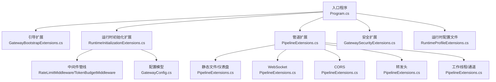
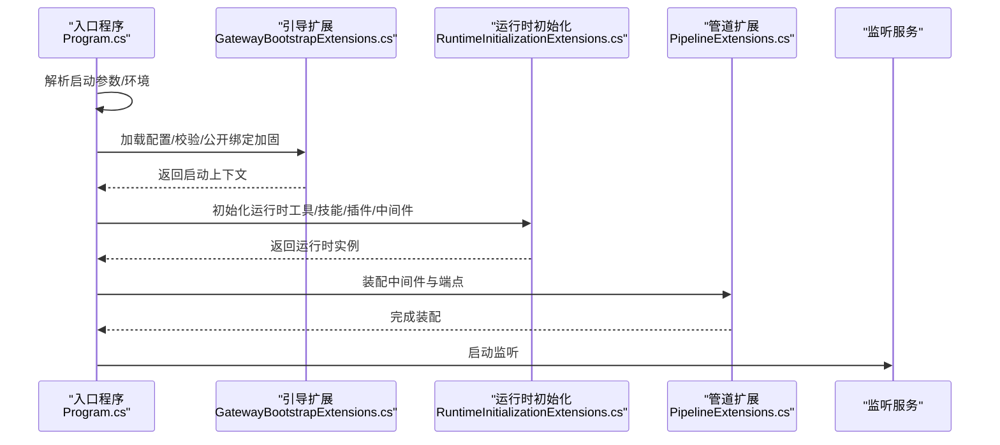
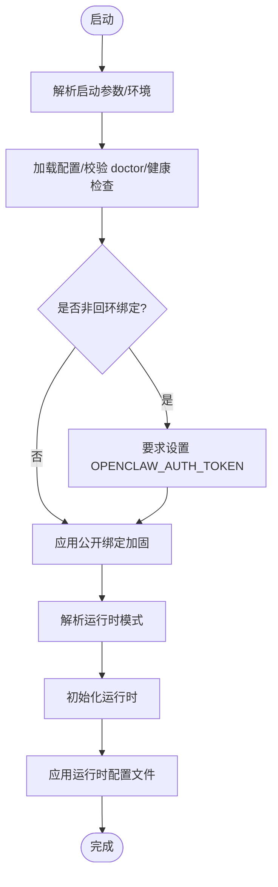
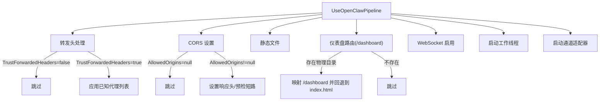
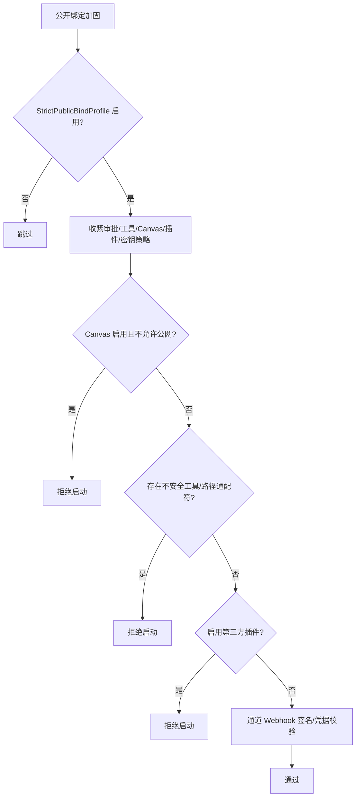
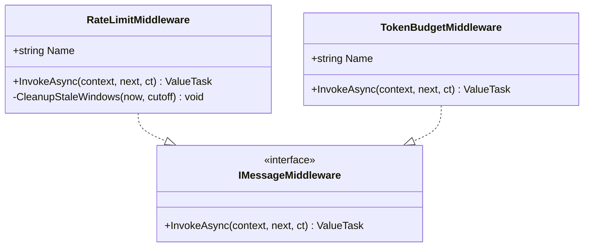
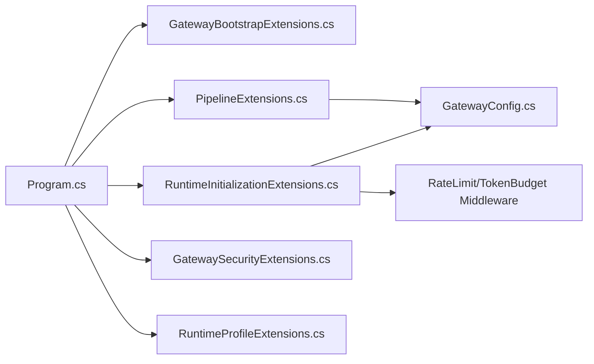

# 管道配置

<cite>
**本文引用的文件**
- [Program.cs](file://src/OpenClaw.Gateway/Program.cs)
- [PipelineExtensions.cs](file://src/OpenClaw.Gateway/Pipeline/PipelineExtensions.cs)
- [GatewayBootstrapExtensions.cs](file://src/OpenClaw.Gateway/Bootstrap/GatewayBootstrapExtensions.cs)
- [RuntimeInitializationExtensions.cs](file://src/OpenClaw.Gateway/Composition/RuntimeInitializationExtensions.cs)
- [GatewaySecurityExtensions.cs](file://src/OpenClaw.Gateway/Extensions/GatewaySecurityExtensions.cs)
- [GatewayConfig.cs](file://src/OpenClaw.Core/Models/GatewayConfig.cs)
- [RateLimitMiddleware.cs](file://src/OpenClaw.Core/Middleware/RateLimitMiddleware.cs)
- [TokenBudgetMiddleware.cs](file://src/OpenClaw.Core/Middleware/TokenBudgetMiddleware.cs)
- [RuntimeProfileExtensions.cs](file://src/OpenClaw.Gateway/Profiles/RuntimeProfileExtensions.cs)
</cite>

## 目录
1. [简介](#简介)
2. [项目结构](#项目结构)
3. [核心组件](#核心组件)
4. [架构总览](#架构总览)
5. [详细组件分析](#详细组件分析)
6. [依赖关系分析](#依赖关系分析)
7. [性能考量](#性能考量)
8. [故障排除指南](#故障排除指南)
9. [结论](#结论)
10. [附录：配置与最佳实践](#附录配置与最佳实践)

## 简介
本文件面向中间件管道配置系统，聚焦于网关启动与运行时初始化流程、管道链路装配、静态文件服务、WebSocket 配置、CORS 设置、转发头处理、管道链路配置、性能优化参数与调试配置。文档以代码为依据，提供可视化图示、分层讲解与实操建议，帮助读者快速理解并正确配置系统。

## 项目结构
- 入口程序负责解析启动参数、加载配置、构建服务容器、初始化运行时、装配中间件管道与端点映射，并启动监听。
- 管道扩展负责装配转发头、CORS、静态文件、仪表盘路由、WebSocket、工作线程与通道适配器。
- 启动引导扩展负责配置装载、校验、公开绑定加固策略与可选健康检查模式。
- 运行时初始化扩展负责解析工具集、技能、插件、代理注册、中间件管线与集成服务（如 Tailscale、mDNS）。
- 安全扩展提供严格公开绑定配置与硬性安全检查。
- 中间件模块提供会话级速率限制与令牌预算控制。
- 配置模型定义了所有可调参数，包括安全、WebSocket、工具、通道等。

**图表来源**
- [Program.cs:47-96](file://src/OpenClaw.Gateway/Program.cs#L47-L96)
- [PipelineExtensions.cs:18-86](file://src/OpenClaw.Gateway/Pipeline/PipelineExtensions.cs#L18-L86)
- [GatewayBootstrapExtensions.cs:18-135](file://src/OpenClaw.Gateway/Bootstrap/GatewayBootstrapExtensions.cs#L18-L135)
- [RuntimeInitializationExtensions.cs:35-242](file://src/OpenClaw.Gateway/Composition/RuntimeInitializationExtensions.cs#L35-L242)
- [GatewaySecurityExtensions.cs:11-317](file://src/OpenClaw.Gateway/Extensions/GatewaySecurityExtensions.cs#L11-L317)
- [GatewayConfig.cs:9-800](file://src/OpenClaw.Core/Models/GatewayConfig.cs#L9-L800)
- [RuntimeProfileExtensions.cs:8-21](file://src/OpenClaw.Gateway/Profiles/RuntimeProfileExtensions.cs#L8-L21)

**章节来源**
- [Program.cs:47-96](file://src/OpenClaw.Gateway/Program.cs#L47-L96)
- [PipelineExtensions.cs:18-86](file://src/OpenClaw.Gateway/Pipeline/PipelineExtensions.cs#L18-L86)

## 核心组件
- 入口与启动流程：解析启动参数、环境、配置装载与校验、构建服务、初始化运行时、装配中间件与端点、启动监听。
- 管道装配：转发头、CORS、静态文件、仪表盘路由、WebSocket、工作线程与通道适配器。
- 安全与公开绑定：严格公开绑定配置与硬性安全检查，拒绝不安全设置。
- 中间件：会话级速率限制与令牌预算控制，支持成本预算短路。
- 运行时配置文件：按运行时模式（AOT/JIT）应用配置文件。

**章节来源**
- [Program.cs:14-124](file://src/OpenClaw.Gateway/Program.cs#L14-L124)
- [PipelineExtensions.cs:18-86](file://src/OpenClaw.Gateway/Pipeline/PipelineExtensions.cs#L18-L86)
- [GatewaySecurityExtensions.cs:11-317](file://src/OpenClaw.Gateway/Extensions/GatewaySecurityExtensions.cs#L11-L317)
- [RateLimitMiddleware.cs:10-93](file://src/OpenClaw.Core/Middleware/RateLimitMiddleware.cs#L10-L93)
- [TokenBudgetMiddleware.cs:12-71](file://src/OpenClaw.Core/Middleware/TokenBudgetMiddleware.cs#L12-L71)
- [RuntimeProfileExtensions.cs:8-21](file://src/OpenClaw.Gateway/Profiles/RuntimeProfileExtensions.cs#L8-L21)

## 架构总览
下图展示从启动到运行的关键交互：入口程序 -> 引导扩展 -> 运行时初始化 -> 管道装配 -> 监听服务。

**图表来源**
- [Program.cs:47-96](file://src/OpenClaw.Gateway/Program.cs#L47-L96)
- [GatewayBootstrapExtensions.cs:18-135](file://src/OpenClaw.Gateway/Bootstrap/GatewayBootstrapExtensions.cs#L18-L135)
- [RuntimeInitializationExtensions.cs:35-242](file://src/OpenClaw.Gateway/Composition/RuntimeInitializationExtensions.cs#L35-L242)
- [PipelineExtensions.cs:18-86](file://src/OpenClaw.Gateway/Pipeline/PipelineExtensions.cs#L18-L86)

## 详细组件分析

### 启动与初始化流程
- 启动参数解析与快速启动恢复：支持交互式快速启动与启动失败恢复。
- 配置装载与校验：支持 doctor 模式、健康检查模式；非回环绑定要求鉴权令牌。
- 运行时模式解析与公开绑定加固：在非回环绑定场景强制更严格的安全策略。
- 运行时初始化：构建工具集、技能、插件、代理注册、中间件管线、集成服务（Tailscale、mDNS），并应用运行时配置文件。

**图表来源**
- [Program.cs:14-124](file://src/OpenClaw.Gateway/Program.cs#L14-L124)
- [GatewayBootstrapExtensions.cs:18-135](file://src/OpenClaw.Gateway/Bootstrap/GatewayBootstrapExtensions.cs#L18-L135)
- [RuntimeInitializationExtensions.cs:35-242](file://src/OpenClaw.Gateway/Composition/RuntimeInitializationExtensions.cs#L35-L242)
- [RuntimeProfileExtensions.cs:8-21](file://src/OpenClaw.Gateway/Profiles/RuntimeProfileExtensions.cs#L8-L21)

**章节来源**
- [Program.cs:14-124](file://src/OpenClaw.Gateway/Program.cs#L14-L124)
- [GatewayBootstrapExtensions.cs:18-135](file://src/OpenClaw.Gateway/Bootstrap/GatewayBootstrapExtensions.cs#L18-L135)
- [RuntimeInitializationExtensions.cs:35-242](file://src/OpenClaw.Gateway/Composition/RuntimeInitializationExtensions.cs#L35-L242)
- [RuntimeProfileExtensions.cs:8-21](file://src/OpenClaw.Gateway/Profiles/RuntimeProfileExtensions.cs#L8-L21)

### 管道装配与链路配置
- 转发头处理：仅当配置启用时，使用 X-Forwarded-For 与 X-Forwarded-Proto，并允许指定已知代理 IP 列表。
- CORS 设置：基于运行时允许的来源集合动态设置响应头，支持预检请求短路。
- 静态文件与仪表盘路由：默认启用静态文件；若存在仪表盘物理路径，则映射 /dashboard 子路径，支持 SPA 回退到 index.html。
- WebSocket：启用 WebSocket 并设置保活间隔。
- 工作线程与通道：根据 CPU 核数与上限选择工作线程数量，启动各通道适配器并记录最近发送者。

**图表来源**
- [PipelineExtensions.cs:18-86](file://src/OpenClaw.Gateway/Pipeline/PipelineExtensions.cs#L18-L86)
- [PipelineExtensions.cs:88-106](file://src/OpenClaw.Gateway/Pipeline/PipelineExtensions.cs#L88-L106)
- [PipelineExtensions.cs:108-136](file://src/OpenClaw.Gateway/Pipeline/PipelineExtensions.cs#L108-L136)
- [PipelineExtensions.cs:29-76](file://src/OpenClaw.Gateway/Pipeline/PipelineExtensions.cs#L29-L76)
- [PipelineExtensions.cs:78-81](file://src/OpenClaw.Gateway/Pipeline/PipelineExtensions.cs#L78-L81)
- [PipelineExtensions.cs:138-170](file://src/OpenClaw.Gateway/Pipeline/PipelineExtensions.cs#L138-L170)
- [PipelineExtensions.cs:172-215](file://src/OpenClaw.Gateway/Pipeline/PipelineExtensions.cs#L172-L215)

**章节来源**
- [PipelineExtensions.cs:18-86](file://src/OpenClaw.Gateway/Pipeline/PipelineExtensions.cs#L18-L86)

### 安全与公开绑定加固
- 严格公开绑定配置：在非回环绑定且启用严格模式时，收紧工具审批、Canvas、插件桥接与密钥存储策略。
- 硬性安全检查：对 Canvas、本地危险工具、第三方插件、各类通道 Webhook 的签名验证与凭据完整性进行强约束，必要时直接拒绝启动。

**图表来源**
- [GatewaySecurityExtensions.cs:11-27](file://src/OpenClaw.Gateway/Extensions/GatewaySecurityExtensions.cs#L11-L27)
- [GatewaySecurityExtensions.cs:29-218](file://src/OpenClaw.Gateway/Extensions/GatewaySecurityExtensions.cs#L29-L218)

**章节来源**
- [GatewaySecurityExtensions.cs:11-218](file://src/OpenClaw.Gateway/Extensions/GatewaySecurityExtensions.cs#L11-L218)

### 中间件与会话治理
- 速率限制中间件：按会话维度统计每分钟消息数，超过阈值则短路并提示。
- 令牌预算中间件：按会话输入输出令牌总量判断是否超限；可选回调用于 USD 成本预算控制。

**图表来源**
- [RateLimitMiddleware.cs:10-93](file://src/OpenClaw.Core/Middleware/RateLimitMiddleware.cs#L10-L93)
- [TokenBudgetMiddleware.cs:12-71](file://src/OpenClaw.Core/Middleware/TokenBudgetMiddleware.cs#L12-L71)

**章节来源**
- [RateLimitMiddleware.cs:10-93](file://src/OpenClaw.Core/Middleware/RateLimitMiddleware.cs#L10-L93)
- [TokenBudgetMiddleware.cs:12-71](file://src/OpenClaw.Core/Middleware/TokenBudgetMiddleware.cs#L12-L71)

### 配置模型与参数
- 基础配置：绑定地址、端口、鉴权令牌、运行时模式、会话并发与超时、优雅停机时间、令牌成本率。
- 安全配置：严格公开绑定、允许来源、信任转发头、已知代理、HTTP 工具审批请求者匹配、公网允许的不安全工具/插件/原始密钥引用。
- WebSocket 配置：最大消息字节、连接数、每 IP 连接数、每连接每分钟消息数、接收超时。
- 工具与执行：自主模式、工作区限制、路径白名单/黑名单、工具超时、并行执行、审批策略、浏览器工具安全策略。
- 通道配置：短信、Telegram、WhatsApp、Teams、Slack、Discord、Signal、飞书、钉钉、企业微信等通道的 Webhook 路径、签名验证、凭据与限额。
- 插件与技能：插件启用、技能根目录、资源读取大小限制等。

**章节来源**
- [GatewayConfig.cs:9-800](file://src/OpenClaw.Core/Models/GatewayConfig.cs#L9-L800)

## 依赖关系分析
- 入口程序依赖引导扩展进行配置装载与校验，依赖运行时初始化扩展构建运行时，依赖管道扩展装配中间件与端点。
- 管道扩展依赖配置模型中的安全与 WebSocket 设置，依赖运行时提供的允许来源集合实现 CORS。
- 中间件模块独立于具体运行时，但被运行时初始化扩展注入到中间件管线中。
- 运行时配置文件根据运行时模式（AOT/JIT）决定具体的服务配置。

**图表来源**
- [Program.cs:47-96](file://src/OpenClaw.Gateway/Program.cs#L47-L96)
- [GatewayBootstrapExtensions.cs:18-135](file://src/OpenClaw.Gateway/Bootstrap/GatewayBootstrapExtensions.cs#L18-L135)
- [RuntimeInitializationExtensions.cs:35-242](file://src/OpenClaw.Gateway/Composition/RuntimeInitializationExtensions.cs#L35-L242)
- [PipelineExtensions.cs:18-86](file://src/OpenClaw.Gateway/Pipeline/PipelineExtensions.cs#L18-L86)
- [GatewayConfig.cs:9-800](file://src/OpenClaw.Core/Models/GatewayConfig.cs#L9-L800)
- [GatewaySecurityExtensions.cs:11-317](file://src/OpenClaw.Gateway/Extensions/GatewaySecurityExtensions.cs#L11-L317)
- [RuntimeProfileExtensions.cs:8-21](file://src/OpenClaw.Gateway/Profiles/RuntimeProfileExtensions.cs#L8-L21)

**章节来源**
- [Program.cs:47-96](file://src/OpenClaw.Gateway/Program.cs#L47-L96)
- [GatewayBootstrapExtensions.cs:18-135](file://src/OpenClaw.Gateway/Bootstrap/GatewayBootstrapExtensions.cs#L18-L135)
- [RuntimeInitializationExtensions.cs:35-242](file://src/OpenClaw.Gateway/Composition/RuntimeInitializationExtensions.cs#L35-L242)
- [PipelineExtensions.cs:18-86](file://src/OpenClaw.Gateway/Pipeline/PipelineExtensions.cs#L18-L86)

## 性能考量
- 工作线程数量：根据 CPU 核数与上限（最多 4）自动选择，兼顾吞吐与资源占用。
- 速率限制：按会话维度的每分钟消息数限制，避免突发流量冲击。
- 令牌预算：按输入+输出令牌总量限制会话规模，防止长对话无限增长。
- WebSocket：合理设置最大消息大小、连接数与每连接速率，避免资源耗尽。
- 静态文件与仪表盘：仅在存在物理目录时启用映射，避免不必要的 IO 开销。
- 运行时模式：AOT/JIT 模式影响编译与运行特性，应结合部署环境选择。

**章节来源**
- [PipelineExtensions.cs:138-170](file://src/OpenClaw.Gateway/Pipeline/PipelineExtensions.cs#L138-L170)
- [RateLimitMiddleware.cs:18-37](file://src/OpenClaw.Core/Middleware/RateLimitMiddleware.cs#L18-L37)
- [TokenBudgetMiddleware.cs:20-34](file://src/OpenClaw.Core/Middleware/TokenBudgetMiddleware.cs#L20-L34)
- [GatewayConfig.cs:386-393](file://src/OpenClaw.Core/Models/GatewayConfig.cs#L386-L393)

## 故障排除指南
- 启动失败与恢复
  - 快速启动：若上次启动失败，可尝试交互式快速启动恢复。
  - Doctor 模式：打印配置来源诊断信息，便于定位冲突或错误。
  - 健康检查：支持 --health-check 参数进行快速健康探测。
- 非回环绑定必须设置鉴权令牌
  - 若绑定到非回环地址且未设置鉴权令牌，将抛出异常或退出码 1。
- 公开绑定加固拒绝启动
  - 当存在不安全工具/路径通配符、启用第三方插件桥接、Canvas 在公网启用且未显式允许等情况，将直接拒绝启动。
- CORS 无效
  - 确认 AllowedOrigins 已在运行时配置并生效；预检请求将被短路返回 204。
- 转发头未生效
  - 确认 TrustForwardedHeaders 已启用，并正确配置 KnownProxies。
- WebSocket 连接异常
  - 检查最大消息大小、连接数与每连接速率限制；确认保活间隔设置合理。
- 速率限制触发
  - 调整 GatewayConfig 中的会话速率限制参数，或降低客户端发送频率。
- 令牌预算触发
  - 调整会话令牌上限或成本预算回调逻辑，或引导用户开启新会话。

**章节来源**
- [Program.cs:22-28](file://src/OpenClaw.Gateway/Program.cs#L22-L28)
- [Program.cs:99-122](file://src/OpenClaw.Gateway/Program.cs#L99-L122)
- [GatewayBootstrapExtensions.cs:38-63](file://src/OpenClaw.Gateway/Bootstrap/GatewayBootstrapExtensions.cs#L38-L63)
- [GatewaySecurityExtensions.cs:29-218](file://src/OpenClaw.Gateway/Extensions/GatewaySecurityExtensions.cs#L29-L218)
- [PipelineExtensions.cs:88-106](file://src/OpenClaw.Gateway/Pipeline/PipelineExtensions.cs#L88-L106)
- [RateLimitMiddleware.cs:52-58](file://src/OpenClaw.Core/Middleware/RateLimitMiddleware.cs#L52-L58)
- [TokenBudgetMiddleware.cs:42-50](file://src/OpenClaw.Core/Middleware/TokenBudgetMiddleware.cs#L42-L50)

## 结论
该中间件管道配置系统通过“启动引导 -> 运行时初始化 -> 管道装配”的清晰分层，实现了从配置装载、安全加固到中间件与端点装配的完整生命周期管理。转发头、CORS、静态文件与仪表盘、WebSocket、工作线程与通道适配器均在管道扩展中集中配置，配合速率限制与令牌预算中间件，形成完整的会话治理能力。建议在生产环境中启用严格公开绑定策略与鉴权令牌，并根据业务负载调整速率限制与 WebSocket 参数。

## 附录：配置与最佳实践
- 启动参数与环境变量
  - 支持 --config 指定额外配置文件；支持 OPENCLAW_AUTH_TOKEN、MODEL_PROVIDER_KEY、MODEL_PROVIDER_MODEL、MODEL_PROVIDER_ENDPOINT 等环境变量覆盖。
- 公开绑定最佳实践
  - 启用 StrictPublicBindProfile；关闭 Canvas 在公网的默认启用；限制工具审批范围；禁止第三方插件桥接；禁用原始密钥引用；确保各通道 Webhook 的签名与凭据完整。
- 管道参数建议
  - 转发头：仅在受信代理后启用，配置 KnownProxies。
  - CORS：明确 AllowedOrigins，避免通配符；预检短路减少往返。
  - 静态文件：仅在需要时启用仪表盘映射。
  - WebSocket：根据业务峰值设置最大消息与连接数，合理设置保活。
- 中间件参数建议
  - 速率限制：按会话维度设置每分钟消息上限，避免突发流量。
  - 令牌预算：根据模型定价与合同预算设置上限，必要时启用成本预算回调。
- 运行时配置文件
  - 根据部署环境选择 AOT 或 JIT 模式，确保编译与运行特性满足需求。

**章节来源**
- [GatewayBootstrapExtensions.cs:173-217](file://src/OpenClaw.Gateway/Bootstrap/GatewayBootstrapExtensions.cs#L173-L217)
- [GatewaySecurityExtensions.cs:11-27](file://src/OpenClaw.Gateway/Extensions/GatewaySecurityExtensions.cs#L11-L27)
- [PipelineExtensions.cs:88-106](file://src/OpenClaw.Gateway/Pipeline/PipelineExtensions.cs#L88-L106)
- [GatewayConfig.cs:331-393](file://src/OpenClaw.Core/Models/GatewayConfig.cs#L331-L393)
- [RateLimitMiddleware.cs:18-37](file://src/OpenClaw.Core/Middleware/RateLimitMiddleware.cs#L18-L37)
- [TokenBudgetMiddleware.cs:20-34](file://src/OpenClaw.Core/Middleware/TokenBudgetMiddleware.cs#L20-L34)
- [RuntimeProfileExtensions.cs:8-21](file://src/OpenClaw.Gateway/Profiles/RuntimeProfileExtensions.cs#L8-L21)