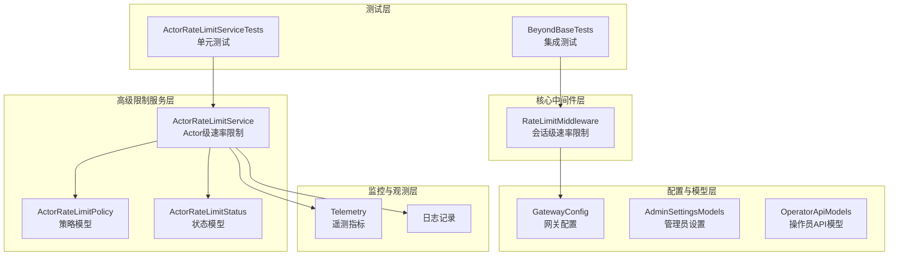
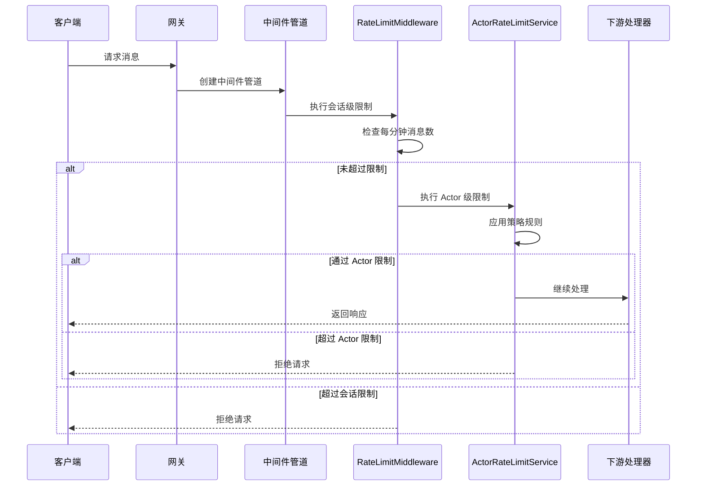
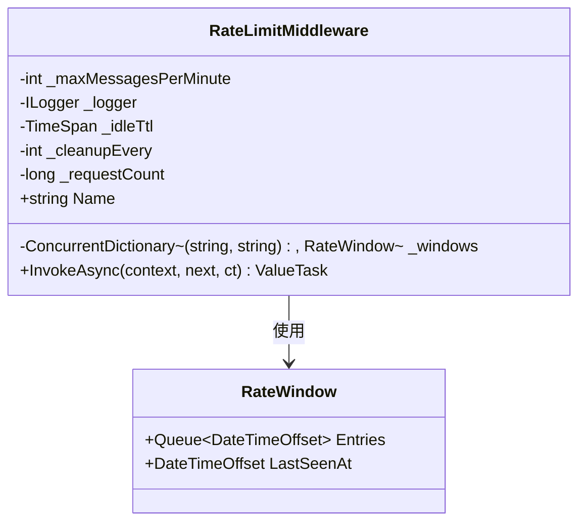
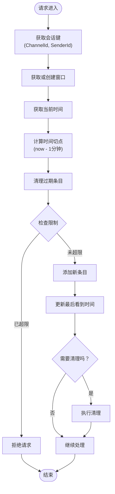
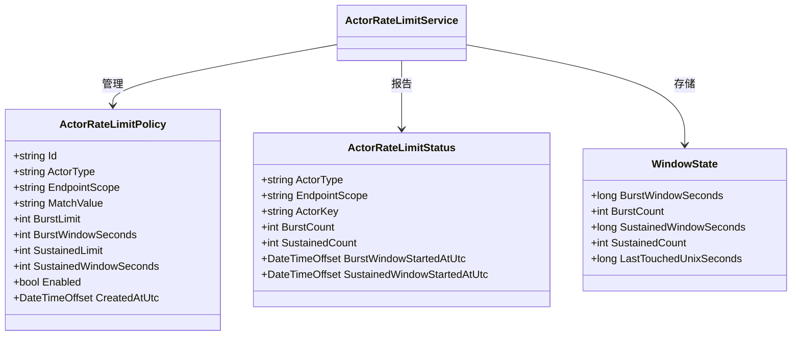
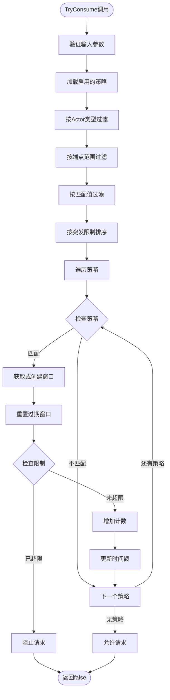
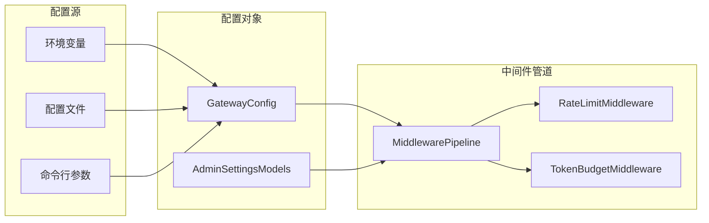
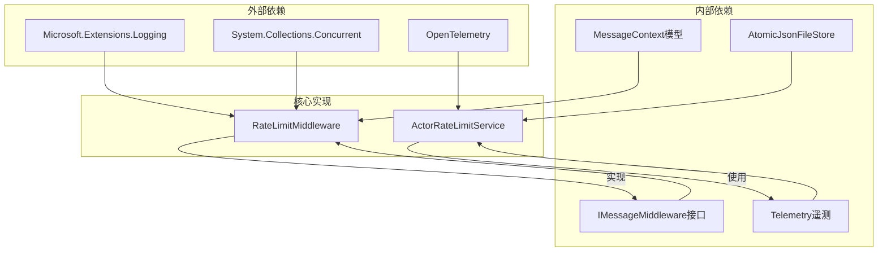

# 速率限制中间件

<cite>
**本文档引用的文件**
- [RateLimitMiddleware.cs](file://src/OpenClaw.Core/Middleware/RateLimitMiddleware.cs)
- [ActorRateLimitService.cs](file://src/OpenClaw.Gateway/ActorRateLimitService.cs)
- [OperatorApiModels.cs](file://src/OpenClaw.Core/Models/OperatorApiModels.cs)
- [GatewayConfig.cs](file://src/OpenClaw.Core/Models/GatewayConfig.cs)
- [AdminSettingsModels.cs](file://src/OpenClaw.Core/Models/AdminSettingsModels.cs)
- [RuntimeInitializationExtensions.RuntimeFactories.cs](file://src/OpenClaw.Gateway/Composition/RuntimeInitializationExtensions.RuntimeFactories.cs)
- [Telemetry.cs](file://src/OpenClaw.Core/Observability/Telemetry.cs)
- [ActorRateLimitServiceTests.cs](file://src/OpenClaw.Tests/ActorRateLimitServiceTests.cs)
- [BeyondBaseTests.cs](file://src/OpenClaw.Tests/BeyondBaseTests.cs)
- [ConfigValidator.cs](file://src/OpenClaw.Core/Validation/ConfigValidator.cs)
</cite>

## 目录
1. [简介](#简介)
2. [项目结构](#项目结构)
3. [核心组件](#核心组件)
4. [架构概览](#架构概览)
5. [详细组件分析](#详细组件分析)
6. [依赖关系分析](#依赖关系分析)
7. [性能考虑](#性能考虑)
8. [故障排除指南](#故障排除指南)
9. [结论](#结论)
10. [附录](#附录)

## 简介

本文件为 OpenClaw 项目中的速率限制中间件提供全面的技术文档。该系统实现了多层次的速率限制机制，包括基于会话的简单速率限制（RateLimitMiddleware）和基于 Actor 的高级速率限制（ActorRateLimitService）。这些组件共同提供了灵活而强大的流量控制能力，支持 IP 地址限制、用户级别限制和 API 端点级别的限制策略。

速率限制中间件采用滑动窗口算法，结合突发流量处理和空闲清理机制，确保在高并发场景下的稳定性和准确性。系统还集成了完整的监控指标和日志记录功能，便于运维人员进行性能监控和问题诊断。

## 项目结构

速率限制相关的核心文件分布如下：



**图表来源**
- [RateLimitMiddleware.cs:1-93](file://src/OpenClaw.Core/Middleware/RateLimitMiddleware.cs#L1-L93)
- [ActorRateLimitService.cs:1-282](file://src/OpenClaw.Gateway/ActorRateLimitService.cs#L1-L282)
- [OperatorApiModels.cs:669-698](file://src/OpenClaw.Core/Models/OperatorApiModels.cs#L669-L698)

**章节来源**
- [RateLimitMiddleware.cs:1-93](file://src/OpenClaw.Core/Middleware/RateLimitMiddleware.cs#L1-L93)
- [ActorRateLimitService.cs:1-282](file://src/OpenClaw.Gateway/ActorRateLimitService.cs#L1-L282)

## 核心组件

### RateLimitMiddleware（会话级速率限制）

RateLimitMiddleware 是一个轻量级的速率限制中间件，专门用于控制每个会话的消息发送频率。它基于每分钟消息数量进行限制，并使用滑动窗口算法确保精确的限流效果。

**主要特性：**
- 基于会话的独立限制（ChannelId + SenderId）
- 每分钟消息数限制
- 自动清理过期窗口
- 空闲超时管理
- 可配置的清理频率

### ActorRateLimitService（Actor级高级速率限制）

ActorRateLimitService 提供了更复杂的速率限制机制，支持多种 Actor 类型、端点范围和匹配条件。该服务实现了突发限制和持续限制的双重保护机制。

**主要特性：**
- 多 Actor 类型支持（IP、用户、API 密钥等）
- 端点范围隔离（特定 API 端点或通配符）
- 匹配值过滤（针对特定 Actor 的精确匹配）
- 突发限制和持续限制双重保护
- 动态策略管理
- 状态快照和监控

**章节来源**
- [RateLimitMiddleware.cs:10-37](file://src/OpenClaw.Core/Middleware/RateLimitMiddleware.cs#L10-L37)
- [ActorRateLimitService.cs:9-40](file://src/OpenClaw.Gateway/ActorRateLimitService.cs#L9-L40)

## 架构概览

速率限制系统的整体架构采用分层设计，从简单的会话级限制到复杂的 Actor 级限制，形成了完整的流量控制体系。



**图表来源**
- [RuntimeInitializationExtensions.RuntimeFactories.cs:325-344](file://src/OpenClaw.Gateway/Composition/RuntimeInitializationExtensions.RuntimeFactories.cs#L325-L344)
- [RateLimitMiddleware.cs:39-68](file://src/OpenClaw.Core/Middleware/RateLimitMiddleware.cs#L39-L68)
- [ActorRateLimitService.cs:92-148](file://src/OpenClaw.Gateway/ActorRateLimitService.cs#L92-L148)

## 详细组件分析

### RateLimitMiddleware 实现分析

#### 数据结构设计



**图表来源**
- [RateLimitMiddleware.cs:10-37](file://src/OpenClaw.Core/Middleware/RateLimitMiddleware.cs#L10-L37)
- [RateLimitMiddleware.cs:12-16](file://src/OpenClaw.Core/Middleware/RateLimitMiddleware.cs#L12-L16)

#### 核心算法流程



**图表来源**
- [RateLimitMiddleware.cs:39-68](file://src/OpenClaw.Core/Middleware/RateLimitMiddleware.cs#L39-L68)
- [RateLimitMiddleware.cs:70-91](file://src/OpenClaw.Core/Middleware/RateLimitMiddleware.cs#L70-L91)

#### 配置参数详解

| 参数名称 | 类型 | 默认值 | 描述 |
|---------|------|--------|------|
| maxMessagesPerMinute | int | 必需 | 每分钟最大消息数限制 |
| logger | ILogger | null | 日志记录器实例 |
| idleTtl | TimeSpan | 10分钟 | 空闲窗口超时时间 |
| cleanupEvery | int | 256 | 清理频率（每 N 次请求清理一次） |

**章节来源**
- [RateLimitMiddleware.cs:27-37](file://src/OpenClaw.Core/Middleware/RateLimitMiddleware.cs#L27-L37)

### ActorRateLimitService 实现分析

#### 策略模型设计



**图表来源**
- [OperatorApiModels.cs:669-698](file://src/OpenClaw.Core/Models/OperatorApiModels.cs#L669-L698)
- [ActorRateLimitService.cs:15-22](file://src/OpenClaw.Gateway/ActorRateLimitService.cs#L15-L22)

#### 限制策略算法



**图表来源**
- [ActorRateLimitService.cs:92-148](file://src/OpenClaw.Gateway/ActorRateLimitService.cs#L92-L148)
- [ActorRateLimitService.cs:195-201](file://src/OpenClaw.Gateway/ActorRateLimitService.cs#L195-L201)

#### 策略配置示例

| 策略类型 | Actor类型 | 端点范围 | 匹配值 | 突发限制 | 持续限制 | 说明 |
|---------|----------|---------|-------|---------|---------|------|
| IP限制 | ip | chat | 10.0.0.1 | 3次/60秒 | 100次/300秒 | 针对特定IP的聊天限制 |
| 用户限制 | user | api | john_doe | 10次/60秒 | 50次/300秒 | 针对特定用户的API访问限制 |
| API密钥限制 | api_key | * | null | 100次/60秒 | 1000次/300秒 | 通用API密钥限制 |
| 管理员限制 | admin | */admin | null | 1000次/60秒 | 无限 | 管理员特殊权限 |

**章节来源**
- [ActorRateLimitServiceTests.cs:25-47](file://src/OpenClaw.Tests/ActorRateLimitServiceTests.cs#L25-L47)
- [ActorRateLimitServiceTests.cs:49-71](file://src/OpenClaw.Tests/ActorRateLimitServiceTests.cs#L49-L71)

### 集成与配置

#### 网关配置集成



**图表来源**
- [RuntimeInitializationExtensions.RuntimeFactories.cs:325-344](file://src/OpenClaw.Gateway/Composition/RuntimeInitializationExtensions.RuntimeFactories.cs#L325-L344)
- [GatewayConfig.cs:62-63](file://src/OpenClaw.Core/Models/GatewayConfig.cs#L62-L63)

#### 配置参数说明

| 配置项 | 类型 | 默认值 | 描述 |
|-------|------|--------|------|
| SessionRateLimitPerMinute | int | 0 | 会话级速率限制（0表示禁用） |
| RateLimitPerFromPerMinute | int | 30 | 每个来源的速率限制 |
| 其他相关配置 | - | - | 包括连接数限制、消息大小限制等 |

**章节来源**
- [GatewayConfig.cs:62-63](file://src/OpenClaw.Core/Models/GatewayConfig.cs#L62-L63)
- [GatewayConfig.cs:708](file://src/OpenClaw.Core/Models/GatewayConfig.cs#L708)

## 依赖关系分析

速率限制中间件的依赖关系相对简洁，主要依赖于核心的中间件框架和配置系统。



**图表来源**
- [RateLimitMiddleware.cs:1-3](file://src/OpenClaw.Core/Middleware/RateLimitMiddleware.cs#L1-L3)
- [ActorRateLimitService.cs:1-6](file://src/OpenClaw.Gateway/ActorRateLimitService.cs#L1-L6)

**章节来源**
- [RateLimitMiddleware.cs:1-3](file://src/OpenClaw.Core/Middleware/RateLimitMiddleware.cs#L1-L3)
- [ActorRateLimitService.cs:1-6](file://src/OpenClaw.Gateway/ActorRateLimitService.cs#L1-L6)

## 性能考虑

### 时间复杂度分析

- **RateLimitMiddleware**: O(n) - n为当前窗口内的消息数量，通常很小
- **ActorRateLimitService**: O(p) - p为匹配的策略数量，通常较少
- **内存使用**: O(w) - w为活跃窗口数量，受空闲清理机制控制

### 内存管理策略

1. **自动清理**: 每 N 次请求触发一次清理操作
2. **空闲超时**: 超过空闲时间的窗口会被移除
3. **过期条目**: 滑动窗口自动移除过期的消息条目

### 并发安全性

- 使用 `ConcurrentDictionary` 确保线程安全
- 关键操作使用 `lock` 语句保护共享状态
- 原子性操作确保数据一致性

## 故障排除指南

### 常见问题及解决方案

#### 问题1：请求被意外拒绝
**症状**: 正常的请求被拒绝，提示"发送消息太快"
**可能原因**:
- 会话级限制过于严格
- 窗口清理机制导致误判
- 配置参数设置不当

**解决方案**:
1. 检查 `SessionRateLimitPerMinute` 配置
2. 调整 `idleTtl` 和 `cleanupEvery` 参数
3. 查看日志中的警告信息

#### 问题2：Actor 级限制不生效
**症状**: 自定义的 Actor 限制策略没有起到作用
**可能原因**:
- 策略配置错误
- Actor 类型不匹配
- 端点范围设置不当

**解决方案**:
1. 验证策略 ID 和 Actor 类型
2. 检查端点范围是否正确
3. 确认匹配值设置

#### 问题3：内存泄漏或性能下降
**症状**: 系统运行一段时间后性能明显下降
**可能原因**:
- 窗口清理机制失效
- 过多的活跃窗口
- 配置参数不当

**解决方案**:
1. 检查清理频率配置
2. 监控活跃窗口数量
3. 调整空闲超时时间

**章节来源**
- [ActorRateLimitServiceTests.cs:118-140](file://src/OpenClaw.Tests/ActorRateLimitServiceTests.cs#L118-L140)
- [BeyondBaseTests.cs:385-419](file://src/OpenClaw.Tests/BeyondBaseTests.cs#L385-L419)

## 结论

OpenClaw 项目的速率限制中间件系统提供了完整而灵活的流量控制解决方案。通过会话级和 Actor 级两个层次的限制机制，系统能够满足从简单到复杂的各种速率限制需求。

**主要优势**:
1. **多层次保护**: 同时提供会话级和 Actor 级限制
2. **灵活配置**: 支持多种 Actor 类型和匹配策略
3. **性能优化**: 采用高效的滑动窗口算法和自动清理机制
4. **可观测性**: 完整的监控指标和日志记录
5. **易于集成**: 与现有中间件管道无缝集成

**适用场景**:
- 高并发 Web 服务
- API 网关流量控制
- 即时通讯应用
- 游戏服务器
- 任何需要精确流量控制的应用

## 附录

### 配置示例

#### 基础配置示例
```json
{
  "SessionRateLimitPerMinute": 60,
  "RateLimitPerFromPerMinute": 30
}
```

#### 高级策略配置示例
```json
{
  "policies": [
    {
      "id": "ip-chat-limit",
      "actorType": "ip",
      "endpointScope": "chat",
      "matchValue": "10.0.0.1",
      "burstLimit": 3,
      "burstWindowSeconds": 60,
      "sustainedLimit": 100,
      "sustainedWindowSeconds": 300,
      "enabled": true
    }
  ]
}
```

### 监控指标

| 指标名称 | 类型 | 描述 | 标签 |
|---------|------|------|------|
| openclaw.ratelimit.exceeded | Counter | 被速率限制阻止的请求数量 | actor.type, policy.id, endpoint.scope |
| openclaw.tool.execution.duration | Histogram | 工具执行持续时间 | tool.name, success |

### 最佳实践

1. **合理设置限制**: 根据业务需求和服务器性能设置合适的限制值
2. **监控关键指标**: 定期检查速率限制触发次数和成功率
3. **渐进式部署**: 从宽松限制开始，逐步收紧到生产水平
4. **定期审查**: 定期审查和调整策略配置
5. **备份策略**: 确保策略配置的持久化和备份