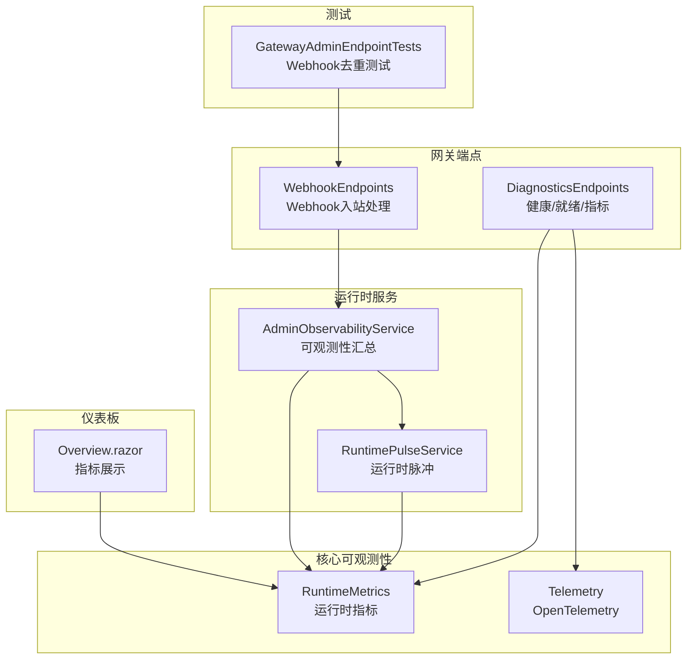
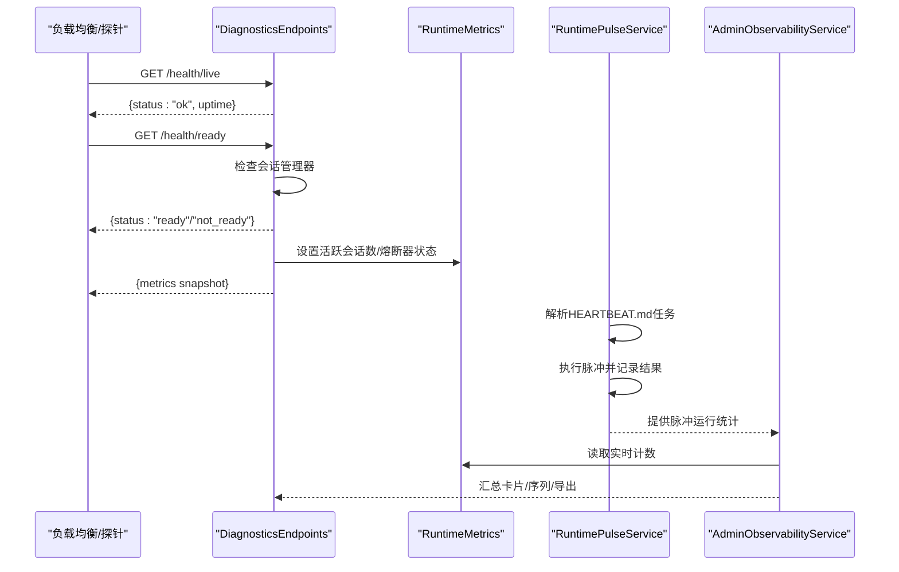
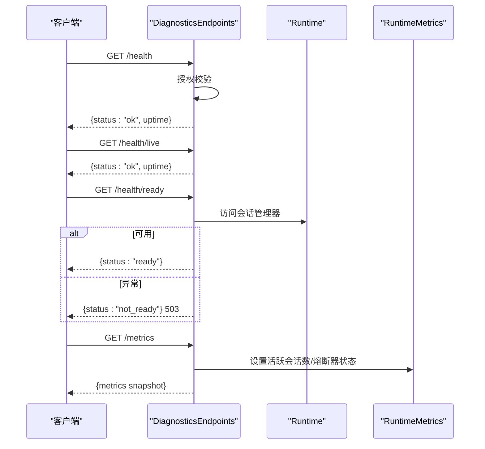
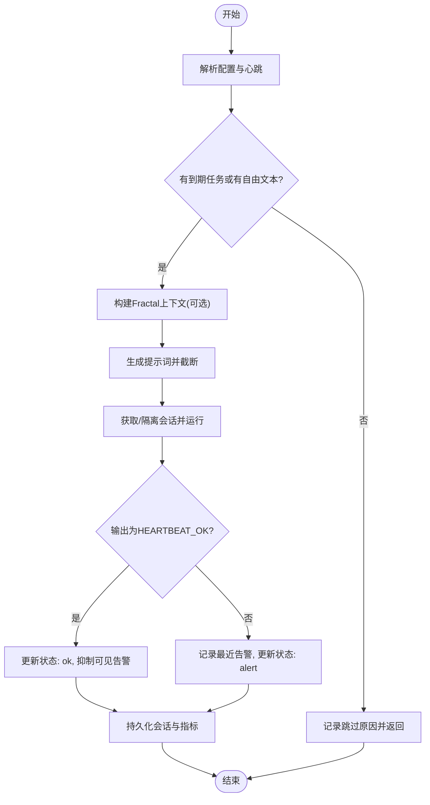
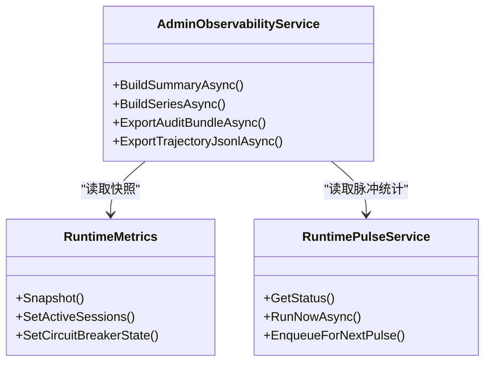
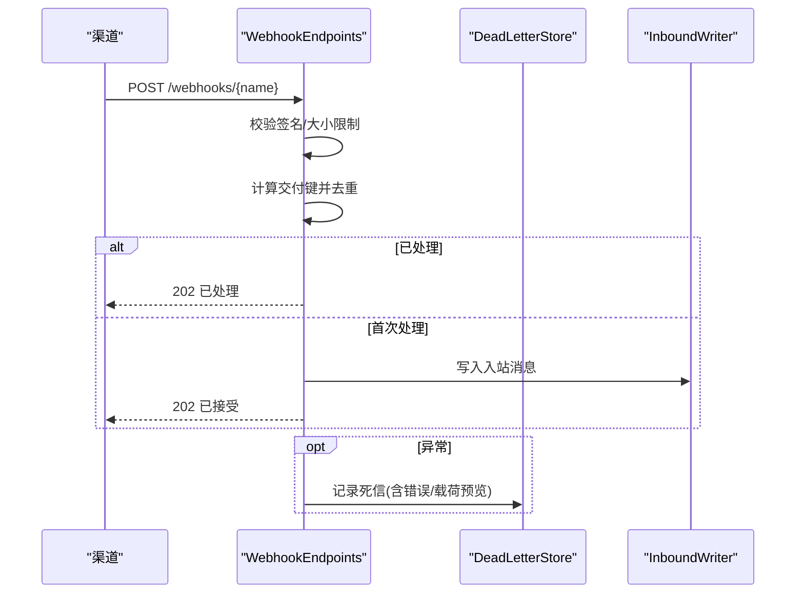
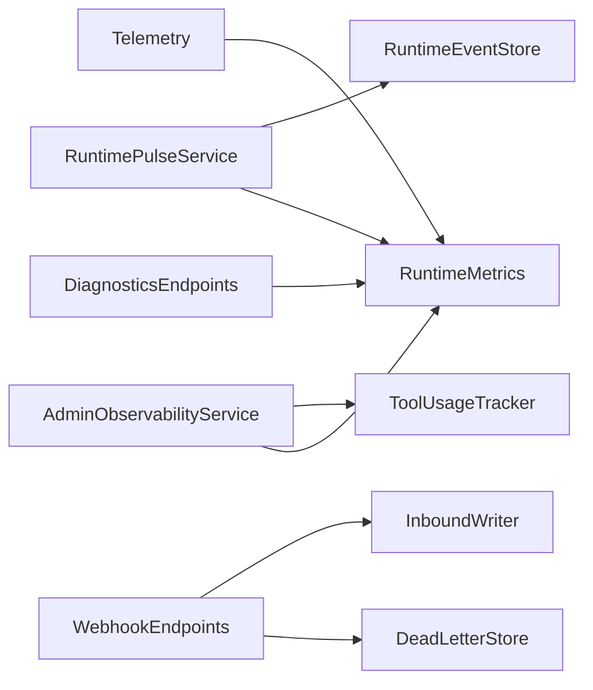

# 健康检查与监控

<cite>
**本文引用的文件**
- [DiagnosticsEndpoints.cs](file://src/OpenClaw.Gateway/Endpoints/DiagnosticsEndpoints.cs)
- [RuntimePulseService.cs](file://src/OpenClaw.Gateway/RuntimePulseService.cs)
- [AdminObservabilityService.cs](file://src/OpenClaw.Gateway/AdminObservabilityService.cs)
- [RuntimeMetrics.cs](file://src/OpenClaw.Core/Observability/RuntimeMetrics.cs)
- [Telemetry.cs](file://src/OpenClaw.Core/Observability/Telemetry.cs)
- [WebhookEndpoints.cs](file://src/OpenClaw.Gateway/Endpoints/WebhookEndpoints.cs)
- [OperatorGovernanceModels.cs](file://src/OpenClaw.Core/Models/OperatorGovernanceModels.cs)
- [Overview.razor](file://src/OpenClaw.Dashboard/Pages/Overview.razor)
- [Extensions.cs](file://Kingcrab.ServiceDefaults/Extensions.cs)
- [GatewayAdminEndpointTests.cs](file://src/OpenClaw.Tests/GatewayAdminEndpointTests.cs)
</cite>

## 目录
1. [简介](#简介)
2. [项目结构](#项目结构)
3. [核心组件](#核心组件)
4. [架构总览](#架构总览)
5. [详细组件分析](#详细组件分析)
6. [依赖关系分析](#依赖关系分析)
7. [性能考量](#性能考量)
8. [故障排查指南](#故障排查指南)
9. [结论](#结论)
10. [附录](#附录)

## 简介
本运维文档聚焦于健康检查与监控系统，覆盖以下关键能力：
- 健康检查端点：存活探针、就绪探针与健康响应
- 系统状态监控：运行时指标、会话状态、熔断器状态
- 性能指标采集：请求量、LLM调用、工具调用、令牌用量、脉冲运行统计
- 告警机制：运行时脉冲告警、Webhook死信队列、通道就绪度评估
- 启动状态报告：诊断检查、设置验证、Doctor报告
- 运行时监控：可观测性服务、指标序列与摘要卡片
- 资源使用情况：内存占用格式化、活跃会话数、保留进程数
- 故障检测：错误计数、超时计数、重试计数、失败重放与死信记录
- 监控配置：指标导出、轨迹导出、匿名化策略
- 仪表板集成：概览页指标展示、内存与运行时间格式化
- 日志聚合：事件存储、审计导出、轨迹导出
- 性能优化建议：缓存命中、提示词缓存预热、保留清理

## 项目结构
监控与健康检查相关代码主要分布在以下模块：
- 网关端点层：健康检查、指标导出、Webhook处理
- 运行时服务层：运行时脉冲服务、可观测性服务
- 核心可观测性：运行时指标、遥测（OpenTelemetry）
- 仪表板：概览页面指标渲染
- 测试：Webhook去重与重复处理行为验证

**图表来源**
- [DiagnosticsEndpoints.cs:32-80](file://src/OpenClaw.Gateway/Endpoints/DiagnosticsEndpoints.cs#L32-L80)
- [WebhookEndpoints.cs:543-632](file://src/OpenClaw.Gateway/Endpoints/WebhookEndpoints.cs#L543-L632)
- [RuntimePulseService.cs:16-59](file://src/OpenClaw.Gateway/RuntimePulseService.cs#L16-L59)
- [AdminObservabilityService.cs:16-53](file://src/OpenClaw.Gateway/AdminObservabilityService.cs#L16-L53)
- [RuntimeMetrics.cs:10-312](file://src/OpenClaw.Core/Observability/RuntimeMetrics.cs#L10-L312)
- [Telemetry.cs:9-54](file://src/OpenClaw.Core/Observability/Telemetry.cs#L9-L54)
- [Overview.razor:68-364](file://src/OpenClaw.Dashboard/Pages/Overview.razor#L68-L364)
- [GatewayAdminEndpointTests.cs:4928-4956](file://src/OpenClaw.Tests/GatewayAdminEndpointTests.cs#L4928-L4956)

**章节来源**
- [DiagnosticsEndpoints.cs:32-80](file://src/OpenClaw.Gateway/Endpoints/DiagnosticsEndpoints.cs#L32-L80)
- [RuntimePulseService.cs:16-59](file://src/OpenClaw.Gateway/RuntimePulseService.cs#L16-L59)
- [AdminObservabilityService.cs:16-53](file://src/OpenClaw.Gateway/AdminObservabilityService.cs#L16-L53)
- [RuntimeMetrics.cs:10-312](file://src/OpenClaw.Core/Observability/RuntimeMetrics.cs#L10-L312)
- [Telemetry.cs:9-54](file://src/OpenClaw.Core/Observability/Telemetry.cs#L9-L54)
- [Overview.razor:68-364](file://src/OpenClaw.Dashboard/Pages/Overview.razor#L68-L364)
- [GatewayAdminEndpointTests.cs:4928-4956](file://src/OpenClaw.Tests/GatewayAdminEndpointTests.cs#L4928-L4956)

## 核心组件
- 健康检查端点
  - /health：受操作员授权保护的健康状态查询
  - /health/live：未认证的存活探针
  - /health/ready：未认证的就绪探针，检查会话管理器可用性
- 指标端点
  - /metrics：返回运行时指标快照，包含活跃会话数、熔断器状态等
  - /metrics/providers：提供者路由健康快照
- 运行时脉冲服务
  - 基于HEARTBEAT.md的任务解析与执行，支持手动唤醒、空闲抑制、可见性控制
  - 记录脉冲运行结果、跳过原因、最近告警
- 可观测性服务
  - 构建摘要卡片、指标序列、审计导出、轨迹导出
  - 统计审批决策、自动化失败、提供者错误/重试、通道漂移、操作员动作
- 运行时指标
  - 请求总量、LLM调用、工具调用、令牌用量、会话淘汰/容量拒绝、浏览器取消重置
  - 插件桥认证/重启尝试、进程生命周期、沙箱租约、保留清理、缓存命中
  - 脉冲运行次数/跳过/告警/错误、脉冲最后运行时长
- 遥测（OpenTelemetry）
  - 工具执行时延直方图、速率限制超限计数、审批队列深度可观测量表
- Webhook处理与死信
  - 多渠道Webhook入站、签名验证、去重、死信记录与重放
- 诊断与Doctor报告
  - 配置静态校验、设置验证快照、Doctor检查项与报告
- 仪表板集成
  - 概览页展示活跃会话、请求总量、内存占用、运行时间等

**章节来源**
- [DiagnosticsEndpoints.cs:32-80](file://src/OpenClaw.Gateway/Endpoints/DiagnosticsEndpoints.cs#L32-L80)
- [RuntimePulseService.cs:64-107](file://src/OpenClaw.Gateway/RuntimePulseService.cs#L64-L107)
- [AdminObservabilityService.cs:117-168](file://src/OpenClaw.Gateway/AdminObservabilityService.cs#L117-L168)
- [RuntimeMetrics.cs:129-187](file://src/OpenClaw.Core/Observability/RuntimeMetrics.cs#L129-L187)
- [Telemetry.cs:28-52](file://src/OpenClaw.Core/Observability/Telemetry.cs#L28-L52)
- [WebhookEndpoints.cs:543-632](file://src/OpenClaw.Gateway/Endpoints/WebhookEndpoints.cs#L543-L632)
- [OperatorGovernanceModels.cs:305-359](file://src/OpenClaw.Core/Models/OperatorGovernanceModels.cs#L305-L359)
- [Overview.razor:68-364](file://src/OpenClaw.Dashboard/Pages/Overview.razor#L68-L364)

## 架构总览
下图展示了健康检查、指标导出、脉冲运行与可观测性服务之间的交互关系。

**图表来源**
- [DiagnosticsEndpoints.cs:32-80](file://src/OpenClaw.Gateway/Endpoints/DiagnosticsEndpoints.cs#L32-L80)
- [RuntimePulseService.cs:136-299](file://src/OpenClaw.Gateway/RuntimePulseService.cs#L136-L299)
- [AdminObservabilityService.cs:117-168](file://src/OpenClaw.Gateway/AdminObservabilityService.cs#L117-L168)
- [RuntimeMetrics.cs:179-187](file://src/OpenClaw.Core/Observability/RuntimeMetrics.cs#L179-L187)

## 详细组件分析

### 健康检查端点
- /health
  - 受操作员授权保护；返回服务状态与运行时毫秒数
- /health/live
  - 未认证存活探针，用于容器/负载均衡存活检测
- /health/ready
  - 未认证就绪探针，尝试访问会话管理器以判断是否可接受流量
- /metrics
  - 返回运行时指标快照，包括活跃会话数、熔断器状态、各类计数器
- /metrics/providers
  - 提供者路由健康快照（按路由维度统计错误/重试）

**图表来源**
- [DiagnosticsEndpoints.cs:32-80](file://src/OpenClaw.Gateway/Endpoints/DiagnosticsEndpoints.cs#L32-L80)
- [RuntimeMetrics.cs:179-187](file://src/OpenClaw.Core/Observability/RuntimeMetrics.cs#L179-L187)

**章节来源**
- [DiagnosticsEndpoints.cs:32-80](file://src/OpenClaw.Gateway/Endpoints/DiagnosticsEndpoints.cs#L32-L80)

### 运行时脉冲服务
- 功能要点
  - 解析HEARTBEAT.md中的任务块，按间隔选择到期任务
  - 支持隔离会话/轻量上下文模式，避免污染历史
  - 通过Fractal Memory构建紧凑上下文，提升脉冲效率
  - 判定“HEARTBEAT_OK”以抑制可见告警，仅记录内部事件
  - 记录最近告警、跳过原因、脉冲运行时长与错误计数
- 关键流程
  - 配置归一化与时间解析
  - 心跳文件读取与有效性判定
  - 任务解析与到期筛选
  - 构建提示词与截断
  - 会话获取/加锁/运行/持久化
  - 结果判定与事件记录

**图表来源**
- [RuntimePulseService.cs:136-299](file://src/OpenClaw.Gateway/RuntimePulseService.cs#L136-L299)
- [RuntimePulseService.cs:355-403](file://src/OpenClaw.Gateway/RuntimePulseService.cs#L355-L403)
- [RuntimePulseService.cs:652-658](file://src/OpenClaw.Gateway/RuntimePulseService.cs#L652-L658)

**章节来源**
- [RuntimePulseService.cs:64-107](file://src/OpenClaw.Gateway/RuntimePulseService.cs#L64-L107)
- [RuntimePulseService.cs:136-299](file://src/OpenClaw.Gateway/RuntimePulseService.cs#L136-L299)
- [RuntimePulseService.cs:355-403](file://src/OpenClaw.Gateway/RuntimePulseService.cs#L355-L403)
- [RuntimePulseService.cs:652-658](file://src/OpenClaw.Gateway/RuntimePulseService.cs#L652-L658)

### 可观测性服务与指标
- 摘要卡片
  - 审批决策总数与待审批数
  - 自动化失败数与总数
  - 提供者错误数与提供者快照数
  - 死信数量与通道漂移数
  - 操作员动作总数与角色分布
- 指标序列
  - 时间分桶统计：审批决策、待审批、自动化运行/失败、提供者错误/重试、运行时警告/错误、死信、活跃会话、通道漂移、操作员动作
- 导出能力
  - 审计包导出：包含操作员审计、运行时事件、审批历史、提供者使用/路由、死信、会话元数据
  - 轨迹导出：按会话/回合/工具调用/结果/证据/治理记录导出JSONL，支持匿名化与证据/治理开关

**图表来源**
- [AdminObservabilityService.cs:117-168](file://src/OpenClaw.Gateway/AdminObservabilityService.cs#L117-L168)
- [AdminObservabilityService.cs:170-227](file://src/OpenClaw.Gateway/AdminObservabilityService.cs#L170-L227)
- [RuntimeMetrics.cs:192-250](file://src/OpenClaw.Core/Observability/RuntimeMetrics.cs#L192-L250)
- [RuntimePulseService.cs:64-107](file://src/OpenClaw.Gateway/RuntimePulseService.cs#L64-L107)

**章节来源**
- [AdminObservabilityService.cs:117-168](file://src/OpenClaw.Gateway/AdminObservabilityService.cs#L117-L168)
- [AdminObservabilityService.cs:170-227](file://src/OpenClaw.Gateway/AdminObservabilityService.cs#L170-L227)
- [RuntimeMetrics.cs:192-250](file://src/OpenClaw.Core/Observability/RuntimeMetrics.cs#L192-L250)

### Webhook处理与告警
- 入站处理
  - 多渠道Webhook：Telegram、Slack、Teams、Discord、WhatsApp、Twilio SMS、通用Webhook、Gmail Pub/Sub
  - 签名验证、请求体大小限制、去重（基于交付键/哈希）
- 死信记录
  - 处理异常时写入死信记录，包含来源、通道、会话、错误摘要、载荷预览
  - 支持重放消息与后续重试
- 去重与幂等
  - 使用Idempotency-Key或X-OpenClaw-Delivery-Id或哈希作为交付键
  - 重复请求返回“已处理”状态码

**图表来源**
- [WebhookEndpoints.cs:543-632](file://src/OpenClaw.Gateway/Endpoints/WebhookEndpoints.cs#L543-L632)

**章节来源**
- [WebhookEndpoints.cs:543-632](file://src/OpenClaw.Gateway/Endpoints/WebhookEndpoints.cs#L543-L632)

### 诊断与Doctor报告
- 配置静态校验：发现配置问题并给出修复建议
- 设置验证快照：记录当前配置来源与诊断信息
- Doctor检查项：包含类别、状态、摘要、详情与下一步行动
- 报告响应：包含生成时间、总体状态、失败/警告/跳过标记、检查列表与推荐行动

**章节来源**
- [OperatorGovernanceModels.cs:305-359](file://src/OpenClaw.Core/Models/OperatorGovernanceModels.cs#L305-L359)

### 仪表板集成
- 概览页指标卡
  - 活跃会话、总请求、内存占用、运行时间
- 内存与时间格式化
  - 字节到合适单位转换、时间格式化

**章节来源**
- [Overview.razor:68-364](file://src/OpenClaw.Dashboard/Pages/Overview.razor#L68-L364)

## 依赖关系分析
- 端点依赖
  - DiagnosticsEndpoints依赖运行时指标与会话管理器
  - WebhookEndpoints依赖交付存储、各渠道处理器与管道写入器
- 服务依赖
  - RuntimePulseService依赖运行时持有者、事件存储、指标、会话管理器
  - AdminObservabilityService依赖运行时、工具使用追踪、会话管理器、策略服务
- 遥测依赖
  - Telemetry提供Meter与ActivitySource，注册指标与可观测量表

**图表来源**
- [DiagnosticsEndpoints.cs:32-80](file://src/OpenClaw.Gateway/Endpoints/DiagnosticsEndpoints.cs#L32-L80)
- [WebhookEndpoints.cs:543-632](file://src/OpenClaw.Gateway/Endpoints/WebhookEndpoints.cs#L543-L632)
- [RuntimePulseService.cs:33-49](file://src/OpenClaw.Gateway/RuntimePulseService.cs#L33-L49)
- [AdminObservabilityService.cs:33-53](file://src/OpenClaw.Gateway/AdminObservabilityService.cs#L33-L53)
- [Telemetry.cs:9-54](file://src/OpenClaw.Core/Observability/Telemetry.cs#L9-L54)

**章节来源**
- [DiagnosticsEndpoints.cs:32-80](file://src/OpenClaw.Gateway/Endpoints/DiagnosticsEndpoints.cs#L32-L80)
- [WebhookEndpoints.cs:543-632](file://src/OpenClaw.Gateway/Endpoints/WebhookEndpoints.cs#L543-L632)
- [RuntimePulseService.cs:33-49](file://src/OpenClaw.Gateway/RuntimePulseService.cs#L33-L49)
- [AdminObservabilityService.cs:33-53](file://src/OpenClaw.Gateway/AdminObservabilityService.cs#L33-L53)
- [Telemetry.cs:9-54](file://src/OpenClaw.Core/Observability/Telemetry.cs#L9-L54)

## 性能考量
- 指标采集
  - 使用原子计数与易失读写，降低锁竞争；活跃会话与熔断器状态采用Volatile保证可见性
- 缓存与预热
  - 提示词缓存读写/预热运行/跳过/失败计数，有助于降低重复计算成本
- 保留清理
  - 保留清理运行次数、失败次数、归档/删除条目数、受保护会话跳过数，便于评估清理开销
- 脉冲运行
  - 脉冲运行时长与跳过/告警/错误计数，辅助定位长时间运行或频繁告警的时段
- 仪表板渲染
  - 内存占用按字节自动转换单位，提升可读性

**章节来源**
- [RuntimeMetrics.cs:129-187](file://src/OpenClaw.Core/Observability/RuntimeMetrics.cs#L129-L187)
- [RuntimeMetrics.cs:189-250](file://src/OpenClaw.Core/Observability/RuntimeMetrics.cs#L189-L250)
- [Overview.razor:330-355](file://src/OpenClaw.Dashboard/Pages/Overview.razor#L330-L355)

## 故障排查指南
- 健康检查失败
  - /health：确认操作员授权头有效
  - /health/ready：若返回not_ready，检查会话管理器初始化状态
- 指标异常
  - /metrics：核对活跃会话数、熔断器状态、工具/LLM错误/重试计数是否异常增长
- 脉冲不触发或被跳过
  - 检查HEARTBEAT.md是否存在且包含有效任务/文本
  - 查看脉冲状态接口最近跳过原因与可见性配置
- Webhook重复处理
  - 确认Idempotency-Key或X-OpenClaw-Delivery-Id是否一致
  - 查看重复请求返回“已处理”的行为符合预期
- 死信排查
  - 在死信记录中查看来源、通道、会话、错误摘要与载荷预览
  - 使用重放消息进行后续处理验证

**章节来源**
- [DiagnosticsEndpoints.cs:32-80](file://src/OpenClaw.Gateway/Endpoints/DiagnosticsEndpoints.cs#L32-L80)
- [RuntimePulseService.cs:64-107](file://src/OpenClaw.Gateway/RuntimePulseService.cs#L64-L107)
- [WebhookEndpoints.cs:543-632](file://src/OpenClaw.Gateway/Endpoints/WebhookEndpoints.cs#L543-L632)
- [GatewayAdminEndpointTests.cs:4928-4956](file://src/OpenClaw.Tests/GatewayAdminEndpointTests.cs#L4928-L4956)

## 结论
本健康检查与监控体系通过多维端点、运行时脉冲、可观测性服务与指标导出，实现了从系统健康、运行状态到性能与故障的全链路监控。结合Webhook去重与死信机制、Doctor诊断与导出能力，为生产环境提供了可靠的运维保障与可视化支撑。

## 附录
- 监控配置建议
  - 指标导出：定期抓取/metrics与/metrics/providers，结合脉冲状态与摘要卡片进行趋势分析
  - 轨迹导出：在合规前提下启用匿名化与证据/治理导出，用于审计与回溯
- 告警规则建议
  - 活跃会话长时间为零：可能表示业务停止或会话管理器异常
  - LLM错误/重试持续上升：需检查提供者可用性与模型配置
  - 脉冲告警计数增加：关注HEARTBEAT.md内容与Fractal上下文构建
  - 死信堆积：优先处理高频率通道与错误类型
- 仪表板集成
  - 将活跃会话、请求总量、内存占用、运行时间映射到概览页指标卡
  - 使用内存与时间格式化函数提升可读性