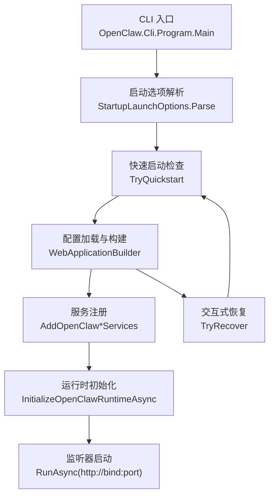
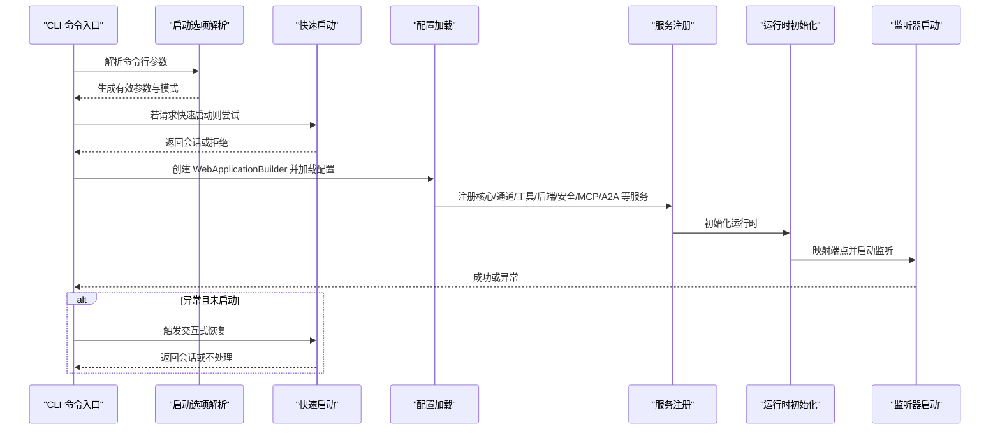
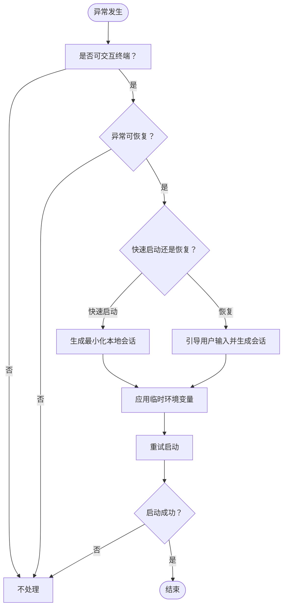
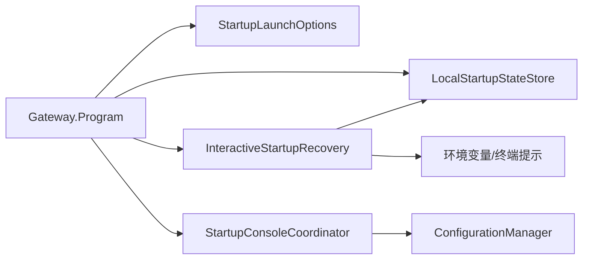

# 启动流程和配置

<cite>
**本文引用的文件**
- [Program.cs](file://src/OpenClaw.Gateway/Program.cs)
- [StartupLaunchOptions.cs](file://src/OpenClaw.Gateway/Bootstrap/StartupLaunchOptions.cs)
- [InteractiveStartupRecovery.cs](file://src/OpenClaw.Gateway/Bootstrap/InteractiveStartupRecovery.cs)
- [StartupConsoleCoordinator.cs](file://src/OpenClaw.Gateway/Bootstrap/StartupConsoleCoordinator.cs)
- [LocalStartupStateStore.cs](file://src/OpenClaw.Gateway/Bootstrap/LocalStartupStateStore.cs)
- [GatewayStartupContext.cs](file://src/OpenClaw.Gateway/Bootstrap/GatewayStartupContext.cs)
- [Program.cs](file://src/OpenClaw.Cli/Program.cs)
- [CliArgs.cs](file://src/OpenClaw.Cli/CliArgs.cs)
</cite>

## 目录
1. [简介](#简介)
2. [项目结构](#项目结构)
3. [核心组件](#核心组件)
4. [架构总览](#架构总览)
5. [详细组件分析](#详细组件分析)
6. [依赖关系分析](#依赖关系分析)
7. [性能考虑](#性能考虑)
8. [故障排除指南](#故障排除指南)
9. [结论](#结论)
10. [附录](#附录)

## 简介
本文件系统性地文档化了网关的启动流程与配置模块，覆盖启动序列、配置加载机制、启动选项解析、快速启动与交互式恢复策略。内容包括启动参数处理、环境变量配置、快速启动模式、交互式恢复机制、错误处理与重试逻辑、故障排除流程、最佳实践、性能优化建议、监控指标以及具体配置示例与启动脚本。

## 项目结构
网关启动流程由“入口程序 + 启动选项解析 + 配置加载 + 服务注册 + 运行时初始化 + 监听器启动”构成；同时提供“快速启动”和“交互式恢复”能力以提升本地开发体验与容错性。CLI 提供统一的命令入口，负责解析用户输入并委派到相应子命令或直接启动网关。

图表来源
- [Program.cs:14-124](file://src/OpenClaw.Gateway/Program.cs#L14-L124)
- [StartupLaunchOptions.cs:57-71](file://src/OpenClaw.Gateway/Bootstrap/StartupLaunchOptions.cs#L57-L71)
- [InteractiveStartupRecovery.cs:17-70](file://src/OpenClaw.Gateway/Bootstrap/InteractiveStartupRecovery.cs#L17-L70)

章节来源
- [Program.cs:14-124](file://src/OpenClaw.Gateway/Program.cs#L14-L124)
- [Program.cs:12-70](file://src/OpenClaw.Cli/Program.cs#L12-L70)

## 核心组件
- 启动入口与主循环：负责解析启动选项、加载配置、注册服务、初始化运行时、映射端点并启动监听器；在未标记“已启动”的异常情况下触发交互式恢复。
- 启动选项解析：解析命令行参数，识别 doctor 模式、健康检查模式、快速启动请求、配置路径来源（参数或环境变量），并生成有效参数集。
- 交互式恢复：在可交互终端且异常可恢复的前提下，引导用户选择最小化本地设置（工作区、内存目录、端口、模型提供商与密钥等），应用临时环境变量后重试启动。
- 启动控制台协调器：输出启动阶段信息、配置源列表与生效配置摘要，便于诊断。
- 本地启动状态存储：持久化本地启动状态（如上次使用的工作区、内存目录、端口等），用于快速启动与恢复默认值。
- CLI 参数解析：通用的命令行参数解析器，支持位置参数、键值对参数与标志位，为 CLI 子命令提供基础能力。

章节来源
- [Program.cs:14-124](file://src/OpenClaw.Gateway/Program.cs#L14-L124)
- [StartupLaunchOptions.cs:57-122](file://src/OpenClaw.Gateway/Bootstrap/StartupLaunchOptions.cs#L57-L122)
- [InteractiveStartupRecovery.cs:72-150](file://src/OpenClaw.Gateway/Bootstrap/InteractiveStartupRecovery.cs#L72-L150)
- [StartupConsoleCoordinator.cs:15-37](file://src/OpenClaw.Gateway/Bootstrap/StartupConsoleCoordinator.cs#L15-L37)
- [LocalStartupStateStore.cs:16-26](file://src/OpenClaw.Gateway/Bootstrap/LocalStartupStateStore.cs#L16-L26)
- [Program.cs:702-718](file://src/OpenClaw.Cli/Program.cs#L702-L718)
- [CliArgs.cs:14-98](file://src/OpenClaw.Cli/CliArgs.cs#L14-L98)

## 架构总览
下图展示了从 CLI 到网关启动的端到端流程，包括启动选项解析、快速启动/恢复、配置加载、服务注册、运行时初始化与监听器启动。

图表来源
- [Program.cs:47-124](file://src/OpenClaw.Gateway/Program.cs#L47-L124)
- [StartupLaunchOptions.cs:57-88](file://src/OpenClaw.Gateway/Bootstrap/StartupLaunchOptions.cs#L57-L88)
- [InteractiveStartupRecovery.cs:72-150](file://src/OpenClaw.Gateway/Bootstrap/InteractiveStartupRecovery.cs#L72-L150)

## 详细组件分析

### 启动入口与主循环
- 解析启动选项：调用启动选项解析器，生成有效参数集合，并检测 doctor/健康检查/快速启动模式。
- 快速启动：当请求快速启动时，尝试应用最小化本地配置（工作区、内存目录、端口、提供商与模型、密钥与端点），并将结果注入当前进程的环境变量，然后继续启动流程。
- 主循环：在未标记“已启动”的异常情况下，进入交互式恢复流程；成功启动后退出循环。
- 监听器启动：使用绑定地址与端口启动 HTTP 监听器。

章节来源
- [Program.cs:14-124](file://src/OpenClaw.Gateway/Program.cs#L14-L124)

### 启动选项解析器
- 功能：解析原始参数，剔除“快速启动”标记，识别 doctor/健康检查模式，解析配置路径（来自参数或环境变量），判断是否可交互提示。
- 输出：生成有效参数数组、模式标志与外部配置路径来源。
- 快速启动校验：禁止与 doctor/健康检查/显式配置路径/非交互终端同时使用。

章节来源
- [StartupLaunchOptions.cs:57-122](file://src/OpenClaw.Gateway/Bootstrap/StartupLaunchOptions.cs#L57-L122)

### 交互式恢复
- 可恢复条件：根据异常消息判定是否可恢复（如认证令牌缺失、模型密钥缺失、端点缺失、内存路径访问错误、端口占用等）。
- 快速启动模式：在可交互终端中，引导用户确认后应用最小化本地配置（回环绑定、文件内存、临时密钥/端点），返回会话对象。
- 恢复模式：在异常发生时，基于历史状态与当前异常信息，引导用户输入工作区、内存目录、端口、提供商密钥与端点，应用临时环境变量后重试。
- 环境变量注入：在恢复过程中设置 ASPNETCORE_ENVIRONMENT、工作区、绑定地址、端口、内存提供者与路径、保留策略、模型密钥与端点等。

图表来源
- [InteractiveStartupRecovery.cs:72-150](file://src/OpenClaw.Gateway/Bootstrap/InteractiveStartupRecovery.cs#L72-L150)
- [InteractiveStartupRecovery.cs:296-322](file://src/OpenClaw.Gateway/Bootstrap/InteractiveStartupRecovery.cs#L296-L322)

章节来源
- [InteractiveStartupRecovery.cs:72-150](file://src/OpenClaw.Gateway/Bootstrap/InteractiveStartupRecovery.cs#L72-L150)
- [InteractiveStartupRecovery.cs:204-218](file://src/OpenClaw.Gateway/Bootstrap/InteractiveStartupRecovery.cs#L204-L218)

### 启动控制台协调器
- 输出阶段信息：逐阶段输出“加载配置/构建服务/初始化运行时/启动监听器”等阶段提示。
- 配置摘要：列出配置源（JSON 文件）、会话覆盖情况与生效配置摘要，便于诊断。

章节来源
- [StartupConsoleCoordinator.cs:8-37](file://src/OpenClaw.Gateway/Bootstrap/StartupConsoleCoordinator.cs#L8-L37)

### 本地启动状态存储
- 路径解析：默认路径或显式路径，支持路径展开。
- 加载：原子读取本地启动状态（若失败则返回空状态）。
- 保存：原子写入本地启动状态，返回是否成功及错误信息。

章节来源
- [LocalStartupStateStore.cs:16-26](file://src/OpenClaw.Gateway/Bootstrap/LocalStartupStateStore.cs#L16-L26)

### CLI 参数解析器
- 支持：位置参数、键值对参数（--key value）、标志位（--flag），以及 -- 分隔符。
- 错误处理：缺少值时报错；重复键收集多个值；提供便捷查询接口。

章节来源
- [CliArgs.cs:14-98](file://src/OpenClaw.Cli/CliArgs.cs#L14-L98)

### CLI 启动命令
- start 子命令：解析参数后调用启动命令执行器，支持非交互模式、伴生应用、浏览器打开等选项。
- help/版本/未知命令：统一帮助输出与错误提示。

章节来源
- [Program.cs:702-718](file://src/OpenClaw.Cli/Program.cs#L702-L718)
- [Program.cs:14-83](file://src/OpenClaw.Cli/Program.cs#L14-L83)

## 依赖关系分析
- 入口程序依赖启动选项解析器、交互式恢复、本地启动状态存储与启动控制台协调器。
- 交互式恢复依赖本地启动状态存储、环境变量解析与终端提示。
- 启动控制台协调器依赖配置管理器与诊断渲染器。
- CLI 入口依赖启动命令与参数解析器。

图表来源
- [Program.cs:14-124](file://src/OpenClaw.Gateway/Program.cs#L14-L124)
- [StartupLaunchOptions.cs:57-122](file://src/OpenClaw.Gateway/Bootstrap/StartupLaunchOptions.cs#L57-L122)
- [InteractiveStartupRecovery.cs:17-70](file://src/OpenClaw.Gateway/Bootstrap/InteractiveStartupRecovery.cs#L17-L70)
- [LocalStartupStateStore.cs:16-26](file://src/OpenClaw.Gateway/Bootstrap/LocalStartupStateStore.cs#L16-L26)
- [StartupConsoleCoordinator.cs:15-37](file://src/OpenClaw.Gateway/Bootstrap/StartupConsoleCoordinator.cs#L15-L37)

章节来源
- [Program.cs:14-124](file://src/OpenClaw.Gateway/Program.cs#L14-L124)
- [StartupLaunchOptions.cs:57-122](file://src/OpenClaw.Gateway/Bootstrap/StartupLaunchOptions.cs#L57-L122)
- [InteractiveStartupRecovery.cs:17-70](file://src/OpenClaw.Gateway/Bootstrap/InteractiveStartupRecovery.cs#L17-L70)
- [LocalStartupStateStore.cs:16-26](file://src/OpenClaw.Gateway/Bootstrap/LocalStartupStateStore.cs#L16-L26)
- [StartupConsoleCoordinator.cs:15-37](file://src/OpenClaw.Gateway/Bootstrap/StartupConsoleCoordinator.cs#L15-L37)

## 性能考虑
- 启动阶段延迟优化
  - 使用最小化配置与文件内存减少 IO 开销，避免远程后端连接失败导致的阻塞。
  - 在恢复前尽量预创建目录，减少首次启动 IO 抖动。
- 监控与可观测性
  - 启动控制台协调器输出配置源与生效配置摘要，便于定位配置冲突与加载顺序问题。
  - 建议在生产环境启用更细粒度的启动阶段计时与日志采样。
- 端口与绑定
  - 回环绑定（127.0.0.1）避免鉴权要求，适合本地快速验证；非回环绑定需确保认证令牌与网络策略正确配置。
- 重试策略
  - 主循环在未启动前捕获异常并触发恢复；建议在自动化场景禁用交互提示，通过非交互模式与显式配置降低不确定性。

## 故障排除指南
- 常见错误与恢复
  - 缺少认证令牌：当绑定到非回环地址时必须设置认证令牌，可通过交互式恢复或显式配置解决。
  - 缺少模型密钥/端点：根据提供商类型提示输入密钥或端点，或从环境变量继承。
  - 内存路径访问错误：检查路径权限与只读文件系统限制，必要时切换到可写路径。
  - 端口占用：交互式恢复可自动递增端口，或手动指定可用端口。
- doctor/健康检查模式
  - doctor 模式用于诊断配置与环境问题，不实际启动网关；健康检查模式用于探测服务可用性。
- 日志与诊断
  - 启动控制台协调器输出配置源与生效配置摘要，有助于定位配置冲突与加载顺序问题。
  - 失败报告器在不处理的情况下输出详细失败信息，便于进一步排查。

章节来源
- [InteractiveStartupRecovery.cs:296-322](file://src/OpenClaw.Gateway/Bootstrap/InteractiveStartupRecovery.cs#L296-L322)
- [StartupConsoleCoordinator.cs:15-37](file://src/OpenClaw.Gateway/Bootstrap/StartupConsoleCoordinator.cs#L15-L37)
- [StartupLaunchOptions.cs:73-88](file://src/OpenClaw.Gateway/Bootstrap/StartupLaunchOptions.cs#L73-L88)

## 结论
该启动体系通过“启动选项解析 + 配置加载 + 服务注册 + 运行时初始化 + 监听器启动”的清晰分层，结合“快速启动”和“交互式恢复”，显著提升了本地开发体验与启动容错能力。建议在生产环境中采用非交互模式与显式配置，配合可观测性输出与严格的权限控制，确保启动过程稳定可控。

## 附录

### 启动参数与环境变量参考
- 启动选项
  - --doctor：doctor 模式，仅诊断不启动
  - --health-check：健康检查模式
  - --quickstart：快速启动，应用最小化本地配置
  - --config <path>：显式配置文件路径
  - --non-interactive：非交互模式（自动化/CI）
  - --with-companion：同时启动伴生应用
  - --open-browser：启动后打开浏览器
- 环境变量
  - OPENCLAW_CONFIG_PATH：外部配置文件路径来源
  - ASPNETCORE_ENVIRONMENT：环境名称（开发/生产）
  - OPENCLAW_WORKSPACE：工作区路径
  - OpenClaw__BindAddress：绑定地址
  - OpenClaw__Port：端口
  - OpenClaw__Memory__Provider：内存提供者（如 file）
  - OpenClaw__Memory__StoragePath：内存存储路径
  - OpenClaw__Memory__Retention__Enabled：是否启用记忆保留
  - MODEL_PROVIDER_KEY / OPENAI_API_KEY：模型提供商密钥
  - MODEL_PROVIDER_ENDPOINT：模型提供商端点

章节来源
- [StartupLaunchOptions.cs:57-71](file://src/OpenClaw.Gateway/Bootstrap/StartupLaunchOptions.cs#L57-L71)
- [InteractiveStartupRecovery.cs:204-218](file://src/OpenClaw.Gateway/Bootstrap/InteractiveStartupRecovery.cs#L204-L218)

### 最佳实践
- 开发阶段
  - 使用 --quickstart 或交互式恢复快速验证功能，避免复杂配置干扰。
  - 将工作区与内存目录指向本地可写路径，减少权限问题。
- 生产/自动化
  - 禁用交互提示，通过 --non-interactive 与显式配置文件启动。
  - 统一通过环境变量管理敏感信息，避免明文参数。
  - 对非回环绑定启用认证令牌与网络安全策略。
- 监控与可观测性
  - 记录启动阶段日志与配置摘要，便于审计与排障。
  - 定期运行 doctor/健康检查模式进行预检。

### 性能优化建议
- 启动阶段
  - 减少不必要的服务注册与后端连接探测，优先加载核心服务。
  - 使用文件内存与本地路径，避免远程依赖。
- 运行时
  - 合理设置内存保留策略与清理周期，避免长期运行内存膨胀。
  - 对高频端点启用缓存与限流中间件，降低后端压力。

### 监控指标建议
- 启动阶段耗时（配置加载、服务注册、运行时初始化、监听器启动）
- 配置源数量与生效配置项
- 启动失败率与恢复成功率
- 端口占用与权限错误次数
- 认证令牌与密钥加载成功率

### 配置示例与启动脚本
- 示例：快速启动
  - dotnet run --project src/OpenClaw.Gateway -c Release -- --quickstart
- 示例：非交互启动
  - openclaw start --non-interactive --profile local --workspace ./workspace --provider openai --model gpt-4o --api-key env:MODEL_PROVIDER_KEY
- 示例：服务部署
  - openclaw setup service --config ~/.openclaw/config/openclaw.settings.json --platform all
- 示例：诊断与验证
  - openclaw setup verify --config ~/.openclaw/config/openclaw.settings.json
  - openclaw setup status --config ~/.openclaw/config/openclaw.settings.json

章节来源
- [Program.cs:204-208](file://src/OpenClaw.Cli/Program.cs#L204-L208)
- [Program.cs:370-396](file://src/OpenClaw.Cli/Program.cs#L370-L396)