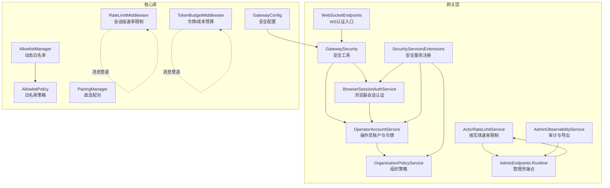
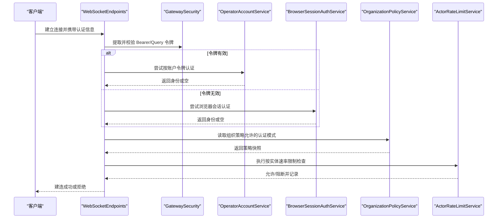
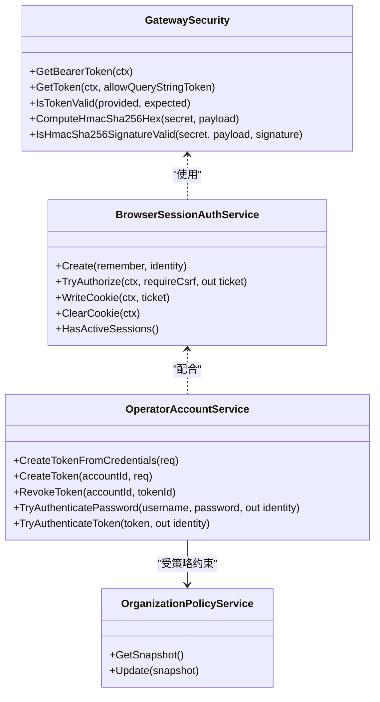
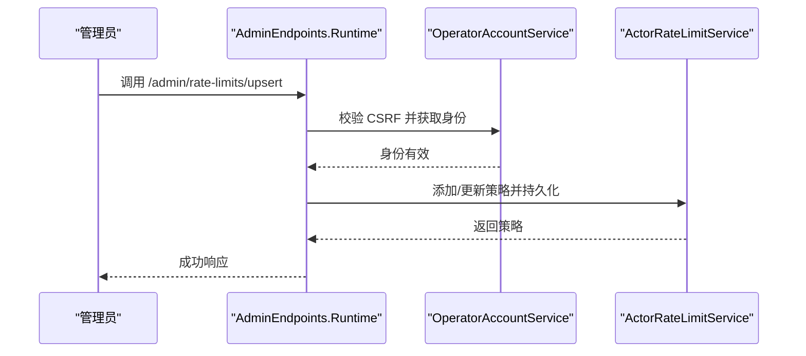
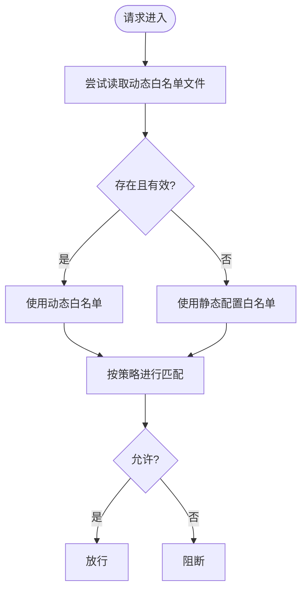
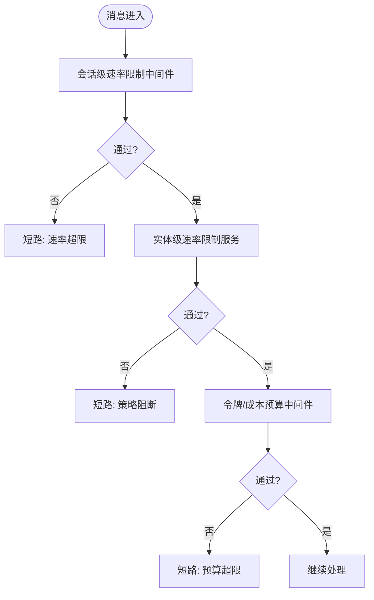
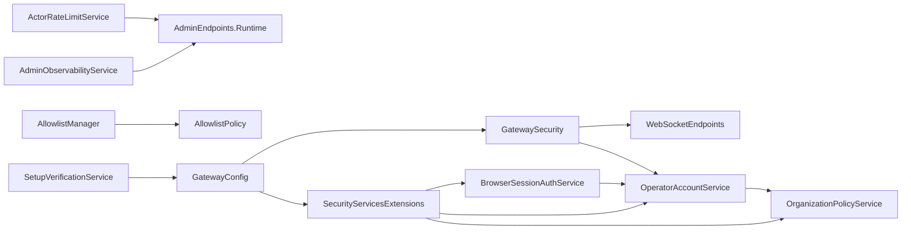

# 安全策略和认证

<cite>
**本文引用的文件**
- [GatewaySecurity.cs](file://src/OpenClaw.Gateway/GatewaySecurity.cs)
- [BrowserSessionAuthService.cs](file://src/OpenClaw.Gateway/BrowserSessionAuthService.cs)
- [OperatorAccountService.cs](file://src/OpenClaw.Gateway/OperatorAccountService.cs)
- [OrganizationPolicyService.cs](file://src/OpenClaw.Gateway/OrganizationPolicyService.cs)
- [ActorRateLimitService.cs](file://src/OpenClaw.Gateway/ActorRateLimitService.cs)
- [SecurityServicesExtensions.cs](file://src/OpenClaw.Gateway/Composition/SecurityServicesExtensions.cs)
- [RateLimitMiddleware.cs](file://src/OpenClaw.Core/Middleware/RateLimitMiddleware.cs)
- [TokenBudgetMiddleware.cs](file://src/OpenClaw.Core/Middleware/TokenBudgetMiddleware.cs)
- [AllowlistManager.cs](file://src/OpenClaw.Core/Security/AllowlistManager.cs)
- [AllowlistPolicy.cs](file://src/OpenClaw.Core/Security/AllowlistPolicy.cs)
- [PairingManager.cs](file://src/OpenClaw.Core/Security/PairingManager.cs)
- [GatewayConfig.cs](file://src/OpenClaw.Core/Models/GatewayConfig.cs)
- [AdminEndpoints.Runtime.cs](file://src/OpenClaw.Gateway/Endpoints/AdminEndpoints.Runtime.cs)
- [WebSocketEndpoints.cs](file://src/OpenClaw.Gateway/Endpoints/WebSocketEndpoints.cs)
- [AdminObservabilityService.cs](file://src/OpenClaw.Gateway/AdminObservabilityService.cs)
- [SetupVerificationService.cs](file://src/OpenClaw.Core/Validation/SetupVerificationService.cs)
- [GatewaySecurityTests.cs](file://src/OpenClaw.Tests/GatewaySecurityTests.cs)
- [BrowserSessionAuthServiceTests.cs](file://src/OpenClaw.Tests/BrowserSessionAuthServiceTests.cs)
- [ActorRateLimitServiceTests.cs](file://src/OpenClaw.Tests/ActorRateLimitServiceTests.cs)
- [GatewayAdminEndpointTests.cs](file://src/OpenClaw.Tests/GatewayAdminEndpointTests.cs)
</cite>

## 目录
1. [简介](#简介)
2. [项目结构](#项目结构)
3. [核心组件](#核心组件)
4. [架构总览](#架构总览)
5. [详细组件分析](#详细组件分析)
6. [依赖关系分析](#依赖关系分析)
7. [性能考量](#性能考量)
8. [故障排查指南](#故障排查指南)
9. [结论](#结论)
10. [附录](#附录)

## 简介
本文件面向网关的安全策略与认证模块，系统性阐述安全架构设计、认证与授权机制、API密钥与访问控制、IP白名单、速率限制、安全中间件、威胁防护与合规、安全事件监控与审计、入侵检测、最佳实践与应急响应流程，并说明安全策略与业务逻辑的集成方式及性能影响。

## 项目结构
安全相关能力主要分布在以下层次：
- 网关层（Gateway）：认证票据生成与校验、操作员账户与令牌、组织策略、速率限制、安全中间件注册、WebSocket/HTTP 认证入口、可观测与审计导出。
- 核心库（Core）：通用安全模型与工具（白名单、匹配器、输入净化、URL 安全校验）、消息中间件（速率限制、令牌预算）。
- 测试（Tests）：覆盖安全关键路径的行为验证。

**图表来源**
- [GatewaySecurity.cs:1-109](file://src/OpenClaw.Gateway/GatewaySecurity.cs#L1-L109)
- [BrowserSessionAuthService.cs:1-180](file://src/OpenClaw.Gateway/BrowserSessionAuthService.cs#L1-L180)
- [OperatorAccountService.cs:1-414](file://src/OpenClaw.Gateway/OperatorAccountService.cs#L1-L414)
- [OrganizationPolicyService.cs:1-98](file://src/OpenClaw.Gateway/OrganizationPolicyService.cs#L1-L98)
- [ActorRateLimitService.cs:1-282](file://src/OpenClaw.Gateway/ActorRateLimitService.cs#L1-L282)
- [SecurityServicesExtensions.cs:1-31](file://src/OpenClaw.Gateway/Composition/SecurityServicesExtensions.cs#L1-L31)
- [WebSocketEndpoints.cs:106-138](file://src/OpenClaw.Gateway/Endpoints/WebSocketEndpoints.cs#L106-L138)
- [AdminEndpoints.Runtime.cs:280-304](file://src/OpenClaw.Gateway/Endpoints/AdminEndpoints.Runtime.cs#L280-L304)
- [AdminObservabilityService.cs:26-283](file://src/OpenClaw.Gateway/AdminObservabilityService.cs#L26-L283)
- [RateLimitMiddleware.cs:1-93](file://src/OpenClaw.Core/Middleware/RateLimitMiddleware.cs#L1-L93)
- [TokenBudgetMiddleware.cs:1-71](file://src/OpenClaw.Core/Middleware/TokenBudgetMiddleware.cs#L1-L71)
- [AllowlistManager.cs:1-126](file://src/OpenClaw.Core/Security/AllowlistManager.cs#L1-L126)
- [AllowlistPolicy.cs:1-43](file://src/OpenClaw.Core/Security/AllowlistPolicy.cs#L1-L43)
- [PairingManager.cs:1-211](file://src/OpenClaw.Core/Security/PairingManager.cs#L1-L211)
- [GatewayConfig.cs:331-352](file://src/OpenClaw.Core/Models/GatewayConfig.cs#L331-L352)

**章节来源**
- [SecurityServicesExtensions.cs:11-31](file://src/OpenClaw.Gateway/Composition/SecurityServicesExtensions.cs#L11-L31)
- [GatewayConfig.cs:331-352](file://src/OpenClaw.Core/Models/GatewayConfig.cs#L331-L352)

## 核心组件
- 安全工具与令牌校验：提供 Bearer 令牌提取、查询参数令牌开关、恒时比较、HMAC-SHA256 校验等。
- 浏览器会话认证：基于内存会话表的会话票据签发、CSRF 校验、Cookie 写入与过期续期。
- 操作员账户与令牌：PBKDF2 密码哈希、前缀+盐+哈希存储、令牌前缀匹配与恒时比较、登录态记录。
- 组织策略：允许的认证模式集合、导出保留期、交互式审批等策略快照持久化。
- 速率限制：按实体（如 IP/会话）的突发与持续窗口计数，支持策略持久化与热更新。
- 白名单：按通道的动态白名单文件，支持增删改与原子写入。
- 配对管理：直连通道的临时配对码生成、失败冷却、恒时比较、批准持久化。
- 中间件：会话级速率限制与令牌/成本预算中间件，注入到消息处理流水线。
- 管理端点：管理员可维护速率限制策略、导出审计包、启用/禁用运行脉搏等。
- 可观测与审计：聚合指标、导出审计数据包、证据项记录。

**章节来源**
- [GatewaySecurity.cs:13-76](file://src/OpenClaw.Gateway/GatewaySecurity.cs#L13-L76)
- [BrowserSessionAuthService.cs:32-106](file://src/OpenClaw.Gateway/BrowserSessionAuthService.cs#L32-L106)
- [OperatorAccountService.cs:163-295](file://src/OpenClaw.Gateway/OperatorAccountService.cs#L163-L295)
- [OrganizationPolicyService.cs:25-44](file://src/OpenClaw.Gateway/OrganizationPolicyService.cs#L25-L44)
- [ActorRateLimitService.cs:50-90](file://src/OpenClaw.Gateway/ActorRateLimitService.cs#L50-L90)
- [AllowlistManager.cs:32-84](file://src/OpenClaw.Core/Security/AllowlistManager.cs#L32-L84)
- [PairingManager.cs:53-124](file://src/OpenClaw.Core/Security/PairingManager.cs#L53-L124)
- [RateLimitMiddleware.cs:39-68](file://src/OpenClaw.Core/Middleware/RateLimitMiddleware.cs#L39-L68)
- [TokenBudgetMiddleware.cs:36-69](file://src/OpenClaw.Core/Middleware/TokenBudgetMiddleware.cs#L36-L69)
- [AdminEndpoints.Runtime.cs:454-476](file://src/OpenClaw.Gateway/Endpoints/AdminEndpoints.Runtime.cs#L454-L476)
- [AdminObservabilityService.cs:55-283](file://src/OpenClaw.Gateway/AdminObservabilityService.cs#L55-L283)

## 架构总览
下图展示从请求进入网关到完成认证与授权的关键路径，以及与安全策略、速率限制、白名单等模块的交互。

**图表来源**
- [WebSocketEndpoints.cs:106-138](file://src/OpenClaw.Gateway/Endpoints/WebSocketEndpoints.cs#L106-L138)
- [GatewaySecurity.cs:13-37](file://src/OpenClaw.Gateway/GatewaySecurity.cs#L13-L37)
- [OperatorAccountService.cs:259-295](file://src/OpenClaw.Gateway/OperatorAccountService.cs#L259-L295)
- [BrowserSessionAuthService.cs:68-106](file://src/OpenClaw.Gateway/BrowserSessionAuthService.cs#L68-L106)
- [OrganizationPolicyService.cs:25-44](file://src/OpenClaw.Gateway/OrganizationPolicyService.cs#L25-L44)
- [ActorRateLimitService.cs:92-148](file://src/OpenClaw.Gateway/ActorRateLimitService.cs#L92-L148)

## 详细组件分析

### 认证与授权机制
- 令牌提取与校验
  - 支持 Authorization 头 Bearer 与可选查询参数 token；恒时比较防止时序攻击。
  - 支持 HMAC-SHA256 签名验证，自动去除前缀与空白。
- 浏览器会话认证
  - 会话票据包含会话 ID、CSRF Token、过期时间、持久标记与角色信息。
  - Cookie 写入遵循 HttpOnly/Lax/Secure 规范，支持持久化与续期。
  - CSRF 校验在需要时强制执行。
- 操作员账户与令牌
  - PBKDF2 迭代、盐值与哈希分离存储，令牌以“前缀+盐+哈希”形式保存，前缀用于快速筛选。
  - 登录成功后更新最近登录时间与更新时间，支持按凭据交换生成新令牌。
- 组织策略
  - 允许的认证模式集合默认包含引导令牌、浏览器会话、账户令牌，支持最小插件信任级别、导出保留期等。

**图表来源**
- [GatewaySecurity.cs:13-76](file://src/OpenClaw.Gateway/GatewaySecurity.cs#L13-L76)
- [BrowserSessionAuthService.cs:32-106](file://src/OpenClaw.Gateway/BrowserSessionAuthService.cs#L32-L106)
- [OperatorAccountService.cs:163-295](file://src/OpenClaw.Gateway/OperatorAccountService.cs#L163-L295)
- [OrganizationPolicyService.cs:25-44](file://src/OpenClaw.Gateway/OrganizationPolicyService.cs#L25-L44)

**章节来源**
- [GatewaySecurity.cs:13-76](file://src/OpenClaw.Gateway/GatewaySecurity.cs#L13-L76)
- [BrowserSessionAuthService.cs:32-106](file://src/OpenClaw.Gateway/BrowserSessionAuthService.cs#L32-L106)
- [OperatorAccountService.cs:163-295](file://src/OpenClaw.Gateway/OperatorAccountService.cs#L163-L295)
- [OrganizationPolicyService.cs:25-44](file://src/OpenClaw.Gateway/OrganizationPolicyService.cs#L25-L44)

### API 密钥管理与访问控制
- API 密钥（账户令牌）
  - 通过 PBKDF2 存储，前缀用于快速定位候选记录，恒时比较避免泄漏长度信息。
  - 支持设置过期时间与撤销，撤销后不再参与认证。
- 访问控制
  - 组织策略定义允许的认证模式集合，未显式配置时采用默认集合。
  - 管理端点调用需 CSRF 校验（部分变更类接口），并记录审计事件。
- 管理端点
  - 速率限制策略的增删改查、脉搏开关、审批策略查询等均受认证与审计保护。

**图表来源**
- [AdminEndpoints.Runtime.cs:454-476](file://src/OpenClaw.Gateway/Endpoints/AdminEndpoints.Runtime.cs#L454-L476)
- [OperatorAccountService.cs:259-295](file://src/OpenClaw.Gateway/OperatorAccountService.cs#L259-L295)
- [ActorRateLimitService.cs:50-75](file://src/OpenClaw.Gateway/ActorRateLimitService.cs#L50-L75)

**章节来源**
- [OperatorAccountService.cs:192-234](file://src/OpenClaw.Gateway/OperatorAccountService.cs#L192-L234)
- [AdminEndpoints.Runtime.cs:283-304](file://src/OpenClaw.Gateway/Endpoints/AdminEndpoints.Runtime.cs#L283-L304)
- [AdminEndpoints.Runtime.cs:454-476](file://src/OpenClaw.Gateway/Endpoints/AdminEndpoints.Runtime.cs#L454-L476)

### IP 白名单与通道白名单
- 动态白名单
  - 按通道将允许的发送方/接收方列表持久化为 JSON 文件，支持原子写入与临时文件清理。
  - 优先读取动态文件，不存在则回退到静态配置。
- 白名单策略
  - 支持严格与传统两种语义：空列表在传统语义下表示放行，在严格语义下表示仅通配符匹配才放行。
  - 支持通配符匹配，便于灵活控制。

**图表来源**
- [AllowlistManager.cs:32-51](file://src/OpenClaw.Core/Security/AllowlistManager.cs#L32-L51)
- [AllowlistPolicy.cs:18-40](file://src/OpenClaw.Core/Security/AllowlistPolicy.cs#L18-L40)

**章节来源**
- [AllowlistManager.cs:32-84](file://src/OpenClaw.Core/Security/AllowlistManager.cs#L32-L84)
- [AllowlistPolicy.cs:11-40](file://src/OpenClaw.Core/Security/AllowlistPolicy.cs#L11-L40)

### 速率限制与预算控制
- 会话级速率限制（消息中间件）
  - 基于时间窗口的消息队列，超过每分钟上限即短路返回。
  - 定期清理空闲窗口，降低内存占用。
- 实体级速率限制（网关）
  - 支持按实体类型（如 IP）、作用域（如 endpoint）、匹配值（如具体实体键）的策略组合。
  - 突发与持续窗口独立计数，支持策略持久化与热更新，定期修剪陈旧窗口。
- 令牌/成本预算
  - 会话内累计输入输出令牌数，超限短路提示重新开始对话。
  - 可选 USD 成本预算回调，按通道与发送者维度检查。

**图表来源**
- [RateLimitMiddleware.cs:39-68](file://src/OpenClaw.Core/Middleware/RateLimitMiddleware.cs#L39-L68)
- [ActorRateLimitService.cs:92-148](file://src/OpenClaw.Gateway/ActorRateLimitService.cs#L92-L148)
- [TokenBudgetMiddleware.cs:36-69](file://src/OpenClaw.Core/Middleware/TokenBudgetMiddleware.cs#L36-L69)

**章节来源**
- [RateLimitMiddleware.cs:10-93](file://src/OpenClaw.Core/Middleware/RateLimitMiddleware.cs#L10-L93)
- [ActorRateLimitService.cs:92-193](file://src/OpenClaw.Gateway/ActorRateLimitService.cs#L92-L193)
- [TokenBudgetMiddleware.cs:12-71](file://src/OpenClaw.Core/Middleware/TokenBudgetMiddleware.cs#L12-L71)

### 安全中间件与配置选项
- 中间件注册
  - 在网关启动时注册安全相关服务，包括配对、浏览器会话、操作员账户、组织策略等。
- 关键配置
  - 严格公网绑定预设、是否允许查询参数令牌、允许的 CORS 来源、转发头信任、代理已知列表、HTTP 工具审批请求者匹配等。
- 启动验证
  - 公网绑定场景下若缺少认证令牌、未启用请求者匹配、Canvas 公网转发未允许、未信任转发头等，将触发问题或警告。

**章节来源**
- [SecurityServicesExtensions.cs:11-31](file://src/OpenClaw.Gateway/Composition/SecurityServicesExtensions.cs#L11-L31)
- [GatewayConfig.cs:331-352](file://src/OpenClaw.Core/Models/GatewayConfig.cs#L331-L352)
- [SetupVerificationService.cs:486-509](file://src/OpenClaw.Core/Validation/SetupVerificationService.cs#L486-L509)

### 威胁防护与合规
- 时序攻击防护
  - 使用恒时比较进行令牌与密码匹配，避免泄漏长度信息。
- CSRF 防护
  - 浏览器会话认证强制 CSRF 校验，确保跨站请求伪造难以实施。
- 转发头信任
  - 未信任转发头时，浏览器会话 Cookie 的 Secure 标记可能无法正确设置，影响 HTTPS 场景下的安全性。
- 合规与最小权限
  - 公网绑定默认采用更严格的配置，要求工具沙箱化、请求者匹配等，减少攻击面。

**章节来源**
- [GatewaySecurity.cs:39-49](file://src/OpenClaw.Gateway/GatewaySecurity.cs#L39-L49)
- [BrowserSessionAuthService.cs:86-91](file://src/OpenClaw.Gateway/BrowserSessionAuthService.cs#L86-L91)
- [SetupVerificationService.cs:486-509](file://src/OpenClaw.Core/Validation/SetupVerificationService.cs#L486-L509)

### 安全事件监控、审计日志与入侵检测
- 审计事件
  - 管理端点变更、脉搏开关、速率限制策略变更等均记录操作审计。
- 可观测性
  - 提供指标聚合与序列化导出，支持导出包含操作员审计、运行事件、死信、会话元数据等的审计包。
- 证据项
  - 安全姿态检查结果可转化为证据项，包含风险标志与建议。

**章节来源**
- [AdminEndpoints.Runtime.cs:283-304](file://src/OpenClaw.Gateway/Endpoints/AdminEndpoints.Runtime.cs#L283-L304)
- [AdminEndpoints.Runtime.cs:473-476](file://src/OpenClaw.Gateway/Endpoints/AdminEndpoints.Runtime.cs#L473-L476)
- [AdminObservabilityService.cs:55-283](file://src/OpenClaw.Gateway/AdminObservabilityService.cs#L55-L283)
- [GatewayAdminEndpointTests.cs:1067-1093](file://src/OpenClaw.Tests/GatewayAdminEndpointTests.cs#L1067-L1093)

## 依赖关系分析
- 组件耦合
  - GatewaySecurity 作为通用工具被多处入口复用（WebSocket/HTTP 认证、签名校验）。
  - BrowserSessionAuthService 与 OperatorAccountService 协作完成会话与令牌认证。
  - ActorRateLimitService 与 AdminEndpoints.Runtime 协作维护策略与状态。
  - AllowlistManager 与 AllowlistPolicy 解耦白名单策略与存储。
- 外部依赖
  - 配置来源于 GatewayConfig，启动验证依赖 SetupVerificationService。
  - 审计与可观测依赖 AdminObservabilityService。

**图表来源**
- [GatewaySecurity.cs:1-109](file://src/OpenClaw.Gateway/GatewaySecurity.cs#L1-L109)
- [WebSocketEndpoints.cs:106-138](file://src/OpenClaw.Gateway/Endpoints/WebSocketEndpoints.cs#L106-L138)
- [OperatorAccountService.cs:1-414](file://src/OpenClaw.Gateway/OperatorAccountService.cs#L1-L414)
- [BrowserSessionAuthService.cs:1-180](file://src/OpenClaw.Gateway/BrowserSessionAuthService.cs#L1-L180)
- [OrganizationPolicyService.cs:1-98](file://src/OpenClaw.Gateway/OrganizationPolicyService.cs#L1-L98)
- [ActorRateLimitService.cs:1-282](file://src/OpenClaw.Gateway/ActorRateLimitService.cs#L1-L282)
- [AdminEndpoints.Runtime.cs:454-476](file://src/OpenClaw.Gateway/Endpoints/AdminEndpoints.Runtime.cs#L454-L476)
- [AllowlistManager.cs:1-126](file://src/OpenClaw.Core/Security/AllowlistManager.cs#L1-L126)
- [AllowlistPolicy.cs:1-43](file://src/OpenClaw.Core/Security/AllowlistPolicy.cs#L1-L43)
- [SecurityServicesExtensions.cs:1-31](file://src/OpenClaw.Gateway/Composition/SecurityServicesExtensions.cs#L1-L31)
- [GatewayConfig.cs:331-352](file://src/OpenClaw.Core/Models/GatewayConfig.cs#L331-L352)
- [SetupVerificationService.cs:486-509](file://src/OpenClaw.Core/Validation/SetupVerificationService.cs#L486-L509)
- [AdminObservabilityService.cs:26-283](file://src/OpenClaw.Gateway/AdminObservabilityService.cs#L26-L283)

**章节来源**
- [SecurityServicesExtensions.cs:11-31](file://src/OpenClaw.Gateway/Composition/SecurityServicesExtensions.cs#L11-L31)
- [GatewayConfig.cs:331-352](file://src/OpenClaw.Core/Models/GatewayConfig.cs#L331-L352)

## 性能考量
- 速率限制
  - 会话级中间件使用队列与固定窗口，开销低；实体级限制使用并发字典与定期修剪，避免无限增长。
  - 清理频率可配置，平衡内存与 CPU 开销。
- 认证
  - 恒时比较与 PBKDF2 哈希计算带来一定 CPU 成本，但可接受；令牌前缀索引减少遍历范围。
- 存储
  - 白名单与策略采用原子写入与临时文件，保证一致性同时降低锁持有时间。
- 中间件链
  - 速率限制与预算中间件在消息处理流水线早期执行，避免后续昂贵处理。

[本节为通用性能讨论，不直接分析具体文件]

## 故障排查指南
- 令牌无效
  - 检查 Authorization 头是否以 Bearer 前缀开头，查询参数 token 是否被允许。
  - 使用测试用例验证提取与校验逻辑。
- CSRF 失败
  - 确认浏览器会话认证时请求头包含正确的 CSRF Token。
- 速率限制触发
  - 查看实体级策略配置与当前窗口计数，必要时调整突发/持续限额或窗口。
- 审计缺失
  - 确认管理员端点调用是否携带 CSRF，检查审计导出接口与时间范围参数。

**章节来源**
- [GatewaySecurityTests.cs:9-48](file://src/OpenClaw.Tests/GatewaySecurityTests.cs#L9-L48)
- [BrowserSessionAuthServiceTests.cs:10-39](file://src/OpenClaw.Tests/BrowserSessionAuthServiceTests.cs#L10-L39)
- [ActorRateLimitServiceTests.cs:49-124](file://src/OpenClaw.Tests/ActorRateLimitServiceTests.cs#L49-L124)
- [GatewayAdminEndpointTests.cs:1067-1093](file://src/OpenClaw.Tests/GatewayAdminEndpointTests.cs#L1067-L1093)

## 结论
该安全体系通过多层认证（浏览器会话、账户令牌、引导令牌）、严格的组织策略、实体级与会话级速率限制、动态白名单、恒时比较与 CSRF 防护，构建了面向公网部署的强健防线。结合可观测与审计导出，满足合规与入侵检测需求。建议在公网绑定场景下启用严格预设、信任转发头、强制请求者匹配与沙箱化工具，持续优化策略并监控风险标志。

[本节为总结性内容，不直接分析具体文件]

## 附录

### 安全配置最佳实践
- 公网绑定
  - 启用严格公网绑定预设；配置认证令牌；开启请求者匹配；信任转发头；限制 Canvas 公网转发。
- 令牌与会话
  - 不允许查询参数令牌；浏览器会话 Cookie 使用 Secure/Lax；设置合理的会话与记住天数。
- 速率限制
  - 为高风险端点设置更严的突发与持续限额；定期修剪陈旧窗口；监控阻断事件。
- 白名单
  - 使用动态白名单文件；严格语义下仅通配符匹配才放行；定期审查允许列表。
- 审计与导出
  - 启用审计导出并设置合理保留期；定期审查操作员审计与运行事件。

**章节来源**
- [GatewayConfig.cs:331-352](file://src/OpenClaw.Core/Models/GatewayConfig.cs#L331-L352)
- [SetupVerificationService.cs:486-509](file://src/OpenClaw.Core/Validation/SetupVerificationService.cs#L486-L509)
- [AdminEndpoints.Runtime.cs:454-476](file://src/OpenClaw.Gateway/Endpoints/AdminEndpoints.Runtime.cs#L454-L476)