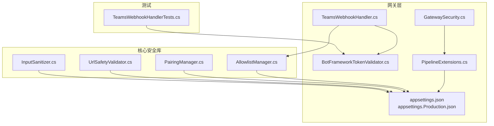
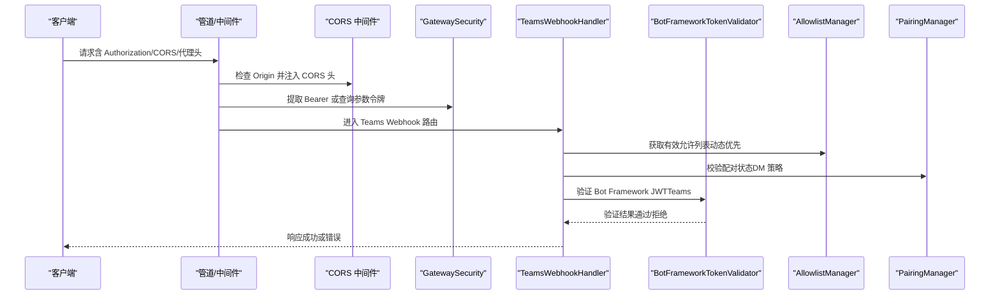
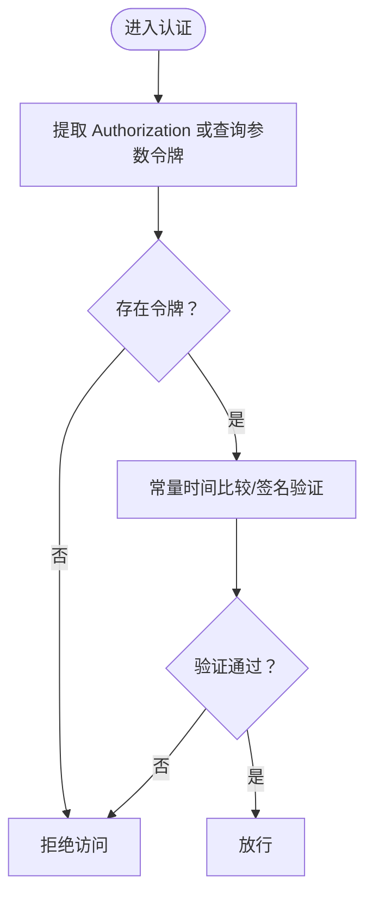
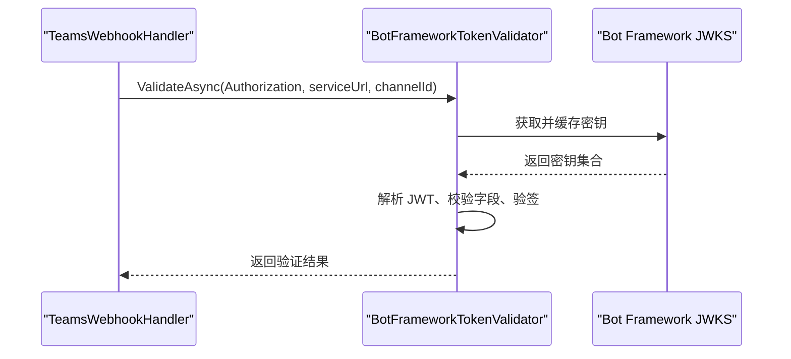
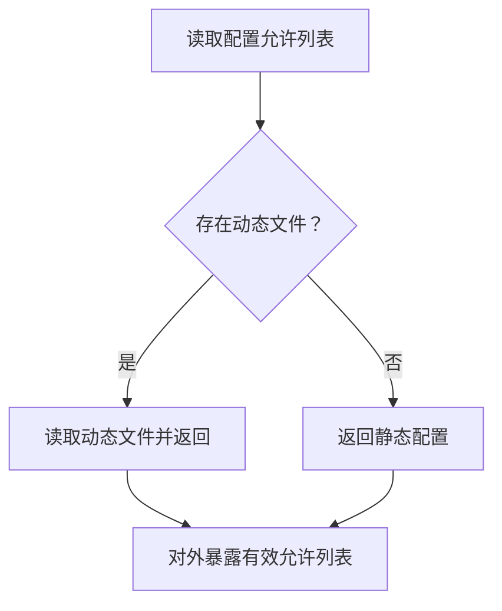
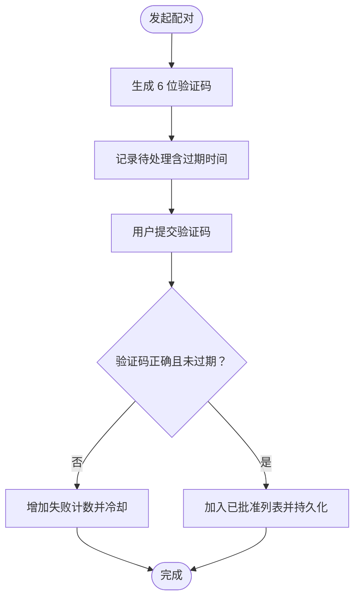
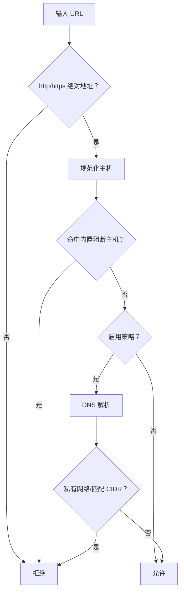
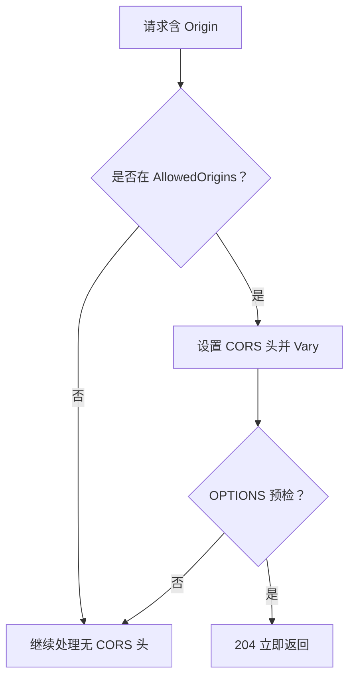
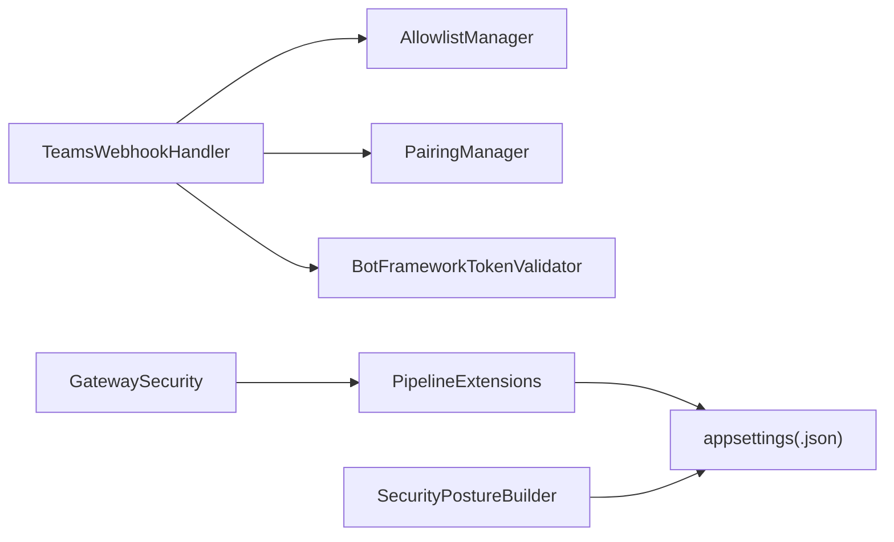

# 安全配置

<cite>
**本文引用的文件**
- [GatewaySecurity.cs](file://src/OpenClaw.Gateway/GatewaySecurity.cs)
- [BotFrameworkTokenValidator.cs](file://src/OpenClaw.Gateway/BotFrameworkTokenValidator.cs)
- [TeamsWebhookHandler.cs](file://src/OpenClaw.Gateway/TeamsWebhookHandler.cs)
- [AllowlistManager.cs](file://src/OpenClaw.Core/Security/AllowlistManager.cs)
- [PairingManager.cs](file://src/OpenClaw.Core/Security/PairingManager.cs)
- [UrlSafetyValidator.cs](file://src/OpenClaw.Core/Security/UrlSafetyValidator.cs)
- [InputSanitizer.cs](file://src/OpenClaw.Core/Security/InputSanitizer.cs)
- [PipelineExtensions.cs](file://src/OpenClaw.Gateway/Pipeline/PipelineExtensions.cs)
- [appsettings.json](file://src/OpenClaw.Gateway/appsettings.json)
- [appsettings.Production.json](file://src/OpenClaw.Gateway/appsettings.Production.json)
- [SecurityPostureBuilder.cs](file://src/OpenClaw.Gateway/SecurityPostureBuilder.cs)
- [GatewayConfig.cs](file://src/OpenClaw.Core/Models/GatewayConfig.cs)
- [TeamsWebhookHandlerTests.cs](file://src/OpenClaw.Tests/TeamsWebhookHandlerTests.cs)
</cite>

## 目录
1. [简介](#简介)
2. [项目结构](#项目结构)
3. [核心组件](#核心组件)
4. [架构总览](#架构总览)
5. [详细组件分析](#详细组件分析)
6. [依赖关系分析](#依赖关系分析)
7. [性能考量](#性能考量)
8. [故障排查指南](#故障排查指南)
9. [结论](#结论)
10. [附录](#附录)

## 简介
本文件面向网关安全配置，系统化梳理认证授权、访问控制、安全策略与实施细节，覆盖以下主题：
- 认证授权机制：Bearer Token 校验、查询参数令牌、HMAC 校验、OIDC 配置
- 授权与访问控制：允许列表（Allowlist）、配对（Pairing）流程、请求者匹配策略
- 安全策略实施：URL 安全校验、输入清理、浏览器会话安全
- TLS 与跨域：CORS 设置、代理信任、转发头处理
- 最佳实践、漏洞防护与合规建议
- 安全配置示例、威胁建模与审计要点

## 项目结构
围绕安全相关的关键代码分布于以下模块：
- 网关层（Gateway）：安全工具、令牌验证、CORS/代理配置、中间件管线
- 核心安全库（Core.Security）：允许列表、配对、URL 安全校验、输入清理
- 配置（appsettings）：绑定地址、端口、认证令牌、CORS、OIDC、工具策略等
- 测试（Tests）：Bot Framework 令牌验证测试用例

**图表来源**
- [GatewaySecurity.cs:1-109](file://src/OpenClaw.Gateway/GatewaySecurity.cs#L1-L109)
- [BotFrameworkTokenValidator.cs:1-410](file://src/OpenClaw.Gateway/BotFrameworkTokenValidator.cs#L1-L410)
- [TeamsWebhookHandler.cs:1-67](file://src/OpenClaw.Gateway/TeamsWebhookHandler.cs#L1-L67)
- [PipelineExtensions.cs:1-200](file://src/OpenClaw.Gateway/Pipeline/PipelineExtensions.cs#L1-L200)
- [appsettings.json:1-908](file://src/OpenClaw.Gateway/appsettings.json#L1-L908)
- [appsettings.Production.json:1-65](file://src/OpenClaw.Gateway/appsettings.Production.json#L1-L65)
- [AllowlistManager.cs:1-126](file://src/OpenClaw.Core/Security/AllowlistManager.cs#L1-L126)
- [PairingManager.cs:1-211](file://src/OpenClaw.Core/Security/PairingManager.cs#L1-L211)
- [UrlSafetyValidator.cs:1-219](file://src/OpenClaw.Core/Security/UrlSafetyValidator.cs#L1-L219)
- [InputSanitizer.cs:1-84](file://src/OpenClaw.Core/Security/InputSanitizer.cs#L1-L84)
- [TeamsWebhookHandlerTests.cs:1-69](file://src/OpenClaw.Tests/TeamsWebhookHandlerTests.cs#L1-L69)

**章节来源**
- [appsettings.json:1-908](file://src/OpenClaw.Gateway/appsettings.json#L1-L908)
- [appsettings.Production.json:1-65](file://src/OpenClaw.Gateway/appsettings.Production.json#L1-L65)
- [PipelineExtensions.cs:108-136](file://src/OpenClaw.Gateway/Pipeline/PipelineExtensions.cs#L108-L136)

## 核心组件
- Bearer Token 与查询参数令牌提取与校验
- HMAC SHA256 签名校验
- Bot Framework JWT 令牌验证（Teams）
- 允许列表（动态/静态合并）
- 配对（一次性验证码、过期与冷却、持久化）
- URL 安全策略（私有网络阻断、CIDR 黑名单、主机通配）
- 输入清理（Shell 元字符、CRLF、路径穿越、IMAP 文件夹名）
- CORS 与转发头（X-Forwarded-*）

**章节来源**
- [GatewaySecurity.cs:13-76](file://src/OpenClaw.Gateway/GatewaySecurity.cs#L13-L76)
- [BotFrameworkTokenValidator.cs:40-134](file://src/OpenClaw.Gateway/BotFrameworkTokenValidator.cs#L40-L134)
- [AllowlistManager.cs:50-51](file://src/OpenClaw.Core/Security/AllowlistManager.cs#L50-L51)
- [PairingManager.cs:53-124](file://src/OpenClaw.Core/Security/PairingManager.cs#L53-L124)
- [UrlSafetyValidator.cs:27-58](file://src/OpenClaw.Core/Security/UrlSafetyValidator.cs#L27-L58)
- [InputSanitizer.cs:24-82](file://src/OpenClaw.Core/Security/InputSanitizer.cs#L24-L82)
- [PipelineExtensions.cs:108-136](file://src/OpenClaw.Gateway/Pipeline/PipelineExtensions.cs#L108-L136)

## 架构总览
下图展示从入口到各安全组件的交互路径，包括 CORS、代理信任、令牌解析、Teams 令牌验证、允许列表与配对检查。

**图表来源**
- [PipelineExtensions.cs:108-136](file://src/OpenClaw.Gateway/Pipeline/PipelineExtensions.cs#L108-L136)
- [GatewaySecurity.cs:13-37](file://src/OpenClaw.Gateway/GatewaySecurity.cs#L13-L37)
- [TeamsWebhookHandler.cs:42-67](file://src/OpenClaw.Gateway/TeamsWebhookHandler.cs#L42-L67)
- [BotFrameworkTokenValidator.cs:40-134](file://src/OpenClaw.Gateway/BotFrameworkTokenValidator.cs#L40-L134)
- [AllowlistManager.cs:50-51](file://src/OpenClaw.Core/Security/AllowlistManager.cs#L50-L51)
- [PairingManager.cs:44-48](file://src/OpenClaw.Core/Security/PairingManager.cs#L44-L48)

## 详细组件分析

### 认证授权机制
- Bearer Token 提取与常量时间比较
  - 支持从 Authorization 头提取 Bearer 令牌，支持可选查询参数令牌（需显式开启）
  - 使用固定时间比较防止时序攻击
- HMAC SHA256 签名校验
  - 支持 sha256= 前缀与十六进制签名值解析
  - 固定时间比较验证签名有效性
- OIDC 配置
  - 支持 OIDC Authority、Audience、HTTPS 元数据要求等配置项

**图表来源**
- [GatewaySecurity.cs:13-76](file://src/OpenClaw.Gateway/GatewaySecurity.cs#L13-L76)
- [appsettings.json:98-101](file://src/OpenClaw.Gateway/appsettings.json#L98-L101)

**章节来源**
- [GatewaySecurity.cs:13-76](file://src/OpenClaw.Gateway/GatewaySecurity.cs#L13-L76)
- [appsettings.json:82-101](file://src/OpenClaw.Gateway/appsettings.json#L82-L101)

### Bot Framework 令牌验证（Teams）
- 校验步骤
  - 必须为 Bearer 令牌；算法必须为 RS256；发行方与受众匹配；过期与生效时间校验
  - serviceUrl 与活动中的 serviceUrl 必须一致
  - 从 JWKS 获取签名密钥，解析匹配 kid/x5t；校验通道背书（endorsements）
  - 使用 RSA-SHA256 验签
- 缓存与并发
  - OpenID/JWKS 元数据带 TTL 缓存，使用信号量避免并发刷新
- 测试覆盖
  - 单元测试验证有效令牌被接受、无效令牌被拒绝

**图表来源**
- [TeamsWebhookHandler.cs:42-67](file://src/OpenClaw.Gateway/TeamsWebhookHandler.cs#L42-L67)
- [BotFrameworkTokenValidator.cs:40-134](file://src/OpenClaw.Gateway/BotFrameworkTokenValidator.cs#L40-L134)

**章节来源**
- [BotFrameworkTokenValidator.cs:15-134](file://src/OpenClaw.Gateway/BotFrameworkTokenValidator.cs#L15-L134)
- [TeamsWebhookHandler.cs:15-40](file://src/OpenClaw.Gateway/TeamsWebhookHandler.cs#L15-L40)
- [TeamsWebhookHandlerTests.cs:18-69](file://src/OpenClaw.Tests/TeamsWebhookHandlerTests.cs#L18-L69)

### 允许列表管理
- 动态与静态合并
  - 动态文件优先于静态配置；动态文件按频道命名持久化
- 路径安全
  - 对频道 ID 进行安全清洗，去除非法字符并避免目录遍历
- 读写一致性
  - 写入采用临时文件 + 原子替换，失败回滚

**图表来源**
- [AllowlistManager.cs:32-51](file://src/OpenClaw.Core/Security/AllowlistManager.cs#L32-L51)

**章节来源**
- [AllowlistManager.cs:19-126](file://src/OpenClaw.Core/Security/AllowlistManager.cs#L19-L126)

### 配对管理机制
- 一次性验证码生成与过期
  - 10 分钟有效期；失败尝试次数上限与冷却时间
- 固定时间比较验证码
- 手动批准与撤销
- 持久化已批准发送者列表

**图表来源**
- [PairingManager.cs:53-124](file://src/OpenClaw.Core/Security/PairingManager.cs#L53-L124)

**章节来源**
- [PairingManager.cs:14-211](file://src/OpenClaw.Core/Security/PairingManager.cs#L14-L211)

### URL 安全验证与输入清理
- URL 安全策略
  - 仅允许绝对 http/https；内置阻断主机（localhost、metadata.* 等）
  - 可选阻断私有网络目标与 CIDR 黑名单；支持 DNS 解析后校验
- 输入清理
  - Shell 元字符检测与报错
  - CRLF 剥离（IMAP/SMTP）
  - 路径穿越与空字节检测、IMAP 文件夹名控制字符限制

**图表来源**
- [UrlSafetyValidator.cs:27-135](file://src/OpenClaw.Core/Security/UrlSafetyValidator.cs#L27-L135)
- [InputSanitizer.cs:24-82](file://src/OpenClaw.Core/Security/InputSanitizer.cs#L24-L82)

**章节来源**
- [UrlSafetyValidator.cs:17-219](file://src/OpenClaw.Core/Security/UrlSafetyValidator.cs#L17-L219)
- [InputSanitizer.cs:9-84](file://src/OpenClaw.Core/Security/InputSanitizer.cs#L9-L84)

### TLS、跨域与 CORS
- CORS
  - 仅对白名单 Origin 注入 Access-Control-Allow-* 头；预检 OPTIONS 直接响应
- 代理与转发头
  - 可选择信任 X-Forwarded-For/X-Forwarded-Proto，并配置 KnownProxies
- 生产环境建议
  - 公网绑定时建议启用 TrustForwardedHeaders 并明确 KnownProxies
  - 默认禁止在公网绑定上启用不安全工具与插件桥

**图表来源**
- [PipelineExtensions.cs:108-136](file://src/OpenClaw.Gateway/Pipeline/PipelineExtensions.cs#L108-L136)
- [appsettings.Production.json:22-30](file://src/OpenClaw.Gateway/appsettings.Production.json#L22-L30)

**章节来源**
- [PipelineExtensions.cs:88-106](file://src/OpenClaw.Gateway/Pipeline/PipelineExtensions.cs#L88-L106)
- [appsettings.json:82-102](file://src/OpenClaw.Gateway/appsettings.json#L82-L102)
- [appsettings.Production.json:22-30](file://src/OpenClaw.Gateway/appsettings.Production.json#L22-L30)

## 依赖关系分析
- 组件耦合
  - TeamsWebhookHandler 依赖 AllowlistManager、PairingManager、BotFrameworkTokenValidator
  - GatewaySecurity 为通用安全工具，被路由与中间件广泛调用
  - PipelineExtensions 将 CORS 与转发头配置注入应用管道
- 配置驱动
  - appsettings 与 appsettings.Production.json 提供安全策略、CORS、OIDC、工具策略等
- 安全态势构建
  - SecurityPostureBuilder 基于配置评估签名验证就绪度、原始密钥引用风险等

**图表来源**
- [TeamsWebhookHandler.cs:15-40](file://src/OpenClaw.Gateway/TeamsWebhookHandler.cs#L15-L40)
- [AllowlistManager.cs:19-30](file://src/OpenClaw.Core/Security/AllowlistManager.cs#L19-L30)
- [PairingManager.cs:14-39](file://src/OpenClaw.Core/Security/PairingManager.cs#L14-L39)
- [BotFrameworkTokenValidator.cs:15-38](file://src/OpenClaw.Gateway/BotFrameworkTokenValidator.cs#L15-L38)
- [PipelineExtensions.cs:108-136](file://src/OpenClaw.Gateway/Pipeline/PipelineExtensions.cs#L108-L136)
- [appsettings.json:82-102](file://src/OpenClaw.Gateway/appsettings.json#L82-L102)
- [SecurityPostureBuilder.cs:141-149](file://src/OpenClaw.Gateway/SecurityPostureBuilder.cs#L141-L149)

**章节来源**
- [SecurityPostureBuilder.cs:141-168](file://src/OpenClaw.Gateway/SecurityPostureBuilder.cs#L141-L168)
- [appsettings.json:82-102](file://src/OpenClaw.Gateway/appsettings.json#L82-L102)

## 性能考量
- 令牌与签名验证
  - 使用固定时间比较与哈希计算，避免时序信息泄露
- JWKS 缓存
  - Bot Framework 密钥元数据带 TTL 缓存，减少外部依赖抖动
- DNS 解析
  - URL 安全校验在需要时进行 DNS 解析，注意超时与异常处理
- CORS 预检
  - 对 OPTIONS 预检直接短路返回，降低额外开销

[本节为通用指导，无需特定文件引用]

## 故障排查指南
- Teams 令牌验证失败
  - 检查发行方、受众、serviceUrl 是否匹配；确认密钥缓存是否过期
  - 查看日志中“Rejected Teams JWT”警告
- CORS 不生效
  - 确认 Origin 在 AllowedOrigins 列表；检查是否正确注入 Access-Control-* 头
- 公网绑定安全告警
  - 生产配置默认禁止在公网绑定上启用不安全工具与插件桥；请通过反向代理与 TLS 强化后再启用
- 配对验证码无效
  - 检查验证码是否过期、失败次数是否超过阈值、是否处于冷却窗口

**章节来源**
- [BotFrameworkTokenValidator.cs:129-133](file://src/OpenClaw.Gateway/BotFrameworkTokenValidator.cs#L129-L133)
- [PipelineExtensions.cs:113-132](file://src/OpenClaw.Gateway/Pipeline/PipelineExtensions.cs#L113-L132)
- [appsettings.Production.json:22-30](file://src/OpenClaw.Gateway/appsettings.Production.json#L22-L30)
- [PairingManager.cs:85-98](file://src/OpenClaw.Core/Security/PairingManager.cs#L85-L98)

## 结论
本安全配置以“最小权限、纵深防御”为核心原则，结合令牌校验、允许列表、配对流程、URL 安全与输入清理，形成完整的网关安全闭环。生产部署建议：
- 明确代理与 TLS，启用 CORS 白名单
- 严格限制公网绑定上的工具与插件
- 使用 OIDC 与签名验证，定期轮换密钥
- 启用 URL 安全策略与输入清理，阻断私网与 CIDR 黑名单

[本节为总结性内容，无需特定文件引用]

## 附录

### 安全配置示例（摘自配置文件）
- 绑定与认证
  - 绑定地址、端口、全局认证令牌
- CORS 与代理
  - AllowedOrigins、TrustForwardedHeaders、KnownProxies
- OIDC
  - OidcAuthority、OidcAudience、OidcRequireHttpsMetadata
- 工具与浏览器策略
  - AllowUnsafeToolingOnPublicBind、AllowPluginBridgeOnPublicBind、AllowRawSecretRefsOnPublicBind
- Teams 通道
  - ValidateToken、WebhookPath、AppId/AppPassword/TenantId 等

**章节来源**
- [appsettings.json:3-101](file://src/OpenClaw.Gateway/appsettings.json#L3-L101)
- [appsettings.Production.json:22-30](file://src/OpenClaw.Gateway/appsettings.Production.json#L22-L30)

### 威胁模型与缓解
- 威胁类型
  - 未授权访问（令牌伪造/泄露）、CORS 滥用、内网探测（私网/元数据）、命令注入（Shell/IMAP）
- 缓解措施
  - 强令牌校验（Bearer/HMAC）、CORS 白名单、URL 安全策略、输入清理、配对与允许列表

[本节为概念性内容，无需特定文件引用]

### 安全审计清单
- 配置审计
  - 是否启用公网绑定不安全能力；是否使用 env: 引用而非明文密钥
- 运行审计
  - 是否启用签名验证就绪度检查；是否配置 KnownProxies
- 日志审计
  - 关注 Teams JWT 验证失败、CORS 预检、配对失败与冷却触发

**章节来源**
- [SecurityPostureBuilder.cs:141-168](file://src/OpenClaw.Gateway/SecurityPostureBuilder.cs#L141-L168)
- [appsettings.json:82-102](file://src/OpenClaw.Gateway/appsettings.json#L82-L102)